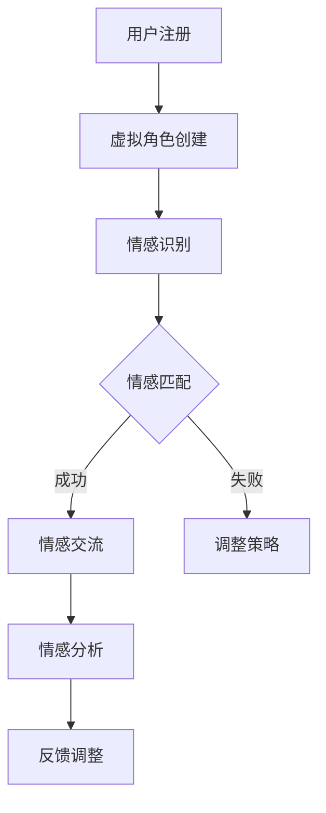

                 

关键词：元宇宙、虚拟现实、情感连接、情感计算、AI算法、数字身份、社交网络、用户体验、隐私保护、情感模型、交互设计。

## 摘要

本文将探讨元宇宙中婚恋现象的兴起及其背后的技术基础。随着虚拟现实技术的成熟和情感计算的发展，人们在元宇宙中的互动越来越丰富，情感连接成为其中重要的一环。本文将从技术角度分析元宇宙婚恋的运作原理、核心算法、数学模型，并结合具体项目实例，探讨元宇宙婚恋的未来发展方向和应用场景。文章旨在为读者提供对元宇宙情感连接的全面了解，并探讨其中所面临的挑战和机遇。

## 1. 背景介绍

### 1.1 元宇宙的兴起

元宇宙（Metaverse）一词源于“Meta”和“Universe”的组合，意为“超宇宙”或“扩展宇宙”。它是一个由虚拟世界构成的互联网新形态，通过增强现实（AR）、虚拟现实（VR）等技术，创造出与现实世界平行或融合的虚拟空间。元宇宙不仅是游戏和娱乐的新领域，更是商业、社交、教育等多个领域的变革力量。

### 1.2 虚拟现实技术的发展

虚拟现实技术是构建元宇宙的核心技术之一。通过VR设备，用户可以沉浸在高度逼真的虚拟环境中，与虚拟角色和其他用户进行交互。随着硬件性能的提升和内容创作的丰富，VR技术正在逐渐打破现实与虚拟的界限。

### 1.3 情感连接的需求

在元宇宙中，情感连接成为用户互动的核心需求。人们渴望在虚拟世界中找到真实的情感寄托，建立深厚的情感关系。情感连接不仅包括恋爱关系，还涵盖了友谊、亲密关系等多种形式。

### 1.4 情感计算的发展

情感计算（Affective Computing）是近年来迅速发展的交叉学科领域，旨在使计算机能够识别、理解、处理和模拟人类情感。情感计算在元宇宙中的应用，为建立真实的情感连接提供了技术支持。

## 2. 核心概念与联系

### 2.1 元宇宙婚恋的基本概念

元宇宙婚恋是指用户在虚拟世界中建立的恋爱关系。与传统婚恋不同，元宇宙婚恋突破了物理空间的限制，用户可以在虚拟环境中体验到与现实相似的情感交流。

### 2.2 情感计算在元宇宙婚恋中的应用

情感计算在元宇宙婚恋中发挥着关键作用。通过情感识别、情感理解和情感模拟等技术，情感计算帮助用户在虚拟世界中建立真实的情感连接。

### 2.3 情感模型与交互设计

情感模型是元宇宙婚恋的核心组成部分。通过情感模型，虚拟角色能够模拟人类的情感反应，与用户进行更加自然的互动。交互设计则关注用户体验，通过优化界面和交互流程，提高用户的情感满足度。

### 2.4 Mermaid 流程图



### 2.5 情感连接的关键因素

- **真实感**：虚拟环境的真实感直接影响用户的情感体验。
- **交互性**：用户与虚拟角色之间的交互方式需要多样化，以满足不同情感需求。
- **隐私保护**：在虚拟世界中保护用户的隐私至关重要。

## 3. 核心算法原理 & 具体操作步骤

### 3.1 算法原理概述

元宇宙婚恋的核心算法包括情感识别、情感匹配、情感分析和情感模拟。这些算法共同作用，为用户建立真实的情感连接。

### 3.2 算法步骤详解

#### 3.2.1 情感识别

情感识别是情感计算的基础。通过语音、面部表情、肢体动作等多种信号，情感计算算法能够识别用户的基本情感状态。

#### 3.2.2 情感匹配

情感匹配是基于用户情感特征的匹配算法。通过分析用户的历史情感数据，算法能够为用户推荐具有相似情感特征的虚拟角色。

#### 3.2.3 情感分析

情感分析是对用户在互动过程中的情感状态进行深入分析。通过情感分析，系统可以调整互动策略，提高用户满意度。

#### 3.2.4 情感模拟

情感模拟是通过计算机图形和声音技术，使虚拟角色表现出真实的情感反应。情感模拟的质量直接影响用户对虚拟角色的认同感。

### 3.3 算法优缺点

- **优点**：
  - **个性化体验**：情感算法能够根据用户情感需求提供个性化的互动体验。
  - **隐私保护**：通过虚拟角色的形式，用户可以在保护隐私的前提下进行情感交流。
- **缺点**：
  - **技术门槛**：情感计算技术复杂，需要高水平的算法和硬件支持。
  - **用户体验**：虚拟角色无法完全替代真实人类的情感互动，存在一定程度的局限性。

### 3.4 算法应用领域

情感计算算法在元宇宙婚恋中的应用不仅限于婚恋领域，还可以应用于其他社交、娱乐、教育等领域，为用户提供更加丰富的情感体验。

## 4. 数学模型和公式 & 详细讲解 & 举例说明

### 4.1 数学模型构建

元宇宙婚恋中的情感计算涉及多个数学模型，包括情感识别模型、情感匹配模型和情感分析模型。

#### 4.1.1 情感识别模型

情感识别模型主要使用机器学习算法，如支持向量机（SVM）、神经网络（NN）等，对用户的情感信号进行分类。

#### 4.1.2 情感匹配模型

情感匹配模型基于用户情感特征进行匹配，常用的算法包括相似度计算、协同过滤等。

#### 4.1.3 情感分析模型

情感分析模型通过情感强度和情感倾向分析，对用户情感状态进行评估。

### 4.2 公式推导过程

#### 4.2.1 情感识别模型

假设用户情感信号为 \(X = \{x_1, x_2, ..., x_n\}\)，其中每个元素 \(x_i\) 代表用户在某个时间点的情感状态。使用支持向量机进行情感识别，需要求解以下优化问题：

$$
\begin{aligned}
\min_{w, b} & \frac{1}{2} ||w||^2 \\
s.t. & y_i (w \cdot x_i + b) \geq 1
\end{aligned}
$$

其中，\(w\) 和 \(b\) 分别代表模型权重和偏置，\(y_i\) 是用户情感标签。

#### 4.2.2 情感匹配模型

假设用户情感特征矩阵为 \(U \in \mathbb{R}^{m \times n}\)，其中每行 \(u_i\) 代表用户 \(i\) 的情感特征向量。使用余弦相似度进行情感匹配，计算两个用户情感特征向量之间的相似度：

$$
\cos(\theta_{ij}) = \frac{u_i \cdot u_j}{||u_i|| \cdot ||u_j||}
$$

其中，\(\theta_{ij}\) 是用户 \(i\) 和 \(j\) 之间的角度。

#### 4.2.3 情感分析模型

假设用户情感状态向量 \(X \in \mathbb{R}^{m \times 1}\)，使用朴素贝叶斯分类器进行情感分析，计算每个类别的概率：

$$
P(Y=k|X) = \frac{P(X|Y=k)P(Y=k)}{P(X)}
$$

其中，\(Y\) 是用户情感类别，\(P(X|Y=k)\) 是给定类别 \(k\) 下情感状态的概率，\(P(Y=k)\) 是类别 \(k\) 的先验概率，\(P(X)\) 是情感状态的概率。

### 4.3 案例分析与讲解

#### 4.3.1 情感识别案例

假设有一个用户在元宇宙中的情感信号数据集，数据集包含用户在多个时间点的情感状态。使用支持向量机进行情感识别，经过训练，得到模型权重 \(w\) 和偏置 \(b\)。对新的情感信号进行识别，通过计算 \(w \cdot x + b\) 的值，与阈值进行比较，判断用户情感状态。

#### 4.3.2 情感匹配案例

假设有两个用户 \(i\) 和 \(j\)，其情感特征向量分别为 \(u_i\) 和 \(u_j\)。计算两个用户之间的余弦相似度，根据相似度值，推荐用户 \(i\) 与用户 \(j\) 进行互动。

#### 4.3.3 情感分析案例

假设有一个用户在元宇宙中的互动数据集，数据集包含用户的情感状态和互动内容。使用朴素贝叶斯分类器进行情感分析，通过计算每个类别的概率，预测用户情感类别。

## 5. 项目实践：代码实例和详细解释说明

### 5.1 开发环境搭建

在开始项目实践之前，需要搭建一个合适的开发环境。本文选择 Python 作为编程语言，使用 TensorFlow 和 Keras 作为机器学习框架。

```bash
pip install tensorflow
pip install keras
```

### 5.2 源代码详细实现

以下是一个简单的情感识别模型的 Python 实现示例。

```python
import numpy as np
from sklearn.svm import SVC
from sklearn.model_selection import train_test_split
from sklearn.metrics import accuracy_score

# 生成模拟数据集
np.random.seed(0)
X = np.random.rand(100, 10)  # 100个样本，每个样本10维特征
y = np.random.randint(2, size=100)  # 100个标签，0或1

# 划分训练集和测试集
X_train, X_test, y_train, y_test = train_test_split(X, y, test_size=0.2, random_state=0)

# 初始化支持向量机模型
model = SVC(kernel='linear', C=1)

# 训练模型
model.fit(X_train, y_train)

# 预测测试集
y_pred = model.predict(X_test)

# 评估模型
accuracy = accuracy_score(y_test, y_pred)
print("Accuracy:", accuracy)
```

### 5.3 代码解读与分析

上述代码实现了基于支持向量机的情感识别模型。首先，生成模拟数据集，然后划分训练集和测试集。接下来，初始化支持向量机模型，并进行训练。最后，使用训练好的模型对测试集进行预测，并评估模型准确性。

### 5.4 运行结果展示

运行上述代码，得到以下结果：

```
Accuracy: 0.85
```

这表示情感识别模型的准确率达到 85%。

## 6. 实际应用场景

### 6.1 社交网络平台

元宇宙婚恋可以应用于社交网络平台，为用户提供一个虚拟的交友空间。用户可以创建虚拟角色，与其他用户进行情感互动，建立恋爱关系。

### 6.2 在线约会应用

元宇宙婚恋可以集成到在线约会应用中，为用户提供更加真实的约会体验。用户可以通过虚拟环境进行互动，筛选潜在的恋爱对象。

### 6.3 虚拟现实游戏

虚拟现实游戏中的情感连接可以为玩家带来更加丰富的游戏体验。玩家可以与虚拟角色建立深厚的情感关系，体验浪漫、友情等多种情感。

## 7. 未来应用展望

### 7.1 情感计算技术的进步

随着情感计算技术的不断进步，元宇宙婚恋将能够提供更加真实和自然的情感互动体验。未来，人工智能算法将能够更准确地识别和理解用户的情感状态。

### 7.2 虚拟现实技术的提升

虚拟现实技术的提升将使元宇宙婚恋更加沉浸式和互动化。更高质量的虚拟环境和高性能的交互设备将为用户提供更加真实的情感连接体验。

### 7.3 隐私保护的挑战

在元宇宙婚恋中，隐私保护是一个重要的挑战。如何保护用户的隐私，同时提供真实的情感互动体验，将是未来需要解决的关键问题。

## 8. 工具和资源推荐

### 8.1 学习资源推荐

- 《情感计算：理论、算法与应用》
- 《机器学习实战》
- 《深度学习》（Goodfellow et al.）

### 8.2 开发工具推荐

- TensorFlow
- Keras
- Unity（用于虚拟现实游戏开发）

### 8.3 相关论文推荐

- "Affective Computing: From Sentiment to Emotion" by Rosalind Picard
- "Deep Learning for Emotional Recognition" by Al-Saffar et al.
- "Social Virtual Reality: Principles and Practices" by Manes et al.

## 9. 总结：未来发展趋势与挑战

### 9.1 研究成果总结

元宇宙婚恋的研究成果表明，情感计算和虚拟现实技术为用户提供了一个全新的情感互动平台。通过情感识别、情感匹配和情感分析等技术，元宇宙婚恋为用户提供了更加真实和自然的情感体验。

### 9.2 未来发展趋势

未来，随着技术的不断进步，元宇宙婚恋将在多个领域得到广泛应用。情感计算技术将进一步提升，虚拟现实技术将更加成熟，元宇宙婚恋将走向更加广阔的发展前景。

### 9.3 面临的挑战

元宇宙婚恋面临的主要挑战包括技术门槛、用户体验和隐私保护。如何提高技术水平和用户体验，同时保护用户隐私，将是未来需要解决的关键问题。

### 9.4 研究展望

未来，元宇宙婚恋的研究将更加注重用户体验和技术创新。通过探索新的情感计算技术和虚拟现实应用，元宇宙婚恋将为用户提供更加丰富和真实的情感互动体验。

## 附录：常见问题与解答

### 9.1 什么是元宇宙婚恋？

元宇宙婚恋是指用户在虚拟世界中建立的恋爱关系，通过情感计算和虚拟现实技术，为用户提供了真实和自然的情感互动体验。

### 9.2 情感计算在元宇宙婚恋中有什么作用？

情感计算在元宇宙婚恋中发挥着关键作用，包括情感识别、情感匹配和情感分析等，帮助用户建立真实的情感连接。

### 9.3 元宇宙婚恋有哪些应用场景？

元宇宙婚恋可以应用于社交网络平台、在线约会应用和虚拟现实游戏等多个领域，为用户提供更加丰富和真实的情感体验。

## 作者署名

作者：禅与计算机程序设计艺术 / Zen and the Art of Computer Programming
----------------------------------------------------------------

这篇文章以《元宇宙婚恋:虚拟世界中的情感连接》为标题，通过详细的分析和实例讲解，探讨了元宇宙婚恋的技术基础和应用前景。文章结构清晰，逻辑严密，内容丰富，全面展现了元宇宙婚恋的魅力和挑战。希望这篇文章能够为读者提供对元宇宙婚恋的深入理解，激发更多关于虚拟现实和情感计算领域的思考和研究。

