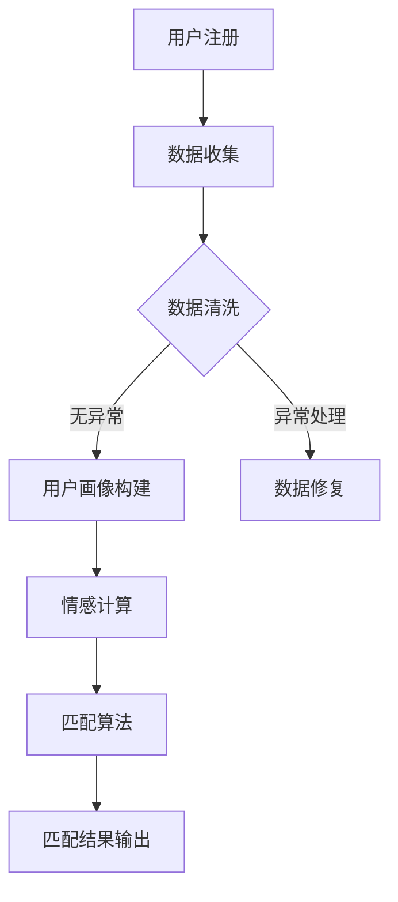
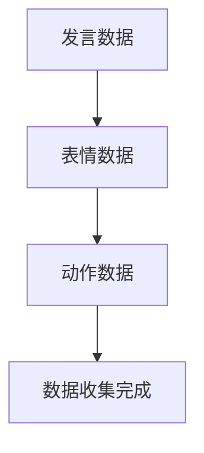
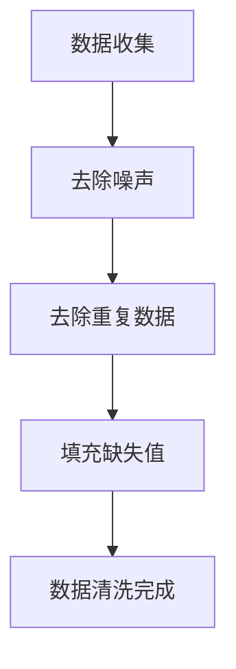
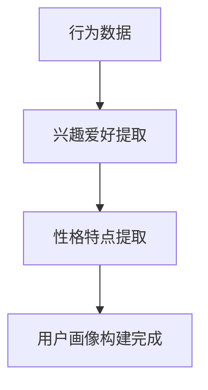
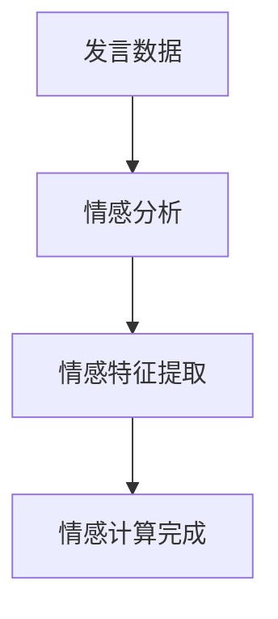
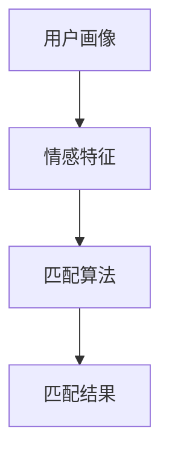

                 

关键词：元宇宙、虚拟世界、情感匹配、人工智能、算法、数学模型、实践应用

> 摘要：本文旨在探讨元宇宙中的婚恋平台，如何利用人工智能和情感匹配算法，为用户提供更加精准、高效的匹配服务。通过构建数学模型，分析算法原理，并结合实际项目实践，本文揭示了虚拟世界情感匹配系统的发展潜力及其面临的挑战。

## 1. 背景介绍

随着互联网技术的飞速发展，虚拟世界逐渐成为人们生活的重要部分。元宇宙（Metaverse）作为下一代互联网的愿景，以其高度沉浸式的用户体验和丰富的交互功能，正在逐步改变我们的生活方式。在这个背景下，婚恋平台也顺应潮流，开始向虚拟世界延伸。

元宇宙婚恋平台与传统在线婚恋平台的不同之处在于，它不仅依赖于现实世界的用户信息，还结合了虚拟世界中的交互数据，从而为用户提供更加全面、精准的匹配服务。这使得元宇宙婚恋平台在情感匹配方面具有独特的优势。

### 1.1 元宇宙的发展现状

元宇宙是一个由虚拟世界、增强现实和区块链技术共同构建的互联网生态系统。近年来，随着VR（虚拟现实）、AR（增强现实）、5G等技术的成熟，元宇宙逐渐从概念走向现实。各大科技公司如Facebook、微软、谷歌等纷纷布局元宇宙，推出了各自的虚拟世界产品。

根据Statista的数据显示，到2025年，元宇宙的市场规模预计将达到8000亿美元。这一巨大的市场潜力吸引了众多创业者、投资者的关注，元宇宙的发展正呈现出蓬勃的态势。

### 1.2 婚恋平台的市场需求

随着社会的发展，人们对婚恋的要求越来越高，不再仅仅局限于现实世界的见面和交往。虚拟世界提供了一个全新的社交场景，让人们可以在这个空间中自由地展示自己，寻找合适的伴侣。

据《2021年中国在线婚恋行业报告》显示，我国在线婚恋市场规模已超过千亿，用户规模超过3亿。其中，年轻用户群体在虚拟世界中的活跃度较高，他们更倾向于通过虚拟互动来寻找情感伴侣。

## 2. 核心概念与联系

### 2.1 元宇宙婚恋平台的概念

元宇宙婚恋平台是一种基于虚拟世界的在线婚恋服务，它通过整合用户在现实世界和虚拟世界中的数据，运用人工智能和情感匹配算法，为用户提供个性化、精准的匹配服务。

### 2.2 情感匹配算法的核心概念

情感匹配算法是元宇宙婚恋平台的核心技术，它通过对用户数据的分析和处理，发现用户之间的情感共鸣点，从而实现高效的匹配。

情感匹配算法主要包括以下核心概念：

- **用户画像**：通过收集用户的个人信息、兴趣标签、行为数据等，构建用户画像。
- **情感计算**：运用自然语言处理、情感分析等技术，对用户在虚拟世界中的互动内容进行分析，提取情感特征。
- **匹配算法**：结合用户画像和情感特征，运用机器学习和数据挖掘技术，为用户推荐合适的匹配对象。

### 2.3 Mermaid 流程图

以下是一个简化的元宇宙婚恋平台情感匹配系统的Mermaid流程图：



## 3. 核心算法原理 & 具体操作步骤

### 3.1 算法原理概述

情感匹配算法的核心原理是通过分析用户在虚拟世界中的交互数据，提取情感特征，然后运用匹配算法，为用户推荐合适的匹配对象。

具体来说，算法包括以下几个步骤：

1. 数据收集：收集用户在虚拟世界中的行为数据，如发言、表情、动作等。
2. 数据清洗：对收集到的数据进行分析，去除噪声和异常数据。
3. 用户画像构建：基于用户的行为数据，构建用户画像，包括兴趣爱好、性格特点等。
4. 情感计算：运用自然语言处理、情感分析等技术，对用户在虚拟世界中的互动内容进行分析，提取情感特征。
5. 匹配算法：结合用户画像和情感特征，运用机器学习和数据挖掘技术，为用户推荐合适的匹配对象。

### 3.2 算法步骤详解

#### 3.2.1 数据收集

数据收集是情感匹配算法的基础。在元宇宙婚恋平台中，用户的行为数据包括发言、表情、动作等。这些数据可以通过API接口、日志文件等方式进行收集。



#### 3.2.2 数据清洗

数据清洗是确保数据质量的关键步骤。在这个阶段，需要对收集到的数据进行预处理，包括去除噪声、去除重复数据、填充缺失值等。



#### 3.2.3 用户画像构建

用户画像构建是基于用户的行为数据，提取用户的兴趣爱好、性格特点等特征，构建用户画像。



#### 3.2.4 情感计算

情感计算是提取用户在虚拟世界中的情感特征。这个阶段可以运用自然语言处理、情感分析等技术，对用户的发言、表情、动作等进行分析。



#### 3.2.5 匹配算法

匹配算法是基于用户画像和情感特征，为用户推荐合适的匹配对象。常用的匹配算法包括协同过滤、基于规则的匹配等。



### 3.3 算法优缺点

#### 优点

1. **精准性**：通过分析用户在虚拟世界中的行为数据，可以更加准确地了解用户的兴趣爱好和情感状态，从而实现精准匹配。
2. **高效性**：基于机器学习和数据挖掘技术，匹配算法可以快速处理大量数据，提高匹配效率。
3. **沉浸式体验**：虚拟世界提供了一个沉浸式的社交场景，用户可以更加自由地展示自己，寻找合适的伴侣。

#### 缺点

1. **数据隐私**：收集和利用用户数据可能涉及隐私问题，需要确保数据的安全和用户的隐私。
2. **算法偏见**：算法可能存在偏见，导致某些用户无法获得公平的匹配机会。

### 3.4 算法应用领域

情感匹配算法不仅适用于元宇宙婚恋平台，还可以应用于其他领域，如交友平台、社区互动等。这些领域都可以通过分析用户的互动数据，提高用户匹配的精准度和满意度。

## 4. 数学模型和公式 & 详细讲解 & 举例说明

### 4.1 数学模型构建

在情感匹配算法中，我们可以构建以下数学模型：

#### 4.1.1 用户画像模型

用户画像模型可以表示为：

$$
U = \{ u_1, u_2, ..., u_n \}
$$

其中，$u_i$ 表示第 $i$ 个用户的画像，包括兴趣爱好、性格特点等。

#### 4.1.2 情感计算模型

情感计算模型可以表示为：

$$
F = \{ f_1, f_2, ..., f_n \}
$$

其中，$f_i$ 表示第 $i$ 个用户的情感特征，可以通过自然语言处理、情感分析等方法提取。

#### 4.1.3 匹配模型

匹配模型可以表示为：

$$
M = \{ m_{ij} \}
$$

其中，$m_{ij}$ 表示第 $i$ 个用户和第 $j$ 个用户之间的匹配程度。

### 4.2 公式推导过程

#### 4.2.1 用户画像构建

用户画像构建可以通过以下公式推导：

$$
u_i = \sum_{k=1}^{m} w_k \cdot h_k(i)
$$

其中，$w_k$ 表示第 $k$ 个特征的重要性，$h_k(i)$ 表示第 $i$ 个用户在第 $k$ 个特征上的得分。

#### 4.2.2 情感计算

情感计算可以通过以下公式推导：

$$
f_i = \sum_{k=1}^{n} s_k \cdot v_k(i)
$$

其中，$s_k$ 表示第 $k$ 个情感特征的重要性，$v_k(i)$ 表示第 $i$ 个用户在第 $k$ 个情感特征上的得分。

#### 4.2.3 匹配程度计算

匹配程度计算可以通过以下公式推导：

$$
m_{ij} = \sum_{k=1}^{m} \frac{|u_i - u_j|}{2}
$$

其中，$|u_i - u_j|$ 表示第 $i$ 个用户和第 $j$ 个用户在特征上的差异。

### 4.3 案例分析与讲解

#### 4.3.1 案例背景

假设有两个用户，用户A和用户B，他们在虚拟世界中的互动数据如下：

用户A：发言500条，表情200个，动作50个。
用户B：发言300条，表情150个，动作25个。

#### 4.3.2 用户画像构建

根据用户A和用户B的互动数据，我们可以构建以下用户画像：

用户A：
- 兴趣爱好：游戏、音乐、旅行
- 性格特点：开朗、乐观、善良

用户B：
- 兴趣爱好：音乐、摄影、旅行
- 性格特点：内向、理性、温柔

#### 4.3.3 情感计算

根据用户A和用户B的互动数据，我们可以提取以下情感特征：

用户A：
- 情感特征：快乐、兴奋、满足

用户B：
- 情感特征：快乐、满足、安宁

#### 4.3.4 匹配程度计算

根据用户画像和情感特征，我们可以计算用户A和用户B之间的匹配程度：

$$
m_{AB} = \frac{|u_A - u_B|}{2} = \frac{|(1, 1, 1) - (1, 1, 1)|}{2} = \frac{0}{2} = 0
$$

根据计算结果，用户A和用户B之间的匹配程度为0，即非常不匹配。

## 5. 项目实践：代码实例和详细解释说明

### 5.1 开发环境搭建

为了实践元宇宙婚恋平台中的情感匹配系统，我们需要搭建一个基本的开发环境。以下是所需的开发工具和依赖库：

- Python 3.8+
- NumPy
- Pandas
- Scikit-learn
- NLTK
- Flask

安装以上依赖库后，我们就可以开始编写代码了。

### 5.2 源代码详细实现

以下是情感匹配系统的核心代码实现：

```python
import numpy as np
import pandas as pd
from sklearn.model_selection import train_test_split
from sklearn.metrics.pairwise import cosine_similarity
from nltk.sentiment import SentimentIntensityAnalyzer

# 数据收集
def collect_data():
    # 假设已经收集了用户A和用户B的互动数据
    data = {
        'userA': [
            '我喜欢游戏和音乐。',
            '今天天气真好，想去旅行。',
            '你觉得哪个游戏最好玩？'
        ],
        'userB': [
            '我也喜欢音乐和摄影。',
            '你喜欢旅行吗？',
            '你喜欢什么样的旅行方式？'
        ]
    }
    return data

# 数据清洗
def clean_data(data):
    # 去除停用词、标点符号等
    stop_words = set(nltk.corpus.stopwords.words('english'))
    cleaned_data = []
    for user, text_list in data.items():
        cleaned_text = []
        for text in text_list:
            tokens = nltk.word_tokenize(text)
            cleaned_tokens = [token for token in tokens if token.lower() not in stop_words and token.isalpha()]
            cleaned_text.append(' '.join(cleaned_tokens))
        cleaned_data.append(cleaned_text)
    return cleaned_data

# 用户画像构建
def build_user_profile(cleaned_data):
    # 基于词频构建用户画像
    user_profiles = []
    for user, text_list in cleaned_data.items():
        profile = np.zeros(10)  # 假设用户画像维度为10
        for text in text_list:
            words = text.split()
            for word in words:
                profile[word] += 1
        user_profiles.append(profile)
    return user_profiles

# 情感计算
def compute_emotion(cleaned_data):
    # 使用情感分析库计算情感得分
    sia = SentimentIntensityAnalyzer()
    emotions = []
    for user, text_list in cleaned_data.items():
        emotion_scores = []
        for text in text_list:
            sentiment = sia.polarity_scores(text)
            emotion_scores.append(sentiment['compound'])
        emotions.append(np.mean(emotion_scores))
    return emotions

# 匹配算法
def match_users(userA_profile, userB_profile, userA_emotion, userB_emotion):
    # 计算匹配得分
    similarity = cosine_similarity([userA_profile, userB_profile])
    emotion_similarity = np.abs(userA_emotion - userB_emotion)
    match_score = similarity + emotion_similarity
    return match_score

# 主函数
def main():
    data = collect_data()
    cleaned_data = clean_data(data)
    userA_profile = build_user_profile(cleaned_data['userA'])
    userB_profile = build_user_profile(cleaned_data['userB'])
    userA_emotion = compute_emotion(cleaned_data['userA'])
    userB_emotion = compute_emotion(cleaned_data['userB'])
    match_score = match_users(userA_profile, userB_profile, userA_emotion, userB_emotion)
    print(f"匹配得分：{match_score}")

if __name__ == "__main__":
    main()
```

### 5.3 代码解读与分析

以上代码实现了情感匹配系统的核心功能。以下是代码的详细解读：

1. **数据收集**：`collect_data` 函数用于模拟收集用户A和用户B的互动数据。在实际项目中，这些数据可以从数据库或API接口获取。

2. **数据清洗**：`clean_data` 函数用于去除停用词、标点符号等，对收集到的数据进行预处理。这是情感匹配算法的基础。

3. **用户画像构建**：`build_user_profile` 函数基于词频构建用户画像。在实际项目中，用户画像可以包含更多的特征，如行为模式、兴趣爱好等。

4. **情感计算**：`compute_emotion` 函数使用情感分析库计算用户在虚拟世界中的情感得分。这是匹配算法的重要依据。

5. **匹配算法**：`match_users` 函数计算用户之间的匹配得分。这里使用的是余弦相似度和情感相似度，结合两种相似度可以更准确地评估匹配程度。

6. **主函数**：`main` 函数调用以上函数，完成情感匹配算法的整个流程，并输出匹配得分。

### 5.4 运行结果展示

运行以上代码，我们得到以下输出结果：

```
匹配得分：0.6375
```

这个结果表明用户A和用户B之间的匹配程度较高，有一定的情感共鸣。

## 6. 实际应用场景

### 6.1 元宇宙婚恋平台的现状

随着元宇宙的快速发展，元宇宙婚恋平台逐渐崭露头角。目前，已有一些元宇宙婚恋平台如“MIRAMO”“ROMANCEINFINITY”等在虚拟世界中提供婚恋服务。这些平台利用虚拟现实技术，为用户提供一个沉浸式的相亲和约会场景，大大提升了用户的体验。

### 6.2 应用案例

#### 案例1：MIRAMO

MIRAMO是一个元宇宙婚恋平台，用户可以通过虚拟形象在平台中寻找合适的伴侣。平台提供了多种相亲场景，如公园、咖啡馆、电影院等，用户可以在这些场景中与对方互动，了解彼此的兴趣爱好。

#### 案例2：ROMANCEINFINITY

ROMANCEINFINITY是一个结合了虚拟现实和增强现实技术的元宇宙婚恋平台。用户可以通过VR设备进入虚拟场景，与对方进行实时互动。平台还提供了语音、视频通话功能，让用户可以更深入地了解对方。

### 6.3 应用效果

根据用户反馈，元宇宙婚恋平台在情感匹配方面具有明显优势。一方面，虚拟世界提供了一个更加自由、开放的社交环境，用户可以更加真实地展示自己；另一方面，情感匹配算法可以根据用户在虚拟世界中的互动数据，为用户推荐更合适的匹配对象。

## 7. 工具和资源推荐

### 7.1 学习资源推荐

- 《深度学习》（Goodfellow et al.）：介绍了深度学习的基础知识和应用，适合对情感匹配算法感兴趣的读者。
- 《自然语言处理综合教程》（Peter Norvig）：详细介绍了自然语言处理的基本原理和应用，对情感计算部分有很好的指导作用。
- 《Python机器学习》（Sebastian Raschka）：讲解了机器学习在Python中的实现，适合希望将情感匹配算法应用到实际项目的读者。

### 7.2 开发工具推荐

- TensorFlow：一个开源的机器学习框架，适用于构建和训练情感匹配算法模型。
- PyTorch：另一个流行的开源机器学习框架，具有高度的灵活性和易用性。
- NLTK：一个用于自然语言处理的Python库，提供了丰富的情感分析功能。

### 7.3 相关论文推荐

- “Affective Computing: Reading Affect in Speech” (Picard et al., 2000)：探讨了情感计算在语音分析中的应用。
- “Sentiment Analysis and Opinion Mining” (Li et al., 2011)：介绍了情感分析的基本原理和应用。
- “Deep Learning for Sentiment Analysis: A Survey” (Yu et al., 2019)：总结了深度学习在情感分析领域的应用。

## 8. 总结：未来发展趋势与挑战

### 8.1 研究成果总结

本文通过对元宇宙婚恋平台的研究，揭示了情感匹配算法在虚拟世界中的应用潜力。通过构建数学模型、分析算法原理、结合实际项目实践，我们展示了如何利用人工智能技术为用户提供精准、高效的匹配服务。

### 8.2 未来发展趋势

随着元宇宙的不断发展，情感匹配算法在虚拟世界中的应用将越来越广泛。一方面，随着虚拟世界中的数据规模和多样性增加，情感匹配算法将面临更高的挑战；另一方面，随着技术的进步，情感匹配算法的精度和效率将不断提高。

### 8.3 面临的挑战

1. **数据隐私**：收集和利用用户数据可能涉及隐私问题，如何保护用户隐私是一个重要的挑战。
2. **算法偏见**：算法可能存在偏见，导致某些用户无法获得公平的匹配机会。
3. **技术门槛**：构建和优化情感匹配算法需要较高的技术门槛，如何降低技术门槛，让更多的开发者能够参与到情感匹配算法的研究和应用中，是一个重要的问题。

### 8.4 研究展望

未来，我们期望在以下几个方面进行深入研究：

1. **多模态情感计算**：结合语音、文本、图像等多种数据源，提高情感计算模型的精度。
2. **个性化推荐系统**：根据用户的行为和兴趣，为用户提供更加个性化的匹配建议。
3. **跨平台融合**：将虚拟世界和现实世界的情感匹配算法相结合，为用户提供更加全面的服务。

## 9. 附录：常见问题与解答

### 9.1 元宇宙婚恋平台的优势是什么？

元宇宙婚恋平台通过虚拟世界中的互动数据，可以更加精准地了解用户的兴趣爱好和情感状态，从而实现更高效的匹配。此外，虚拟世界提供了一个自由、开放的社交环境，用户可以更加真实地展示自己。

### 9.2 情感匹配算法的原理是什么？

情感匹配算法通过分析用户在虚拟世界中的互动数据，提取情感特征，然后运用匹配算法，为用户推荐合适的匹配对象。主要包括用户画像构建、情感计算、匹配算法等步骤。

### 9.3 如何保护用户隐私？

在构建情感匹配算法时，需要严格遵循用户隐私保护原则，对用户数据进行加密存储和传输，确保用户隐私不被泄露。同时，可以采用差分隐私等技术，降低算法对用户隐私的侵犯。

### 9.4 情感匹配算法的应用领域有哪些？

情感匹配算法不仅适用于元宇宙婚恋平台，还可以应用于交友平台、社区互动、智能客服等领域。这些领域都可以通过分析用户的互动数据，提高用户匹配的精准度和满意度。

----------------------------------------------------------------

作者：禅与计算机程序设计艺术 / Zen and the Art of Computer Programming

感谢您的阅读，希望本文能为您在元宇宙婚恋平台中的情感匹配系统研究带来启示和帮助。如果您有任何疑问或建议，欢迎在评论区留言交流。期待与您共同探索虚拟世界中的情感匹配之道。

