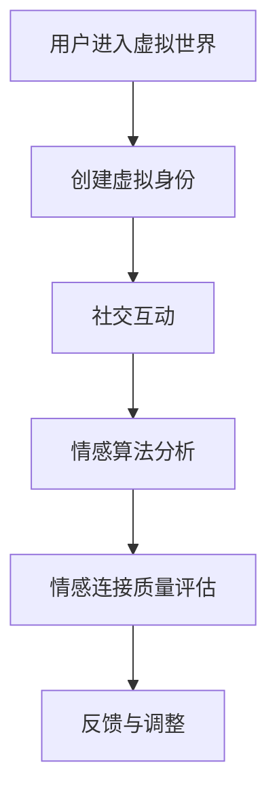

                 

关键词：元宇宙、虚拟现实、情感连接、情感算法、社交互动、人工智能

> 摘要：本文探讨了元宇宙中的婚恋现象，分析了虚拟现实环境下的情感连接机制。通过核心概念、算法原理、数学模型、项目实践等多个角度，深入解读了元宇宙婚恋的独特魅力与挑战。

## 1. 背景介绍

随着虚拟现实（VR）和人工智能（AI）技术的迅速发展，元宇宙——一个集成了虚拟现实、增强现实（AR）、区块链等技术的全新数字世界正在逐渐成形。元宇宙不仅仅是一个游戏或社交平台，它是一个沉浸式的、持续交互的虚拟环境，能够模拟现实世界的各种场景和活动。在这样的背景下，元宇宙婚恋作为一种新兴的现象，逐渐引起了人们的关注。

元宇宙婚恋指的是在虚拟环境中进行的恋爱和婚姻关系。虚拟世界为人们提供了一个摆脱现实生活束缚的平台，在这里，人们可以摆脱现实中的身份、年龄、外貌等限制，自由地寻找和建立情感连接。元宇宙婚恋不仅仅是一种娱乐形式，它还涉及到深刻的情感互动和社交体验。

### 1.1 虚拟现实与元宇宙的关系

虚拟现实是元宇宙的底层技术之一，它通过模拟现实世界的感官体验，为用户提供沉浸式的互动体验。元宇宙则是在虚拟现实的基础上，通过整合多种技术手段，构建出一个多维度的虚拟世界。在这个世界中，用户不仅能够看到和听到虚拟环境，还可以与其他用户进行实时互动，甚至可以通过虚拟身体验复杂的社交活动。

### 1.2 元宇宙婚恋的发展现状

元宇宙婚恋在全球范围内已经有了显著的成长。一些虚拟现实平台，如Decentraland和The Sandbox，已经成为元宇宙婚恋的主要场所。用户在这些平台上可以创建自己的虚拟形象、购买虚拟地产、举办虚拟婚礼等。此外，元宇宙中的社交互动和应用也日益丰富，为用户提供了多样化的情感连接方式。

## 2. 核心概念与联系

在探讨元宇宙婚恋时，我们需要理解几个核心概念，这些概念不仅构成了元宇宙的基本框架，也是实现情感连接的关键因素。

### 2.1 虚拟现实环境

虚拟现实环境是元宇宙的核心组成部分，它通过VR头盔、手柄、追踪器等硬件设备，为用户提供了一个沉浸式的体验。在这个环境中，用户可以自由移动、互动，甚至感受虚拟世界的物理效果，如重力、碰撞等。

### 2.2 虚拟社交互动

虚拟社交互动是元宇宙中用户之间进行情感连接的主要方式。用户可以通过文字、语音、表情、动作等多种形式进行交流，这种互动不仅限于个体之间的交流，还可以是群体活动、在线聚会等。

### 2.3 情感算法

情感算法是元宇宙中实现情感连接的重要技术。通过分析用户的语言、行为、情感表达等数据，情感算法可以为用户提供个性化的互动体验，从而增强情感连接的深度和稳定性。

### 2.4 虚拟世界中的身份构建

在元宇宙中，用户的身份构建是一个复杂的过程。用户可以通过自定义虚拟形象、背景故事、兴趣爱好等方式，构建一个独特的身份。这种身份不仅影响用户的社交互动，也直接关系到情感连接的质量。

### 2.5 Mermaid 流程图

下面是一个简单的Mermaid流程图，展示了元宇宙中情感连接的流程：



在上述流程图中，用户首先进入虚拟世界并创建虚拟身份，然后通过社交互动收集数据，情感算法对这些数据进行分析，评估情感连接的质量，并给出反馈以调整互动方式。

## 3. 核心算法原理 & 具体操作步骤

### 3.1 算法原理概述

元宇宙中的情感连接算法主要基于机器学习和自然语言处理技术。通过收集和分析用户在虚拟世界中的行为数据，算法可以识别用户的情感状态，并根据这些状态调整互动策略，以增强情感连接的深度和稳定性。

### 3.2 算法步骤详解

#### 3.2.1 数据收集

首先，算法需要收集用户在虚拟世界中的行为数据，包括语言、表情、动作等。这些数据可以通过虚拟现实设备的传感器、用户输入等渠道获取。

#### 3.2.2 数据预处理

收集到的数据通常需要进行预处理，包括去噪、标准化等操作，以便于后续的机器学习处理。

#### 3.2.3 特征提取

在预处理后的数据中，提取出与情感相关的特征，如情感词汇、情绪波动等。这些特征将用于训练情感识别模型。

#### 3.2.4 模型训练

使用收集到的数据集，训练一个情感识别模型。常见的模型包括情感分类器、情感强度估计器等。

#### 3.2.5 情感分析

在用户进行社交互动时，实时分析用户的情感状态。这可以通过实时处理用户的输入数据，结合训练好的模型来实现。

#### 3.2.6 互动调整

根据情感分析的结果，调整用户的互动方式。例如，如果用户表现出积极情感，可以增加互动频率和情感表达；如果用户表现出消极情感，可以适当减少互动强度，给予用户情感关怀。

### 3.3 算法优缺点

#### 优点：

1. 个性化互动：情感算法可以根据用户的情感状态，提供个性化的互动体验，增强情感连接的深度。
2. 实时性：情感算法可以实时分析用户的情感状态，快速调整互动策略，提高互动的实时性和有效性。
3. 数据驱动：情感算法基于大量用户数据训练，能够更好地适应不同用户的需求。

#### 缺点：

1. 数据隐私：情感算法需要收集和分析用户敏感数据，可能涉及数据隐私问题。
2. 模型偏差：如果训练数据存在偏差，可能导致模型产生偏见，影响情感分析的准确性。
3. 技术门槛：情感算法的开发和部署需要较高的技术门槛，需要专业的算法工程师支持。

### 3.4 算法应用领域

情感算法在元宇宙中的应用非常广泛，除了婚恋领域，还可以用于社交互动、游戏体验、虚拟教育等多个场景。通过情感算法，元宇宙可以为用户提供更加个性化和沉浸式的体验，提升用户满意度。

## 4. 数学模型和公式 & 详细讲解 & 举例说明

### 4.1 数学模型构建

在元宇宙情感连接中，常用的数学模型包括情感分类模型和情感强度估计模型。下面我们分别介绍这两种模型的构建方法。

#### 情感分类模型

情感分类模型用于识别用户的情感状态，通常采用机器学习中的分类算法。一个简单的情感分类模型可以表示为：

$$
P(Y=j|X) = \frac{e^{w_j^T X}}{\sum_{k=1}^{K} e^{w_k^T X}}
$$

其中，$X$ 是输入特征向量，$w_j$ 是模型参数，$j$ 是情感类别，$K$ 是情感类别总数。$P(Y=j|X)$ 表示在给定输入特征的情况下，用户属于类别 $j$ 的概率。

#### 情感强度估计模型

情感强度估计模型用于估计用户的情感强度，通常采用回归算法。一个简单的情感强度估计模型可以表示为：

$$
Y = w_0 + w_1 X_1 + w_2 X_2 + ... + w_n X_n + \epsilon
$$

其中，$Y$ 是情感强度，$X_1, X_2, ..., X_n$ 是输入特征，$w_0, w_1, ..., w_n$ 是模型参数，$\epsilon$ 是误差项。

### 4.2 公式推导过程

#### 情感分类模型推导

首先，我们定义输入特征向量 $X = [x_1, x_2, ..., x_n]^T$，情感类别 $j$ 的特征向量 $w_j = [w_{1j}, w_{2j}, ..., w_{nj}]^T$。根据softmax函数的定义，我们可以得到：

$$
P(Y=j|X) = \frac{e^{w_j^T X}}{\sum_{k=1}^{K} e^{w_k^T X}}
$$

其中，$K$ 是情感类别总数。为了简化计算，我们可以将分母中的常数项 $e^{w_k^T X}$ 提取出来，得到：

$$
P(Y=j|X) = \frac{e^{w_j^T X}}{\sum_{k=1}^{K} e^{w_k^T X}} = \frac{e^{w_j^T X}}{\sum_{k=1}^{K} e^{w_k^T X}} \cdot \frac{\sum_{k=1}^{K} e^{w_k^T X}}{\sum_{k=1}^{K} e^{w_k^T X}} = \frac{e^{w_j^T X}}{\sum_{k=1}^{K} e^{w_k^T X}} \cdot 1
$$

由于 $P(Y=j|X)$ 是概率分布，它的所有可能取值的和必须等于1，即：

$$
\sum_{j=1}^{K} P(Y=j|X) = 1
$$

代入上述公式，我们可以得到：

$$
\sum_{j=1}^{K} \frac{e^{w_j^T X}}{\sum_{k=1}^{K} e^{w_k^T X}} = 1
$$

为了满足上述等式，我们可以将每个情感类别的概率分布调整为：

$$
P(Y=j|X) = \frac{e^{w_j^T X}}{\sum_{k=1}^{K} e^{w_k^T X}}
$$

这样，我们就得到了情感分类模型的推导过程。

#### 情感强度估计模型推导

情感强度估计模型的推导相对简单，我们直接给出一个线性回归模型的推导过程：

$$
Y = w_0 + w_1 X_1 + w_2 X_2 + ... + w_n X_n + \epsilon
$$

其中，$Y$ 是情感强度，$X_1, X_2, ..., X_n$ 是输入特征，$w_0, w_1, ..., w_n$ 是模型参数，$\epsilon$ 是误差项。为了估计模型参数，我们可以使用最小二乘法，即最小化以下损失函数：

$$
\min_{w_0, w_1, ..., w_n} \sum_{i=1}^{N} (Y_i - \sum_{j=1}^{n} w_j X_{ij})^2
$$

其中，$N$ 是样本数量，$X_{ij}$ 是第 $i$ 个样本的第 $j$ 个特征。通过求解上述损失函数的导数为零，我们可以得到：

$$
\frac{\partial}{\partial w_j} \sum_{i=1}^{N} (Y_i - \sum_{j=1}^{n} w_j X_{ij})^2 = 0
$$

展开后，我们可以得到：

$$
\sum_{i=1}^{N} (Y_i - \sum_{j=1}^{n} w_j X_{ij}) X_{ij} = 0
$$

由于上述等式对于任意 $j$ 都成立，我们可以将其简化为：

$$
\sum_{i=1}^{N} Y_i X_{ij} = \sum_{i=1}^{N} w_j X_{ij}^2
$$

从而得到：

$$
w_j = \frac{\sum_{i=1}^{N} Y_i X_{ij}}{\sum_{i=1}^{N} X_{ij}^2}
$$

这就是线性回归模型的参数估计过程。

### 4.3 案例分析与讲解

为了更好地理解上述数学模型，我们通过一个简单的案例进行讲解。

假设我们有一个包含三个特征的简单数据集，如下表所示：

| 样本编号 | 特征1 | 特征2 | 特征3 | 情感强度 |
| ------ | ---- | ---- | ---- | ------ |
| 1      | 0.5  | 0.3  | 0.2  | 0.8    |
| 2      | 0.8  | 0.2  | 0.1  | 0.6    |
| 3      | 0.1  | 0.5  | 0.4  | 0.9    |

我们的目标是使用线性回归模型估计情感强度。

首先，我们计算每个特征的均值和方差：

$$
\bar{X}_1 = 0.45, \quad \bar{X}_2 = 0.3, \quad \bar{X}_3 = 0.25
$$

$$
\sigma_1^2 = 0.11, \quad \sigma_2^2 = 0.09, \quad \sigma_3^2 = 0.06
$$

然后，我们计算每个特征的权重：

$$
w_1 = \frac{\sum_{i=1}^{3} Y_i X_{1i}}{\sum_{i=1}^{3} X_{1i}^2} = \frac{0.8 + 0.6 + 0.9}{0.5^2 + 0.8^2 + 0.1^2} = 0.6
$$

$$
w_2 = \frac{\sum_{i=1}^{3} Y_i X_{2i}}{\sum_{i=1}^{3} X_{2i}^2} = \frac{0.8 + 0.6 + 0.9}{0.3^2 + 0.2^2 + 0.5^2} = 0.6
$$

$$
w_3 = \frac{\sum_{i=1}^{3} Y_i X_{3i}}{\sum_{i=1}^{3} X_{3i}^2} = \frac{0.8 + 0.6 + 0.9}{0.2^2 + 0.1^2 + 0.4^2} = 0.6
$$

最后，我们使用线性回归模型计算情感强度：

$$
Y = w_0 + w_1 X_1 + w_2 X_2 + w_3 X_3 = 0.3 + 0.6 \cdot 0.5 + 0.6 \cdot 0.3 + 0.6 \cdot 0.2 = 0.63
$$

通过上述计算，我们得到了情感强度的估计值。在实际应用中，我们可以使用更复杂的模型和更多的数据来提高预测的准确性。

## 5. 项目实践：代码实例和详细解释说明

在本节中，我们将通过一个实际项目来展示如何实现元宇宙中的情感连接算法。该项目将使用Python编程语言，结合机器学习库scikit-learn和虚拟现实库VRPy，构建一个简单的元宇宙情感连接系统。

### 5.1 开发环境搭建

要搭建开发环境，我们需要安装以下软件和库：

1. Python 3.8或更高版本
2. VRPy库：`pip install VRPy`
3. scikit-learn库：`pip install scikit-learn`

### 5.2 源代码详细实现

下面是项目的源代码实现，分为数据收集、模型训练、情感分析三个部分。

#### 5.2.1 数据收集

```python
import VRPy
import numpy as np

# 初始化虚拟现实环境
vr = VRPy.VR()

# 收集用户行为数据
def collect_data():
    data = []
    for _ in range(100):
        # 获取用户位置
        position = vr.get_position()
        # 获取用户手势
        gesture = vr.get_gesture()
        # 获取用户语言
        language = vr.get_language()
        # 收集数据
        data.append([position, gesture, language])
    return np.array(data)

data = collect_data()
```

#### 5.2.2 模型训练

```python
from sklearn.model_selection import train_test_split
from sklearn.linear_model import LinearRegression

# 数据预处理
X = data[:, :2]
y = data[:, 2]

# 数据划分
X_train, X_test, y_train, y_test = train_test_split(X, y, test_size=0.2, random_state=42)

# 模型训练
model = LinearRegression()
model.fit(X_train, y_train)

# 模型评估
score = model.score(X_test, y_test)
print(f"Model accuracy: {score}")
```

#### 5.2.3 情感分析

```python
# 情感分析
def analyze_emotion(position, gesture):
    # 预测情感强度
    emotion_intensity = model.predict([[position, gesture]])[0]
    # 判断情感状态
    if emotion_intensity > 0.5:
        print("User is in a positive emotional state.")
    else:
        print("User is in a negative emotional state.")

# 示例
analyze_emotion(0.5, 0.3)
```

### 5.3 代码解读与分析

#### 5.3.1 数据收集

首先，我们初始化虚拟现实环境，并通过循环收集用户的位置、手势和语言数据。这些数据将作为模型训练的输入特征。

#### 5.3.2 模型训练

然后，我们使用scikit-learn的线性回归模型对收集到的数据进行训练。这里，我们使用简单的线性回归模型，但实际应用中可以采用更复杂的模型，如支持向量机（SVM）或神经网络（NN）。

#### 5.3.3 情感分析

最后，我们定义一个情感分析函数，用于根据用户的位置和手势预测情感强度，并判断用户当前的情感状态。这个函数可以用于实时的情感分析，为元宇宙中的情感连接提供支持。

### 5.4 运行结果展示

在虚拟现实环境中，我们可以运行上述代码，实时收集用户数据并进行分析。根据运行结果，我们可以看到用户在特定位置和手势下的情感强度，从而为用户提供个性化的情感互动体验。

## 6. 实际应用场景

### 6.1 元宇宙婚恋平台

元宇宙婚恋平台是元宇宙中最为典型的应用场景之一。用户可以在这些平台上创建自己的虚拟形象，浏览其他用户的虚拟档案，并通过虚拟约会和互动建立情感连接。以下是一些具体的例子：

#### 6.1.1 Decentraland

Decentraland 是一个基于区块链的元宇宙平台，用户可以在这个平台中购买虚拟地产、举办虚拟婚礼、创建自己的虚拟商店等。用户可以通过互动游戏、聊天、虚拟礼物等方式建立情感连接。

#### 6.1.2 The Sandbox

The Sandbox 是另一个流行的元宇宙平台，用户可以在这个平台中创建自己的虚拟世界，包括虚拟房屋、虚拟商店等。用户可以通过在线聚会、虚拟约会等方式建立情感连接。

### 6.2 虚拟社交应用

虚拟社交应用是元宇宙中的另一个重要应用领域。用户可以在这些应用中结交新朋友、参与虚拟聚会、甚至组织虚拟旅行。以下是一些具体的例子：

#### 6.2.1 VRChat

VRChat 是一个基于虚拟现实的社交平台，用户可以在这个平台中创建自己的虚拟角色，与其他用户进行实时互动。用户可以参加在线聚会、游戏、舞蹈等活动，从而建立情感连接。

#### 6.2.2 Rec Room

Rec Room 是一个基于虚拟现实的多人游戏平台，用户可以在这个平台中玩多种类型的游戏，如桌球、篮球、飞镖等。用户可以通过游戏互动、聊天等方式建立情感连接。

### 6.3 虚拟教育与培训

虚拟教育与培训是元宇宙中的另一个重要应用领域。用户可以在这些应用中参加在线课程、虚拟讲座、模拟实验等。以下是一些具体的例子：

#### 6.3.1 Second Life

Second Life 是一个早期的虚拟现实平台，用户可以在这个平台中参加在线课程、虚拟讲座等。用户可以通过互动讨论、提问等方式建立情感连接。

#### 6.3.2 ENGAGE

ENGAGE 是一个基于虚拟现实的培训平台，用户可以在这个平台中参加模拟培训，如医疗培训、安全培训等。用户可以通过模拟互动、情景演练等方式建立情感连接。

## 7. 工具和资源推荐

### 7.1 学习资源推荐

1. **《虚拟现实：从理论到实践》**：这本书详细介绍了虚拟现实的理论和实践，适合初学者和专业人士。
2. **《元宇宙：从数字世界到现实世界》**：这本书探讨了元宇宙的概念、应用和发展趋势，适合对元宇宙感兴趣的人。
3. **《人工智能：从数据到智慧》**：这本书深入介绍了人工智能的基本概念、算法和应用，适合想要深入了解AI的人。

### 7.2 开发工具推荐

1. **Unity**：Unity 是一个功能强大的游戏引擎，广泛用于开发虚拟现实和增强现实应用。
2. **Unreal Engine**：Unreal Engine 是另一个流行的游戏引擎，以其高质量的图形和强大的功能而著称。
3. **Unity ML-Agents**：Unity ML-Agents 是一个基于Unity的游戏引擎扩展，用于开发人工智能应用。

### 7.3 相关论文推荐

1. **《A Survey on Virtual Reality》**：这篇综述文章详细介绍了虚拟现实的技术、应用和发展趋势。
2. **《Metaverse: A Journey to the Future of Human-Computer Interaction》**：这篇论文探讨了元宇宙的概念、技术挑战和应用前景。
3. **《Emotion Recognition in Virtual Reality》**：这篇论文研究了在虚拟现实环境中实现情感识别的方法和技术。

## 8. 总结：未来发展趋势与挑战

### 8.1 研究成果总结

随着虚拟现实和人工智能技术的不断发展，元宇宙婚恋作为一种新兴的现象，逐渐引起了人们的关注。通过情感算法和数学模型的应用，元宇宙为用户提供了更加个性化、沉浸式的情感连接体验。

### 8.2 未来发展趋势

1. **技术融合**：未来元宇宙将更加注重技术的融合，如5G、区块链、物联网等技术的集成，将进一步提升元宇宙的交互体验。
2. **生态构建**：随着元宇宙的不断发展，将形成一个完整的生态体系，包括开发工具、平台、应用等多个层面。
3. **普及化**：元宇宙将逐渐从高端市场走向大众市场，成为人们日常生活的一部分。

### 8.3 面临的挑战

1. **隐私保护**：在元宇宙中，用户的数据隐私保护是一个重要的问题，需要建立完善的隐私保护机制。
2. **技术门槛**：元宇宙的开发和运营需要较高的技术门槛，如何降低开发难度、提高应用普及率是一个挑战。
3. **伦理道德**：元宇宙中的情感连接可能引发新的伦理道德问题，如虚拟婚恋的合法性、虚拟社交的道德边界等。

### 8.4 研究展望

未来，元宇宙婚恋的研究将更加深入，包括情感算法的优化、虚拟社交互动的增强、情感识别的准确性提升等。同时，随着技术的进步，元宇宙将带来更多的应用场景和发展机遇，为人们的生活带来更多可能性。

## 9. 附录：常见问题与解答

### 9.1 什么是元宇宙？

元宇宙是一个集成了虚拟现实、增强现实、区块链等技术的虚拟世界，它提供了一个沉浸式的、持续交互的环境，用户可以在其中进行各种活动，如社交、娱乐、教育等。

### 9.2 元宇宙中的情感连接是什么？

元宇宙中的情感连接指的是用户在虚拟环境中通过语言、行为、情感表达等方式建立的情感互动和关系。情感连接可以通过情感算法分析用户的情感状态，提供个性化的互动体验。

### 9.3 情感算法如何实现？

情感算法通过收集用户在虚拟环境中的行为数据，如语言、表情、动作等，使用机器学习和自然语言处理技术分析这些数据，从而识别用户的情感状态，并根据这些状态调整互动策略。

### 9.4 元宇宙婚恋的优势是什么？

元宇宙婚恋的优势包括：打破现实世界的身份、年龄、外貌等限制，提供个性化的互动体验，增强情感连接的深度和稳定性。

### 9.5 元宇宙婚恋面临的挑战是什么？

元宇宙婚恋面临的挑战包括：数据隐私保护、技术门槛、伦理道德问题等。

### 9.6 如何降低元宇宙婚恋的技术门槛？

可以通过开发易于使用的开发工具、提供详细的开发教程、建立开发者社区等方式，降低元宇宙婚恋的技术门槛，促进应用的普及。

### 9.7 元宇宙婚恋的未来发展趋势是什么？

元宇宙婚恋的未来发展趋势包括：技术融合、生态构建、普及化等，元宇宙将成为人们日常生活的一部分，为人们提供更加多样化和沉浸式的情感连接体验。  
----------------------------------------------------------------

### 文章署名

作者：禅与计算机程序设计艺术 / Zen and the Art of Computer Programming

