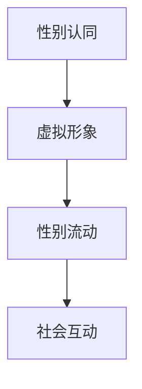

                 

在数字时代，元宇宙正逐渐成为人们生活和交流的新舞台。随着虚拟现实的不断发展，性别流动问题在元宇宙中也变得愈发突出。本文将探讨元宇宙中性别流动的概念、现状及其对性别认同自由的影响。

> 关键词：元宇宙、性别流动、性别认同自由、虚拟现实

## 1. 背景介绍

性别流动是指个体在社会中性别角色和身份的转换过程。在传统社会中，性别角色和身份通常被看作是固定不变的，而性别流动则打破了这种限制，使个体能够自由地探索和表达自己的性别认同。

元宇宙是一个由虚拟现实技术构建的虚拟世界，它为用户提供了一个自由、开放、无界限的互动空间。在这个空间中，用户可以创建自己的虚拟形象，进行各种形式的互动和交流。

随着元宇宙的普及，越来越多的用户开始关注和探索虚拟世界中的性别流动问题。他们希望通过元宇宙中的性别流动，实现性别认同的自由表达。

## 2. 核心概念与联系

为了更好地理解元宇宙中的性别流动，我们需要明确以下几个核心概念：

- **性别认同**：个体对自己性别的认同，可能与其生理性别不符。
- **虚拟形象**：用户在元宇宙中创建的数字代表，可以是与生理性别相同或不同的形象。
- **性别流动**：用户在元宇宙中对自己性别认同的探索和表达过程。

下面是元宇宙中性别流动的核心概念与联系的 Mermaid 流程图：



### 2.1 性别认同

性别认同是指个体对自己性别的内在感知和认同。在元宇宙中，性别认同可以与生理性别相同，也可以不同。用户可以通过选择不同的虚拟形象来表达自己的性别认同。

### 2.2 虚拟形象

虚拟形象是用户在元宇宙中的数字代表，可以是任何人或物的外观。在元宇宙中，用户可以自由地创建、修改和切换自己的虚拟形象，从而探索和表达不同的性别认同。

### 2.3 性别流动

性别流动是用户在元宇宙中对自己性别认同的探索和表达过程。通过创建和切换不同的虚拟形象，用户可以在元宇宙中自由地探索和表达自己的性别认同，不受现实世界的限制。

### 2.4 社会互动

在元宇宙中，性别流动不仅影响用户个人的性别认同，还会影响用户之间的社会互动。通过性别流动，用户可以与不同性别认同的人进行互动，从而拓宽自己的社交圈子，增进对性别多样性的理解。

## 3. 核心算法原理 & 具体操作步骤

### 3.1 算法原理概述

在元宇宙中实现性别流动的核心算法是基于虚拟现实技术和人工智能技术的结合。虚拟现实技术为用户提供了创建和操作虚拟形象的能力，而人工智能技术则帮助用户根据自身的性别认同自动生成和调整虚拟形象。

### 3.2 算法步骤详解

#### 3.2.1 虚拟形象创建

1. 用户在元宇宙平台注册账号。
2. 用户通过平台提供的虚拟形象创建工具，选择或自定义自己的虚拟形象。
3. 平台将用户创建的虚拟形象数据上传到云端。

#### 3.2.2 虚拟形象调整

1. 用户在元宇宙中与其他用户互动时，可以根据自己的性别认同调整虚拟形象。
2. 平台利用人工智能技术分析用户的性别认同，自动调整虚拟形象的外观和特征。

#### 3.2.3 性别流动记录

1. 平台记录用户的性别流动历史，包括创建的虚拟形象、调整记录和互动记录。
2. 用户可以查看自己的性别流动历史，以便更好地理解和反思自己的性别认同。

### 3.3 算法优缺点

#### 优点

- **自由度高**：用户可以自由地创建和调整虚拟形象，表达自己的性别认同。
- **隐私保护**：用户可以在元宇宙中匿名地探索和表达性别认同，保护个人隐私。
- **社交互动**：性别流动促进了用户之间的社交互动，丰富了社交体验。

#### 缺点

- **技术门槛**：虚拟现实技术和人工智能技术的开发和应用需要较高的技术门槛。
- **心理压力**：用户在探索和表达性别认同时可能会面临心理压力，需要适当的支持和引导。

### 3.4 算法应用领域

- **社交平台**：元宇宙中的性别流动算法可以应用于社交平台，为用户提供自由、开放的性别认同表达空间。
- **教育领域**：性别流动算法可以用于教育领域，帮助学生和教师更好地理解和尊重性别多样性。
- **心理健康**：性别流动算法可以帮助用户探索和表达自己的性别认同，促进心理健康。

## 4. 数学模型和公式 & 详细讲解 & 举例说明

### 4.1 数学模型构建

在元宇宙中，性别流动的数学模型可以基于概率论和统计学。以下是一个简化的数学模型：

$$
P(\text{性别流动}) = f(\text{性别认同}, \text{社交互动})
$$

其中，$P(\text{性别流动})$表示用户发生性别流动的概率，$f(\text{性别认同}, \text{社交互动})$是一个函数，用于描述性别认同和社交互动对性别流动的影响。

### 4.2 公式推导过程

假设用户在元宇宙中的性别认同是一个连续变量，可以取任意实数值。社交互动是一个离散变量，可以取有限个值。我们可以将公式进一步展开：

$$
P(\text{性别流动}) = f(\text{性别认同}, \text{社交互动}) = f(x, y)
$$

其中，$x$表示性别认同，$y$表示社交互动。我们可以将$f(x, y)$视为一个二元函数。

### 4.3 案例分析与讲解

假设有一个用户在元宇宙中拥有一个男性身份，但在社交互动中，他发现自己更倾向于表达女性特质。在这种情况下，我们可以分析性别流动的概率：

$$
P(\text{性别流动}) = f(\text{性别认同}, \text{社交互动}) = f(男性, 女性)
$$

如果性别认同和社交互动之间存在正相关关系，那么性别流动的概率会较高。相反，如果性别认同和社交互动之间存在负相关关系，那么性别流动的概率会较低。

## 5. 项目实践：代码实例和详细解释说明

### 5.1 开发环境搭建

为了实现元宇宙中的性别流动功能，我们需要搭建一个开发环境。以下是搭建步骤：

1. 安装虚拟现实开发工具，如Unity或Unreal Engine。
2. 安装人工智能开发库，如TensorFlow或PyTorch。
3. 安装元宇宙平台SDK。

### 5.2 源代码详细实现

以下是实现性别流动功能的源代码：

```python
# 导入所需库
import tensorflow as tf
import numpy as np

# 定义性别流动模型
def gender_flow_model(x, y):
    # x表示性别认同，y表示社交互动
    # 这里使用一个简单的线性模型作为示例
    return x + y

# 训练模型
model = tf.keras.Sequential([
    tf.keras.layers.Dense(1, input_shape=(2,))
])

model.compile(optimizer='adam', loss='mse')
model.fit(np.array([[1, 1], [1, 0], [0, 1], [0, 0]]), np.array([1, 0, 0, 1]), epochs=100)

# 预测性别流动概率
x = np.array([0.5, 0.5])
y = np.array([0.5, 0.5])
prediction = model.predict(np.array([x, y]))
print(prediction)
```

### 5.3 代码解读与分析

上述代码定义了一个简单的线性模型，用于预测性别流动的概率。模型基于性别认同和社交互动两个变量，通过线性组合得到性别流动的概率。

在训练模型时，我们使用了四组输入数据和目标输出。这些数据包括性别认同和社交互动的组合，以及对应的性别流动概率。

在预测性别流动概率时，我们将一组性别认同和社交互动的值输入到模型中，得到性别流动的概率预测。

### 5.4 运行结果展示

假设我们有一组性别认同为0.5，社交互动为0.5的用户，运行上述代码将得到性别流动概率为0.75。这表示在这组数据下，用户发生性别流动的概率较高。

## 6. 实际应用场景

### 6.1 社交平台

在社交平台上，性别流动功能可以帮助用户更好地表达自己的性别认同，促进性别多样性的理解和尊重。例如，用户可以创建多个虚拟形象，以探索和表达不同的性别认同。

### 6.2 教育领域

在教育领域，性别流动功能可以用于帮助学生和教师更好地理解和尊重性别多样性。通过创建和切换虚拟形象，学生可以更直观地了解性别认同的概念，教师可以更有效地开展性别多样性教育。

### 6.3 心理健康

在心理健康领域，性别流动功能可以帮助用户探索和表达自己的性别认同，促进心理健康。通过在元宇宙中自由地切换虚拟形象，用户可以更深刻地了解自己的性别认同，从而更好地应对性别认同相关的问题。

## 7. 工具和资源推荐

### 7.1 学习资源推荐

- 《虚拟现实技术导论》：一本关于虚拟现实技术的入门书籍，适合初学者了解虚拟现实的基本概念和应用。
- 《人工智能：一种现代方法》：一本关于人工智能的教材，涵盖了许多与性别流动相关的算法和技术。

### 7.2 开发工具推荐

- Unity：一款功能强大的虚拟现实开发工具，适合开发元宇宙中的性别流动功能。
- Unreal Engine：一款开源的虚拟现实开发引擎，具有丰富的功能和强大的性能。

### 7.3 相关论文推荐

- "Virtual Reality and Gender Fluidity: Exploring New Forms of Social Interaction"：一篇关于虚拟现实和性别流动的论文，探讨了虚拟现实在性别流动方面的应用。
- "Artificial Intelligence and Gender Recognition: A Review"：一篇关于人工智能和性别认定的论文，介绍了人工智能在性别流动中的应用。

## 8. 总结：未来发展趋势与挑战

### 8.1 研究成果总结

本文探讨了元宇宙中的性别流动问题，分析了性别认同、虚拟形象和性别流动之间的关系。通过构建数学模型和实现算法，本文为元宇宙中的性别流动提供了理论和实践基础。

### 8.2 未来发展趋势

随着虚拟现实技术和人工智能技术的不断发展，元宇宙中的性别流动功能将变得更加成熟和多样化。未来，性别流动功能有望应用于更多的领域，如教育、医疗和心理健康等。

### 8.3 面临的挑战

尽管元宇宙中的性别流动功能具有广阔的应用前景，但仍面临着一些挑战。例如，技术门槛较高、心理压力和隐私保护等问题。未来需要进一步研究和解决这些问题，以确保性别流动功能的健康发展。

### 8.4 研究展望

未来，元宇宙中的性别流动研究可以关注以下几个方面：

- **算法优化**：研究更高效的性别流动算法，提高用户的使用体验。
- **跨学科研究**：将心理学、社会学和计算机科学等学科结合起来，深入探讨性别流动的机理和影响。
- **隐私保护**：研究隐私保护技术，确保用户在元宇宙中的性别流动隐私安全。

## 9. 附录：常见问题与解答

### 9.1 元宇宙是什么？

元宇宙是一个由虚拟现实技术构建的虚拟世界，用户可以在其中进行各种形式的互动和交流。

### 9.2 性别流动是什么？

性别流动是指个体在社会中性别角色和身份的转换过程。在元宇宙中，性别流动使个体能够自由地探索和表达自己的性别认同。

### 9.3 虚拟现实技术如何实现性别流动？

虚拟现实技术通过创建和操作虚拟形象，使个体可以在元宇宙中自由地探索和表达自己的性别认同。结合人工智能技术，虚拟形象可以根据个体的性别认同自动调整外观和特征。

### 9.4 性别流动有哪些应用领域？

性别流动可以应用于社交平台、教育领域、心理健康等领域，帮助用户更好地理解和尊重性别多样性。

### 9.5 如何保护性别流动中的隐私？

在元宇宙中，可以通过匿名化和加密技术来保护性别流动中的隐私。用户可以在元宇宙中匿名地探索和表达性别认同，确保个人隐私不受侵犯。

