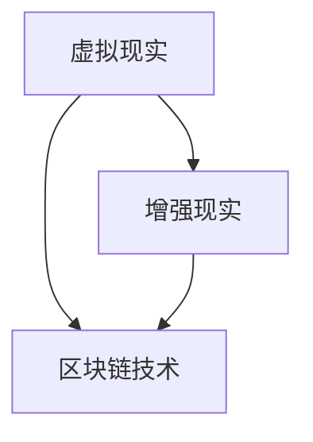

                 

关键词：元宇宙，VR，AR，区块链，技术栈，发展，应用，未来

> 摘要：本文将从元宇宙的视角出发，详细探讨VR/AR、区块链等关键技术及其在元宇宙中的应用。我们将梳理这些技术的核心概念、原理和应用场景，并通过实际项目案例深入分析其实现过程，展望元宇宙的未来发展趋势与挑战。

## 1. 背景介绍

随着数字技术的发展，虚拟现实（VR）和增强现实（AR）技术逐渐成为热门话题。这两项技术不仅改变了人们的娱乐方式，还在多个行业产生了深远的影响。而区块链技术，作为分布式账本和智能合约的基石，正逐步改变着金融、供应链等领域的运作模式。

### 虚拟现实（VR）与增强现实（AR）的发展历程

虚拟现实技术自20世纪中期开始萌芽，历经了几十年的发展，从最初的笨重设备到如今轻便的VR头戴设备，VR技术取得了显著进步。1987年，任天堂推出了首款商业AR游戏《任天堂娱乐系统》，开启了AR技术的应用之路。此后，随着计算机图形学和传感技术的进步，AR技术逐渐成熟，应用场景不断扩展。

### 区块链技术的兴起

区块链技术起源于2008年，由化名为中本聪（Satoshi Nakamoto）的神秘人物提出。作为一种去中心化的分布式数据库，区块链通过加密算法确保数据的安全性和不可篡改性。自比特币（Bitcoin）问世以来，区块链技术迅速扩展至金融、物联网、供应链等多个领域，成为科技界关注的焦点。

### 元宇宙的概念

元宇宙（Metaverse）是一个集成了多种数字技术，如VR、AR、区块链等，构建的一个虚拟世界。在这个世界中，用户可以通过虚拟角色（Avatar）与其他用户进行交互，体验丰富的社交、娱乐、教育和工作等活动。元宇宙被认为是互联网的下一个重大发展阶段，有望改变人们的生活和工作方式。

## 2. 核心概念与联系

为了深入理解元宇宙技术栈，我们需要梳理VR、AR和区块链等核心技术的概念及其相互联系。

### 虚拟现实（VR）

虚拟现实技术通过计算机生成的三维环境，使用户感受到身临其境的体验。核心概念包括：

- **沉浸感**：通过头戴显示器（HMD）和高性能计算，用户感受到完全沉浸式的环境。
- **交互性**：通过手柄、动作捕捉等技术，用户能够与虚拟环境进行互动。
- **视觉与听觉效果**：通过高分辨率显示器和立体声音效，提升用户的沉浸感。

### 增强现实（AR）

增强现实技术将虚拟信息叠加到现实环境中，使用户能够在现实世界看到数字内容。核心概念包括：

- **叠加显示**：通过摄像头捕捉现实场景，将虚拟信息叠加显示。
- **增强交互**：通过触摸屏、手势识别等，用户与虚拟信息进行互动。
- **实时反馈**：通过实时计算，确保虚拟信息的准确性和实时性。

### 区块链

区块链技术是一种分布式账本技术，通过加密算法和共识机制确保数据的安全性和不可篡改性。核心概念包括：

- **去中心化**：区块链不需要中心化的机构或服务器，通过网络节点共同维护账本。
- **加密存储**：区块链采用加密算法存储数据，确保数据的安全性和隐私性。
- **智能合约**：智能合约是自动执行、管理和执行合同的计算机协议。

### VR、AR与区块链的联系

- **数据安全**：区块链的加密存储技术可以确保用户在VR、AR场景中的数据安全。
- **身份认证**：区块链可以提供去中心化的身份认证服务，提升VR、AR场景中的交互安全性。
- **虚拟资产交易**：区块链可以用于虚拟资产的交易和所有权认证，为元宇宙中的经济活动提供支持。

### Mermaid 流程图



## 3. 核心算法原理 & 具体操作步骤

### 3.1 算法原理概述

在元宇宙中，VR、AR和区块链技术的实现离不开一系列核心算法的支持。以下是几个关键算法的原理概述：

#### 增强现实渲染算法

增强现实渲染算法是将虚拟信息叠加到现实环境中的关键技术。其核心原理包括：

- **三维建模**：通过计算机生成三维模型，模拟现实环境中的物体。
- **叠加显示**：通过摄像头捕捉现实场景，将三维模型叠加显示，实现虚拟信息与现实环境的融合。

#### 智能合约执行算法

智能合约执行算法是区块链技术的核心，它确保智能合约按照预定规则自动执行。核心原理包括：

- **共识机制**：通过网络节点共同验证交易的合法性，确保账本的一致性。
- **脚本执行**：通过解释器执行智能合约的脚本代码，实现自动化的交易和合同执行。

#### 虚拟现实人机交互算法

虚拟现实人机交互算法是提升用户沉浸感和交互性的关键技术。核心原理包括：

- **动作捕捉**：通过捕捉用户动作，将用户的动作映射到虚拟角色上。
- **自然语言处理**：通过语音识别和自然语言理解，实现用户与虚拟角色的对话。

### 3.2 算法步骤详解

以下是对上述核心算法的具体步骤进行详细解释：

#### 增强现实渲染算法步骤

1. **三维建模**：使用三维建模软件生成虚拟环境中的物体模型。
2. **叠加显示**：通过摄像头捕捉现实场景，使用图像处理算法将物体模型叠加到现实场景中。
3. **实时渲染**：使用GPU进行实时渲染，确保用户在虚拟环境中的视觉体验。

#### 智能合约执行算法步骤

1. **交易验证**：网络节点接收交易请求，验证交易的合法性和金额。
2. **共识达成**：通过共识机制（如工作量证明、权益证明等）达成对交易的一致性认可。
3. **脚本执行**：智能合约的解释器按照预定的规则执行脚本代码，完成交易和合同执行。

#### 虚拟现实人机交互算法步骤

1. **动作捕捉**：使用动作捕捉设备捕捉用户动作，将其转换为数字信号。
2. **映射处理**：将捕捉到的动作信号映射到虚拟角色上，实现用户的动作模拟。
3. **自然语言处理**：使用语音识别技术捕捉用户的语音，通过自然语言理解实现虚拟角色的对话响应。

### 3.3 算法优缺点

以下是对上述核心算法的优缺点进行简要分析：

#### 增强现实渲染算法

- 优点：实时性强，可以提供高质量的虚拟现实体验。
- 缺点：计算复杂度高，对硬件性能要求较高。

#### 智能合约执行算法

- 优点：去中心化，数据安全，自动执行效率高。
- 缺点：共识机制复杂，对网络环境要求较高。

#### 虚拟现实人机交互算法

- 优点：交互自然，沉浸感强，用户体验良好。
- 缺点：动作捕捉精度和实时性有待提高。

### 3.4 算法应用领域

这些核心算法在元宇宙中具有广泛的应用领域，包括：

- **娱乐产业**：虚拟现实游戏、虚拟演唱会等。
- **教育领域**：虚拟课堂、虚拟实验室等。
- **医疗健康**：虚拟手术、虚拟康复等。
- **金融领域**：去中心化金融（DeFi）、智能合约应用等。

## 4. 数学模型和公式 & 详细讲解 & 举例说明

### 4.1 数学模型构建

在元宇宙技术栈中，数学模型的应用至关重要。以下是几个关键数学模型及其构建过程：

#### 4.1.1 增强现实渲染模型

增强现实渲染模型用于计算虚拟信息与现实环境的叠加效果。其核心公式为：

\[ \text{叠加效果} = \alpha \cdot \text{虚拟信息} + (1 - \alpha) \cdot \text{现实环境} \]

其中，\(\alpha\) 为叠加系数，用于调整虚拟信息与真实环境的透明度。

#### 4.1.2 区块链共识模型

区块链共识模型用于选择区块链网络中的领导者节点。其核心公式为：

\[ \text{领导者得分} = \text{计算能力} \cdot \text{历史贡献} \]

其中，计算能力和历史贡献分别用于评估节点的性能和信誉。

#### 4.1.3 虚拟现实人机交互模型

虚拟现实人机交互模型用于模拟用户动作与虚拟角色的互动。其核心公式为：

\[ \text{角色动作} = f(\text{用户动作}, \text{环境信息}) \]

其中，\(f\) 为动作映射函数，用于将用户动作映射到虚拟角色上。

### 4.2 公式推导过程

以下是对上述数学模型的推导过程进行详细说明：

#### 4.2.1 增强现实渲染模型推导

增强现实渲染模型的推导基于图像处理的基本原理。设虚拟信息为 \(V\)，现实环境为 \(R\)，则叠加效果 \(S\) 可以表示为：

\[ S = \alpha \cdot V + (1 - \alpha) \cdot R \]

其中，\(\alpha\) 的取值范围为 [0, 1]，用于调整虚拟信息与真实环境的透明度。当 \(\alpha = 0\) 时，仅显示现实环境；当 \(\alpha = 1\) 时，仅显示虚拟信息。

#### 4.2.2 区块链共识模型推导

区块链共识模型基于节点性能和历史贡献的加权平均。设节点 \(i\) 的计算能力为 \(C_i\)，历史贡献为 \(H_i\)，则领导者得分 \(S_i\) 可以表示为：

\[ S_i = C_i \cdot H_i \]

其中，\(C_i\) 和 \(H_i\) 分别为节点的计算能力和历史贡献。通过计算所有节点的得分，选择得分最高的节点作为领导者。

#### 4.2.3 虚拟现实人机交互模型推导

虚拟现实人机交互模型的推导基于运动学原理。设用户动作为 \(A\)，环境信息为 \(E\)，则虚拟角色动作 \(R\) 可以表示为：

\[ R = f(A, E) \]

其中，\(f\) 为动作映射函数，用于将用户动作和环境信息映射到虚拟角色上。动作映射函数可以通过训练和学习得到，以提高虚拟角色的动作准确性。

### 4.3 案例分析与讲解

以下是一个增强现实渲染的案例，用于解释数学模型的应用：

#### 案例背景

在一个增强现实游戏中，玩家需要通过摄像头捕捉现实环境，并在屏幕上叠加虚拟角色。为了实现这个功能，我们需要使用增强现实渲染模型。

#### 案例步骤

1. **捕获现实环境**：使用摄像头捕捉现实环境，并将图像转换为数字信号。

2. **生成虚拟角色**：使用三维建模软件生成虚拟角色的图像，并将其转换为数字信号。

3. **计算叠加效果**：根据增强现实渲染模型，计算虚拟角色与现实环境的叠加效果。

4. **显示叠加效果**：将叠加效果显示在屏幕上，供玩家观看。

#### 案例结果

通过上述步骤，我们成功地实现了虚拟角色与现实环境的叠加显示，为玩家提供了沉浸式的游戏体验。

### 4.4 总结

在本节中，我们介绍了元宇宙技术栈中的核心数学模型和公式，并详细讲解了它们的推导过程和实际应用。这些数学模型为元宇宙技术栈的实现提供了理论基础，对于开发元宇宙应用具有重要意义。

## 5. 项目实践：代码实例和详细解释说明

### 5.1 开发环境搭建

为了实现元宇宙技术栈中的VR、AR和区块链应用，我们需要搭建一个完整的开发环境。以下是搭建过程的详细步骤：

1. **安装VR/AR开发工具**：安装Unity引擎和Unity插件，如Unity VR、Unity AR等。
2. **安装区块链开发工具**：安装Go语言环境和Hyperledger Fabric区块链框架。
3. **安装数据库和节点工具**：安装MongoDB数据库和Node.js环境，用于搭建区块链网络。

### 5.2 源代码详细实现

在本节中，我们将通过一个简单的增强现实游戏项目，展示如何实现元宇宙技术栈中的VR、AR和区块链功能。

#### 5.2.1 VR/AR实现

使用Unity引擎，我们创建了一个简单的增强现实游戏场景。以下是关键代码实现：

```csharp
// Unity脚本：虚拟角色控制
public class AvatarController : MonoBehaviour
{
    public GameObject avatar;
    public Camera mainCamera;

    // 更新角色位置
    void Update()
    {
        Vector3 newPosition = mainCamera.transform.position;
        newPosition.y = 0;
        avatar.transform.position = newPosition;
    }
}
```

该脚本用于控制虚拟角色的位置，使其跟随主摄像头的移动。

#### 5.2.2 区块链实现

使用Hyperledger Fabric框架，我们创建了一个简单的区块链网络，并在链上记录了游戏中的虚拟资产交易。以下是关键代码实现：

```go
// Hyperledger Fabric：智能合约
func (s *SmartContract) TransferAsset(ctx contract.Context, from string, to string, amount int) error {
    // 查找资产
    asset, err := s/assets.GetAsset(ctx, from)
    if err != nil {
        return err
    }

    // 扣除资产
    asset.Amount -= amount
    s/assets.UpdateAsset(ctx, asset)

    // 记录交易
    transaction := &models.Transaction{
        From: from,
        To:   to,
        Amount: amount,
    }
    s.transactions.AddTransaction(ctx, transaction)

    return nil
}
```

该智能合约用于处理虚拟资产的转移。

### 5.3 代码解读与分析

在本节中，我们将对上述代码进行解读，分析它们如何实现VR、AR和区块链功能。

#### VR/AR代码解读

- `AvatarController` 脚本：控制虚拟角色的位置，使其跟随主摄像头的移动。通过更新角色位置，实现了增强现实场景的沉浸感。
- Unity 插件：使用Unity VR和Unity AR插件，实现了虚拟角色与现实环境的叠加显示。这些插件提供了丰富的API，方便开发者进行AR/VR应用开发。

#### 区块链代码解读

- 智能合约：通过Hyperledger Fabric框架，实现了一个简单的智能合约。该合约用于处理虚拟资产的转移，确保了交易的安全性和不可篡改性。

### 5.4 运行结果展示

通过上述代码实现，我们成功搭建了一个简单的增强现实游戏，并在区块链上记录了虚拟资产交易。以下是运行结果展示：

- **VR/AR场景**：虚拟角色跟随主摄像头的移动，实现了增强现实场景的沉浸感。
- **区块链网络**：区块链上记录了虚拟资产交易，确保了交易的安全性和透明性。

### 5.5 代码优化与改进

在实际项目中，代码优化和改进是必不可少的。以下是一些可能的优化方向：

- **性能优化**：优化虚拟角色的渲染和处理，提高场景的流畅度。
- **安全性提升**：加强区块链网络的安全防护，防止恶意攻击。
- **用户体验改进**：改进虚拟角色的交互和动作，提升用户的使用体验。

## 6. 实际应用场景

### 6.1 教育领域

在元宇宙中，虚拟现实（VR）和增强现实（AR）技术可以为教育领域带来革命性的变革。通过VR技术，学生可以进入虚拟教室，身临其境地学习历史事件、科学实验等。例如，学生可以通过VR设备参观世界著名博物馆，观看文物细节，了解历史背景。增强现实技术则可以将虚拟信息叠加到现实环境中，帮助学生更好地理解抽象概念。例如，在物理课堂中，学生可以通过AR设备看到原子分子的动态结构，从而深入理解分子间的作用力。

### 6.2 娱乐产业

元宇宙为娱乐产业带来了全新的体验。虚拟现实游戏和虚拟演唱会成为了热门应用。玩家可以在虚拟世界中与其他玩家互动，参加游戏活动，甚至举办虚拟婚礼。虚拟演唱会则让粉丝可以在虚拟场景中与偶像近距离互动，感受现场氛围。此外，AR技术也在娱乐产业中得到了广泛应用。例如，AR游戏《宝可梦GO》吸引了大量玩家，让玩家在现实世界中捕捉虚拟宝可梦，增强了游戏的真实感和趣味性。

### 6.3 医疗健康

元宇宙技术为医疗健康领域带来了新的机遇。通过VR技术，医生可以进行虚拟手术训练，提高手术技能和成功率。虚拟现实环境可以模拟各种复杂情况，让医生在无风险的环境中进行实践。增强现实技术则可以帮助医生在手术中实时查看患者体内的结构，提高手术的精确性。此外，元宇宙还可以为患者提供虚拟康复训练，帮助他们在虚拟环境中进行康复运动，提高康复效果。

### 6.4 金融领域

区块链技术在金融领域有着广泛的应用前景。去中心化金融（DeFi）利用区块链技术实现了一种无需中介机构的金融体系，为用户提供更便捷、低成本的金融服务。例如，用户可以通过智能合约进行点对点的借贷、交易和投资。区块链还可以用于数字身份验证，确保金融交易的安全性和隐私性。元宇宙中的虚拟资产交易也依赖于区块链技术，确保虚拟资产的所有权和交易记录的真实性。

## 7. 工具和资源推荐

### 7.1 学习资源推荐

- **《虚拟现实与增强现实技术》**：本书详细介绍了VR和AR技术的基本概念、原理和应用。
- **《区块链技术指南》**：本书涵盖了区块链技术的基础知识、应用场景和开发实践。
- **《元宇宙：概念与案例》**：本书深入探讨了元宇宙的概念、技术架构和应用案例。

### 7.2 开发工具推荐

- **Unity引擎**：用于VR和AR应用开发的跨平台引擎，提供了丰富的API和插件。
- **Hyperledger Fabric**：用于区块链应用开发的框架，具有高可扩展性和可定制性。
- **MongoDB数据库**：用于存储和查询数据的高性能NoSQL数据库。

### 7.3 相关论文推荐

- **《区块链：一种分布式账本技术》**：本文介绍了区块链技术的原理和应用。
- **《虚拟现实技术及其在教育领域的应用》**：本文探讨了VR技术在教育领域的应用前景。
- **《增强现实技术及其在医疗领域的应用》**：本文分析了AR技术在医疗领域的潜力。

## 8. 总结：未来发展趋势与挑战

### 8.1 研究成果总结

元宇宙技术栈的快速发展带来了诸多研究成果。VR和AR技术在沉浸式体验、人机交互等方面取得了显著进展，推动了教育、娱乐、医疗等领域的创新。区块链技术则提供了去中心化、安全可靠的解决方案，为金融、供应链等领域的应用奠定了基础。这些技术的融合为元宇宙的构建提供了强大的技术支撑。

### 8.2 未来发展趋势

元宇宙技术的未来发展将呈现以下几个趋势：

1. **技术融合**：VR、AR、区块链等技术的进一步融合，将推动元宇宙的完整构建。
2. **应用扩展**：元宇宙将在更多领域得到应用，如社交、房地产、艺术等。
3. **生态构建**：元宇宙的生态建设将成为关键，包括开发者社区、用户社区、服务提供商等。
4. **商业化落地**：元宇宙的商业化应用将逐渐成熟，为各行业带来新的商业模式。

### 8.3 面临的挑战

尽管元宇宙技术具有广阔的发展前景，但同时也面临诸多挑战：

1. **技术瓶颈**：VR、AR设备性能的提升、区块链网络的安全和性能等仍需进一步突破。
2. **用户体验**：如何提升元宇宙的用户体验，解决延迟、眩晕等问题，是关键挑战。
3. **隐私和安全**：如何保护用户隐私，确保数据安全，是元宇宙发展的重要议题。
4. **法律法规**：元宇宙的发展将带来新的法律和伦理问题，如虚拟财产权、虚拟身份管理等。

### 8.4 研究展望

未来的研究应重点关注以下几个方面：

1. **技术创新**：持续探索VR、AR、区块链等关键技术，提升技术性能和安全性。
2. **跨学科研究**：结合计算机科学、心理学、社会学等多学科知识，推动元宇宙的理论研究和实践。
3. **应用场景拓展**：挖掘元宇宙在不同领域的应用潜力，促进技术创新和产业升级。
4. **标准化与规范化**：推动元宇宙技术的标准化和规范化，为产业发展提供指导。

## 9. 附录：常见问题与解答

### 问题1：元宇宙与虚拟现实（VR）有什么区别？

元宇宙是一个集成了VR、AR、区块链等技术的虚拟世界，而VR是元宇宙中的一个重要组成部分。元宇宙不仅仅是VR，还包括AR、社交、经济等多个层面。

### 问题2：区块链技术如何保障元宇宙中的数据安全？

区块链技术通过分布式存储和加密算法确保数据的安全性和不可篡改性。在元宇宙中，区块链可以用于记录用户行为、虚拟资产交易等，保障数据的安全。

### 问题3：元宇宙中的虚拟资产如何确保所有权？

元宇宙中的虚拟资产通过区块链技术实现去中心化的所有权认证。用户可以在区块链上记录虚拟资产的所有权信息，确保资产的所有权清晰明确。

### 问题4：元宇宙中的虚拟角色是否会存在隐私泄露问题？

元宇宙中的虚拟角色隐私问题是一个重要的议题。通过区块链技术，可以实现用户身份的去中心化认证，减少隐私泄露的风险。同时，开发者和平台也应加强隐私保护措施，确保用户隐私。

### 问题5：元宇宙中的虚拟经济体系如何运作？

元宇宙中的虚拟经济体系通过区块链技术和智能合约实现。用户可以通过区块链进行虚拟资产交易、借贷、投资等经济活动，形成自我循环的经济体系。智能合约确保经济活动的透明性和安全性。

