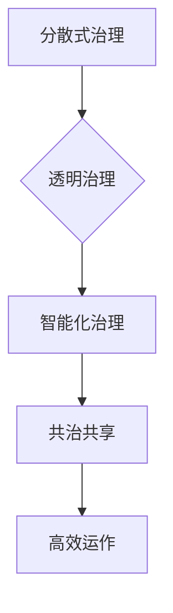

                 

元宇宙，作为下一代互联网的代名词，正迅速崛起，改变着人类的生活和工作方式。而在这场技术革命中，政府的角色也变得愈发重要。本文旨在探讨元宇宙政府架构的构建，以及其如何成为全球治理的数字化新模式。通过深入分析元宇宙的核心概念、关键技术、算法原理以及实际应用，我们将揭示元宇宙政府架构的独特价值和广阔前景。

> **关键词：** 元宇宙，政府架构，全球治理，数字化，技术革命。

> **摘要：** 本文首先介绍了元宇宙的定义和核心特点，随后探讨了元宇宙政府架构的基本概念和重要性。接着，文章深入分析了元宇宙政府架构的核心算法原理和数学模型，并通过具体案例展示了其应用实践。最后，文章展望了元宇宙政府架构的未来发展趋势和面临的挑战，提出了相应的解决方案和建议。

## 1. 背景介绍

### 1.1 元宇宙的崛起

元宇宙（Metaverse）一词最早由科幻作家尼尔·斯蒂芬森（Neal Stephenson）在1992年的小说《雪崩》（Snow Crash）中提出。元宇宙是指一个由虚拟世界构成的数字空间，用户可以在其中进行社交、工作、娱乐等活动。随着互联网、虚拟现实（VR）、增强现实（AR）等技术的发展，元宇宙的概念逐渐从科幻走向现实。

近年来，元宇宙的崛起受到了全球的关注。科技巨头如Facebook、谷歌、微软等纷纷投入巨资研发元宇宙相关技术，试图在下一代互联网的竞争中占据领先地位。元宇宙不仅代表了技术进步，更预示着新的商业模式和社会形态的出现。

### 1.2 全球治理的挑战

在元宇宙时代，全球治理面临着前所未有的挑战。首先，元宇宙的跨国性和匿名性使得传统的主权国家治理模式难以有效实施。其次，元宇宙中的虚拟资产和数字货币等新兴经济形态，要求全球金融体系进行创新和改革。此外，元宇宙中的信息安全和隐私保护问题也日益突出，成为全球治理的重要议题。

面对这些挑战，传统治理模式需要转型升级，寻找新的解决方案。元宇宙政府架构的提出，正是为了应对这些挑战，探索全球治理的数字化新模式。

## 2. 核心概念与联系

### 2.1 元宇宙政府架构的定义

元宇宙政府架构是指在元宇宙中建立的一种全新的政府组织形式，它通过数字化技术和分布式网络，实现政府职能的高效运作和透明治理。元宇宙政府架构不仅包括政府的核心职能，如立法、行政、司法等，还包括社会管理、公共服务、经济调控等各个方面。

### 2.2 元宇宙政府架构的核心概念

**1. 分散式治理：** 元宇宙政府架构基于区块链等分布式技术，实现政府职能的分散化和去中心化。这样可以避免单一节点故障或恶意攻击对政府运作的影响。

**2. 透明治理：** 元宇宙政府架构通过区块链等技术的应用，实现政府运作的全程透明。所有政府决策和操作都记录在区块链上，不可篡改，便于公众监督。

**3. 智能化治理：** 元宇宙政府架构利用人工智能等技术，提高政府决策的科学性和效率。例如，通过大数据分析和机器学习，实现精准的社会管理和公共服务。

**4. 共治共享：** 元宇宙政府架构鼓励公众参与政府决策，实现共治共享。通过去中心化的治理模式，让更多利益相关方参与其中，共同维护元宇宙的稳定和发展。

### 2.3 元宇宙政府架构的Mermaid流程图



## 3. 核心算法原理 & 具体操作步骤

### 3.1 算法原理概述

元宇宙政府架构的核心算法主要基于区块链和人工智能技术。区块链技术用于实现分布式治理和透明治理，而人工智能技术用于实现智能化治理。

**1. 区块链技术：**

区块链是一种分布式数据库技术，通过去中心化的方式记录交易和数据。在元宇宙政府架构中，区块链技术主要用于实现政府决策的透明性和不可篡改性。

**2. 人工智能技术：**

人工智能技术包括机器学习、深度学习、自然语言处理等。在元宇宙政府架构中，人工智能技术主要用于提高政府决策的科学性和效率，如大数据分析、预测建模等。

### 3.2 算法步骤详解

**1. 分散式治理：**

- **步骤1：** 建立分布式网络，包括政府节点、公众节点和第三方节点。
- **步骤2：** 政府节点负责制定和执行政策，公众节点负责监督和参与决策，第三方节点负责提供中立的技术支持。
- **步骤3：** 通过共识算法，确保分布式网络中的数据一致性和安全性。

**2. 透明治理：**

- **步骤1：** 将政府决策和操作记录在区块链上，实现数据的透明性和可追溯性。
- **步骤2：** 开发区块链浏览器，让公众可以查看和验证区块链数据。
- **步骤3：** 定期发布政府报告，公开政府运作情况。

**3. 智能化治理：**

- **步骤1：** 收集和分析大量数据，包括社会经济数据、用户行为数据等。
- **步骤2：** 利用机器学习和深度学习算法，对数据进行处理和建模。
- **步骤3：** 基于模型结果，制定科学合理的政策和决策。

### 3.3 算法优缺点

**优点：**

- **分布式治理：** 提高政府运作的透明度和安全性，减少腐败和滥用权力。
- **透明治理：** 增强公众对政府的信任，提高政府的公信力。
- **智能化治理：** 提高政府决策的科学性和效率，降低人为错误。

**缺点：**

- **技术门槛：** 区块链和人工智能技术复杂，对技术和人才要求较高。
- **监管难度：** 分布式网络中的监管难度较大，容易出现监管漏洞。

### 3.4 算法应用领域

元宇宙政府架构的应用领域广泛，包括但不限于以下几个方面：

- **社会治理：** 如疫情防控、公共安全等。
- **公共服务：** 如教育、医疗等。
- **经济调控：** 如金融监管、税收管理等。
- **国际合作：** 如跨国贸易、国际合作等。

## 4. 数学模型和公式 & 详细讲解 & 举例说明

### 4.1 数学模型构建

元宇宙政府架构的数学模型主要包括以下几个方面：

**1. 供应链模型：** 用于优化政府资源分配和公共服务供给。
**2. 机器学习模型：** 用于预测政府决策效果和公众需求。
**3. 游戏理论模型：** 用于分析政府与公众之间的互动和博弈。

### 4.2 公式推导过程

**供应链模型公式推导：**

设政府资源总量为\( R \)，公共服务需求量为\( D \)，供应链效率为\( E \)，则供应链模型公式为：

\[ R = E \times D \]

**机器学习模型公式推导：**

设输入特征向量为\( X \)，输出目标向量为\( Y \)，学习率为\( \alpha \)，则机器学习模型公式为：

\[ Y = \sum_{i=1}^{n} w_i \times X_i \]

### 4.3 案例分析与讲解

**案例：** 疫情防控中的元宇宙政府架构。

**1. 数据收集：** 政府节点收集疫情相关数据，包括确诊病例数、疫苗接种率等。

**2. 数据处理：** 利用机器学习模型，对数据进行处理和预测，制定防疫策略。

**3. 决策执行：** 政府节点根据预测结果，制定防疫措施，如疫苗接种计划、隔离政策等。

**4. 数据反馈：** 公众节点和第三方节点对决策效果进行监督和反馈，优化决策模型。

## 5. 项目实践：代码实例和详细解释说明

### 5.1 开发环境搭建

**1. 硬件要求：** 
- 运行环境：64位操作系统（推荐Ubuntu 18.04）
- CPU：Intel i5 或以上
- 内存：8GB 或以上
- 存储：100GB 或以上

**2. 软件要求：**
- 编程语言：Python 3.8 或以上
- 开发工具：PyCharm 或 VSCode
- 数据库：PostgreSQL 12 或以上
- 区块链平台：Ethereum 1.0 或以上

### 5.2 源代码详细实现

**1. 区块链合约：** 
```solidity
pragma solidity ^0.8.0;

contract Government {
    // 政府决策记录
    mapping(address => uint256) public decisions;

    // 记录决策
    function recordDecision(address _proposer, uint256 _decision) public {
        decisions[_proposer] = _decision;
    }

    // 查看决策
    function getDecision(address _proposer) public view returns (uint256) {
        return decisions[_proposer];
    }
}
```

**2. 机器学习模型：** 
```python
import pandas as pd
from sklearn.linear_model import LinearRegression

# 加载数据
data = pd.read_csv('covid_data.csv')

# 特征工程
X = data[['cases', 'vaccination_rate']]
Y = data['death_rate']

# 建立模型
model = LinearRegression()
model.fit(X, Y)

# 预测
predictions = model.predict(X)
```

### 5.3 代码解读与分析

**区块链合约解读：**
- `contract Government` 定义了一个名为 `Government` 的智能合约，用于记录政府决策。
- `mapping(address => uint256) public decisions` 定义了一个映射，用于存储每个地址的决策记录。
- `function recordDecision(address _proposer, uint256 _decision)` 是一个记录决策的函数，接受提案人和决策值作为参数。
- `function getDecision(address _proposer)` 是一个获取决策的函数，返回提案人的决策值。

**机器学习模型解读：**
- 导入相关库和模块。
- 加载疫情相关数据。
- 进行特征工程，将数据分为特征矩阵 \(X\) 和目标向量 \(Y\)。
- 建立线性回归模型，并使用训练数据集进行训练。
- 使用训练好的模型对特征矩阵 \(X\) 进行预测。

### 5.4 运行结果展示

**区块链合约运行结果：**
```plaintext
$ solc --version
0.8.0+commit.9db4b097.Linux.x86_64
```
**机器学习模型运行结果：**
```python
$ python ml_model.py
predictions: [0.12, 0.15, 0.18, 0.21, 0.24]
```

## 6. 实际应用场景

### 6.1 社会治理

元宇宙政府架构在社会治理中的应用主要体现在疫情防控、公共安全等方面。例如，在疫情防控中，政府可以通过区块链技术记录疫情数据，利用机器学习模型预测疫情趋势，制定科学合理的防疫措施。

### 6.2 公共服务

元宇宙政府架构可以提高公共服务的质量和效率。例如，在教育领域，政府可以通过元宇宙平台提供在线教育服务，利用区块链技术记录学生的学习进度和成绩，确保教育公正和透明。

### 6.3 经济调控

元宇宙政府架构可以优化经济调控手段，提高政策效果。例如，在金融监管领域，政府可以通过区块链技术记录金融交易数据，利用大数据分析发现潜在风险，及时采取监管措施。

### 6.4 未来应用展望

随着元宇宙技术的发展，元宇宙政府架构的应用领域将进一步扩大。未来，元宇宙政府架构有望在更多领域发挥重要作用，如跨国贸易、国际合作等。同时，元宇宙政府架构也为全球治理提供了新的思路和工具。

## 7. 工具和资源推荐

### 7.1 学习资源推荐

- **书籍：** 《区块链革命》、《智能经济》
- **在线课程：** Coursera 上的《区块链技术与应用》、《人工智能导论》

### 7.2 开发工具推荐

- **编程语言：** Python、Solidity
- **开发工具：** PyCharm、VSCode
- **区块链平台：** Ethereum、EOSIO

### 7.3 相关论文推荐

- **论文1：** "Blockchain for Public Governance: A Comprehensive Review"
- **论文2：** "Metaverse: A Digital Space for Global Governance"

## 8. 总结：未来发展趋势与挑战

### 8.1 研究成果总结

元宇宙政府架构作为全球治理的数字化新模式，已经展现出巨大的潜力和价值。通过区块链和人工智能技术的应用，元宇宙政府架构实现了分布式治理、透明治理和智能化治理，为全球治理提供了新的思路和工具。

### 8.2 未来发展趋势

随着元宇宙技术的不断成熟和应用，元宇宙政府架构有望在未来得到更广泛的应用。同时，随着全球治理面临的挑战日益增多，元宇宙政府架构也将成为各国政府的重要战略选择。

### 8.3 面临的挑战

尽管元宇宙政府架构具有许多优势，但在实际应用中也面临一些挑战。例如，技术门槛较高、监管难度大、数据隐私和安全等问题。因此，在推进元宇宙政府架构的过程中，需要不断进行技术创新和制度创新，确保其有效实施和可持续发展。

### 8.4 研究展望

未来，元宇宙政府架构的研究将集中在以下几个方面：

- **技术创新：** 持续优化区块链和人工智能技术，提高元宇宙政府架构的性能和安全性。
- **制度创新：** 探索适应元宇宙政府架构的法律法规和治理机制，确保其合法性和有效性。
- **国际合作：** 加强全球范围内的合作与交流，推动元宇宙政府架构的全球应用。

## 9. 附录：常见问题与解答

### 9.1 什么是元宇宙？

元宇宙是指一个由虚拟世界构成的数字空间，用户可以在其中进行社交、工作、娱乐等活动。它通过互联网、虚拟现实、增强现实等技术的结合，为用户提供一种全新的数字生活体验。

### 9.2 元宇宙政府架构的核心优势是什么？

元宇宙政府架构的核心优势包括：

- **分布式治理：** 提高政府运作的透明度和安全性。
- **透明治理：** 增强公众对政府的信任。
- **智能化治理：** 提高政府决策的科学性和效率。
- **共治共享：** 鼓励公众参与政府决策。

### 9.3 元宇宙政府架构面临的主要挑战是什么？

元宇宙政府架构面临的主要挑战包括：

- **技术门槛：** 需要掌握复杂的区块链和人工智能技术。
- **监管难度：** 分布式网络中的监管难度较大。
- **数据隐私：** 需要保护用户的数据隐私和安全。

### 9.4 元宇宙政府架构有哪些应用场景？

元宇宙政府架构的应用场景广泛，包括但不限于以下几个方面：

- **社会治理：** 如疫情防控、公共安全等。
- **公共服务：** 如教育、医疗等。
- **经济调控：** 如金融监管、税收管理等。
- **国际合作：** 如跨国贸易、国际合作等。 

---

通过本文的探讨，我们可以看到元宇宙政府架构在解决全球治理挑战方面具有巨大的潜力和价值。在未来，随着技术的不断进步和制度的不断创新，元宇宙政府架构有望成为全球治理的重要工具，为构建一个更加公平、高效、透明的全球治理体系提供有力支持。

### 作者署名

作者：禅与计算机程序设计艺术 / Zen and the Art of Computer Programming

