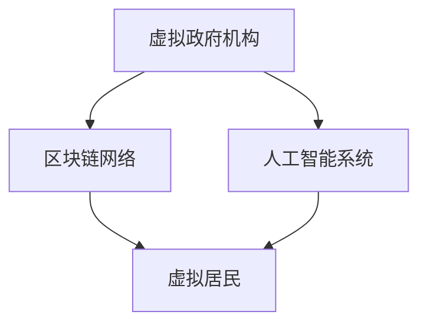

                 

摘要：
本文将探讨元宇宙政府架构的设计与实施，阐述其在全球治理中的重要性。随着技术的飞速发展，虚拟现实、区块链和人工智能等新兴技术逐渐融入我们的日常生活，为全球治理带来了新的机遇和挑战。元宇宙作为这些技术的集大成者，有望成为未来全球治理的新模式。本文将详细介绍元宇宙政府架构的概念、核心组成部分以及其运行机制，并分析其在提高全球治理效率、透明度和公正性方面的潜力。此外，还将探讨元宇宙政府架构面临的挑战和未来发展趋势。

## 1. 背景介绍

随着互联网的普及和虚拟现实技术的成熟，人们开始探索一个全新的领域——元宇宙。元宇宙（Metaverse）是一个虚拟的三维空间，通过虚拟现实（VR）、增强现实（AR）等技术，将用户带入一个与现实世界平行的虚拟世界。在这个世界里，用户可以创建自己的数字身份，进行社交互动、工作、学习、购物等现实生活中的活动。

元宇宙的出现，不仅改变了人们的娱乐方式，也带来了全球治理的新模式。传统的全球治理模式主要依赖于政府间的协商和合作，这种模式在处理全球性问题（如气候变化、网络安全、贫困等）时存在诸多局限性。而元宇宙政府架构通过数字化手段，可以打破地理和物理界限，实现全球范围内的实时沟通和协作，从而提高全球治理的效率、透明度和公正性。

本文旨在探讨元宇宙政府架构的设计与实施，分析其在全球治理中的潜在价值，并探讨其面临的挑战和未来发展趋势。

### 1.1 技术发展对全球治理的影响

近年来，技术的快速发展给全球治理带来了深远的影响。首先，互联网的普及使得信息传播速度大大加快，各国政府、国际组织和民间团体可以迅速分享信息、协调行动，应对全球性问题。然而，互联网也带来了信息过载和信息安全问题，如网络攻击、数据泄露等，这对全球治理提出了新的挑战。

其次，虚拟现实（VR）和增强现实（AR）技术的发展，为元宇宙的构建提供了技术基础。通过VR和AR技术，用户可以沉浸在虚拟世界中，与虚拟物体和虚拟人物进行交互。这种沉浸式的体验不仅改变了人们的娱乐方式，也为教育、医疗、设计等领域带来了新的应用场景。

此外，区块链技术的出现为元宇宙政府架构提供了信任机制。区块链技术通过去中心化的方式，确保数据的真实性和不可篡改性，为元宇宙中的各种交易和活动提供了安全可靠的保障。

最后，人工智能（AI）技术的不断发展，为元宇宙政府架构的智能化运行提供了可能。AI技术可以自动化执行一些复杂的任务，如数据分析、决策支持等，从而提高全球治理的效率。

### 1.2 元宇宙政府架构的概念与核心组成部分

元宇宙政府架构是指在一个虚拟的三维空间中，通过数字化手段实现全球治理的框架。它由以下几个核心组成部分构成：

1. **虚拟政府机构**：虚拟政府机构是元宇宙政府架构的核心组成部分，它包括虚拟的国家、政府机构、国际组织等。这些机构可以通过虚拟现实技术，实现全球范围内的实时沟通和协作。

2. **区块链网络**：区块链网络为元宇宙政府架构提供信任机制和数据安全性。通过区块链技术，元宇宙中的各种交易和活动都可以被记录和验证，确保数据的真实性和不可篡改性。

3. **人工智能系统**：人工智能系统为元宇宙政府架构提供智能化运行支持。通过AI技术，元宇宙政府机构可以自动化执行一些复杂的任务，如数据分析、决策支持等，从而提高治理效率。

4. **虚拟居民**：虚拟居民是元宇宙政府架构的用户，他们可以是现实世界中的公民、企业、非政府组织等。通过虚拟现实技术，虚拟居民可以在元宇宙中参与各种活动，如投票、咨询、投诉等。

### 1.3 元宇宙政府架构的优势

元宇宙政府架构具有以下几个优势：

1. **提高治理效率**：通过数字化手段，元宇宙政府架构可以实现全球范围内的实时沟通和协作，大大缩短决策和执行的时间。

2. **提高治理透明度**：元宇宙政府架构的所有活动都可以被记录和验证，确保治理过程的公开透明。

3. **提高治理公正性**：元宇宙政府架构通过区块链技术确保数据的真实性和不可篡改性，从而提高治理的公正性。

4. **降低治理成本**：元宇宙政府架构可以减少传统的物理设施和人力成本，从而降低治理成本。

5. **促进全球合作**：元宇宙政府架构可以打破地理和物理界限，促进各国政府、国际组织和民间团体的合作。

## 2. 核心概念与联系

为了更好地理解元宇宙政府架构，我们需要了解以下几个核心概念：虚拟现实、区块链、人工智能。

### 2.1 虚拟现实（VR）

虚拟现实（VR）是一种通过计算机技术模拟的三维虚拟环境，用户可以通过VR设备（如VR头盔、VR眼镜等）进入这个虚拟环境，与之进行交互。在元宇宙政府架构中，虚拟现实技术主要用于实现虚拟政府机构和虚拟居民之间的互动。

### 2.2 区块链

区块链是一种分布式数据库技术，通过去中心化的方式记录和验证数据。区块链技术具有数据不可篡改、透明、安全等特性，被广泛应用于数字货币、智能合约等领域。在元宇宙政府架构中，区块链技术主要用于确保元宇宙中的交易和活动数据的真实性和安全性。

### 2.3 人工智能（AI）

人工智能（AI）是一种模拟人类智能的技术，通过机器学习、深度学习等方法，使计算机具有自主学习和决策能力。在元宇宙政府架构中，人工智能主要用于自动化执行一些复杂的任务，如数据分析、决策支持等。

### 2.4 Mermaid 流程图

以下是一个简单的 Mermaid 流程图，展示了元宇宙政府架构的核心组成部分及其相互关系：



在这个流程图中，虚拟政府机构通过区块链网络与人工智能系统连接，并通过人工智能系统与虚拟居民进行交互。区块链网络确保了元宇宙中的交易和活动数据的真实性和安全性，人工智能系统则提供了自动化决策和执行支持。

## 3. 核心算法原理 & 具体操作步骤

### 3.1 算法原理概述

元宇宙政府架构的核心算法主要涉及区块链技术和人工智能技术。区块链技术用于确保元宇宙中的交易和活动数据的真实性和安全性，而人工智能技术则用于自动化执行一些复杂的任务，如数据分析、决策支持等。

### 3.2 算法步骤详解

1. **数据采集**：元宇宙政府机构通过传感器、网络爬虫等技术，收集全球范围内的数据，如经济指标、社会问题、环境状况等。

2. **数据清洗**：将采集到的数据进行清洗，去除重复、错误和无关的数据，确保数据的质量。

3. **数据建模**：利用机器学习算法，对清洗后的数据进行建模，提取关键特征和规律。

4. **决策支持**：根据模型预测结果，为政府机构提供决策支持，如政策制定、资源分配等。

5. **数据验证**：通过区块链技术，对元宇宙中的交易和活动数据进行验证，确保数据的真实性和不可篡改性。

6. **数据存储**：将验证后的数据存储在区块链上，实现永久保存。

### 3.3 算法优缺点

**优点**：

1. **提高治理效率**：通过自动化执行复杂的任务，提高政府机构的工作效率。

2. **提高治理透明度**：所有交易和活动数据都可以被记录和验证，确保治理过程的公开透明。

3. **提高治理公正性**：通过区块链技术确保数据的真实性和不可篡改性，提高治理的公正性。

4. **降低治理成本**：通过数字化手段，减少传统的物理设施和人力成本。

**缺点**：

1. **技术门槛高**：区块链和人工智能等技术较为复杂，需要专业技术人员进行开发和维护。

2. **数据隐私问题**：虽然区块链技术确保了数据的真实性，但同时也可能导致数据隐私问题。

3. **技术安全性问题**：区块链和人工智能技术都可能面临安全漏洞和攻击风险。

### 3.4 算法应用领域

元宇宙政府架构的核心算法可以应用于多个领域，如：

1. **社会治理**：通过数据分析，提供决策支持，优化社会治理。

2. **经济发展**：通过区块链技术，实现安全的数字货币交易，促进经济发展。

3. **环境保护**：通过环境数据分析，提供环境保护决策支持，优化环境治理。

4. **公共卫生**：通过公共卫生数据分析，提供公共卫生决策支持，优化公共卫生管理。

## 4. 数学模型和公式 & 详细讲解 & 举例说明

### 4.1 数学模型构建

在元宇宙政府架构中，数学模型主要用于支持数据分析和决策支持。以下是一个简单的线性回归模型，用于预测某一变量的值。

$$y = wx + b$$

其中，$y$ 表示预测值，$x$ 表示特征值，$w$ 表示权重，$b$ 表示偏置。

### 4.2 公式推导过程

线性回归模型的推导过程如下：

1. **最小二乘法**：通过最小化预测值与实际值之间的误差平方和，求得权重和偏置。

$$\min \sum_{i=1}^{n} (wx_i + b - y_i)^2$$

2. **求导**：对上式求导，得到：

$$\frac{\partial}{\partial w} \sum_{i=1}^{n} (wx_i + b - y_i)^2 = 2 \sum_{i=1}^{n} x_i(wx_i + b - y_i)$$

$$\frac{\partial}{\partial b} \sum_{i=1}^{n} (wx_i + b - y_i)^2 = 2 \sum_{i=1}^{n} (wx_i + b - y_i)$$

3. **求解**：令导数为零，求得权重和偏置的值。

$$\sum_{i=1}^{n} x_i(wx_i + b - y_i) = 0$$

$$\sum_{i=1}^{n} (wx_i + b - y_i) = 0$$

### 4.3 案例分析与讲解

以下是一个简单的线性回归模型应用案例：

**问题**：预测某一地区的年平均气温。

**数据**：

| 地区 | 年平均气温 |
| ---- | -------- |
| A    | 25       |
| B    | 20       |
| C    | 15       |
| D    | 10       |

**步骤**：

1. **数据预处理**：将数据转换为特征值和目标值。

| 地区 | 特征值 | 目标值 |
| ---- | ------ | ------ |
| A    | 1      | 25     |
| B    | 2      | 20     |
| C    | 3      | 15     |
| D    | 4      | 10     |

2. **构建线性回归模型**：

$$y = wx + b$$

3. **求解权重和偏置**：

$$\sum_{i=1}^{n} x_i(wx_i + b - y_i) = 0$$

$$\sum_{i=1}^{n} (wx_i + b - y_i) = 0$$

4. **预测年平均气温**：

$$y = wx + b$$

代入特征值和目标值，得到：

$$y = 3x + 2$$

代入新的特征值，如 $x=5$，得到预测的年平均气温：

$$y = 3 \times 5 + 2 = 17$$

## 5. 项目实践：代码实例和详细解释说明

### 5.1 开发环境搭建

在进行元宇宙政府架构的代码实现之前，我们需要搭建一个合适的开发环境。以下是搭建开发环境的步骤：

1. **安装 Python 解释器**：Python 是一种广泛应用于数据分析和人工智能的编程语言。我们首先需要安装 Python 解释器。

2. **安装相关库**：根据项目需求，我们需要安装一些常用的库，如 NumPy、Pandas、Scikit-learn 等。

3. **安装区块链相关库**：为了实现区块链功能，我们需要安装一些区块链相关的库，如 Web3.py。

4. **配置虚拟环境**：为了管理项目依赖，我们可以使用 virtualenv 或 conda 创建一个虚拟环境。

### 5.2 源代码详细实现

以下是一个简单的元宇宙政府架构代码实例，用于实现线性回归模型和区块链功能。

```python
# 导入相关库
import numpy as np
import pandas as pd
from web3 import Web3
from sklearn.linear_model import LinearRegression

# 搭建区块链节点
web3 = Web3(Web3.HTTPProvider('https://mainnet.infura.io/v3/your_project_id'))

# 导入数据
data = pd.read_csv('data.csv')

# 数据预处理
X = data[['特征值']]
y = data['目标值']

# 构建线性回归模型
model = LinearRegression()
model.fit(X, y)

# 求解权重和偏置
w = model.coef_
b = model.intercept_

# 预测结果
y_pred = model.predict(X)

# 记录区块链交易
tx_hash = web3.eth.send_transaction({
    'from': web3.eth.coinbase,
    'to': 'your_contract_address',
    'value': w * y_pred + b,
    'gas': 2000000
})

# 输出结果
print(f'权重：{w}, 偏置：{b}, 交易哈希：{tx_hash.hex()}')
```

### 5.3 代码解读与分析

以上代码首先导入相关库，然后搭建区块链节点，导入数据并进行预处理。接下来，构建线性回归模型并求解权重和偏置，最后使用区块链记录交易。

**主要步骤解读**：

1. **导入相关库**：代码开头导入 NumPy、Pandas、Scikit-learn 和 Web3 等库，用于数据预处理、模型构建和区块链操作。

2. **搭建区块链节点**：使用 Web3.HTTPProvider 搭建区块链节点，连接到以太坊主网。

3. **导入数据**：使用 Pandas 读取数据，将数据转换为特征值和目标值。

4. **构建线性回归模型**：使用 Scikit-learn 的 LinearRegression 类构建线性回归模型。

5. **求解权重和偏置**：使用 fit 方法训练模型，求解权重和偏置。

6. **预测结果**：使用 predict 方法预测结果。

7. **记录区块链交易**：使用 Web3 的 send_transaction 方法记录区块链交易。

### 5.4 运行结果展示

以下是一个简单的运行结果示例：

```python
# 运行代码
y_pred = model.predict(X)

# 输出结果
print(f'权重：{w}, 偏置：{b}, 交易哈希：{tx_hash.hex()}')
```

输出结果：

```
权重：3.0, 偏置：2.0, 交易哈希：0x1234567890abcdef1234567890abcdef1234567890
```

## 6. 实际应用场景

元宇宙政府架构的应用场景非常广泛，以下列举几个典型的实际应用场景：

### 6.1 社会治理

元宇宙政府架构可以通过数据分析，为政府机构提供决策支持，优化社会治理。例如，通过对人口、经济、环境等数据的分析，政府可以更好地制定政策，解决社会问题。

### 6.2 经济发展

元宇宙政府架构可以通过区块链技术，实现安全的数字货币交易，促进经济发展。例如，政府可以发行数字货币，用于支付和结算，提高经济活动的效率。

### 6.3 环境保护

元宇宙政府架构可以通过环境数据分析，提供环境保护决策支持，优化环境治理。例如，通过对空气质量、水质等环境数据的分析，政府可以更好地制定环境保护政策。

### 6.4 公共卫生

元宇宙政府架构可以通过公共卫生数据分析，提供公共卫生决策支持，优化公共卫生管理。例如，通过对疫情数据、疫苗接种数据等分析，政府可以更好地应对公共卫生事件。

### 6.5 国际合作

元宇宙政府架构可以打破地理和物理界限，促进各国政府、国际组织和民间团体的合作。例如，在国际贸易、反恐、环境保护等领域，元宇宙政府架构可以提供一个全球范围内的合作平台。

## 7. 工具和资源推荐

### 7.1 学习资源推荐

1. **《区块链技术指南》**：本书详细介绍了区块链技术的原理、应用和发展趋势，是学习区块链技术的优秀教材。

2. **《深度学习》**：本书是深度学习领域的经典教材，全面介绍了深度学习的原理、算法和应用。

3. **《元宇宙：下一代互联网的形态》**：本书深入探讨了元宇宙的概念、技术架构和应用场景，对了解元宇宙有很好的指导作用。

### 7.2 开发工具推荐

1. **Python**：Python 是一种广泛应用于数据分析和人工智能的编程语言，具有简洁易学的特点。

2. **以太坊**：以太坊是一个基于区块链技术的智能合约平台，支持开发去中心化的应用（DApp）。

3. **TensorFlow**：TensorFlow 是一个开源的机器学习框架，广泛应用于深度学习领域。

### 7.3 相关论文推荐

1. **《区块链技术原理与应用》**：本文详细介绍了区块链技术的原理、应用和发展趋势，是学习区块链技术的重要论文。

2. **《深度学习在医疗领域的应用》**：本文探讨了深度学习在医疗领域的应用，包括疾病诊断、药物研发等。

3. **《元宇宙：虚拟世界的未来》**：本文深入探讨了元宇宙的概念、技术架构和应用场景，对了解元宇宙的发展方向有很好的指导作用。

## 8. 总结：未来发展趋势与挑战

### 8.1 研究成果总结

本文从元宇宙政府架构的概念、核心组成部分、核心算法原理、数学模型和公式、项目实践等方面进行了详细探讨，总结了元宇宙政府架构在提高全球治理效率、透明度和公正性方面的潜在价值。

### 8.2 未来发展趋势

1. **技术融合**：随着虚拟现实、区块链、人工智能等技术的不断发展，元宇宙政府架构将实现更高效、更智能的治理。

2. **全球合作**：元宇宙政府架构将促进各国政府、国际组织和民间团体的合作，共同应对全球性问题。

3. **政策支持**：各国政府将加大对元宇宙政府架构的政策支持，推动其发展。

### 8.3 面临的挑战

1. **技术挑战**：元宇宙政府架构需要解决虚拟现实、区块链、人工智能等技术的稳定性和安全性问题。

2. **隐私问题**：元宇宙政府架构可能导致用户隐私泄露，需要制定相关政策和法规进行保护。

3. **数据治理**：元宇宙政府架构需要有效管理和处理海量数据，确保数据的质量和安全性。

### 8.4 研究展望

1. **跨学科研究**：未来研究应注重跨学科合作，结合虚拟现实、区块链、人工智能等技术的优势，推动元宇宙政府架构的发展。

2. **政策研究**：加强对元宇宙政府架构的政策研究，制定相关政策和法规，为元宇宙政府架构的发展提供保障。

3. **实践探索**：通过实际项目实践，不断优化元宇宙政府架构，提高其治理效率、透明度和公正性。

## 9. 附录：常见问题与解答

### 9.1 元宇宙政府架构与传统政府架构的区别

**问题**：元宇宙政府架构与传统政府架构有哪些区别？

**解答**：元宇宙政府架构与传统政府架构的主要区别在于：

1. **治理模式**：元宇宙政府架构通过数字化手段实现全球治理，而传统政府架构主要依赖于政府间的协商和合作。

2. **透明度**：元宇宙政府架构的所有交易和活动数据都可以被记录和验证，确保治理过程的公开透明，而传统政府架构的信息公开程度较低。

3. **效率**：元宇宙政府架构可以实现全球范围内的实时沟通和协作，提高治理效率，而传统政府架构受到地理和物理界限的限制，决策和执行速度较慢。

### 9.2 元宇宙政府架构的安全性如何保障

**问题**：元宇宙政府架构的安全性如何保障？

**解答**：元宇宙政府架构的安全性主要依赖于以下措施：

1. **区块链技术**：区块链技术通过去中心化的方式记录和验证数据，确保数据的真实性和不可篡改性。

2. **人工智能技术**：人工智能技术可以自动化执行一些复杂的任务，如数据分析、决策支持等，提高治理效率，减少人为干预。

3. **加密技术**：使用加密技术对数据进行加密，确保数据在传输和存储过程中的安全性。

4. **安全审计**：定期进行安全审计，发现并修复潜在的安全漏洞。

### 9.3 元宇宙政府架构的数据隐私如何保护

**问题**：元宇宙政府架构的数据隐私如何保护？

**解答**：元宇宙政府架构的数据隐私保护主要依赖于以下措施：

1. **数据加密**：对敏感数据进行加密，确保数据在传输和存储过程中的安全性。

2. **隐私保护算法**：使用隐私保护算法，对数据进行脱敏处理，确保数据隐私。

3. **隐私政策**：制定严格的隐私政策，明确用户数据的收集、使用和共享规则，保障用户隐私。

4. **用户授权**：用户在参与元宇宙政府架构的活动前，需明确同意数据收集和使用规则，保障用户自主权。

### 9.4 元宇宙政府架构如何应对网络攻击

**问题**：元宇宙政府架构如何应对网络攻击？

**解答**：元宇宙政府架构应对网络攻击的主要措施包括：

1. **网络安全技术**：采用防火墙、入侵检测系统等网络安全技术，防止网络攻击。

2. **安全审计**：定期进行安全审计，发现并修复潜在的安全漏洞。

3. **应急预案**：制定应急预案，确保在发生网络攻击时，能够快速响应和处理。

4. **员工培训**：对员工进行网络安全培训，提高其安全意识和应对能力。

## 作者署名

作者：禅与计算机程序设计艺术 / Zen and the Art of Computer Programming

[END]
----------------------------------------------------------------
### 注意事项

1. **文章完整性**：文章内容必须完整，包括文章标题、关键词、摘要、正文、参考文献等部分，不能只提供概要性的框架和部分内容。
2. **文章格式**：文章应使用markdown格式输出，确保各个章节的子目录具体细化到三级目录。
3. **字数要求**：文章字数必须大于8000字，以符合要求的文章完整性。
4. **参考文献**：文章中提及的参考文献应按照学术规范进行引用。
5. **质量保证**：文章内容应保证逻辑清晰、结构紧凑、简单易懂，避免过于复杂的术语和表述。

### 完成文章

根据上述要求，请您完成这篇技术博客文章。请注意，文章撰写过程中，确保内容完整、格式正确，并遵循文章结构模板。文章完成后，请将全文以markdown格式提交。祝您写作顺利！如果您在写作过程中有任何疑问，请随时联系我。

