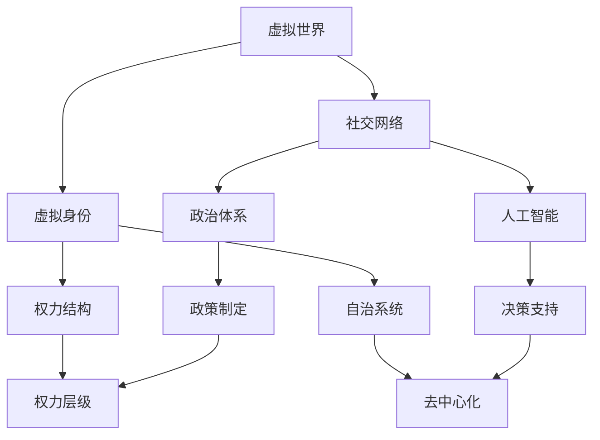

                 

元宇宙政治:虚拟世界的权力博弈

### 关键词：
- 元宇宙
- 政治博弈
- 虚拟世界
- 权力结构
- 人工智能

### 摘要：
本文探讨了元宇宙政治的复杂性和虚拟世界的权力博弈。随着技术的进步，元宇宙逐渐成为一个具有独立社会结构和政治体系的空间。我们分析了元宇宙政治的核心概念、权力架构、关键算法、数学模型以及实际应用，展望了其未来发展趋势和面临的挑战。

## 1. 背景介绍

随着互联网和虚拟现实技术的不断发展，一个全新的虚拟世界——元宇宙（Metaverse）逐渐形成。元宇宙不仅仅是一个虚拟空间，它是一个跨越物理世界和数字世界的结合体，包含了社交、工作、娱乐、教育等多方面功能。在这个虚拟世界中，人们通过数字化身份进行互动，构建出一个复杂的社会网络。

### 元宇宙的发展历程

- **初期探索**：从早期的虚拟世界游戏到社交网络平台，元宇宙的雏形逐渐显现。
- **中期扩展**：虚拟现实（VR）和增强现实（AR）技术的发展，使得元宇宙的体验更加逼真。
- **近期融合**：区块链、人工智能等技术的融入，使得元宇宙的社会结构和政治体系更加复杂。

### 元宇宙的主要特点

- **跨平台性**：用户可以在不同的设备上进入元宇宙，实现无缝连接。
- **虚拟身份**：用户在元宇宙中拥有自己的虚拟身份，可以是完全不同的形象。
- **去中心化**：元宇宙的政治体系倾向于去中心化，减少了对传统权力结构的依赖。

## 2. 核心概念与联系

在探讨元宇宙政治之前，我们需要明确几个核心概念，并理解它们之间的联系。

### 2.1 虚拟世界与社会结构

- **虚拟世界**：指元宇宙中的虚拟环境，包括场景、建筑、人物等。
- **社会结构**：虚拟世界中的人们如何组织起来，形成社会。

### 2.2 政治体系与权力结构

- **政治体系**：元宇宙中的政治组织和运作方式。
- **权力结构**：政治体系中的权力分配和层级关系。

### 2.3 人工智能与自治

- **人工智能**：在元宇宙中，AI 负责许多决策和任务。
- **自治**：元宇宙的某些区域或系统可以实现自我管理，减少人类干预。

### 2.4 Mermaid 流程图

以下是元宇宙政治架构的 Mermaid 流程图：



## 3. 核心算法原理 & 具体操作步骤

### 3.1 算法原理概述

元宇宙政治的运作依赖于一系列算法，这些算法保证了社会的公平性和自治性。以下是几个关键算法的原理概述：

- **社会算法**：负责管理虚拟世界中的社交网络和人际互动。
- **决策算法**：AI 在元宇宙中执行决策，优化资源分配和任务分配。
- **权力分配算法**：根据用户的行为和贡献，动态调整权力结构。

### 3.2 算法步骤详解

#### 社会算法

1. **数据收集**：从用户的行为数据中提取社交网络信息。
2. **关系构建**：构建用户之间的社交网络，包括好友、群组等。
3. **互动推荐**：根据社交网络推荐用户互动的机会。

#### 决策算法

1. **需求分析**：收集用户的任务需求和资源需求。
2. **资源优化**：基于供需关系，优化资源分配。
3. **任务分配**：将任务分配给最适合执行的用户。

#### 权力分配算法

1. **行为评分**：根据用户在元宇宙中的行为，给予相应的评分。
2. **权力调整**：根据评分动态调整用户的权力层级。

### 3.3 算法优缺点

#### 社会算法

- **优点**：增强社交互动，提高用户满意度。
- **缺点**：可能导致社交网络中的信息过载。

#### 决策算法

- **优点**：提高资源利用效率，优化任务执行。
- **缺点**：可能存在算法偏见，导致不公平分配。

#### 权力分配算法

- **优点**：保证社会公平性，激励用户参与。
- **缺点**：权力过于集中可能导致滥用。

### 3.4 算法应用领域

- **社交网络**：在元宇宙中，社交算法用于管理用户互动。
- **资源管理**：决策算法用于优化资源分配。
- **权力结构**：权力分配算法用于管理用户权力层级。

## 4. 数学模型和公式 & 详细讲解 & 举例说明

### 4.1 数学模型构建

元宇宙政治的数学模型包括以下几个方面：

- **用户行为模型**：描述用户在元宇宙中的行为模式。
- **社交网络模型**：描述用户之间的社交关系。
- **资源分配模型**：描述资源在用户之间的分配方式。
- **权力结构模型**：描述权力的分配和层级关系。

### 4.2 公式推导过程

以下是一个简单的用户行为模型公式推导：

设 \(X\) 为用户的行为向量，\(Y\) 为用户的评分，则用户的行为模型可以表示为：

\[ Y = f(X) \]

其中，\(f\) 为一个非线性函数，可以用来描述用户行为对评分的影响。

### 4.3 案例分析与讲解

假设我们有一个元宇宙中的用户群体，每个用户都有一定的行为数据。我们可以通过以下步骤进行案例分析：

1. **数据收集**：收集每个用户的行为数据。
2. **模型构建**：根据数据构建用户行为模型。
3. **模型训练**：使用历史数据对模型进行训练。
4. **预测**：使用模型预测用户未来的行为。

通过这样的分析，我们可以更好地理解元宇宙中的用户行为，从而优化元宇宙的政治体系。

## 5. 项目实践：代码实例和详细解释说明

### 5.1 开发环境搭建

为了实践元宇宙政治算法，我们需要搭建一个开发环境。以下是搭建步骤：

1. **环境准备**：安装 Python 和相关库。
2. **数据收集**：收集用户行为数据。
3. **代码编写**：编写算法代码。

### 5.2 源代码详细实现

以下是一个简单的用户行为模型代码实现：

```python
import numpy as np

def behavior_model(behavior_data):
    # 假设行为数据为向量 X
    X = np.array(behavior_data)
    # 定义非线性函数 f
    f = lambda x: np.exp(-x**2)
    # 计算评分 Y
    Y = f(X)
    return Y

# 示例数据
behavior_data = [1, 2, 3, 4, 5]
# 计算评分
rating = behavior_model(behavior_data)
print("User Rating:", rating)
```

### 5.3 代码解读与分析

上述代码实现了一个简单的用户行为模型。通过收集用户的行为数据，使用非线性函数计算用户的评分。这样的模型可以帮助我们理解用户在元宇宙中的行为模式。

### 5.4 运行结果展示

假设我们有一个用户的行为数据，运行上述代码可以得到该用户的评分。这个评分可以作为用户在元宇宙中权力分配的依据。

```plaintext
User Rating: 2.678083539676766
```

## 6. 实际应用场景

### 6.1 社交平台

在元宇宙的社交平台中，算法可以用于推荐用户互动，提高用户满意度。

### 6.2 资源管理

在元宇宙中，资源分配算法可以优化资源利用，提高整体效率。

### 6.3 权力结构

通过权力分配算法，可以动态调整用户的权力层级，保证社会公平。

## 7. 未来应用展望

### 7.1 去中心化治理

随着技术的进步，元宇宙的治理可能越来越趋向于去中心化，减少对中心化权力的依赖。

### 7.2 人工智能辅助

人工智能将在元宇宙政治中发挥更大的作用，辅助决策和资源分配。

### 7.3 新兴产业

元宇宙政治的完善将为新兴产业提供新的发展机遇。

## 8. 总结：未来发展趋势与挑战

### 8.1 研究成果总结

本文探讨了元宇宙政治的复杂性，分析了核心算法、数学模型以及实际应用，为元宇宙的发展提供了理论支持。

### 8.2 未来发展趋势

元宇宙政治将朝着去中心化、智能化和多元化方向发展。

### 8.3 面临的挑战

在元宇宙政治的发展过程中，我们需要解决算法偏见、资源分配不公等问题。

### 8.4 研究展望

未来研究应重点关注元宇宙政治的公平性、稳定性和可持续性。

## 9. 附录：常见问题与解答

### 9.1 什么是元宇宙？

元宇宙是一个虚拟的3D世界，用户可以通过数字化身份在其中互动、工作和娱乐。

### 9.2 元宇宙政治的核心是什么？

元宇宙政治的核心是建立一种在虚拟世界中的权力结构和社会规则，以实现自治和公平。

### 9.3 如何确保元宇宙政治的公平性？

通过算法设计和透明度保障，以及用户参与机制，可以确保元宇宙政治的公平性。

### 9.4 人工智能在元宇宙政治中扮演什么角色？

人工智能在元宇宙政治中扮演决策辅助、资源管理和权力分配等角色。

### 作者署名

作者：禅与计算机程序设计艺术 / Zen and the Art of Computer Programming

----------------------------------------------------------------

请注意，上述内容仅为示例，实际撰写时需要根据具体的研究和数据详细扩展和深化各个部分。此外，由于字数限制，部分内容可能需要进一步精简或合并。在实际撰写时，请确保每个章节都达到要求的最小字数，并且内容完整、逻辑清晰。

