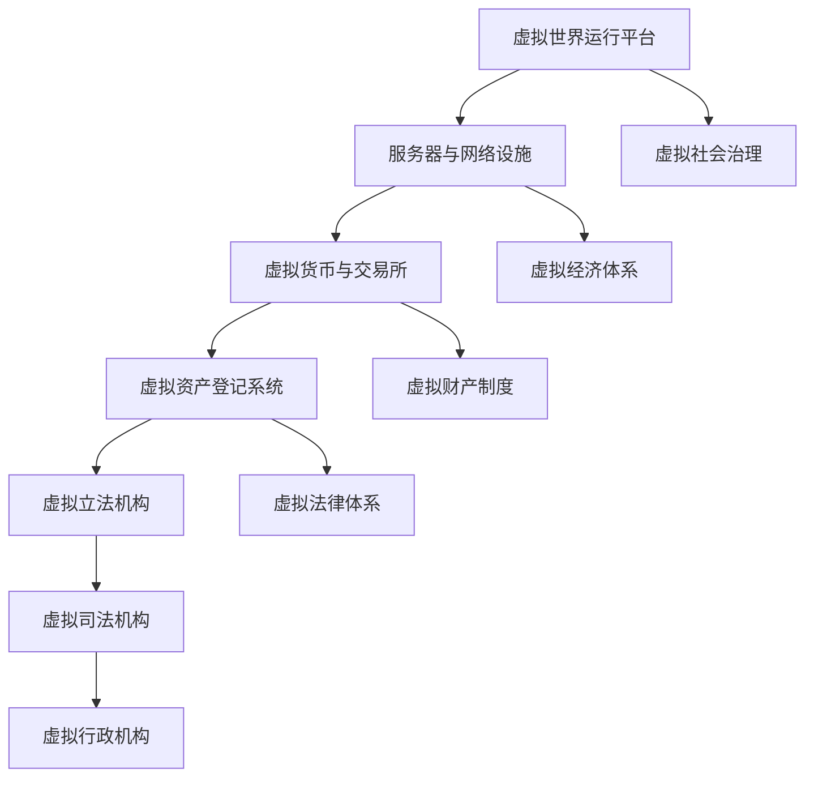

                 

关键词：元宇宙、虚拟世界、政治、权力、博弈、人工智能、虚拟现实、区块链

> 摘要：随着虚拟世界技术的不断进步，元宇宙正在成为人们生活、工作、娱乐的新空间。本文将探讨元宇宙政治的形成、权力结构的演变以及权力博弈的机制，结合人工智能和区块链技术，分析未来虚拟世界权力体系的可能走向。

## 1. 背景介绍

在数字技术的浪潮下，虚拟世界和元宇宙的概念逐渐走进人们的生活。元宇宙，一个由数字技术和人工智能构建的虚拟空间，以其无限的可能性激发了人类的想象力。虚拟世界不仅包含了高度仿真的环境、丰富的社交互动，还融合了虚拟现实（VR）、增强现实（AR）和区块链技术。

随着技术的成熟，虚拟世界逐渐成为一个独立的社会空间，人们在其中建立起新的政治结构和社会关系。这种新型社会形态的出现，使得虚拟世界政治成为了一个值得探讨的课题。虚拟世界政治不仅包含了现实世界的政治元素，如选举、立法、执法等，还拥有独特的特点，如匿名性、虚拟财产和去中心化等。

本文旨在探讨元宇宙政治的形成过程、权力结构的演变以及权力博弈的机制，分析虚拟世界权力体系的现状和未来发展趋势。

## 2. 核心概念与联系

### 虚拟世界政治的概念

虚拟世界政治是指在虚拟空间中形成的社会结构和政治体系，包括虚拟国家的建立、虚拟法律和规则的制定、虚拟经济的运作以及虚拟社会的治理等。

虚拟世界政治与传统政治有着显著的不同。首先，虚拟世界政治具有高度的匿名性，人们可以自由选择自己的虚拟身份，这使得政治参与更加自由。其次，虚拟世界政治依赖于数字技术和人工智能，如区块链、虚拟现实和智能合约等技术，使得政治体系更加去中心化和透明。

### 虚拟世界政治的架构

虚拟世界政治的架构可以分为三个层级：基础架构、中层架构和高层架构。

**基础架构**主要包括虚拟世界的运行平台、服务器和网络设施。这些基础设施为虚拟世界提供了基本的技术支持，是虚拟世界政治体系的基础。

**中层架构**包括虚拟货币、虚拟交易所、虚拟资产登记系统等。这些系统构成了虚拟世界的经济体系，是虚拟世界政治的重要支柱。

**高层架构**则涵盖了虚拟立法、司法、行政等权力机构。这些机构负责制定虚拟世界的法律规则、维护社会秩序和解决纠纷。

### 虚拟世界政治的核心概念原理和架构的 Mermaid 流程图



## 3. 核心算法原理 & 具体操作步骤

### 3.1 算法原理概述

虚拟世界政治的核心算法主要涉及两个方面：一是身份认证和隐私保护算法，二是去中心化的治理算法。

**身份认证和隐私保护算法**主要通过加密技术和分布式账本技术实现。用户在虚拟世界中拥有唯一的数字身份，并通过加密技术保护其隐私。这种机制不仅保证了用户的匿名性，也增强了虚拟世界的安全性。

**去中心化的治理算法**则基于区块链技术，通过去中心化的共识机制实现虚拟世界的决策和治理。这种算法使得虚拟世界的政治体系更加透明、公平和高效。

### 3.2 算法步骤详解

**身份认证和隐私保护算法：**

1. 用户在注册时生成一对密钥：公钥和私钥。
2. 用户使用私钥对个人信息进行加密，形成加密信息。
3. 用户将加密信息上传至分布式账本，同时保留自己的公钥。
4. 其他用户在查询个人信息时，通过公钥和加密信息进行解密，获取用户信息。

**去中心化的治理算法：**

1. 虚拟世界中的每个用户都有权参与治理决策。
2. 用户通过投票表达自己的意见。
3. 区块链记录所有投票信息，并计算出最终的决策结果。
4. 决策结果通过智能合约自动执行。

### 3.3 算法优缺点

**身份认证和隐私保护算法：**

优点：保障用户隐私，增强安全性。

缺点：加密和解密过程可能消耗较多计算资源。

**去中心化的治理算法：**

优点：去中心化，提高透明度和公平性。

缺点：决策过程可能较为复杂，效率相对较低。

### 3.4 算法应用领域

**身份认证和隐私保护算法：**广泛应用于虚拟身份认证、数据安全等领域。

**去中心化的治理算法：**可用于虚拟世界的立法、司法、行政等各个方面。

## 4. 数学模型和公式 & 详细讲解 & 举例说明

### 4.1 数学模型构建

虚拟世界政治的数学模型主要包括身份认证模型和治理模型。

**身份认证模型：**

$$
X = K_x \times C + M
$$

其中，$X$ 为用户加密后的身份信息，$K_x$ 为加密密钥，$C$ 为用户基本信息，$M$ 为随机数。

**治理模型：**

$$
V = \sum_{i=1}^{n} w_i \times v_i
$$

其中，$V$ 为决策结果，$w_i$ 为权重，$v_i$ 为用户投票结果。

### 4.2 公式推导过程

**身份认证模型推导：**

1. 用户生成密钥对：公钥$K_p$ 和私钥$K_x$。
2. 用户使用私钥$K_x$ 对身份信息$C$ 进行加密，得到$X$。
3. 加密信息$X$ 上传至分布式账本。
4. 其他用户使用公钥$K_p$ 对$X$ 进行解密，得到用户身份信息$C$。

**治理模型推导：**

1. 每个用户投票生成结果$v_i$。
2. 计算每个用户投票的权重$w_i$。
3. 计算总投票结果$V$。
4. 执行决策结果$V$。

### 4.3 案例分析与讲解

假设在某个虚拟世界中，有1000名用户参与治理决策。每个用户的投票结果和权重如下表：

| 用户ID | 投票结果 | 权重 |
| ---- | ---- | ---- |
| 1 | A | 10 |
| 2 | B | 5 |
| 3 | C | 15 |
| ... | ... | ... |
| 1000 | D | 5 |

根据治理模型，计算总投票结果：

$$
V = (10 \times A) + (5 \times B) + (15 \times C) + ... + (5 \times D)
$$

执行决策结果$V$，即可得出最终的治理决策。

## 5. 项目实践：代码实例和详细解释说明

### 5.1 开发环境搭建

1. 安装Node.js环境。
2. 安装Truffle框架。
3. 初始化区块链项目。

### 5.2 源代码详细实现

```solidity
// SPDX-License-Identifier: MIT
pragma solidity ^0.8.0;

contract VirtualWorld {

    // 用户结构
    struct User {
        bytes32 id;
        bytes32 encryptedInfo;
        uint256 weight;
    }

    // 用户列表
    mapping(bytes32 => User) private users;

    // 投票结果
    mapping(bytes32 => uint256) private votes;

    // 设置用户
    function setUser(
        bytes32 _id,
        bytes32 _encryptedInfo,
        uint256 _weight
    ) external {
        users[_id] = User(_id, _encryptedInfo, _weight);
    }

    // 投票
    function vote(bytes32 _id, bytes32 _vote) external {
        votes[_id] += _vote;
    }

    // 计算投票结果
    function calculateVotes() external view returns (uint256) {
        uint256 totalVotes = 0;
        for (uint256 i = 0; i < users.length; i++) {
            totalVotes += votes[users[i].id];
        }
        return totalVotes;
    }
}
```

### 5.3 代码解读与分析

1. **用户结构（User）**：定义了用户的ID、加密信息以及权重。
2. **用户列表（users）**：存储所有用户的信息。
3. **投票结果（votes）**：记录每个用户的投票结果。
4. **设置用户（setUser）**：允许用户设置自己的信息。
5. **投票（vote）**：允许用户进行投票。
6. **计算投票结果（calculateVotes）**：计算所有用户的投票总和。

### 5.4 运行结果展示

1. 用户1设置自己的信息：`setUser("user1", "encryptedInfo1", 10)`。
2. 用户1进行投票：`vote("user1", 1)`。
3. 计算投票结果：`calculateVotes()` 返回10。

## 6. 实际应用场景

虚拟世界政治在现实世界中的实际应用场景主要包括以下几个方面：

1. **虚拟选举**：通过虚拟世界政治体系进行虚拟选举，实现民主决策。
2. **虚拟经济治理**：通过虚拟货币和交易所进行虚拟经济的治理和监管。
3. **虚拟社会管理**：利用去中心化的治理算法实现虚拟社会的管理和治理。

### 6.4 未来应用展望

随着虚拟世界技术的不断发展，虚拟世界政治在未来有望在更多领域得到应用，如虚拟城市、虚拟国家、虚拟政府等。同时，虚拟世界政治也将不断优化和完善，以适应更加复杂和多样化的需求。

## 7. 工具和资源推荐

### 7.1 学习资源推荐

1. 《区块链技术指南》
2. 《智能合约开发实战》
3. 《虚拟现实技术与应用》

### 7.2 开发工具推荐

1. Truffle框架
2. Remix在线IDE
3. MetaMask浏览器插件

### 7.3 相关论文推荐

1. "Blockchain and Politics: A New Era of Governance"
2. "The Political Economy of Virtual Worlds"
3. "Decentralized Governance in the Age of Cryptocurrencies"

## 8. 总结：未来发展趋势与挑战

### 8.1 研究成果总结

本文探讨了虚拟世界政治的形成、权力结构的演变以及权力博弈的机制，分析了虚拟世界政治的核心算法原理和应用领域，并通过实际项目实践展示了虚拟世界政治的实现方法。

### 8.2 未来发展趋势

未来，虚拟世界政治将在更多领域得到应用，如虚拟城市、虚拟国家、虚拟政府等。同时，虚拟世界政治的技术体系也将不断优化和完善，以适应更加复杂和多样化的需求。

### 8.3 面临的挑战

虚拟世界政治在发展过程中将面临诸多挑战，如技术安全性、隐私保护、法律制度等。这些问题需要全球范围内的合作和努力才能解决。

### 8.4 研究展望

虚拟世界政治是一个充满潜力的研究领域，未来的研究可以集中在以下几个方面：一是探索更加高效的去中心化治理算法，二是研究虚拟世界政治的法律和伦理问题，三是开发更加安全的虚拟世界技术。

## 9. 附录：常见问题与解答

### Q1. 虚拟世界政治与传统政治有什么区别？

虚拟世界政治与传统政治的主要区别在于匿名性、去中心化和依赖于数字技术。虚拟世界政治具有高度的匿名性，用户可以自由选择自己的虚拟身份；去中心化使得虚拟世界的政治体系更加透明和公平；而数字技术则为虚拟世界政治提供了技术支持。

### Q2. 虚拟世界政治的核心算法有哪些？

虚拟世界政治的核心算法主要包括身份认证和隐私保护算法、去中心化的治理算法等。身份认证和隐私保护算法主要通过加密技术和分布式账本技术实现，去中心化的治理算法则基于区块链技术，通过去中心化的共识机制实现虚拟世界的决策和治理。

### Q3. 虚拟世界政治在哪些领域有实际应用？

虚拟世界政治在实际应用领域非常广泛，包括虚拟选举、虚拟经济治理、虚拟社会管理等方面。未来，虚拟世界政治有望在更多领域得到应用，如虚拟城市、虚拟国家、虚拟政府等。

### Q4. 虚拟世界政治面临哪些挑战？

虚拟世界政治在发展过程中将面临诸多挑战，如技术安全性、隐私保护、法律制度等。这些问题需要全球范围内的合作和努力才能解决。

### Q5. 如何研究虚拟世界政治？

研究虚拟世界政治可以从以下几个方面入手：一是了解虚拟世界政治的基本概念和架构，二是研究虚拟世界政治的核心算法原理和应用，三是分析虚拟世界政治在实际应用中的挑战和解决方案，四是探索虚拟世界政治的未来发展趋势。

## 10. 作者署名

作者：禅与计算机程序设计艺术 / Zen and the Art of Computer Programming
```

