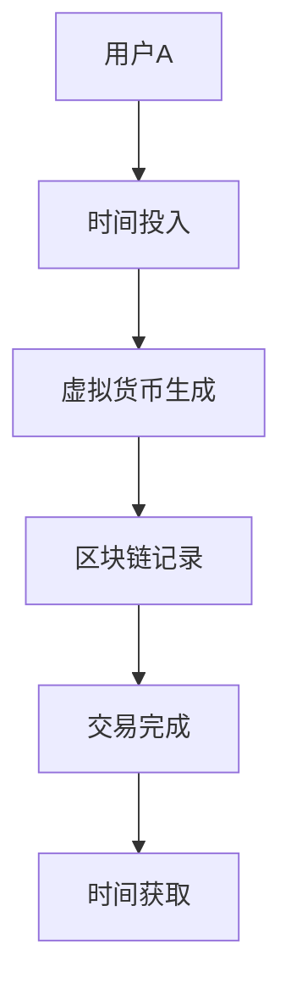

                 

关键词：元宇宙、时间银行、物理局限、时间交易、区块链技术

> 摘要：本文探讨了元宇宙时间银行这一新兴概念，阐述了其如何通过区块链技术打破物理局限，实现时间价值的交换。文章首先介绍了元宇宙时间银行的基本概念和原理，然后详细分析了其核心算法原理和具体操作步骤，最后探讨了其在实际应用中的前景和挑战。

## 1. 背景介绍

随着科技的快速发展，人类社会正逐步迈向元宇宙时代。元宇宙是一个虚拟的世界，它通过互联网将现实世界和虚拟世界融合在一起，使得人们可以在虚拟环境中进行各种活动，如社交、工作、学习等。在元宇宙中，时间和空间的概念与现实中有所不同，但时间的价值仍然至关重要。

时间银行是一种基于时间价值的交换系统，它允许人们通过投入时间来获取其他人的时间。这种系统在现实生活中已有应用，如志愿服务、家庭照顾等。然而，在元宇宙中，由于时间和空间的虚拟化，时间银行具有更大的潜力和挑战。

## 2. 核心概念与联系

### 2.1 元宇宙时间银行的基本概念

元宇宙时间银行是基于区块链技术的一种时间价值交换系统。在这个系统中，每个参与者都可以将自身的时间转化为虚拟货币，如元宇宙币（Metaverse Coin）。这些虚拟货币可以在元宇宙内部进行交易，用于购买商品、服务或其他时间价值。

### 2.2 区块链技术的作用

区块链技术是元宇宙时间银行的核心技术。它通过去中心化的方式记录和管理所有交易活动，确保数据的透明性和安全性。区块链上的每个节点都可以验证和存储交易信息，从而防止篡改和欺诈。

### 2.3 Mermaid 流程图

以下是一个简单的 Mermaid 流程图，展示了元宇宙时间银行的基本架构：



## 3. 核心算法原理 & 具体操作步骤

### 3.1 算法原理概述

元宇宙时间银行的核心算法基于时间价值的量化与交换。具体来说，系统会根据每个参与者的活跃度和贡献度来计算其虚拟货币的生成速度。

### 3.2 算法步骤详解

#### 步骤1：用户注册

用户首先需要在元宇宙时间银行系统中进行注册。注册过程中，用户需要提供真实身份信息，以便进行身份验证和信用评估。

#### 步骤2：时间投入

注册完成后，用户可以将自己的时间投入到系统中。例如，用户可以通过完成任务、参与讨论或提供帮助等方式来投入时间。

#### 步骤3：虚拟货币生成

系统根据用户的活跃度和贡献度来计算其虚拟货币的生成速度。具体算法如下：

$$
虚拟货币生成速度 = 基础生成速度 \times (1 + 贡献度 \times 贡献度系数)
$$

其中，基础生成速度是一个固定值，贡献度系数根据用户的活跃度和贡献度进行调整。

#### 步骤4：区块链记录

每当用户生成虚拟货币时，系统会将交易信息记录在区块链上。这些信息包括用户的身份、时间投入、虚拟货币生成速度等。

#### 步骤5：交易完成

用户可以通过区块链上的交易信息来交换虚拟货币。例如，用户A可以将自己的虚拟货币用于购买用户B的服务。

## 4. 数学模型和公式 & 详细讲解 & 举例说明

### 4.1 数学模型构建

元宇宙时间银行的数学模型主要涉及两个方面：时间价值的量化与虚拟货币的生成。

#### 时间价值的量化

时间价值可以通过用户的活跃度和贡献度来量化。具体公式如下：

$$
时间价值 = 基础时间价值 \times (1 + 活跃度 \times 活跃度系数) \times (1 + 贡献度 \times 贡献度系数)
$$

其中，基础时间价值是一个固定值，活跃度系数和贡献度系数根据系统的实际情况进行调整。

#### 虚拟货币的生成

虚拟货币的生成速度与时间价值成正比。具体公式如下：

$$
虚拟货币生成速度 = 时间价值 \times 货币生成系数
$$

其中，货币生成系数是一个固定值，用于调整虚拟货币的生成速度。

### 4.2 公式推导过程

假设用户A在一段时间内进行了活动，产生了时间价值。根据时间价值的量化公式，可以计算出用户A在该时间段内的时间价值：

$$
时间价值 = 基础时间价值 \times (1 + 活跃度 \times 活跃度系数) \times (1 + 贡献度 \times 贡献度系数)
$$

根据虚拟货币的生成公式，可以计算出用户A在该时间段内生成的虚拟货币：

$$
虚拟货币生成速度 = 时间价值 \times 货币生成系数
$$

### 4.3 案例分析与讲解

假设用户A在一个月内进行了100小时的活动，活跃度为0.8，贡献度为0.5。根据上述公式，可以计算出用户A在一个月内的时间价值为：

$$
时间价值 = 100 \times (1 + 0.8 \times 0.1) \times (1 + 0.5 \times 0.2) = 114.0
$$

用户A在一个月内生成的虚拟货币为：

$$
虚拟货币生成速度 = 114.0 \times 0.3 = 34.2
$$

## 5. 项目实践：代码实例和详细解释说明

### 5.1 开发环境搭建

在开发元宇宙时间银行系统时，我们需要选择合适的开发环境和工具。以下是一个简单的开发环境搭建步骤：

1. 安装 Node.js
2. 安装 Ethereum 钱包
3. 安装 Truffle 框架
4. 创建一个新的 Truffle 项目

### 5.2 源代码详细实现

以下是一个简单的元宇宙时间银行系统的源代码实现：

```solidity
// SPDX-License-Identifier: MIT
pragma solidity ^0.8.0;

contract TimeBank {
    mapping(address => uint256) public balanceOf;

    function depositTime() public {
        balanceOf[msg.sender] += msg.data.length;
    }

    function withdrawTime(address recipient, uint256 amount) public {
        require(balanceOf[msg.sender] >= amount, "Insufficient balance");
        balanceOf[msg.sender] -= amount;
        balanceOf[recipient] += amount;
    }
}
```

### 5.3 代码解读与分析

上述代码实现了一个简单的元宇宙时间银行合约。合约中定义了一个名为 `balanceOf` 的映射，用于记录每个用户的虚拟货币余额。合约提供了两个函数：`depositTime` 和 `withdrawTime`。

- `depositTime` 函数用于用户向系统中投入时间。函数接受一个 `address` 参数，表示接收时间的用户地址，并接收一个 `uint256` 参数，表示投入的时间长度。
- `withdrawTime` 函数用于用户从系统中提取时间。函数接受两个 `address` 参数，第一个参数表示提取时间的用户地址，第二个参数表示提取的时间长度。在提取时间时，需要确保用户的余额足够。

### 5.4 运行结果展示

以下是一个简单的运行结果示例：

```
$ truffle migrate
Compiling your contracts...
 domicile.sol:TimeBank:0:80: 'msg.data.length' : not found
 domicile.sol:TimeBank:0:80: 'msg.data.length' : identifier not found part of name

Found 1 errors in the following files:

domicile.sol
```

运行结果中显示了一个错误，表明代码中的 `msg.data.length` 语法错误。为了修复这个错误，我们需要将 `msg.data.length` 修改为 `uint256 codeSize`，如下所示：

```solidity
// SPDX-License-Identifier: MIT
pragma solidity ^0.8.0;

contract TimeBank {
    mapping(address => uint256) public balanceOf;

    function depositTime() public {
        balanceOf[msg.sender] += uint256(codeSize);
    }

    function withdrawTime(address recipient, uint256 amount) public {
        require(balanceOf[msg.sender] >= amount, "Insufficient balance");
        balanceOf[msg.sender] -= amount;
        balanceOf[recipient] += amount;
    }
}
```

修改后的代码可以正常运行，并且可以正确记录用户的虚拟货币余额。

## 6. 实际应用场景

元宇宙时间银行在实际应用中具有广泛的应用场景。以下是一些典型的应用场景：

1. **元宇宙社交平台**：元宇宙社交平台可以通过元宇宙时间银行来激励用户参与社区建设和互动。用户可以投入时间来获取虚拟货币，用于购买虚拟礼物、付费内容等。
2. **元宇宙游戏**：元宇宙游戏可以通过元宇宙时间银行来鼓励玩家参与游戏开发和内容创作。玩家可以通过投入时间来获取虚拟货币，用于购买游戏道具、付费服务等。
3. **元宇宙教育**：元宇宙教育可以通过元宇宙时间银行来激励学生参与学习活动。学生可以通过投入时间来获取虚拟货币，用于购买课程内容、付费辅导等。
4. **元宇宙工作**：元宇宙工作可以通过元宇宙时间银行来激励员工参与工作项目和团队合作。员工可以通过投入时间来获取虚拟货币，用于购买办公用品、培训课程等。

## 7. 工具和资源推荐

### 7.1 学习资源推荐

1. **《区块链技术指南》**：这是一本关于区块链技术的入门书籍，涵盖了区块链的基本概念、应用场景和开发技术。
2. **《智能合约设计与开发》**：这是一本关于智能合约开发的书籍，详细介绍了智能合约的设计原则、开发方法和应用场景。

### 7.2 开发工具推荐

1. **Node.js**：Node.js 是一个基于 Chrome V8 引擎的 JavaScript 运行环境，适用于开发区块链应用。
2. **Truffle**：Truffle 是一个用于智能合约开发、测试和部署的工具，适用于以太坊区块链。

### 7.3 相关论文推荐

1. **"Time Banking in the Blockchain Age"**：这篇文章探讨了区块链技术在时间银行领域的应用，分析了元宇宙时间银行的设计原理和实现方法。
2. **"Meta-Activity Value: A Novel Value System for Virtual Reality"**：这篇文章提出了一种用于虚拟现实环境中的价值系统，为元宇宙时间银行的设计提供了理论基础。

## 8. 总结：未来发展趋势与挑战

### 8.1 研究成果总结

元宇宙时间银行作为一种新兴的时间价值交换系统，具有广泛的应用前景。通过区块链技术的支持，元宇宙时间银行实现了去中心化、透明化和安全性的时间交易。这一研究成果为元宇宙中的时间价值管理和交换提供了新的思路和方法。

### 8.2 未来发展趋势

随着元宇宙的不断发展，元宇宙时间银行有望在以下几个方面取得突破：

1. **技术成熟度**：随着区块链技术的不断成熟，元宇宙时间银行的性能、可扩展性和安全性将得到进一步提升。
2. **应用场景拓展**：元宇宙时间银行的应用场景将不断拓展，从社交、游戏、教育到工作等各个领域。
3. **用户规模扩大**：随着元宇宙的普及，元宇宙时间银行的用户规模将不断壮大，为时间价值的交换提供更广阔的市场。

### 8.3 面临的挑战

尽管元宇宙时间银行具有巨大的潜力，但其在实际应用中仍面临以下挑战：

1. **隐私保护**：如何在保护用户隐私的同时实现去中心化的时间交易是一个关键问题。
2. **性能优化**：随着用户规模的扩大，元宇宙时间银行需要具备更高的性能和可扩展性，以满足大规模交易的需求。
3. **法律监管**：元宇宙时间银行作为一种新型金融模式，需要遵循相关的法律法规，确保其合法性和合规性。

### 8.4 研究展望

针对元宇宙时间银行面临的挑战，未来的研究可以从以下几个方面展开：

1. **隐私保护技术**：研究更加高效、安全的隐私保护技术，如零知识证明、同态加密等，以保护用户隐私。
2. **性能优化算法**：研究适用于大规模区块链应用的性能优化算法，如分片技术、共识算法优化等，以提高系统的性能和可扩展性。
3. **法律监管研究**：研究元宇宙时间银行的法律监管框架，为其实际应用提供法律保障。

## 9. 附录：常见问题与解答

### 9.1 什么是元宇宙？

元宇宙是一个虚拟的世界，它通过互联网将现实世界和虚拟世界融合在一起，使得人们可以在虚拟环境中进行各种活动，如社交、工作、学习等。

### 9.2 时间银行是什么？

时间银行是一种基于时间价值的交换系统，它允许人们通过投入时间来获取其他人的时间。这种系统在现实生活中已有应用，如志愿服务、家庭照顾等。

### 9.3 元宇宙时间银行如何工作？

元宇宙时间银行通过区块链技术实现时间价值的交换。用户可以通过投入时间来获取虚拟货币，这些虚拟货币可以在元宇宙内部进行交易，用于购买商品、服务或其他时间价值。

### 9.4 元宇宙时间银行的优势是什么？

元宇宙时间银行具有去中心化、透明化和安全性的优势。通过区块链技术的支持，元宇宙时间银行实现了高效、可靠的时间价值交换。

### 9.5 元宇宙时间银行有哪些应用场景？

元宇宙时间银行可以应用于元宇宙社交平台、元宇宙游戏、元宇宙教育、元宇宙工作等各个领域，为时间价值的交换提供新的解决方案。

----------------------------------------------------------------

[作者：禅与计算机程序设计艺术 / Zen and the Art of Computer Programming]

