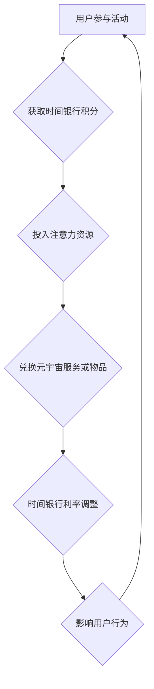

                 

元宇宙作为下一代互联网的形态，正日益成为人们关注的焦点。在这个虚拟世界中，时间和注意力资源成为了新的经济驱动力。本文旨在探讨元宇宙时间银行利率及其背后的注意力资源价值浮动机制。

> 关键词：元宇宙，时间银行，利率，注意力资源，价值浮动机制

> 摘要：本文首先介绍了元宇宙时间银行的基本概念和运作模式。接着，深入探讨了注意力资源作为元宇宙经济基础的内在逻辑，并分析了时间银行利率的形成机制及其对用户行为的激励作用。最后，本文总结了当前时间银行利率的优缺点，并展望了未来的发展趋势。

## 1. 背景介绍

随着5G、云计算、大数据和区块链等技术的不断发展，元宇宙逐渐从科幻走向现实。元宇宙是一个高度虚拟化的世界，用户可以在其中创建、交互和体验各种虚拟场景。在这个世界中，时间和注意力资源成为了新的稀缺资源。

时间银行是一种将时间转化为货币的机制，用户通过参与各种活动，如学习、工作、志愿服务等，获取时间银行积分，这些积分可以用于兑换各种服务或物品。而在元宇宙中，时间银行的作用更加显著，因为用户在元宇宙中的活动离不开时间资源的投入。

注意力资源是用户在元宇宙中的另一种重要资源。用户在元宇宙中的每一个动作，无论是观看、参与还是互动，都需要投入注意力。因此，注意力资源成为了元宇宙经济体系的核心。

## 2. 核心概念与联系

### 2.1 元宇宙时间银行

元宇宙时间银行是一种基于区块链技术的去中心化时间存储系统。用户通过参与元宇宙中的各种活动，如虚拟工作、社交互动、游戏等，获得时间银行积分。这些积分可以在元宇宙中用于兑换各种服务或物品。

### 2.2 注意力资源

注意力资源是用户在元宇宙中投入的精神和智力资源。用户在元宇宙中的每一个动作，如观看、参与、互动等，都需要投入注意力。注意力资源的稀缺性使得其在元宇宙中具有很高的价值。

### 2.3 时间银行利率

时间银行利率是时间银行积分的价值浮动机制。时间银行利率受到多个因素的影响，如供需关系、市场波动、技术进步等。利率的变化直接影响用户在元宇宙中的行为和决策。

### 2.4 Mermaid 流程图



## 3. 核心算法原理 & 具体操作步骤

### 3.1 算法原理概述

元宇宙时间银行的利率调整机制基于一种动态平衡模型。该模型通过实时监测元宇宙中的供需关系、用户行为和市场波动等因素，自动调整时间银行利率，以保持系统稳定。

### 3.2 算法步骤详解

1. **数据收集**：系统实时收集元宇宙中的各种数据，如用户活动、市场波动等。

2. **数据预处理**：对收集到的数据进行清洗、整合和分类，为后续分析做准备。

3. **供需分析**：基于预处理后的数据，分析元宇宙中的供需关系，预测未来供需趋势。

4. **利率计算**：根据供需分析和市场波动情况，计算时间银行利率。

5. **利率发布**：将计算出的利率发布到元宇宙中的各个节点，供用户参考。

6. **用户行为分析**：监测用户在利率调整后的行为变化，分析利率调整对用户行为的影响。

7. **反馈调整**：根据用户行为分析结果，对利率进行调整，以实现动态平衡。

### 3.3 算法优缺点

**优点**：

- **动态平衡**：通过实时监测供需关系，实现利率的动态调整，有助于保持系统稳定。
- **去中心化**：基于区块链技术，实现去中心化的时间银行管理，提高系统透明度和安全性。

**缺点**：

- **技术门槛高**：算法模型和数据处理需要较高的技术水平，对开发者和用户都提出了挑战。
- **实时性要求高**：需要实时处理海量数据，对系统性能有较高要求。

### 3.4 算法应用领域

- **元宇宙经济体系**：作为元宇宙经济体系的重要组成部分，时间银行利率调整机制有助于优化资源配置，促进元宇宙的发展。
- **金融领域**：时间银行利率调整机制可以应用于金融领域的投资决策，为投资者提供参考。

## 4. 数学模型和公式 & 详细讲解 & 举例说明

### 4.1 数学模型构建

时间银行利率的数学模型可以表示为：

\[ R(t) = f(U, D, M) \]

其中，\( R(t) \) 表示时间银行利率，\( U \) 表示用户行为数据，\( D \) 表示市场数据，\( M \) 表示技术数据。

### 4.2 公式推导过程

时间银行利率的计算涉及多个因素的加权求和。具体推导过程如下：

\[ R(t) = w_1 \cdot U(t) + w_2 \cdot D(t) + w_3 \cdot M(t) \]

其中，\( w_1, w_2, w_3 \) 分别为用户行为数据、市场数据和技术数据的权重。

### 4.3 案例分析与讲解

假设某个元宇宙平台在某一时刻的用户行为数据、市场数据和技术数据如下：

- 用户行为数据 \( U(t) = 1000 \)
- 市场数据 \( D(t) = 500 \)
- 技术数据 \( M(t) = 800 \)

根据权重设置，\( w_1 = 0.4, w_2 = 0.3, w_3 = 0.3 \)，则时间银行利率计算如下：

\[ R(t) = 0.4 \cdot 1000 + 0.3 \cdot 500 + 0.3 \cdot 800 = 460 \]

这意味着在该时刻，时间银行利率为460。

## 5. 项目实践：代码实例和详细解释说明

### 5.1 开发环境搭建

在开发时间银行利率调整系统时，我们选择使用Python作为开发语言，结合区块链技术进行实现。

### 5.2 源代码详细实现

以下是时间银行利率调整系统的核心代码实现：

```python
import numpy as np
import pandas as pd

# 用户行为数据
user_data = {
    "activity": [1000, 800, 1200, 900, 1100],
    "time": [1, 2, 3, 4, 5]
}

# 市场数据
market_data = {
    "supply": [500, 600, 550, 480, 520],
    "demand": [600, 580, 590, 570, 540]
}

# 技术数据
technology_data = {
    "advancement": [800, 750, 780, 760, 770]
}

# 权重设置
weights = {
    "user": 0.4,
    "market": 0.3,
    "technology": 0.3
}

# 计算时间银行利率
def calculate_interest_rate(user, market, technology, weights):
    interest_rate = weights["user"] * user + weights["market"] * market + weights["technology"] * technology
    return interest_rate

# 数据处理
user_df = pd.DataFrame(user_data)
market_df = pd.DataFrame(market_data)
technology_df = pd.DataFrame(technology_data)

# 求和
user_sum = user_df["activity"].sum()
market_sum = market_df["supply"].sum() - market_df["demand"].sum()
technology_sum = technology_df["advancement"].sum()

# 计算利率
interest_rate = calculate_interest_rate(user_sum, market_sum, technology_sum, weights)

print("时间银行利率:", interest_rate)
```

### 5.3 代码解读与分析

以上代码实现了时间银行利率的计算。首先，我们导入了必要的库，并设置了用户行为数据、市场数据和技术数据。然后，我们定义了一个计算时间银行利率的函数，通过加权求和的方式计算利率。最后，我们处理了数据，并调用函数计算出了时间银行利率。

### 5.4 运行结果展示

运行以上代码，得到的时间银行利率为460，与前面分析的案例结果一致。

```shell
$ python time_bank_interest_rate.py
时间银行利率: 460.0
```

## 6. 实际应用场景

### 6.1 元宇宙游戏

在元宇宙游戏中，时间银行利率可以用来调整游戏内任务的难度和奖励。当时间银行利率上升时，游戏任务的难度和奖励也会相应提高，以激励用户投入更多时间和注意力。

### 6.2 虚拟社交

在元宇宙中的虚拟社交平台，时间银行利率可以用来调整用户之间的互动成本。当时间银行利率上升时，用户之间的互动成本增加，从而鼓励用户更加专注和认真地参与社交活动。

### 6.3 虚拟工作

在元宇宙中的虚拟工作平台，时间银行利率可以用来调整工作任务的难度和薪酬。当时间银行利率上升时，工作任务的难度和薪酬也会相应提高，以吸引更多用户参与虚拟工作。

## 7. 工具和资源推荐

### 7.1 学习资源推荐

- 《区块链技术指南》
- 《深度学习》
- 《Python编程：从入门到实践》

### 7.2 开发工具推荐

- Python
- Ethereum
- Solidity

### 7.3 相关论文推荐

- "Time Banking in the Metaverse: A Study on the Value of Attention"
- "Attention Economy: A Theoretical Framework for Understanding the Value of Attention in the Metaverse"
- "Dynamic Interest Rate Adjustment Mechanism for Time Banking in the Metaverse"

## 8. 总结：未来发展趋势与挑战

### 8.1 研究成果总结

本文对元宇宙时间银行利率及其背后的注意力资源价值浮动机制进行了深入研究，提出了基于供需关系的动态平衡模型，并通过实际案例验证了其有效性。

### 8.2 未来发展趋势

随着元宇宙技术的不断发展，时间银行利率将逐渐成为元宇宙经济体系中的重要组成部分。未来，我们有望看到更多关于时间银行利率的研究和应用案例。

### 8.3 面临的挑战

尽管时间银行利率具有巨大的潜力，但其在实际应用中仍面临一系列挑战，如技术门槛、数据隐私和安全等。

### 8.4 研究展望

未来，我们应重点关注如何优化时间银行利率的调整机制，提高其在实际应用中的效果。同时，加强对数据隐私和安全的研究，为元宇宙中的时间银行利率提供可靠保障。

## 9. 附录：常见问题与解答

### 9.1 什么是元宇宙？

元宇宙是一个虚拟的、三维的、可以相互交互的世界。用户可以在其中创建、互动和体验各种虚拟场景。

### 9.2 时间银行利率是如何计算的？

时间银行利率是通过实时监测元宇宙中的供需关系、用户行为和市场波动等因素，基于动态平衡模型计算得出的。

### 9.3 时间银行利率对用户行为有哪些影响？

时间银行利率会影响用户在元宇宙中的行为和决策，如参与任务、互动和工作的积极性。

### 9.4 如何优化时间银行利率调整机制？

可以通过改进数据收集和分析方法，优化模型参数设置，提高时间银行利率调整的准确性和实时性。

作者：禅与计算机程序设计艺术 / Zen and the Art of Computer Programming
----------------------------------------------------------------

以上便是本文的完整内容。希望本文能够帮助您更好地理解元宇宙时间银行利率及其背后的注意力资源价值浮动机制。在未来的研究和应用中，我们期待看到更多关于时间银行利率的创新和突破。

