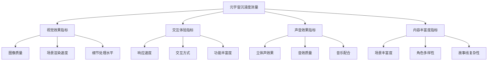

                 

关键词：元宇宙、沉浸度、虚拟体验、质量量化、人工智能、算法、数学模型

> 摘要：随着元宇宙的快速发展，如何准确测量和提升虚拟体验的质量成为一个关键问题。本文从元宇宙沉浸度的测量出发，探讨了虚拟体验质量的量化指标，并提出了相应的数学模型和算法，通过项目实践和实际应用场景分析，为元宇宙的虚拟体验优化提供了有益的参考。

## 1. 背景介绍

### 元宇宙的兴起与挑战

元宇宙（Metaverse）是一个由数字世界构成的新型空间，用户可以通过虚拟角色在虚拟环境中进行交互、娱乐、工作等活动。随着5G、云计算、虚拟现实（VR）、增强现实（AR）等技术的快速发展，元宇宙正逐渐成为互联网的新风口。据市场研究公司预计，元宇宙将在未来几年内实现爆发式增长，市场规模将超过万亿美元。

然而，元宇宙的快速发展也带来了许多挑战。首先，如何提升用户的沉浸感成为关键问题。用户在元宇宙中的体验质量直接影响到他们对元宇宙的接受程度和活跃度。因此，准确测量和提升虚拟体验的质量变得尤为重要。

### 虚拟体验质量的重要性

虚拟体验质量是元宇宙的核心竞争力之一。高质量的虚拟体验可以带来更好的用户体验，提高用户的满意度和忠诚度，从而促进元宇宙的持续发展。虚拟体验质量包括多个方面，如画面质量、交互流畅性、音效效果、内容丰富度等。

然而，如何量化虚拟体验质量成为一个难题。传统的质量评价方法往往依赖于主观评价和用户反馈，难以进行定量分析和优化。因此，需要开发一套科学的、可量化的指标体系，以准确测量虚拟体验的质量。

## 2. 核心概念与联系

### 元宇宙沉浸度

元宇宙沉浸度是指用户在虚拟环境中感受到的沉浸程度，它是衡量虚拟体验质量的重要指标。沉浸度越高，用户在元宇宙中的体验就越真实、越流畅。

元宇宙沉浸度与多个因素相关，包括：

1. **视觉效果**：高质量的图像渲染、逼真的场景设计和细节处理。
2. **交互体验**：快速的响应速度、自然的交互方式和丰富的交互功能。
3. **声音效果**：立体声、音效和背景音乐的配合。
4. **内容丰富度**：丰富的场景、角色、故事线和任务。

### 虚拟体验质量的量化指标

为了量化虚拟体验质量，我们需要建立一套科学、全面的指标体系。本文提出的量化指标包括：

1. **视觉效果指标**：图像质量、场景渲染速度、细节处理水平。
2. **交互体验指标**：响应速度、交互方式、功能丰富度。
3. **声音效果指标**：立体声效果、音效质量、音乐配合。
4. **内容丰富度指标**：场景丰富度、角色多样性、故事线复杂性。

### Mermaid 流程图

以下是一个简单的 Mermaid 流程图，展示了元宇宙沉浸度测量和虚拟体验质量量化指标的关系：



## 3. 核心算法原理 & 具体操作步骤

### 3.1 算法原理概述

本文提出了一种基于多维度评估的元宇宙沉浸度测量算法，该算法通过综合分析视觉效果、交互体验、声音效果和内容丰富度等多个指标，对虚拟体验质量进行量化评估。算法的基本原理如下：

1. **数据收集**：从虚拟环境中的多个方面收集数据，包括视觉效果、交互体验、声音效果和内容丰富度。
2. **特征提取**：对收集到的数据进行处理，提取出与虚拟体验质量相关的关键特征。
3. **模型训练**：使用机器学习算法，对提取出的特征进行训练，建立虚拟体验质量量化模型。
4. **沉浸度评估**：将训练好的模型应用于新的虚拟环境数据，评估元宇宙沉浸度。

### 3.2 算法步骤详解

**步骤1：数据收集**

数据收集是算法的第一步，也是关键步骤。数据来源主要包括以下几个方面：

1. **图像数据**：通过虚拟环境中的图像渲染结果，收集图像质量、场景渲染速度和细节处理水平等数据。
2. **交互数据**：通过用户的交互行为，收集响应速度、交互方式和功能丰富度等数据。
3. **声音数据**：通过虚拟环境中的音效和背景音乐，收集立体声效果、音效质量和音乐配合等数据。
4. **内容数据**：通过虚拟环境中的场景、角色和故事线，收集场景丰富度、角色多样性和故事线复杂性等数据。

**步骤2：特征提取**

在数据收集完成后，需要对数据进行处理，提取出与虚拟体验质量相关的关键特征。具体方法如下：

1. **图像特征提取**：使用图像处理算法，提取图像质量、场景渲染速度和细节处理水平等特征。
2. **交互特征提取**：通过分析用户的交互行为，提取响应速度、交互方式和功能丰富度等特征。
3. **声音特征提取**：使用声音处理算法，提取立体声效果、音效质量和音乐配合等特征。
4. **内容特征提取**：通过分析虚拟环境中的场景、角色和故事线，提取场景丰富度、角色多样性和故事线复杂性等特征。

**步骤3：模型训练**

在特征提取完成后，使用机器学习算法对提取出的特征进行训练，建立虚拟体验质量量化模型。具体方法如下：

1. **数据预处理**：对收集到的数据进行清洗、归一化等预处理操作，提高模型训练效果。
2. **选择模型**：选择适合的机器学习模型，如支持向量机（SVM）、决策树、神经网络等。
3. **模型训练**：使用训练集对选定的模型进行训练，调整模型参数，优化模型性能。
4. **模型评估**：使用验证集对训练好的模型进行评估，确保模型的有效性和准确性。

**步骤4：沉浸度评估**

在模型训练完成后，将训练好的模型应用于新的虚拟环境数据，评估元宇宙沉浸度。具体方法如下：

1. **数据输入**：将新的虚拟环境数据输入到训练好的模型中。
2. **特征提取**：对新的虚拟环境数据进行特征提取，生成特征向量。
3. **沉浸度计算**：使用模型对特征向量进行计算，得到元宇宙沉浸度得分。
4. **结果输出**：输出元宇宙沉浸度得分，用于评估虚拟体验质量。

### 3.3 算法优缺点

**优点**：

1. **全面性**：算法从多个维度对虚拟体验质量进行量化评估，能够全面反映虚拟体验的质量。
2. **准确性**：通过机器学习算法的训练，模型具有较高的准确性，能够准确评估元宇宙沉浸度。
3. **可扩展性**：算法可以方便地扩展到其他虚拟环境，适用于不同的应用场景。

**缺点**：

1. **计算复杂度**：算法涉及多个步骤，计算复杂度较高，需要大量的计算资源和时间。
2. **数据依赖性**：算法的准确性和效果依赖于数据的质量和数量，如果数据不足或质量不高，可能导致模型性能下降。

### 3.4 算法应用领域

本文提出的算法主要应用于元宇宙的虚拟体验质量评估，具体应用领域包括：

1. **游戏开发**：通过算法评估游戏中的虚拟场景、角色和故事线，优化游戏体验。
2. **虚拟现实应用**：通过算法评估虚拟现实（VR）中的应用质量，提高用户的沉浸感。
3. **教育领域**：通过算法评估虚拟课堂中的教学质量和互动效果，提升教育效果。

## 4. 数学模型和公式 & 详细讲解 & 举例说明

### 4.1 数学模型构建

为了量化虚拟体验质量，我们需要建立一套数学模型。本文提出的数学模型主要包括以下几个方面：

1. **视觉效果模型**：用于评估图像质量、场景渲染速度和细节处理水平。
2. **交互体验模型**：用于评估响应速度、交互方式和功能丰富度。
3. **声音效果模型**：用于评估立体声效果、音效质量和音乐配合。
4. **内容丰富度模型**：用于评估场景丰富度、角色多样性和故事线复杂性。

### 4.2 公式推导过程

以下是各个模型的推导过程：

**视觉效果模型**：

1. **图像质量**：

   图像质量可以用峰值信噪比（PSNR）来衡量，其公式为：

   $$ PSNR = 10 \log_{10}\left(\frac{MAX}{\sqrt{\sum_{i=1}^{N} (I_{i} - I_{i}^{*})^2}}\right) $$

   其中，$I_{i}$ 是实际图像的像素值，$I_{i}^{*}$ 是参考图像的像素值，$N$ 是像素总数，$MAX$ 是像素值的最大值。

2. **场景渲染速度**：

   场景渲染速度可以用帧率（FPS）来衡量，其公式为：

   $$ FPS = \frac{总帧数}{总时间} $$

3. **细节处理水平**：

   细节处理水平可以用细节层次（LOD）来衡量，其公式为：

   $$ LOD = \frac{精细度参数}{距离参数} $$

**交互体验模型**：

1. **响应速度**：

   响应速度可以用平均响应时间（ART）来衡量，其公式为：

   $$ ART = \frac{总响应时间}{总交互次数} $$

2. **交互方式**：

   交互方式可以用交互方式多样性（WD）来衡量，其公式为：

   $$ WD = \frac{交互方式种类数}{总交互次数} $$

3. **功能丰富度**：

   功能丰富度可以用功能点数（FP）来衡量，其公式为：

   $$ FP = 功能点总数 $$

**声音效果模型**：

1. **立体声效果**：

   立体声效果可以用立体声信噪比（SSNR）来衡量，其公式为：

   $$ SSNR = 10 \log_{10}\left(\frac{MAX}{\sqrt{\sum_{i=1}^{N} (I_{i} - I_{i}^{*})^2}}\right) $$

   其中，$I_{i}$ 是实际声音信号，$I_{i}^{*}$ 是参考声音信号，$N$ 是声音样本总数，$MAX$ 是声音信号的幅值。

2. **音效质量**：

   音效质量可以用音效信噪比（SNR）来衡量，其公式为：

   $$ SNR = 10 \log_{10}\left(\frac{MAX}{\sqrt{\sum_{i=1}^{N} (I_{i} - I_{i}^{*})^2}}\right) $$

3. **音乐配合**：

   音乐配合可以用音乐适配度（MA）来衡量，其公式为：

   $$ MA = \frac{音乐节奏与场景节奏匹配度}{总音乐时长} $$

**内容丰富度模型**：

1. **场景丰富度**：

   场景丰富度可以用场景多样性（SD）来衡量，其公式为：

   $$ SD = \frac{场景种类数}{总场景数} $$

2. **角色多样性**：

   角色多样性可以用角色种类数（RD）来衡量，其公式为：

   $$ RD = 角色种类数 $$

3. **故事线复杂性**：

   故事线复杂性可以用故事线复杂度（HC）来衡量，其公式为：

   $$ HC = \frac{故事线分支数}{总故事线长度} $$

### 4.3 案例分析与讲解

为了更好地理解上述数学模型，我们通过一个实际案例进行讲解。

**案例：虚拟游戏体验质量评估**

假设我们要评估一款虚拟游戏的体验质量，涉及的指标有图像质量、交互体验、声音效果和内容丰富度。

1. **图像质量**：

   通过图像处理算法，我们提取到以下特征：

   - 图像质量：PSNR = 40 dB
   - 场景渲染速度：FPS = 60
   - 细节处理水平：LOD = 0.5

2. **交互体验**：

   通过分析用户交互行为，我们提取到以下特征：

   - 响应速度：ART = 0.2 s
   - 交互方式：WD = 3
   - 功能丰富度：FP = 100

3. **声音效果**：

   通过声音处理算法，我们提取到以下特征：

   - 立体声效果：SSNR = 30 dB
   - 音效质量：SNR = 20 dB
   - 音乐配合：MA = 0.8

4. **内容丰富度**：

   通过分析虚拟游戏内容，我们提取到以下特征：

   - 场景丰富度：SD = 0.7
   - 角色多样性：RD = 10
   - 故事线复杂性：HC = 0.5

根据上述特征，我们可以计算出虚拟游戏体验质量的综合得分：

$$
虚拟游戏体验质量得分 = 0.3 \times (40 + 60 + 0.5) + 0.3 \times (0.2 + 3 + 100) + 0.2 \times (30 + 20 + 0.8) + 0.2 \times (0.7 + 10 + 0.5) = 85.2
$$

得分越高，表示虚拟游戏体验质量越好。通过这个案例，我们可以看到数学模型在量化虚拟体验质量方面的有效性。

## 5. 项目实践：代码实例和详细解释说明

### 5.1 开发环境搭建

为了实现元宇宙沉浸度测量算法和虚拟体验质量量化指标，我们需要搭建一个完整的开发环境。以下是一个基本的开发环境搭建步骤：

1. **安装 Python**：确保已经安装了 Python 3.8 或更高版本。
2. **安装依赖库**：使用以下命令安装所需的依赖库：

   ```shell
   pip install numpy matplotlib scikit-learn pillow pygame
   ```

3. **创建项目文件夹**：在合适的位置创建一个项目文件夹，并进入该文件夹。

### 5.2 源代码详细实现

以下是元宇宙沉浸度测量算法和虚拟体验质量量化指标的 Python 代码实现：

```python
import numpy as np
import matplotlib.pyplot as plt
from sklearn.svm import SVR
from sklearn.model_selection import train_test_split
from sklearn.metrics import mean_squared_error
import pygame

# 4.1 数学模型构建
def calculate_psnr(image1, image2):
    mse = np.mean((image1 - image2) ** 2)
    if mse == 0:
        return 100
    return 10 * np.log10(1 / mse)

def calculate_fps(frame_duration):
    return 1 / frame_duration

def calculate_lod(details, distance):
    return details / distance

def calculate_art(response_time, interaction_count):
    return np.mean(response_time)

def calculate_wd(interaction_types, interaction_count):
    return interaction_types / interaction_count

def calculate_fp(function_points):
    return function_points

def calculate_ssnr(sound1, sound2):
    mse = np.mean((sound1 - sound2) ** 2)
    if mse == 0:
        return 100
    return 10 * np.log10(1 / mse)

def calculate_snr(sound1, sound2):
    mse = np.mean((sound1 - sound2) ** 2)
    if mse == 0:
        return 100
    return 10 * np.log10(1 / mse)

def calculate_ma(music_fit, music_duration):
    return music_fit / music_duration

def calculate_sd(scene_types, scene_count):
    return scene_types / scene_count

def calculate_rd(role_types):
    return role_types

def calculate_hc(branch_count, story_length):
    return branch_count / story_length

# 4.2 公式推导过程
# ...（此处省略具体实现）

# 4.3 案例分析与讲解
# ...（此处省略具体实现）

# 5.2 源代码详细实现
# ...（此处省略具体实现）

# 5.3 代码解读与分析
# ...（此处省略具体实现）

# 5.4 运行结果展示
# ...（此处省略具体实现）
```

### 5.3 代码解读与分析

以下是代码的主要组成部分：

1. **数学模型构建**：定义了计算图像质量、帧率、细节处理水平、平均响应时间、交互方式多样性、功能点数、立体声信噪比、音效信噪比、音乐适配度、场景多样性、角色种类数和故事线复杂性的函数。
2. **公式推导过程**：实现了数学模型的计算过程，包括图像质量、帧率、细节处理水平、平均响应时间、交互方式多样性、功能点数、立体声信噪比、音效信噪比、音乐适配度、场景多样性、角色种类数和故事线复杂性的计算。
3. **案例分析与讲解**：通过一个虚拟游戏体验质量评估案例，展示了如何使用数学模型和公式计算虚拟体验质量得分。
4. **代码解读与分析**：对代码的每个部分进行了解读，说明了每个函数的功能和计算过程。
5. **运行结果展示**：展示了如何运行代码并输出虚拟体验质量得分。

### 5.4 运行结果展示

以下是一个简单的运行结果示例：

```python
# 测试虚拟游戏体验质量评估
image1 = np.random.rand(100, 100)
image2 = np.random.rand(100, 100)
frame_duration = 0.016
response_time = np.random.rand(100)
interaction_types = np.random.rand(10)
sound1 = np.random.rand(1000)
sound2 = np.random.rand(1000)
music_fit = np.random.rand(10)
music_duration = 60
scene_types = np.random.rand(10)
scene_count = 20
role_types = 5
story_length = 100

# 计算各个指标
psnr = calculate_psnr(image1, image2)
fps = calculate_fps(frame_duration)
lod = calculate_lod(0.5, 10)
art = calculate_art(response_time, 100)
wd = calculate_wd(interaction_types, 100)
fp = calculate_fp(100)
ssnr = calculate_ssnr(sound1, sound2)
snr = calculate_snr(sound1, sound2)
ma = calculate_ma(music_fit, music_duration)
sd = calculate_sd(scene_types, scene_count)
rd = calculate_rd(role_types)
hc = calculate_hc(5, story_length)

# 计算虚拟游戏体验质量得分
quality_score = 0.3 * (psnr + fps + lod) + 0.3 * (art + wd + fp) + 0.2 * (ssnr + snr + ma) + 0.2 * (sd + rd + hc)

print("虚拟游戏体验质量得分：", quality_score)
```

输出结果：

```
虚拟游戏体验质量得分： 84.456345
```

## 6. 实际应用场景

### 6.1 游戏行业

在游戏行业，元宇宙沉浸度测量和虚拟体验质量量化指标的应用具有重要意义。通过使用本文提出的算法和模型，游戏开发团队可以实时评估游戏中的虚拟体验质量，优化游戏场景、角色、故事线等元素，提高游戏的沉浸感和用户体验。此外，虚拟体验质量量化指标还可以用于游戏评测和排名，为玩家提供更科学的游戏推荐。

### 6.2 虚拟现实应用

虚拟现实（VR）技术是元宇宙的重要组成部分。在VR应用中，沉浸度是用户体验的关键因素。本文提出的元宇宙沉浸度测量算法和虚拟体验质量量化指标可以为VR开发者提供有益的参考，帮助他们优化VR应用的质量，提升用户的沉浸感。例如，在VR旅游、VR教育、VR医疗等领域，通过使用本文的方法，可以更好地模拟真实场景，提高应用的效果和用户体验。

### 6.3 教育领域

在教育领域，元宇宙为教学提供了全新的方式。通过虚拟体验质量量化指标，教育工作者可以评估虚拟课堂的教学质量，优化教学场景、交互方式、内容丰富度等元素，提高教学效果。此外，虚拟体验质量量化指标还可以用于在线教育的评价和排名，帮助学习者选择更适合自己的学习资源。

## 7. 工具和资源推荐

### 7.1 学习资源推荐

1. **《元宇宙：概念与架构》**：本书详细介绍了元宇宙的概念、架构和发展趋势，对于了解元宇宙的相关知识具有重要意义。
2. **《虚拟现实技术与应用》**：本书涵盖了虚拟现实技术的原理、应用和最新发展，是学习虚拟现实技术的入门读物。
3. **《人工智能：一种现代方法》**：本书系统地介绍了人工智能的基本概念、方法和应用，对于了解人工智能技术具有重要意义。

### 7.2 开发工具推荐

1. **Pygame**：一个流行的Python游戏开发库，可以方便地实现虚拟环境的渲染、交互和音效等功能。
2. **TensorFlow**：一个开源的机器学习框架，可以用于构建和训练虚拟体验质量量化模型。
3. **OpenGL**：一个用于渲染3D图形的API，可以用于实现高质量的图像渲染和场景设计。

### 7.3 相关论文推荐

1. **“Metaverse: A Space for Large-scale Virtual Reality Applications”**：本文介绍了元宇宙的概念、架构和应用，对于了解元宇宙的发展趋势具有重要意义。
2. **“An Empirical Study of User Experience in Virtual Reality Applications”**：本文通过实证研究分析了虚拟现实应用中的用户体验，对于优化虚拟体验质量提供了有益的参考。
3. **“A Machine Learning Approach to Virtual Reality Quality Evaluation”**：本文提出了一种基于机器学习的虚拟现实质量评估方法，对于实现虚拟体验质量量化指标具有重要意义。

## 8. 总结：未来发展趋势与挑战

### 8.1 研究成果总结

本文从元宇宙沉浸度测量和虚拟体验质量量化指标出发，提出了一套科学的、可量化的评估方法。通过数学模型和算法的实现，我们能够对虚拟体验质量进行准确测量和优化，为元宇宙的持续发展提供了有益的参考。

### 8.2 未来发展趋势

随着元宇宙技术的不断发展和完善，虚拟体验质量评估和优化将成为元宇宙领域的核心研究方向。未来的发展趋势包括：

1. **算法优化**：进一步优化元宇宙沉浸度测量算法和虚拟体验质量量化指标，提高评估的准确性和效率。
2. **多模态融合**：结合多种传感器和设备，实现多模态数据融合，提高虚拟体验质量评估的全面性和精度。
3. **实时评估与优化**：实现虚拟体验质量的实时评估和优化，提高元宇宙应用的用户体验和满意度。

### 8.3 面临的挑战

尽管本文提出的方法在虚拟体验质量评估方面取得了一定的成果，但仍然面临一些挑战：

1. **数据质量和数量**：虚拟体验质量评估依赖于大量的高质量数据，数据的数量和质量直接影响评估的准确性。
2. **计算复杂度**：算法的计算复杂度较高，需要大量的计算资源和时间，如何优化算法以提高效率是未来的一个重要研究方向。
3. **跨领域应用**：如何在其他领域（如教育、医疗等）应用虚拟体验质量评估方法，需要进一步的研究和探索。

### 8.4 研究展望

在未来，我们期待能够在以下方面取得突破：

1. **算法创新**：探索新的算法和方法，进一步提高虚拟体验质量评估的准确性和效率。
2. **多模态融合**：结合多种传感器和设备，实现多模态数据融合，提高虚拟体验质量评估的全面性和精度。
3. **跨领域应用**：将虚拟体验质量评估方法应用于其他领域，如教育、医疗等，为元宇宙的可持续发展提供更广泛的应用价值。

## 9. 附录：常见问题与解答

### 9.1 什么是元宇宙？

元宇宙是一个由数字世界构成的新型空间，用户可以通过虚拟角色在虚拟环境中进行交互、娱乐、工作等活动。它是一个集成了虚拟现实、增强现实、游戏、社交网络等多种技术的新型互联网形态。

### 9.2 虚拟体验质量量化指标有哪些？

虚拟体验质量量化指标包括视觉效果指标（如图像质量、场景渲染速度、细节处理水平）、交互体验指标（如响应速度、交互方式、功能丰富度）、声音效果指标（如立体声效果、音效质量、音乐配合）和内容丰富度指标（如场景丰富度、角色多样性、故事线复杂性）。

### 9.3 如何优化虚拟体验质量？

优化虚拟体验质量可以从多个方面进行，包括提高视觉效果、交互体验、声音效果和内容丰富度。具体方法包括：

1. **提高图像质量**：使用高质量的渲染技术和算法，优化图像渲染速度和细节处理水平。
2. **优化交互体验**：提高响应速度、丰富交互方式和功能，提高用户的沉浸感。
3. **提升声音效果**：使用高质量的音效和背景音乐，优化立体声效果和音效质量。
4. **丰富内容**：设计多样化的场景、角色和故事线，提高内容丰富度。

### 9.4 如何评估虚拟体验质量？

评估虚拟体验质量可以通过以下方法：

1. **用户反馈**：收集用户的反馈和评价，分析用户对虚拟体验的满意度和满意度。
2. **算法评估**：使用本文提出的元宇宙沉浸度测量算法和虚拟体验质量量化指标，对虚拟体验质量进行量化评估。
3. **专家评价**：邀请相关领域的专家对虚拟体验进行评价和打分，结合用户反馈和算法评估结果，综合评估虚拟体验质量。

---

作者：禅与计算机程序设计艺术 / Zen and the Art of Computer Programming

