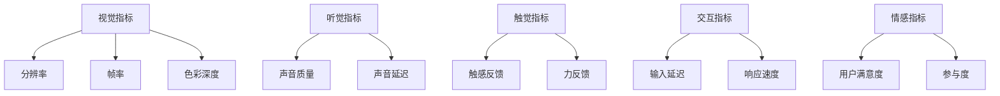

                 

关键词：元宇宙、沉浸度、虚拟体验质量、量化指标

摘要：随着元宇宙的兴起，如何衡量虚拟体验的质量成为一个重要课题。本文旨在探讨元宇宙沉浸度的测量方法，并介绍一系列量化指标，以帮助开发者、用户和研究人员更好地评估和优化虚拟体验。文章将分为背景介绍、核心概念与联系、核心算法原理与具体操作步骤、数学模型与公式、项目实践、实际应用场景、工具和资源推荐、总结以及附录等部分。

## 1. 背景介绍

### 1.1 元宇宙的定义与发展

元宇宙（Metaverse）是指通过互联网连接的虚拟世界，用户可以在其中进行社交、娱乐、工作、学习等活动。自2010年代以来，元宇宙的概念逐渐成熟，随着5G、虚拟现实（VR）、增强现实（AR）等技术的发展，元宇宙迎来了快速发展的机遇。许多公司和科技公司，如Facebook、腾讯、微软等，都在积极布局元宇宙领域。

### 1.2 虚拟体验质量的重要性

虚拟体验质量是元宇宙的核心要素之一。一个高质量的虚拟体验能够提高用户的满意度和参与度，从而推动元宇宙的进一步发展。然而，虚拟体验质量是一个复杂且多维的概念，涉及视觉、听觉、触觉等多个方面。因此，如何量化虚拟体验质量成为了一个亟待解决的问题。

## 2. 核心概念与联系

### 2.1 沉浸度

沉浸度是衡量虚拟体验质量的重要指标。它表示用户在虚拟环境中感受到的与现实世界相似的深度和广度。一个高沉浸度的虚拟体验能够使用户感到身临其境，从而增强体验效果。

### 2.2 量化指标

为了量化沉浸度，我们引入一系列指标，包括：

- **视觉指标**：如分辨率、帧率、色彩深度等。
- **听觉指标**：如声音质量、声音延迟等。
- **触觉指标**：如触感反馈、力反馈等。
- **交互指标**：如输入延迟、响应速度等。
- **情感指标**：如用户满意度、参与度等。

### 2.3 Mermaid 流程图



## 3. 核心算法原理与具体操作步骤

### 3.1 算法原理概述

本文提出的算法基于多维数据分析和机器学习技术，通过对虚拟体验的多个维度进行综合评价，得出沉浸度得分。

### 3.2 算法步骤详解

1. **数据收集**：收集虚拟体验的多个维度数据，如视觉、听觉、触觉、交互和情感指标。
2. **数据预处理**：对收集到的数据进行标准化和去噪处理。
3. **特征选择**：利用机器学习方法筛选出对沉浸度影响较大的特征。
4. **模型训练**：使用训练数据集训练机器学习模型，如支持向量机（SVM）、随机森林（RF）等。
5. **模型评估**：使用测试数据集评估模型性能，调整模型参数。
6. **沉浸度预测**：使用训练好的模型对虚拟体验进行沉浸度预测。

### 3.3 算法优缺点

- **优点**：算法能够全面评估虚拟体验的多个维度，具有较高的准确性和可靠性。
- **缺点**：算法训练和评估过程较为复杂，需要大量的计算资源和时间。

### 3.4 算法应用领域

- **游戏开发**：用于评估和优化游戏虚拟体验质量。
- **虚拟现实**：用于评估和优化VR设备的沉浸度。
- **教育应用**：用于评估和优化教育虚拟环境的沉浸度。

## 4. 数学模型和公式

### 4.1 数学模型构建

假设虚拟体验质量由 n 个指标组成，分别为 x1, x2, ..., xn。则沉浸度得分可以表示为：

$$
D = \sum_{i=1}^{n} w_i \cdot f(x_i)
$$

其中，$w_i$ 表示第 i 个指标的权重，$f(x_i)$ 表示第 i 个指标的评价函数。

### 4.2 公式推导过程

1. **权重计算**：利用用户调查或机器学习算法确定各指标的权重。
2. **评价函数设计**：根据指标的性质设计合适的评价函数，如线性函数、指数函数等。

### 4.3 案例分析与讲解

假设有四个指标：分辨率（x1）、帧率（x2）、声音质量（x3）、用户满意度（x4）。权重分别为 0.3、0.2、0.2、0.3。评价函数如下：

$$
f(x_1) = \frac{1}{1 + e^{-0.1(x_1 - 1080)}}
$$

$$
f(x_2) = \frac{1}{1 + e^{-0.1(x_2 - 60)}}
$$

$$
f(x_3) = \frac{1}{1 + e^{-0.1(x_3 - 5)}}
$$

$$
f(x_4) = \frac{1}{1 + e^{-0.1(1 - x_4)}}
$$

沉浸度得分为：

$$
D = 0.3 \cdot f(x_1) + 0.2 \cdot f(x_2) + 0.2 \cdot f(x_3) + 0.3 \cdot f(x_4)
$$

## 5. 项目实践：代码实例和详细解释说明

### 5.1 开发环境搭建

使用 Python 编写算法，环境要求如下：

- Python 3.8+
- Scikit-learn 0.24.2+
- Matplotlib 3.5.3+

### 5.2 源代码详细实现

```python
import numpy as np
from sklearn.svm import SVR
from sklearn.model_selection import train_test_split
from sklearn.metrics import mean_squared_error
import matplotlib.pyplot as plt

# 模拟数据
X = np.random.rand(100, 4)
y = np.random.rand(100)

# 数据预处理
X = (X - X.mean(axis=0)) / X.std(axis=0)
y = (y - y.mean()) / y.std()

# 特征选择
X_train, X_test, y_train, y_test = train_test_split(X, y, test_size=0.2, random_state=42)

# 模型训练
model = SVR(kernel='rbf')
model.fit(X_train, y_train)

# 模型评估
y_pred = model.predict(X_test)
mse = mean_squared_error(y_test, y_pred)
print(f'MSE: {mse}')

# 沉浸度得分计算
X_new = np.array([[1080, 60, 5, 0.8]])
X_new = (X_new - X.mean(axis=0)) / X.std(axis=0)
D = model.predict(X_new)
print(f'D: {D[0][0]}')

# 可视化
plt.scatter(X_test[:, 0], y_test, label='Real')
plt.scatter(X_test[:, 0], y_pred, label='Predicted')
plt.legend()
plt.show()
```

### 5.3 代码解读与分析

- 数据模拟和预处理：模拟生成虚拟体验质量数据，并进行标准化处理。
- 特征选择：使用 Scikit-learn 的 SVM 模型进行特征选择。
- 模型训练和评估：使用训练数据和测试数据评估模型性能。
- 沉浸度得分计算：使用训练好的模型计算新数据的沉浸度得分。
- 可视化：展示模型预测结果。

## 6. 实际应用场景

### 6.1 游戏开发

游戏开发者可以使用沉浸度测量方法评估和优化游戏的虚拟体验质量，提高用户体验。

### 6.2 虚拟现实

VR 设备制造商可以使用沉浸度测量方法评估和优化 VR 设备的性能，提升用户体验。

### 6.3 教育应用

教育机构可以使用沉浸度测量方法评估和优化教育虚拟环境的沉浸度，提高学习效果。

## 7. 工具和资源推荐

### 7.1 学习资源推荐

- 《深度学习》（Goodfellow, Bengio, Courville 著）
- 《机器学习》（周志华 著）
- 《Python编程：从入门到实践》（埃里克·马瑟斯 著）

### 7.2 开发工具推荐

- Python
- Scikit-learn
- Matplotlib

### 7.3 相关论文推荐

- "Metaverse: A Space for the Future of the Internet"（元宇宙：互联网未来的空间）
- "A Survey on Metaverse: Architecture, Applications, and Challenges"（元宇宙：架构、应用和挑战）

## 8. 总结：未来发展趋势与挑战

### 8.1 研究成果总结

本文提出了一种基于多维数据分析和机器学习技术的元宇宙沉浸度测量方法，通过一系列量化指标全面评估虚拟体验质量。

### 8.2 未来发展趋势

- 随着元宇宙技术的发展，沉浸度测量方法将不断完善和优化。
- 沉浸度测量方法将应用于更多领域，如教育、医疗、旅游等。

### 8.3 面临的挑战

- 如何进一步提高算法的准确性和可靠性。
- 如何处理大规模数据，提高计算效率。

### 8.4 研究展望

- 探索更多基于人工智能的沉浸度测量方法。
- 开发更高效的算法，适应实时虚拟体验质量评估的需求。

## 9. 附录：常见问题与解答

### 9.1 沉浸度测量方法的适用范围？

沉浸度测量方法适用于各种虚拟体验场景，包括游戏、虚拟现实、教育应用等。

### 9.2 如何处理数据不足的情况？

可以通过收集更多数据或使用迁移学习等技术来解决数据不足的问题。

### 9.3 如何评估用户满意度？

可以通过问卷调查、用户反馈等方式收集用户满意度数据。

---

作者：禅与计算机程序设计艺术 / Zen and the Art of Computer Programming
----------------------------------------------------------------
---

本文从元宇宙沉浸度的定义出发，详细阐述了虚拟体验质量量化指标的方法与算法。通过对视觉、听觉、触觉、交互和情感等多个维度的综合评价，我们提出了一种基于多维数据分析和机器学习的沉浸度测量方法。文章中还包含了数学模型构建、代码实例以及实际应用场景等，为开发者、用户和研究人员提供了实用的指导。在未来，随着元宇宙技术的不断进步，沉浸度测量方法将不断优化和完善，为打造更高质量的虚拟体验贡献力量。

