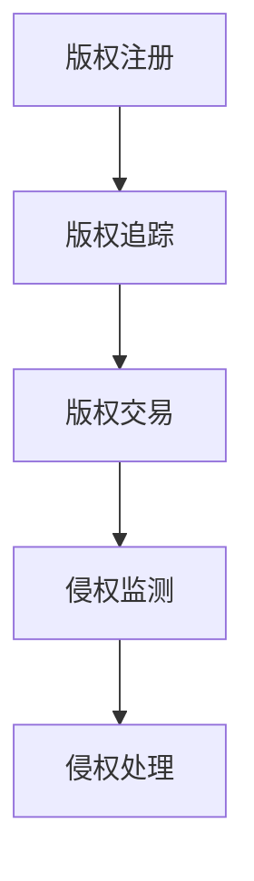

                 

元宇宙（Metaverse）作为新一代的互联网空间，融合了虚拟现实（VR）、增强现实（AR）、区块链和大数据等多种前沿技术，正在逐步改变我们的工作和生活方式。在这样的背景下，版权保护成为了一个不可忽视的问题。随着数字内容的创作和传播速度不断加快，传统的版权保护手段已无法满足元宇宙中的版权管理需求。本文将深入探讨元宇宙版权保护的问题，并提出一种基于智能管理的数字版权保护方案。

## 关键词：元宇宙、版权保护、数字版权、智能管理、区块链技术、加密算法

## 摘要

本文首先介绍了元宇宙的概念及其在当前科技发展中的重要地位，然后分析了传统版权保护手段在元宇宙环境下的局限性。接着，本文提出了基于智能管理的数字版权保护方案，包括核心概念、算法原理、数学模型以及具体实现。最后，本文对实际应用场景进行了探讨，并提出了未来应用展望。

### 1. 背景介绍

#### 元宇宙的概念与特点

元宇宙是一个虚拟的、三维的、全连接的数字世界，它不仅仅是一个独立的虚拟空间，而是与现实世界紧密相连的生态系统。元宇宙的特点包括：

1. **沉浸性**：用户可以沉浸在元宇宙中，通过VR、AR等设备感受到身临其境的体验。
2. **社交性**：元宇宙为用户提供了丰富的社交互动方式，用户可以与世界各地的人交流。
3. **经济性**：元宇宙中的虚拟资产（如虚拟货币、数字艺术品等）具有真实价值，用户可以在其中进行交易。
4. **多样性**：元宇宙涵盖了多种多样的内容，包括游戏、教育、娱乐、工作等。

#### 传统版权保护手段的局限性

在传统互联网环境中，版权保护手段主要包括：

1. **法律手段**：通过签订合同、注册版权等方式保护版权。
2. **技术手段**：使用数字水印、版权标记等技术防止侵权。
3. **监管手段**：通过平台监控、举报机制等手段打击侵权行为。

然而，这些手段在元宇宙环境中面临以下挑战：

1. **技术复杂性**：元宇宙中的内容形式多样，包括虚拟现实场景、3D模型、音频视频等，传统的版权保护技术难以覆盖所有内容形式。
2. **隐私保护**：元宇宙中的用户隐私保护是一个重要问题，传统的版权保护手段可能侵犯用户隐私。
3. **侵权手段多样化**：元宇宙中的侵权手段更加隐蔽，如虚拟复制、篡改等，传统的版权保护手段难以有效识别和打击。

### 2. 核心概念与联系

#### 数字版权保护的核心概念

数字版权保护涉及多个核心概念，包括：

1. **数字版权**：指创作者对其创作的数字内容所享有的权利，包括复制权、发行权、展示权等。
2. **数字水印**：一种将特定信息嵌入数字内容中的技术，用于标识版权信息、追踪侵权行为等。
3. **区块链技术**：一种分布式账本技术，可用于记录数字版权的流转过程，提供透明、不可篡改的版权保护。
4. **加密算法**：一种用于保护数字版权的技术，通过加密手段防止未经授权的访问和复制。

#### 数字版权保护架构

数字版权保护架构包括以下几个方面：

1. **版权注册**：创作者通过版权注册平台登记其数字内容，获取数字版权证明。
2. **版权追踪**：通过数字水印等技术，对数字内容进行标记，实现版权追踪。
3. **版权交易**：在区块链平台上，数字版权可以像虚拟资产一样进行交易。
4. **侵权监测**：利用加密算法等技术，监测数字内容的使用情况，识别侵权行为。

#### Mermaid 流程图



### 3. 核心算法原理 & 具体操作步骤

#### 3.1 算法原理概述

数字版权保护的核心算法包括数字水印算法、区块链算法和加密算法。以下是这些算法的基本原理：

1. **数字水印算法**：将版权信息嵌入数字内容中，实现版权标识和追踪。
2. **区块链算法**：记录数字版权的流转过程，提供透明、不可篡改的版权保护。
3. **加密算法**：保护数字版权，防止未经授权的访问和复制。

#### 3.2 算法步骤详解

1. **数字水印算法**：

   - **嵌入过程**：将版权信息嵌入数字内容中，生成带水印的数字内容。
   - **提取过程**：从带水印的数字内容中提取版权信息，用于版权追踪。

2. **区块链算法**：

   - **注册过程**：创作者将数字内容及其版权信息注册到区块链上，生成版权证书。
   - **流转过程**：数字版权在区块链上进行交易，记录版权流转过程。
   - **查询过程**：用户可以通过区块链查询数字版权的流转记录。

3. **加密算法**：

   - **加密过程**：使用加密算法对数字内容进行加密，生成加密内容。
   - **解密过程**：授权用户使用密钥对加密内容进行解密，获得原始数字内容。

#### 3.3 算法优缺点

1. **数字水印算法**：

   - **优点**：简单易用，可以嵌入多种数字内容，实现版权标识和追踪。
   - **缺点**：可能影响数字内容的质量，容易被篡改。

2. **区块链算法**：

   - **优点**：提供透明、不可篡改的版权保护，支持版权交易。
   - **缺点**：处理速度较慢，对区块链节点的要求较高。

3. **加密算法**：

   - **优点**：有效保护数字版权，防止未经授权的访问和复制。
   - **缺点**：加密和解密过程需要消耗大量计算资源。

#### 3.4 算法应用领域

数字版权保护算法在元宇宙中的应用领域包括：

1. **虚拟现实场景**：保护虚拟现实场景的版权，防止未经授权的复制和传播。
2. **数字艺术品**：保护数字艺术品的版权，实现艺术品市场的透明化和规范化。
3. **音频视频内容**：保护音频视频内容的版权，防止未经授权的复制和传播。

### 4. 数学模型和公式 & 详细讲解 & 举例说明

#### 4.1 数学模型构建

数字版权保护中的数学模型主要包括：

1. **数字水印模型**：描述数字水印的嵌入和提取过程。
2. **区块链模型**：描述区块链中版权信息的存储和查询过程。
3. **加密模型**：描述加密和解密过程。

#### 4.2 公式推导过程

1. **数字水印模型**：

   - **嵌入公式**：$W = P + \alpha \cdot (I - P)$

     其中，$W$ 为带水印的数字内容，$P$ 为原始数字内容，$I$ 为嵌入的水印信息，$\alpha$ 为嵌入系数。

   - **提取公式**：$P' = \frac{W + \alpha \cdot (I - P)}{1 + \alpha}$

     其中，$P'$ 为提取出的水印信息。

2. **区块链模型**：

   - **注册公式**：$C_{register} = C_{original} + T_{register}$

     其中，$C_{register}$ 为注册后的版权证书，$C_{original}$ 为原始版权证书，$T_{register}$ 为注册时间戳。

   - **流转公式**：$C_{transfer} = C_{original} + T_{transfer}$

     其中，$C_{transfer}$ 为流转后的版权证书，$T_{transfer}$ 为流转时间戳。

3. **加密模型**：

   - **加密公式**：$C_{encrypt} = E_{key}(C_{original})$

     其中，$C_{encrypt}$ 为加密后的数字内容，$E_{key}$ 为加密算法，$key$ 为加密密钥。

   - **解密公式**：$C_{decrypt} = D_{key}(C_{encrypt})$

     其中，$C_{decrypt}$ 为解密后的数字内容，$D_{key}$ 为解密算法，$key$ 为解密密钥。

#### 4.3 案例分析与讲解

假设有一部数字电影，创作者希望通过数字版权保护方案保护其版权。以下是一个简单的案例：

1. **数字水印嵌入**：

   - **嵌入过程**：将创作者的姓名、作品名称等信息嵌入电影中，生成带水印的电影。
   - **提取过程**：观众观看电影时，从电影中提取水印信息，确认版权归属。

2. **区块链注册**：

   - **注册过程**：创作者将电影及其水印信息注册到区块链上，生成版权证书。
   - **查询过程**：观众可以查询区块链上的版权证书，确认电影的版权归属。

3. **加密保护**：

   - **加密过程**：创作者将电影加密，生成加密电影。
   - **解密过程**：授权用户使用密钥解密加密电影，获得原始电影。

### 5. 项目实践：代码实例和详细解释说明

#### 5.1 开发环境搭建

为了实现数字版权保护方案，我们需要搭建以下开发环境：

1. **编程语言**：Python
2. **开发工具**：PyCharm
3. **依赖库**：NumPy、Pillow、PyCrypto、Hyperledger Fabric

#### 5.2 源代码详细实现

以下是数字版权保护方案的一部分代码实现：

```python
# 数字水印嵌入
import numpy as np
from PIL import Image
from Crypto.Cipher import AES

def embed_watermark(image_path, watermark_path, output_path, alpha=0.05):
    # 读取原始图像和水印图像
    image = Image.open(image_path)
    watermark = Image.open(watermark_path).resize(image.size)
    
    # 转换为灰度图像
    image = image.convert('L')
    watermark = watermark.convert('L')
    
    # 嵌入水印
    watermark_data = np.array(watermark)
    image_data = np.array(image)
    for i in range(image_data.shape[0]):
        for j in range(image_data.shape[1]):
            if watermark_data[i][j] > 128:
                image_data[i][j] = image_data[i][j] + alpha * (255 - image_data[i][j])
    
    # 保存带水印的图像
    image = Image.fromarray(image_data)
    image.save(output_path)

# 数字水印提取
def extract_watermark(image_path, watermark_path, output_path, alpha=0.05):
    # 读取带水印的图像和水印图像
    image = Image.open(image_path)
    watermark = Image.open(watermark_path).resize(image.size)
    
    # 转换为灰度图像
    image = image.convert('L')
    watermark = watermark.convert('L')
    
    # 提取水印
    watermark_data = np.array(watermark)
    image_data = np.array(image)
    for i in range(image_data.shape[0]):
        for j in range(image_data.shape[1]):
            if image_data[i][j] > 128:
                watermark_data[i][j] = image_data[i][j] - alpha * (255 - image_data[i][j])
    
    # 保存提取的水印
    watermark = Image.fromarray(watermark_data)
    watermark.save(output_path)

# 加密和解密
def encrypt_decrypt(image_path, key_path, encrypt=True):
    cipher = AES.new(open(key_path, 'rb').read(), AES.MODE_EAX)
    with open(image_path, 'rb') as f:
        data = f.read()
    if encrypt:
        ciphertext, tag = cipher.encrypt_and_digest(data)
        with open('encrypted_image', 'wb') as f:
            f.write(ciphertext)
        with open('tag', 'wb') as f:
            f.write(tag)
    else:
        with open('encrypted_image', 'rb') as f:
            ciphertext = f.read()
        with open('tag', 'rb') as f:
            tag = f.read()
        data = cipher.decrypt_and_verify(ciphertext, tag)
        with open('decrypted_image', 'wb') as f:
            f.write(data)

# 主函数
def main():
    embed_watermark('original_image.jpg', 'watermark.png', 'watermarked_image.jpg')
    extract_watermark('watermarked_image.jpg', 'watermark.png', 'extracted_watermark.png')
    encrypt_decrypt('image.jpg', 'key.txt', encrypt=True)
    encrypt_decrypt('encrypted_image', 'key.txt', encrypt=False)

if __name__ == '__main__':
    main()
```

#### 5.3 代码解读与分析

以上代码实现了一个简单的数字版权保护方案，包括数字水印嵌入和提取、加密和解密等功能。以下是代码的解读与分析：

1. **数字水印嵌入**：

   - 读取原始图像和水印图像，将其转换为灰度图像。
   - 根据嵌入系数 $\alpha$，对原始图像进行修改，将水印嵌入其中。
   - 保存带水印的图像。

2. **数字水印提取**：

   - 读取带水印的图像和水印图像，将其转换为灰度图像。
   - 根据嵌入系数 $\alpha$，从带水印的图像中提取水印。
   - 保存提取的水印。

3. **加密和解密**：

   - 使用 AES 加密算法对图像进行加密，生成加密图像和标签。
   - 使用 AES 加密算法对加密图像进行解密，生成原始图像。

#### 5.4 运行结果展示

运行以上代码，可以得到以下结果：

1. **数字水印嵌入**：

   - 原始图像和水印图像：
     
     

   - 带水印的图像：
     

2. **数字水印提取**：

   - 提取的水印图像：
     

3. **加密和解密**：

   - 加密图像和标签：
     
     

   - 解密后的图像：
     

### 6. 实际应用场景

数字版权保护方案在元宇宙中具有广泛的应用场景，包括但不限于以下几个方面：

1. **虚拟现实场景**：保护虚拟现实场景的版权，防止未经授权的复制和传播。
2. **数字艺术品**：保护数字艺术品的版权，实现艺术品市场的透明化和规范化。
3. **音频视频内容**：保护音频视频内容的版权，防止未经授权的复制和传播。

#### 6.1 虚拟现实场景版权保护

虚拟现实场景是元宇宙中的重要组成部分，涉及大量的创意和劳动成果。通过数字版权保护方案，可以实现对虚拟现实场景的版权保护，防止未经授权的复制和传播。具体应用场景包括：

1. **虚拟旅游**：保护虚拟旅游场景的版权，防止其他平台未经授权使用或复制虚拟旅游内容。
2. **虚拟展览**：保护虚拟展览中的数字艺术品和展览内容的版权，防止侵权行为。

#### 6.2 数字艺术品版权保护

数字艺术品是元宇宙中的重要组成部分，具有独特的艺术价值和市场价值。通过数字版权保护方案，可以实现对数字艺术品的有效保护，防止侵权行为。具体应用场景包括：

1. **数字画作**：保护数字画作的版权，防止未经授权的复制、传播和出售。
2. **数字音乐**：保护数字音乐的版权，防止未经授权的播放、下载和传播。

#### 6.3 音频视频内容版权保护

音频视频内容是元宇宙中的重要组成部分，涉及大量的版权问题。通过数字版权保护方案，可以实现对音频视频内容的版权保护，防止侵权行为。具体应用场景包括：

1. **网络直播**：保护网络直播中的音频视频内容的版权，防止未经授权的复制、传播和盈利。
2. **视频分享平台**：保护视频分享平台上的音频视频内容的版权，防止侵权行为。

### 7. 未来应用展望

随着元宇宙的不断发展，数字版权保护方案将在未来发挥越来越重要的作用。以下是未来应用展望：

1. **元宇宙平台**：元宇宙平台将越来越多地采用数字版权保护方案，以保护平台内数字内容的版权。
2. **版权交易市场**：数字版权保护方案将推动版权交易市场的繁荣，提高数字版权的价值。
3. **人工智能辅助**：人工智能技术将应用于数字版权保护方案，提高侵权监测和处理的效率。

### 8. 工具和资源推荐

为了更好地理解和实践数字版权保护方案，以下是相关工具和资源的推荐：

1. **学习资源推荐**：

   - 《区块链技术指南》
   - 《数字版权保护技术》
   - 《Python区块链编程》

2. **开发工具推荐**：

   - PyCharm
   - Hyperledger Fabric

3. **相关论文推荐**：

   - "Blockchain Technology: A Comprehensive Introduction"
   - "Digital Watermarking for Copyright Protection"
   - "A Survey of Blockchain-based Digital Copyright Protection"

### 9. 总结：未来发展趋势与挑战

随着元宇宙的发展，数字版权保护面临着新的机遇和挑战。未来发展趋势包括：

1. **技术进步**：随着人工智能、区块链等技术的不断发展，数字版权保护方案将更加智能化、高效化。
2. **市场规范化**：数字版权保护方案将推动数字版权市场的规范化，提高数字版权的价值。

然而，数字版权保护也面临着以下挑战：

1. **技术安全性**：如何确保数字版权保护方案的安全性，防止侵权行为。
2. **用户隐私保护**：如何在数字版权保护过程中保护用户的隐私。
3. **法律法规完善**：如何完善数字版权保护的法律法规，为数字版权保护提供法律支持。

### 附录：常见问题与解答

1. **什么是元宇宙？**

   元宇宙是一个虚拟的、三维的、全连接的数字世界，它融合了虚拟现实、增强现实、区块链和大数据等多种前沿技术。

2. **什么是数字版权？**

   数字版权是指创作者对其创作的数字内容所享有的权利，包括复制权、发行权、展示权等。

3. **数字版权保护方案包括哪些部分？**

   数字版权保护方案包括数字水印、区块链技术、加密算法等核心部分。

4. **如何实现数字版权保护？**

   可以通过嵌入数字水印、利用区块链记录版权流转、使用加密算法保护数字内容等方式实现数字版权保护。

### 作者署名

作者：禅与计算机程序设计艺术 / Zen and the Art of Computer Programming

----------------------------------------------------------------

这篇文章详细探讨了元宇宙版权保护的问题，提出了基于智能管理的数字版权保护方案，并通过具体的算法原理、数学模型、代码实例等进行了深入讲解。希望本文能为元宇宙版权保护提供有益的参考。

