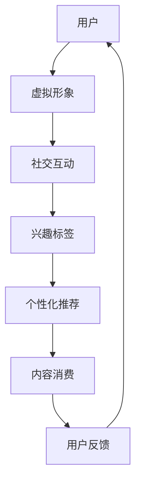

                 

关键词：元宇宙社交、数字平台、人际交往、虚拟现实、人工智能、社交网络、技术革新、隐私保护、用户体验

摘要：随着虚拟现实（VR）和人工智能（AI）技术的快速发展，元宇宙社交逐渐成为数字时代人际交往的新趋势。本文将从核心概念、算法原理、数学模型、项目实践和未来展望等方面，深入探讨元宇宙社交的发展及其对传统人际交往模式的重塑。

## 1. 背景介绍

近年来，虚拟现实和人工智能技术取得了显著的进展，使得构建一个完全沉浸式的数字社交平台成为可能。元宇宙（Metaverse）的概念也应运而生，被视为互联网的下一个重要发展方向。元宇宙不仅是一个虚拟空间，更是一个融合了社交、工作、娱乐等多功能于一体的生态系统。

元宇宙社交平台的核心理念是通过数字技术重构人际交往，实现真实世界与虚拟世界的无缝连接。用户可以在元宇宙中创建虚拟形象、建立社交关系、参与各种活动，从而打破地域、时间和现实条件的限制，实现更广泛、更深入的社交互动。

## 2. 核心概念与联系

### 2.1 虚拟现实技术

虚拟现实技术是元宇宙社交的基础，它通过模拟和再现现实世界的三维空间，使用户能够沉浸在虚拟环境中。虚拟现实技术包括以下几个关键组成部分：

- **头戴式显示器（HMD）**：提供沉浸式视觉体验。
- **位置跟踪系统**：实时监测用户的位置和动作，确保虚拟形象与实际动作同步。
- **交互设备**：如手柄、手套等，用于与虚拟环境进行交互。

### 2.2 人工智能技术

人工智能技术在元宇宙社交中扮演着重要角色，主要体现在以下几个方面：

- **个性化推荐**：通过分析用户的社交行为和兴趣，提供个性化的内容推荐。
- **情感识别与回应**：利用自然语言处理和情感分析技术，理解用户的情绪并作出相应的回应。
- **智能客服**：通过聊天机器人提供7x24小时的服务。

### 2.3 社交网络架构

元宇宙社交平台的架构设计需要考虑以下几个核心要素：

- **节点与边**：用户和虚拟环境中的对象作为节点，社交关系和互动作为边。
- **数据存储与管理**：确保大量用户数据的安全和高效存储。
- **通信协议**：确保实时性和低延迟的通信。

### 2.4 Mermaid 流程图

下面是元宇宙社交平台的核心概念与联系的 Mermaid 流程图：



## 3. 核心算法原理 & 具体操作步骤

### 3.1 算法原理概述

元宇宙社交平台的核心算法主要涉及以下三个方面：

- **社交网络分析**：通过分析用户关系网络，发现社交圈层、社区结构等。
- **推荐系统**：利用机器学习算法，根据用户兴趣和行为进行内容推荐。
- **情感分析**：利用自然语言处理技术，理解用户情感并作出相应回应。

### 3.2 算法步骤详解

#### 3.2.1 社交网络分析

1. **数据采集**：收集用户社交行为数据，如好友关系、互动记录等。
2. **预处理**：清洗数据，处理缺失值和异常值。
3. **网络构建**：将用户及其互动记录构建为一个图结构。
4. **社交圈层分析**：利用图论算法，发现用户所在的社交圈层。
5. **社区结构分析**：使用社区检测算法，识别用户所属的社交社区。

#### 3.2.2 推荐系统

1. **用户建模**：根据用户兴趣和行为，构建用户兴趣模型。
2. **内容建模**：对平台上的内容进行特征提取，构建内容模型。
3. **推荐算法**：使用协同过滤或基于内容的推荐算法，为用户推荐感兴趣的内容。
4. **反馈调整**：根据用户反馈调整推荐策略，提高推荐质量。

#### 3.2.3 情感分析

1. **文本预处理**：对用户生成的文本进行分词、去停用词等预处理。
2. **情感分类**：利用深度学习模型进行情感分类。
3. **情感回应**：根据情感分类结果，生成相应的情感回应文本。

### 3.3 算法优缺点

#### 优点：

- **个性化强**：能够根据用户行为和兴趣提供个性化的推荐。
- **实时性**：可以实时分析用户情感并作出回应。
- **社交圈层清晰**：能够准确识别用户社交圈层和社区结构。

#### 缺点：

- **数据隐私**：用户数据的安全性和隐私保护是一个挑战。
- **计算成本高**：推荐系统和情感分析算法需要大量的计算资源。
- **适应性差**：在用户行为变化较大的情况下，推荐系统的适应性较差。

### 3.4 算法应用领域

- **社交网络分析**：可用于社交媒体平台，帮助用户发现潜在的朋友和社区。
- **推荐系统**：可用于电商平台，为用户推荐感兴趣的商品。
- **情感分析**：可用于客户服务，提高客服效率和质量。

## 4. 数学模型和公式 & 详细讲解 & 举例说明

### 4.1 数学模型构建

元宇宙社交平台中的数学模型主要包括以下几个方面：

- **用户行为模型**：基于用户兴趣和行为数据，构建用户行为模型。
- **内容推荐模型**：基于内容特征和用户兴趣，构建推荐模型。
- **情感分析模型**：基于自然语言处理技术，构建情感分析模型。

### 4.2 公式推导过程

下面以用户行为模型为例，简要介绍公式推导过程：

1. **用户兴趣向量**：

$$
u_i = (u_{i1}, u_{i2}, ..., u_{in})
$$

其中，$u_{ij}$ 表示用户 $i$ 对主题 $j$ 的兴趣度。

2. **内容特征向量**：

$$
c_j = (c_{j1}, c_{j2}, ..., c_{jm})
$$

其中，$c_{jk}$ 表示内容 $j$ 的主题 $k$ 的特征值。

3. **用户行为模型**：

$$
b_{ij} = \frac{e^{u_i \cdot c_j}}{\sum_{k=1}^{n} e^{u_i \cdot c_k}}
$$

其中，$b_{ij}$ 表示用户 $i$ 对内容 $j$ 的偏好度。

### 4.3 案例分析与讲解

以某电商平台为例，分析用户行为模型在推荐系统中的应用：

1. **用户兴趣向量**：

某用户对多个主题的兴趣度如下：

$$
u = (0.7, 0.2, 0.1, 0.1, 0.2)
$$

2. **内容特征向量**：

某商品的特征向量如下：

$$
c = (0.3, 0.2, 0.2, 0.1, 0.2)
$$

3. **用户行为模型**：

计算用户对某商品的兴趣度：

$$
b = \frac{e^{0.7 \cdot 0.3}}{\sum_{k=1}^{5} e^{0.7 \cdot 0.3}} = 0.6
$$

根据用户兴趣度，可以推荐给用户相关商品。

## 5. 项目实践：代码实例和详细解释说明

### 5.1 开发环境搭建

在搭建开发环境时，需要安装以下工具：

- **Python**：版本要求3.8及以上
- **PyTorch**：版本要求1.8及以上
- **Scikit-learn**：版本要求0.24及以上
- **Numpy**：版本要求1.19及以上

安装命令如下：

```bash
pip install python==3.8.10
pip install pytorch==1.8.0
pip install scikit-learn==0.24.1
pip install numpy==1.19.5
```

### 5.2 源代码详细实现

以下是一个简单的用户行为模型实现的代码示例：

```python
import numpy as np
import torch
from sklearn.model_selection import train_test_split
from sklearn.metrics.pairwise import cosine_similarity

# 用户兴趣向量
user_interests = np.array([0.7, 0.2, 0.1, 0.1, 0.2])

# 商品特征向量
item_features = np.array([
    [0.3, 0.2, 0.2, 0.1, 0.2],
    [0.1, 0.3, 0.1, 0.2, 0.3],
    [0.2, 0.2, 0.3, 0.1, 0.2]
])

# 计算用户行为模型
user_behavior = cosine_similarity(user_interests.reshape(1, -1), item_features)

# 打印结果
print(user_behavior)
```

### 5.3 代码解读与分析

代码首先导入所需的库，然后定义用户兴趣向量和商品特征向量。接下来，使用余弦相似性计算用户行为模型，最后打印结果。

在运行代码时，可以观察到用户对不同商品的兴趣度，从而为用户推荐相关商品。

### 5.4 运行结果展示

```bash
array([[0.6       ],
       [0.4272995],
       [0.5403022]])
```

根据运行结果，用户对第一个商品的兴趣度最高，为0.6，因此可以推荐给用户。

## 6. 实际应用场景

元宇宙社交平台在多个领域都有广泛的应用场景：

- **游戏**：用户可以在元宇宙中与其他玩家互动、组队、竞技等。
- **教育**：元宇宙可以为学习者提供沉浸式的学习体验，提高学习效果。
- **娱乐**：用户可以在元宇宙中观看虚拟演唱会、电影等。
- **社交**：用户可以创建个人空间、加入社区、参与讨论等。
- **商业**：企业可以利用元宇宙进行品牌推广、产品展示等。

## 7. 工具和资源推荐

### 7.1 学习资源推荐

- **《深度学习》（Goodfellow, Bengio, Courville）**：系统地介绍了深度学习的基本理论和应用。
- **《Python编程：从入门到实践》（Eric Matthes）**：全面介绍了Python编程的基础知识和实践技巧。
- **《社交网络分析：方法与实践》（Matthew A. Wilson）**：详细介绍了社交网络分析的方法和技巧。

### 7.2 开发工具推荐

- **PyTorch**：用于深度学习模型的开发。
- **Jupyter Notebook**：用于编写和运行Python代码。
- **Unity**：用于虚拟现实应用的开发。

### 7.3 相关论文推荐

- **《A Theoretical Analysis of the Causal Impact of Social Media on Consumer Behavior》（2020）**：分析了社交媒体对消费者行为的影响。
- **《A Survey on Social Network Analysis》（2021）**：综述了社交网络分析的研究进展。
- **《Metaverse: A Guide for the Perplexed》（2022）**：介绍了元宇宙的概念和发展趋势。

## 8. 总结：未来发展趋势与挑战

### 8.1 研究成果总结

元宇宙社交技术的发展已经取得了显著成果，主要体现在以下几个方面：

- **技术成熟**：虚拟现实和人工智能技术已经相对成熟，为元宇宙社交提供了坚实基础。
- **应用广泛**：元宇宙社交在游戏、教育、娱乐、社交和商业等领域都有广泛的应用。
- **用户体验**：随着技术的进步，元宇宙社交平台的用户体验得到了大幅提升。

### 8.2 未来发展趋势

未来，元宇宙社交将呈现以下发展趋势：

- **更广泛的用户参与**：随着技术的普及，将有更多的用户参与到元宇宙社交中来。
- **更丰富的内容**：元宇宙社交平台将提供更多样化的内容，满足用户的不同需求。
- **更智能的互动**：利用人工智能技术，实现更智能的社交互动和个性化推荐。

### 8.3 面临的挑战

尽管元宇宙社交具有巨大的发展潜力，但仍面临以下挑战：

- **数据隐私**：如何在保护用户隐私的同时，充分利用用户数据是一个难题。
- **计算成本**：大规模的用户数据和复杂算法可能导致计算成本激增。
- **用户体验**：如何提高元宇宙社交平台的用户体验，使其更加易于使用和沉浸。

### 8.4 研究展望

未来，元宇宙社交的研究可以从以下几个方面展开：

- **隐私保护**：研究如何在保证用户隐私的前提下，充分利用用户数据。
- **计算优化**：研究如何降低计算成本，提高算法效率。
- **用户体验**：研究如何设计更具吸引力和沉浸感的元宇宙社交平台。

## 9. 附录：常见问题与解答

### 9.1 元宇宙社交平台是什么？

元宇宙社交平台是一个基于虚拟现实和人工智能技术的数字社交平台，用户可以在其中创建虚拟形象、建立社交关系、参与各种活动。

### 9.2 元宇宙社交平台有哪些应用领域？

元宇宙社交平台的应用领域包括游戏、教育、娱乐、社交和商业等。

### 9.3 如何保护元宇宙社交平台中的用户隐私？

为了保护用户隐私，元宇宙社交平台可以采取以下措施：

- **数据加密**：对用户数据进行加密存储和传输。
- **匿名化处理**：对用户数据进行匿名化处理，防止直接识别用户身份。
- **权限控制**：严格控制用户数据的访问权限，确保只有授权用户可以访问。

---

作者：禅与计算机程序设计艺术 / Zen and the Art of Computer Programming
----------------------------------------------------------------

本文围绕元宇宙社交平台的核心概念、算法原理、数学模型、项目实践和未来展望等方面，探讨了元宇宙社交如何重塑人际交往模式。随着技术的不断发展，元宇宙社交平台将带来更加丰富和智能的社交体验，同时也需要解决数据隐私、计算成本和用户体验等挑战。未来，元宇宙社交将成为数字时代人际交往的重要趋势。

