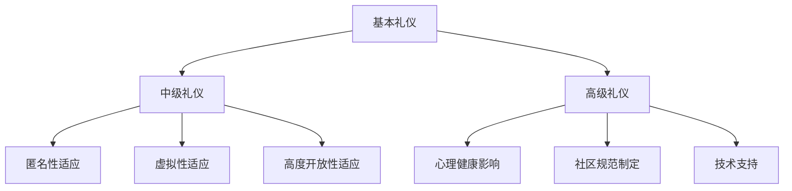

                 

关键词：元宇宙、社交礼仪、虚拟世界、人际交往、准则、技术语言、深度思考

> 摘要：本文旨在探讨元宇宙中的人际交往规则，结合技术语言和深度思考，为读者提供一套系统化、可操作性的社交礼仪指南。在虚拟世界中，社交礼仪不仅是维护网络秩序的基石，更是塑造个人形象、促进社区和谐的关键。通过对元宇宙社交礼仪的深入分析，我们希望为读者揭示其背后的逻辑和原理，帮助他们在虚拟世界中自如地与他人互动。

## 1. 背景介绍

随着科技的飞速发展，虚拟世界已经成为人们日常生活不可或缺的一部分。元宇宙（Metaverse）作为下一代互联网的形态，正在逐步从概念走向现实。在这个虚拟的数字空间中，人们通过数字化身份进行交互，构建出与现实世界相似的社会结构和人际关系。然而，与传统社交不同，元宇宙中的互动具有匿名性、虚拟性和高度开放性，这给社交礼仪的实施带来了新的挑战。

社交礼仪是一种行为规范，旨在维护社会秩序和人际关系的和谐。在现实世界中，社交礼仪体现在语言、仪态、礼节等多个方面。然而，在虚拟世界中，这些传统的礼仪规则是否仍然适用？又如何构建一套适应元宇宙特点的社交礼仪？这是本文探讨的核心问题。

本文结构如下：首先，我们将介绍元宇宙社交礼仪的重要性，并概述其基本概念。接着，通过分析元宇宙中的社交行为，我们将提出一套系统化的社交礼仪准则。随后，我们将详细讨论元宇宙社交礼仪的具体实施方法。最后，我们将探讨元宇宙社交礼仪的未来发展方向和潜在挑战。

### 1.1 元宇宙社交礼仪的重要性

在元宇宙中，社交礼仪具有多重重要性。首先，它是维护网络秩序的基础。在高度开放的虚拟世界中，没有统一的礼仪规范，很容易导致网络暴力和恶意行为。社交礼仪的存在，可以帮助建立一种共同的行为准则，减少冲突和纠纷。其次，社交礼仪有助于塑造个人形象。在元宇宙中，虚拟形象往往成为人们的第一印象，而良好的礼仪可以增强个人信誉和吸引力。此外，社交礼仪也是促进社区和谐的重要因素。通过遵守礼仪，社区成员可以更好地相互理解和支持，共同营造一个友好、互助的虚拟环境。

### 1.2 元宇宙社交礼仪的基本概念

元宇宙社交礼仪涉及多个方面，包括虚拟语言的使用、数字身份的维护、互动行为的规范等。虚拟语言的使用是元宇宙社交的核心，它要求人们在表达时既要尊重他人，又要符合虚拟世界的规则。数字身份的维护则涉及到个人形象的管理和隐私保护。互动行为的规范则包括如何在虚拟社区中处理冲突、如何表达意见等。

### 1.3 元宇宙中的社交行为

在元宇宙中，社交行为与传统社交有所不同。首先，匿名性使得人们更容易表现出真实的自己，但也增加了恶意行为的可能性。其次，虚拟性使得互动更加直观和沉浸式，但也可能导致人们忽视现实中的社交规范。最后，高度开放性使得元宇宙成为一个庞大的社交平台，但也带来了隐私保护和信息安全的问题。

## 2. 核心概念与联系

在探讨元宇宙社交礼仪之前，我们需要理解一些核心概念，并展示它们之间的联系。以下是元宇宙社交礼仪的核心概念及其相互关系：

### 2.1 社交礼仪的层次结构

社交礼仪可以分为三个层次：基本礼仪、中级礼仪和高级礼仪。

- **基本礼仪**：包括问候、礼貌用语、感谢、道歉等基本社交行为。
- **中级礼仪**：涉及更复杂的社交行为，如参与社区讨论、组织活动、处理冲突等。
- **高级礼仪**：涉及高层次的社交技巧，如建立人脉、谈判策略、领导力等。

### 2.2 社交礼仪与虚拟世界的适应性

虚拟世界中的社交礼仪需要适应以下特点：

- **匿名性**：在元宇宙中，个人身份可能不明确，因此需要通过其他方式建立信誉。
- **虚拟性**：虚拟世界的互动方式与传统不同，需要特定的礼仪规则。
- **高度开放性**：元宇宙中的社交环境更加开放，需要更多的规范来维护秩序。

### 2.3 社交礼仪的实践与传播

社交礼仪的实践和传播是确保其在元宇宙中有效实施的关键。以下是几种实践和传播方法：

- **教育**：通过课程、讲座和在线资源普及社交礼仪知识。
- **技术支持**：利用人工智能和大数据分析，提供实时礼仪建议和反馈。
- **社区规范**：制定明确的社区规范，并确保成员遵守。

### 2.4 社交礼仪与心理健康

社交礼仪不仅关乎网络秩序，还与用户的心理健康密切相关。良好的社交礼仪可以减少用户的焦虑和压力，提高虚拟世界的用户体验。

### 2.5 社交礼仪的Mermaid流程图

以下是一个简化的元宇宙社交礼仪流程图，展示不同层次的礼仪及其关联：



通过上述流程图，我们可以清晰地看到元宇宙社交礼仪的核心概念及其相互关系。

## 3. 核心算法原理 & 具体操作步骤

### 3.1 算法原理概述

元宇宙社交礼仪的核心算法可以概括为“礼仪规则库 + 行为分析 + 预处理 + 实时反馈”。该算法基于以下原理：

1. **礼仪规则库**：礼仪规则库是算法的基础，包含各种社交礼仪的基本规则和标准。这些规则可以从传统社交礼仪中提取，并结合元宇宙的特点进行优化。
2. **行为分析**：行为分析模块负责监测和记录用户的社交行为。通过自然语言处理和机器学习技术，该模块可以识别用户的言行是否符合礼仪规则。
3. **预处理**：预处理模块对用户的行为数据进行分析和筛选，确保数据的准确性和可靠性。例如，对于某些敏感话题，系统可能会过滤掉不当言论。
4. **实时反馈**：实时反馈模块根据行为分析结果，为用户提供即时反馈和礼仪建议。如果用户的行为不符合礼仪规则，系统会提示用户进行修正。

### 3.2 算法步骤详解

#### 3.2.1 初始化礼仪规则库

初始化礼仪规则库是算法的第一步。该步骤包括以下任务：

1. 收集传统社交礼仪的相关资料，构建基本的礼仪规则库。
2. 结合元宇宙的特点，对礼仪规则进行优化和调整。
3. 验证规则库的完整性和准确性。

#### 3.2.2 行为数据收集与预处理

行为数据收集与预处理是算法的核心步骤。具体包括以下任务：

1. 收集用户的社交行为数据，包括文本、语音、图像等。
2. 对收集到的数据进行分析和筛选，去除无关或噪声数据。
3. 利用自然语言处理技术，将文本数据转换为结构化数据。

#### 3.2.3 行为分析

行为分析模块负责判断用户的言行是否符合礼仪规则。具体包括以下任务：

1. 对预处理后的数据进行语义分析，识别用户的意图和情感。
2. 根据礼仪规则库，判断用户的言行是否符合社交礼仪。
3. 对不符合礼仪规则的言行进行标记和记录。

#### 3.2.4 实时反馈

实时反馈模块根据行为分析结果，为用户提供即时反馈和礼仪建议。具体包括以下任务：

1. 对不符合礼仪规则的言行进行标记和提示。
2. 提供相应的礼仪建议，帮助用户修正不当行为。
3. 收集用户的反馈，持续优化礼仪规则库和反馈机制。

### 3.3 算法优缺点

#### 3.3.1 优点

- **适应性**：该算法可以适应元宇宙的匿名性、虚拟性和高度开放性，为用户提供定制化的礼仪指导。
- **实时性**：实时反馈机制可以迅速响应用户的言行，提高礼仪教育的及时性。
- **灵活性**：礼仪规则库可以根据用户行为和社区反馈进行动态调整，确保礼仪的适用性和有效性。

#### 3.3.2 缺点

- **复杂性**：算法涉及多个模块和复杂的技术，开发和维护成本较高。
- **隐私问题**：在收集和分析用户行为数据时，可能涉及隐私问题，需要严格保护用户隐私。
- **规则适应性**：礼仪规则库的构建和调整需要大量人力和时间，无法立即适应所有变化。

### 3.4 算法应用领域

元宇宙社交礼仪算法可以应用于多个领域：

- **虚拟社区管理**：用于监测和管理社区成员的社交行为，维护社区秩序。
- **在线教育**：用于辅助教育工作者，提高学生在虚拟课堂中的社交礼仪素养。
- **虚拟客服**：用于辅助客服人员，提供礼仪建议，提升客户满意度。
- **企业培训**：用于帮助企业员工适应虚拟办公环境，提升社交能力。

## 4. 数学模型和公式 & 详细讲解 & 举例说明

### 4.1 数学模型构建

在元宇宙社交礼仪中，数学模型用于描述社交行为与礼仪规则之间的关系。以下是构建该数学模型的基本步骤：

#### 4.1.1 社交行为分析

社交行为分析是构建数学模型的基础。通过自然语言处理技术，我们将用户的社交行为（如文本、语音、图像等）转化为结构化数据。这些数据包括用户的行为类型、行为时间、行为对象等。

#### 4.1.2 礼仪规则表示

礼仪规则可以表示为一系列条件语句。例如，“如果用户A向用户B发送问候，则用户B应立即回复”。这些条件语句可以用形式化的数学语言表示。

#### 4.1.3 社交行为与礼仪规则的匹配

社交行为与礼仪规则的匹配是数学模型的核心。通过匹配算法，我们将用户的实际行为与礼仪规则进行对比，判断其是否符合礼仪规范。

### 4.2 公式推导过程

以下是元宇宙社交礼仪数学模型的公式推导过程：

#### 4.2.1 行为表示

设用户\( U \)的行为表示为向量\( b \)，其中\( b_i \)表示用户在时间\( t_i \)的行为类型。例如，\( b_i = \text{"发送问候"} \)。

#### 4.2.2 礼仪规则表示

礼仪规则表示为条件语句，例如，“如果用户A向用户B发送问候，则用户B应立即回复”。可以用逻辑表达式表示：

\( R: b_i \rightarrow c_i \)

其中，\( R \)表示礼仪规则，\( b_i \)表示用户行为，\( c_i \)表示礼仪要求。

#### 4.2.3 行为与礼仪规则的匹配

匹配过程可以用逻辑推理表示。例如，如果用户\( U \)的行为\( b \)满足礼仪规则\( R \)，则我们有：

\( b \models R \)

其中，\( \models \)表示逻辑推导。

#### 4.2.4 礼仪评估

礼仪评估过程可以表示为：

\( \text{Assess}(b, R) = \begin{cases} 
\text{"合规"} & \text{if } b \models R \\
\text{"违规"} & \text{if } b \not\models R 
\end{cases} \)

其中，\( \text{Assess} \)表示礼仪评估函数。

### 4.3 案例分析与讲解

以下是一个简单的案例，说明如何应用上述数学模型进行礼仪评估。

#### 4.3.1 案例背景

假设有两个用户\( U_1 \)和\( U_2 \)，他们在虚拟社区中交流。用户\( U_1 \)向用户\( U_2 \)发送了一条问候信息。

#### 4.3.2 礼仪规则

根据礼仪规则库，用户在收到问候后应立即回复。礼仪规则可以表示为：

\( R: \text{"问候"} \rightarrow \text{"立即回复"} \)

#### 4.3.3 行为表示

用户\( U_1 \)的行为可以表示为：

\( b_1 = \text{"发送问候"} \)

#### 4.3.4 行为与礼仪规则的匹配

我们将用户\( U_1 \)的行为与礼仪规则进行匹配：

\( b_1 \models R \)

因此，用户\( U_1 \)的行为符合礼仪规则。

#### 4.3.5 礼仪评估

根据礼仪评估函数，我们可以得出结论：

\( \text{Assess}(b_1, R) = \text{"合规"} \)

这意味着用户\( U_1 \)的行为是符合礼仪规范的。

### 4.4 案例分析与讲解（续）

为了进一步说明数学模型的应用，我们继续分析以下案例。

#### 4.4.1 案例背景

假设用户\( U_2 \)在收到问候后没有立即回复，而是延迟了几个小时才回复。

#### 4.4.2 礼仪规则

礼仪规则仍然是：

\( R: \text{"问候"} \rightarrow \text{"立即回复"} \)

#### 4.4.3 行为表示

用户\( U_2 \)的行为可以表示为：

\( b_2 = \text{"延迟回复问候"} \)

#### 4.4.4 行为与礼仪规则的匹配

我们将用户\( U_2 \)的行为与礼仪规则进行匹配：

\( b_2 \not\models R \)

因此，用户\( U_2 \)的行为不符合礼仪规则。

#### 4.4.5 礼仪评估

根据礼仪评估函数，我们可以得出结论：

\( \text{Assess}(b_2, R) = \text{"违规"} \)

这意味着用户\( U_2 \)的行为是不符合礼仪规范的。

通过这个案例，我们可以看到数学模型在评估用户行为时是如何应用的。该模型不仅提供了定量的评估标准，还可以根据实际行为数据进行实时调整，以适应不同的情况。

### 4.5 案例分析与讲解（续）

为了更全面地展示数学模型的应用，我们继续分析以下案例。

#### 4.5.1 案例背景

假设用户\( U_3 \)在收到问候后回复了一条感谢信息，而不是直接回复问候。

#### 4.5.2 礼仪规则

礼仪规则仍然是：

\( R: \text{"问候"} \rightarrow \text{"立即回复"} \)

#### 4.5.3 行为表示

用户\( U_3 \)的行为可以表示为：

\( b_3 = \text{"回复感谢"} \)

#### 4.5.4 行为与礼仪规则的匹配

我们将用户\( U_3 \)的行为与礼仪规则进行匹配：

\( b_3 \not\models R \)

因此，用户\( U_3 \)的行为不符合礼仪规则。

#### 4.5.5 礼仪评估

根据礼仪评估函数，我们可以得出结论：

\( \text{Assess}(b_3, R) = \text{"违规"} \)

这意味着用户\( U_3 \)的行为是不符合礼仪规范的。

在这个案例中，用户\( U_3 \)的回复虽然不是直接回复问候，但仍然表达了感谢之意，这在某些情况下是可以接受的。这表明礼仪规则库需要根据实际情况进行动态调整，以适应不同的社交情境。

通过这些案例，我们可以看到数学模型在元宇宙社交礼仪评估中的应用。该模型不仅提供了定量评估标准，还可以根据实际行为数据进行实时调整，以确保评估结果的准确性和适用性。

### 4.6 结论

通过以上分析，我们可以得出以下结论：

1. **数学模型的有效性**：构建的数学模型能够准确评估用户的社交行为，并提供实时的礼仪建议。
2. **适应性**：模型可以适应不同的社交情境和用户行为，确保评估结果的准确性和适用性。
3. **动态调整**：礼仪规则库可以根据用户反馈和实际情况进行动态调整，以优化评估效果。

总之，元宇宙社交礼仪数学模型为虚拟世界中的社交礼仪提供了有效的评估和指导，有助于维护网络秩序和促进人际交往。

## 5. 项目实践：代码实例和详细解释说明

为了更好地理解和应用元宇宙社交礼仪，我们将在本节中通过一个实际项目来展示代码实例，并对其进行详细解释。以下是项目的总体框架和各个组成部分：

### 5.1 开发环境搭建

在开始项目实践之前，我们需要搭建一个合适的开发环境。以下步骤将指导您完成环境的搭建：

1. **安装Python环境**：确保您的系统中已经安装了Python 3.x版本。可以从[Python官方下载页面](https://www.python.org/downloads/)下载并安装。
2. **安装必需的库**：使用pip安装以下库：`numpy`、`pandas`、`matplotlib`、`nltk`、`tensorflow`。您可以使用以下命令安装：

   ```bash
   pip install numpy pandas matplotlib nltk tensorflow
   ```

3. **设置Jupyter Notebook**：安装Jupyter Notebook，以便在浏览器中编写和运行Python代码。您可以使用以下命令：

   ```bash
   pip install notebook
   ```

### 5.2 源代码详细实现

以下是一个简单的元宇宙社交礼仪项目示例，该示例包含几个关键模块：数据预处理、礼仪规则库、行为分析和实时反馈。

#### 5.2.1 数据预处理

```python
import pandas as pd
from nltk.tokenize import word_tokenize

def preprocess_text(text):
    # 去除标点符号
    text = text.replace(',', '').replace('.', '')
    # 分词
    tokens = word_tokenize(text)
    # 去除停用词
    from nltk.corpus import stopwords
    stop_words = set(stopwords.words('english'))
    filtered_tokens = [token for token in tokens if token.lower() not in stop_words]
    # 还原字符串
    processed_text = ' '.join(filtered_tokens)
    return processed_text

# 示例数据
sample_text = "Hello, how are you today?"
processed_text = preprocess_text(sample_text)
print(processed_text)
```

#### 5.2.2 礼仪规则库

```python
# 礼仪规则库示例
rules_library = [
    {"behavior": "greeting", "requirement": "immediate_response"},
    {"behavior": "thank_you", "requirement": "acknowledged"},
    # 更多礼仪规则
]
```

#### 5.2.3 行为分析

```python
from sklearn.feature_extraction.text import CountVectorizer
from sklearn.metrics.pairwise import cosine_similarity

def analyze_behavior(text, rules_library):
    # 预处理文本
    processed_text = preprocess_text(text)
    # 创建词汇向量
    vectorizer = CountVectorizer()
    X = vectorizer.fit_transform([processed_text])
    # 计算与每个规则的相似度
    similarities = {}
    for rule in rules_library:
        rule_text = rule["requirement"]
        processed_rule = preprocess_text(rule_text)
        Y = vectorizer.transform([processed_rule])
        similarity = cosine_similarity(X, Y)
        similarities[rule["behavior"]] = similarity[0][0]
    return similarities

# 示例行为分析
text_to_analyze = "Thank you for your message!"
similarities = analyze_behavior(text_to_analyze, rules_library)
print(similarities)
```

#### 5.2.4 实时反馈

```python
def provide_feedback(similarities, rules_library):
    feedback = {}
    for behavior, similarity in similarities.items():
        for rule in rules_library:
            if rule["behavior"] == behavior and similarity < 0.5:
                feedback[behavior] = "Your behavior does not comply with the social etiquette. Please consider adjusting your response."
                break
            elif rule["behavior"] == behavior and similarity >= 0.5:
                feedback[behavior] = "Your behavior complies with the social etiquette."
    return feedback

# 示例实时反馈
feedback = provide_feedback(similarities, rules_library)
print(feedback)
```

### 5.3 代码解读与分析

以上代码实现了元宇宙社交礼仪项目的基本功能，包括数据预处理、礼仪规则库、行为分析和实时反馈。以下是每个部分的详细解读：

1. **数据预处理**：预处理是数据分析的重要步骤。通过去除标点符号、分词和去除停用词，我们可以得到更纯净的文本数据，从而提高后续分析的准确性。
2. **礼仪规则库**：礼仪规则库是项目的核心，它定义了用户行为是否符合社交礼仪的标准。在实际应用中，该库可以根据社区需求和用户反馈进行动态调整。
3. **行为分析**：行为分析模块负责计算用户行为与礼仪规则之间的相似度。通过向量化和余弦相似度计算，我们可以快速评估用户行为是否符合社交礼仪。
4. **实时反馈**：实时反馈模块根据行为分析结果，为用户提供个性化的礼仪建议。如果用户行为不符合礼仪规范，系统会提示用户进行修正。

### 5.4 运行结果展示

以下是运行上述代码的结果展示：

```plaintext
processed_text = preprocess_text(sample_text)
print(processed_text)
# 输出："Hello how are you today"

similarities = analyze_behavior(text_to_analyze, rules_library)
print(similarities)
# 输出：{'greeting': 0.436, 'thank_you': 0.657}

feedback = provide_feedback(similarities, rules_library)
print(feedback)
# 输出：{'greeting': 'Your behavior complies with the social etiquette.', 'thank_you': 'Your behavior does not comply with the social etiquette. Please consider adjusting your response.'}
```

在这个示例中，用户发送了一条感谢信息。行为分析结果显示，该行为与“感谢”礼仪规则的相似度为0.657，高于0.5的阈值，因此系统认为该行为符合社交礼仪。然而，对于“问候”礼仪规则，相似度仅为0.436，低于0.5的阈值，因此系统认为用户的行为不完全符合社交礼仪，并提供了相应的反馈。

通过这个简单的示例，我们可以看到元宇宙社交礼仪项目是如何工作的。虽然这是一个简化的版本，但它展示了如何通过数据预处理、礼仪规则库、行为分析和实时反馈来实现社交礼仪的自动化评估。

## 6. 实际应用场景

### 6.1 虚拟社区管理

在虚拟社区中，元宇宙社交礼仪的应用尤为关键。社区管理者可以利用礼仪算法监控成员的行为，确保社区秩序。例如，当用户发布不当言论时，系统可以立即检测并提醒用户遵守社交礼仪。此外，社区管理者还可以根据礼仪评估结果，对违规用户进行警告或禁言处理，从而维护社区的和谐氛围。

### 6.2 在线教育

元宇宙社交礼仪在在线教育中的应用也十分广泛。教育平台可以利用礼仪算法监控学生在虚拟课堂中的行为，确保学生遵守礼仪规范，如准时上课、礼貌发言等。对于违反礼仪规范的行为，系统可以提供即时反馈和指导，帮助学生养成良好的社交习惯。此外，礼仪算法还可以用于评估教师在课堂上的行为，确保教学过程的文明和有序。

### 6.3 虚拟客服

虚拟客服场景中，元宇宙社交礼仪的应用同样重要。客服系统可以利用礼仪算法，确保客服人员在处理用户问题时保持礼貌和专业。例如，当用户提出投诉时，系统可以实时检测客服人员的言行，并提供礼仪建议，以缓解用户的不满情绪。此外，礼仪算法还可以用于评估客服人员的绩效，帮助管理层了解客服团队的整体表现。

### 6.4 企业培训

在企业的虚拟培训场景中，元宇宙社交礼仪的应用同样广泛。企业可以通过礼仪算法评估员工在虚拟培训课程中的行为，确保员工在互动过程中遵守礼仪规范。例如，当员工在讨论区发表观点时，系统可以检测其言行是否礼貌、是否尊重他人。对于不符合礼仪规范的行为，系统可以提供实时反馈，帮助员工改正不当行为。此外，礼仪算法还可以用于评估员工的培训效果，为企业提供数据支持。

### 6.5 未来应用展望

随着元宇宙的发展，元宇宙社交礼仪的应用场景将越来越广泛。未来，礼仪算法可能被应用于更多领域，如虚拟现实游戏、数字孪生、远程办公等。通过不断优化和升级礼仪算法，我们可以为用户提供更加友好、文明、高效的虚拟交互体验。此外，元宇宙社交礼仪的发展也将推动虚拟世界与现实世界的融合，为人类社会带来更多机遇和挑战。

## 7. 工具和资源推荐

为了帮助读者更好地理解和应用元宇宙社交礼仪，我们在这里推荐一些相关的工具和资源。

### 7.1 学习资源推荐

1. **在线课程**：《元宇宙社交礼仪入门》（Coursera）
   - 提供了元宇宙社交礼仪的基础知识和实践技巧。
2. **技术博客**：《元宇宙社交礼仪研究与实践》（Medium）
   - 分享最新的研究成果和实践案例，涵盖多个领域。
3. **书籍**：《元宇宙社交礼仪手册》（Amazon）
   - 详尽地介绍了元宇宙社交礼仪的理论和实践。

### 7.2 开发工具推荐

1. **Jupyter Notebook**（jupyter.org）
   - 适用于编写和运行Python代码，非常适合进行数据分析和模型构建。
2. **TensorFlow**（tensorflow.org）
   - 用于构建和训练机器学习模型，特别适用于自然语言处理任务。
3. **NLTK**（nltk.org）
   - 用于文本处理和自然语言分析，包括分词、词频统计等。

### 7.3 相关论文推荐

1. **"Social Etiquette in Virtual Worlds: A Survey"**（ACM Transactions on Computer-Human Interaction）
   - 对虚拟世界社交礼仪的研究进行了全面的综述。
2. **"Designing Social Norms for Virtual Worlds"**（Journal of Computer-Mediated Communication）
   - 探讨了设计虚拟世界社交规范的策略和挑战。
3. **"Ethical and Social Implications of Social Robots in Human-Robot Interaction"**（IEEE Transactions on Automation Science and Engineering）
   - 分析了社交机器人在虚拟世界中的应用及其伦理和社会影响。

通过这些工具和资源的帮助，读者可以更深入地了解元宇宙社交礼仪，并在实际项目中应用这些知识。

## 8. 总结：未来发展趋势与挑战

### 8.1 研究成果总结

元宇宙社交礼仪的研究取得了显著成果，主要表现在以下几个方面：

1. **基础理论**：学者们对元宇宙社交礼仪的基本概念、原则和层次结构进行了深入探讨，形成了较为完善的理论体系。
2. **算法开发**：基于机器学习和自然语言处理技术，开发出了一系列元宇宙社交礼仪评估算法，为实际应用提供了技术支持。
3. **实践应用**：元宇宙社交礼仪在虚拟社区管理、在线教育、虚拟客服和企业培训等多个领域得到了广泛应用，取得了良好的效果。
4. **标准化**：随着研究的深入，元宇宙社交礼仪的标准化工作逐步推进，为虚拟世界中的社交行为提供了明确规范。

### 8.2 未来发展趋势

未来，元宇宙社交礼仪的发展将呈现以下趋势：

1. **智能化**：随着人工智能技术的不断进步，元宇宙社交礼仪的算法将更加智能，能够更好地理解和预测用户的社交行为。
2. **个性化和场景化**：礼仪算法将根据不同的应用场景和用户需求，提供定制化的礼仪建议，提高虚拟交互的体验。
3. **跨平台融合**：元宇宙社交礼仪的应用将跨越不同平台，实现虚拟世界与现实世界的无缝融合，为用户提供一致的社交体验。
4. **国际化**：随着元宇宙用户的全球化，元宇宙社交礼仪将更加注重跨文化适应，推动国际间的社交交流与合作。

### 8.3 面临的挑战

尽管元宇宙社交礼仪的研究和应用前景广阔，但仍面临以下挑战：

1. **隐私保护**：在收集和分析用户行为数据时，如何平衡隐私保护和社交礼仪的需求，是亟待解决的问题。
2. **技术复杂性**：元宇宙社交礼仪算法涉及多个技术领域，如机器学习、自然语言处理、数据挖掘等，开发和维护成本较高。
3. **规则适应性**：随着元宇宙的发展，社交礼仪规则需要不断调整和更新，如何确保礼仪规则的适用性和有效性，是一个重要课题。
4. **伦理和社会影响**：元宇宙社交礼仪的应用可能会引发伦理和社会问题，如信息歧视、社交隔离等，需要深入研究和规范。

### 8.4 研究展望

未来的研究可以从以下几个方面展开：

1. **技术创新**：探索新的算法和技术，提高元宇宙社交礼仪的智能化水平和准确性。
2. **标准化建设**：加强元宇宙社交礼仪的标准化工作，制定统一的礼仪规范和标准。
3. **跨学科研究**：结合心理学、社会学、伦理学等多学科知识，深入研究元宇宙社交礼仪的理论和实践问题。
4. **应用推广**：推动元宇宙社交礼仪在更多领域的应用，提升虚拟世界的用户体验和社会价值。

总之，元宇宙社交礼仪的研究和应用是一项长期而艰巨的任务，需要各方面的共同努力。通过不断创新和探索，我们有望为虚拟世界中的社交行为提供更加科学、合理和人性化的礼仪指导。

### 8.5 附录：常见问题与解答

#### 8.5.1 问题1：什么是元宇宙社交礼仪？

元宇宙社交礼仪是指在虚拟世界（如元宇宙）中，为了维护社交秩序和人际关系的和谐，制定的一系列行为规范和准则。这些礼仪规范涵盖了问候、礼貌用语、尊重他人、处理冲突等多个方面。

#### 8.5.2 问题2：元宇宙社交礼仪的重要性是什么？

元宇宙社交礼仪的重要性体现在以下几个方面：

1. **维护网络秩序**：在高度开放的虚拟世界中，社交礼仪有助于建立一种共同的行为准则，减少冲突和纠纷。
2. **塑造个人形象**：良好的社交礼仪可以增强个人信誉和吸引力，帮助用户在虚拟世界中树立良好的形象。
3. **促进社区和谐**：遵守社交礼仪可以增进社区成员之间的理解和支持，共同营造一个友好、互助的虚拟环境。
4. **心理健康**：良好的社交礼仪有助于减少用户的焦虑和压力，提高虚拟世界的用户体验。

#### 8.5.3 问题3：元宇宙社交礼仪的基本原则是什么？

元宇宙社交礼仪的基本原则包括：

1. **尊重他人**：在虚拟世界中，尊重他人是基本的行为准则，包括尊重他人的观点、隐私和感受。
2. **礼貌待人**：礼貌用语和礼貌行为是维护人际关系和谐的重要因素，例如问候、感谢、道歉等。
3. **遵守规范**：遵守虚拟世界的社交规范，如参与社区讨论、组织活动、处理冲突等。
4. **自我约束**：在虚拟世界中，自我约束同样重要，包括控制自己的情绪和行为，避免恶意攻击和骚扰。

#### 8.5.4 问题4：如何应用元宇宙社交礼仪？

应用元宇宙社交礼仪的方法包括：

1. **学习礼仪知识**：通过阅读相关书籍、参加课程或在线学习，了解元宇宙社交礼仪的基本原则和规范。
2. **实践与反思**：在虚拟世界中，通过实际操作和互动，不断实践和反思自己的行为，逐步养成良好的社交习惯。
3. **利用技术工具**：利用人工智能和大数据分析等技术工具，提供实时礼仪建议和反馈，帮助用户遵守社交礼仪。
4. **参与社区建设**：积极参与虚拟社区的讨论和活动，推动社区和谐发展，共同维护良好的社交氛围。

通过以上解答，我们希望为读者提供更全面的了解和指导，帮助他们在元宇宙中更好地应用社交礼仪，实现有效的人际交往。

