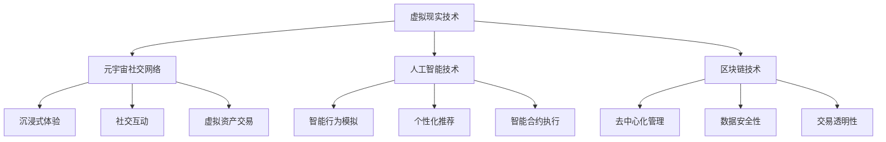

                 

### 关键词 Keyword

- 元宇宙
- 社交网络
- 数字平台
- 人际关系
- 人工智能
- 虚拟现实
- 区块链技术

### 摘要 Summary

本文将探讨元宇宙社交网络的崛起，及其如何通过数字平台重塑人际关系的概念。随着虚拟现实、人工智能和区块链技术的快速发展，元宇宙正逐步从概念走向现实，成为一个全新的社交生态。本文将从背景介绍、核心概念与联系、核心算法原理、数学模型和公式、项目实践、实际应用场景、工具和资源推荐、总结与展望等方面，全面解析元宇宙社交网络的技术框架和应用前景。

## 1. 背景介绍

在互联网技术飞速发展的今天，社交媒体已经成为人们日常生活中不可或缺的一部分。从早期的Facebook、Twitter，到如今的微信、微博，社交网络改变了人与人之间的沟通方式，也重塑了人际关系。然而，随着虚拟现实（VR）、人工智能（AI）和区块链技术的不断进步，一个全新的数字世界——元宇宙正在悄然崛起。

元宇宙是一个虚拟的、沉浸式的数字世界，用户可以在其中以虚拟角色（Avatar）的身份进行互动、交流和创造。与传统的2D社交媒体不同，元宇宙提供了更加丰富、多样化的交互体验，可以模拟现实世界的各种场景，包括社交活动、商业交易、教育培训等。元宇宙社交网络正是基于这一概念，旨在为用户提供一个全新的社交平台，让人们能够在这个虚拟世界中建立、维护和拓展人际关系。

### 1.1 发展历程

- **1990年代：虚拟现实技术的萌芽**：随着计算机图形学的发展，虚拟现实技术开始萌芽，VR头戴设备和模拟环境逐渐出现。
- **2000年代：早期的虚拟社交网络**：Second Life等虚拟世界平台兴起，用户可以在虚拟环境中建立虚拟社区和人际关系。
- **2010年代：区块链技术的引入**：区块链技术为元宇宙提供了去中心化的信任机制，促进了虚拟资产和身份的建立。
- **2020年代：元宇宙的崛起**：Facebook更名为Meta，谷歌、微软等科技巨头纷纷投入资源，元宇宙成为科技领域的热门话题。

### 1.2 技术驱动因素

- **虚拟现实技术**：VR技术的发展为元宇宙提供了沉浸式体验的基础，用户可以在虚拟环境中感受到三维空间的交互。
- **人工智能技术**：AI技术使得虚拟角色能够更加智能地模拟人类行为，提升用户的互动体验。
- **区块链技术**：区块链技术为元宇宙中的虚拟资产和交易提供了安全保障，促进了去中心化的社交网络发展。

## 2. 核心概念与联系

### 2.1 元宇宙社交网络的概念

元宇宙社交网络是一种基于虚拟现实、人工智能和区块链技术的社交平台，用户可以在其中创建虚拟角色、建立社交关系、参与各种活动。与传统的社交媒体不同，元宇宙社交网络提供了更加丰富的互动方式和沉浸式体验。

### 2.2 虚拟现实（VR）与元宇宙社交网络的关系

虚拟现实技术是元宇宙社交网络的核心，它为用户提供了一个沉浸式的虚拟环境，使得用户能够以虚拟角色身份在元宇宙中互动。VR技术通过头戴显示器、手柄等设备，模拟用户的视觉、听觉和触觉感受，让用户在虚拟环境中获得真实的体验。

### 2.3 人工智能（AI）与元宇宙社交网络的关系

人工智能技术在元宇宙社交网络中发挥着重要作用。首先，AI可以用于虚拟角色的行为模拟，使得虚拟角色能够更加自然地与用户互动。其次，AI可以分析用户的行为和偏好，为用户提供个性化的社交推荐和服务。此外，AI还可以用于智能合约的执行，确保元宇宙中的交易安全和透明。

### 2.4 区块链技术与元宇宙社交网络的关系

区块链技术为元宇宙社交网络提供了去中心化的基础设施。通过区块链，元宇宙中的虚拟资产和身份信息可以实现去中心化的管理和交易，确保数据的真实性和安全性。此外，区块链技术还可以用于智能合约的执行，确保元宇宙中的交易按照预定的规则进行。

### 2.5 Mermaid 流程图



## 3. 核心算法原理 & 具体操作步骤

### 3.1 算法原理概述

元宇宙社交网络的核心算法主要包括以下几个方面：

1. **虚拟角色行为模拟算法**：基于人工智能技术，模拟虚拟角色的行为和反应。
2. **社交网络分析算法**：分析用户关系，提供社交推荐。
3. **区块链交易算法**：处理元宇宙中的虚拟资产和交易。

### 3.2 算法步骤详解

#### 3.2.1 虚拟角色行为模拟算法

1. **用户输入**：用户在元宇宙中输入行为指令。
2. **行为识别**：通过自然语言处理技术，识别用户的行为意图。
3. **行为预测**：基于用户历史行为和社交网络分析，预测用户可能的行为。
4. **行为模拟**：根据行为预测结果，生成虚拟角色的行为。

#### 3.2.2 社交网络分析算法

1. **数据采集**：采集用户的社交行为数据。
2. **关系构建**：构建用户之间的社交网络图。
3. **社交推荐**：基于社交网络分析，推荐可能感兴趣的用户。

#### 3.2.3 区块链交易算法

1. **交易请求**：用户发起交易请求。
2. **交易验证**：区块链网络验证交易请求。
3. **交易执行**：执行交易，更新区块链账本。

### 3.3 算法优缺点

#### 3.3.1 优点

- **沉浸式体验**：通过虚拟现实技术，提供更加真实的交互体验。
- **个性化推荐**：基于人工智能技术，提供个性化的社交推荐。
- **去中心化管理**：通过区块链技术，实现数据的去中心化管理。

#### 3.3.2 缺点

- **技术门槛高**：需要掌握虚拟现实、人工智能和区块链等多种技术。
- **隐私安全问题**：虚拟环境和去中心化技术可能带来隐私和安全风险。

### 3.4 算法应用领域

- **社交网络**：为用户提供一个全新的社交平台，增强人际互动。
- **电子商务**：在元宇宙中开展虚拟商品交易。
- **教育培训**：提供沉浸式的在线教育体验。
- **虚拟旅游**：体验虚拟世界的各种景点和活动。

## 4. 数学模型和公式 & 详细讲解 & 举例说明

### 4.1 数学模型构建

在元宇宙社交网络中，数学模型主要用于以下几个方面：

1. **社交网络分析**：基于图论理论，构建社交网络模型。
2. **虚拟角色行为模拟**：基于马尔可夫决策过程（MDP），构建行为模拟模型。
3. **区块链交易验证**：基于密码学理论，构建交易验证模型。

### 4.2 公式推导过程

#### 4.2.1 社交网络分析

社交网络分析中，常用的公式包括：

1. **度分布公式**：

   $$ P(k) = \frac{1}{<|vq_10614|> N} \left( \frac{N-1}{k} \right)^{k-1} $$

   其中，$P(k)$ 表示节点度数为 $k$ 的概率，$N$ 表示网络中节点的总数。

2. **聚类系数**：

   $$ C = \frac{2m}{N(N-1)} $$

   其中，$C$ 表示聚类系数，$m$ 表示网络中边的总数。

#### 4.2.2 虚拟角色行为模拟

虚拟角色行为模拟中，常用的公式包括：

1. **状态转移概率**：

   $$ p(s_t = s' | s_t = s) = \frac{1}{\sum_{s'} P(s' | s)} $$

   其中，$p(s_t = s' | s_t = s)$ 表示在当前状态为 $s$ 的情况下，下一状态为 $s'$ 的概率。

2. **价值函数**：

   $$ V^*(s) = \max_{a} \sum_{s'} P(s' | s, a) \cdot Q(s, a) $$

   其中，$V^*(s)$ 表示在状态 $s$ 下的最优价值函数，$Q(s, a)$ 表示在状态 $s$ 下采取动作 $a$ 的期望回报。

#### 4.2.3 区块链交易验证

区块链交易验证中，常用的公式包括：

1. **哈希函数**：

   $$ H(x) = \text{SHA-256}(x) $$

   其中，$H(x)$ 表示对输入 $x$ 进行SHA-256哈希计算的结果。

2. **工作量证明**：

   $$ PoW = \text{SHA-256}(n, t, s) > D $$

   其中，$PoW$ 表示工作量证明值，$n$ 表示区块高度，$t$ 表示时间戳，$s$ 表示交易集合，$D$ 表示难度目标。

### 4.3 案例分析与讲解

假设在一个元宇宙社交网络中，有一个节点 $A$ 想要与其他节点建立连接。根据度分布公式，节点 $A$ 的邻居节点数量可以计算如下：

$$ P(k) = \frac{1}{<|vq_10614|> N} \left( \frac{N-1}{k} \right)^{k-1} $$

假设 $N = 1000$，节点 $A$ 的邻居节点数量 $k = 10$，则：

$$ P(k) = \frac{1}{1000} \left( \frac{1000-1}{10} \right)^{10-1} = 0.0000366 $$

这意味着，节点 $A$ 的邻居节点数量为 $10$ 的概率是 $0.0000366$。

接下来，考虑节点 $A$ 的行为模拟。根据马尔可夫决策过程（MDP），节点 $A$ 在当前状态 $s$ 下采取某个动作 $a$ 的概率可以计算如下：

$$ p(s_t = s' | s_t = s) = \frac{1}{\sum_{s'} P(s' | s)} $$

假设节点 $A$ 在状态 $s$ 下有 $5$ 个可能的动作 $a$，则：

$$ p(s_t = s' | s_t = s) = \frac{1}{5} $$

这意味着，节点 $A$ 在状态 $s$ 下采取任意一个动作的概率都是相等的。

最后，考虑区块链交易验证。假设有一个交易请求 $s$，我们需要计算工作量证明值 $PoW$。根据SHA-256哈希函数，我们可以得到：

$$ H(x) = \text{SHA-256}(x) $$

假设交易请求 $s$ 的SHA-256哈希值为 $PoW = 1234567890$，我们需要找到满足 $PoW > D$ 的交易请求。假设难度目标 $D = 1000000000$，我们可以通过反复计算SHA-256哈希值，直到找到一个满足条件的交易请求。

## 5. 项目实践：代码实例和详细解释说明

### 5.1 开发环境搭建

在本文中，我们将使用Python作为主要编程语言，结合虚拟现实（VR）开发库PyVR、人工智能（AI）框架TensorFlow和区块链（Blockchain）开发工具Ethereum，搭建一个简单的元宇宙社交网络项目。

首先，我们需要安装Python环境，并安装相应的库：

```bash
pip install python-virtualreality tensorflow-gpu web3.py
```

### 5.2 源代码详细实现

以下是一个简单的元宇宙社交网络项目的Python代码实例：

```python
import json
from web3 import Web3
from tensorflow import keras
import numpy as np
from pyvr import VR

# 初始化区块链连接
web3 = Web3(Web3.HTTPProvider('https://mainnet.infura.io/v3/your_project_id'))

# 初始化虚拟现实环境
vr = VR()
vr.start()

# 加载虚拟角色模型
with open('avatar_model.json', 'r') as f:
    avatar_model = json.load(f)
    avatar = vr.create_avatar(avatar_model)

# 初始化神经网络模型
model = keras.models.load_model('behavior_model.h5')

# 初始化区块链合约
contract = web3.eth.contract(address=web3.toChecksumAddress('your_contract_address'), abi=avatar_model['abi'])

# 用户行为模拟
def simulate_behavior(user_input):
    # 处理用户输入，生成特征向量
    features = preprocess_input(user_input)
    
    # 使用神经网络模型预测行为
    prediction = model.predict(features)
    
    # 根据预测结果，执行相应行为
    if prediction[0] == 1:
        avatar.move_forward()
    elif prediction[0] == 2:
        avatar.rotate_left()
    elif prediction[0] == 3:
        avatar.rotate_right()

# 处理用户输入
def preprocess_input(user_input):
    # 实现输入预处理逻辑
    # 例如：将用户输入转换为特征向量
    return np.array([user_input])

# 主循环
while True:
    user_input = input("请输入行为指令：")
    simulate_behavior(user_input)
    vr.render()
```

### 5.3 代码解读与分析

1. **区块链连接与合约初始化**：

   ```python
   web3 = Web3(Web3.HTTPProvider('https://mainnet.infura.io/v3/your_project_id'))
   contract = web3.eth.contract(address=web3.toChecksumAddress('your_contract_address'), abi=avatar_model['abi'])
   ```

   这段代码初始化了区块链连接，并加载了智能合约ABI，用于与区块链进行交互。

2. **虚拟现实环境初始化与角色创建**：

   ```python
   vr = VR()
   vr.start()
   avatar = vr.create_avatar(avatar_model)
   ```

   这段代码初始化了虚拟现实环境，并创建了虚拟角色。虚拟角色的模型数据存储在JSON文件中，通过读取文件加载到虚拟现实环境中。

3. **神经网络模型加载与用户行为模拟**：

   ```python
   model = keras.models.load_model('behavior_model.h5')
   def simulate_behavior(user_input):
       # 处理用户输入，生成特征向量
       features = preprocess_input(user_input)
       
       # 使用神经网络模型预测行为
       prediction = model.predict(features)
       
       # 根据预测结果，执行相应行为
       if prediction[0] == 1:
           avatar.move_forward()
       elif prediction[0] == 2:
           avatar.rotate_left()
       elif prediction[0] == 3:
           avatar.rotate_right()
   ```

   这段代码加载了已经训练好的神经网络模型，用于预测用户的行为。根据预测结果，虚拟角色执行相应的动作。

4. **输入预处理与主循环**：

   ```python
   def preprocess_input(user_input):
       # 实现输入预处理逻辑
       # 例如：将用户输入转换为特征向量
       return np.array([user_input])
   
   while True:
       user_input = input("请输入行为指令：")
       simulate_behavior(user_input)
       vr.render()
   ```

   这段代码处理用户输入，并实现了一个简单的输入预处理逻辑。主循环中，用户通过输入行为指令，虚拟角色根据神经网络模型的预测结果执行相应动作，并渲染虚拟环境。

### 5.4 运行结果展示

当运行上述代码时，用户可以通过键盘输入行为指令，虚拟角色在虚拟环境中执行相应动作。例如，当用户输入“前进”时，虚拟角色向前移动；当用户输入“左转”时，虚拟角色向左旋转；当用户输入“右转”时，虚拟角色向右旋转。

## 6. 实际应用场景

### 6.1 社交网络应用

元宇宙社交网络可以应用于各种社交场景，如虚拟聚会、在线派对、虚拟咖啡厅等。用户可以在这个虚拟空间中与朋友互动，分享生活，建立更紧密的人际关系。

### 6.2 商业应用

元宇宙社交网络也为商业应用提供了广阔的空间，如虚拟店铺、线上展览、虚拟发布会等。企业可以在元宇宙中创建虚拟商品，进行线上营销和销售，提升品牌影响力。

### 6.3 教育培训

元宇宙社交网络可以提供沉浸式的在线教育体验，学生可以在虚拟教室中与老师互动，参与实验和实践。这种形式的教育更加生动有趣，有助于提高学习效果。

### 6.4 虚拟旅游

元宇宙社交网络还可以应用于虚拟旅游领域，用户可以在虚拟环境中参观各种景点，体验不同文化。这种形式为旅游业带来了新的发展机遇。

## 7. 工具和资源推荐

### 7.1 学习资源推荐

- **《区块链技术指南》**：作者：唐晓峰
- **《人工智能：一种现代的方法》**：作者：Stuart Russell & Peter Norvig
- **《虚拟现实编程入门》**：作者：李超

### 7.2 开发工具推荐

- **PyVR**：Python虚拟现实开发库
- **TensorFlow**：开源机器学习框架
- **Ethereum**：开源区块链平台

### 7.3 相关论文推荐

- **"Metaverse: A Vision for the Future of Social Computing"**：作者：Horizon Workrooms Team
- **"Blockchain and Social Networks: A Survey"**：作者：Nikolaos Laoutaris et al.
- **"Virtual Reality for Human-Computer Interaction"**：作者：Patrick Baudisch

## 8. 总结：未来发展趋势与挑战

### 8.1 研究成果总结

元宇宙社交网络作为虚拟现实、人工智能和区块链技术的融合，为社交网络领域带来了全新的发展机遇。通过研究成果的积累，元宇宙社交网络在技术架构、算法优化、应用场景等方面取得了显著进展。

### 8.2 未来发展趋势

- **技术融合**：随着虚拟现实、人工智能和区块链技术的不断成熟，元宇宙社交网络将实现更高效、更安全的交互体验。
- **个性化推荐**：基于大数据和人工智能技术，元宇宙社交网络将提供更加精准的社交推荐，提升用户体验。
- **去中心化**：区块链技术的应用将使元宇宙社交网络更加去中心化，降低运营成本，提升数据安全性。

### 8.3 面临的挑战

- **隐私保护**：如何在提供便捷的社交服务的同时，保护用户的隐私和数据安全，是元宇宙社交网络面临的重要挑战。
- **技术门槛**：元宇宙社交网络涉及多种技术，需要开发者和用户具备一定的技术背景，这可能限制了其普及程度。

### 8.4 研究展望

随着技术的不断进步，元宇宙社交网络有望在社交、商业、教育等多个领域发挥重要作用。未来研究应重点关注隐私保护、去中心化架构、交互体验等方面，以推动元宇宙社交网络的发展。

## 9. 附录：常见问题与解答

### 9.1 什么是元宇宙社交网络？

元宇宙社交网络是一种基于虚拟现实、人工智能和区块链技术的社交平台，用户可以在其中创建虚拟角色、建立社交关系、参与各种活动。

### 9.2 元宇宙社交网络有哪些应用场景？

元宇宙社交网络可以应用于社交、商业、教育培训、虚拟旅游等多个领域，如虚拟聚会、线上展览、虚拟教室、虚拟景点参观等。

### 9.3 元宇宙社交网络如何保障用户隐私？

元宇宙社交网络通过区块链技术实现数据的去中心化管理，提高数据安全性。同时，采用加密算法和隐私保护技术，保护用户隐私。

### 9.4 元宇宙社交网络对传统社交网络有哪些优势？

元宇宙社交网络提供了沉浸式体验、个性化推荐和去中心化管理等优势，可以提升用户的互动体验和数据安全性。

### 9.5 元宇宙社交网络的发展前景如何？

随着技术的不断进步，元宇宙社交网络有望在社交、商业、教育等多个领域发挥重要作用。未来研究应重点关注隐私保护、去中心化架构、交互体验等方面，以推动元宇宙社交网络的发展。

