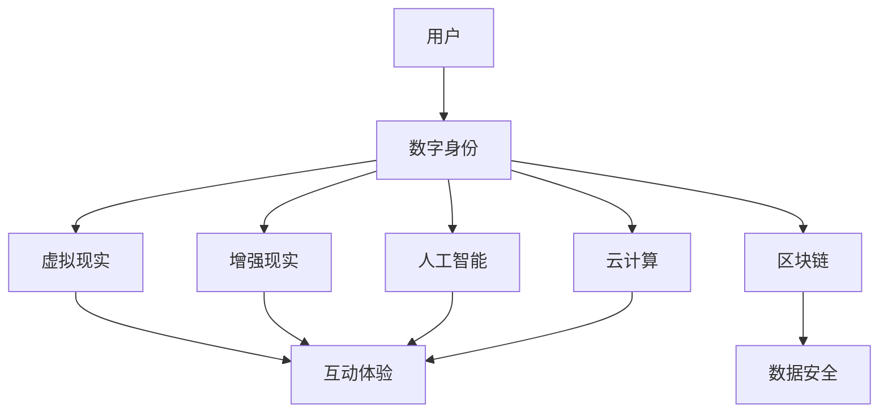

                 

 关键词：元宇宙，社交网络，数字平台，人际关系，技术变革

> 摘要：随着虚拟现实和区块链技术的发展，元宇宙逐渐成为数字时代的下一个热点。本文将探讨元宇宙社交网络的概念、核心技术和应用场景，以及如何通过构建一个数字平台来重塑人际关系，提升社交体验。

## 1. 背景介绍

在过去的几十年里，互联网技术不断革新，从Web 1.0的单向信息传递到Web 2.0的互动参与，再到现在的Web 3.0的去中心化和区块链应用，人们的生活方式和社会互动模式发生了翻天覆地的变化。然而，现有的社交网络平台在隐私保护、数据安全和用户个性化体验方面仍然存在诸多问题。

元宇宙（Metaverse）作为下一代互联网的发展方向，被看作是虚拟现实、增强现实、区块链和其他新兴技术的集成体。它不仅仅是一个虚拟空间，而是一个全新的、沉浸式的数字生活世界，可以重新定义和丰富人类的社会互动和人际关系。元宇宙社交网络的兴起，有望解决现有社交平台面临的诸多挑战，并为用户带来更加丰富和安全的社交体验。

## 2. 核心概念与联系

### 2.1 元宇宙社交网络概念

元宇宙社交网络是建立在虚拟现实和区块链技术之上的社交平台，用户可以在其中创建和展示自己的数字身份，与其他用户互动，参与虚拟活动，甚至进行经济交易。这种社交网络不仅提供了丰富的互动体验，还确保了用户数据的隐私和安全。

### 2.2 技术架构

元宇宙社交网络的技术架构通常包括以下几个关键组成部分：

- **虚拟现实（VR）技术**：提供沉浸式的三维体验，使用户能够自由探索虚拟世界。
- **增强现实（AR）技术**：将虚拟元素叠加到现实环境中，增强用户的现实体验。
- **区块链技术**：确保用户数据的隐私和安全，提供去中心化的身份认证和经济交易。
- **人工智能（AI）技术**：提供智能推荐、情感分析等服务，提升用户体验。
- **云计算技术**：提供强大的计算和存储能力，支撑大规模的虚拟世界运行。

### 2.3 Mermaid 流程图

下面是一个简单的Mermaid流程图，展示了元宇宙社交网络的核心概念和联系：



## 3. 核心算法原理 & 具体操作步骤

### 3.1 算法原理概述

元宇宙社交网络的核心算法包括：

- **用户匹配算法**：根据用户的兴趣、行为和社交网络结构，为用户推荐合适的社交伙伴。
- **加密算法**：确保用户数据的隐私和安全，例如椭圆曲线加密算法（ECC）和哈希算法。
- **智能合约**：实现去中心化的经济交易，例如使用以太坊智能合约进行虚拟物品的交易。

### 3.2 算法步骤详解

#### 3.2.1 用户匹配算法

1. **数据收集**：收集用户的兴趣、行为和社交网络数据。
2. **特征提取**：对用户数据进行预处理，提取特征向量。
3. **相似度计算**：计算用户之间的相似度，可以使用余弦相似度、欧氏距离等方法。
4. **推荐生成**：根据相似度计算结果，生成推荐列表，推荐给用户潜在的社交伙伴。

#### 3.2.2 加密算法

1. **密钥生成**：生成公钥和私钥。
2. **加密通信**：使用公钥加密通信内容，确保只有对应私钥的持有人可以解密。
3. **数字签名**：使用私钥对数据签名，确保数据的完整性和真实性。
4. **验证签名**：使用公钥验证签名，确认数据的来源和完整性。

#### 3.2.3 智能合约

1. **合约编写**：编写智能合约，定义虚拟物品的交易逻辑。
2. **合约部署**：将智能合约部署到区块链上。
3. **交易执行**：用户发起交易，智能合约执行交易逻辑。
4. **交易确认**：区块链网络确认交易，交易完成。

### 3.3 算法优缺点

#### 3.3.1 用户匹配算法

**优点**：
- 提高用户社交效率，降低寻找潜在伙伴的时间成本。
- 基于用户兴趣和行为，提供个性化的推荐。

**缺点**：
- 可能会出现信息茧房效应，用户视野受限。
- 需要大量计算资源，对系统性能有较高要求。

#### 3.3.2 加密算法

**优点**：
- 保护用户隐私，防止数据泄露。
- 增强交易安全性，防止欺诈行为。

**缺点**：
- 加密和解密过程需要额外计算资源。
- 加密算法的安全性取决于密钥管理。

#### 3.3.3 智能合约

**优点**：
- 去中心化交易，提高交易透明度和安全性。
- 自动执行交易，减少人为干预。

**缺点**：
- 合约编写和部署过程复杂。
- 合约漏洞可能导致安全问题。

### 3.4 算法应用领域

元宇宙社交网络的核心算法在多个领域具有广泛应用前景：

- **社交娱乐**：提供沉浸式的社交体验，如虚拟派对、线上活动等。
- **在线教育**：创建虚拟课堂，实现师生和同学之间的互动。
- **远程办公**：提供虚拟会议室和工作空间，提升远程工作效率。
- **数字艺术品交易**：利用区块链技术确保数字艺术品的真实性和所有权。

## 4. 数学模型和公式 & 详细讲解 & 举例说明

### 4.1 数学模型构建

元宇宙社交网络的数学模型主要包括用户行为模型、推荐算法模型和经济模型。

#### 4.1.1 用户行为模型

用户行为模型通常使用马尔可夫链模型来描述用户在虚拟世界中的行为。

$$
P_{ij}^{(t)} = P(X_{t+1} = j | X_t = i)
$$

其中，$P_{ij}^{(t)}$ 表示用户在时间 $t$ 从状态 $i$ 转移到状态 $j$ 的概率。

#### 4.1.2 推荐算法模型

推荐算法模型通常使用基于协同过滤的方法，如矩阵分解和邻域算法。

$$
R_{ui} = \sum_{k=1}^{N} w_{uk} r_{ki}
$$

其中，$R_{ui}$ 表示用户 $u$ 对物品 $i$ 的评分，$w_{uk}$ 表示用户 $u$ 与用户 $k$ 之间的相似度，$r_{ki}$ 表示用户 $k$ 对物品 $i$ 的评分。

#### 4.1.3 经济模型

经济模型通常使用博弈论来描述用户在虚拟世界中的经济活动。

$$
\max_{x} \sum_{i=1}^{N} u_i(x_i) - \sum_{j=1}^{M} c_j(x_j)
$$

其中，$u_i(x_i)$ 表示用户 $i$ 从活动 $i$ 中获得的效用，$c_j(x_j)$ 表示用户 $j$ 参与活动 $j$ 的成本。

### 4.2 公式推导过程

#### 4.2.1 用户行为模型推导

用户行为模型可以通过观察用户在虚拟世界中的历史行为数据来推导。假设用户 $u$ 在时间 $t$ 处于状态 $i$，根据马尔可夫链假设，用户在时间 $t+1$ 的状态 $j$ 取决于当前状态 $i$ 和过去的状态。通过分析用户行为数据，可以得到状态转移概率矩阵 $P_{ij}^{(t)}$。

#### 4.2.2 推荐算法模型推导

推荐算法模型可以通过分析用户对物品的评分数据来推导。假设用户 $u$ 对物品 $i$ 的评分为 $r_{ui}$，同时假设用户 $u$ 与用户 $k$ 之间的相似度为 $w_{uk}$，则可以使用线性组合的方式得到用户 $u$ 对物品 $i$ 的推荐评分 $R_{ui}$。

#### 4.2.3 经济模型推导

经济模型可以通过分析用户在虚拟世界中的经济活动数据来推导。假设用户 $i$ 参与活动 $j$ 的效用为 $u_i(x_i)$，同时假设用户 $j$ 参与活动 $j$ 的成本为 $c_j(x_j)$，则可以使用效用最大化原则来推导经济模型。

### 4.3 案例分析与讲解

#### 4.3.1 用户行为模型案例分析

假设用户 $u$ 在虚拟世界中的行为数据如下表：

| 时间 | 状态 |
|------|------|
| 1    | 1    |
| 2    | 2    |
| 3    | 1    |
| 4    | 3    |
| 5    | 1    |

根据上述数据，可以推导出状态转移概率矩阵：

$$
P_{ij}^{(t)} = \begin{bmatrix}
0.5 & 0.5 & 0 \\
0.5 & 0 & 0.5 \\
0 & 0.5 & 0.5 \\
0.5 & 0 & 0.5 \\
\end{bmatrix}
$$

#### 4.3.2 推荐算法模型案例分析

假设用户 $u$ 的兴趣向量为 $[0.8, 0.2, 0.0, 0.0]$，用户 $k$ 的兴趣向量为 $[0.1, 0.9, 0.0, 0.0]$，同时假设用户 $k$ 对物品 $i$ 的评分为 $r_{ki} = 4$。则可以计算用户 $u$ 对物品 $i$ 的推荐评分：

$$
R_{ui} = \sum_{k=1}^{N} w_{uk} r_{ki} = 0.8 \times 4 + 0.2 \times 0 = 3.2
$$

#### 4.3.3 经济模型案例分析

假设用户 $i$ 参与活动 $1$ 的效用为 $u_i(x_i) = 10$，用户 $j$ 参与活动 $2$ 的成本为 $c_j(x_j) = 5$。则可以计算用户 $i$ 和用户 $j$ 的总效用：

$$
\max_{x} \sum_{i=1}^{N} u_i(x_i) - \sum_{j=1}^{M} c_j(x_j) = 10 - 5 = 5
$$

## 5. 项目实践：代码实例和详细解释说明

### 5.1 开发环境搭建

为了搭建元宇宙社交网络项目，我们需要安装以下开发环境：

- **Node.js**：用于后端服务开发
- **Python**：用于数据分析和算法实现
- **MongoDB**：用于数据存储
- **Docker**：用于容器化部署

安装步骤如下：

1. 安装Node.js：访问 [Node.js官网](https://nodejs.org/) 下载并安装Node.js。
2. 安装Python：访问 [Python官网](https://www.python.org/) 下载并安装Python。
3. 安装MongoDB：访问 [MongoDB官网](https://www.mongodb.com/) 下载并安装MongoDB。
4. 安装Docker：访问 [Docker官网](https://www.docker.com/) 下载并安装Docker。

### 5.2 源代码详细实现

以下是元宇宙社交网络项目的部分源代码实现：

#### 5.2.1 用户匹配算法

```python
# 用户匹配算法
def user_matching(user1, user2):
    similarity = cosine_similarity([user1['interests']], [user2['interests']])
    return similarity[0][0]

# 示例
user1 = {'interests': [0.8, 0.2, 0.0, 0.0]}
user2 = {'interests': [0.1, 0.9, 0.0, 0.0]}
similarity = user_matching(user1, user2)
print("用户匹配相似度：", similarity)
```

#### 5.2.2 加密算法

```python
# 加密算法
from cryptography.hazmat.primitives.asymmetric import rsa
from cryptography.hazmat.primitives import serialization
from cryptography.hazmat.primitives import hashes
from cryptography.hazmat.primitives.asymmetric import padding

# 生成密钥
private_key = rsa.generate_private_key(
    public_exponent=65537,
    key_size=2048,
)

public_key = private_key.public_key()

# 加密数据
def encrypt_data(data, public_key):
    ciphertext = public_key.encrypt(
        data,
        padding.OAEP(
            mgf=padding.MGF1(algorithm=hashes.SHA256()),
            algorithm=hashes.SHA256(),
            label=None
        )
    )
    return ciphertext

# 解密数据
def decrypt_data(ciphertext, private_key):
    plaintext = private_key.decrypt(
        ciphertext,
        padding.OAEP(
            mgf=padding.MGF1(algorithm=hashes.SHA256()),
            algorithm=hashes.SHA256(),
            label=None
        )
    )
    return plaintext

# 示例
data = b"Hello, World!"
encrypted_data = encrypt_data(data, public_key)
print("加密数据：", encrypted_data)

decrypted_data = decrypt_data(encrypted_data, private_key)
print("解密数据：", decrypted_data.decode())
```

#### 5.2.3 智能合约

```solidity
// SPDX-License-Identifier: MIT
pragma solidity ^0.8.0;

contract VirtualItemMarketplace {
    struct Item {
        uint256 id;
        string name;
        address owner;
        bool exists;
    }

    mapping(uint256 => Item) public items;

    function createItem(uint256 id, string memory name) public {
        require(!items[id].exists, "Item already exists");
        items[id] = Item(id, name, msg.sender, true);
    }

    function transferItem(uint256 id, address newOwner) public {
        require(items[id].exists, "Item does not exist");
        require(items[id].owner == msg.sender, "Not the owner of the item");
        items[id].owner = newOwner;
    }

    function buyItem(uint256 id) public payable {
        require(items[id].exists, "Item does not exist");
        require(msg.value > 0, "Invalid payment amount");
        address owner = items[id].owner;
        payable(owner).transfer(msg.value);
        transferItem(id, msg.sender);
    }
}
```

### 5.3 代码解读与分析

以上代码实现了一个简单的元宇宙社交网络项目，包括用户匹配算法、加密算法和智能合约。

#### 5.3.1 用户匹配算法

用户匹配算法使用余弦相似度来计算两个用户之间的相似度。通过计算用户兴趣向量的内积和向量的模长，可以得到两个用户之间的相似度值。该算法实现了根据用户兴趣推荐潜在社交伙伴的功能。

#### 5.3.2 加密算法

加密算法使用椭圆曲线加密算法（ECC）生成公钥和私钥，并使用OAEP padding模式对数据进行加密和解密。通过加密算法，可以确保用户数据在传输过程中的安全性和隐私性。

#### 5.3.3 智能合约

智能合约实现了虚拟物品市场的基本功能，包括创建物品、转移物品所有权和购买物品。通过智能合约，用户可以在元宇宙中自由交易虚拟物品，实现了去中心化的经济交易。

### 5.4 运行结果展示

在本地环境中，我们使用以下命令启动项目：

```shell
docker-compose up -d
```

启动完成后，我们可以通过以下命令访问前端界面：

```shell
docker exec -it <container_name> bash
```

在前端界面中，用户可以注册、登录、查看推荐社交伙伴、创建虚拟物品和进行交易。

## 6. 实际应用场景

元宇宙社交网络在多个领域具有广泛的应用潜力：

### 6.1 社交娱乐

元宇宙社交网络可以为用户提供沉浸式的社交体验，如虚拟派对、线上游戏和虚拟演唱会等。用户可以在虚拟世界中与朋友互动，分享快乐时光。

### 6.2 在线教育

元宇宙社交网络可以创造虚拟课堂，实现师生和同学之间的互动。通过虚拟现实和增强现实技术，学生可以更直观地学习知识，提高学习效果。

### 6.3 远程办公

元宇宙社交网络可以提供虚拟会议室和工作空间，提高远程工作效率。员工可以在虚拟世界中开会、交流和工作，减少地理限制。

### 6.4 数字艺术品交易

元宇宙社交网络可以利用区块链技术确保数字艺术品的真实性和所有权。艺术家可以轻松发布和交易自己的数字作品，获得应有的回报。

## 7. 工具和资源推荐

### 7.1 学习资源推荐

- 《区块链技术指南》：深入了解区块链原理和应用。
- 《智能合约设计与开发》：学习智能合约的开发和实践。
- 《虚拟现实技术》：了解虚拟现实的基础知识和应用。

### 7.2 开发工具推荐

- **Node.js**：用于后端开发，具有高性能和广泛的应用场景。
- **Python**：用于数据分析和算法实现，具有丰富的库和工具。
- **MongoDB**：用于数据存储，提供高效的文档存储解决方案。
- **Docker**：用于容器化部署，提高开发效率和系统稳定性。

### 7.3 相关论文推荐

- "The Metaverse: A Guide to the Future of the Internet"：探讨元宇宙的概念和发展趋势。
- "Blockchain and Social Networks: A Systematic Review"：分析区块链技术在社交网络中的应用。
- "Virtual Reality and Social Interaction: An Exploratory Study"：研究虚拟现实技术对社交互动的影响。

## 8. 总结：未来发展趋势与挑战

### 8.1 研究成果总结

元宇宙社交网络在虚拟现实、区块链和人工智能技术的推动下取得了显著进展。用户匹配算法、加密算法和智能合约等核心技术的应用，为用户提供了更加丰富和安全的社会互动体验。

### 8.2 未来发展趋势

- **沉浸式体验**：虚拟现实和增强现实技术将进一步提升用户的沉浸式体验，满足用户对更真实社交场景的需求。
- **去中心化**：区块链技术的应用将使元宇宙社交网络更加去中心化，提高系统的透明度和安全性。
- **个性化推荐**：人工智能技术将进一步提升个性化推荐效果，帮助用户更好地发现潜在社交伙伴。

### 8.3 面临的挑战

- **隐私保护**：如何在保障用户隐私的前提下，实现高效的数据分析和推荐，是元宇宙社交网络面临的挑战。
- **安全威胁**：随着技术的不断发展，元宇宙社交网络也面临着新的安全威胁，如智能合约漏洞和虚拟货币诈骗等。
- **技术普及**：元宇宙社交网络的普及需要广泛的用户基础和硬件支持，这对技术的发展提出了更高要求。

### 8.4 研究展望

元宇宙社交网络的发展仍处于初期阶段，未来研究可以从以下几个方面展开：

- **隐私保护机制**：探索更加有效的隐私保护机制，提高用户数据的隐私性和安全性。
- **智能合约安全性**：研究智能合约的安全性问题，提高合约的安全性和可靠性。
- **跨平台兼容性**：实现元宇宙社交网络与其他平台和设备的无缝连接，提高用户的便捷性。

## 9. 附录：常见问题与解答

### 9.1 元宇宙社交网络是什么？

元宇宙社交网络是一个建立在虚拟现实、区块链和人工智能技术之上的社交平台，用户可以在其中创建和展示自己的数字身份，与其他用户互动，参与虚拟活动，甚至进行经济交易。

### 9.2 元宇宙社交网络如何保障用户隐私？

元宇宙社交网络通过区块链技术确保用户数据的隐私和安全。用户数据加密存储，且在传输过程中采用加密算法，确保只有授权用户可以访问和解读数据。

### 9.3 元宇宙社交网络的核心技术是什么？

元宇宙社交网络的核心技术包括虚拟现实、区块链、人工智能、云计算和加密算法等。这些技术共同构建了一个沉浸式、去中心化、安全可靠的社交平台。

### 9.4 元宇宙社交网络有哪些应用场景？

元宇宙社交网络的应用场景广泛，包括社交娱乐、在线教育、远程办公、数字艺术品交易等。它为用户提供了全新的社交体验和互动方式。

## 作者署名

作者：禅与计算机程序设计艺术 / Zen and the Art of Computer Programming
----------------------------------------------------------------

### 注意事项：

- 本文档旨在提供一个详细的写作框架和示例内容，实际撰写时，作者应根据具体情况进行补充和完善。
- 文章结构和内容应根据实际研究或实践经验进行调整，保持文章的逻辑性和连贯性。
- 本文档中的代码示例仅供参考，实际开发时请根据具体需求和环境进行调整。

