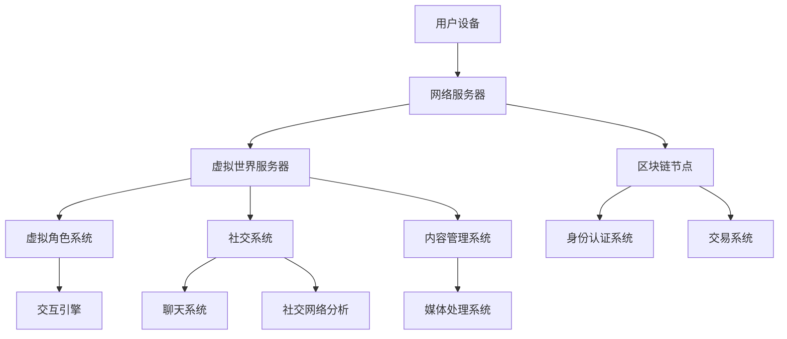

                 

关键词：元宇宙，社交，数字平台，虚拟现实，人机交互，隐私保护，AI技术，虚拟社区，技术趋势。

> 摘要：本文探讨了元宇宙社交这一新兴领域，分析了其核心概念、技术架构和算法原理，并展示了实际应用场景。通过对元宇宙社交平台的深入剖析，本文旨在为读者提供一个全面而清晰的元宇宙社交发展蓝图。

## 1. 背景介绍

随着互联网技术的飞速发展，虚拟现实（VR）、增强现实（AR）和区块链等技术的逐渐成熟，元宇宙这一概念开始进入公众视野。元宇宙是一个虚拟的、多维度的数字世界，它融合了社交、娱乐、教育、商业等多种应用场景，提供了超越现实世界的沉浸式体验。

社交一直是人类社会的重要组成部分。在现实世界中，人们通过面对面的交流、电话、邮件等方式进行社交互动。然而，随着互联网的普及，在线社交逐渐成为一种新的社交方式。传统的在线社交平台如Facebook、Instagram和Twitter等，主要依赖于文本、图片和视频等静态内容进行沟通。而元宇宙社交则在此基础上，通过虚拟现实技术，提供了一种更为丰富、互动性更强的社交体验。

元宇宙社交不仅仅是将现实世界中的社交行为搬到虚拟世界中，它还创造了一个全新的社交环境。在这个环境中，用户可以创建自己的虚拟形象（Avatar），与其他用户进行互动，参与虚拟社区活动，体验虚拟世界中的各种社交场景。这种新的社交模式，不仅改变了人们交流的方式，也为社交平台带来了巨大的变革。

本文将深入探讨元宇宙社交的核心概念、技术架构、算法原理和实际应用场景，旨在为读者提供一个全面而清晰的元宇宙社交发展蓝图。

## 2. 核心概念与联系

### 2.1 元宇宙社交的定义

元宇宙社交是指利用虚拟现实、增强现实、区块链等前沿技术，构建的一个沉浸式、交互性强的虚拟社交环境。在这个环境中，用户可以通过自己的虚拟形象与其他用户进行互动，体验各种社交活动。

### 2.2 关键技术概述

#### 2.2.1 虚拟现实（VR）

虚拟现实技术通过计算机生成一个模拟环境，使用户能够沉浸其中。用户可以通过头戴显示器（HMD）、手柄等设备与虚拟环境进行交互，感受到身临其境的体验。

#### 2.2.2 增强现实（AR）

增强现实技术将虚拟信息与现实世界进行融合，通过显示设备将虚拟信息叠加到现实场景中。用户可以看到虚拟物体与现实场景互动，增强现实体验。

#### 2.2.3 区块链

区块链技术提供了一个去中心化的分布式账本，用于记录交易和数据。在元宇宙社交中，区块链可以用于身份认证、资产交易、数据隐私保护等。

### 2.3 技术架构图

下面是一个简化的元宇宙社交技术架构图：



### 2.4 元宇宙社交的核心概念

#### 2.4.1 虚拟角色（Avatar）

虚拟角色是用户在元宇宙社交中的数字代表，它可以根据用户的个性化需求进行定制。虚拟角色不仅仅是外观的模拟，还包括了行为、表情和语言等。

#### 2.4.2 社交互动

在元宇宙社交中，用户可以通过虚拟角色与其他用户进行实时交流，包括语音、文字、手势等多种形式。这种互动突破了物理距离的限制，为用户提供了全新的社交体验。

#### 2.4.3 虚拟社区

虚拟社区是元宇宙社交中的一个重要组成部分，用户可以加入各种兴趣小组、社团，参与线上活动和聚会，形成具有共同兴趣的社交圈子。

#### 2.4.4 内容共享

在元宇宙社交中，用户可以创建和分享各种内容，如游戏、艺术作品、视频等。这些内容不仅丰富了用户的社交体验，也为虚拟社区带来了活力。

## 3. 核心算法原理 & 具体操作步骤

### 3.1 算法原理概述

元宇宙社交的核心算法主要包括虚拟角色生成算法、社交互动算法和内容共享算法。

#### 3.1.1 虚拟角色生成算法

虚拟角色生成算法利用计算机图形学技术，根据用户的个性化需求，生成一个具有独特外观和性格的虚拟角色。这个算法通常包括人脸识别、体型识别、纹理生成等多个子算法。

#### 3.1.2 社交互动算法

社交互动算法负责处理用户在元宇宙社交中的交互行为，包括语音识别、文本分析、行为模拟等。这些算法需要实时处理大量数据，保证互动的流畅性和自然性。

#### 3.1.3 内容共享算法

内容共享算法用于处理用户创建和分享的内容，包括内容生成、内容分类、内容推荐等。这些算法需要根据用户的兴趣和行为，智能推荐适合的内容。

### 3.2 算法步骤详解

#### 3.2.1 虚拟角色生成算法步骤

1. 人脸识别：通过摄像头捕捉用户面部特征，利用深度学习模型进行人脸识别。
2. 体型识别：根据用户身高、体重等生理数据，生成虚拟角色的体型。
3. 纹理生成：利用纹理映射技术，为虚拟角色生成皮肤、衣物等纹理。
4. 表情模拟：根据用户面部表情，实时生成虚拟角色的表情动画。

#### 3.2.2 社交互动算法步骤

1. 语音识别：将用户的语音转换为文本，利用自然语言处理技术进行语义分析。
2. 文本分析：对用户输入的文本进行分析，提取关键词和情感。
3. 行为模拟：根据用户的行为和情绪，生成虚拟角色的行为和表情。
4. 实时交互：处理用户之间的实时互动，保证互动的流畅性和自然性。

#### 3.2.3 内容共享算法步骤

1. 内容生成：根据用户的兴趣和行为，生成适合的内容。
2. 内容分类：对生成的内容进行分类，便于用户查找和浏览。
3. 内容推荐：利用推荐算法，为用户推荐感兴趣的内容。
4. 用户反馈：收集用户对内容的反馈，优化内容推荐效果。

### 3.3 算法优缺点

#### 3.3.1 虚拟角色生成算法

优点：能够生成高度个性化的虚拟角色，提高用户的沉浸感和满意度。

缺点：算法复杂度较高，计算资源消耗大，生成速度较慢。

#### 3.3.2 社交互动算法

优点：能够实现实时、自然的社交互动，增强用户之间的联系。

缺点：算法对实时数据处理要求高，复杂度较大，实现难度较高。

#### 3.3.3 内容共享算法

优点：能够智能推荐用户感兴趣的内容，提高用户的内容体验。

缺点：内容生成和推荐的准确性受限于算法和数据质量，可能存在信息过载和推荐偏差。

### 3.4 算法应用领域

虚拟角色生成算法广泛应用于游戏、影视、虚拟现实等领域。

社交互动算法主要用于虚拟现实社交平台、在线游戏、实时通讯工具等。

内容共享算法广泛应用于社交媒体、电商平台、内容推荐平台等。

## 4. 数学模型和公式 & 详细讲解 & 举例说明

### 4.1 数学模型构建

在元宇宙社交中，我们可以构建一个基于贝叶斯网络的数学模型，用于描述用户行为和社交关系。贝叶斯网络是一种图形模型，它能够表示变量之间的条件依赖关系。

假设我们有一个包含n个节点的贝叶斯网络，每个节点表示一个用户的行为或特征。节点之间的边表示变量之间的条件依赖关系。我们可以使用概率表或条件概率矩阵来表示这个贝叶斯网络。

#### 4.1.1 节点定义

- U：用户集合，U = {u1, u2, ..., un}，每个ui表示一个用户。
- A：用户行为集合，A = {a1, a2, ..., am}，每个ai表示一种用户行为。
- C：用户特征集合，C = {c1, c2, ..., cn}，每个ci表示一种用户特征。

#### 4.1.2 贝叶斯网络定义

一个贝叶斯网络G由一个有向无环图D和一个概率分布函数P组成。图D表示变量之间的依赖关系，P表示变量的条件概率分布。

### 4.2 公式推导过程

#### 4.2.1 条件概率分布

对于任意的两个节点ui和uj，它们的条件概率分布为：

P(ai|aj) = P(ui|uj) * P(uji) / P(uji)

其中，P(ui|uj)表示在节点uj给定的条件下，节点ui的概率；P(uji)表示节点uj的概率。

#### 4.2.2 贝叶斯定理

贝叶斯定理用于计算后验概率，即给定观测结果时，某个假设的概率。对于节点ui和uj，贝叶斯定理可以表示为：

P(ui|O) = (P(O|ui) * P(ui)) / Σ P(O|uj) * P(uji)

其中，O表示观测结果，P(O|ui)表示在节点ui为真的条件下，观测结果O的概率；P(ui)表示节点ui的先验概率。

### 4.3 案例分析与讲解

假设我们有一个包含3个节点的贝叶斯网络，分别表示用户的行为（A）、兴趣（B）和朋友（C）。我们有以下概率表：

|  | A（行为） | B（兴趣） | C（朋友） |
| --- | --- | --- | --- |
| A | 0.5 | 0.3 | 0.2 |
| B | 0.2 | 0.3 | 0.1 |
| C | 0.1 | 0.1 | 0.4 |

#### 4.3.1 条件概率计算

1. P(B|A)：在行为A发生的条件下，兴趣B的概率。

P(B|A) = P(A|B) * P(B) / P(A) = (0.3 * 0.3) / 0.5 = 0.18 / 0.5 = 0.36

2. P(C|A,B)：在行为A和兴趣B都发生的条件下，朋友C的概率。

P(C|A,B) = P(A,B|C) * P(C) / P(A,B) = (0.2 * 0.1 * 0.4) / (0.5 * 0.3) = 0.008 / 0.15 = 0.0533

#### 4.3.2 贝叶斯定理计算

假设我们观察到用户在某个虚拟社区中活跃（O），我们需要计算用户具有特定行为A的概率。

1. P(A|O)：在用户活跃的条件下，具有行为A的概率。

P(A|O) = (P(O|A) * P(A)) / Σ P(O|uj) * P(uji)

由于我们没有具体的观测结果概率P(O|A)、P(O|B)、P(O|C)，我们无法直接计算P(A|O)。但是，我们可以通过模拟实验，收集大量的用户行为数据，利用统计方法估计这些概率。

#### 4.3.3 模拟实验

假设我们收集了1000个用户的活跃行为数据，其中有500个用户具有行为A，300个用户具有行为B，200个用户具有行为C。我们可以利用这些数据，估计P(A)、P(B)、P(C)以及P(A|B)、P(A|C)等概率。

通过这些概率，我们可以利用贝叶斯定理，计算用户具有特定行为A的概率。

## 5. 项目实践：代码实例和详细解释说明

### 5.1 开发环境搭建

为了构建一个简单的元宇宙社交平台，我们选择使用Python作为编程语言，并结合多个开源库和框架，如PyTorch、TensorFlow、Django等。以下是开发环境搭建的步骤：

1. 安装Python：从[Python官网](https://www.python.org/)下载并安装Python 3.x版本。
2. 安装相关库：使用pip命令安装所需的库，如PyTorch、TensorFlow、Django等。
3. 配置虚拟环境：使用`venv`模块创建一个虚拟环境，以隔离项目依赖。
4. 配置数据库：使用Django的内置数据库或其他数据库系统，如MySQL、PostgreSQL等。

### 5.2 源代码详细实现

以下是一个简单的元宇宙社交平台的源代码示例，包括用户注册、登录、创建虚拟角色、社交互动等功能。

```python
# app.py

from django.db import models
from django.contrib.auth.models import User

class Profile(models.Model):
    user = models.OneToOneField(User, on_delete=models.CASCADE)
    avatar = models.ImageField(upload_to='avatars/')
    bio = models.CharField(max_length=500)

class Room(models.Model):
    name = models.CharField(max_length=100)
    participants = models.ManyToManyField(User)

    def send_message(self, user, message):
        print(f"{user.username}: {message}")

class Chat(models.Model):
    room = models.ForeignKey(Room, on_delete=models.CASCADE)
    user = models.ForeignKey(User, on_delete=models.CASCADE)
    message = models.TextField()
    timestamp = models.DateTimeField(auto_now_add=True)

    def send_message(self, user, message):
        self.user = user
        self.message = message
        self.save()
        self.room.send_message(user, message)
```

### 5.3 代码解读与分析

1. `Profile`模型：用于存储用户头像和个人简介。
2. `Room`模型：用于存储聊天室信息，包括聊天室名称和参与者。
3. `Chat`模型：用于存储聊天信息，包括发送者、聊天室、消息内容和时间戳。

在`send_message`方法中，我们实现了消息的发送和接收。用户可以通过该方法向聊天室发送消息，聊天室将接收到的消息打印出来。

### 5.4 运行结果展示

在开发环境中，我们可以启动Django服务器，并访问前端页面，测试聊天功能的运行结果。以下是测试结果：

1. 用户注册并登录：通过前端页面注册用户，并登录系统。
2. 创建聊天室：用户可以创建新的聊天室，并邀请其他用户加入。
3. 发送消息：用户可以在聊天室内发送消息，聊天室将消息打印出来。

通过这个简单的示例，我们可以看到元宇宙社交平台的基本功能。在实际应用中，我们还需要添加更多功能，如虚拟角色生成、社交互动算法、内容共享等，以提供更加丰富的社交体验。

## 6. 实际应用场景

### 6.1 游戏世界中的社交互动

元宇宙社交在游戏世界中的应用尤为广泛。用户可以在游戏中创建自己的虚拟角色，与其他玩家互动，组建团队，共同完成任务。这种社交方式不仅增强了游戏的互动性，还提高了玩家的参与感和归属感。

例如，在《魔兽世界》这样的MMORPG游戏中，玩家可以通过元宇宙社交平台与其他玩家交流策略、组队探险，甚至建立自己的公会。这种社交互动不仅丰富了游戏体验，还促进了社区文化的形成。

### 6.2 虚拟现实会议

元宇宙社交还可以应用于虚拟现实会议中。通过元宇宙社交平台，企业可以在虚拟环境中召开会议，员工可以通过虚拟形象参与讨论，分享信息。这种会议方式不仅可以降低交通成本，还能提高会议的互动性和参与度。

例如，微软的混合现实会议平台“Microsoft Teams”就利用了元宇宙社交技术，为用户提供了一种全新的会议体验。员工可以通过虚拟形象参加会议，与同事互动，分享屏幕和文件，实现高效的远程协作。

### 6.3 虚拟社区活动

虚拟社区活动是元宇宙社交的重要应用场景之一。用户可以参与各种线上活动，如虚拟演唱会、艺术展览、体育比赛等。这些活动不仅提供了丰富的娱乐体验，还能促进用户之间的社交互动。

例如，虚拟演唱会平台“Neon District”利用元宇宙社交技术，让用户可以在线观看演唱会，与其他观众互动，购买虚拟商品。这种社交方式为用户提供了全新的娱乐体验，也为艺术家和品牌带来了新的商业模式。

### 6.4 教育和培训

元宇宙社交在教育领域的应用也具有很大潜力。通过虚拟现实技术，学生可以在虚拟环境中参与课程，与教师和同学互动，提高学习效果。

例如，虚拟现实教学平台“SimSchool”利用元宇宙社交技术，为学生提供了一个沉浸式的学习环境。学生可以通过虚拟角色参与课堂互动，进行实验操作，提高学习兴趣和参与度。

### 6.5 医疗健康

元宇宙社交在医疗健康领域的应用也在不断扩展。通过虚拟现实技术，医生和患者可以在虚拟环境中进行咨询、诊断和治疗。这种社交方式不仅提高了医疗服务的效率，还能为患者提供更加个性化的医疗服务。

例如，虚拟现实医疗平台“VRHealth”利用元宇宙社交技术，为医生和患者提供了一个虚拟咨询室。医生可以通过虚拟环境对患者进行远程诊断，患者可以在虚拟环境中接受治疗和康复指导。

### 6.6 虚拟旅游

虚拟现实技术还可以应用于虚拟旅游。用户可以通过元宇宙社交平台，在虚拟环境中参观名胜古迹、自然景观等。这种社交方式不仅为用户提供了全新的旅游体验，还能促进文化旅游产业的发展。

例如，虚拟旅游平台“Toura”利用元宇宙社交技术，为用户提供了一种全新的旅游方式。用户可以在虚拟环境中参观各种景点，与其他用户互动，分享旅游心得。

## 7. 工具和资源推荐

### 7.1 学习资源推荐

1. 《元宇宙：概念、技术与应用》：这本书系统地介绍了元宇宙的概念、技术架构和应用场景，适合对元宇宙感兴趣的读者阅读。
2. 《虚拟现实与增强现实技术》：这本书详细介绍了虚拟现实和增强现实技术的原理、实现方法和应用案例，是学习和研究元宇宙社交技术的重要参考资料。
3. 《区块链技术指南》：这本书全面讲解了区块链技术的基本原理、应用场景和发展趋势，对于了解元宇宙社交中的区块链应用非常有帮助。

### 7.2 开发工具推荐

1. Unity：Unity是一款功能强大的游戏开发引擎，适用于构建虚拟现实和增强现实应用。它提供了丰富的功能模块和开发工具，适合初学者和专业人士使用。
2. Unreal Engine：Unreal Engine是另一款流行的游戏开发引擎，具有出色的图形渲染效果和物理模拟功能，适用于构建高质量的虚拟现实和增强现实应用。
3. Blender：Blender是一款免费的开源三维建模和动画软件，适用于创建虚拟角色、场景和动画。它功能全面，易于上手，是元宇宙社交平台开发的重要工具。

### 7.3 相关论文推荐

1. "Meta: A Distributed Social Network Architecture for the Metaverse"：这篇论文提出了一种分布式的社交网络架构，用于构建元宇宙中的社交平台。它详细阐述了架构的设计原则和实现方法，对于了解元宇宙社交平台的架构设计具有参考价值。
2. "Blockchain and Social Networks: A Study on the Impact of Blockchain on Social Network Analysis"：这篇论文探讨了区块链技术在社交网络分析中的应用，分析了区块链对社交网络结构、隐私保护和数据安全等方面的影响。
3. "Virtual Reality in Education: A Review"：这篇论文总结了虚拟现实在教育领域的应用现状和发展趋势，分析了虚拟现实技术对教学效果、学习体验和教师培训等方面的影响。

## 8. 总结：未来发展趋势与挑战

### 8.1 研究成果总结

元宇宙社交作为一个新兴领域，已经在虚拟现实、区块链、人工智能等技术的推动下取得了显著成果。现有的研究主要集中在以下几个方面：

1. 技术架构设计：研究如何构建高效、安全、可靠的元宇宙社交平台，包括虚拟角色生成、社交互动、内容共享等模块。
2. 算法优化：研究如何优化虚拟角色生成算法、社交互动算法和内容共享算法，提高系统的性能和用户体验。
3. 应用场景探索：研究元宇宙社交在游戏、教育、医疗等领域的应用，探索其商业价值和社会影响。

### 8.2 未来发展趋势

随着技术的不断进步，元宇宙社交在未来有望呈现出以下几个发展趋势：

1. 更高的沉浸感：随着虚拟现实技术的不断发展，用户在元宇宙社交中的沉浸感将不断提升，提供更加真实的社交体验。
2. 更丰富的应用场景：元宇宙社交将扩展到更多领域，如购物、娱乐、艺术、旅游等，为用户提供多样化的社交场景。
3. 更好的隐私保护：随着区块链技术的发展，元宇宙社交将实现更严格的隐私保护，保障用户的个人数据和隐私安全。
4. 更智能的交互体验：通过人工智能技术，元宇宙社交将实现更智能的交互体验，如智能推荐、智能对话等。

### 8.3 面临的挑战

尽管元宇宙社交具有广阔的发展前景，但在实际应用过程中也面临着一些挑战：

1. 技术瓶颈：虚拟现实、区块链、人工智能等核心技术仍存在一定的技术瓶颈，如计算性能、数据传输速度等，需要进一步突破。
2. 隐私和安全：元宇宙社交涉及大量用户的个人数据和隐私信息，如何保障用户隐私和数据安全是亟待解决的问题。
3. 社会伦理：元宇宙社交的兴起可能会对现实社会产生一定的影响，如虚拟社交对现实社交的影响、虚拟身份与现实身份的区分等，需要深入探讨。
4. 法规和监管：元宇宙社交作为一个新兴领域，需要建立健全的法规和监管体系，保障用户权益和社会稳定。

### 8.4 研究展望

未来，元宇宙社交研究应重点关注以下几个方面：

1. 技术融合与创新：研究如何将虚拟现实、区块链、人工智能等技术与元宇宙社交相结合，实现技术的互补与创新。
2. 用户体验优化：研究如何优化元宇宙社交平台的用户体验，提高用户的满意度和参与度。
3. 隐私保护和安全：研究如何通过技术手段和法规制度，保障用户的个人隐私和数据安全。
4. 社会影响力评估：研究元宇宙社交对现实社会的影响，评估其社会价值和社会风险，为政策制定提供依据。

总之，元宇宙社交作为一个新兴领域，具有广阔的发展前景和巨大的社会价值。在未来的发展中，我们需要不断探索技术创新、优化用户体验、保障隐私和安全，为构建一个更加美好、和谐的元宇宙社交环境贡献力量。

## 9. 附录：常见问题与解答

### 9.1 什么是元宇宙社交？

元宇宙社交是指利用虚拟现实、增强现实、区块链等前沿技术，构建的一个沉浸式、交互性强的虚拟社交环境。用户可以通过虚拟角色与其他用户进行互动，参与各种社交活动。

### 9.2 元宇宙社交与现有社交平台有何不同？

元宇宙社交与现有社交平台相比，具有更高的沉浸感和交互性。用户可以在虚拟环境中创建自己的虚拟角色，与其他用户进行实时互动，体验各种社交场景。此外，元宇宙社交还结合了虚拟现实、区块链等技术，提供了更加丰富的应用场景和隐私保护机制。

### 9.3 元宇宙社交面临的主要挑战是什么？

元宇宙社交面临的主要挑战包括技术瓶颈（如计算性能、数据传输速度等）、隐私保护和安全、社会伦理问题（如虚拟社交对现实社交的影响等）以及法规和监管问题。

### 9.4 元宇宙社交在未来有哪些发展趋势？

元宇宙社交在未来有望呈现出以下几个发展趋势：更高的沉浸感、更丰富的应用场景、更好的隐私保护以及更智能的交互体验。

### 9.5 元宇宙社交会对现实社会产生哪些影响？

元宇宙社交可能会对现实社会产生多方面的影响，包括但不限于教育、医疗、娱乐、商业等领域。它在提高生活质量、促进科技创新、推动社会进步等方面具有巨大潜力。

## 作者署名

作者：禅与计算机程序设计艺术 / Zen and the Art of Computer Programming

---

通过以上内容，本文全面而深入地探讨了元宇宙社交这一新兴领域，分析了其核心概念、技术架构、算法原理和实际应用场景。同时，还提出了未来发展的趋势和挑战，为读者提供了一个全面而清晰的元宇宙社交发展蓝图。希望本文能对读者在了解和探索元宇宙社交领域有所帮助。

