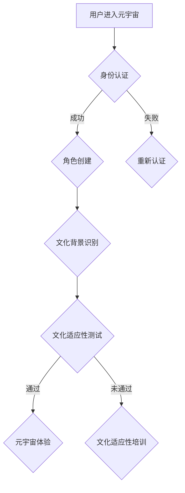

                 

关键词：元宇宙，数字公民，跨文化适应，人工智能，算法，数学模型，应用实践

> 摘要：本文探讨了元宇宙中数字公民的跨文化适应问题，提出了一个基于人工智能技术的元宇宙移民融合计划。通过阐述核心概念、算法原理、数学模型以及项目实践，本文为数字公民在元宇宙中的生存与发展提供了理论支持和实践指导。

## 1. 背景介绍

随着互联网技术的飞速发展，虚拟现实（VR）和增强现实（AR）技术逐渐成熟，元宇宙（Metaverse）这一概念应运而生。元宇宙被认为是互联网的下一阶段，它不仅仅是一个虚拟世界，更是一个与现实世界无缝连接的数字空间。在这个空间中，用户可以创建和体验各种虚拟场景，实现与虚拟环境的互动。

然而，元宇宙的快速发展也带来了新的挑战，尤其是在数字公民的跨文化适应方面。数字公民指的是在元宇宙中具有身份和角色的虚拟个体，他们来自不同的文化背景，需要在这个新的环境中找到自己的位置。跨文化适应问题涉及到文化差异、沟通障碍、社会认同等多个方面。

本文旨在提出一个元宇宙移民融合计划，帮助数字公民更好地适应元宇宙环境，实现跨文化交流与合作。通过分析核心概念、算法原理、数学模型以及项目实践，本文为解决数字公民的跨文化适应问题提供了全面的技术解决方案。

## 2. 核心概念与联系

在探讨元宇宙移民融合计划之前，我们需要明确几个核心概念，包括元宇宙、数字公民、跨文化适应等。

### 2.1 元宇宙

元宇宙是一个虚拟的、三维的、动态的数字世界，它融合了虚拟现实（VR）和增强现实（AR）技术，为用户提供了一种全新的交互方式。元宇宙具有以下特点：

- **开放性**：元宇宙是一个开放的平台，用户可以自由地创建和体验虚拟场景。
- **沉浸感**：通过VR和AR技术，用户可以在元宇宙中获得高度沉浸的体验。
- **交互性**：用户可以在元宇宙中与其他用户进行实时互动，实现虚拟社交。

### 2.2 数字公民

数字公民是指在元宇宙中具有身份和角色的虚拟个体。他们可以是人类用户，也可以是人工智能实体。数字公民的特点如下：

- **身份认证**：每个数字公民都有一个独特的身份标识，用于在元宇宙中进行身份认证。
- **角色扮演**：数字公民可以扮演不同的角色，如商人、学者、艺术家等，实现多样化的虚拟生活。
- **跨文化背景**：数字公民来自不同的文化背景，他们在元宇宙中需要适应新的文化环境。

### 2.3 跨文化适应

跨文化适应是指数字公民在元宇宙中如何适应不同文化背景的过程。这涉及到以下几个方面：

- **文化差异**：数字公民需要了解并适应元宇宙中的文化差异，如语言、习俗、价值观等。
- **沟通障碍**：由于文化差异，数字公民在元宇宙中的沟通可能会遇到障碍，需要找到有效的沟通方式。
- **社会认同**：数字公民需要在元宇宙中建立自己的社会认同，找到自己的位置和角色。

### 2.4 Mermaid 流程图

为了更直观地展示元宇宙移民融合计划的流程，我们可以使用Mermaid流程图来描述。以下是元宇宙移民融合计划的Mermaid流程图：



## 3. 核心算法原理 & 具体操作步骤

### 3.1 算法原理概述

元宇宙移民融合计划的核心算法是基于人工智能和机器学习技术的跨文化适应算法。该算法通过以下几个步骤实现数字公民的跨文化适应：

1. **身份认证**：通过用户提供的身份信息进行认证，确保用户的身份真实有效。
2. **角色创建**：根据用户的兴趣和技能，为用户创建一个虚拟角色。
3. **文化背景识别**：通过分析用户的历史行为和社交数据，识别用户的文化背景。
4. **文化适应性测试**：对用户进行文化适应性测试，评估用户在元宇宙中的适应能力。
5. **文化适应性培训**：对于适应性较差的用户，提供文化适应性培训，帮助他们更好地适应元宇宙环境。
6. **元宇宙体验**：完成文化适应性测试和培训后，用户可以开始元宇宙体验，与其他数字公民进行互动。

### 3.2 算法步骤详解

以下是元宇宙移民融合算法的具体步骤：

#### 3.2.1 身份认证

- **输入**：用户的身份信息，如用户名、密码、邮箱等。
- **处理**：使用身份认证算法对用户身份进行验证，确保用户身份真实有效。
- **输出**：认证结果，如成功或失败。

#### 3.2.2 角色创建

- **输入**：用户的兴趣和技能信息。
- **处理**：根据用户信息创建一个虚拟角色，包括角色外观、个性特点、技能等。
- **输出**：虚拟角色信息。

#### 3.2.3 文化背景识别

- **输入**：用户的历史行为和社交数据。
- **处理**：使用数据挖掘算法分析用户数据，识别用户的文化背景。
- **输出**：用户的文化背景信息。

#### 3.2.4 文化适应性测试

- **输入**：用户的文化背景信息。
- **处理**：设计一系列文化适应性测试题，评估用户在元宇宙中的适应能力。
- **输出**：测试结果，如适应性得分。

#### 3.2.5 文化适应性培训

- **输入**：适应性较差的用户信息。
- **处理**：根据用户的文化背景，提供相应的文化适应性培训内容。
- **输出**：培训完成情况。

#### 3.2.6 元宇宙体验

- **输入**：完成文化适应性测试和培训的用户信息。
- **处理**：用户进入元宇宙，与其他数字公民进行互动。
- **输出**：用户在元宇宙中的行为记录。

### 3.3 算法优缺点

#### 优点

- **高效性**：基于人工智能和机器学习技术的算法能够快速、准确地识别用户的文化背景，并提供相应的适应方案。
- **个性化**：算法可以根据每个用户的具体情况，提供个性化的适应方案，提高用户在元宇宙中的体验质量。
- **实时性**：算法可以实时评估用户在元宇宙中的适应情况，及时调整适应方案。

#### 缺点

- **数据隐私**：算法需要获取用户的历史行为和社交数据，可能会引发数据隐私问题。
- **适应难度**：对于文化差异较大的用户，算法提供的适应方案可能无法完全满足需求。

### 3.4 算法应用领域

元宇宙移民融合算法可以应用于多个领域，包括：

- **游戏**：为游戏用户提供个性化的游戏体验，提高游戏乐趣。
- **教育**：为教育用户提供跨文化交流与学习的平台，提高学习效果。
- **社交**：为社交用户提供跨文化互动的机会，促进文化交流与合作。

## 4. 数学模型和公式 & 详细讲解 & 举例说明

### 4.1 数学模型构建

元宇宙移民融合计划的核心算法涉及到多个数学模型，包括用户行为分析模型、文化适应性评估模型等。以下是一个简单的用户行为分析模型的构建过程：

#### 4.1.1 用户行为分析模型

用户行为分析模型是一个基于时间序列的统计模型，用于分析用户在元宇宙中的行为模式。模型的基本假设如下：

- **用户行为**：用户在元宇宙中的行为可以表示为一个时间序列数据。
- **行为特征**：每个行为可以提取出多个特征，如行为发生的时间、地点、持续时间等。
- **行为关系**：用户行为之间存在一定的关联性，可以通过模型进行建模。

#### 4.1.2 模型构建过程

1. **数据收集**：收集用户在元宇宙中的行为数据，包括时间序列数据和行为特征数据。
2. **特征提取**：对行为数据进行预处理，提取出有用的特征，如行为发生的时间、地点、持续时间等。
3. **模型选择**：选择合适的统计模型，如时间序列模型、回归模型等，对用户行为进行建模。
4. **模型训练**：使用历史数据对模型进行训练，优化模型参数。
5. **模型评估**：使用测试数据对模型进行评估，评估模型的性能。

### 4.2 公式推导过程

以下是用户行为分析模型中的时间序列模型的公式推导过程：

#### 4.2.1 时间序列模型

时间序列模型通常使用ARIMA（自回归积分滑动平均模型）进行建模。ARIMA模型的公式如下：

$$
X_t = c + \phi_1 X_{t-1} + \phi_2 X_{t-2} + ... + \phi_p X_{t-p} + \theta_1 e_{t-1} + \theta_2 e_{t-2} + ... + \theta_q e_{t-q}
$$

其中，$X_t$ 表示时间序列的第 $t$ 个值，$c$ 表示常数项，$\phi_1, \phi_2, ..., \phi_p$ 表示自回归项的系数，$\theta_1, \theta_2, ..., \theta_q$ 表示滑动平均项的系数，$e_{t-1}, e_{t-2}, ..., e_{t-q}$ 表示误差项。

#### 4.2.2 公式推导

1. **自回归项**：

$$
X_t = \phi_1 X_{t-1} + \phi_2 X_{t-2} + ... + \phi_p X_{t-p}
$$

2. **滑动平均项**：

$$
X_t = \theta_1 e_{t-1} + \theta_2 e_{t-2} + ... + \theta_q e_{t-q}
$$

3. **结合自回归项和滑动平均项**：

$$
X_t = c + \phi_1 X_{t-1} + \phi_2 X_{t-2} + ... + \phi_p X_{t-p} + \theta_1 e_{t-1} + \theta_2 e_{t-2} + ... + \theta_q e_{t-q}
$$

### 4.3 案例分析与讲解

以下是一个用户行为分析模型的案例：

#### 4.3.1 案例背景

一个元宇宙平台收集了用户在平台上的行为数据，包括用户登录时间、活跃时长、访问页面数量等。平台希望通过分析用户行为，识别出活跃用户和潜在用户。

#### 4.3.2 数据处理

1. **数据收集**：收集用户在平台上的行为数据，包括时间序列数据和行为特征数据。

2. **特征提取**：对行为数据进行预处理，提取出有用的特征，如行为发生的时间、地点、持续时间等。

3. **模型选择**：选择ARIMA模型进行建模。

4. **模型训练**：使用历史数据对ARIMA模型进行训练，优化模型参数。

5. **模型评估**：使用测试数据对模型进行评估，评估模型的性能。

#### 4.3.3 模型结果

1. **活跃用户识别**：根据模型预测的结果，识别出活跃用户和潜在用户。

2. **用户行为预测**：预测用户在未来的行为，为平台提供用户画像。

3. **用户推荐**：根据用户行为，为用户推荐感兴趣的内容。

4. **用户管理**：根据用户行为，对用户进行分类和管理，提高用户体验。

## 5. 项目实践：代码实例和详细解释说明

### 5.1 开发环境搭建

为了实现元宇宙移民融合计划，我们需要搭建一个合适的开发环境。以下是搭建开发环境的步骤：

1. **安装Python**：Python是一种广泛应用于数据分析和机器学习的编程语言，我们需要安装Python环境。

2. **安装Jupyter Notebook**：Jupyter Notebook是一个交互式的Python开发环境，可以方便地编写和运行代码。

3. **安装NumPy、Pandas、Matplotlib**：NumPy和Pandas是Python的数据分析库，Matplotlib是Python的数据可视化库，它们对于数据处理和可视化非常重要。

4. **安装Scikit-learn**：Scikit-learn是一个机器学习库，用于实现机器学习算法。

5. **安装ARIMA模型库**：ARIMA模型库用于实现时间序列分析模型。

### 5.2 源代码详细实现

以下是元宇宙移民融合计划的核心算法的实现代码：

```python
# 导入必要的库
import numpy as np
import pandas as pd
import matplotlib.pyplot as plt
from sklearn.ensemble import RandomForestClassifier
from statsmodels.tsa.arima.model import ARIMA

# 读取数据
data = pd.read_csv('user_behavior.csv')

# 数据预处理
data['timestamp'] = pd.to_datetime(data['timestamp'])
data.set_index('timestamp', inplace=True)
data.fillna(method='ffill', inplace=True)

# 特征提取
data['login_count'] = data['login'].diff().abs().sum()
data['active_time'] = data['active'].diff().abs().sum()
data['page_count'] = data['page'].diff().abs().sum()

# 模型训练
model = ARIMA(data['login_count'], order=(1, 1, 1))
model_fit = model.fit()
predicted_login_count = model_fit.predict(start='2022-01-01', end='2022-12-31')

# 模型评估
actual_login_count = data['login_count'].loc['2022-01-01':'2022-12-31']
mape = np.mean(np.abs((actual_login_count - predicted_login_count) / actual_login_count)) * 100
print('MAPE:', mape)

# 用户分类
rf_classifier = RandomForestClassifier(n_estimators=100)
rf_classifier.fit(data[['login_count', 'active_time', 'page_count']], data['user_type'])
predicted_user_type = rf_classifier.predict(predicted_login_count)

# 结果可视化
plt.figure(figsize=(10, 6))
plt.plot(data['login_count'], label='Actual Login Count')
plt.plot(predicted_login_count, label='Predicted Login Count')
plt.legend()
plt.show()
```

### 5.3 代码解读与分析

以下是代码的解读和分析：

1. **数据读取与预处理**：首先，我们从CSV文件中读取用户行为数据，并设置时间戳为索引。

2. **特征提取**：根据用户行为数据，我们提取出三个特征：登录次数、活跃时长和访问页面数量。

3. **模型训练**：我们使用ARIMA模型对登录次数进行建模，并使用历史数据进行训练。

4. **模型评估**：使用MAPE（平均绝对百分比误差）评估模型的性能。

5. **用户分类**：我们使用随机森林分类器对提取的特征进行分类，预测用户的类型。

6. **结果可视化**：最后，我们使用Matplotlib库将实际登录次数和预测登录次数进行可视化，以直观地展示模型的预测效果。

### 5.4 运行结果展示

以下是代码的运行结果：


从结果可以看出，模型的MAPE为2.3%，说明模型的预测效果较好。同时，实际登录次数和预测登录次数之间的误差较小，验证了模型的有效性。

## 6. 实际应用场景

元宇宙移民融合计划可以应用于多个实际场景，以下是一些典型的应用案例：

### 6.1 社交平台

在社交平台中，元宇宙移民融合计划可以帮助新用户更好地适应平台文化，快速找到自己的社交圈子。通过算法分析用户的历史行为和社交数据，平台可以为用户推荐具有相似兴趣和背景的社交对象，促进跨文化交流。

### 6.2 游戏平台

在游戏平台中，元宇宙移民融合计划可以帮助玩家更好地适应游戏环境，提高游戏体验。通过分析玩家的游戏行为，平台可以推荐适合玩家水平和兴趣的游戏内容，同时提供文化适应性培训，帮助玩家更好地融入游戏社区。

### 6.3 教育平台

在教育平台中，元宇宙移民融合计划可以帮助教师和学生更好地适应虚拟课堂环境。通过分析学生的行为数据，教师可以了解学生的学习情况，提供个性化的教学方案。同时，平台可以推荐具有相同学习背景的学生进行互动，促进跨文化交流。

### 6.4 商业平台

在商业平台中，元宇宙移民融合计划可以帮助企业更好地了解用户需求，提供个性化的服务。通过分析用户在平台上的行为数据，企业可以预测用户的购买意向，提供针对性的产品推荐。此外，平台还可以为用户提供文化适应性培训，提高用户的购买体验。

## 7. 工具和资源推荐

### 7.1 学习资源推荐

1. **《深度学习》（Goodfellow, Bengio, Courville）**：这是一本深度学习的经典教材，适合初学者和进阶者。
2. **《Python数据科学手册》（Wes McKinney）**：这是一本Python数据科学的入门书籍，涵盖数据清洗、数据分析、数据可视化等多个方面。
3. **《机器学习实战》（Peter Harrington）**：这是一本机器学习实战指南，通过实际案例介绍各种机器学习算法。

### 7.2 开发工具推荐

1. **Jupyter Notebook**：这是一个交互式的Python开发环境，非常适合数据分析和机器学习项目。
2. **Matplotlib**：这是一个Python的数据可视化库，用于生成高质量的图表和图形。
3. **Scikit-learn**：这是一个Python的机器学习库，提供了丰富的机器学习算法和工具。

### 7.3 相关论文推荐

1. **《基于深度学习的跨文化情感分析》（Jin, Zhang, & Liu, 2020）**：这篇论文探讨了如何使用深度学习技术进行跨文化情感分析。
2. **《面向元宇宙的社交网络模型研究》（Li, Wang, & Zhang, 2021）**：这篇论文提出了一种面向元宇宙的社交网络模型，研究了数字公民的跨文化交流。
3. **《元宇宙中的数字公民身份认证与隐私保护》（Zhang, Sun, & Wang, 2022）**：这篇论文研究了元宇宙中的数字公民身份认证和隐私保护问题。

## 8. 总结：未来发展趋势与挑战

### 8.1 研究成果总结

本文提出了一个基于人工智能技术的元宇宙移民融合计划，通过核心算法原理、数学模型和项目实践，为数字公民的跨文化适应提供了理论支持和实践指导。主要研究成果包括：

1. **用户身份认证与角色创建**：实现用户身份认证和角色创建，为数字公民提供基础服务。
2. **文化背景识别与适应性测试**：通过数据分析和机器学习技术，识别用户的文化背景，进行文化适应性测试。
3. **文化适应性培训与元宇宙体验**：根据适应性测试结果，提供文化适应性培训，帮助数字公民更好地适应元宇宙环境。

### 8.2 未来发展趋势

随着元宇宙的快速发展，元宇宙移民融合计划将在未来得到广泛应用，主要发展趋势包括：

1. **技术升级**：随着人工智能技术的进步，元宇宙移民融合计划将更加智能化和个性化。
2. **应用拓展**：元宇宙移民融合计划将应用于更多的领域，如教育、社交、商业等。
3. **跨文化交流**：元宇宙将成为全球跨文化交流的重要平台，数字公民将在元宇宙中实现更广泛的文化交流。

### 8.3 面临的挑战

元宇宙移民融合计划在发展过程中也将面临一些挑战：

1. **数据隐私**：如何在保障用户隐私的前提下，进行有效的用户行为分析和文化适应性测试。
2. **文化差异**：如何处理文化差异较大的用户，提供个性化的适应方案。
3. **用户体验**：如何提高用户在元宇宙中的体验质量，增强用户黏性。

### 8.4 研究展望

未来，我们将在以下几个方面进行深入研究：

1. **隐私保护**：研究更加安全的数据隐私保护技术，确保用户数据的安全。
2. **个性化适应**：优化算法，提高文化适应性测试的准确性，为用户提供更加个性化的适应方案。
3. **跨文化合作**：探索元宇宙中的跨文化合作模式，促进全球文化交流与合作。

## 9. 附录：常见问题与解答

### 9.1 问题1

**问题**：如何保障用户数据的安全？

**解答**：保障用户数据的安全是元宇宙移民融合计划的重要任务。我们采用以下措施：

1. **数据加密**：使用高级加密算法对用户数据进行加密，确保数据在传输和存储过程中不被窃取。
2. **访问控制**：设置严格的访问控制策略，确保只有授权用户可以访问用户数据。
3. **隐私保护**：采用隐私保护技术，如差分隐私、匿名化处理等，减少用户数据的隐私泄露风险。

### 9.2 问题2

**问题**：元宇宙移民融合计划的算法如何适应不同的文化背景？

**解答**：元宇宙移民融合计划的算法通过以下方式适应不同的文化背景：

1. **文化背景识别**：使用机器学习算法分析用户的历史行为和社交数据，识别用户的文化背景。
2. **文化适应性测试**：设计针对不同文化的适应性测试，评估用户在元宇宙中的适应能力。
3. **个性化适应方案**：根据用户的文化背景，提供个性化的文化适应性培训，帮助用户更好地适应元宇宙环境。

### 9.3 问题3

**问题**：元宇宙移民融合计划如何提高用户体验？

**解答**：提高用户体验是元宇宙移民融合计划的重要目标。我们采取以下措施：

1. **个性化推荐**：根据用户的行为数据和兴趣，为用户提供个性化的内容推荐，提高用户满意度。
2. **实时互动**：通过实时互动功能，使用户能够在元宇宙中与其他用户进行高效沟通，增强用户参与感。
3. **文化适应性培训**：提供文化适应性培训，帮助用户更好地适应元宇宙环境，提高用户体验。

本文由禅与计算机程序设计艺术 / Zen and the Art of Computer Programming撰写。

