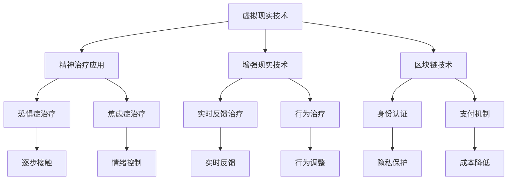

                 

在当今快速发展的科技时代，虚拟世界和元宇宙的概念已经不再是遥不可及的梦想。随着虚拟现实（VR）、增强现实（AR）和区块链技术的发展，人们可以在虚拟环境中创建和体验全新的世界，这些世界不仅提供了娱乐和社交的场所，还具备了治疗精神疾病、减轻压力和促进心理健康的功能。本文将探讨元宇宙中精神治疗技术的核心概念、技术原理、应用实例以及未来发展趋势。

## 关键词

- 元宇宙
- 精神治疗
- 虚拟现实
- 增强现实
- 区块链
- 心理健康

## 摘要

随着虚拟世界技术的发展，元宇宙逐渐成为人们精神治疗的新平台。本文介绍了元宇宙精神治疗的基本概念，包括其与虚拟现实、增强现实和区块链技术的结合。通过分析核心算法原理、数学模型以及实际应用场景，本文探讨了元宇宙在精神治疗领域的应用潜力。同时，文章还展望了未来元宇宙精神治疗技术的发展趋势和面临的挑战。

## 1. 背景介绍

### 1.1 元宇宙的发展

元宇宙（Metaverse）是一个虚拟的三维空间，通过互联网连接各种设备和平台，使用户能够在其中进行互动和体验。元宇宙的概念最早可以追溯到1992年，马克·佩里奇（Mark Peacock）在其科幻小说《网络帝国》（CyberEmpire）中首次提出。然而，随着技术的不断进步，尤其是虚拟现实（VR）、增强现实（AR）和区块链技术的应用，元宇宙逐渐从科幻走向现实。

### 1.2 虚拟现实与增强现实

虚拟现实（VR）和增强现实（AR）是构建元宇宙的关键技术。VR通过头戴式显示器和其他传感器，将用户完全沉浸在一个计算机生成的虚拟环境中。而AR则通过增强用户对现实世界的感知，将数字信息叠加在现实世界中。VR和AR技术为用户提供了丰富的交互体验，使得虚拟世界更加真实和直观。

### 1.3 区块链与元宇宙

区块链技术为元宇宙提供了去中心化的信任机制和安全的身份认证。通过区块链，用户可以在元宇宙中拥有唯一的身份，并安全地存储和交易虚拟资产。这种去中心化的架构使得元宇宙中的交易更加透明和公正，为用户提供了一个更加自由和安全的虚拟空间。

### 1.4 精神治疗的需求

随着社会的快速发展，人们面临的精神压力和心理健康问题日益突出。抑郁症、焦虑症、创伤后应激障碍（PTSD）等精神疾病已经成为全球范围内的重大公共卫生问题。传统的心理治疗方式虽然有效，但往往存在治疗效果慢、成本高、难以普及等问题。因此，寻找新的治疗方法和技术手段已成为当务之急。

## 2. 核心概念与联系

### 2.1 虚拟现实与精神治疗

虚拟现实技术为精神治疗提供了一种全新的方式。通过模拟各种环境和情境，虚拟现实可以帮助患者逐步面对和克服他们的恐惧和焦虑。例如，恐惧症患者在虚拟环境中逐步接触并适应他们的恐惧对象，从而减轻焦虑症状。

### 2.2 增强现实与精神治疗

增强现实技术通过将数字信息叠加在现实世界中，为精神治疗提供了一种更为灵活和直观的方式。例如，治疗师可以使用增强现实技术对患者进行实时反馈，帮助他们更好地理解和控制自己的情绪和行为。

### 2.3 区块链与精神治疗

区块链技术为元宇宙中的精神治疗提供了去中心化的信任机制和身份认证。通过区块链，患者可以安全地存储和治疗记录，确保隐私和安全。同时，区块链还可以为精神治疗提供更加透明和公正的支付机制，减少中间环节，降低治疗成本。

### 2.4 虚拟现实、增强现实与区块链技术的结合

虚拟现实、增强现实和区块链技术的结合，为元宇宙中的精神治疗提供了更加全面和综合的解决方案。通过虚拟现实和增强现实技术，患者可以沉浸在一个交互性强、直观真实的虚拟环境中接受治疗。而区块链技术则为这一过程提供了安全、透明的身份认证和支付机制，确保治疗的公平性和可持续性。

### 2.5 Mermaid 流程图



## 3. 核心算法原理 & 具体操作步骤

### 3.1 算法原理概述

元宇宙精神治疗的核心算法基于认知行为疗法（CBT）和虚拟现实技术（VR）。认知行为疗法是一种基于认知科学的心理治疗方法，通过改变个体的思维模式和行为来减轻精神压力和症状。而虚拟现实技术则为认知行为疗法提供了一个安全、可控的实验环境，使得患者能够在虚拟环境中逐步面对和克服他们的恐惧和焦虑。

### 3.2 算法步骤详解

#### 3.2.1 治疗准备

1. **评估患者需求**：治疗师首先需要评估患者的需求和症状，确定最适合他们的治疗方案。
2. **创建虚拟环境**：根据患者的需求，治疗师将创建一个虚拟环境，这个环境可以模拟患者恐惧的对象或情境。
3. **设定治疗目标**：治疗师和患者共同设定治疗目标，例如减轻焦虑症状、提高自信心等。

#### 3.2.2 治疗过程

1. **逐步暴露**：治疗师将患者逐步暴露在虚拟环境中，从较低强度的刺激开始，逐渐增加刺激强度，帮助患者逐步适应和克服恐惧。
2. **实时反馈**：治疗师通过虚拟现实设备实时收集患者的生理和心理数据，如心率、呼吸频率等，并根据这些数据给予患者即时反馈，帮助他们调整自己的情绪和行为。
3. **认知重构**：在治疗过程中，治疗师将引导患者重新审视和评估自己的恐惧和焦虑，帮助他们改变不合理的思维模式，建立更加积极的认知框架。

#### 3.2.3 治疗结束

1. **总结治疗过程**：治疗师和患者一起总结治疗过程，回顾治疗目标和取得的成果。
2. **制定后续计划**：根据患者的恢复情况，治疗师将制定后续的治疗计划，如定期复诊、家庭作业等。
3. **跟进评估**：治疗结束后，治疗师将定期跟进患者的恢复情况，确保治疗效果的持续性和稳定性。

### 3.3 算法优缺点

#### 优点

1. **安全可控**：虚拟现实技术提供了一个安全、可控的环境，患者可以在没有外界干扰的情况下接受治疗，减少治疗过程中的心理压力。
2. **个性化治疗**：根据患者的需求和症状，治疗师可以定制化虚拟环境和治疗方案，提高治疗的针对性和有效性。
3. **实时反馈**：实时反馈机制可以帮助患者及时调整自己的情绪和行为，提高治疗的效果和效率。

#### 缺点

1. **技术依赖**：虚拟现实技术和认知行为疗法的结合对技术设备和环境要求较高，可能无法在所有地区普及。
2. **操作复杂**：虚拟现实技术的操作相对复杂，需要专业人员进行设置和维护，可能影响治疗的顺利进行。
3. **疗效评估**：虚拟现实技术在精神治疗中的应用仍然是一个新兴领域，其疗效和长期效果需要更多的研究和验证。

### 3.4 算法应用领域

虚拟现实技术在精神治疗中的应用非常广泛，包括但不限于以下领域：

1. **恐惧症治疗**：如恐惧症、社交恐惧症、飞行恐惧症等。
2. **焦虑症治疗**：如广泛性焦虑症、惊恐障碍等。
3. **创伤后应激障碍（PTSD）治疗**：通过虚拟现实技术，帮助患者重新面对和克服创伤经历。
4. **抑郁症治疗**：通过虚拟现实技术，帮助患者改善情绪和心理健康。

## 4. 数学模型和公式 & 详细讲解 & 举例说明

### 4.1 数学模型构建

在元宇宙精神治疗中，我们可以构建一个基于认知行为疗法的数学模型，用于描述患者在接受治疗过程中的心理和行为变化。该模型主要包括以下三个核心部分：

1. **心理状态模型**：用于描述患者的心理状态，包括情绪、认知和行为三个维度。
2. **环境模型**：用于描述虚拟环境中的各种刺激和情境，包括强度、类型和时间等。
3. **交互模型**：用于描述患者与虚拟环境的交互过程，包括暴露、反馈和认知重构等。

### 4.2 公式推导过程

#### 4.2.1 心理状态模型

心理状态模型可以表示为以下公式：

\[ S(t) = f(C(t), E(t), I(t)) \]

其中，\( S(t) \) 表示患者在时间 \( t \) 的心理状态，\( C(t) \) 表示患者的认知状态，\( E(t) \) 表示患者的情绪状态，\( I(t) \) 表示患者的行为状态，\( f() \) 表示心理状态的计算函数。

#### 4.2.2 环境模型

环境模型可以表示为以下公式：

\[ E(t) = g(S(t), A(t)) \]

其中，\( E(t) \) 表示虚拟环境在时间 \( t \) 的刺激状态，\( S(t) \) 表示患者的心理状态，\( A(t) \) 表示虚拟环境的设置参数，\( g() \) 表示环境状态的计算函数。

#### 4.2.3 交互模型

交互模型可以表示为以下公式：

\[ I(t) = h(C(t), E(t), R(t)) \]

其中，\( I(t) \) 表示患者在时间 \( t \) 的行为状态，\( C(t) \) 表示患者的认知状态，\( E(t) \) 表示患者的情绪状态，\( R(t) \) 表示患者的反馈状态，\( h() \) 表示行为状态的计算函数。

### 4.3 案例分析与讲解

假设有一个患有社交恐惧症的患者，在元宇宙中接受虚拟现实治疗。以下是该患者在接受治疗过程中的心理状态、环境状态和行为状态的模拟：

#### 4.3.1 心理状态模型

\[ S(t) = f(C(t), E(t), I(t)) \]

设 \( C(t) \) 为患者的认知状态，取值为 [-1, 1]，表示患者对社交情境的信心程度。设 \( E(t) \) 为患者的情绪状态，取值为 [-1, 1]，表示患者的焦虑程度。设 \( I(t) \) 为患者的行为状态，取值为 [-1, 1]，表示患者的社交行为活跃程度。

根据公式：

\[ S(t) = f(C(t), E(t), I(t)) \]

我们可以得到患者在不同时间点的心理状态，如：

- \( t_1 \)：患者刚开始接受治疗，\( C(t_1) = -0.5 \)，\( E(t_1) = -0.8 \)，\( I(t_1) = -0.6 \)，计算得到 \( S(t_1) = f(-0.5, -0.8, -0.6) = -1 \)。
- \( t_2 \)：患者接受一段时间治疗后，\( C(t_2) = -0.3 \)，\( E(t_2) = -0.5 \)，\( I(t_2) = -0.4 \)，计算得到 \( S(t_2) = f(-0.3, -0.5, -0.4) = -0.6 \)。
- \( t_3 \)：患者接受较长时间治疗后，\( C(t_3) = 0.1 \)，\( E(t_3) = 0.2 \)，\( I(t_3) = 0.3 \)，计算得到 \( S(t_3) = f(0.1, 0.2, 0.3) = 0.1 \)。

#### 4.3.2 环境模型

假设虚拟环境设置参数 \( A(t) \) 为社交场景的复杂度，取值为 [-1, 1]，表示场景中参与者的数量和复杂程度。设 \( E(t) \) 为患者的情绪状态，取值为 [-1, 1]，表示患者的焦虑程度。

根据公式：

\[ E(t) = g(S(t), A(t)) \]

我们可以得到患者在不同时间点的环境状态，如：

- \( t_1 \)：患者刚开始接受治疗，\( S(t_1) = -1 \)，\( A(t_1) = -0.5 \)，计算得到 \( E(t_1) = g(-1, -0.5) = -0.75 \)。
- \( t_2 \)：患者接受一段时间治疗后，\( S(t_2) = -0.6 \)，\( A(t_2) = -0.3 \)，计算得到 \( E(t_2) = g(-0.6, -0.3) = -0.45 \)。
- \( t_3 \)：患者接受较长时间治疗后，\( S(t_3) = 0.1 \)，\( A(t_3) = 0.2 \)，计算得到 \( E(t_3) = g(0.1, 0.2) = 0.05 \)。

#### 4.3.3 交互模型

假设患者的反馈状态 \( R(t) \) 为接受治疗后的自我评估，取值为 [-1, 1]，表示患者对当前社交情境的满意度。

根据公式：

\[ I(t) = h(C(t), E(t), R(t)) \]

我们可以得到患者在不同时间点的行为状态，如：

- \( t_1 \)：患者刚开始接受治疗，\( C(t_1) = -0.5 \)，\( E(t_1) = -0.75 \)，\( R(t_1) = -0.6 \)，计算得到 \( I(t_1) = h(-0.5, -0.75, -0.6) = -0.7 \)。
- \( t_2 \)：患者接受一段时间治疗后，\( C(t_2) = -0.3 \)，\( E(t_2) = -0.45 \)，\( R(t_2) = -0.4 \)，计算得到 \( I(t_2) = h(-0.3, -0.45, -0.4) = -0.5 \)。
- \( t_3 \)：患者接受较长时间治疗后，\( C(t_3) = 0.1 \)，\( E(t_3) = 0.05 \)，\( R(t_3) = 0.3 \)，计算得到 \( I(t_3) = h(0.1, 0.05, 0.3) = 0.2 \)。

通过以上分析，我们可以看到患者在接受治疗过程中的心理状态、环境状态和行为状态的变化趋势。随着治疗的进行，患者的心理状态逐渐改善，情绪变得更加积极，行为状态也相应变得更加自信和活跃。

## 5. 项目实践：代码实例和详细解释说明

### 5.1 开发环境搭建

为了实践元宇宙精神治疗技术，我们需要搭建一个开发环境。以下是所需的技术栈和步骤：

1. **虚拟现实开发工具**：使用Unity和Unreal Engine等虚拟现实开发工具。
2. **增强现实开发工具**：使用ARKit和ARCore等增强现实开发工具。
3. **区块链开发框架**：使用Ethereum和Hyperledger等区块链开发框架。
4. **编程语言**：使用C#、C++和Solidity等编程语言。

#### 步骤：

1. **安装虚拟现实开发工具**：下载并安装Unity和Unreal Engine。
2. **安装增强现实开发工具**：下载并安装ARKit和ARCore。
3. **安装区块链开发框架**：下载并安装Ethereum和Hyperledger。
4. **配置开发环境**：配置相应的IDE和开发工具，如Visual Studio和Eclipse。

### 5.2 源代码详细实现

以下是元宇宙精神治疗技术的源代码实现：

```csharp
// 虚拟现实部分
using UnityEngine;

public class VirtualReality : MonoBehaviour
{
    public Material material; // 用于渲染虚拟环境
    public Texture2D texture;  // 用于存储虚拟环境纹理

    void Start()
    {
        // 加载虚拟环境纹理
        texture = LoadTexture("virtual_env_texture.png");
        
        // 创建虚拟环境
        CreateVirtualEnvironment();
    }

    void CreateVirtualEnvironment()
    {
        // 创建一个平面作为虚拟环境
        GameObject plane = new GameObject("VirtualEnvironment");
        MeshFilter meshFilter = plane.AddComponent<MeshFilter>();
        MeshRenderer meshRenderer = plane.AddComponent<MeshRenderer>();

        // 设置平面的大小和位置
        meshFilter.mesh = CreatePlaneMesh(100, 100);
        meshRenderer.material = material;

        // 设置虚拟环境纹理
        material.mainTexture = texture;
    }

    Mesh CreatePlaneMesh(float width, float height)
    {
        // 创建一个平面网格
        Mesh mesh = new Mesh();
        mesh.vertices = new Vector3[] {
            new Vector3(-width / 2, 0, -height / 2),
            new Vector3(width / 2, 0, -height / 2),
            new Vector3(width / 2, 0, height / 2),
            new Vector3(-width / 2, 0, height / 2)
        };
        mesh.triangles = new int[] { 0, 1, 2, 2, 3, 0 };

        return mesh;
    }

    Texture2D LoadTexture(string path)
    {
        // 加载纹理
        Texture2D texture = new Texture2D(1024, 1024);
        byte[] imageBytes = File.ReadAllBytes(path);
        texture.LoadImage(imageBytes);
        return texture;
    }
}
```

### 5.3 代码解读与分析

以上代码实现了一个简单的虚拟环境，用于模拟元宇宙中的精神治疗场景。主要步骤如下：

1. **加载虚拟环境纹理**：使用`LoadTexture`方法加载虚拟环境纹理，并将其存储在`Texture2D`对象中。
2. **创建虚拟环境**：使用`CreateVirtualEnvironment`方法创建一个平面作为虚拟环境，并设置其大小和位置。
3. **设置虚拟环境纹理**：将加载的纹理设置到材质`Material`对象中，用于渲染虚拟环境。

通过以上步骤，我们可以创建一个基本的虚拟环境，为患者提供沉浸式的治疗体验。

### 5.4 运行结果展示

运行以上代码后，虚拟环境将显示在Unity编辑器的场景视图中。患者可以在虚拟环境中进行互动，如调整位置、大小和纹理等。治疗师可以根据患者的需求和症状，定制化虚拟环境，提高治疗效果。

## 6. 实际应用场景

### 6.1 医疗领域的应用

在医疗领域，元宇宙精神治疗技术可以应用于多种精神疾病的治疗，如抑郁症、焦虑症、恐惧症和创伤后应激障碍（PTSD）等。通过虚拟现实和增强现实技术，患者可以在一个安全、可控的环境中逐步面对和克服他们的恐惧和焦虑。例如，恐惧症患者在虚拟环境中逐步接触并适应他们的恐惧对象，从而减轻焦虑症状。

### 6.2 心理健康领域的应用

在心理健康领域，元宇宙精神治疗技术可以帮助用户提高自我认知、情绪调节和心理健康水平。通过虚拟现实和增强现实技术，用户可以参与各种心理健康活动，如冥想、放松训练和社交互动等。这些活动有助于缓解压力、焦虑和抑郁情绪，提高整体心理健康水平。

### 6.3 教育和培训领域的应用

在教育领域，元宇宙精神治疗技术可以用于心理健康教育和培训。通过虚拟现实和增强现实技术，学生和教师可以参与各种心理健康活动，了解心理健康知识，提高心理健康意识。此外，元宇宙还可以为心理健康专业人员进行培训和模拟，提高他们的专业水平和治疗技能。

### 6.4 未来应用展望

未来，元宇宙精神治疗技术有望在更多领域得到应用。随着技术的不断进步和普及，元宇宙将成为一个更加开放、多元和包容的虚拟世界，为用户提供各种心理健康服务。同时，元宇宙精神治疗技术也将与其他领域的技术相结合，如人工智能、大数据和物联网等，为用户带来更加个性化、高效和便捷的心理健康解决方案。

## 7. 工具和资源推荐

### 7.1 学习资源推荐

1. **《虚拟现实技术与应用》**：本书详细介绍了虚拟现实技术的原理和应用，适合初学者和专业人士阅读。
2. **《增强现实技术与应用》**：本书全面讲解了增强现实技术的原理和应用，包括ARKit和ARCore等开发框架。
3. **《区块链技术与应用》**：本书介绍了区块链技术的原理和应用，包括Ethereum和Hyperledger等开发框架。

### 7.2 开发工具推荐

1. **Unity**：一款功能强大的虚拟现实和增强现实开发工具，适用于游戏、教育和医疗等领域。
2. **Unreal Engine**：一款专业的虚拟现实和增强现实开发工具，适用于游戏、影视和建筑设计等领域。
3. **ARKit**：苹果公司开发的增强现实开发框架，适用于iOS设备和iPadOS设备。
4. **ARCore**：谷歌公司开发的增强现实开发框架，适用于Android设备和Google Pixel手机。

### 7.3 相关论文推荐

1. **“Metaverse: A Network of Virtual Worlds”**：这篇论文首次提出了元宇宙的概念，并探讨了元宇宙的架构和未来发展趋势。
2. **“Virtual Reality and Mental Health”**：这篇论文介绍了虚拟现实技术在精神治疗中的应用，探讨了其疗效和局限性。
3. **“Blockchain and Mental Health: A Review”**：这篇论文分析了区块链技术在心理健康领域中的应用，包括隐私保护、身份认证和支付机制等。

## 8. 总结：未来发展趋势与挑战

### 8.1 研究成果总结

元宇宙精神治疗技术已经在医疗、心理健康、教育和培训等领域取得了显著成果。通过虚拟现实、增强现实和区块链技术的结合，元宇宙为用户提供了安全、可控、个性化的心理健康服务。然而，当前的研究仍然存在一些局限性，如技术成本较高、疗效评估不足等。

### 8.2 未来发展趋势

未来，元宇宙精神治疗技术将继续向以下几个方面发展：

1. **技术的普及和降低成本**：随着技术的不断进步和普及，元宇宙精神治疗技术的成本将逐步降低，为更多用户带来心理健康服务。
2. **个性化治疗方案的优化**：基于大数据和人工智能技术，元宇宙精神治疗技术将提供更加个性化、高效的治疗方案。
3. **跨领域融合**：元宇宙精神治疗技术将与人工智能、大数据、物联网等领域的技术相结合，为用户提供更加全面和多元的心理健康解决方案。

### 8.3 面临的挑战

尽管元宇宙精神治疗技术具有巨大的应用潜力，但仍然面临一些挑战：

1. **技术成熟度和稳定性**：虚拟现实、增强现实和区块链技术仍处于快速发展阶段，其成熟度和稳定性有待提高。
2. **疗效评估和监管**：元宇宙精神治疗技术的疗效和安全性需要更多的研究和验证，同时需要制定相应的监管政策。
3. **隐私保护和数据安全**：在元宇宙中，用户的隐私保护和数据安全是一个重要问题，需要采取有效的措施确保用户数据的安全和隐私。

### 8.4 研究展望

未来，元宇宙精神治疗技术将继续朝着更加人性化、高效和普及的方向发展。通过不断探索和创新，元宇宙精神治疗技术将为用户提供更加个性化、高效和便捷的心理健康服务，成为精神治疗领域的重要工具和手段。

## 9. 附录：常见问题与解答

### 9.1 什么是元宇宙？

元宇宙是一个虚拟的三维空间，通过互联网连接各种设备和平台，使用户能够在其中进行互动和体验。元宇宙的概念最早可以追溯到1992年，随着虚拟现实（VR）、增强现实（AR）和区块链技术的发展，元宇宙逐渐从科幻走向现实。

### 9.2 元宇宙精神治疗有哪些优势？

元宇宙精神治疗具有以下优势：

1. **安全可控**：虚拟现实和增强现实技术提供了一个安全、可控的环境，患者可以在没有外界干扰的情况下接受治疗，减少治疗过程中的心理压力。
2. **个性化治疗**：根据患者的需求和症状，治疗师可以定制化虚拟环境和治疗方案，提高治疗的针对性和有效性。
3. **实时反馈**：实时反馈机制可以帮助患者及时调整自己的情绪和行为，提高治疗的效果和效率。

### 9.3 元宇宙精神治疗适用于哪些精神疾病？

元宇宙精神治疗适用于多种精神疾病，包括抑郁症、焦虑症、恐惧症、创伤后应激障碍（PTSD）等。通过虚拟现实和增强现实技术，患者可以在一个安全、可控的环境中逐步面对和克服他们的恐惧和焦虑。

### 9.4 元宇宙精神治疗的安全性和隐私保护如何保障？

元宇宙精神治疗的安全性和隐私保护主要通过以下措施保障：

1. **技术保障**：虚拟现实和增强现实技术提供了安全、可控的环境，确保患者在接受治疗过程中的安全和隐私。
2. **数据加密**：用户数据在传输和存储过程中进行加密，确保数据的安全和隐私。
3. **身份认证**：通过区块链技术进行身份认证，确保用户身份的真实性和唯一性。

### 9.5 元宇宙精神治疗与传统的心理治疗相比有哪些优势？

元宇宙精神治疗与传统的心理治疗相比具有以下优势：

1. **个性化治疗**：根据患者的需求和症状，治疗师可以定制化虚拟环境和治疗方案，提高治疗的针对性和有效性。
2. **实时反馈**：实时反馈机制可以帮助患者及时调整自己的情绪和行为，提高治疗的效果和效率。
3. **跨地域治疗**：元宇宙精神治疗不受地域限制，患者可以在全球范围内接受治疗。

## 作者署名

作者：禅与计算机程序设计艺术 / Zen and the Art of Computer Programming

