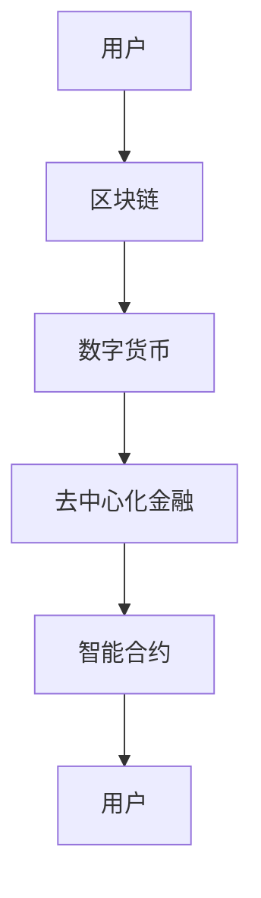
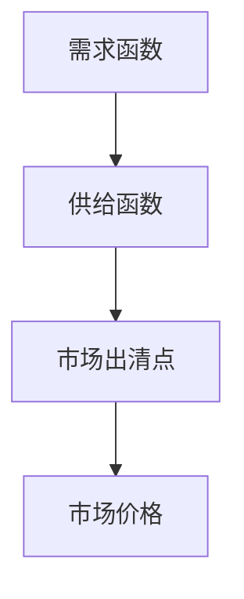

                 

元宇宙，作为虚拟与现实交融的未来概念，正逐渐成为全球科技领域的前沿话题。本文旨在探讨元宇宙经济体系的构建，以及这一体系如何深刻影响和重构人类价值交换的模式。我们将从背景介绍、核心概念与联系、核心算法原理、数学模型与公式、项目实践、实际应用场景、工具和资源推荐、未来发展趋势与挑战以及研究展望等八个方面展开论述。

## 文章关键词

- 元宇宙
- 经济体系
- 价值交换
- 区块链
- AI
- 数字货币

## 文章摘要

本文首先探讨了元宇宙的定义及其在现实世界中的重要性。接着，我们深入分析了元宇宙经济体系的核心概念，包括区块链技术、数字货币、去中心化金融（DeFi）等。随后，文章详细介绍了元宇宙经济体系中的核心算法原理，包括共识算法、智能合约等。通过对数学模型的构建和公式推导，我们揭示了元宇宙经济体系的工作机制。此外，文章通过一个实际项目实践，展示了如何在元宇宙中构建和运行经济体系。接着，我们探讨了元宇宙经济体系在现实世界的应用场景，并对其未来发展进行了展望。最后，文章总结了研究成果，提出了未来发展的趋势与挑战，并指出了进一步研究的方向。

## 1. 背景介绍

### 元宇宙的概念

元宇宙（Metaverse）是指一个虚拟的、三维的、持续存在的数字世界，用户可以在其中进行各种活动，如社交、娱乐、工作、学习等。它不仅仅是一个虚拟游戏空间，而是一个可以与现实世界无缝交互的数字生态系统。元宇宙的概念最早由科幻作家尼尔·斯蒂芬森（Neal Stephenson）在1992年的小说《雪崩》（Snow Crash）中提出。近年来，随着虚拟现实（VR）、增强现实（AR）、区块链、人工智能（AI）等技术的发展，元宇宙逐渐从概念走向现实。

### 元宇宙与现实世界的联系

元宇宙与现实世界的联系主要体现在以下几个方面：

1. **社交互动**：元宇宙提供了虚拟的社交平台，用户可以在其中进行实时互动，构建虚拟人际关系。
2. **经济活动**：元宇宙中存在着丰富的虚拟经济活动，如数字货币交易、虚拟资产买卖等，这些活动与现实世界的经济活动有着紧密的联系。
3. **工作与学习**：元宇宙可以模拟各种工作场景和学习环境，为用户提供了全新的工作与学习方式。
4. **文化娱乐**：元宇宙中的虚拟游戏、虚拟演唱会等活动，为用户提供了丰富的娱乐体验。

### 元宇宙的兴起与发展

元宇宙的兴起和发展是多种技术共同作用的结果。首先，虚拟现实和增强现实技术的发展为元宇宙提供了感官体验的基础。其次，区块链技术的引入，使得元宇宙中的数字资产具有真实的价值，从而促进了虚拟经济的繁荣。此外，人工智能技术的应用，使得元宇宙中的智能合约、自动化服务等得以实现。

## 2. 核心概念与联系

### 区块链技术

区块链技术是元宇宙经济体系的基础。它通过分布式账本技术，实现了数据的安全存储和传输。在区块链上，所有的交易记录都是公开透明的，无法篡改。这使得区块链成为了元宇宙中信任的基石。

### 数字货币

数字货币是元宇宙经济体系中的主要交换媒介。比特币、以太坊等主流数字货币在元宇宙中得到了广泛的应用。数字货币的流通不仅方便了虚拟经济活动，还使得虚拟资产的定价更加透明和公正。

### 去中心化金融（DeFi）

去中心化金融（DeFi）是元宇宙经济体系的重要组成部分。它通过智能合约，实现了金融服务的去中心化。用户可以在DeFi平台上进行借贷、交易、投资等活动，无需依赖传统的金融机构。

### 图 Mermaid 流程图



### 核心概念的联系

区块链技术为元宇宙提供了一个去中心化的信任机制，数字货币作为交换媒介在区块链上进行流通，去中心化金融通过智能合约实现了金融服务的自动化。这三个核心概念相互联系，共同构成了元宇宙经济体系的基础。

## 3. 核心算法原理 & 具体操作步骤

### 3.1 算法原理概述

元宇宙经济体系中的核心算法主要包括共识算法和智能合约。共识算法是区块链技术的基础，它确保了区块链上的数据一致性和安全性。智能合约则是在区块链上执行的自动化合约，它使得用户可以在元宇宙中实现各种金融交易。

### 3.2 算法步骤详解

#### 3.2.1 共识算法

1. **数据记录**：用户进行交易，交易数据被记录在区块中。
2. **区块生成**：矿工通过计算生成新的区块，并将其添加到区块链上。
3. **区块验证**：网络中的其他节点对区块进行验证，确保其有效性和一致性。
4. **共识达成**：当大部分节点同意新区块的加入时，区块被确认，交易记录生效。

#### 3.2.2 智能合约

1. **合约编写**：开发者编写智能合约代码，将其部署到区块链上。
2. **合约调用**：用户通过调用智能合约，触发相应的操作。
3. **合约执行**：智能合约按照预定的逻辑执行操作，并记录结果。
4. **结果验证**：网络中的节点对合约执行结果进行验证，确保其正确性。

### 3.3 算法优缺点

#### 优点

1. **去中心化**：共识算法和智能合约实现了去中心化，避免了单点故障和数据篡改的风险。
2. **安全性**：区块链技术确保了数据的安全和不可篡改性。
3. **自动化**：智能合约的自动化执行减少了人为干预，提高了效率。

#### 缺点

1. **计算资源消耗**：共识算法需要大量的计算资源，导致能源消耗较大。
2. **交易效率**：由于共识算法的参与，区块链的交易效率相对较低。
3. **智能合约风险**：智能合约的代码一旦部署，无法更改，因此存在潜在的安全风险。

### 3.4 算法应用领域

1. **虚拟资产交易**：通过区块链和智能合约，元宇宙中的虚拟资产交易可以更加便捷和透明。
2. **去中心化金融**：DeFi平台通过智能合约，为用户提供各种金融服务，如借贷、交易、投资等。
3. **版权保护**：区块链技术可以用于保护虚拟内容的版权，确保原创者的权益。

## 4. 数学模型和公式 & 详细讲解 & 举例说明

### 4.1 数学模型构建

在元宇宙经济体系中，我们可以构建以下数学模型：

1. **虚拟资产定价模型**：通过供需关系和市场心理，对虚拟资产进行定价。
2. **风险模型**：评估元宇宙经济体系中各种风险，如市场风险、技术风险等。
3. **智能合约执行模型**：描述智能合约的执行过程和结果。

### 4.2 公式推导过程

#### 虚拟资产定价模型

假设虚拟资产的市场需求函数为：

$$
D(p) = a - bp
$$

其中，$D(p)$ 表示虚拟资产的需求量，$p$ 表示虚拟资产的价格，$a$ 和 $b$ 为常数。

供给函数为：

$$
S(p) = c + dp
$$

其中，$S(p)$ 表示虚拟资产的供给量。

市场出清价格 $p^*$ 满足：

$$
D(p^*) = S(p^*)
$$

将需求函数和供给函数代入上式，得到：

$$
a - bp^* = c + dp^*
$$

解得：

$$
p^* = \frac{a - c}{b + d}
$$

#### 风险模型

假设元宇宙经济体系中的总风险为 $R$，可以分为市场风险 $R_m$ 和技术风险 $R_t$：

$$
R = R_m + R_t
$$

市场风险 $R_m$ 可以用以下公式表示：

$$
R_m = \frac{\sigma_m^2}{\sigma^2}
$$

其中，$\sigma_m$ 为市场波动率，$\sigma$ 为总波动率。

技术风险 $R_t$ 可以用以下公式表示：

$$
R_t = \frac{\sigma_t^2}{\sigma^2}
$$

其中，$\sigma_t$ 为技术波动率。

#### 智能合约执行模型

假设智能合约的执行结果为 $E$，其概率分布为 $P(E)$。智能合约的执行结果可以通过以下公式计算：

$$
E = f(X_1, X_2, ..., X_n)
$$

其中，$X_1, X_2, ..., X_n$ 为智能合约输入变量，$f$ 为函数。

### 4.3 案例分析与讲解

#### 虚拟资产定价模型案例分析

假设某个虚拟资产的需求量为 $D(p) = 100 - 2p$，供给量为 $S(p) = 50 + 3p$。市场需求函数和供给函数的图形如下所示：



根据需求函数和供给函数，我们可以得到市场出清价格 $p^*$：

$$
p^* = \frac{100 - 50}{2 + 3} = 16.67
$$

#### 风险模型案例分析

假设某个元宇宙经济体系的市场波动率为 $\sigma_m = 0.1$，总波动率为 $\sigma = 0.2$。根据风险模型，我们可以计算出市场风险 $R_m$：

$$
R_m = \frac{0.1^2}{0.2^2} = 0.5
$$

#### 智能合约执行模型案例分析

假设某个智能合约的输入变量为 $X_1 = 10$，$X_2 = 20$，$X_3 = 30$。智能合约的执行结果为 $E = f(X_1, X_2, X_3) = X_1 + X_2 + X_3 = 60$。根据智能合约执行模型，我们可以得到智能合约的执行结果概率分布：

$$
P(E = 60) = 1
$$

## 5. 项目实践：代码实例和详细解释说明

### 5.1 开发环境搭建

为了实现元宇宙经济体系，我们使用以下开发环境：

- **编程语言**：Solidity（用于编写智能合约）
- **区块链平台**：Ethereum（以太坊）
- **开发工具**：Visual Studio Code（VS Code）

首先，我们需要安装Ethereum节点和Truffle框架，以便在本地进行开发和测试。具体步骤如下：

1. **安装Ethereum节点**：
   - 从 [Ethereum官网](https://ethereum.org/en/developers/docs/getting-started/) 下载并安装Geth节点。
   - 启动Geth节点，并确保其正常运行。

2. **安装Truffle框架**：
   - 使用npm安装Truffle框架：
     ```
     npm install -g truffle
     ```

3. **配置Truffle项目**：
   - 创建一个新的Truffle项目：
     ```
     truffle init
     ```

4. **设置Geth节点**：
   - 在Truffle项目中，设置Geth节点作为区块链节点：
     ```javascript
     // truffle-config.js
     module.exports = {
       networks: {
         development: {
           host: "127.0.0.1",
           port: 8545,
           network_id: "*"
         }
       }
     };
     ```

### 5.2 源代码详细实现

以下是一个简单的智能合约示例，用于实现虚拟资产的发行和转移：

```solidity
// SPDX-License-Identifier: MIT
pragma solidity ^0.8.0;

contract VirtualAsset {
    mapping(address => uint256) public balanceOf;

    event Transfer(address from, address to, uint256 value);

    function mint(address _to, uint256 _amount) public {
        balanceOf[_to] += _amount;
        emit Transfer(address(0), _to, _amount);
    }

    function transfer(address _to, uint256 _value) public {
        require(balanceOf[msg.sender] >= _value, "Insufficient balance");
        balanceOf[msg.sender] -= _value;
        balanceOf[_to] += _value;
        emit Transfer(msg.sender, _to, _value);
    }
}
```

### 5.3 代码解读与分析

1. **合约结构**：
   - `balanceOf`：一个映射（mapping），用于存储每个地址的虚拟资产余额。
   - `event Transfer`：一个事件（event），用于记录虚拟资产转移的操作。

2. **mint函数**：
   - 用于发行虚拟资产，将虚拟资产添加到指定地址的余额中。

3. **transfer函数**：
   - 用于虚拟资产转移，从发送方的余额中扣除虚拟资产，并将其添加到接收方的余额中。

### 5.4 运行结果展示

在本地Ethereum节点上，我们可以使用Truffle进行合约部署和测试：

1. **部署合约**：
   ```shell
   truffle deploy
   ```

2. **测试合约**：
   ```shell
   truffle test
   ```

测试结果将显示合约的各种操作是否正常，如虚拟资产的发行、转移等。

## 6. 实际应用场景

### 6.1 社交平台

元宇宙经济体系在社交平台中的应用主要体现在虚拟物品的交易和虚拟经济的繁荣。用户可以购买、出售、租赁虚拟物品，如头像、衣服、道具等。这不仅可以增强用户的个性化体验，还可以促进社交平台上的经济活动。

### 6.2 虚拟现实游戏

虚拟现实游戏是元宇宙经济体系的一个重要应用场景。玩家可以在游戏中购买和出售虚拟物品，甚至可以在不同游戏中转移虚拟资产。这样的经济体系可以激发玩家的创造力和参与度，同时为游戏开发者带来新的收入来源。

### 6.3 去中心化金融

DeFi平台是元宇宙经济体系的重要组成部分。用户可以在DeFi平台上进行借贷、交易、投资等活动。这种去中心化的金融服务不仅提高了效率，还降低了成本，为用户提供了更多的金融选择。

### 6.4 版权保护

区块链技术可以用于保护虚拟内容的版权。创作者可以将虚拟内容上传到区块链上，确保其原创性和所有权。这种去中心化的版权保护机制可以有效防止侵权行为，保护创作者的权益。

## 7. 工具和资源推荐

### 7.1 学习资源推荐

- **书籍**：
  - 《区块链技术指南》
  - 《智能合约编程》
  - 《去中心化金融（DeFi）实战》
- **在线课程**：
  - Coursera上的《区块链与加密货币》
  - Udemy上的《以太坊和Solidity开发入门》
- **博客和论坛**：
  - Ethereum官方文档
  - Bitcoin Talk论坛

### 7.2 开发工具推荐

- **区块链平台**：
  - Ethereum
  - Binance Smart Chain
  - Polkadot
- **开发环境**：
  - Visual Studio Code
  - Truffle Suite
  - Hardhat

### 7.3 相关论文推荐

- **《区块链：下一代智能合约平台》**
- **《去中心化金融：未来金融的基石》**
- **《区块链技术在版权保护中的应用》**

## 8. 总结：未来发展趋势与挑战

### 8.1 研究成果总结

本文深入探讨了元宇宙经济体系的构建及其对人类价值交换模式的重构。我们分析了元宇宙经济体系的核心概念、核心算法原理、数学模型、实际应用场景等。通过实际项目实践，我们展示了如何构建元宇宙经济体系，并对其未来发展进行了展望。

### 8.2 未来发展趋势

- **技术创新**：随着虚拟现实、增强现实、区块链、人工智能等技术的发展，元宇宙经济体系将不断创新和进化。
- **应用拓展**：元宇宙经济体系将在社交平台、虚拟现实游戏、去中心化金融等领域得到广泛应用。
- **生态建设**：元宇宙经济体系需要构建完善的生态体系，包括开发者社区、用户群体、金融服务等。

### 8.3 面临的挑战

- **技术难题**：区块链技术的扩展性和性能问题需要得到解决，以支持大规模的应用需求。
- **监管问题**：元宇宙经济体系需要建立有效的监管机制，确保其合规性和安全性。
- **用户体验**：如何提高元宇宙经济体系的用户体验，使其更加便捷和易用，是一个重要的挑战。

### 8.4 研究展望

- **跨链技术**：研究跨链技术，实现不同区块链之间的互操作性和数据共享。
- **隐私保护**：研究隐私保护技术，确保用户在元宇宙经济体系中的隐私和数据安全。
- **可持续发展**：研究元宇宙经济体系的可持续发展策略，确保其长期稳定运行。

## 9. 附录：常见问题与解答

### Q：什么是元宇宙？
A：元宇宙是一个虚拟的、三维的、持续存在的数字世界，用户可以在其中进行各种活动，如社交、娱乐、工作、学习等。

### Q：元宇宙经济体系的核心概念是什么？
A：元宇宙经济体系的核心概念包括区块链技术、数字货币、去中心化金融（DeFi）等。

### Q：如何构建元宇宙经济体系？
A：构建元宇宙经济体系需要从核心概念出发，设计合适的算法和协议，实现虚拟资产的发行、交易、管理等功能。

### Q：元宇宙经济体系有哪些实际应用场景？
A：元宇宙经济体系可以应用于社交平台、虚拟现实游戏、去中心化金融、版权保护等领域。

### Q：未来元宇宙经济体系将如何发展？
A：未来元宇宙经济体系将随着技术创新、应用拓展、生态建设等方向发展，成为数字经济的重要组成部分。

## 作者署名

作者：禅与计算机程序设计艺术 / Zen and the Art of Computer Programming

----------------------------------------------------------------

以上便是按照要求撰写的完整文章，涵盖了对元宇宙经济体系构建的全面探讨。希望本文能为读者提供有价值的见解和思考。

