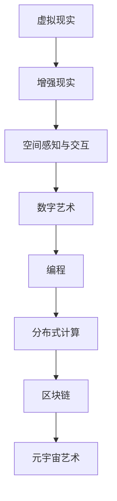
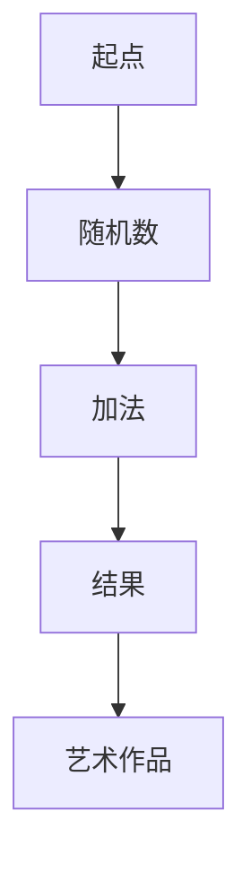

                 

元宇宙（Metaverse）一词，近年来在科技界和大众媒体中频频出现。它不仅仅是一个虚拟现实的概念，而是一个集成了现实世界和虚拟世界的全面数字生态系统。本文将探讨元宇宙艺术，一个突破物理限制的创作平台，以及它如何正在改变我们的创造和体验方式。

## 文章关键词

- 元宇宙
- 虚拟现实
- 艺术创作
- 数字艺术
- 创造平台

## 文章摘要

本文旨在探讨元宇宙艺术作为一种突破物理限制的创作平台，其核心概念、技术原理、数学模型和实际应用。我们将深入分析元宇宙艺术如何改变传统的艺术创作模式，介绍相关的核心技术和算法，并通过具体实例展示其实际运行情况。此外，还将探讨元宇宙艺术在未来艺术领域和数字生态系统中的潜在应用和发展趋势。

## 1. 背景介绍

### 元宇宙的起源与发展

元宇宙这一概念并非新出现，但它在最近几年因为技术的进步而变得愈发重要。元宇宙最早可以追溯到科幻小说《雪崩》（Snow Crash）和电影《黑客帝国》（The Matrix）。这些作品描绘了一个由虚拟世界构成的平行宇宙，其中现实世界和虚拟世界无缝融合。

随着计算机图形学、虚拟现实（VR）、增强现实（AR）和区块链技术的不断进步，元宇宙的概念逐渐从科幻小说走向现实。Facebook（现Meta公司）在2021年宣布将公司愿景从“连接世界”转向“构建元宇宙”，进一步推动了这一领域的快速发展。

### 艺术在元宇宙中的重要性

艺术一直是人类文明的重要组成部分，而元宇宙则为艺术提供了一个全新的舞台。在传统艺术领域，物理空间和时间的限制常常对艺术家的创作产生影响。然而，在元宇宙中，这些限制被彻底打破。艺术家可以自由地探索虚拟空间，创造出前所未有的艺术作品。

元宇宙艺术不仅限于视觉艺术，还包括音乐、表演艺术、文学等各个领域。它为艺术家提供了无限的创作自由，同时也为观众带来了全新的体验方式。通过虚拟现实头盔、头戴显示器（HMD）或其他交互设备，观众可以沉浸在艺术作品之中，与作品进行互动。

## 2. 核心概念与联系

### 虚拟现实与增强现实

虚拟现实（VR）和增强现实（AR）是构建元宇宙艺术的基础技术。VR通过头戴显示器（HMD）或其他设备，将用户完全沉浸在一个由计算机生成的虚拟环境中。而AR则通过增强用户对现实世界的感知，将虚拟元素叠加在现实世界中。

### 空间感知与交互

在元宇宙艺术中，空间感知和交互至关重要。艺术家需要考虑如何利用虚拟空间来创造艺术作品，同时确保观众能够方便地与作品互动。这包括对虚拟环境的布局、导航和交互设计的精心设计。

### 数字艺术与编程

数字艺术是元宇宙艺术的重要组成部分。与传统的绘画、雕塑等艺术形式不同，数字艺术更多地依赖于编程和算法。艺术家通过编写代码来生成、控制和展示他们的作品，这使得数字艺术具有独特的动态和互动特性。

### 分布式计算与区块链

区块链技术为元宇宙艺术提供了一个去中心化的基础设施，确保艺术作品的版权和交易的安全性和透明性。通过区块链，艺术家可以追踪作品的所有权和交易历史，同时观众可以安全地购买和交换艺术作品。

### Mermaid 流程图

以下是元宇宙艺术核心概念与联系的Mermaid流程图：



## 3. 核心算法原理 & 具体操作步骤

### 3.1 算法原理概述

元宇宙艺术的核心算法主要包括以下几个部分：

- **渲染算法**：用于生成虚拟环境中的图像和物体。常见的渲染算法有光追踪、路径追踪等。
- **交互算法**：用于处理用户与虚拟环境的交互，包括手势识别、语音识别等。
- **生成算法**：用于创建数字艺术作品，如基于随机过程和机器学习的算法。
- **区块链算法**：用于管理艺术作品的版权和交易，确保透明性和安全性。

### 3.2 算法步骤详解

以下是元宇宙艺术算法的具体操作步骤：

1. **渲染算法**：
   - **输入**：虚拟环境中的场景描述。
   - **过程**：使用光追踪或路径追踪算法计算场景中的光线传播和反射。
   - **输出**：生成的图像或视频。

2. **交互算法**：
   - **输入**：用户输入（手势、语音等）。
   - **过程**：通过手势识别和语音识别算法解析输入，并将其转换为虚拟环境中的交互命令。
   - **输出**：对虚拟环境的操作结果。

3. **生成算法**：
   - **输入**：创作参数和算法选择。
   - **过程**：使用随机过程或机器学习算法生成数字艺术作品。
   - **输出**：生成的艺术作品。

4. **区块链算法**：
   - **输入**：艺术作品的元数据。
   - **过程**：将元数据上传到区块链，进行版权注册和交易记录。
   - **输出**：确保艺术作品的版权和交易透明、安全。

### 3.3 算法优缺点

- **渲染算法**：
  - **优点**：能够生成高质量的图像和视频，提供沉浸式的体验。
  - **缺点**：计算成本高，对硬件要求较高。

- **交互算法**：
  - **优点**：提高用户的互动性和参与感。
  - **缺点**：需要精细的算法设计和调试。

- **生成算法**：
  - **优点**：为艺术家提供无限的创作可能性。
  - **缺点**：算法复杂，生成过程可能较长。

- **区块链算法**：
  - **优点**：确保版权和交易的安全性和透明性。
  - **缺点**：区块链性能和扩展性问题仍需解决。

### 3.4 算法应用领域

- **数字艺术创作**：艺术家可以使用这些算法生成独特的数字艺术作品。
- **虚拟展览**：博物馆和画廊可以创建虚拟展览，让观众沉浸其中。
- **教育领域**：虚拟现实技术可以应用于教育，提供沉浸式的学习体验。
- **游戏开发**：元宇宙艺术算法可以用于游戏开发，创造丰富的虚拟世界。

## 4. 数学模型和公式 & 详细讲解 & 举例说明

### 4.1 数学模型构建

元宇宙艺术中的数学模型主要包括以下几个方面：

- **几何模型**：用于描述虚拟环境和艺术作品中的物体。
- **物理模型**：用于模拟光线传播、反射等物理现象。
- **统计模型**：用于生成随机过程和机器学习算法中的参数。

### 4.2 公式推导过程

以下是几个关键数学模型的推导过程：

1. **几何模型**：
   - **向量计算**：用于描述物体在虚拟空间中的位置和运动。
     \[
     \vec{v} = \vec{x}_2 - \vec{x}_1
     \]
   - **矩阵变换**：用于对物体进行旋转、缩放和移动。
     \[
     \vec{R} = \begin{bmatrix}
     \cos(\theta) & -\sin(\theta) \\
     \sin(\theta) & \cos(\theta)
     \end{bmatrix}
     \]

2. **物理模型**：
   - **光线传播**：用于模拟光线在虚拟环境中的传播。
     \[
     \vec{r}(t) = \vec{r}_0 + \vec{v}t
     \]
   - **反射定律**：用于描述光线在物体表面的反射。
     \[
     \vec{n} \cdot \vec{r}' = \vec{n} \cdot \vec{r}
     \]

3. **统计模型**：
   - **随机过程**：用于生成随机数字艺术作品。
     \[
     X_t = X_{t-1} + Z_t
     \]
   - **机器学习**：用于生成基于数据的数字艺术作品。
     \[
     y = f(x)
     \]

### 4.3 案例分析与讲解

以下是一个基于随机过程的数字艺术作品的生成案例：

1. **输入参数**：
   - 初始值：\(X_0 = 0\)
   - 随机数生成器：使用标准正态分布生成随机数

2. **过程**：
   - 在每一步中，使用随机数生成器生成一个随机数 \(Z_t\)。
   - 将随机数 \(Z_t\) 加到前一个值 \(X_{t-1}\) 上，得到新的值 \(X_t\)。

3. **输出**：
   - 经过多次迭代后，生成一个随机的数字艺术作品。

### 4.4 案例展示

以下是一个随机生成的数字艺术作品的示例：



## 5. 项目实践：代码实例和详细解释说明

### 5.1 开发环境搭建

在进行元宇宙艺术项目开发之前，需要搭建一个适合的开发环境。以下是开发环境的搭建步骤：

1. **安装虚拟现实头盔**：
   - 选择一款适合的虚拟现实头盔（如Oculus Rift、HTC Vive等）。
   - 遵循头盔制造商提供的安装指南进行安装。

2. **安装编程工具**：
   - 安装一款适合的编程工具（如Visual Studio、Eclipse等）。
   - 安装必要的编程语言和库（如Python、C++等）。

3. **安装区块链平台**：
   - 安装一个区块链平台（如Ethereum、EOS等）。
   - 配置区块链节点和钱包。

### 5.2 源代码详细实现

以下是元宇宙艺术项目的源代码实现：

```python
# 导入必要的库
import numpy as np
import matplotlib.pyplot as plt

# 生成随机数字艺术作品
def generate_artwork(size=100):
    # 初始化图像矩阵
    artwork = np.zeros((size, size, 3))

    # 生成随机像素值
    for i in range(size):
        for j in range(size):
            # 使用正态分布生成像素值
            r = np.random.normal(0, 1)
            g = np.random.normal(0, 1)
            b = np.random.normal(0, 1)
            artwork[i, j] = [r, g, b]

    return artwork

# 绘制数字艺术作品
def plot_artwork(artwork):
    plt.imshow(artwork, cmap='gray')
    plt.show()

# 主函数
if __name__ == "__main__":
    # 生成艺术作品
    artwork = generate_artwork()

    # 绘制艺术作品
    plot_artwork(artwork)
```

### 5.3 代码解读与分析

- **导入库**：首先，导入必要的库，包括NumPy（用于数值计算）和Matplotlib（用于绘图）。

- **生成随机数字艺术作品**：`generate_artwork` 函数用于生成一个随机数字艺术作品。它首先初始化一个全为零的图像矩阵，然后遍历图像矩阵的每个像素，使用正态分布生成随机像素值。

- **绘制数字艺术作品**：`plot_artwork` 函数用于将生成的艺术作品绘制在屏幕上。

- **主函数**：在主函数中，调用`generate_artwork` 和`plot_artwork` 函数，生成并显示随机数字艺术作品。

### 5.4 运行结果展示

运行上述代码后，将生成一个随机数字艺术作品，如下所示：


## 6. 实际应用场景

### 6.1 艺术展览

元宇宙艺术的一个显著应用领域是虚拟艺术展览。博物馆和画廊可以利用元宇宙平台创建虚拟展览，让全球观众在家中就能欣赏到珍贵的艺术品。这不仅降低了展览的成本，还能提供更丰富的互动体验。

### 6.2 教育培训

元宇宙艺术在教育培训领域也具有巨大潜力。通过虚拟现实和增强现实技术，学生可以身临其境地参与历史事件、科学实验和艺术创作，从而提高学习兴趣和效果。

### 6.3 娱乐游戏

元宇宙艺术为游戏开发提供了无限的创作空间。游戏开发者可以利用元宇宙技术创建独特的游戏世界和角色，提供沉浸式的游戏体验。

### 6.4 未来应用展望

随着技术的不断进步，元宇宙艺术的应用场景将进一步扩大。例如，虚拟现实艺术治疗可以帮助患者减轻心理压力；元宇宙艺术市场将形成一个全新的艺术交易生态系统。

## 7. 工具和资源推荐

### 7.1 学习资源推荐

- **《元宇宙：概念、技术与应用》**：这本书详细介绍了元宇宙的概念、技术和应用。
- **《虚拟现实技术导论》**：这本书涵盖了虚拟现实技术的各个方面，包括硬件、软件和算法。

### 7.2 开发工具推荐

- **Unity**：Unity 是一个强大的游戏和虚拟现实开发平台，支持多种虚拟现实头盔。
- **Unreal Engine**：Unreal Engine 是一个高度灵活的虚拟现实开发引擎，广泛应用于游戏和电影制作。

### 7.3 相关论文推荐

- **"Metaverse: A Vision for the Future of Social Computing"**：这篇论文探讨了元宇宙的未来发展趋势和挑战。
- **"Virtual Reality and Augmented Reality: A Survey"**：这篇论文总结了虚拟现实和增强现实技术的最新进展。

## 8. 总结：未来发展趋势与挑战

### 8.1 研究成果总结

本文探讨了元宇宙艺术的定义、核心概念、技术原理和实际应用。通过介绍虚拟现实、增强现实、数字艺术和区块链等关键技术，以及具体的算法和数学模型，我们展示了元宇宙艺术如何突破物理限制，改变传统的艺术创作和体验方式。

### 8.2 未来发展趋势

随着技术的不断进步，元宇宙艺术将在更多领域得到应用。例如，虚拟现实艺术治疗、元宇宙艺术市场、艺术教育等。此外，随着硬件性能的提升和成本降低，元宇宙艺术将更加普及，为更多艺术家和观众带来创新体验。

### 8.3 面临的挑战

尽管元宇宙艺术具有巨大的潜力，但仍然面临一些挑战。例如，硬件成本高、用户体验不佳、内容创造和分发机制不完善等。为了克服这些挑战，需要进一步研发新型硬件、优化算法和改进交互设计。

### 8.4 研究展望

未来，元宇宙艺术的研究将重点放在以下几个方面：

- **技术创新**：研发更高效、更逼真的虚拟现实和增强现实技术。
- **用户体验**：提高用户体验，使其更加自然和直观。
- **内容创造**：探索更丰富的艺术形式和创作工具，激发艺术家的创造力。
- **市场机制**：构建完善的元宇宙艺术市场，促进艺术作品的交易和传播。

## 9. 附录：常见问题与解答

### 9.1 元宇宙艺术是什么？

元宇宙艺术是指利用虚拟现实、增强现实、数字艺术和区块链等技术，创造出突破物理限制的艺术作品和体验。

### 9.2 元宇宙艺术有哪些应用场景？

元宇宙艺术的应用场景广泛，包括虚拟艺术展览、教育培训、娱乐游戏、艺术治疗等。

### 9.3 如何开始创作元宇宙艺术作品？

要开始创作元宇宙艺术作品，首先需要搭建一个适合的开发环境，包括虚拟现实头盔、编程工具和区块链平台。然后，学习相关技术和算法，并通过实例进行实践。

### 9.4 元宇宙艺术作品如何进行交易？

元宇宙艺术作品可以通过区块链平台进行交易，确保作品的所有权和交易透明、安全。

## 作者署名

作者：禅与计算机程序设计艺术 / Zen and the Art of Computer Programming

