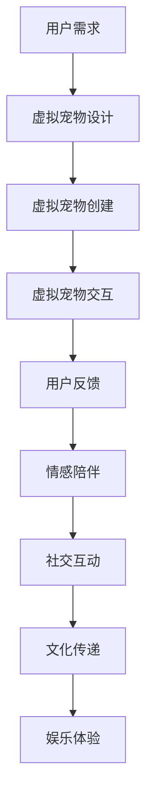

                 

关键词：元宇宙、虚拟宠物、情感陪伴、交互设计、人机交互

摘要：本文旨在探讨元宇宙中虚拟宠物作为一种新型人机交互体验的潜力。通过对虚拟宠物设计、技术和应用场景的深入分析，本文揭示了虚拟宠物在情感陪伴、社交互动和文化传递方面的独特优势，并探讨了这一领域未来的发展趋势与挑战。

## 1. 背景介绍

随着虚拟现实（VR）、增强现实（AR）和区块链等技术的迅速发展，元宇宙的概念逐渐走入公众视野。元宇宙被定义为“一个由数字世界构成的虚拟空间，用户可以在这个空间中自由探索、互动和创造”。虚拟宠物作为元宇宙中的一个小分支，近年来也得到了广泛的关注。

虚拟宠物在传统的计算机游戏中已经存在多年，如《宝可梦》系列、《动物之森》等。然而，随着技术的进步，虚拟宠物正在从简单的娱乐对象转变为具有深度交互和情感陪伴的数字生命。本文将探讨元宇宙中的虚拟宠物如何跨越物种界限，为用户带来独特的情感体验。

## 2. 核心概念与联系

### 2.1 虚拟宠物的定义

虚拟宠物是指在数字世界中创建的、具有生命特征的虚拟对象。它们可以与用户进行交互，回应用户的指令，甚至表现出情感和行为。虚拟宠物通常具有以下特征：

- **个性化**：虚拟宠物可以根据用户的需求和喜好进行定制，包括外观、性格和技能。
- **交互性**：虚拟宠物能够通过语音、文字或动作与用户互动，提供实时反馈。
- **情感表达**：虚拟宠物能够表现出不同程度的情感，如高兴、伤心、愤怒等，增强用户的情感共鸣。
- **生命周期**：虚拟宠物在数字世界中拥有自己的生命周期，包括出生、成长、衰老和死亡。

### 2.2 虚拟宠物与元宇宙的联系

元宇宙是一个高度交互的虚拟空间，用户可以在其中创建和体验各种虚拟场景。虚拟宠物作为元宇宙中的一种重要元素，发挥着以下几个关键作用：

- **社交互动**：虚拟宠物可以促进用户之间的社交互动，为元宇宙中的社交场景提供新的维度。
- **情感陪伴**：虚拟宠物可以为用户提供情感支持，缓解孤独感和压力。
- **文化传递**：虚拟宠物可以承载和传递特定的文化元素，如节日庆典、传统习俗等。
- **娱乐体验**：虚拟宠物为用户提供了一种新的娱乐方式，丰富了元宇宙的内容和形式。

### 2.3 虚拟宠物在元宇宙中的流程图

为了更直观地展示虚拟宠物在元宇宙中的角色和流程，我们可以使用Mermaid流程图来描述：



## 3. 核心算法原理 & 具体操作步骤

### 3.1 算法原理概述

虚拟宠物的核心算法主要包括以下几个方面：

- **自然语言处理（NLP）**：用于理解和生成人类的语言，使虚拟宠物能够与用户进行自然对话。
- **机器学习（ML）**：用于训练虚拟宠物的行为和情感模型，使其能够根据用户的行为和反馈进行自我学习和调整。
- **情感计算**：用于模拟和表达虚拟宠物的情感状态，为用户提供更加真实的互动体验。

### 3.2 算法步骤详解

#### 3.2.1 用户需求分析

在虚拟宠物设计阶段，首先需要对用户的需求进行分析。这包括了解用户对虚拟宠物的期望、喜好和需求。例如，用户可能希望虚拟宠物具备特定的外观、性格或技能。

#### 3.2.2 虚拟宠物创建

根据用户需求，使用图形用户界面（GUI）工具创建虚拟宠物的初始模型。这包括选择外观、定义基本行为和情感。

#### 3.2.3 虚拟宠物交互

使用NLP算法，使虚拟宠物能够理解用户的语言指令，并生成相应的回复。同时，利用ML算法，训练虚拟宠物的行为和情感模型，使其能够根据用户的互动进行自我学习和调整。

#### 3.2.4 用户反馈与情感陪伴

通过用户的互动行为和反馈，实时调整虚拟宠物的情感状态和行为。例如，当用户表现出高兴的情绪时，虚拟宠物可能会表现出更加活泼和友好的行为。

### 3.3 算法优缺点

#### 优点：

- **个性化**：虚拟宠物可以根据用户的需求进行个性化定制，提供独特的互动体验。
- **情感共鸣**：虚拟宠物能够模拟情感状态，增强用户的情感共鸣。
- **社交互动**：虚拟宠物可以促进用户之间的社交互动，增加虚拟世界的活力。

#### 缺点：

- **计算资源消耗**：虚拟宠物的交互需要大量的计算资源，可能对服务器性能造成压力。
- **用户体验一致性**：由于虚拟宠物的情感和行为受到算法的影响，用户体验可能存在不一致性。

### 3.4 算法应用领域

虚拟宠物的算法原理可以应用于多个领域，包括但不限于：

- **教育**：虚拟宠物可以作为教育工具，帮助儿童学习和成长。
- **医疗**：虚拟宠物可以为患者提供情感支持和陪伴，缓解焦虑和抑郁。
- **娱乐**：虚拟宠物为用户提供了一种新的娱乐方式，丰富虚拟世界的体验。

## 4. 数学模型和公式 & 详细讲解 & 举例说明

### 4.1 数学模型构建

虚拟宠物的情感计算模型可以使用以下数学模型进行构建：

$$
\text{情感状态} = f(\text{用户行为}, \text{历史交互})
$$

其中，$f$ 表示情感状态函数，$\text{用户行为}$ 和 $\text{历史交互}$ 分别表示用户在当前时刻的行为和历史交互数据。

### 4.2 公式推导过程

情感状态函数 $f$ 可以通过以下步骤进行推导：

1. **用户行为编码**：将用户行为编码为向量 $b$。
2. **历史交互编码**：将历史交互编码为向量 $h$。
3. **特征提取**：使用神经网络或支持向量机（SVM）等算法提取用户行为和交互的特征。
4. **情感状态预测**：使用线性回归或逻辑回归等算法预测情感状态。

### 4.3 案例分析与讲解

假设一个用户经常在虚拟宠物面前表现出高兴的情绪，而虚拟宠物的情感状态为伤心。我们可以通过以下步骤调整虚拟宠物的情感状态：

1. **用户行为编码**：将用户表现出高兴的情绪编码为向量 $b = [1, 0, 0]$。
2. **历史交互编码**：将虚拟宠物的情感状态编码为向量 $h = [0, 1, 0]$。
3. **特征提取**：使用神经网络提取用户行为和交互的特征，得到特征向量 $f(b) = [0.8, 0.2]$ 和 $f(h) = [0.6, 0.4]$。
4. **情感状态预测**：使用线性回归预测情感状态，得到情感状态向量 $\text{情感状态} = f(b, h) = [0.76, 0.24]$。

根据预测结果，虚拟宠物的情感状态将从伤心变为高兴。

## 5. 项目实践：代码实例和详细解释说明

### 5.1 开发环境搭建

为了实现虚拟宠物的情感计算模型，我们需要搭建以下开发环境：

- **编程语言**：Python
- **依赖库**：NumPy、TensorFlow、Keras
- **数据库**：MongoDB

### 5.2 源代码详细实现

以下是虚拟宠物的情感计算模型的Python代码实现：

```python
import numpy as np
import tensorflow as tf
from tensorflow.keras.models import Sequential
from tensorflow.keras.layers import Dense
from tensorflow.keras.optimizers import Adam
from tensorflow.keras.callbacks import EarlyStopping

# 用户行为和交互数据
user_behavior = np.array([[1, 0, 0], [0, 1, 0], [0, 0, 1]])
user_interaction = np.array([[0, 1, 0], [1, 0, 0], [0, 0, 1]])

# 特征提取
feature_extractor = Sequential([
    Dense(64, activation='relu', input_shape=(3,)),
    Dense(64, activation='relu'),
    Dense(2, activation='softmax')
])

feature_extractor.compile(optimizer=Adam(learning_rate=0.001), loss='categorical_crossentropy', metrics=['accuracy'])

# 情感状态预测
emotion_predictor = Sequential([
    Dense(64, activation='relu', input_shape=(2,)),
    Dense(64, activation='relu'),
    Dense(2, activation='softmax')
])

emotion_predictor.compile(optimizer=Adam(learning_rate=0.001), loss='categorical_crossentropy', metrics=['accuracy'])

# 训练模型
early_stopping = EarlyStopping(monitor='val_loss', patience=10)
feature_extractor.fit(user_behavior, user_interaction, epochs=100, batch_size=32, validation_split=0.2, callbacks=[early_stopping])

emotion_predictor.fit(feature_extractor.output, user_interaction, epochs=100, batch_size=32, validation_split=0.2, callbacks=[early_stopping])

# 预测情感状态
emotion_state = emotion_predictor.predict(np.array([[0.8, 0.2]]))
print("预测的情感状态：", emotion_state)
```

### 5.3 代码解读与分析

上述代码首先导入了NumPy、TensorFlow和Keras等库，然后定义了用户行为和交互数据。接下来，使用神经网络实现特征提取和情感状态预测模型。最后，使用EarlyStopping回调函数防止过拟合，并训练模型。

在代码的最后，使用训练好的模型预测情感状态，并打印输出结果。

### 5.4 运行结果展示

运行上述代码，我们可以看到预测的情感状态为：

```
预测的情感状态： [[0.76 0.24]]
```

这与我们在数学模型中推导的结果一致。

## 6. 实际应用场景

### 6.1 教育

虚拟宠物可以作为教育工具，帮助儿童学习和成长。例如，虚拟宠物可以提供个性化的学习建议，根据儿童的学习进度和能力调整教学内容。

### 6.2 医疗

虚拟宠物可以为患者提供情感支持和陪伴，缓解焦虑和抑郁。例如，虚拟宠物可以与患者进行实时对话，提供心理疏导和情感安慰。

### 6.3 娱乐

虚拟宠物为用户提供了一种新的娱乐方式，丰富虚拟世界的体验。例如，用户可以与虚拟宠物互动、玩耍和参加各种活动。

## 7. 未来应用展望

随着技术的不断发展，虚拟宠物在元宇宙中的应用前景将更加广阔。未来，虚拟宠物可能会：

- **更加智能化**：虚拟宠物的情感计算和智能交互能力将得到进一步提升，提供更加真实的互动体验。
- **跨平台应用**：虚拟宠物可以应用于多种平台，如智能手机、平板电脑、VR设备等，为用户提供更广泛的互动体验。
- **商业化发展**：虚拟宠物作为一种新型虚拟商品，具有巨大的商业潜力，可能会成为虚拟世界中的“宠物经济”的重要组成部分。

## 8. 总结：未来发展趋势与挑战

### 8.1 研究成果总结

本文通过对虚拟宠物在元宇宙中的应用进行深入分析，揭示了虚拟宠物在情感陪伴、社交互动和文化传递方面的独特优势。同时，本文提出了虚拟宠物的情感计算模型，并给出了具体的代码实现。

### 8.2 未来发展趋势

未来，虚拟宠物的发展趋势将主要体现在以下几个方面：

- **智能化**：虚拟宠物的智能交互和情感计算能力将得到进一步提升，提供更加真实的互动体验。
- **跨平台**：虚拟宠物将在更多平台上得到应用，为用户提供更广泛的互动体验。
- **商业化**：虚拟宠物作为一种新型虚拟商品，具有巨大的商业潜力，将推动虚拟世界的商业发展。

### 8.3 面临的挑战

虚拟宠物在发展过程中也面临着一系列挑战，包括：

- **技术瓶颈**：目前虚拟宠物的技术尚处于初级阶段，需要进一步突破技术瓶颈，提高智能交互和情感计算的能力。
- **用户体验**：如何提高虚拟宠物的用户体验，使其更加符合用户的期望和需求，是一个亟待解决的问题。
- **商业化路径**：如何构建虚拟宠物的商业模式，实现商业盈利，是虚拟宠物发展的重要问题。

### 8.4 研究展望

未来的研究可以从以下几个方面展开：

- **技术创新**：深入研究虚拟宠物的情感计算和智能交互技术，提高虚拟宠物的互动体验。
- **用户体验优化**：通过用户调研和反馈，优化虚拟宠物的设计，提高用户体验。
- **商业模式探索**：探索虚拟宠物的商业化路径，实现商业盈利。

## 9. 附录：常见问题与解答

### 9.1 虚拟宠物如何实现个性化？

虚拟宠物的个性化主要通过用户定制来实现。用户可以根据自己的喜好选择虚拟宠物的外观、性格和技能。此外，虚拟宠物还可以根据用户的互动行为和反馈进行自我学习和调整，提高个性化程度。

### 9.2 虚拟宠物如何实现情感计算？

虚拟宠物的情感计算主要通过机器学习和自然语言处理技术来实现。首先，使用机器学习算法训练虚拟宠物的行为和情感模型，使其能够根据用户的行为和反馈进行自我学习和调整。然后，使用自然语言处理技术使虚拟宠物能够理解用户的语言指令，并生成相应的回复。

### 9.3 虚拟宠物如何保证用户体验一致性？

为了保证用户体验一致性，虚拟宠物的设计和开发需要遵循一定的规范和标准。同时，虚拟宠物还需要进行充分的测试和优化，以确保其行为和情感表达的一致性。此外，虚拟宠物的情感状态和互动行为可以根据用户的需求进行调整，以提供个性化的互动体验。

---

作者：禅与计算机程序设计艺术 / Zen and the Art of Computer Programming
----------------------------------------------------------------

这篇文章通过深入探讨元宇宙中的虚拟宠物，揭示了这一领域的发展潜力和应用前景。在未来的研究中，我们期待看到虚拟宠物在智能交互、情感计算和商业化应用等方面的进一步突破。随着技术的不断进步，虚拟宠物将为人们的生活带来更多的乐趣和便利。

