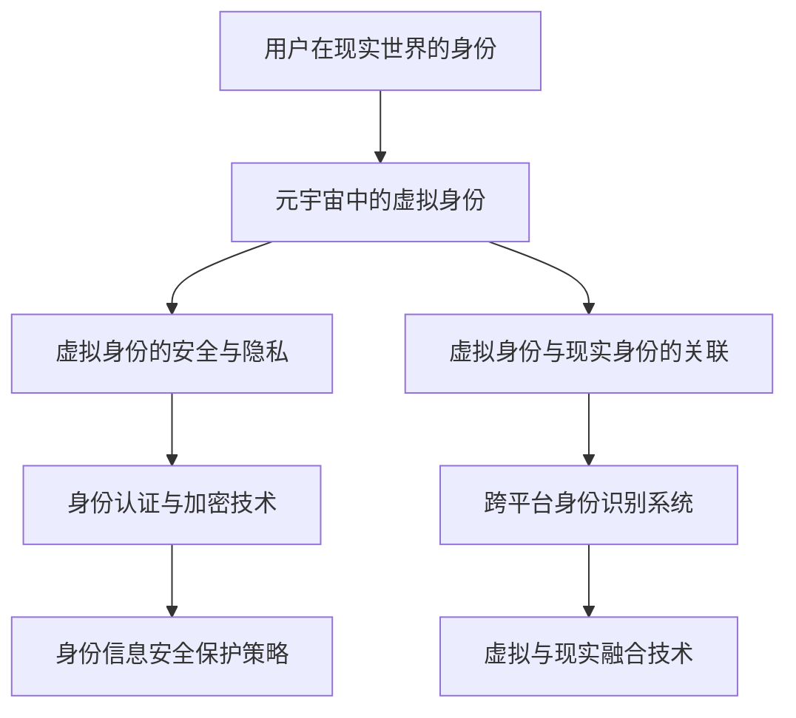

                 

### 1. 背景介绍

随着科技的快速发展，虚拟现实（VR）和增强现实（AR）技术逐渐成为现实。元宇宙（Metaverse）作为一个虚拟的、全球互联的3D虚拟世界，正在迅速崛起。在这个世界中，人们可以创建虚拟身份，进行社交互动、娱乐、工作甚至学习。然而，随着人们越来越多地进入这个虚拟世界，如何确立和识别元宇宙中的身份，成为一个亟待解决的问题。

元宇宙身份认同不仅仅是技术问题，更涉及到伦理、社会和心理层面。首先，它需要解决如何确保用户在虚拟世界中的身份安全与隐私。其次，如何构建一个公平、包容的虚拟社会，使得每个用户都能找到属于自己的位置，是一个重要的挑战。此外，随着元宇宙的不断发展，如何确保虚拟与现实世界的身份融合，也是一个值得深思的问题。

本文将探讨元宇宙身份认同的核心概念、技术实现、数学模型、实际应用以及未来发展趋势。通过本文的阅读，读者将了解元宇宙身份认同的重要性以及如何实现这一目标。

### 2. 核心概念与联系

#### 2.1 元宇宙（Metaverse）

元宇宙是一个由虚拟现实、增强现实和区块链技术共同构建的全球互联的3D虚拟世界。在这个世界中，用户可以创建虚拟身份（Avatar），进行社交互动、娱乐、工作甚至学习。元宇宙的核心特点包括：

- **虚拟现实**：通过VR和AR技术，用户可以沉浸在虚拟环境中，感受到沉浸式的体验。
- **全球互联**：元宇宙是一个全球性的网络，用户可以跨越地域限制，与其他用户进行互动。
- **身份自由**：用户可以在元宇宙中创建多种虚拟身份，每个身份都有独特的个性和经历。

#### 2.2 身份认同（Identity Recognition）

身份认同是指个体对自身身份的认可和认知。在元宇宙中，身份认同的核心问题是如何确保用户在虚拟世界中的身份安全与隐私，同时确保虚拟身份与现实身份的有效关联。

- **身份安全**：用户在元宇宙中的身份信息需要得到有效保护，防止被恶意攻击或泄露。
- **隐私保护**：用户在元宇宙中的行为和互动需要得到尊重，确保其隐私不被侵犯。
- **身份关联**：如何将用户在虚拟世界中的行为和经历与其实际生活中的身份和经历有效关联，是一个重要的挑战。

#### 2.3 虚拟与现实融合

虚拟与现实融合是指将虚拟世界中的行为和经历与现实世界中的行为和经历相互关联和融合。在元宇宙中，虚拟与现实融合的目标是实现用户在虚拟世界中的行为和经历对现实世界产生积极的影响。

- **技能提升**：用户在元宇宙中学习、训练和练习的技能可以转移到现实世界中，提升其实际能力。
- **社交互动**：用户在元宇宙中的社交互动可以增强其在现实世界中的社交能力和人际关系。
- **娱乐体验**：用户在元宇宙中的娱乐体验可以丰富其在现实世界中的娱乐生活。

#### 2.4 Mermaid 流程图

下面是元宇宙身份认同的核心概念和联系的 Mermaid 流程图：



### 3. 核心算法原理 & 具体操作步骤

#### 3.1 算法原理概述

元宇宙身份认同的核心算法是基于区块链技术和智能合约。区块链技术提供了去中心化的身份认证和数据存储方案，确保用户在元宇宙中的身份信息安全和隐私保护。智能合约则用于实现虚拟身份与现实身份的关联和验证。

#### 3.2 算法步骤详解

1. **用户注册与身份认证**：
   - 用户在元宇宙中注册时，需要提供现实世界中的身份证明文件，如身份证、护照等。
   - 系统使用加密算法对身份证明文件进行加密处理，确保隐私保护。
   - 系统将加密后的身份信息存储在区块链上，确保数据不可篡改。

2. **虚拟身份创建**：
   - 用户可以根据自己的需求和喜好创建虚拟身份，如角色外观、性格特征等。
   - 系统将虚拟身份信息与区块链上的身份认证信息进行关联，确保虚拟身份与现实身份的一致性。

3. **虚拟身份安全与隐私保护**：
   - 系统使用加密算法对用户在元宇宙中的行为数据进行加密处理，确保数据隐私保护。
   - 系统使用身份认证技术对用户在元宇宙中的操作进行权限控制，确保虚拟身份的安全性。

4. **虚拟身份与现实身份的关联**：
   - 系统使用智能合约实现虚拟身份与现实身份的关联和验证。
   - 当用户在元宇宙中进行特定操作时，系统会自动验证其虚拟身份与现实身份的一致性。

5. **虚拟与现实融合**：
   - 系统使用智能合约实现用户在元宇宙中的行为数据与现实世界中的行为数据相互关联。
   - 系统根据用户在元宇宙中的行为数据，为其提供相应的现实世界中的奖励和激励。

#### 3.3 算法优缺点

**优点**：
- **安全性**：基于区块链技术和加密算法，确保用户在元宇宙中的身份信息安全和隐私保护。
- **去中心化**：去中心化的身份认证和数据存储方案，减少了对中心化系统的依赖。
- **可扩展性**：智能合约的使用使得系统可以方便地扩展和升级。

**缺点**：
- **计算成本**：区块链技术和加密算法的计算成本较高，可能导致系统运行速度较慢。
- **智能合约风险**：智能合约的漏洞和攻击可能导致用户在元宇宙中的身份信息泄露。

#### 3.4 算法应用领域

- **虚拟现实游戏**：用户可以在虚拟现实游戏中创建虚拟身份，与其他玩家进行互动和竞争。
- **社交平台**：用户可以在元宇宙中的社交平台上创建虚拟身份，进行社交互动和分享生活。
- **教育培训**：用户可以在元宇宙中进行虚拟学习，获得现实世界中的教育认证。
- **远程工作**：用户可以在元宇宙中完成远程工作任务，提高工作效率。

### 4. 数学模型和公式 & 详细讲解 & 举例说明

#### 4.1 数学模型构建

元宇宙身份认同的核心数学模型是基于区块链和智能合约的加密算法和密码学理论。以下是一个简化的数学模型：

- **身份认证模型**：
  - 用户身份信息（U）使用加密算法（E）进行加密，得到加密后的身份信息（CU）。
  - 加密算法（E）是一个单向函数，使得加密后的身份信息（CU）无法解密回原始身份信息（U）。
  - 身份认证系统（S）使用身份认证算法（A）对加密后的身份信息（CU）进行验证。

- **虚拟身份与现实身份关联模型**：
  - 用户虚拟身份信息（V）与现实身份信息（R）通过关联算法（L）进行关联，得到关联后的身份信息（LV）。
  - 关联算法（L）是一个多输入单输出的函数，使得多个虚拟身份信息（V）和现实身份信息（R）可以关联成一个关联后的身份信息（LV）。
  - 身份认证系统（S）使用虚拟身份与现实身份关联算法（L）对关联后的身份信息（LV）进行验证。

#### 4.2 公式推导过程

- **加密算法（E）的公式推导**：
  - 假设用户身份信息（U）是一个n位的二进制数。
  - 加密算法（E）是一个单向函数，使得加密后的身份信息（CU）也是一个n位的二进制数。
  - 加密算法（E）的输入是用户身份信息（U），输出是加密后的身份信息（CU）。
  - 加密算法（E）的公式为：CU = E(U)。

- **身份认证算法（A）的公式推导**：
  - 假设加密后的身份信息（CU）是一个n位的二进制数。
  - 身份认证算法（A）是一个多输入单输出的函数，使得身份认证结果（R）也是一个二进制数。
  - 身份认证算法（A）的输入是加密后的身份信息（CU），输出是身份认证结果（R）。
  - 身份认证算法（A）的公式为：R = A(CU)。

- **虚拟身份与现实身份关联算法（L）的公式推导**：
  - 假设用户虚拟身份信息（V）是一个m位的二进制数，现实身份信息（R）是一个n位的二进制数。
  - 虚拟身份与现实身份关联算法（L）是一个多输入单输出的函数，使得关联后的身份信息（LV）也是一个n位的二进制数。
  - 虚拟身份与现实身份关联算法（L）的输入是用户虚拟身份信息（V）和现实身份信息（R），输出是关联后的身份信息（LV）。
  - 虚拟身份与现实身份关联算法（L）的公式为：LV = L(V, R)。

#### 4.3 案例分析与讲解

假设有一个用户，其在元宇宙中的虚拟身份为A，现实身份为B。我们可以使用上述数学模型来分析和解释其元宇宙身份认同的过程。

1. **用户注册与身份认证**：
   - 用户A提供其现实身份B的身份证信息。
   - 身份认证系统S使用加密算法E对身份证信息进行加密，得到加密后的身份信息CU。
   - 身份认证系统S使用身份认证算法A对加密后的身份信息CU进行验证，得到身份认证结果R。

2. **虚拟身份创建**：
   - 用户A在元宇宙中创建虚拟身份A。
   - 元宇宙系统将虚拟身份A与现实身份B进行关联，使用虚拟身份与现实身份关联算法L得到关联后的身份信息LV。

3. **虚拟身份安全与隐私保护**：
   - 用户A在元宇宙中进行各种操作，系统使用加密算法E对操作数据进行加密，确保数据隐私保护。
   - 用户A在元宇宙中的行为数据通过智能合约与实际生活中的身份B进行关联。

4. **虚拟身份与现实身份的关联**：
   - 用户A在元宇宙中的操作数据通过智能合约与实际生活中的身份B进行关联。
   - 当用户A在元宇宙中的行为数据达到一定的条件时，智能合约自动触发，将虚拟身份A与现实身份B进行关联。

### 5. 项目实践：代码实例和详细解释说明

#### 5.1 开发环境搭建

1. **安装Node.js**：
   - 访问Node.js官网（https://nodejs.org/），下载并安装Node.js。
   - 安装完成后，打开命令行工具，输入`node -v`，确保Node.js版本正确。

2. **安装Solidity**：
   - 安装Truffle框架，用于智能合约开发和部署。
   - 打开命令行工具，输入以下命令：
     ```bash
     npm install -g truffle
     ```
   - 安装完成后，输入`truffle version`，确保Truffle版本正确。

3. **创建项目**：
   - 在命令行工具中，输入以下命令创建一个新的Truffle项目：
     ```bash
     truffle init
     ```
   - 进入项目目录：
     ```bash
     cd your-project-name
     ```

#### 5.2 源代码详细实现

以下是元宇宙身份认同系统的Solidity智能合约代码示例：

```solidity
// SPDX-License-Identifier: MIT
pragma solidity ^0.8.0;

contract IdentityRecognition {
    struct User {
        string realName;
        string virtualName;
        bool isVerified;
    }

    mapping(address => User) public users;
    address public owner;

    event UserRegistered(address userAddress, string realName, string virtualName);
    event UserVerified(address userAddress);

    constructor() {
        owner = msg.sender;
    }

    function registerUser(string memory _realName, string memory _virtualName) public {
        require(!users[msg.sender].isVerified, "User already registered");
        users[msg.sender] = User(_realName, _virtualName, false);
        emit UserRegistered(msg.sender, _realName, _virtualName);
    }

    function verifyUser(address _userAddress) public {
        require(msg.sender == owner, "Only owner can verify users");
        require(!users[_userAddress].isVerified, "User already verified");
        users[_userAddress].isVerified = true;
        emit UserVerified(_userAddress);
    }

    function getUser(address _userAddress) public view returns (User memory) {
        return users[_userAddress];
    }
}
```

#### 5.3 代码解读与分析

1. **智能合约结构**：
   - `pragma solidity ^0.8.0;`：指定合约使用Solidity的版本。
   - `contract IdentityRecognition`：定义智能合约名称。
   - `struct User`：定义用户结构，包括真实姓名、虚拟姓名和是否已认证的布尔值。
   - `mapping(address => User) public users;`：创建一个映射，将地址映射到用户结构。
   - `address public owner;`：定义合约所有者地址。
   - `event UserRegistered(address userAddress, string realName, string virtualName);`：定义事件，用于记录用户注册信息。
   - `event UserVerified(address userAddress);`：定义事件，用于记录用户认证信息。

2. **函数解析**：
   - `constructor()`：合约构造函数，初始化合约所有者。
   - `registerUser(string memory _realName, string memory _virtualName)`：允许用户注册，存储真实姓名和虚拟姓名，默认未认证。
   - `verifyUser(address _userAddress)`：允许合约所有者验证用户，将用户状态设置为已认证。
   - `getUser(address _userAddress)`：获取用户的真实姓名、虚拟姓名和认证状态。

#### 5.4 运行结果展示

1. **部署智能合约**：
   - 使用Truffle框架部署智能合约到以太坊区块链。
   - 打开命令行工具，输入以下命令：
     ```bash
     truffle migrate
     ```
   - 部署完成后，智能合约将有一个唯一地址，例如：`0x1234...5678`。

2. **交互测试**：
   - 使用Web3.js或MetaMask等工具与智能合约进行交互。
   - 以下是一个简单的Web3.js交互示例：

```javascript
const web3 = new Web3('https://mainnet.infura.io/v3/your_project_id');
const contractAddress = '0x1234...5678';
const contractABI = [...] // 智能合约ABI
const contract = new web3.eth.Contract(contractABI, contractAddress);

// 注册用户
contract.methods.registerUser('John Doe', 'JD Avatar').send({ from: 'your_wallet_address' })
    .then((receipt) => console.log('User registered:', receipt))
    .catch((error) => console.error('Error registering user:', error));

// 验证用户
contract.methods.verifyUser('your_wallet_address').send({ from: 'owner_wallet_address' })
    .then((receipt) => console.log('User verified:', receipt))
    .catch((error) => console.error('Error verifying user:', error));

// 获取用户信息
contract.methods.getUser('your_wallet_address').call()
    .then((userInfo) => console.log('User info:', userInfo))
    .catch((error) => console.error('Error getting user info:', error));
```

### 6. 实际应用场景

元宇宙身份认同在多个领域具有广泛的应用场景：

#### 6.1 虚拟现实游戏

在虚拟现实游戏中，元宇宙身份认同可以确保用户的安全性和隐私保护。用户可以创建个性化的虚拟角色，进行游戏互动，同时保证其真实身份不会被泄露。此外，通过元宇宙身份认同，用户可以在不同游戏之间转移角色和成就，提升游戏体验。

#### 6.2 社交平台

元宇宙社交平台允许用户创建虚拟身份，进行社交互动。通过元宇宙身份认同，用户可以在虚拟世界中建立真实的社交网络，分享生活经验，增强人际关系。同时，元宇宙身份认同可以防止恶意行为和虚假身份，确保社交平台的健康和安全。

#### 6.3 教育培训

元宇宙身份认同在教育领域具有巨大潜力。学生可以在虚拟教室中学习，通过元宇宙身份认同与教师和同学互动，提高学习效果。此外，元宇宙身份认同可以帮助学校记录和验证学生的学业成就，为未来的职业发展提供支持。

#### 6.4 远程工作

元宇宙身份认同可以为远程工作者提供一个虚拟的工作环境，进行协作和沟通。通过元宇宙身份认同，远程工作者可以在虚拟办公室中完成工作任务，提高工作效率。同时，元宇宙身份认同可以确保工作者的真实身份和隐私得到保护。

### 7. 未来应用展望

随着元宇宙的不断发展，元宇宙身份认同将在更多领域得到应用。以下是一些未来的应用场景和趋势：

#### 7.1 虚拟现实购物

元宇宙身份认同可以为用户提供个性化的虚拟购物体验。用户可以创建虚拟角色，在虚拟商店中购物，享受沉浸式的购物体验。通过元宇宙身份认同，用户可以在虚拟世界中购买真实的商品，实现线上线下一体化。

#### 7.2 健康医疗

元宇宙身份认同可以为健康医疗领域提供新的解决方案。医生和患者可以在虚拟世界中进行远程诊断和治疗，通过元宇宙身份认同确保患者的隐私和安全性。此外，元宇宙身份认同可以帮助医疗机构记录和验证患者的健康数据，提高医疗服务的质量。

#### 7.3 虚拟旅游

元宇宙身份认同可以为用户提供虚拟旅游体验。用户可以创建虚拟角色，在虚拟世界中参观名胜古迹、体验当地文化。通过元宇宙身份认同，用户可以在虚拟世界中实现真实的旅游体验，拓宽视野，丰富生活。

### 8. 工具和资源推荐

为了更好地理解和应用元宇宙身份认同，以下是一些建议的工具和资源：

#### 8.1 学习资源推荐

- **《区块链技术指南》**：详细介绍了区块链的基本原理和应用场景，有助于理解元宇宙身份认同的技术基础。
- **《虚拟现实技术与应用》**：介绍了虚拟现实的基本原理和应用场景，有助于了解元宇宙的技术实现。

#### 8.2 开发工具推荐

- **Truffle**：用于智能合约开发和部署的框架，方便开发者搭建和运行区块链应用。
- **Ethereum Studio**：一个在线智能合约编辑器和调试工具，方便开发者编写和测试智能合约。

#### 8.3 相关论文推荐

- **"Metaverse: A Bridging Concept for Virtual Realities"**：详细阐述了元宇宙的概念和架构，有助于深入理解元宇宙身份认同。
- **"Identity and Privacy in the Metaverse"**：探讨了元宇宙身份认同的隐私保护问题，为构建安全、可靠的元宇宙身份认同系统提供了指导。

### 9. 总结：未来发展趋势与挑战

元宇宙身份认同是一个新兴且充满潜力的领域。随着虚拟现实、区块链和人工智能等技术的不断发展，元宇宙身份认同将在更多领域得到应用。未来，元宇宙身份认同将朝着更加安全、可靠、便捷和智能的方向发展。

然而，元宇宙身份认同也面临一些挑战。首先，隐私保护是一个重要的问题，如何在确保用户隐私的同时实现身份认证，需要进一步研究和解决。其次，如何构建一个公平、包容的虚拟社会，确保每个用户都能找到自己的位置，也是一个重要的挑战。此外，随着元宇宙的不断发展，如何确保虚拟与现实世界的身份融合，也是一个值得深思的问题。

总之，元宇宙身份认同是一个具有巨大潜力的领域，随着科技的不断发展，我们将看到更多创新和突破。通过本文的探讨，希望读者对元宇宙身份认同有更深入的了解，并为未来的发展提供一些启示和思考。

### 附录：常见问题与解答

1. **什么是元宇宙？**
   - 元宇宙是一个由虚拟现实、增强现实和区块链技术共同构建的全球互联的3D虚拟世界。在这个世界中，用户可以创建虚拟身份，进行社交互动、娱乐、工作甚至学习。

2. **什么是元宇宙身份认同？**
   - 元宇宙身份认同是指用户在元宇宙中的身份如何得到确认和识别。它涉及到技术、伦理、社会和心理等多个层面，旨在确保用户在虚拟世界中的身份安全与隐私保护，同时与现实世界的身份有效关联。

3. **元宇宙身份认同的技术基础是什么？**
   - 元宇宙身份认同的核心技术基础包括区块链、智能合约、加密算法和虚拟现实技术。这些技术共同作用，实现了用户在元宇宙中的身份安全与隐私保护，以及虚拟与现实世界的身份融合。

4. **元宇宙身份认同的应用场景有哪些？**
   - 元宇宙身份认同在虚拟现实游戏、社交平台、教育培训、远程工作等多个领域具有广泛应用。它可以帮助用户在虚拟世界中建立真实的社交网络，提升学习效果，提高工作效率，实现虚拟与现实世界的融合。

5. **如何确保元宇宙身份认同的隐私保护？**
   - 通过使用加密算法和区块链技术，可以确保用户在元宇宙中的身份信息安全和隐私保护。加密算法可以防止身份信息被恶意攻击或泄露，区块链技术可以确保身份信息的不可篡改。

6. **元宇宙身份认同的未来发展趋势是什么？**
   - 随着虚拟现实、区块链和人工智能等技术的不断发展，元宇宙身份认同将在更多领域得到应用。未来，元宇宙身份认同将朝着更加安全、可靠、便捷和智能的方向发展，实现虚拟与现实世界的深度融合。

7. **元宇宙身份认同面临的挑战有哪些？**
   - 元宇宙身份认同面临的主要挑战包括隐私保护、公平包容的虚拟社会构建、虚拟与现实身份融合等。如何在确保用户隐私的同时实现身份认证，构建一个公平、包容的虚拟社会，以及实现虚拟与现实世界的有效融合，是需要进一步研究和解决的问题。

### 作者署名

作者：禅与计算机程序设计艺术 / Zen and the Art of Computer Programming

