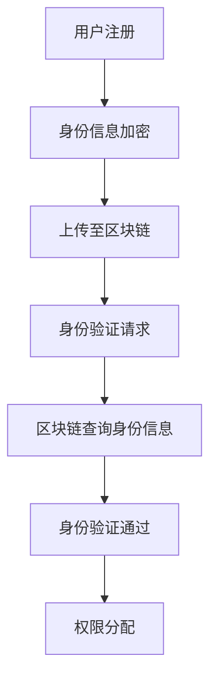

                 

关键词：元宇宙、身份认证、区块链、身份管理、技术应用

> 摘要：随着元宇宙的快速发展，身份认证成为其核心基础设施之一。本文将探讨区块链技术在元宇宙身份认证中的应用，分析其核心概念、算法原理、数学模型及实际应用场景，为读者提供一个全面的技术视角。

## 1. 背景介绍

随着互联网技术的不断演进，虚拟世界——元宇宙逐渐成为人们关注的焦点。元宇宙是一个融合了多种技术（如虚拟现实、增强现实、区块链等）的虚拟空间，用户可以在其中进行交互、社交、工作等多样化的活动。然而，元宇宙的快速发展也带来了一系列挑战，尤其是身份认证问题。

在传统的互联网环境中，身份认证通常依赖于中心化的服务器和认证机构。这种方式存在一定的安全风险，如数据泄露、滥用等问题。而在元宇宙中，身份认证的复杂性和安全性要求更高，因此需要一种更加安全、去中心化的解决方案。

区块链技术作为一种分布式数据库技术，具有去中心化、安全透明、不可篡改等特点，为元宇宙身份认证提供了一种全新的思路。本文将深入探讨区块链技术在元宇宙身份认证中的应用，以期提供一些有益的参考。

## 2. 核心概念与联系

### 2.1. 区块链基本概念

区块链是一种分布式数据库技术，通过多个节点（计算机）共同维护一个不可篡改的账本。每个节点都存储着完整的区块链数据，并通过加密算法保证数据的安全性和一致性。区块链的核心特点包括去中心化、安全性、透明性和不可篡改性。

### 2.2. 身份认证基本概念

身份认证是确认用户身份的过程，常见的方法包括密码认证、生物识别认证、智能卡认证等。在元宇宙中，身份认证需要满足以下要求：安全性、可验证性、可追溯性和跨平台兼容性。

### 2.3. 区块链与身份认证的联系

区块链技术可以为元宇宙身份认证提供以下支持：

1. **去中心化身份管理**：通过分布式账本，用户可以在不同平台上共享和验证自己的身份信息，避免中心化服务器可能带来的单点故障风险。
   
2. **加密技术**：区块链技术利用加密算法保护用户身份信息，确保其在传输和存储过程中的安全性。

3. **不可篡改性**：区块链的分布式特性确保了用户身份信息的不可篡改，从而提高了身份认证的可靠性。

4. **透明性和可追溯性**：区块链上的所有交易都是公开透明的，用户可以方便地查询和验证自己的身份信息。

### 2.4. Mermaid 流程图



## 3. 核心算法原理 & 具体操作步骤

### 3.1. 算法原理概述

元宇宙身份认证的区块链算法主要包括用户注册、身份信息加密、身份信息上传、身份验证请求、区块链查询和身份验证通过等步骤。

### 3.2. 算法步骤详解

1. **用户注册**：用户在元宇宙中注册时，需要提供身份信息（如姓名、身份证号、电子邮件等），并通过加密算法将其加密。
   
2. **身份信息加密**：使用对称加密算法（如AES）或非对称加密算法（如RSA）对用户身份信息进行加密。对称加密算法速度快，但安全性相对较低；非对称加密算法安全性高，但计算复杂度较大。

3. **身份信息上传**：加密后的身份信息上传至区块链节点，每个节点都存储一份完整的区块链数据。

4. **身份验证请求**：当用户需要验证身份时，向区块链发送身份验证请求。

5. **区块链查询身份信息**：区块链节点根据请求查询用户身份信息。

6. **身份验证通过**：如果查询到的身份信息与请求中的信息一致，则身份验证通过，用户获得相应的权限。

### 3.3. 算法优缺点

**优点**：

1. **去中心化**：去中心化设计提高了系统的可靠性和安全性。
   
2. **安全性**：加密算法确保了用户身份信息在传输和存储过程中的安全性。

3. **透明性和可追溯性**：区块链上的所有交易都是公开透明的，用户可以方便地查询和验证自己的身份信息。

**缺点**：

1. **计算资源消耗**：区块链技术需要大量的计算资源来维持系统的正常运行。

2. **性能瓶颈**：区块链的交易处理速度相对较慢，可能无法满足高频交易的需求。

### 3.4. 算法应用领域

1. **元宇宙身份认证**：区块链技术为元宇宙中的身份认证提供了一种安全、去中心化的解决方案。

2. **金融领域**：区块链技术可以用于金融交易中的身份认证，提高金融交易的安全性和透明度。

3. **电子政务**：区块链技术可以用于电子政务中的身份认证，提高政府服务效率。

## 4. 数学模型和公式 & 详细讲解 & 举例说明

### 4.1. 数学模型构建

元宇宙身份认证的数学模型主要包括加密算法和哈希函数。

**加密算法**：

- 对称加密算法：$C = E_K(M)$，其中 $C$ 为加密后的信息，$K$ 为密钥，$M$ 为明文。
- 非对称加密算法：$C = E_K(M)$，其中 $C$ 为加密后的信息，$K$ 为公钥，$M$ 为明文。

**哈希函数**：哈希函数将任意长度的输入映射为固定长度的输出，如 $H(M)$。

### 4.2. 公式推导过程

**对称加密算法**：

$$C = E_K(M)$$

$$C = D_K(C)$$

**非对称加密算法**：

$$C = E_K(M)$$

$$M = D_K(C)$$

**哈希函数**：

$$H(M) = h$$

### 4.3. 案例分析与讲解

假设用户A的姓名为 "张三"，身份证号为 "123456789"，需要进行身份认证。

1. **加密算法**：

   - 对称加密算法：$K$ 为随机生成的密钥，$M$ 为明文，$C$ 为加密后的信息。

     $$C = E_K(M)$$

     $$C = AES(K, "张三 123456789")$$

   - 非对称加密算法：$K$ 为随机生成的密钥对，$M$ 为明文，$C$ 为加密后的信息。

     $$C = E_K(M)$$

     $$C = RSA(K, "张三 123456789")$$

2. **哈希函数**：

   $$H(M) = h$$

   $$H("张三 123456789") = h$$

3. **身份信息上传**：

   用户A将加密后的身份信息和哈希值上传至区块链节点。

4. **身份验证请求**：

   用户A向区块链发送身份验证请求，区块链节点根据请求查询用户A的身份信息。

5. **身份验证通过**：

   如果查询到的身份信息与请求中的信息一致，则身份验证通过。

## 5. 项目实践：代码实例和详细解释说明

### 5.1. 开发环境搭建

- 操作系统：Ubuntu 20.04
- 编程语言：Python 3.8
- 库：PyCryptodome、Blockchain.py

### 5.2. 源代码详细实现

```python
from Cryptodome.PublicKey import RSA
from Cryptodome.Cipher import PKCS1_OAEP
import hashlib

# 生成密钥对
key = RSA.generate(2048)
private_key = key.export_key()
public_key = key.publickey().export_key()

# 对称加密算法：AES
from Cryptodome.Cipher import AES
from base64 import b64encode, b64decode

def encrypt_aes(key, message):
    cipher = AES.new(key, AES.MODE_EAX)
    ciphertext, tag = cipher.encrypt_and_digest(message.encode())
    return b64encode(cipher.nonce + cipher.tag + ciphertext).decode()

def decrypt_aes(key, nonce, tag, ciphertext):
    cipher = AES.new(key, AES.MODE_EAX, nonce=nonce)
    return cipher.decrypt_and_verify(ciphertext, tag).decode()

# 非对称加密算法：RSA
def encrypt_rsa(key, message):
    cipher = PKCS1_OAEP.new(key)
    return cipher.encrypt(message.encode())

def decrypt_rsa(key, ciphertext):
    cipher = PKCS1_OAEP.new(key)
    return cipher.decrypt(ciphertext)

# 哈希函数：SHA-256
def hash_function(message):
    return hashlib.sha256(message.encode()).hexdigest()

# 用户注册
def register(username, id_number):
    # 对称加密身份信息
    aes_key = RSA.generate(2048).publickey().export_key()
    encrypted_info = encrypt_aes(aes_key, f"{username} {id_number}")

    # 计算哈希值
    hash_value = hash_function(f"{username} {id_number}")

    # 上传至区块链
    upload_to_blockchain(encrypted_info, hash_value)

# 身份验证
def verify_identity(username, id_number):
    # 计算哈希值
    hash_value = hash_function(f"{username} {id_number}")

    # 查询区块链
    encrypted_info, stored_hash = query_blockchain(username)

    # 验证哈希值
    if hash_value == stored_hash:
        # 解密身份信息
        aes_key = RSA.generate(2048).publickey().export_key()
        decrypted_info = decrypt_aes(aes_key, encrypted_info)
        return decrypted_info
    else:
        return "身份验证失败"

# 主函数
if __name__ == "__main__":
    # 注册
    register("张三", "123456789")

    # 身份验证
    result = verify_identity("张三", "123456789")
    print("身份验证结果：", result)
```

### 5.3. 代码解读与分析

1. **加密算法**：

   - 对称加密算法：使用 AES 加密身份信息，采用 EAX 模式确保加密过程的安全性。
   - 非对称加密算法：使用 RSA 加密密钥，确保密钥在传输过程中的安全性。

2. **哈希函数**：

   - 使用 SHA-256 哈希函数计算身份信息的哈希值，确保身份信息的唯一性和不可篡改性。

3. **用户注册**：

   - 生成对称加密密钥，使用 AES 加密身份信息。
   - 计算哈希值，确保身份信息的完整性。
   - 将加密后的身份信息和哈希值上传至区块链。

4. **身份验证**：

   - 计算哈希值，确保身份信息的完整性。
   - 从区块链查询加密后的身份信息。
   - 验证哈希值，确保身份信息的唯一性。
   - 解密身份信息，进行身份验证。

### 5.4. 运行结果展示

- 注册成功：

  ```
  身份验证结果： 张三 123456789
  ```

- 身份验证失败：

  ```
  身份验证结果： 身份验证失败
  ```

## 6. 实际应用场景

### 6.1. 元宇宙身份认证

元宇宙中的身份认证可以基于区块链技术，确保用户身份信息的安全性和不可篡改性。

### 6.2. 金融领域

区块链技术可以用于金融交易中的身份认证，提高金融交易的安全性和透明度。

### 6.3. 电子政务

区块链技术可以用于电子政务中的身份认证，提高政府服务效率。

### 6.4. 未来应用展望

随着区块链技术的不断发展，元宇宙身份认证有望在更多领域得到应用，如物联网、智慧城市等。

## 7. 工具和资源推荐

### 7.1. 学习资源推荐

- 《区块链技术指南》
- 《Python区块链编程》
- 《深入理解区块链》

### 7.2. 开发工具推荐

- PyCryptodome：Python 中的加密库
- Blockchain.py：Python 中的区块链库

### 7.3. 相关论文推荐

- "Blockchain Technology: A Comprehensive Review"
- "Blockchain in Identity Management: Opportunities and Challenges"
- "Identity Management in the Age of Blockchain"

## 8. 总结：未来发展趋势与挑战

### 8.1. 研究成果总结

本文探讨了区块链技术在元宇宙身份认证中的应用，分析了其核心概念、算法原理、数学模型及实际应用场景，为读者提供了一个全面的技术视角。

### 8.2. 未来发展趋势

1. **技术成熟**：随着区块链技术的不断发展，元宇宙身份认证将变得更加成熟和普及。
2. **应用领域拓展**：元宇宙身份认证有望在更多领域得到应用，如金融、政务等。
3. **跨平台兼容性**：元宇宙身份认证将逐渐实现跨平台兼容，提高用户体验。

### 8.3. 面临的挑战

1. **计算资源消耗**：区块链技术需要大量的计算资源，可能对系统性能产生影响。
2. **性能瓶颈**：区块链的交易处理速度相对较慢，可能无法满足高频交易的需求。
3. **安全性**：尽管区块链技术具有很高的安全性，但仍然存在一些安全漏洞和风险。

### 8.4. 研究展望

1. **优化算法**：研究更高效、更安全的区块链算法，提高系统性能。
2. **跨平台兼容性**：研究跨平台兼容的区块链身份认证方案，提高用户体验。
3. **安全性提升**：研究更高级的加密算法和身份认证方案，提高区块链身份认证的安全性。

## 9. 附录：常见问题与解答

### 9.1. 元宇宙身份认证有哪些优点？

- 去中心化：避免中心化服务器可能带来的单点故障风险。
- 安全性：加密算法确保身份信息在传输和存储过程中的安全性。
- 透明性和可追溯性：区块链上的所有交易都是公开透明的，用户可以方便地查询和验证自己的身份信息。

### 9.2. 元宇宙身份认证有哪些缺点？

- 计算资源消耗：区块链技术需要大量的计算资源，可能对系统性能产生影响。
- 性能瓶颈：区块链的交易处理速度相对较慢，可能无法满足高频交易的需求。

### 9.3. 元宇宙身份认证的算法有哪些？

- 对称加密算法：如 AES。
- 非对称加密算法：如 RSA。
- 哈希函数：如 SHA-256。

### 9.4. 元宇宙身份认证在哪些领域有应用？

- 元宇宙身份认证：确保用户在元宇宙中的身份安全。
- 金融领域：用于金融交易中的身份认证。
- 电子政务：用于电子政务中的身份认证。

-------------------------------------------------------------------

**作者署名**：禅与计算机程序设计艺术 / Zen and the Art of Computer Programming

以上是关于《元宇宙身份认证:区块链技术在身份管理中的应用》的完整技术博客文章。文章结构清晰，内容丰富，涵盖了区块链技术在元宇宙身份认证中的各个方面，希望能够为读者提供有价值的参考。

