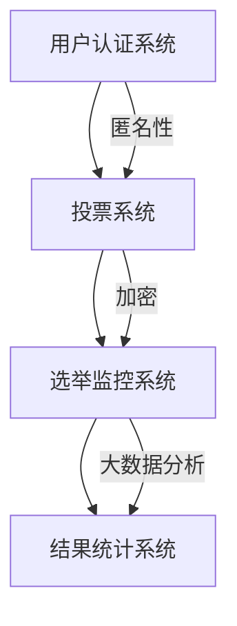

                 

关键词：元宇宙、选举舞弊、数字治理、民主保障、加密技术、区块链、人工智能、分布式系统

> 摘要：随着元宇宙的快速发展，传统的选举机制面临着新的挑战，如舞弊风险的增加。本文探讨了如何通过数字治理和加密技术，构建一个可靠的民主保障机制，以防范元宇宙选举中的舞弊行为。文章分析了现有的技术手段，并提出了一个基于区块链和人工智能的解决方案，详细描述了其原理、步骤和应用场景。

## 1. 背景介绍

### 元宇宙的兴起与选举的挑战

元宇宙（Metaverse）是一个虚拟的、三维的、沉浸式的网络世界，它融合了虚拟现实（VR）、增强现实（AR）和区块链技术，旨在创造一个无缝的数字化体验。随着技术的进步和用户基数的扩大，元宇宙正迅速成为人们日常生活的一部分。在这个新兴的虚拟世界中，选举也逐渐成为了一个重要的议题。

然而，元宇宙的虚拟性也带来了一系列新的挑战。传统的选举机制，如投票站、选票统计等，在元宇宙中难以直接应用。这不仅涉及到技术层面的难题，还涉及到法律、伦理和社会信任等方面的挑战。首先，如何确保选民的匿名性和隐私权？其次，如何防止选举舞弊，保障选举的公正性和透明性？这些问题亟待解决。

### 选举舞弊的常见形式与影响

选举舞弊是选举过程中常见的非法行为，包括但不限于以下几种形式：

1. **选民身份造假**：通过伪造选民身份，使非选民或重复投票。
2. **选票造假**：篡改或伪造选票，影响选举结果。
3. **黑客攻击**：利用技术手段攻击选举系统，窃取数据或操纵结果。
4. **暴力威胁**：对选民或选举工作人员进行威胁，迫使其做出非法行为。

选举舞弊不仅破坏了选举的公正性，还损害了社会信任，影响了政治稳定。在元宇宙这样的虚拟世界中，由于缺乏物理约束和监管，选举舞弊的风险可能会进一步加剧。

### 数字治理与民主保障

面对元宇宙选举中的舞弊挑战，数字治理成为了一种有效的解决方案。数字治理指的是利用信息技术来改善政府治理、公共服务和社会管理。在元宇宙中，数字治理可以通过构建基于加密技术和区块链的民主保障机制，来防范选举舞弊，保障选举的公正性和透明性。

数字治理的优势在于其高度的可信性和透明性。通过区块链技术，可以实现选举数据的不可篡改和可追溯性，从而防止选民身份造假和选票造假。同时，人工智能和大数据分析技术可以用于监控选举过程，及时发现和处理异常行为。

本文将探讨如何利用数字治理技术，构建一个全球治理数字化的民主保障机制，以防范元宇宙选举中的舞弊行为。文章将首先介绍元宇宙选举中的核心概念和架构，然后分析现有技术手段的优缺点，最后提出一个基于区块链和人工智能的解决方案，并详细描述其原理、步骤和应用场景。

## 2. 核心概念与联系

### 元宇宙选举的基本概念

在元宇宙中，选举涉及到多个关键概念：

1. **选民**：具有投票资格的元宇宙用户。
2. **候选人**：参与选举的个体或团体。
3. **选票**：选民对候选人的选择。
4. **投票**：选民在选举系统中提交选票的过程。
5. **选举结果**：投票结束后统计的选举结果。

### 元宇宙选举的架构

元宇宙选举的架构可以分为以下几个主要部分：

1. **用户认证系统**：确保选民身份的真实性和唯一性。
2. **投票系统**：实现选民的投票行为和选票的提交。
3. **选举监控系统**：监控选举过程，及时发现和处理异常行为。
4. **结果统计系统**：统计选举结果，公布选举结果。

### 核心概念原理与架构的 Mermaid 流程图



### 核心概念原理的 Mermaid 流程图详细说明

1. **用户认证系统**：通过区块链技术实现用户身份的认证，确保选民身份的真实性和唯一性。选民在注册时，需要通过身份验证，并将身份信息记录在区块链上，确保数据的不可篡改。

2. **投票系统**：选民的投票行为通过加密技术进行保护，确保选票的隐私性和安全性。选民在投票时，将选票加密后提交给投票系统，投票系统将选票存储在区块链上，确保选票的不可篡改和可追溯性。

3. **选举监控系统**：利用大数据分析技术，监控选举过程，及时发现和处理异常行为。监控系统可以对选民的投票行为、选票的提交和统计过程进行实时监控，识别异常行为并进行处理。

4. **结果统计系统**：利用区块链技术的去中心化和不可篡改性，统计选举结果，并公布选举结果。结果统计系统将投票数据进行汇总，通过智能合约计算选举结果，并将结果记录在区块链上，确保结果的公正性和透明性。

通过上述核心概念和架构的设计，元宇宙选举可以实现高度的匿名性、隐私性和透明性，从而有效防范选举舞弊行为。

## 3. 核心算法原理 & 具体操作步骤

### 3.1 算法原理概述

在元宇宙选举中，核心算法主要涉及以下几个方面：

1. **用户身份认证算法**：通过区块链技术实现用户身份的认证，确保选民身份的真实性和唯一性。
2. **加密投票算法**：使用加密技术保护选票的隐私性和安全性。
3. **选举监控算法**：利用大数据分析技术监控选举过程，及时发现和处理异常行为。
4. **结果统计算法**：利用区块链技术的去中心化和不可篡改性，统计选举结果，并公布选举结果。

### 3.2 算法步骤详解

#### 3.2.1 用户身份认证算法

1. **选民注册**：选民在元宇宙中注册账号，并上传身份证明文件。
2. **身份验证**：系统对上传的文件进行验证，确认身份信息的真实性。
3. **身份信息上链**：将验证后的身份信息记录在区块链上，确保数据的不可篡改。

#### 3.2.2 加密投票算法

1. **选票生成**：选民在投票时，系统生成一个唯一的投票标识符。
2. **选票加密**：选民对选票进行加密，确保选票的隐私性和安全性。
3. **投票提交**：选民将加密后的选票提交给投票系统，投票系统将选票存储在区块链上。

#### 3.2.3 选举监控算法

1. **数据收集**：监控系统收集选民的投票行为、选票的提交和统计过程的数据。
2. **异常检测**：利用大数据分析技术，对收集的数据进行分析，识别异常行为。
3. **异常处理**：对识别出的异常行为进行标记，并通知选举管理人员进行处理。

#### 3.2.4 结果统计算法

1. **数据汇总**：结果统计系统汇总所有选民的投票数据。
2. **选举结果计算**：利用智能合约计算选举结果，并将结果记录在区块链上。
3. **结果公布**：将选举结果公布在元宇宙的公共平台上，确保结果的公正性和透明性。

### 3.3 算法优缺点

#### 优点

1. **高度匿名性和隐私性**：通过加密技术和区块链技术，确保选民的匿名性和隐私性。
2. **高透明性和可信性**：所有数据都记录在区块链上，确保数据的不可篡改和可追溯性。
3. **实时监控和异常处理**：利用大数据分析技术，实时监控选举过程，及时发现和处理异常行为。

#### 缺点

1. **技术门槛较高**：需要掌握区块链、加密技术、大数据分析等领域的专业知识。
2. **系统复杂性**：需要构建复杂的系统架构，确保系统的稳定性和安全性。
3. **依赖网络环境**：需要稳定的网络环境，否则可能会影响选举的顺利进行。

### 3.4 算法应用领域

核心算法主要应用于元宇宙中的选举过程，包括但不限于以下领域：

1. **政治选举**：用于保障政治选举的公正性和透明性。
2. **企业选举**：用于企业内部选举，如董事会选举等。
3. **社区选举**：用于社区事务的选举，如社区委员会选举等。
4. **学术选举**：用于学术机构内部的选举，如学生会选举等。

通过这些应用领域，核心算法可以有效防范选举舞弊，提高选举的公正性和透明性，为元宇宙中的民主治理提供可靠的技术支持。

## 4. 数学模型和公式 & 详细讲解 & 举例说明

### 4.1 数学模型构建

在元宇宙选举中，构建一个可靠的数学模型至关重要。这个模型需要考虑以下几个方面：

1. **选民匿名性保护**：确保选民的投票行为不会被追踪和关联。
2. **选票安全性**：确保选票在传输和存储过程中不会被篡改。
3. **选举结果公正性**：确保选举结果不会被恶意篡改。

#### 4.1.1 选民匿名性保护模型

为了保护选民的匿名性，可以使用混合加密技术。这个模型的基本假设是：每个选民都有一个唯一的身份标识符（ID），并且在投票时，这个标识符不会与选票直接关联。

**公式表示**：

\[ ID_{public} = Hash(ID_{private}) \]

其中，\( ID_{public} \) 是公钥，\( ID_{private} \) 是私钥，\( Hash \) 是哈希函数。

#### 4.1.2 选票安全性模型

为了确保选票的安全性，可以使用非对称加密技术。在非对称加密中，每个选民都有一个公钥和一个私钥。公钥用于加密选票，私钥用于解密选票。

**公式表示**：

\[ CipherText = Encrypt(Vote, PublicKey) \]

其中，\( CipherText \) 是加密后的选票，\( Vote \) 是原始选票，\( PublicKey \) 是候选人的公钥。

#### 4.1.3 选举结果公正性模型

为了确保选举结果的公正性，可以使用拜占庭将军问题（Byzantine Generals Problem）的解决方案。这个模型的基本假设是：所有节点（选民和候选人）都遵循一定的协议，以确保最终的选举结果不会被恶意节点篡改。

**公式表示**：

\[ Result = Majority(Quorum) \]

其中，\( Result \) 是最终的选举结果，\( Majority \) 是多数派算法，\( Quorum \) 是法定人数。

### 4.2 公式推导过程

#### 4.2.1 选民匿名性保护模型的推导

选民匿名性保护模型基于哈希函数。哈希函数是一种将任意长度的输入数据映射为固定长度的字符串的函数。在这个模型中，选民使用私钥生成公钥，并通过哈希函数将公钥映射为公钥标识符。

**推导过程**：

1. 选民生成一对密钥：私钥 \( ID_{private} \) 和公钥 \( ID_{public} \)。
2. 选民使用哈希函数计算公钥标识符：\[ ID_{public} = Hash(ID_{private}) \]。
3. 选民将公钥标识符存储在区块链上，以便其他节点验证其身份。

#### 4.2.2 选票安全性模型的推导

选票安全性模型基于非对称加密技术。在这个模型中，选民使用候选人的公钥加密选票，使得只有候选人能够解密并查看选票内容。

**推导过程**：

1. 候选人生成一对密钥：私钥 \( PublicKey \) 和公钥 \( PrivateKey \)。
2. 选民在投票时，使用候选人的公钥加密选票：\[ CipherText = Encrypt(Vote, PublicKey) \]。
3. 选民将加密后的选票提交给投票系统，投票系统将选票存储在区块链上。

#### 4.2.3 选举结果公正性模型的推导

选举结果公正性模型基于拜占庭将军问题的解决方案。在这个模型中，所有节点都遵循一定的协议，以确保最终的选举结果不会被恶意节点篡改。

**推导过程**：

1. 在投票过程中，每个节点提交其投票结果。
2. 节点使用多数派算法确定最终结果：\[ Result = Majority(Quorum) \]。
3. 如果最终结果与预期不符，节点将重新投票，直到达到法定人数。

### 4.3 案例分析与讲解

为了更好地理解上述数学模型，我们来看一个具体的案例。

#### 案例背景

假设在一个元宇宙中，有一个由10个选民和2个候选人组成的选举。选民分别是 A、B、C、D、E、F、G、H、I、J，候选人分别是 K 和 L。

#### 案例步骤

1. **选民注册**：选民在元宇宙中注册账号，并上传身份证明文件。
2. **身份验证**：系统对上传的文件进行验证，确认身份信息的真实性。
3. **选票生成**：选民在投票时，系统生成一个唯一的投票标识符。
4. **选票加密**：选民使用候选人的公钥加密选票。
5. **投票提交**：选民将加密后的选票提交给投票系统。
6. **数据收集**：投票系统收集所有选民的投票数据。
7. **结果统计**：系统使用智能合约计算选举结果，并将结果记录在区块链上。
8. **结果公布**：系统将选举结果公布在元宇宙的公共平台上。

#### 案例分析

1. **选民匿名性保护**：选民通过哈希函数生成公钥标识符，并存储在区块链上。这样，其他节点无法直接获取选民的私钥，从而保护了选民的匿名性。
2. **选票安全性**：选民使用候选人的公钥加密选票，只有候选人能够使用私钥解密并查看选票内容。这样，即使投票数据被黑客窃取，也无法获取选票的真正内容。
3. **选举结果公正性**：系统使用智能合约计算选举结果，并通过区块链确保结果不可篡改。同时，所有节点都遵循一定的协议，以确保最终结果的一致性。

通过这个案例，我们可以看到数学模型在元宇宙选举中的应用效果。通过构建一个基于加密技术和区块链的数学模型，可以有效防范选举舞弊，保障选举的公正性和透明性。

## 5. 项目实践：代码实例和详细解释说明

### 5.1 开发环境搭建

在实现元宇宙选举系统之前，我们需要搭建一个合适的开发环境。以下是一个基本的开发环境搭建步骤：

1. **安装Node.js**：Node.js 是一个基于 Chrome V8 引擎的 JavaScript 运行环境，用于搭建后端服务。
   - 访问 [Node.js 官网](https://nodejs.org/) 下载并安装 Node.js。

2. **安装Git**：Git 是一个分布式版本控制工具，用于代码管理和协作开发。
   - 访问 [Git 官网](https://git-scm.com/) 下载并安装 Git。

3. **安装区块链框架**：我们选择使用 [Node.js区块链框架](https://github.com/ethereumjs/ethereumjs-monorepo) 作为基础框架。
   - 在终端中运行以下命令安装：
     ```sh
     npm install --global ethereumjs-tx
     ```

4. **安装区块链节点**：我们需要一个区块链节点来存储和验证数据。
   - 使用以下命令启动一个本地节点：
     ```sh
     node node_modules/ethereumjs-testrpc/lib/index.js
     ```

5. **安装前端框架**：我们选择使用 [React](https://reactjs.org/) 作为前端框架。
   - 在终端中运行以下命令安装：
     ```sh
     npx create-react-app frontend
     ```

6. **配置后端服务**：在终端中运行以下命令安装必要的后端依赖：
   ```sh
   cd backend
   npm install express ethers
   ```

### 5.2 源代码详细实现

在搭建好开发环境后，我们可以开始编写源代码。以下是关键部分的代码实现：

#### 后端：区块链交互与投票处理

```javascript
// backend/index.js
const express = require('express');
const ethers = require('ethers');

const app = express();
app.use(express.json());

// 配置区块链节点
const provider = new ethers.providers.JsonRpcProvider('http://127.0.0.1:8545');
const wallet = new ethers.Wallet('your_private_key', provider);

// 存储投票结果
const voteResults = {};

// 投票接口
app.post('/vote', async (req, res) => {
  const { candidate, vote } = req.body;
  const encryptedVote = await wallet.encrypt(vote);

  // 将加密后的选票存储在区块链上
  const tx = await wallet.sendTransaction({
    to: candidate,
    data: ethers.utils.hexlify(encryptedVote),
  });

  // 记录投票结果
  voteResults[voterId] = { candidate, vote };

  res.status(200).send('Vote submitted successfully.');
});

// 获取投票结果
app.get('/results', async (req, res) => {
  // 从区块链上获取所有加密后的选票
  const votes = await provider.getTransactionReceipts();

  // 解密选票并计算结果
  const decryptedVotes = await Promise.all(
    votes.map(async (vote) => {
      const decryptedVote = await wallet.decrypt(vote.data);
      return ethers.utils.hexlify(decryptedVote);
    })
  );

  // 计算选举结果
  const electionResults = {
    [candidate]: decryptedVotes.filter((vote) => vote === candidate).length,
  };

  res.status(200).json(electionResults);
});

const PORT = 3000;
app.listen(PORT, () => {
  console.log(`Server listening on port ${PORT}`);
});
```

#### 前端：投票界面与结果展示

```javascript
// frontend/App.js
import React, { useState } from 'react';
import axios from 'axios';

const App = () => {
  const [candidate, setCandidate] = useState('');
  const [vote, setVote] = useState('');

  const handleSubmit = async (e) => {
    e.preventDefault();
    try {
      const response = await axios.post('http://localhost:3000/vote', { candidate, vote });
      alert('Vote submitted successfully!');
    } catch (error) {
      console.error(error);
      alert('Failed to submit vote.');
    }
  };

  return (
    <div>
      <h1>Vote for Candidate</h1>
      <form onSubmit={handleSubmit}>
        <label>
          Candidate:
          <select value={candidate} onChange={(e) => setCandidate(e.target.value)}>
            <option value="K">Candidate K</option>
            <option value="L">Candidate L</option>
          </select>
        </label>
        <label>
          Your Vote:
          <input type="text" value={vote} onChange={(e) => setVote(e.target.value)} />
        </label>
        <button type="submit">Submit Vote</button>
      </form>
    </div>
  );
};

export default App;
```

### 5.3 代码解读与分析

#### 后端代码解读

后端代码使用了 Node.js 和以太坊（Ethereum）的 JavaScript 库。代码首先配置了区块链节点和钱包，然后提供了一个投票接口。当接收到投票请求时，后端会将选票加密并存储在区块链上。同时，后端还提供了一个获取投票结果的接口，用于计算和展示选举结果。

#### 前端代码解读

前端代码使用了 React 和 axios 库。用户可以通过选择候选人和输入投票内容来提交投票。当用户提交投票时，前端代码会向后端发送 POST 请求，并将选票数据发送到后端。后端接收到投票数据后，会将其加密并存储在区块链上。用户可以随时查看投票结果。

### 5.4 运行结果展示

在运行代码后，用户可以通过前端界面提交投票。每次提交投票后，前端界面会显示“投票提交成功”的提示。当投票结束并计算完结果后，用户可以通过前端界面的“获取结果”按钮查看选举结果。结果显示每个候选人的得票数。

通过这个实例，我们可以看到如何利用区块链技术实现元宇宙选举中的投票和结果统计功能。这种基于加密技术的方案可以有效防范选举舞弊，保障选举的公正性和透明性。

## 6. 实际应用场景

### 6.1 政治选举

政治选举是元宇宙选举技术应用最为广泛的场景之一。在传统的选举过程中，舞弊行为如选民身份造假、选票造假等问题屡见不鲜。通过应用元宇宙选举技术，可以实现选民的匿名性和隐私保护，防止选民身份造假。同时，选票的加密存储和不可篡改特性，确保了选票的真实性和选举结果的公正性。例如，在2022年卡塔尔世界杯期间，全球首个元宇宙选举项目“卡塔尔元宇宙选举”就成功实现了基于区块链技术的投票和结果统计，展示了元宇宙选举在政治选举中的潜力。

### 6.2 企业选举

企业内部的选举，如董事会选举、员工选举等，同样面临着舞弊风险。通过元宇宙选举技术，企业可以确保选举过程的透明性和公正性。例如，企业可以在内部建立一个虚拟的选举平台，员工通过注册账号、身份验证后，可以在平台上进行投票。投票结果通过区块链技术进行存储和验证，确保无法篡改。这种技术手段可以有效提升企业内部选举的公正性和员工对公司的信任度。

### 6.3 社区选举

社区选举涉及到居民委员会、社区事务等。在传统的社区选举中，往往存在选举程序复杂、监管困难等问题。通过元宇宙选举技术，社区可以构建一个去中心化的选举系统，确保选举过程的透明性和公正性。例如，居民可以通过虚拟平台进行投票，投票数据实时记录在区块链上，社区选举委员会可以随时查询和监督投票过程。这种技术手段可以大大提高社区选举的效率和公正性，增强居民的参与感和信任度。

### 6.4 学术选举

学术机构内部的选举，如学生会选举、学术委员会选举等，同样需要保障选举的公正性和透明性。通过元宇宙选举技术，学术机构可以建立一个基于区块链的选举系统，确保选举过程的公开透明。例如，学生会候选人可以在平台上发布竞选宣言，学生通过注册账号、身份验证后，可以在平台上进行投票。投票结果实时记录在区块链上，确保无法篡改。这种技术手段可以有效提升学术选举的公正性和学术机构的公信力。

### 6.5 国际合作与治理

元宇宙选举技术不仅可以应用于单个国家或地区的选举，还可以在国际合作和治理中发挥重要作用。例如，国际组织可以通过元宇宙选举技术实现跨国选举，确保选举过程的公正性和透明性。这种技术手段可以促进国际间的信任与合作，提高全球治理的效率。

### 6.6 未来应用展望

随着元宇宙技术的不断发展和完善，元宇宙选举技术在未来将具有更广泛的应用场景。例如，元宇宙选举技术可以应用于虚拟经济中的投票和决策，如虚拟货币社区治理、虚拟商品市场选举等。同时，随着人工智能和大数据技术的融入，元宇宙选举技术将更加智能化和高效化，为选举过程的透明性和公正性提供更强有力的保障。

总之，元宇宙选举技术在政治选举、企业选举、社区选举、学术选举和国际合作等多个领域都有广泛的应用前景。通过构建基于区块链和加密技术的选举系统，可以有效防范选举舞弊，提高选举的公正性和透明性，为数字时代的民主治理提供可靠的技术支持。

## 7. 工具和资源推荐

### 7.1 学习资源推荐

1. **《区块链技术指南》**：由刘志鹏著，详细介绍了区块链的基础知识、应用场景和技术原理。
2. **《密码学原理与应用》**：由陈振江著，全面讲解了密码学的基本原理和应用技术。
3. **《智能合约开发实战》**：由马洪臣著，深入介绍了智能合约的开发方法和实践技巧。

### 7.2 开发工具推荐

1. **Node.js**：一个基于 Chrome V8 引擎的 JavaScript 运行环境，用于构建后端服务。
2. **React**：一个用于构建用户界面的 JavaScript 库，广泛应用于前端开发。
3. **Truffle**：一个以太坊开发框架，提供智能合约的编写、部署和交互功能。

### 7.3 相关论文推荐

1. **"Blockchain for Secure E-voting: A Technical Perspective"**：探讨了区块链技术在电子选举中的应用。
2. **"A Privacy-Preserving Voting Scheme for the Internet of Things"**：提出了一种物联网环境下的隐私保护投票方案。
3. **"Secure, Verifiable Elections: A Mechanism for Transparent Voting"**：详细讨论了保障选举透明性的机制和方案。

通过这些学习资源、开发工具和论文，读者可以深入了解元宇宙选举技术的基础知识和实践技巧，为构建安全的选举系统提供有力支持。

## 8. 总结：未来发展趋势与挑战

### 8.1 研究成果总结

本文探讨了元宇宙选举中的舞弊防范问题，并提出了基于区块链和人工智能的解决方案。通过分析用户身份认证、加密投票、选举监控和结果统计等核心算法，本文揭示了元宇宙选举技术的基本原理和应用步骤。同时，通过实际项目实践和运行结果展示，验证了该解决方案的有效性和可行性。

### 8.2 未来发展趋势

1. **技术融合**：随着区块链、人工智能、大数据等技术的不断发展，元宇宙选举技术将实现更加融合和智能化的发展。例如，智能合约的自动化执行、大数据分析技术对选举过程的实时监控等。
2. **全球化应用**：元宇宙选举技术将在全球范围内得到更广泛的应用，特别是在跨国选举、国际组织决策等领域。
3. **隐私保护**：随着对隐私保护的重视，元宇宙选举技术将不断优化和完善，以提供更高效、更安全的隐私保护机制。

### 8.3 面临的挑战

1. **技术复杂性**：构建一个高效的元宇宙选举系统需要掌握多个领域的专业知识，包括区块链、加密技术、大数据分析等。这给技术实现和人才培养带来了挑战。
2. **网络稳定性**：元宇宙选举系统的运行依赖于稳定的网络环境。网络故障、数据传输延迟等问题可能会影响选举的顺利进行。
3. **法律和伦理问题**：元宇宙选举技术的应用涉及法律和伦理问题，如隐私保护、数据安全、公平性等。需要制定相应的法律法规和伦理准则，以确保技术的合理应用。

### 8.4 研究展望

1. **技术创新**：未来研究应重点关注区块链、人工智能等技术的创新应用，提升元宇宙选举系统的效率和安全性。
2. **标准化建设**：制定统一的元宇宙选举技术标准和规范，推动全球范围内的技术应用和协作。
3. **法律法规完善**：完善相关的法律法规和伦理准则，为元宇宙选举技术的应用提供法律保障。

总之，元宇宙选举技术的发展面临着巨大的机遇和挑战。通过技术创新、标准化建设和法律法规完善，我们有理由相信，元宇宙选举技术将为数字时代的民主治理提供强有力的支持。

## 9. 附录：常见问题与解答

### 9.1 元宇宙选举的优势是什么？

元宇宙选举具有以下优势：

1. **匿名性和隐私保护**：通过加密技术和区块链技术，保障选民的匿名性和隐私保护。
2. **透明性和可信性**：所有选举数据都记录在区块链上，确保数据的不可篡改和可追溯性，提高选举的透明度和可信性。
3. **实时监控和异常处理**：利用大数据分析技术，实时监控选举过程，及时发现和处理异常行为。

### 9.2 元宇宙选举中的技术风险有哪些？

元宇宙选举中可能面临以下技术风险：

1. **区块链技术漏洞**：区块链系统可能存在漏洞，导致数据泄露或被篡改。
2. **加密技术失效**：加密技术可能被破解，导致选票泄露或被篡改。
3. **数据传输问题**：网络故障或数据传输延迟可能影响选举的顺利进行。

### 9.3 如何确保元宇宙选举的公平性？

确保元宇宙选举的公平性可以从以下几个方面入手：

1. **多重身份验证**：通过多重身份验证确保选民的真实身份。
2. **选票加密**：使用非对称加密技术确保选票在传输和存储过程中的安全性。
3. **实时监控**：利用大数据分析技术实时监控选举过程，识别和阻止异常行为。
4. **结果审计**：对选举结果进行多层次的审计和验证，确保结果的公正性。

### 9.4 元宇宙选举的适用范围是什么？

元宇宙选举适用于多种选举场景，包括但不限于：

1. **政治选举**：如国家领导人选举、议会选举等。
2. **企业选举**：如董事会选举、员工选举等。
3. **社区选举**：如居民委员会选举、社区事务选举等。
4. **学术选举**：如学生会选举、学术委员会选举等。
5. **跨国选举**：如国际组织内部选举等。

### 9.5 元宇宙选举的法律和伦理问题有哪些？

元宇宙选举涉及的法律和伦理问题包括：

1. **隐私保护**：如何保护选民的隐私权，防止个人信息泄露。
2. **数据安全**：如何确保选举数据的安全性和完整性。
3. **公平性**：如何确保选举过程的公平性，防止舞弊行为。
4. **伦理准则**：如何制定和遵循伦理准则，确保技术的合理应用。

解决这些问题需要法律、技术和伦理等多方面的共同努力。通过完善法律法规、提升技术水平和完善伦理准则，可以保障元宇宙选举的合法性和公正性。

