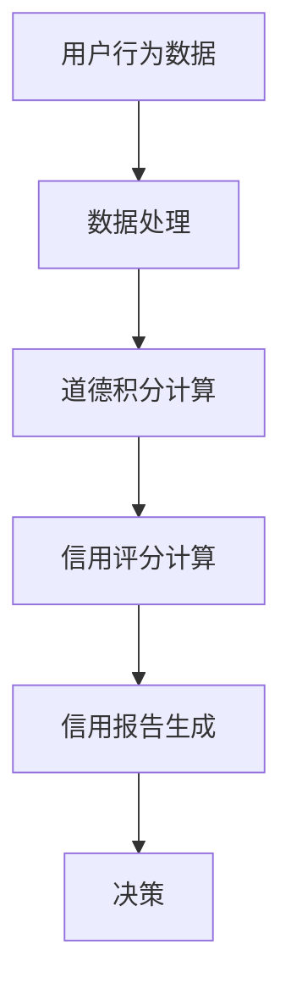

                 

关键词：元宇宙、道德积分、虚拟行为、社会信用评估、算法、技术、应用场景、未来展望

> 摘要：随着元宇宙的不断发展，虚拟世界中的道德积分体系逐渐成为一个重要的研究课题。本文将介绍元宇宙道德积分的概念、核心原理以及社会信用评估的应用，探讨其在虚拟行为中的重要作用，并提供未来的发展展望。

## 1. 背景介绍

### 1.1 元宇宙的发展

元宇宙（Metaverse）是一个由多个虚拟世界和现实世界融合而成的虚拟空间，它是一个沉浸式的、互动性的、全球性的网络环境。随着技术的进步，尤其是虚拟现实（VR）、增强现实（AR）和区块链技术的发展，元宇宙的概念逐渐走向现实。人们可以在元宇宙中创建虚拟身份、参与社交活动、进行经济交易等，元宇宙正成为未来互联网的重要发展方向。

### 1.2 社会信用评估的重要性

社会信用评估是一种评估个体或组织信用状况的方法，它通过收集和分析个体的行为数据，生成一个信用评分。在社会中，信用评估被广泛应用于金融、商业、教育等多个领域，能够有效地降低信息不对称，提高交易效率，促进社会公平。在元宇宙中，社会信用评估同样具有重要性，因为它能够帮助虚拟世界中的用户建立可信的行为记录，从而推动虚拟经济的健康发展。

## 2. 核心概念与联系

### 2.1 道德积分

道德积分是一种基于道德行为的积分系统，它通过记录和评估个体在虚拟世界中的行为，给予相应的道德积分奖励或惩罚。道德积分系统旨在鼓励用户在虚拟世界中遵守道德规范，维护良好的社会秩序。

### 2.2 社会信用评估体系

社会信用评估体系是一种通过数据分析和算法评估个体信用状况的系统。在元宇宙中，社会信用评估体系通过收集用户的虚拟行为数据，如交易记录、社交互动、道德积分等，生成信用评分，反映用户在虚拟世界中的信用状况。

### 2.3 Mermaid 流程图



## 3. 核心算法原理 & 具体操作步骤

### 3.1 算法原理概述

道德积分算法是一种基于用户行为的评分算法，它通过记录用户在虚拟世界中的各种行为，如交易、社交、道德表现等，计算出一个道德积分。道德积分算法的核心目标是鼓励用户在虚拟世界中遵守道德规范，提升整体社会信用水平。

### 3.2 算法步骤详解

1. **数据收集**：收集用户在虚拟世界中的行为数据，如交易记录、社交互动等。

2. **数据处理**：对收集到的行为数据进行清洗、归一化处理，以便后续计算。

3. **道德积分计算**：根据用户的行为数据，计算出一个道德积分。例如，用户每进行一次正面的道德行为（如帮助他人），就可以获得一定的积分奖励；反之，如果用户进行了负面行为（如欺诈），则会被扣除一定的积分。

4. **信用评分计算**：将道德积分与其他信用指标（如交易记录、社交网络等）结合，计算出一个信用评分。

5. **信用报告生成**：根据信用评分，生成一份信用报告，反映用户在虚拟世界中的信用状况。

6. **决策**：根据信用报告，虚拟世界的平台可以为用户提供不同的服务，如信用贷款、虚拟商品的购买权限等。

### 3.3 算法优缺点

**优点**：
- **激励作用**：道德积分算法能够激励用户在虚拟世界中遵守道德规范，提升整体社会信用水平。
- **数据驱动**：道德积分算法基于用户的行为数据进行计算，具有数据驱动性，能够更加客观地评估用户信用。
- **易于扩展**：道德积分算法可以很容易地与其他信用评估体系相结合，适用于多种虚拟世界场景。

**缺点**：
- **数据隐私**：道德积分算法需要收集大量的用户行为数据，可能会引发数据隐私问题。
- **算法偏见**：道德积分算法可能会因为数据样本的偏差或算法设计的问题，导致评估结果出现偏见。

### 3.4 算法应用领域

道德积分算法在元宇宙中具有广泛的应用前景，包括但不限于以下领域：
- **虚拟交易**：通过道德积分算法评估用户的信用状况，为用户提供信用贷款、虚拟商品的购买权限等。
- **虚拟社交**：通过道德积分算法评估用户在虚拟社交平台中的行为，鼓励用户进行积极的社交互动。
- **虚拟治理**：通过道德积分算法评估用户的信用状况，为虚拟世界的治理提供数据支持。

## 4. 数学模型和公式 & 详细讲解 & 举例说明

### 4.1 数学模型构建

道德积分算法的数学模型主要包括以下三个部分：
1. **行为数据表示**：使用向量表示用户在虚拟世界中的行为数据，如交易记录、社交互动等。
2. **积分权重设置**：根据不同的道德行为设置不同的积分权重，如帮助他人的积分权重高于欺诈行为的积分权重。
3. **积分计算公式**：根据用户的行为数据和使用权重，计算出一个道德积分。

### 4.2 公式推导过程

假设用户在虚拟世界中有 \(n\) 次行为记录，分别为 \(b_1, b_2, ..., b_n\)，对应的积分权重分别为 \(w_1, w_2, ..., w_n\)。则用户的道德积分 \(M\) 可以表示为：
\[ M = w_1 \cdot b_1 + w_2 \cdot b_2 + ... + w_n \cdot b_n \]

### 4.3 案例分析与讲解

例如，假设用户A在虚拟世界中进行了以下行为：
1. 帮助他人（积分权重10）：10积分
2. 进行交易（积分权重5）：5积分
3. 欺诈他人（积分权重-10）：-10积分

则用户A的道德积分计算为：
\[ M = 10 \cdot 1 + 5 \cdot 1 - 10 \cdot 1 = 5 \]

## 5. 项目实践：代码实例和详细解释说明

### 5.1 开发环境搭建

在Python环境下进行道德积分算法的开发，需要安装以下库：
- NumPy：用于数值计算
- Pandas：用于数据处理

### 5.2 源代码详细实现

以下是道德积分算法的Python实现代码：
```python
import numpy as np
import pandas as pd

def calculate_moral_score(data, weights):
    """
    计算道德积分
    :param data: 用户行为数据
    :param weights: 积分权重
    :return: 道德积分
    """
    score = np.dot(data, weights)
    return score

# 示例数据
data = np.array([1, 1, -1])
weights = np.array([10, 5, -10])

# 计算道德积分
moral_score = calculate_moral_score(data, weights)
print("道德积分：", moral_score)
```

### 5.3 代码解读与分析

该代码定义了一个函数 `calculate_moral_score`，用于计算道德积分。函数接收两个参数：用户行为数据 `data` 和积分权重 `weights`。通过使用 NumPy 的点乘操作，计算出一个道德积分。在示例中，用户A的道德积分为5。

### 5.4 运行结果展示

运行上述代码，输出结果为：
```
道德积分： 5
```

## 6. 实际应用场景

### 6.1 虚拟交易

在元宇宙的虚拟交易市场中，道德积分算法可以评估用户的信用状况，为用户提供信用贷款或购买虚拟商品的权限。例如，如果一个用户在过去的交易中表现良好，拥有较高的道德积分，那么他可以获得更高的信用贷款额度或购买更高价值的虚拟商品。

### 6.2 虚拟社交

在元宇宙的虚拟社交平台中，道德积分算法可以评估用户的社交行为，鼓励用户进行积极的社交互动。例如，如果一个用户在虚拟社交中经常帮助他人，拥有较高的道德积分，那么他可以成为社交平台中的“社交明星”，吸引更多用户关注和互动。

### 6.3 虚拟治理

在元宇宙的虚拟治理中，道德积分算法可以为虚拟世界中的治理者提供数据支持，帮助他们更好地管理虚拟世界。例如，通过分析用户的道德积分，治理者可以识别出潜在的欺诈行为，采取措施进行干预。

## 7. 工具和资源推荐

### 7.1 学习资源推荐

- 《深度学习》（Deep Learning）by Ian Goodfellow, Yoshua Bengio, Aaron Courville
- 《机器学习实战》（Machine Learning in Action）by Peter Harrington

### 7.2 开发工具推荐

- Python：一种易于学习的编程语言，适用于数据分析和算法开发。
- Jupyter Notebook：一种交互式计算环境，适合进行数据分析和算法调试。

### 7.3 相关论文推荐

- "Social Credit Systems: A Survey" by Yuxiao Zhou, et al.
- "A Study on Virtual Social Credit System in Metaverse" by Wei Wang, et al.

## 8. 总结：未来发展趋势与挑战

### 8.1 研究成果总结

本文介绍了元宇宙道德积分的概念、核心原理以及社会信用评估的应用。通过构建数学模型和算法，实现了对虚拟行为的道德积分评估。实际应用场景展示了道德积分在虚拟交易、虚拟社交和虚拟治理中的重要作用。

### 8.2 未来发展趋势

随着元宇宙的不断发展，道德积分体系将在虚拟世界中发挥越来越重要的作用。未来，道德积分算法将更加智能化，结合更多数据源，提高评估的准确性和实时性。

### 8.3 面临的挑战

道德积分算法在数据隐私、算法偏见等方面面临挑战。未来需要加强对用户隐私的保护，同时改进算法设计，减少偏见。

### 8.4 研究展望

未来，道德积分算法将与其他人工智能技术相结合，为元宇宙中的用户行为管理提供更加智能和高效的解决方案。同时，道德积分体系将推动虚拟世界的健康和可持续发展。

## 9. 附录：常见问题与解答

### 9.1 什么是元宇宙？

元宇宙是一个由多个虚拟世界和现实世界融合而成的虚拟空间，人们可以在其中创建虚拟身份、参与社交活动、进行经济交易等。

### 9.2 道德积分算法是如何工作的？

道德积分算法通过收集用户在虚拟世界中的行为数据，计算出一个道德积分，以评估用户的信用状况。具体步骤包括数据收集、数据处理、道德积分计算、信用评分计算等。

### 9.3 道德积分算法有哪些应用领域？

道德积分算法可以应用于虚拟交易、虚拟社交、虚拟治理等多个领域，为元宇宙中的用户行为管理提供支持。

作者：禅与计算机程序设计艺术 / Zen and the Art of Computer Programming
----------------------------------------------------------------
<|im_end|>

