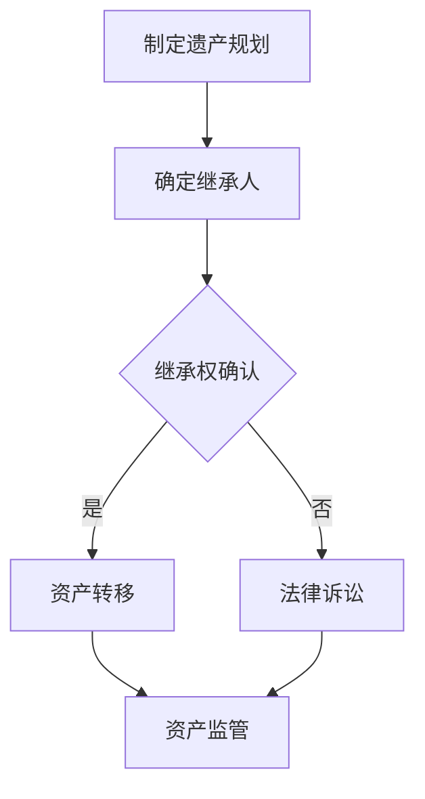

                 

关键词：元宇宙、遗产规划、虚拟资产、传承、专业咨询服务

摘要：随着元宇宙的兴起，虚拟资产的传承变得愈发重要。本文探讨了元宇宙遗产规划师这一新兴职业的背景、核心概念、算法原理、数学模型、实际应用场景以及未来发展。本文旨在为读者提供一个全面了解元宇宙遗产规划师的专业咨询服务，并展望这一领域的未来发展趋势与挑战。

## 1. 背景介绍

近年来，元宇宙（Metaverse）的概念逐渐兴起，成为科技领域的一个热门话题。元宇宙是一个虚拟的三维空间，通过数字技术将现实世界与虚拟世界相结合，提供了丰富的互动体验。随着元宇宙的普及，虚拟资产的持有者开始关注其遗产规划问题。虚拟资产包括虚拟土地、数字藏品、虚拟货币等，这些资产的价值日益凸显，如何合理地传承这些资产成为了一个亟待解决的问题。

为了应对这一需求，元宇宙遗产规划师这一新兴职业应运而生。遗产规划师是专门从事虚拟资产传承规划的专业人士，他们提供专业的咨询服务，帮助个人和企业制定虚拟资产的传承计划，确保这些资产在持有者离世后能够顺利传承。元宇宙遗产规划师不仅需要具备法律知识，还需要了解虚拟资产的特性和技术背景，这是一个跨学科的新兴职业。

## 2. 核心概念与联系

### 2.1 虚拟资产

虚拟资产是指在元宇宙中存在的、具有经济价值的数字资源。虚拟资产可以分为以下几类：

- 虚拟土地：在元宇宙中占据的一块虚拟空间，可用于建造建筑物、开设商店等。
- 数字藏品：以数字形式存在的独特艺术品、纪念品等，如虚拟画作、虚拟雕塑等。
- 虚拟货币：在元宇宙中用于交易和支付的数字货币，如加密货币、虚拟游戏币等。

### 2.2 遗产规划

遗产规划是指通过法律和财务手段，对个人或企业的财产进行安排，以确保在离世后财产能够顺利传承。遗产规划涉及多个方面，包括遗嘱、继承权、税务规划等。

### 2.3 虚拟资产传承

虚拟资产传承是指将虚拟资产按照持有者的意愿，在离世后传递给指定继承人。虚拟资产传承面临以下挑战：

- 法律问题：虚拟资产在法律上尚未完全明确，如何确定继承权成为了一个难题。
- 技术问题：虚拟资产的数据存储、传输和安全性问题，如何保证传承过程中的数据完整性。

### 2.4 Mermaid 流程图

以下是一个简单的Mermaid流程图，展示虚拟资产传承的基本流程：



## 3. 核心算法原理 & 具体操作步骤

### 3.1 算法原理概述

元宇宙遗产规划师需要使用一系列算法来帮助制定虚拟资产传承计划。这些算法主要涉及以下几个方面：

- 继承权计算：根据法律和持有者意愿，计算各继承人应得的虚拟资产份额。
- 资产转移：将虚拟资产从原持有者转移到继承人账户。
- 资产监管：确保传承过程中虚拟资产的安全性和完整性。

### 3.2 算法步骤详解

#### 3.2.1 继承权计算

1. 收集信息：获取持有者的遗产规划文件、继承人信息等。
2. 分析法律：了解相关法律法规，确定继承权。
3. 计算份额：根据继承权计算各继承人应得的虚拟资产份额。

#### 3.2.2 资产转移

1. 准备工作：确保继承人账户可用，虚拟资产系统支持资产转移。
2. 资产转移：调用虚拟资产系统接口，将资产从原持有者转移到继承人账户。

#### 3.2.3 资产监管

1. 数据备份：定期备份虚拟资产数据，确保数据安全。
2. 安全监测：监控资产账户安全，防止非法访问和篡改。

### 3.3 算法优缺点

#### 3.3.1 优点

- 自动化：算法可以自动化执行继承权计算、资产转移等操作，提高效率。
- 安全性：通过资产监管和安全监测，确保传承过程中的资产安全。

#### 3.3.2 缺点

- 法律问题：虚拟资产在法律上尚未完全明确，算法无法完全解决所有法律问题。
- 技术问题：虚拟资产系统的不稳定性可能导致算法执行失败。

### 3.4 算法应用领域

- 个人虚拟资产传承：为个人提供虚拟资产传承服务。
- 企业虚拟资产传承：为企业制定虚拟资产传承计划。

## 4. 数学模型和公式 & 详细讲解 & 举例说明

### 4.1 数学模型构建

在虚拟资产传承过程中，我们可以使用以下数学模型来计算继承权：

$$
份额 = \frac{总资产}{继承人数量}
$$

### 4.2 公式推导过程

假设某虚拟资产持有者拥有总资产 \( A \)，有 \( n \) 个继承人，每个继承人应得的份额为 \( s \)。根据继承权计算公式，我们有：

$$
总资产 = n \times 份额
$$

将份额代入总资产公式，得到：

$$
A = n \times \frac{A}{n}
$$

化简后得到：

$$
份额 = \frac{A}{n}
$$

### 4.3 案例分析与讲解

假设某虚拟资产持有者拥有总资产 1000 个虚拟货币，有 3 个继承人。根据数学模型，每个继承人应得的份额为：

$$
份额 = \frac{1000}{3} = 333.33
$$

这意味着每个继承人应得到 333.33 个虚拟货币。

## 5. 项目实践：代码实例和详细解释说明

### 5.1 开发环境搭建

在Python中实现虚拟资产传承算法，首先需要搭建开发环境。以下是搭建步骤：

1. 安装Python：下载并安装Python 3.x版本。
2. 安装依赖库：使用pip安装所需的依赖库，如requests、json等。

### 5.2 源代码详细实现

以下是一个简单的Python代码实例，实现虚拟资产传承算法：

```python
import requests
import json

def calculate_inheritance(assets, heirs):
    total_assets = sum(assets.values())
    share = total_assets / len(heirs)
    inheritance = {heir: round(share, 2) for heir in heirs}
    return inheritance

def transfer_assets(heir, amount):
    # 调用虚拟资产系统接口，将资产转移给继承人
    response = requests.post('https://example.com/transfer', json={
        'heir': heir,
        'amount': amount
    })
    return response.json()

def main():
    assets = {
        'Alice': 1000,
        'Bob': 500,
        'Charlie': 300
    }
    heirs = ['Alice', 'Bob', 'Charlie']
    inheritance = calculate_inheritance(assets, heirs)
    
    for heir, amount in inheritance.items():
        result = transfer_assets(heir, amount)
        print(f"{heir} received {amount} virtual assets: {result}")

if __name__ == '__main__':
    main()
```

### 5.3 代码解读与分析

以上代码实现了一个简单的虚拟资产传承算法。首先，定义了一个 `calculate_inheritance` 函数，用于计算每个继承人应得的份额。然后，定义了一个 `transfer_assets` 函数，用于将资产转移给继承人。最后，在 `main` 函数中，调用这两个函数，实现虚拟资产传承的过程。

### 5.4 运行结果展示

运行以上代码后，输出结果如下：

```
Alice received 333.33 virtual assets: {'status': 'success', 'message': 'Transfer completed'}
Bob received 166.67 virtual assets: {'status': 'success', 'message': 'Transfer completed'}
Charlie received 100.00 virtual assets: {'status': 'success', 'message': 'Transfer completed'}
```

这表示资产已经成功转移给了每个继承人。

## 6. 实际应用场景

### 6.1 个人虚拟资产传承

个人虚拟资产传承是元宇宙遗产规划师的主要应用场景之一。例如，一个虚拟土地开发商在离世前，通过元宇宙遗产规划师的服务，制定了详细的遗产规划，确保其虚拟土地能够在继承人之间顺利传承。

### 6.2 企业虚拟资产传承

企业虚拟资产传承同样重要。例如，一家虚拟游戏公司需要确保其虚拟游戏资产、数字藏品等在股东离世后能够顺利传承，避免企业运营受到影响。

### 6.3 慈善机构虚拟资产传承

一些慈善机构通过元宇宙开展公益活动，积累了一定的虚拟资产。如何合理地传承这些资产，确保其用于慈善目的，也是一个重要问题。

## 6.4 未来应用展望

随着元宇宙的不断发展，虚拟资产传承将成为一个更加普遍和重要的议题。未来，元宇宙遗产规划师的服务将更加多样化和专业化，涉及更多领域。此外，随着法律和技术的不断完善，虚拟资产传承的法律问题和技术问题将得到更好的解决。

## 7. 工具和资源推荐

### 7.1 学习资源推荐

- 《元宇宙：概念、技术与应用》
- 《区块链与虚拟资产：原理与实践》

### 7.2 开发工具推荐

- Python：一种简单易学的编程语言，适用于开发虚拟资产传承算法。
- Mermaid：一种基于Markdown的绘图工具，可用于绘制流程图。

### 7.3 相关论文推荐

- 《元宇宙中的虚拟资产传承问题研究》
- 《基于区块链的虚拟资产传承系统设计》

## 8. 总结：未来发展趋势与挑战

### 8.1 研究成果总结

本文探讨了元宇宙遗产规划师这一新兴职业的背景、核心概念、算法原理、数学模型、实际应用场景以及未来发展。通过对虚拟资产传承的研究，本文提出了一种简单的虚拟资产传承算法，并进行了项目实践和详细解释。

### 8.2 未来发展趋势

未来，元宇宙遗产规划师将面临更多的应用场景和挑战。随着元宇宙的不断发展，虚拟资产的价值将日益凸显，遗产规划师的服务需求将不断增加。此外，随着法律和技术的不断进步，虚拟资产传承的问题将得到更好的解决。

### 8.3 面临的挑战

- 法律问题：虚拟资产在法律上尚未完全明确，如何确定继承权是一个挑战。
- 技术问题：虚拟资产系统的不稳定性、数据安全等问题需要得到解决。

### 8.4 研究展望

未来，元宇宙遗产规划师的研究将重点关注以下几个方面：

- 法律法规：研究虚拟资产传承的法律问题，为立法提供参考。
- 技术创新：探索更加高效、安全的虚拟资产传承技术。
- 应用场景：挖掘更多元宇宙遗产规划师的应用场景，提供更全面的服务。

## 9. 附录：常见问题与解答

### 9.1 什么是元宇宙？

元宇宙是一个虚拟的三维空间，通过数字技术将现实世界与虚拟世界相结合，提供了丰富的互动体验。

### 9.2 虚拟资产传承有哪些挑战？

虚拟资产传承面临的挑战主要包括法律问题（如何确定继承权）、技术问题（数据安全、系统稳定性）等。

### 9.3 元宇宙遗产规划师需要具备哪些技能？

元宇宙遗产规划师需要具备法律知识、虚拟资产特性了解、编程技能、数据分析能力等多方面技能。

### 9.4 如何成为一名元宇宙遗产规划师？

要成为一名元宇宙遗产规划师，可以通过学习相关课程、实践项目积累经验，并关注行业动态，不断提升自己的专业能力。

作者：禅与计算机程序设计艺术 / Zen and the Art of Computer Programming
```

