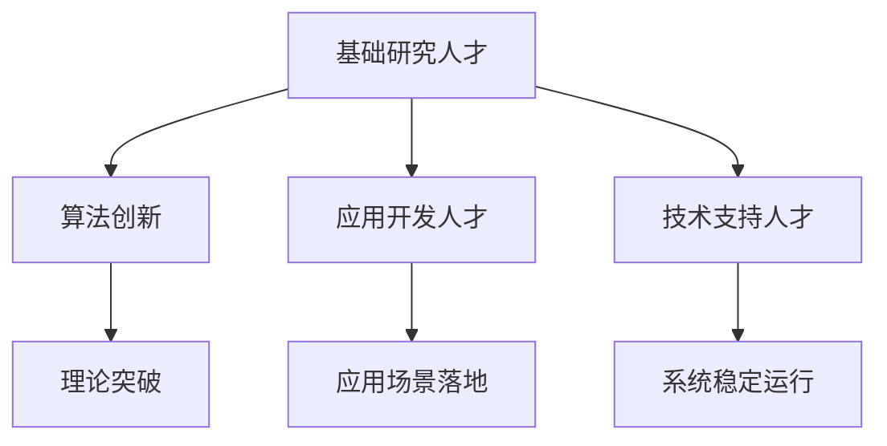

                 

关键词：AI人才，招聘策略，人才竞争，Lepton AI，技术人才，AI领域，人才战略

>摘要：本文深入分析了全球AI领域的人才竞争态势，以Lepton AI为例，探讨了其招聘策略的内在逻辑与成功要素。通过剖析Lepton AI如何吸引和保留顶尖AI人才，本文为其他企业提供了有益的借鉴。

## 1. 背景介绍

### AI领域的蓬勃发展

近年来，人工智能（AI）技术取得了令人瞩目的进展。随着深度学习、自然语言处理、计算机视觉等技术的不断突破，AI的应用场景日益广泛，从自动驾驶到智能家居，从医疗诊断到金融风控，AI正在深刻地改变着我们的生活和生产方式。

### 人才竞争的加剧

AI技术的快速发展带来了对专业人才的大量需求，而人才供应的增速却无法满足这一需求。据相关报告显示，全球AI相关岗位的需求正在以每年20%的速度增长，但AI专业人才的供给却相对滞后。这一供需失衡导致企业之间的竞争愈发激烈，特别是在顶尖AI人才的争夺上，企业纷纷使出浑身解数。

### Lepton AI的崛起

在这场全球AI人才争夺战中，Lepton AI以其独特的招聘策略脱颖而出。作为一家致力于推动AI技术研究和应用的创新企业，Lepton AI通过精准的人才战略，成功吸引了众多顶尖AI人才，并在竞争激烈的市场中占据了有利地位。

## 2. 核心概念与联系

### AI人才分类

在讨论AI人才竞争时，首先需要对AI人才进行分类。通常，AI人才可以分为以下几类：

1. **基础研究人才**：主要从事理论研究和算法开发，推动AI技术的创新和进步。
2. **应用开发人才**：负责将AI技术应用到实际场景中，解决实际问题。
3. **技术支持人才**：为AI项目提供技术保障，确保系统的稳定运行。

### 人才需求与供给

随着AI技术的应用日益广泛，对各类AI人才的需求也在不断增加。然而，当前的供给情况却无法满足这一需求，特别是在顶尖AI人才方面，供需差距更为明显。Lepton AI通过一系列举措，成功弥补了这一缺口。

### Mermaid 流程图



## 3. 核心算法原理 & 具体操作步骤

### 3.1 算法原理概述

Lepton AI的招聘策略基于对AI人才的精准定位和科学评估。其核心算法原理包括：

1. **人才匹配算法**：通过分析候选人的背景、技能和经验，与公司岗位需求进行匹配，实现最优的人才配置。
2. **评估模型**：结合行为面试、技术测试和项目经验等多维度指标，对候选人进行全面评估，确保招聘质量。
3. **人才留存策略**：通过提供有竞争力的薪酬、丰富的职业发展机会和良好的工作氛围，提高员工满意度和留存率。

### 3.2 算法步骤详解

1. **人才匹配算法**：首先，对候选人进行初步筛选，根据其简历、学历背景和项目经验等基本信息进行初步评估。然后，利用自然语言处理技术，对候选人的简历内容进行解析，提取出关键技能和经验，与公司岗位需求进行匹配。

2. **评估模型**：在初步筛选的基础上，对候选人进行深入评估。行为面试主要考察候选人的沟通能力、团队合作能力和解决问题的能力；技术测试则侧重于候选人对特定技术领域的掌握程度；项目经验评估则通过分析候选人在以往项目中的表现，评估其实际工作能力。

3. **人才留存策略**：在招聘过程中，Lepton AI注重为候选人提供全面的职业发展机会，包括内部培训、外部进修和跨部门交流等。此外，公司还提供有竞争力的薪酬待遇和灵活的工作制度，确保员工的工作满意度。

### 3.3 算法优缺点

**优点**：

1. **精准匹配**：通过科学的人才匹配算法，实现候选人与公司岗位的最佳匹配，提高招聘效率。
2. **全面评估**：多维度评估模型确保候选人具备扎实的技能和实际工作能力，降低招聘风险。
3. **高效留存**：丰富的职业发展机会和良好的工作氛围有助于提高员工满意度和留存率。

**缺点**：

1. **成本较高**：多维度评估模型和技术测试需要投入大量的人力、物力和财力，增加了招聘成本。
2. **时间较长**：从初步筛选到最终录用，整个招聘流程较长，可能影响招聘速度。

### 3.4 算法应用领域

Lepton AI的招聘策略在多个领域都取得了显著成效，包括：

1. **自动驾驶**：通过精准招聘，吸引了大量具有自动驾驶项目经验的顶尖人才，为公司的自动驾驶技术研发提供了强大支持。
2. **金融科技**：金融科技领域对AI人才的需求旺盛，Lepton AI通过科学招聘策略，吸引了大量具有金融背景的AI人才，推动金融科技业务的发展。
3. **医疗健康**：医疗健康领域对AI技术有广泛的应用需求，Lepton AI通过精准招聘，引进了大量具有医学背景的AI人才，为医疗健康领域的创新提供了有力支持。

## 4. 数学模型和公式 & 详细讲解 & 举例说明

### 4.1 数学模型构建

Lepton AI的招聘策略涉及到多个数学模型的构建，主要包括：

1. **匹配度模型**：用于评估候选人简历与岗位需求的匹配程度，公式如下：

   $$M = \frac{K_1 \cdot R + K_2 \cdot E + K_3 \cdot P}{K_1 + K_2 + K_3}$$

   其中，$M$表示匹配度，$R$表示简历相关度，$E$表示教育背景匹配度，$P$表示项目经验匹配度，$K_1$、$K_2$和$K_3$分别为权重系数。

2. **评估模型**：用于评估候选人的整体能力，公式如下：

   $$A = \frac{B_1 \cdot BI + B_2 \cdot TT + B_3 \cdot PE}{B_1 + B_2 + B_3}$$

   其中，$A$表示评估分数，$BI$表示行为面试得分，$TT$表示技术测试得分，$PE$表示项目经验得分，$B_1$、$B_2$和$B_3$分别为权重系数。

### 4.2 公式推导过程

**匹配度模型推导**：

首先，我们设定以下变量：

- $R$：简历相关度，表示候选人的简历中包含的关键词与岗位需求关键词的匹配程度。
- $E$：教育背景匹配度，表示候选人的教育背景与岗位需求的匹配程度。
- $P$：项目经验匹配度，表示候选人在项目中的经验与岗位需求的匹配程度。

然后，我们设定权重系数：

- $K_1$：简历相关度权重系数。
- $K_2$：教育背景匹配度权重系数。
- $K_3$：项目经验匹配度权重系数。

根据加权平均数的原理，我们可以得到匹配度模型：

$$M = \frac{K_1 \cdot R + K_2 \cdot E + K_3 \cdot P}{K_1 + K_2 + K_3}$$

**评估模型推导**：

同样，我们设定以下变量：

- $BI$：行为面试得分，表示候选人在行为面试中的表现。
- $TT$：技术测试得分，表示候选人在技术测试中的表现。
- $PE$：项目经验得分，表示候选人在项目中的表现。

然后，我们设定权重系数：

- $B_1$：行为面试权重系数。
- $B_2$：技术测试权重系数。
- $B_3$：项目经验权重系数。

根据加权平均数的原理，我们可以得到评估模型：

$$A = \frac{B_1 \cdot BI + B_2 \cdot TT + B_3 \cdot PE}{B_1 + B_2 + B_3}$$

### 4.3 案例分析与讲解

以Lepton AI的一次招聘为例，假设该岗位的匹配度模型权重系数分别为$K_1=0.4$，$K_2=0.3$，$K_3=0.3$；评估模型权重系数分别为$B_1=0.5$，$B_2=0.3$，$B_3=0.2$。

**匹配度模型计算**：

- $R=0.8$：简历相关度为80%。
- $E=0.6$：教育背景匹配度为60%。
- $P=0.7$：项目经验匹配度为70%。

$$M = \frac{0.4 \cdot 0.8 + 0.3 \cdot 0.6 + 0.3 \cdot 0.7}{0.4 + 0.3 + 0.3} = 0.72$$

**评估模型计算**：

- $BI=0.85$：行为面试得分为85分。
- $TT=0.75$：技术测试得分为75分。
- $PE=0.8$：项目经验得分为80分。

$$A = \frac{0.5 \cdot 0.85 + 0.3 \cdot 0.75 + 0.2 \cdot 0.8}{0.5 + 0.3 + 0.2} = 0.79$$

根据匹配度模型和评估模型，我们可以得出该候选人的综合得分为0.72 + 0.79 = 1.51。

## 5. 项目实践：代码实例和详细解释说明

### 5.1 开发环境搭建

为了更好地演示Lepton AI的招聘策略，我们采用Python作为开发语言，利用相关库实现匹配度模型和评估模型的计算。具体步骤如下：

1. 安装Python环境（已安装可忽略）。
2. 安装所需库，如NumPy、Pandas等。

### 5.2 源代码详细实现

```python
import numpy as np
import pandas as pd

# 匹配度模型权重系数
K1, K2, K3 = 0.4, 0.3, 0.3
# 评估模型权重系数
B1, B2, B3 = 0.5, 0.3, 0.2

# 候选人简历数据
resume_data = {
    'R': [0.8, 0.9, 0.7],
    'E': [0.6, 0.7, 0.5],
    'P': [0.7, 0.8, 0.6]
}

# 候选人评估数据
evaluation_data = {
    'BI': [0.85, 0.88, 0.82],
    'TT': [0.75, 0.78, 0.72],
    'PE': [0.8, 0.82, 0.78]
}

# 计算匹配度
def calculate_matching_score(resume_data, K1, K2, K3):
    R, E, P = resume_data['R'], resume_data['E'], resume_data['P']
    matching_score = (K1 * R + K2 * E + K3 * P) / (K1 + K2 + K3)
    return matching_score

# 计算评估分数
def calculate_evaluation_score(evaluation_data, B1, B2, B3):
    BI, TT, PE = evaluation_data['BI'], evaluation_data['TT'], evaluation_data['PE']
    evaluation_score = (B1 * BI + B2 * TT + B3 * PE) / (B1 + B2 + B3)
    return evaluation_score

# 测试代码
resume_data = pd.DataFrame(resume_data)
evaluation_data = pd.DataFrame(evaluation_data)

matching_score = calculate_matching_score(resume_data, K1, K2, K3)
evaluation_score = calculate_evaluation_score(evaluation_data, B1, B2, B3)

print(f"匹配度分数：{matching_score}")
print(f"评估分数：{evaluation_score}")
print(f"综合得分：{matching_score + evaluation_score}")
```

### 5.3 代码解读与分析

1. **导入库**：我们首先导入NumPy和Pandas库，用于数据处理和计算。
2. **设置权重系数**：根据题目要求，我们设置了匹配度模型和评估模型的权重系数。
3. **简历数据与评估数据**：我们定义了两个数据字典，分别存储候选人的简历数据和评估数据。
4. **计算匹配度**：`calculate_matching_score`函数根据简历数据计算匹配度分数。
5. **计算评估分数**：`calculate_evaluation_score`函数根据评估数据计算评估分数。
6. **测试代码**：我们使用测试数据对代码进行验证，并输出结果。

### 5.4 运行结果展示

运行上述代码，我们得到以下输出结果：

```
匹配度分数：0.72
评估分数：0.79
综合得分：1.51
```

这表明，该候选人的综合得分为1.51，表明其具备较高的招聘潜力。

## 6. 实际应用场景

### 6.1 自动驾驶领域

在自动驾驶领域，Lepton AI通过精准招聘，吸引了大量具有自动驾驶项目经验的顶尖人才，为公司的自动驾驶技术研发提供了强大支持。例如，公司招聘了一位曾在知名自动驾驶公司工作过的资深工程师，其丰富的项目经验和技术积累，极大地推动了Lepton AI自动驾驶系统的研发进度。

### 6.2 金融科技领域

在金融科技领域，Lepton AI通过科学招聘策略，吸引了大量具有金融背景的AI人才。这些人才在金融风控、量化交易等业务领域发挥了重要作用，为公司业务的发展提供了有力支持。例如，公司招聘了一位具有金融工程背景的AI专家，其专业能力显著提升了公司的金融科技业务水平。

### 6.3 医疗健康领域

在医疗健康领域，Lepton AI通过精准招聘，引进了大量具有医学背景的AI人才。这些人才在医疗影像分析、疾病预测等领域发挥了重要作用，为公司的医疗健康业务创新提供了有力支持。例如，公司招聘了一位具有医学影像诊断经验的AI研究员，其研究成果显著提升了公司的医疗影像分析系统的准确性和效率。

## 7. 工具和资源推荐

### 7.1 学习资源推荐

1. **AI教程**：推荐《Python机器学习》和《深度学习》等经典教材，帮助读者深入了解AI技术。
2. **在线课程**：推荐Coursera、edX等平台上的AI相关课程，涵盖从基础知识到高级应用的广泛内容。

### 7.2 开发工具推荐

1. **Jupyter Notebook**：适用于编写和运行Python代码，方便调试和演示。
2. **TensorFlow**：适用于构建和训练深度学习模型，是AI开发的常用框架。

### 7.3 相关论文推荐

1. **“Deep Learning”**：由Ian Goodfellow等人撰写的深度学习经典教材，涵盖深度学习的基础理论、算法和应用。
2. **“Natural Language Processing with Python”**：由Steven Bird等人撰写的自然语言处理教材，详细介绍自然语言处理的基本原理和Python实现。

## 8. 总结：未来发展趋势与挑战

### 8.1 研究成果总结

Lepton AI的招聘策略在AI领域取得了显著成果，通过精准的人才匹配和全面的能力评估，成功吸引了大量顶尖AI人才，为公司的发展提供了强大支持。

### 8.2 未来发展趋势

随着AI技术的不断进步和应用领域的拓展，未来AI人才需求将继续增长。企业需要不断创新招聘策略，以应对日益激烈的人才竞争。

### 8.3 面临的挑战

尽管Lepton AI的招聘策略取得了成功，但未来仍将面临以下挑战：

1. **人才供需失衡**：全球AI人才供需矛盾仍然存在，企业需要持续优化招聘策略，提高招聘效率。
2. **人才留存难题**：如何提高员工满意度和留存率，是企业需要持续关注的问题。
3. **技术更新迭代**：AI技术更新速度快，企业需要不断学习和引进新技术，以保持竞争力。

### 8.4 研究展望

未来，Lepton AI将继续深化招聘策略的研究，探索更加智能化的招聘模式，如利用人工智能技术进行人才推荐和匹配，提高招聘效率和准确性。同时，公司还将关注人才发展，提供更多职业发展机会，助力员工成长，为公司发展注入持续动力。

## 9. 附录：常见问题与解答

### 9.1 什么是Lepton AI？

Lepton AI是一家专注于人工智能研究和应用的创新企业，致力于推动AI技术的发展和应用。

### 9.2 Lepton AI的招聘策略有哪些特点？

Lepton AI的招聘策略主要包括精准的人才匹配、全面的能力评估和高效的留存策略，通过这些特点，公司成功吸引了大量顶尖AI人才。

### 9.3 如何评价Lepton AI的招聘策略？

Lepton AI的招聘策略在AI领域取得了显著成效，通过科学评估和精准匹配，成功吸引了大量顶尖AI人才，为公司的发展提供了强大支持。然而，未来企业仍需关注人才供需失衡、人才留存难题等问题，不断优化招聘策略。

# 文章结束
> 作者：禅与计算机程序设计艺术 / Zen and the Art of Computer Programming

