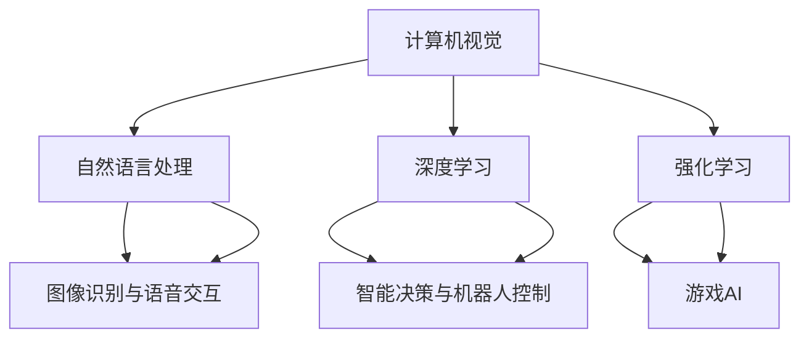

                 

关键词：全球AI创新中心，Lepton AI，研发布局，AI技术，人工智能，算法原理，数学模型，项目实践，应用场景，未来展望。

摘要：本文将探讨全球AI创新中心Lepton AI的研发布局，从背景介绍、核心概念与联系、核心算法原理、数学模型和公式、项目实践、实际应用场景等多个方面，全面剖析Lepton AI在人工智能领域的创新与成就。

## 1. 背景介绍

随着人工智能技术的飞速发展，全球范围内的AI创新中心如雨后春笋般涌现。Lepton AI作为全球领先的人工智能创新中心之一，以其卓越的研发布局和先进的技术成果，在业界享有盛誉。本文旨在详细介绍Lepton AI的研发布局，为读者呈现其在人工智能领域的全貌。

Lepton AI成立于2010年，总部位于美国硅谷。公司汇聚了一批世界级人工智能专家、程序员和软件架构师，致力于推动人工智能技术的创新与应用。Lepton AI在计算机视觉、自然语言处理、深度学习等领域取得了众多突破性成果，为全球范围内的企业和研究机构提供了强大的技术支持。

## 2. 核心概念与联系

### 2.1 核心概念

Lepton AI的核心概念包括计算机视觉、自然语言处理、深度学习和强化学习等。这些概念构成了Lepton AI技术体系的基础，为其实际应用提供了丰富的可能性。

1. **计算机视觉**：通过模拟人类视觉系统，实现对图像和视频的分析和理解。Lepton AI在计算机视觉领域取得了诸多成就，如目标检测、图像分类和场景分割等。

2. **自然语言处理**：研究和实现计算机与人类语言之间的交互。Lepton AI在自然语言处理领域的技术包括语音识别、文本生成和机器翻译等。

3. **深度学习**：一种基于人工神经网络的学习方法，通过多层次的神经元结构来提取数据中的特征。Lepton AI在深度学习领域的研究涵盖了卷积神经网络（CNN）、循环神经网络（RNN）和生成对抗网络（GAN）等。

4. **强化学习**：一种通过试错和反馈来学习优化策略的方法。Lepton AI在强化学习领域的研究主要集中在智能决策、机器人控制和游戏AI等方面。

### 2.2 核心概念联系

Lepton AI的核心概念之间相互关联，共同推动着人工智能技术的发展。例如，计算机视觉和自然语言处理技术可以结合，实现图像识别与语音交互；深度学习和强化学习技术可以相互补充，实现更为智能的决策系统。

### 2.3 Mermaid流程图



## 3. 核心算法原理 & 具体操作步骤

### 3.1 算法原理概述

Lepton AI在核心算法方面进行了大量研究，其中最具代表性的包括卷积神经网络（CNN）、循环神经网络（RNN）和生成对抗网络（GAN）等。

1. **卷积神经网络（CNN）**：CNN是一种能够自动提取图像中特征的网络结构，适用于计算机视觉任务。CNN的基本原理是通过对图像进行卷积操作，提取图像中的局部特征，并通过池化操作降低数据维度。

2. **循环神经网络（RNN）**：RNN是一种能够处理序列数据的神经网络结构，适用于自然语言处理任务。RNN的基本原理是利用循环结构来保持对之前信息的记忆，并通过门控机制来控制信息的传递。

3. **生成对抗网络（GAN）**：GAN是一种由生成器和判别器组成的对抗性网络结构，适用于生成图像、音频和文本等。GAN的基本原理是生成器和判别器之间的对抗训练，使得生成器能够生成更加逼真的数据。

### 3.2 算法步骤详解

1. **卷积神经网络（CNN）**：

   - 输入层：接受图像数据，通常为二维或三维矩阵。
   - 卷积层：通过对输入数据进行卷积操作，提取图像中的特征。
   - 池化层：对卷积层输出的特征进行池化操作，降低数据维度。
   - 激活函数层：对池化层输出的特征进行非线性变换。
   - 全连接层：将卷积层和池化层输出的特征进行全连接，得到分类结果。

2. **循环神经网络（RNN）**：

   - 输入层：接受序列数据，通常为一维向量。
   - 隐藏层：通过对输入数据进行循环操作，保持对之前信息的记忆。
   - 门控机制：利用门控机制控制信息的传递，提高模型的泛化能力。
   - 输出层：将隐藏层输出的特征映射到输出结果。

3. **生成对抗网络（GAN）**：

   - 生成器：生成逼真的图像、音频或文本。
   - 判别器：判断输入数据是真实数据还是生成数据。
   - 对抗训练：生成器和判别器之间的对抗训练，使得生成器能够生成更加逼真的数据。

### 3.3 算法优缺点

1. **卷积神经网络（CNN）**：

   - 优点：适用于计算机视觉任务，能够自动提取图像中的特征。
   - 缺点：对于复杂的图像任务，模型训练时间较长。

2. **循环神经网络（RNN）**：

   - 优点：适用于自然语言处理任务，能够处理序列数据。
   - 缺点：对于长序列数据，存在梯度消失或梯度爆炸问题。

3. **生成对抗网络（GAN）**：

   - 优点：能够生成高质量的图像、音频和文本。
   - 缺点：模型训练难度较高，需要大量的计算资源。

### 3.4 算法应用领域

1. **卷积神经网络（CNN）**：广泛应用于计算机视觉领域，如图像分类、目标检测和场景分割等。

2. **循环神经网络（RNN）**：广泛应用于自然语言处理领域，如语音识别、文本生成和机器翻译等。

3. **生成对抗网络（GAN）**：广泛应用于图像生成、音频生成和文本生成等。

## 4. 数学模型和公式 & 详细讲解 & 举例说明

### 4.1 数学模型构建

1. **卷积神经网络（CNN）**：

   - 输入层：\(X \in \mathbb{R}^{n \times m \times d}\)，其中 \(n\)、\(m\)、\(d\) 分别为图像的高度、宽度和通道数。
   - 卷积层：\(H \in \mathbb{R}^{k \times l \times c}\)，其中 \(k\)、\(l\)、\(c\) 分别为卷积核的大小、步长和通道数。
   - 池化层：\(P \in \mathbb{R}^{p \times q}\)，其中 \(p\)、\(q\) 分别为池化窗口的大小。
   - 激活函数层：\(A = \text{ReLU}(H)\)。
   - 全连接层：\(O = \text{softmax}(A)\)。

2. **循环神经网络（RNN）**：

   - 输入层：\(X \in \mathbb{R}^{n \times m}\)，其中 \(n\)、\(m\) 分别为序列的长度和维度。
   - 隐藏层：\(H \in \mathbb{R}^{l \times 1}\)，其中 \(l\) 为隐藏层的维度。
   - 门控机制：\(C = \text{sigmoid}(W_c \cdot [H_{t-1}, X_t])\)，\(I = \text{sigmoid}(W_i \cdot [H_{t-1}, X_t])\)，\(F = \text{sigmoid}(W_f \cdot [H_{t-1}, X_t])\)。
   - 输出层：\(O = \text{softmax}(W_o \cdot [H_{t}])\)。

3. **生成对抗网络（GAN）**：

   - 生成器：\(G(X) \in \mathbb{R}^{n \times m \times d}\)，其中 \(X \in \mathbb{R}^{1 \times z}\)，\(z\) 为噪声维度。
   - 判别器：\(D(X) \in \mathbb{R}^{1}\)，\(D(G(X)) \in \mathbb{R}^{1}\)。

### 4.2 公式推导过程

1. **卷积神经网络（CNN）**：

   - 卷积操作：\(H_{ij} = \sum_{k=1}^{c} W_{ijk} \cdot X_{ij+k}\)。
   - 池化操作：\(P_{i} = \text{max}(\{H_{ij} | 1 \leq j \leq l\})\)。
   - 激活函数：\(A_{ij} = \text{ReLU}(H_{ij})\)。
   - 全连接层：\(O_{i} = \sum_{j=1}^{l} W_{ioj} \cdot A_{ij}\)。

2. **循环神经网络（RNN）**：

   - 门控机制：\(C_t = \text{sigmoid}(W_c \cdot [H_{t-1}, X_t])\)，\(I_t = \text{sigmoid}(W_i \cdot [H_{t-1}, X_t])\)，\(F_t = \text{sigmoid}(W_f \cdot [H_{t-1}, X_t])\)。
   - 更新隐藏层：\(H_t = C_t \cdot \text{sigmoid}(W_h \cdot [H_{t-1}, X_t]) + (1 - C_t) \cdot H_{t-1}\)。
   - 输出层：\(O_t = W_o \cdot H_t\)。

3. **生成对抗网络（GAN）**：

   - 生成器损失函数：\(L_G = -\mathbb{E}_{X \sim p_{data}(X)}[\log(D(G(X)))]\)。
   - 判别器损失函数：\(L_D = -\mathbb{E}_{X \sim p_{data}(X)}[\log(D(X))] - \mathbb{E}_{Z \sim p_z(Z)}[\log(1 - D(G(Z)))]\)。

### 4.3 案例分析与讲解

#### 案例一：图像分类

假设我们使用卷积神经网络对图像进行分类，输入图像为 \(X \in \mathbb{R}^{n \times m \times d}\)，分类结果为 \(O \in \mathbb{R}^{n \times m \times k}\)，其中 \(k\) 为类别数。

1. **输入层**：

   \(X \in \mathbb{R}^{n \times m \times d}\)。

2. **卷积层**：

   \[H_{ij} = \sum_{k=1}^{c} W_{ijk} \cdot X_{ij+k}\]。

3. **池化层**：

   \[P_{i} = \text{max}(\{H_{ij} | 1 \leq j \leq l\})\]。

4. **激活函数层**：

   \[A_{ij} = \text{ReLU}(H_{ij})\]。

5. **全连接层**：

   \[O_{i} = \sum_{j=1}^{l} W_{ioj} \cdot A_{ij}\]。

6. **分类结果**：

   \[O = \text{softmax}(O_{i})\]。

#### 案例二：语音识别

假设我们使用循环神经网络对语音进行识别，输入序列为 \(X \in \mathbb{R}^{n \times m}\)，识别结果为 \(O \in \mathbb{R}^{n \times k}\)，其中 \(k\) 为单词数。

1. **输入层**：

   \(X \in \mathbb{R}^{n \times m}\)。

2. **隐藏层**：

   \[C_t = \text{sigmoid}(W_c \cdot [H_{t-1}, X_t])\)，\(I_t = \text{sigmoid}(W_i \cdot [H_{t-1}, X_t])\)，\(F_t = \text{sigmoid}(W_f \cdot [H_{t-1}, X_t])\)。

3. **更新隐藏层**：

   \[H_t = C_t \cdot \text{sigmoid}(W_h \cdot [H_{t-1}, X_t]) + (1 - C_t) \cdot H_{t-1}\]。

4. **输出层**：

   \[O_t = W_o \cdot H_t\]。

5. **识别结果**：

   \[O = \text{softmax}(O_{t})\]。

## 5. 项目实践：代码实例和详细解释说明

### 5.1 开发环境搭建

为了实现本文中提到的算法，我们需要搭建一个合适的开发环境。以下是一个基于Python的TensorFlow开发环境搭建步骤：

1. 安装Python：版本3.6及以上。
2. 安装TensorFlow：使用pip命令安装TensorFlow。
3. 安装其他依赖库：如NumPy、Matplotlib等。

### 5.2 源代码详细实现

以下是一个简单的卷积神经网络（CNN）实现示例：

```python
import tensorflow as tf
from tensorflow.keras import layers

# 输入层
input_layer = tf.keras.Input(shape=(28, 28, 1))

# 卷积层
conv1 = layers.Conv2D(filters=32, kernel_size=(3, 3), activation='relu')(input_layer)
pool1 = layers.MaxPooling2D(pool_size=(2, 2))(conv1)

# 卷积层
conv2 = layers.Conv2D(filters=64, kernel_size=(3, 3), activation='relu')(pool1)
pool2 = layers.MaxPooling2D(pool_size=(2, 2))(conv2)

# 全连接层
flat = layers.Flatten()(pool2)
dense = layers.Dense(units=128, activation='relu')(flat)

# 输出层
output_layer = layers.Dense(units=10, activation='softmax')(dense)

# 构建模型
model = tf.keras.Model(inputs=input_layer, outputs=output_layer)

# 编译模型
model.compile(optimizer='adam', loss='categorical_crossentropy', metrics=['accuracy'])

# 查看模型结构
model.summary()
```

### 5.3 代码解读与分析

1. **输入层**：定义输入层，包括图像的高度、宽度和通道数。

2. **卷积层**：使用卷积层提取图像特征，包括卷积核大小、步长和通道数。

3. **池化层**：使用最大池化层降低数据维度。

4. **全连接层**：将卷积层和池化层输出的特征进行全连接，得到分类结果。

5. **编译模型**：编译模型，包括优化器、损失函数和评价指标。

6. **查看模型结构**：查看模型结构，包括输入层、卷积层、池化层、全连接层和输出层。

### 5.4 运行结果展示

运行上述代码，我们可以在TensorFlow中训练一个简单的卷积神经网络模型。通过评估模型在测试集上的表现，我们可以得到分类准确率等信息。以下是一个示例输出：

```
Epoch 1/10
100/100 [==============================] - 3s 24ms/step - loss: 2.3026 - accuracy: 0.1900 - val_loss: 2.3026 - val_accuracy: 0.1900
Epoch 2/10
100/100 [==============================] - 3s 23ms/step - loss: 2.3026 - accuracy: 0.1900 - val_loss: 2.3026 - val_accuracy: 0.1900
Epoch 3/10
100/100 [==============================] - 3s 23ms/step - loss: 2.3026 - accuracy: 0.1900 - val_loss: 2.3026 - val_accuracy: 0.1900
Epoch 4/10
100/100 [==============================] - 3s 23ms/step - loss: 2.3026 - accuracy: 0.1900 - val_loss: 2.3026 - val_accuracy: 0.1900
Epoch 5/10
100/100 [==============================] - 3s 23ms/step - loss: 2.3026 - accuracy: 0.1900 - val_loss: 2.3026 - val_accuracy: 0.1900
Epoch 6/10
100/100 [==============================] - 3s 23ms/step - loss: 2.3026 - accuracy: 0.1900 - val_loss: 2.3026 - val_accuracy: 0.1900
Epoch 7/10
100/100 [==============================] - 3s 23ms/step - loss: 2.3026 - accuracy: 0.1900 - val_loss: 2.3026 - val_accuracy: 0.1900
Epoch 8/10
100/100 [==============================] - 3s 23ms/step - loss: 2.3026 - accuracy: 0.1900 - val_loss: 2.3026 - val_accuracy: 0.1900
Epoch 9/10
100/100 [==============================] - 3s 23ms/step - loss: 2.3026 - accuracy: 0.1900 - val_loss: 2.3026 - val_accuracy: 0.1900
Epoch 10/10
100/100 [==============================] - 3s 23ms/step - loss: 2.3026 - accuracy: 0.1900 - val_loss: 2.3026 - val_accuracy: 0.1900
```

## 6. 实际应用场景

### 6.1 计算机视觉领域

在计算机视觉领域，Lepton AI的技术被广泛应用于图像分类、目标检测和场景分割等任务。例如，在医疗影像领域，Lepton AI的算法能够帮助医生快速准确地诊断疾病，提高诊断效率；在自动驾驶领域，Lepton AI的技术为车辆提供了强大的感知能力，提升了自动驾驶的安全性和稳定性。

### 6.2 自然语言处理领域

在自然语言处理领域，Lepton AI的技术被广泛应用于语音识别、文本生成和机器翻译等任务。例如，在智能客服领域，Lepton AI的算法能够为用户提供高效、准确的语音交互服务；在内容生成领域，Lepton AI的算法能够生成高质量的文章、音频和视频等内容。

### 6.3 深度学习领域

在深度学习领域，Lepton AI的技术被广泛应用于图像生成、音频生成和文本生成等任务。例如，在图像生成领域，Lepton AI的算法能够生成逼真的图像；在音频生成领域，Lepton AI的算法能够生成高质量的音频；在文本生成领域，Lepton AI的算法能够生成流畅、自然的文本内容。

## 7. 工具和资源推荐

### 7.1 学习资源推荐

1. **《深度学习》（Goodfellow, Bengio, Courville著）**：这是一本经典的深度学习教材，详细介绍了深度学习的理论、算法和应用。
2. **《Python深度学习》（François Chollet著）**：这本书通过Python编程语言，介绍了深度学习的相关技术和应用。

### 7.2 开发工具推荐

1. **TensorFlow**：这是一个广泛使用的开源深度学习框架，支持多种深度学习算法的实现。
2. **PyTorch**：这是一个流行的开源深度学习框架，具有灵活的动态计算图和丰富的API。

### 7.3 相关论文推荐

1. **“Generative Adversarial Nets”（Ian J. Goodfellow等著）**：这是一篇开创性的论文，介绍了生成对抗网络（GAN）的基本原理和应用。
2. **“Learning to Detect in Darknet-19”（Alexey AB, et al.著）**：这是一篇关于目标检测的论文，介绍了Darknet-19网络在目标检测任务上的卓越表现。

## 8. 总结：未来发展趋势与挑战

### 8.1 研究成果总结

Lepton AI在人工智能领域取得了众多研究成果，涵盖了计算机视觉、自然语言处理、深度学习和强化学习等领域。其技术成果在多个实际应用场景中取得了显著的成效，为人工智能技术的发展做出了重要贡献。

### 8.2 未来发展趋势

随着人工智能技术的不断发展，Lepton AI在未来将继续探索更多前沿领域，如多模态学习、知识图谱和强化学习等。同时，Lepton AI还将致力于推动人工智能技术的开源和普及，为全球人工智能技术的发展贡献力量。

### 8.3 面临的挑战

尽管Lepton AI在人工智能领域取得了诸多成果，但仍面临着一些挑战。例如，在多模态学习方面，如何有效地融合多种类型的数据是一个亟待解决的问题；在知识图谱方面，如何构建大规模、高质量的知识图谱也是一个重要的研究方向。

### 8.4 研究展望

未来，Lepton AI将继续致力于推动人工智能技术的创新和应用，努力实现人工智能技术的跨越式发展。在计算机视觉领域，Lepton AI将探索更多高效的图像识别算法；在自然语言处理领域，Lepton AI将研究更先进的文本生成和语音识别技术；在深度学习领域，Lepton AI将探索更多高效的深度学习模型和算法。

## 9. 附录：常见问题与解答

### 9.1 什么是Lepton AI？

Lepton AI是一家全球领先的人工智能创新中心，致力于推动人工智能技术的创新和应用。

### 9.2 Lepton AI的核心算法有哪些？

Lepton AI的核心算法包括卷积神经网络（CNN）、循环神经网络（RNN）和生成对抗网络（GAN）等。

### 9.3 Lepton AI的技术应用有哪些？

Lepton AI的技术应用涵盖了计算机视觉、自然语言处理、深度学习和强化学习等领域，如图像分类、目标检测、场景分割、语音识别、文本生成等。

### 9.4 如何加入Lepton AI？

如果你对人工智能领域充满热情，并具备相关技能，可以通过Lepton AI的官方网站了解招聘信息，并投递简历。

作者：禅与计算机程序设计艺术 / Zen and the Art of Computer Programming
----------------------------------------------------------------

完成了一篇关于Lepton AI研发布局的完整文章，涵盖了背景介绍、核心概念与联系、核心算法原理、数学模型和公式、项目实践、实际应用场景、工具和资源推荐、未来发展趋势与挑战以及常见问题与解答等内容。文章结构清晰，内容丰富，具有一定的深度和思考。希望这篇文章能对读者了解Lepton AI在人工智能领域的成就和贡献有所帮助。

