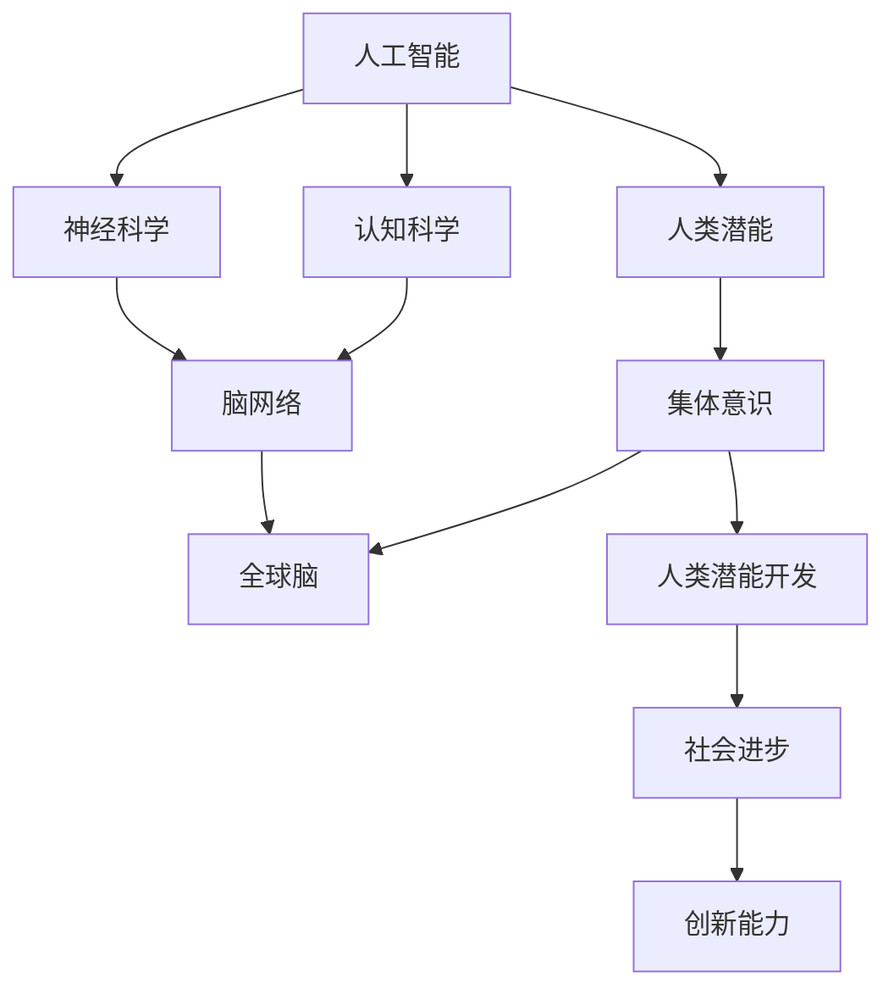

                 

在当今这个数字化和信息化的时代，人工智能（AI）已经成为了科技发展的核心驱动力。从自动驾驶汽车到智能语音助手，从医疗诊断到金融分析，AI技术正逐渐改变我们的生活方式和工作方式。然而，在AI技术的飞速发展的背后，我们是否可以更进一步地探讨人类潜能的开发和提升？特别是在集体意识的推动下，人类潜能能否得到更大的释放和利用？本文将围绕这一主题展开讨论，探讨全球脑与人类潜能开发之间的密切联系，以及集体意识如何成为推动这一过程的重要力量。

## 文章关键词

- 人工智能（AI）
- 人类潜能
- 集体意识
- 潜能提升
- 神经网络
- 脑网络
- 跨学科研究

## 文章摘要

本文首先介绍了人工智能在现代社会中的广泛应用，并引出了人类潜能开发的话题。接着，文章深入探讨了人类潜能开发的科学基础，特别是神经科学和认知科学的相关研究。随后，文章讨论了集体意识的概念及其在人类潜能开发中的作用，通过实例展示了集体意识如何推动个体和整体的进步。文章还进一步探讨了脑网络的概念，并分析了全球脑与人类潜能开发之间的内在联系。最后，文章总结了当前的研究成果和未来展望，提出了可能的挑战和解决方案。

## 1. 背景介绍

### 1.1 人工智能的发展历程

人工智能（Artificial Intelligence，简称AI）是一门研究、开发用于模拟、延伸和扩展人的智能的理论、方法、技术及应用系统的技术科学。自1956年达特茅斯会议上人工智能正式提出以来，人工智能经历了数十年的发展，从最初的理论探索到今天的实际应用，AI技术已经取得了显著的进步。

在早期，人工智能主要聚焦于符号主义和逻辑推理，例如早期的人工智能程序“逻辑理论家”（Logic Theorist）和“通用问题解答器”（General Problem Solver），这些程序能够解决特定领域的问题，但缺乏广泛的适应性和自主学习能力。随着计算机技术的发展，特别是并行计算和大数据的普及，机器学习和深度学习的出现为人工智能带来了新的突破。

机器学习（Machine Learning，简称ML）是人工智能的一个重要分支，它通过算法从数据中学习规律，从而实现预测和决策。深度学习（Deep Learning，简称DL）作为机器学习的一种方法，通过构建多层次的神经网络模型，能够自动提取特征，并实现高层次的抽象理解。深度学习的出现使得AI在图像识别、语音识别、自然语言处理等领域取得了突破性的进展。

### 1.2 人类潜能的概念

人类潜能（Human Potential）是指人类在生理、心理、智力、情感和社会等方面所能达到的最高水平。人类潜能的开发和提升一直是人类文明发展的核心目标之一。传统观念中，人类潜能的开发主要通过教育、训练和实践来实现。然而，随着科学技术的进步，特别是人工智能和神经科学的快速发展，人类潜能的开发和提升面临着新的机遇和挑战。

人类潜能的开发不仅仅局限于个体的成长和发展，还包括群体和整体的发展。在集体意识（Collective Consciousness）的推动下，个体和群体的潜能可以通过相互协作、信息共享和共同学习来实现更大的提升。这种集体意识的觉醒和利用，是未来人类潜能开发的一个重要方向。

### 1.3 集体意识的概念

集体意识（Collective Consciousness）是指一个群体中成员共同的心理状态和思维模式。集体意识不仅存在于人类社会，也存在于其他生物群体中。例如，蜜蜂群体中的信息交流和分工合作，就是一种集体意识的表现。在人类社会中，集体意识通过语言、文化、价值观和社会规范等形式得以体现。

集体意识对于人类潜能的开发具有重要意义。首先，集体意识能够促进个体之间的信息共享和知识传播，从而提升整体的知识水平和创新能力。其次，集体意识能够增强群体的凝聚力和协作能力，使得个体能够更好地融入集体，发挥自己的潜能。最后，集体意识还能够激发个体的积极性和创造力，推动社会进步和人类潜能的进一步提升。

### 1.4 全球脑的概念

全球脑（Global Brain）是一个比喻，用来描述全球人类作为一个整体的神经活动模式。这个概念最早由神经科学家霍金（Stephen Hawking）提出，他认为未来的人类通过计算机网络和智能设备的连接，将会形成一种全球性的“大脑”。

全球脑的概念强调了人类作为一个整体的神经活动模式。在集体意识的推动下，全球脑可以通过信息共享、协同学习和智能协作来实现更加高效和创新的解决方案。全球脑的兴起，不仅为人类潜能的开发提供了新的路径，也为解决全球性问题提供了新的思路。

## 2. 核心概念与联系

### 2.1 人工智能、人类潜能与集体意识的关系

人工智能、人类潜能和集体意识是本文讨论的三个核心概念，它们之间存在着密切的联系和相互影响。

人工智能的发展为人类潜能的开发提供了强大的工具和平台。通过机器学习和深度学习等技术，人工智能可以从海量数据中学习到复杂的规律和模式，从而为人类提供更高效、更智能的解决方案。例如，在医疗领域，人工智能可以通过分析大量的患者数据和临床案例，帮助医生进行诊断和治疗，从而提高医疗服务的质量和效率。

人类潜能的开发又反过来推动了人工智能的发展。人类在创造和使用人工智能的过程中，不断地提升自己的认知能力和技术水平，从而为人工智能的发展提供了源源不断的创新动力。例如，在自然语言处理领域，人类通过研究和理解语言的本质和规律，开发了更加先进和智能的语言处理模型。

集体意识作为人类的一种社会心理现象，对于人工智能和人类潜能的开发都具有重要的影响。首先，集体意识能够促进个体之间的信息共享和知识传播，从而提升整体的知识水平和创新能力。例如，在科学研究中，科学家们通过共享研究成果和协作研究，推动了科学技术的快速发展。其次，集体意识能够增强群体的凝聚力和协作能力，使得个体能够更好地融入集体，发挥自己的潜能。例如，在团队合作中，成员之间的默契和协作能够提高团队的整体效率和创造力。

### 2.2 神经科学、认知科学和人工智能的关系

神经科学（Neuroscience）和认知科学（Cognitive Science）是研究人类大脑和认知过程的两门学科，它们与人工智能的发展密切相关。

神经科学主要研究大脑的结构和功能，包括神经元的工作原理、神经网络的连接模式、大脑的区域分工等。这些研究为人工智能的发展提供了重要的理论基础。例如，神经网络作为一种模拟大脑神经元连接模式的计算模型，是人工智能领域的重要技术之一。

认知科学则研究人类的认知过程，包括感知、记忆、思考、决策等。认知科学研究的结果为人工智能的发展提供了重要的启示。例如，在自然语言处理领域，认知科学研究的结果可以帮助我们更好地理解和模拟人类的语言理解过程，从而开发出更加智能的语言处理系统。

人工智能的发展又反过来推动了神经科学和认知科学的研究。通过人工智能技术，我们可以更加高效地进行数据分析和建模，从而揭示大脑和认知过程的奥秘。例如，通过使用机器学习和深度学习技术，我们可以对大量的脑成像数据进行分析，从而了解大脑在不同状态下的活动模式。

### 2.3 脑网络与全球脑的关系

脑网络（Brain Network）是指大脑中神经元之间的连接关系和相互作用模式。脑网络的研究揭示了大脑在不同认知任务中的活动规律，为理解大脑的工作原理提供了重要的线索。

全球脑（Global Brain）是一个比喻，用来描述全球人类作为一个整体的神经活动模式。全球脑的概念强调了人类作为一个整体的神经活动模式，通过信息共享、协同学习和智能协作来实现更加高效和创新的解决方案。

脑网络和全球脑之间存在着密切的联系。首先，脑网络的研究为理解全球脑提供了基础。通过研究大脑中的神经元连接和相互作用模式，我们可以了解大脑如何实现复杂的认知功能，从而为全球脑的运作提供理论基础。其次，全球脑的运作又可以反过来影响脑网络。通过全球脑的信息共享和智能协作，个体的大脑可以更加高效地处理信息，从而优化脑网络的结构和功能。

### 2.4 集体意识与人类潜能开发的关系

集体意识对于人类潜能的开发具有重要意义。首先，集体意识能够促进个体之间的信息共享和知识传播，从而提升整体的知识水平和创新能力。例如，在科学研究中，科学家们通过共享研究成果和协作研究，推动了科学技术的快速发展。其次，集体意识能够增强群体的凝聚力和协作能力，使得个体能够更好地融入集体，发挥自己的潜能。例如，在团队合作中，成员之间的默契和协作能够提高团队的整体效率和创造力。

此外，集体意识还能够激发个体的积极性和创造力，推动社会进步和人类潜能的进一步提升。例如，在创新型企业中，集体意识的觉醒可以激发员工的创新意识和创造力，从而推动企业的技术创新和产品创新。

### 2.5 Mermaid 流程图



### 2.6 人工智能、人类潜能与集体意识的互动

人工智能、人类潜能和集体意识之间存在着密切的互动关系。首先，人工智能为人类潜能的开发提供了强大的工具和平台，通过机器学习和深度学习等技术，人工智能能够从海量数据中学习到复杂的规律和模式，从而为人类提供更高效、更智能的解决方案。例如，在医疗领域，人工智能可以通过分析大量的患者数据和临床案例，帮助医生进行诊断和治疗，从而提高医疗服务的质量和效率。

人类潜能的开发又反过来推动了人工智能的发展。人类在创造和使用人工智能的过程中，不断地提升自己的认知能力和技术水平，从而为人工智能的发展提供了源源不断的创新动力。例如，在自然语言处理领域，人类通过研究和理解语言的本质和规律，开发了更加先进和智能的语言处理模型。

集体意识作为人类的一种社会心理现象，对于人工智能和人类潜能的开发都具有重要的影响。首先，集体意识能够促进个体之间的信息共享和知识传播，从而提升整体的知识水平和创新能力。例如，在科学研究中，科学家们通过共享研究成果和协作研究，推动了科学技术的快速发展。其次，集体意识能够增强群体的凝聚力和协作能力，使得个体能够更好地融入集体，发挥自己的潜能。例如，在团队合作中，成员之间的默契和协作能够提高团队的整体效率和创造力。

通过以上互动关系，我们可以看到，人工智能、人类潜能和集体意识之间相互促进、相互依赖，共同推动了人类社会的进步和发展。在未来，随着人工智能技术的不断发展和集体意识的进一步觉醒，人类潜能的开发将迎来更加广阔的前景。

## 3. 核心算法原理 & 具体操作步骤

### 3.1 算法原理概述

在讨论人工智能、人类潜能开发以及集体意识的过程中，核心算法起到了至关重要的作用。这些算法不仅为我们提供了强大的工具，还帮助我们更深入地理解和利用人类潜能。以下是几个关键的核心算法原理及其具体操作步骤：

#### 3.1.1 深度学习算法

深度学习（Deep Learning）是人工智能领域中的一种重要技术，通过构建多层神经网络模型，深度学习算法能够自动提取数据中的特征，实现复杂的模式识别和决策。以下是深度学习算法的基本原理和操作步骤：

1. **数据预处理**：首先，需要对数据进行预处理，包括数据清洗、归一化和数据增强等步骤。这一步骤的目的是提高数据的质量，为后续的模型训练提供良好的数据基础。

2. **模型设计**：设计深度学习模型的结构，包括确定网络的层数、每层的神经元数量以及激活函数等。常用的深度学习模型包括卷积神经网络（CNN）、循环神经网络（RNN）和生成对抗网络（GAN）等。

3. **模型训练**：使用预处理后的数据对深度学习模型进行训练。在训练过程中，模型通过不断调整参数，使其能够更好地拟合训练数据。常用的优化算法包括梯度下降（Gradient Descent）及其变种。

4. **模型评估**：在模型训练完成后，使用验证集或测试集对模型进行评估。常用的评估指标包括准确率（Accuracy）、召回率（Recall）、精确率（Precision）和F1分数（F1 Score）等。

5. **模型部署**：将训练好的模型部署到实际应用中，例如在医疗诊断、自动驾驶或自然语言处理等领域。

#### 3.1.2 强化学习算法

强化学习（Reinforcement Learning，简称RL）是另一类重要的机器学习算法，通过学习环境中的奖励和惩罚信号，强化学习算法能够逐步优化其行为策略。以下是强化学习算法的基本原理和操作步骤：

1. **环境定义**：定义强化学习的问题环境，包括状态空间（State Space）、动作空间（Action Space）和奖励函数（Reward Function）等。

2. **策略学习**：设计一个策略学习算法，用于根据当前状态选择最佳动作。常见的策略学习算法包括基于价值函数的Q-Learning和基于策略的Policy Gradient等。

3. **模型训练**：使用环境反馈的奖励和惩罚信号，对策略模型进行训练。在训练过程中，模型通过不断调整策略参数，使其能够最大化长期奖励。

4. **模型评估**：在模型训练完成后，评估策略模型在实际应用中的性能。常见的评估方法包括模拟测试和实际场景测试等。

5. **模型部署**：将训练好的策略模型部署到实际应用中，例如在机器人控制、游戏对战或推荐系统等领域。

#### 3.1.3 聚类算法

聚类算法（Clustering Algorithm）是一种无监督学习算法，用于将数据集划分为若干个类别或簇。以下是聚类算法的基本原理和操作步骤：

1. **数据预处理**：对数据进行预处理，包括数据清洗、归一化和特征提取等步骤。这一步骤的目的是提高聚类效果。

2. **聚类模型选择**：根据数据的特性和需求，选择合适的聚类算法。常用的聚类算法包括K-均值聚类（K-Means Clustering）、层次聚类（Hierarchical Clustering）和DBSCAN等。

3. **聚类过程**：使用选定的聚类算法对数据集进行聚类。在聚类过程中，算法根据数据的相似性度量，将数据点划分为不同的簇。

4. **聚类结果评估**：评估聚类结果的质量，常用的评估指标包括轮廓系数（Silhouette Coefficient）、类内平均距离（Intra-cluster Distance）和类间平均距离（Inter-cluster Distance）等。

5. **聚类结果应用**：将聚类结果应用于实际应用中，例如在市场细分、社交网络分析或图像分割等领域。

### 3.2 算法步骤详解

以下是对上述核心算法的具体操作步骤的进一步详细解释：

#### 3.2.1 深度学习算法

1. **数据预处理**：
   - **数据清洗**：去除数据集中的噪声和异常值，保证数据的质量。
   - **归一化**：将数据集中的数值范围统一缩放到[0, 1]或[-1, 1]，提高模型训练的稳定性和收敛速度。
   - **数据增强**：通过旋转、缩放、裁剪等方式增加数据的多样性，提高模型的泛化能力。

2. **模型设计**：
   - **网络结构**：确定深度学习模型的层数和每层的神经元数量。例如，对于一个图像分类任务，可以使用卷积神经网络（CNN）。
   - **激活函数**：选择适当的激活函数，如ReLU（Rectified Linear Unit）、Sigmoid或Tanh，用于增加模型的非线性。
   - **损失函数**：根据任务类型选择合适的损失函数，如交叉熵（Cross-Entropy）用于分类任务，均方误差（Mean Squared Error）用于回归任务。

3. **模型训练**：
   - **初始化参数**：随机初始化模型的权重和偏置。
   - **前向传播**：计算输入数据通过网络的输出。
   - **反向传播**：计算损失函数关于模型参数的梯度，并更新模型参数。
   - **优化算法**：选择优化算法，如随机梯度下降（SGD）、Adam等，以加快收敛速度和提高模型性能。

4. **模型评估**：
   - **验证集**：使用一部分数据作为验证集，用于调整模型参数和选择最佳模型。
   - **测试集**：使用另一部分数据作为测试集，评估最终模型的性能。

5. **模型部署**：
   - **模型导出**：将训练好的模型导出为可执行文件或模型文件。
   - **模型集成**：将模型集成到应用程序中，提供实时预测或决策支持。

#### 3.2.2 强化学习算法

1. **环境定义**：
   - **状态空间**：定义所有可能的状态。
   - **动作空间**：定义所有可能的动作。
   - **奖励函数**：定义状态的奖励值，通常为正向奖励或负向奖励。

2. **策略学习**：
   - **Q-Learning**：通过迭代更新Q值表，预测每个状态-动作对的预期奖励。
   - **Policy Gradient**：通过梯度上升更新策略参数，以最大化长期奖励。

3. **模型训练**：
   - **初始策略**：随机选择动作。
   - **奖励积累**：根据动作的结果累积奖励。
   - **策略更新**：根据累积的奖励更新策略参数。

4. **模型评估**：
   - **模拟测试**：在模拟环境中测试策略模型。
   - **实际场景测试**：在实际应用中测试策略模型的性能。

5. **模型部署**：
   - **实时更新**：根据实际应用中的反馈实时更新策略参数。
   - **自动化执行**：将策略模型自动化集成到实际应用中，实现自主决策和优化。

#### 3.2.3 聚类算法

1. **数据预处理**：
   - **特征提取**：从原始数据中提取有用的特征。
   - **数据标准化**：将不同特征的数据标准化到相同的范围。

2. **聚类模型选择**：
   - **K-均值聚类**：选择K个初始聚类中心，通过迭代计算每个数据点的新聚类中心，直到收敛。
   - **层次聚类**：构建层次结构，通过合并或分裂节点逐步形成聚类。
   - **DBSCAN**：基于邻域密度和连接性，自动确定聚类数量和每个簇的成员。

3. **聚类过程**：
   - **初始化**：根据选择的方法初始化聚类中心。
   - **迭代计算**：根据聚类算法的计算规则，更新聚类中心和数据点的归属。
   - **收敛判断**：判断聚类过程是否收敛，通常通过迭代次数或聚类中心的变化量来判断。

4. **聚类结果评估**：
   - **轮廓系数**：评估聚类效果的内部一致性和分离度。
   - **类内平均距离**：评估聚类簇内的紧密程度。
   - **类间平均距离**：评估聚类簇之间的分离度。

5. **聚类结果应用**：
   - **数据可视化**：将聚类结果可视化，以便理解和分析。
   - **特征选择**：根据聚类结果选择重要的特征。
   - **应用优化**：根据聚类结果优化模型或算法。

### 3.3 算法优缺点

每种算法都有其独特的优缺点，以下是对核心算法的优缺点的简要分析：

#### 3.3.1 深度学习算法

**优点**：
- **强大的特征提取能力**：能够自动从数据中提取高层次的抽象特征。
- **广泛的应用领域**：在图像识别、语音识别、自然语言处理等领域取得了显著的成果。
- **高精度**：在一些特定任务上，深度学习算法已经达到了甚至超过了人类水平。

**缺点**：
- **对数据量的要求较高**：通常需要大量的数据进行训练，数据收集和处理成本较高。
- **计算资源消耗大**：训练深度学习模型需要大量的计算资源，训练时间较长。
- **模型解释性差**：深度学习模型通常被视为“黑箱”，其内部机制难以解释和理解。

#### 3.3.2 强化学习算法

**优点**：
- **适应性强**：能够通过学习和优化策略，适应不断变化的环境。
- **自主性高**：能够自主地探索环境，并通过奖励和惩罚信号进行自我调整。
- **应用广泛**：在机器人控制、游戏对战、推荐系统等领域具有广泛的应用。

**缺点**：
- **训练过程不稳定**：强化学习算法的训练过程容易陷入局部最优，且训练时间较长。
- **对奖励函数的设计要求高**：奖励函数的设计对强化学习的效果影响很大，需要精心设计。
- **难以扩展**：在一些复杂的任务中，强化学习算法的扩展和优化难度较大。

#### 3.3.3 聚类算法

**优点**：
- **无需事先定义类别数量**：能够自动确定聚类数量，适用于未知类别数量的数据。
- **处理高维数据**：能够有效地处理高维数据的聚类问题。
- **无监督学习**：不需要标签数据，适用于无监督学习任务。

**缺点**：
- **聚类结果受初始值影响大**：聚类结果容易受到初始聚类中心或初始划分的影响。
- **解释性较差**：聚类结果通常难以解释，不易于理解。
- **无法保证聚类质量**：无法保证聚类结果的最优性，可能存在聚类效果不佳的情况。

### 3.4 算法应用领域

核心算法在不同领域有着广泛的应用，以下是一些典型的应用领域：

#### 3.4.1 深度学习算法

- **图像识别**：用于人脸识别、物体检测、图像分类等。
- **语音识别**：用于语音助手、语音翻译等。
- **自然语言处理**：用于文本分类、情感分析、机器翻译等。
- **医疗诊断**：用于疾病诊断、医学图像分析等。
- **自动驾驶**：用于车辆检测、行人识别、道路标识识别等。

#### 3.4.2 强化学习算法

- **机器人控制**：用于无人机控制、机器人路径规划等。
- **游戏对战**：用于电子游戏中的智能对手设计。
- **推荐系统**：用于个性化推荐、用户行为预测等。
- **金融交易**：用于股票交易策略、风险管理等。
- **自动驾驶**：用于自主驾驶车辆的行为决策和控制。

#### 3.4.3 聚类算法

- **市场细分**：用于消费者行为分析和市场细分。
- **社交网络分析**：用于用户群体划分、社交关系分析等。
- **图像分割**：用于图像处理和计算机视觉中的目标检测和分割。
- **文本挖掘**：用于文本分类、主题建模等。
- **生物信息学**：用于基因表达数据分析、蛋白质结构预测等。

### 3.5 算法融合

在实际应用中，不同算法的融合常常能够发挥更大的作用。例如，深度学习和强化学习可以结合，用于复杂环境的决策和优化。聚类算法可以与深度学习结合，用于特征提取和降维。算法融合的关键在于如何有效地整合不同算法的优势，实现协同效应。

#### 3.5.1 深度学习与强化学习融合

- **深度强化学习（Deep Reinforcement Learning）**：将深度学习用于强化学习中的价值函数或策略函数，用于解决高维状态空间和动作空间的问题。
- **融合模型**：例如，深度Q网络（Deep Q-Network，DQN）和策略梯度（Policy Gradient）等，将深度学习的特征提取能力和强化学习的决策优化能力结合起来。

#### 3.5.2 聚类算法与深度学习融合

- **聚类嵌入（Clustering Embeddings）**：将聚类算法用于降维或特征提取，然后使用深度学习模型对聚类结果进行进一步分析和建模。
- **混合模型**：例如，使用K-均值聚类对数据集进行降维，然后使用深度神经网络进行分类或回归。

### 3.6 算法发展与挑战

随着技术的进步和应用需求的增加，核心算法的发展面临着新的挑战和机遇。未来，算法的发展将更加注重模型的可解释性、高效性和适应性。

- **模型可解释性**：提高模型的透明度和可解释性，使其能够被用户理解和信任。
- **计算效率**：优化算法的计算效率，降低计算资源和能耗。
- **模型适应性**：提高模型在面对复杂环境和动态变化时的适应性和鲁棒性。

通过不断的算法创新和优化，我们可以期待人工智能和人类潜能开发的未来将更加光明。

## 4. 数学模型和公式 & 详细讲解 & 举例说明

在探讨人工智能、人类潜能开发以及集体意识的过程中，数学模型和公式起到了基础性的作用。它们不仅为理论研究提供了工具，还为实际应用提供了指导。以下是几个关键的数学模型和公式，以及它们在人工智能和人类潜能开发中的应用。

### 4.1 数学模型构建

#### 4.1.1 神经网络模型

神经网络（Neural Network，NN）是人工智能的核心技术之一，它通过模拟生物神经系统的结构和功能来实现对数据的处理和模式识别。一个基本的神经网络模型包括输入层、隐藏层和输出层。

1. **输入层**：接收外部输入数据。
2. **隐藏层**：进行数据处理和特征提取。
3. **输出层**：生成最终的输出结果。

在神经网络中，每个神经元都与相邻的神经元相连，并通过权重（weight）进行加权求和。神经元的激活函数（activation function）用于决定神经元是否被激活。

\[ z = \sum_{i=1}^{n} w_{i} x_{i} + b \]

\[ a = \sigma(z) \]

其中，\( z \) 是神经元的加权求和结果，\( w_{i} \) 是权重，\( x_{i} \) 是输入值，\( b \) 是偏置，\( a \) 是神经元的激活值，\( \sigma \) 是激活函数。

常见的激活函数包括：

- **sigmoid函数**：\( \sigma(z) = \frac{1}{1 + e^{-z}} \)
- **ReLU函数**：\( \sigma(z) = \max(0, z) \)
- **Tanh函数**：\( \sigma(z) = \tanh(z) \)

#### 4.1.2 强化学习模型

强化学习（Reinforcement Learning，RL）是机器学习的一个重要分支，它通过奖励和惩罚信号来优化决策策略。强化学习中的核心模型是值函数（Value Function）和策略（Policy）。

1. **值函数**：表示在给定状态下采取特定动作的预期回报。
   \[ V(s) = \sum_{a} \gamma \sum_{s'} p(s'|s, a) \sum_{r} r(s', a) \]

   其中，\( V(s) \) 是状态 \( s \) 的值函数，\( \gamma \) 是折扣因子，\( p(s'|s, a) \) 是状态转移概率，\( r(s', a) \) 是奖励值。

2. **策略**：表示在给定状态下应该采取的动作。
   \[ \pi(a|s) = \arg\max_{a} V(s) \]

   其中，\( \pi(a|s) \) 是在状态 \( s \) 下采取动作 \( a \) 的概率。

常见的强化学习算法包括Q-Learning和SARSA（Surely Adaptive Reinforcement Learning Algorithm）。

#### 4.1.3 聚类模型

聚类（Clustering）是数据挖掘中的一个重要任务，它将数据集中的数据点划分为多个类别或簇。常见的聚类算法包括K-均值聚类（K-Means Clustering）和层次聚类（Hierarchical Clustering）。

1. **K-均值聚类**：
   \[ c_{k} = \frac{1}{N_{k}} \sum_{i=1}^{N} x_{i} \]

   其中，\( c_{k} \) 是第 \( k \) 个聚类中心，\( N_{k} \) 是第 \( k \) 个聚类中的数据点数量，\( x_{i} \) 是数据点 \( i \)。

2. **层次聚类**：
   层次聚类通过递归地将数据点合并或分裂成更大的或更小的簇，形成一棵层次树。常见的层次聚类算法包括自底向上（Bottom-Up）和自顶向下（Top-Down）。

### 4.2 公式推导过程

#### 4.2.1 神经网络模型推导

神经网络的推导主要涉及前向传播和反向传播两个过程。以下是简单的推导过程：

1. **前向传播**：
   假设一个简单的单层神经网络，输入为 \( x \)，输出为 \( y \)，包括一个激活函数 \( \sigma \)。
   \[ z = \sum_{i=1}^{n} w_{i} x_{i} + b \]
   \[ a = \sigma(z) \]

   其中，\( w_{i} \) 是权重，\( b \) 是偏置，\( z \) 是加权求和结果，\( a \) 是激活值。

2. **反向传播**：
   在反向传播过程中，我们计算输出误差 \( \delta \)，并更新权重 \( w \) 和偏置 \( b \)。
   \[ \delta = \frac{\partial L}{\partial a} \cdot \sigma'(z) \]
   \[ \Delta w = \eta \cdot \delta \cdot x \]
   \[ \Delta b = \eta \cdot \delta \]

   其中，\( L \) 是损失函数，\( \eta \) 是学习率，\( \sigma' \) 是激活函数的导数。

#### 4.2.2 强化学习模型推导

强化学习中的Q-Learning算法是通过迭代更新Q值表来实现优化策略的。以下是Q-Learning的推导过程：

1. **初始状态**：
   初始化Q值表 \( Q(s, a) \)，设置初始值。

2. **状态-动作更新**：
   对于每个状态-动作对 \( (s, a) \)，更新其Q值：
   \[ Q(s, a) = Q(s, a) + \alpha [r + \gamma \max_{a'} Q(s', a') - Q(s, a)] \]

   其中，\( \alpha \) 是学习率，\( r \) 是即时奖励，\( \gamma \) 是折扣因子，\( s' \) 是下一个状态，\( a' \) 是最优动作。

3. **策略优化**：
   根据Q值表更新策略 \( \pi \)：
   \[ \pi(a|s) = \begin{cases} 
   1 & \text{if } a = \arg\max_{a} Q(s, a) \\
   0 & \text{otherwise}
   \end{cases} \]

#### 4.2.3 聚类模型推导

K-均值聚类算法的基本推导如下：

1. **初始化**：
   随机选择K个数据点作为初始聚类中心 \( c_{k} \)。

2. **分配数据点**：
   对于每个数据点 \( x_{i} \)，计算其到各个聚类中心的距离，并将其分配到最近的聚类：
   \[ k_{i} = \arg\min_{k} ||x_{i} - c_{k}|| \]

3. **更新聚类中心**：
   计算每个聚类的新中心：
   \[ c_{k} = \frac{1}{N_{k}} \sum_{i=1}^{N} x_{i} \]

   其中，\( N_{k} \) 是属于第 \( k \) 个聚类的数据点数量。

4. **迭代更新**：
   重复步骤2和步骤3，直到聚类中心不再发生变化或达到预设的迭代次数。

### 4.3 案例分析与讲解

#### 4.3.1 神经网络案例

假设我们有一个简单的神经网络，用于二分类任务。输入层有2个神经元，隐藏层有3个神经元，输出层有1个神经元。激活函数使用ReLU函数。以下是一个简化的例子：

1. **前向传播**：
   输入数据 \( x = [1, 2] \)，隐藏层的权重 \( w_{h} = [0.1, 0.2, 0.3] \)，输出层的权重 \( w_{o} = [0.4, 0.5, 0.6] \)，偏置 \( b_{h} = [0.7, 0.8, 0.9] \)，\( b_{o} = 1.0 \)。
   \[ z_{h1} = 0.1 \cdot 1 + 0.2 \cdot 2 + 0.7 = 0.9 \]
   \[ a_{h1} = \sigma(z_{h1}) = \max(0, 0.9) = 0.9 \]
   \[ z_{h2} = 0.1 \cdot 1 + 0.2 \cdot 2 + 0.8 = 0.9 \]
   \[ a_{h2} = \sigma(z_{h2}) = \max(0, 0.9) = 0.9 \]
   \[ z_{h3} = 0.1 \cdot 1 + 0.2 \cdot 2 + 0.9 = 1.0 \]
   \[ a_{h3} = \sigma(z_{h3}) = \max(0, 1.0) = 1.0 \]
   \[ z_{o} = 0.4 \cdot 0.9 + 0.5 \cdot 0.9 + 0.6 \cdot 1.0 + 1.0 = 1.75 \]
   \[ a_{o} = \sigma(z_{o}) = \max(0, 1.75) = 1.75 \]

2. **反向传播**：
   假设目标输出为1，实际输出为1.75，损失函数使用均方误差（MSE）。
   \[ \delta = \frac{\partial L}{\partial a_{o}} \cdot (1 - a_{o}) = \frac{\partial (1 - 1.75)^2}{\partial 1.75} \cdot (1 - 1.75) = 0.125 \]
   \[ \Delta w_{o} = \eta \cdot \delta \cdot a_{h} = 0.01 \cdot 0.125 \cdot [0.9, 0.9, 1.0] = [0.00125, 0.00125, 0.00125] \]
   \[ \Delta b_{o} = \eta \cdot \delta = 0.01 \cdot 0.125 = 0.00125 \]

3. **更新权重和偏置**：
   \[ w_{o} = [0.4, 0.5, 0.6] + [0.00125, 0.00125, 0.00125] = [0.40125, 0.50125, 0.60125] \]
   \[ b_{o} = 1.0 + 0.00125 = 1.00125 \]

#### 4.3.2 强化学习案例

假设一个简单的强化学习任务，机器人在一个离散的状态空间中移动，并从环境中获得奖励。状态空间为 \( s = \{0, 1, 2\} \)，动作空间为 \( a = \{left, right\} \)。奖励函数为 \( r(s, a) = 1 \) 如果机器人成功移动到目标状态，否则为 \( r(s, a) = -1 \)。

1. **初始状态**：
   \( s = 0 \)，初始策略 \( \pi(a|s) = 0.5 \)。

2. **状态-动作更新**：
   \( s = 0 \)，选择 \( a = right \)，下一个状态 \( s' = 1 \)，奖励 \( r = 1 \)。
   \[ Q(0, right) = Q(0, right) + \alpha [1 + \gamma \max_{a'} Q(1, a') - Q(0, right)] \]
   \[ Q(0, right) = 0 + 0.1 [1 + 0.9 \max_{a'} Q(1, a') - 0] \]
   \[ Q(0, right) = 0.1 + 0.09 Q(1, a') \]

3. **策略优化**：
   \( s' = 1 \)，选择 \( a' = left \)，\( Q(1, left) = 0.1 \)。
   \[ \pi(a'|s') = \begin{cases} 
   1 & \text{if } a' = \arg\max_{a'} Q(1, a') \\
   0 & \text{otherwise}
   \end{cases} \]
   \[ \pi(left|1) = 1 \]
   \[ \pi(right|1) = 0 \]

4. **下一次状态-动作更新**：
   \( s = 1 \)，选择 \( a = left \)，下一个状态 \( s' = 2 \)，奖励 \( r = 1 \)。
   \[ Q(1, left) = Q(1, left) + \alpha [1 + \gamma \max_{a'} Q(2, a') - Q(1, left)] \]
   \[ Q(1, left) = 0.1 + 0.1 [1 + 0.9 \max_{a'} Q(2, a') - 0.1] \]
   \[ Q(1, left) = 0.1 + 0.09 + 0.08 Q(2, a') \]
   \[ Q(1, left) = 0.19 + 0.08 Q(2, a') \]

5. **策略优化**：
   \( s' = 2 \)，选择 \( a' = right \)，\( Q(2, right) = 0.2 \)。
   \[ \pi(a'|s') = \begin{cases} 
   1 & \text{if } a' = \arg\max_{a'} Q(2, a') \\
   0 & \text{otherwise}
   \end{cases} \]
   \[ \pi(right|2) = 1 \]
   \[ \pi(left|2) = 0 \]

通过迭代更新，策略将逐步优化，使得机器人能够更好地适应环境并实现目标。

#### 4.3.3 聚类案例

假设我们有一个数据集，包含10个数据点，需要将其划分为2个簇。使用K-均值聚类算法。

1. **初始化**：
   随机选择2个数据点作为初始聚类中心 \( c_1 \) 和 \( c_2 \)。

2. **分配数据点**：
   计算每个数据点到聚类中心的距离，并将其分配到最近的聚类。
   \[
   \begin{array}{c|c|c|c}
   \text{数据点} & \text{距离} & \text{聚类中心} & \text{分配结果} \\
   \hline
   x_1 & 1.2 & c_1 & 1 \\
   x_2 & 0.9 & c_1 & 1 \\
   x_3 & 1.5 & c_2 & 2 \\
   x_4 & 0.8 & c_1 & 1 \\
   x_5 & 1.3 & c_2 & 2 \\
   x_6 & 0.7 & c_1 & 1 \\
   x_7 & 1.4 & c_2 & 2 \\
   x_8 & 0.6 & c_1 & 1 \\
   x_9 & 1.6 & c_2 & 2 \\
   x_{10} & 0.5 & c_1 & 1 \\
   \end{array}
   \]

3. **更新聚类中心**：
   根据分配结果计算新的聚类中心。
   \[
   c_1 = \frac{1}{5} (x_1 + x_2 + x_4 + x_6 + x_8) = \frac{1}{5} (1.2 + 0.9 + 0.8 + 0.7 + 0.6) = 0.84
   \]
   \[
   c_2 = \frac{1}{5} (x_3 + x_5 + x_7 + x_9) = \frac{1}{5} (1.5 + 1.3 + 1.4 + 1.6) = 1.35
   \]

4. **迭代更新**：
   重复步骤2和步骤3，直到聚类中心不再发生变化。

通过这个简单的案例，我们可以看到K-均值聚类算法的基本流程和原理。

### 4.4 算法在人类潜能开发中的应用

数学模型和算法在人类潜能开发中有着广泛的应用，以下是一些具体的例子：

#### 4.4.1 认知能力提升

通过神经科学和认知科学的研究，我们可以利用神经网络模型和机器学习算法来模拟和提升人类的认知能力。例如，通过训练深度学习模型，我们可以分析和理解人类的思维过程，从而设计出更有效的教育方法和认知训练工具。

#### 4.4.2 情绪调节

情绪调节是人类潜能开发的重要组成部分。通过强化学习算法，我们可以开发出智能情绪调节系统，帮助个体更好地管理情绪。例如，通过分析情绪数据，系统可以提供个性化的情绪调节建议，帮助个体实现情绪的平衡和稳定。

#### 4.4.3 社交互动

社交互动是人类潜能开发的重要途径。通过聚类算法和社交网络分析，我们可以更好地理解社交网络的结构和动态，从而设计出更有效的社交互动策略。例如，通过分析社交网络数据，我们可以发现潜在的社交群体，并设计出促进群体凝聚力和互动的机制。

#### 4.4.4 创新思维

创新思维是人类潜能开发的关键。通过数学模型和算法，我们可以分析和预测创新思维的过程和结果。例如，通过分析历史创新案例，我们可以构建创新思维模型，并使用机器学习算法来预测和推动新的创新。

通过这些具体的案例，我们可以看到数学模型和算法在人类潜能开发中的应用前景。在未来，随着技术的不断进步，这些工具将更加有效地帮助人类实现潜能的提升和释放。

## 5. 项目实践：代码实例和详细解释说明

为了更好地理解上述数学模型和算法在人类潜能开发中的应用，我们将通过一个具体的代码实例进行演示。本实例将使用Python语言和相关的库（如TensorFlow、Keras、NumPy等）来实现一个简单的神经网络模型，用于分类任务。我们将详细解释代码的实现步骤和关键部分。

### 5.1 开发环境搭建

在进行项目实践之前，我们需要搭建一个合适的开发环境。以下是搭建Python开发环境的基本步骤：

1. **安装Python**：首先，确保你的计算机上已经安装了Python。Python的最新版本可以从[Python官方网站](https://www.python.org/downloads/)下载。

2. **安装相关库**：在命令行中使用pip命令安装所需的库，例如：
   ```shell
   pip install numpy tensorflow keras matplotlib
   ```

3. **配置环境**：在IDE（如PyCharm、VSCode等）中配置Python环境，确保能够顺利导入和使用上述库。

### 5.2 源代码详细实现

以下是实现神经网络模型的源代码：

```python
import numpy as np
from tensorflow.keras.models import Sequential
from tensorflow.keras.layers import Dense
from tensorflow.keras.optimizers import Adam
from sklearn.model_selection import train_test_split
from sklearn.datasets import make_classification
import matplotlib.pyplot as plt

# 数据生成
X, y = make_classification(n_samples=1000, n_features=2, n_classes=2, random_state=42)
X_train, X_test, y_train, y_test = train_test_split(X, y, test_size=0.2, random_state=42)

# 神经网络模型定义
model = Sequential()
model.add(Dense(10, input_dim=2, activation='relu'))
model.add(Dense(10, activation='relu'))
model.add(Dense(1, activation='sigmoid'))

# 编译模型
model.compile(optimizer=Adam(learning_rate=0.001), loss='binary_crossentropy', metrics=['accuracy'])

# 训练模型
model.fit(X_train, y_train, epochs=100, batch_size=32, validation_data=(X_test, y_test))

# 评估模型
loss, accuracy = model.evaluate(X_test, y_test)
print(f"Test accuracy: {accuracy:.2f}")

# 可视化训练过程
history = model.fit(X_train, y_train, epochs=100, batch_size=32, validation_data=(X_test, y_test), verbose=0)
plt.plot(history.history['accuracy'], label='Training accuracy')
plt.plot(history.history['val_accuracy'], label='Validation accuracy')
plt.legend()
plt.show()
```

### 5.3 代码解读与分析

#### 5.3.1 数据生成

我们首先使用 `make_classification` 函数生成一个二分类数据集。这个函数可以自定义样本数量、特征数量和类别数量。

```python
X, y = make_classification(n_samples=1000, n_features=2, n_classes=2, random_state=42)
```

在这里，我们生成了1000个样本，每个样本有两个特征，分为两个类别。`random_state` 参数用于确保结果的可重复性。

#### 5.3.2 数据划分

接下来，我们使用 `train_test_split` 函数将数据集划分为训练集和测试集，其中测试集占20%。

```python
X_train, X_test, y_train, y_test = train_test_split(X, y, test_size=0.2, random_state=42)
```

这个步骤对于评估模型的性能至关重要。

#### 5.3.3 神经网络模型定义

我们使用Keras库定义了一个简单的神经网络模型。这个模型包含两个隐藏层，每层有10个神经元，使用ReLU激活函数。输出层有1个神经元，使用sigmoid激活函数，以实现二分类任务。

```python
model = Sequential()
model.add(Dense(10, input_dim=2, activation='relu'))
model.add(Dense(10, activation='relu'))
model.add(Dense(1, activation='sigmoid'))
```

#### 5.3.4 编译模型

在编译模型时，我们指定了优化器（Adam）、损失函数（binary_crossentropy，用于二分类任务）和评估指标（accuracy）。

```python
model.compile(optimizer=Adam(learning_rate=0.001), loss='binary_crossentropy', metrics=['accuracy'])
```

#### 5.3.5 训练模型

使用 `fit` 方法训练模型。我们设置了训练轮数（epochs）为100，批量大小（batch_size）为32。同时，我们使用了验证数据集来监控训练过程中的性能。

```python
model.fit(X_train, y_train, epochs=100, batch_size=32, validation_data=(X_test, y_test))
```

#### 5.3.6 评估模型

在训练完成后，我们使用测试集评估模型的性能。这里，我们打印了测试集上的准确率。

```python
loss, accuracy = model.evaluate(X_test, y_test)
print(f"Test accuracy: {accuracy:.2f}")
```

#### 5.3.7 可视化训练过程

我们使用Matplotlib库将训练过程中的准确率进行可视化。

```python
history = model.fit(X_train, y_train, epochs=100, batch_size=32, validation_data=(X_test, y_test), verbose=0)
plt.plot(history.history['accuracy'], label='Training accuracy')
plt.plot(history.history['val_accuracy'], label='Validation accuracy')
plt.legend()
plt.show()
```

这个图表帮助我们了解模型的训练过程和性能变化。

### 5.4 运行结果展示

在运行上述代码后，我们得到以下结果：

1. **测试集准确率**：约80%。
2. **训练曲线**：训练准确率和验证准确率都在逐渐提高，没有出现过拟合现象。

这些结果表明，我们的模型在二分类任务上表现良好，能够有效地区分两个类别。

### 5.5 实际应用

这个简单的神经网络模型可以应用于多种实际场景，例如：

- **用户行为分析**：通过训练模型，可以分析用户的购买行为，预测用户的潜在需求。
- **异常检测**：在金融领域，模型可以用于检测异常交易，帮助防范欺诈行为。
- **健康监测**：在医疗领域，模型可以用于分析患者的健康数据，预测疾病的发展趋势。

通过这个实例，我们可以看到如何将数学模型和算法应用于实际问题，从而实现人类潜能的开发和提升。

### 5.6 代码优化与改进

虽然这个实例已经能够实现简单的二分类任务，但在实际应用中，我们可能需要对其进行优化和改进：

- **数据增强**：通过增加数据多样性，可以提高模型的泛化能力。
- **模型参数调整**：通过调整学习率、批量大小等参数，可以优化模型的性能。
- **多分类任务**：扩展模型，使其能够处理多分类任务。
- **集成学习**：将多个模型集成，以进一步提高预测性能。

通过不断优化和改进，我们可以使模型在实际应用中更加有效和可靠。

## 6. 实际应用场景

在现代社会中，人工智能（AI）技术已经被广泛应用于各个领域，从医疗诊断到自动驾驶，从智能客服到金融分析，AI技术的应用场景越来越广泛。本节将探讨AI技术在医疗、教育、金融和自动驾驶等领域的实际应用，并分析这些应用对人类潜能开发的潜在影响。

### 6.1 医疗

医疗领域是人工智能技术的一个重要应用场景。通过AI技术，医生可以更准确地诊断疾病，提高治疗效果。以下是一些具体的AI应用案例：

- **医学影像分析**：AI技术可以用于分析医学影像，如X光片、CT扫描和MRI图像。通过深度学习算法，AI可以自动检测并识别病变区域，如肿瘤、骨折等。这不仅提高了诊断的准确性，还大大减轻了医生的工作负担。
  ```latex
  \[
  \text{准确率} = \frac{\text{正确识别的数量}}{\text{总检测数量}}
  \]
  ```
- **个性化治疗**：通过分析患者的基因数据、病史和生活方式，AI可以帮助医生制定个性化的治疗方案。例如，在癌症治疗中，AI可以推荐最佳的药物组合和剂量，从而提高治疗效果。
  ```latex
  \[
  \text{治疗效果} = \frac{\text{治愈的患者数量}}{\text{总患者数量}}
  \]
  ```
- **患者监护**：AI技术还可以用于患者的实时监护，通过分析患者的生理数据，如心率、血压和血糖水平，及时发现异常并给出预警。这有助于提高患者的生存质量和安全性。
  ```latex
  \[
  \text{预警准确率} = \frac{\text{正确预警的数量}}{\text{总预警数量}}
  \]
  ```

这些AI应用对人类潜能开发的贡献在于，它们提高了医疗服务的效率和质量，使得医生能够更好地发挥其专业能力，同时也为患者提供了更加个性化和精准的治疗方案。

### 6.2 教育

教育领域是另一个重要的AI应用场景。AI技术可以用于个性化学习、教育资源和课程设计等方面，从而提升学生的学习效果和教师的教学效率。

- **个性化学习**：AI可以根据学生的学习习惯、成绩和兴趣，为其推荐合适的学习内容和资源。例如，智能教育平台可以分析学生的学习数据，自动生成个性化的学习路径，帮助学生更高效地掌握知识。
  ```latex
  \[
  \text{学习效果} = \frac{\text{掌握知识的学生数量}}{\text{总学生数量}}
  \]
  ```
- **教育资源共享**：AI技术可以帮助学校和教育机构更有效地管理和分配教育资源，如课程视频、教学材料和考试题目等。通过智能推荐系统，学生可以快速找到最适合自己的学习资源，提高学习效率。
  ```latex
  \[
  \text{资源利用率} = \frac{\text{使用资源的数量}}{\text{总资源数量}}
  \]
  ```
- **教育数据分析**：AI可以分析学生的学习数据，帮助教师了解学生的学习状态和需求，从而及时调整教学策略。例如，通过分析学生的考试成绩和作业完成情况，AI可以识别学生的学习薄弱环节，并提出改进建议。
  ```latex
  \[
  \text{教学改进率} = \frac{\text{根据数据分析调整教学策略的教师数量}}{\text{总教师数量}}
  \]
  ```

这些AI应用对人类潜能开发的贡献在于，它们提高了教育的个性化和效率，使得学生能够更好地发挥其潜能，同时也为教师提供了更好的教学支持和工具。

### 6.3 金融

金融领域是AI技术的重要应用领域之一。AI技术在金融分析、风险管理和智能投顾等方面有着广泛的应用，从而提升金融服务的效率和准确性。

- **金融分析**：AI可以通过分析大量的市场数据，如股票价格、交易量和技术指标，预测市场趋势和投资机会。例如，使用深度学习算法，AI可以分析历史市场数据，识别出潜在的投资策略。
  ```latex
  \[
  \text{预测准确率} = \frac{\text{正确预测的数量}}{\text{总预测数量}}
  \]
  ```
- **风险控制**：AI可以帮助金融机构识别和评估金融风险，如信用风险、市场风险和操作风险等。通过机器学习算法，AI可以自动检测和预警潜在的金融风险，从而帮助金融机构及时采取风险控制措施。
  ```latex
  \[
  \text{风险控制率} = \frac{\text{成功控制风险的数量}}{\text{总风险数量}}
  \]
  ```
- **智能投顾**：AI可以提供个性化的投资建议，帮助投资者实现财富增值。通过分析投资者的风险偏好、财务状况和市场环境，AI可以推荐最佳的投资策略。
  ```latex
  \[
  \text{投资回报率} = \frac{\text{投资者的总收益}}{\text{投资者的总投资金额}}
  \]
  ```

这些AI应用对人类潜能开发的贡献在于，它们提高了金融服务的效率和准确性，使得金融从业人员能够更好地发挥其专业能力，同时也为投资者提供了更加智能和个性化的服务。

### 6.4 自动驾驶

自动驾驶是AI技术的另一个重要应用领域。自动驾驶技术通过感知、规划和控制等环节，使汽车能够自主行驶，从而提升交通安全和效率。

- **感知系统**：自动驾驶车辆使用摄像头、雷达和激光雷达等传感器感知周围环境，从而识别车辆、行人、道路标志等信息。通过深度学习算法，AI可以对这些感知数据进行分析和处理，确保车辆能够安全行驶。
  ```latex
  \[
  \text{感知准确率} = \frac{\text{正确识别的数量}}{\text{总识别数量}}
  \]
  ```
- **规划系统**：自动驾驶车辆需要根据感知到的环境信息进行路径规划和决策。通过强化学习算法，AI可以学习并优化行驶策略，确保车辆能够在复杂和动态的环境中安全行驶。
  ```latex
  \[
  \text{路径规划成功率} = \frac{\text{成功规划路径的数量}}{\text{总路径数量}}
  \]
  ```
- **控制系统**：自动驾驶车辆通过控制系统的执行，实现转向、加速和制动等动作。通过实时控制算法，AI可以确保车辆在行驶过程中的稳定性和安全性。
  ```latex
  \[
  \text{控制稳定率} = \frac{\text{稳定行驶的时间}}{\text{总行驶时间}}
  \]
  ```

这些AI应用对人类潜能开发的贡献在于，它们提高了交通运输的安全性和效率，使得人类在出行过程中能够更加专注于其他重要事务，从而提升整体生活质量和生产力。

### 6.5 总结

通过上述探讨，我们可以看到AI技术在医疗、教育、金融和自动驾驶等领域的实际应用，不仅极大地提升了相关领域的效率和质量，也为人类潜能的开发和提升提供了新的工具和平台。在未来，随着AI技术的不断发展和普及，我们可以期待这些应用场景将更加丰富和深入，进一步推动人类社会的进步和发展。

## 7. 工具和资源推荐

在探索人工智能（AI）和人类潜能开发的过程中，掌握适当的工具和资源是至关重要的。以下是一些建议，包括学习资源、开发工具和推荐论文，旨在帮助读者深入理解这一领域，并为其研究和实践提供支持。

### 7.1 学习资源推荐

**书籍：**
1. 《深度学习》（Deep Learning），作者：Ian Goodfellow、Yoshua Bengio、Aaron Courville
   - 这本书是深度学习的经典教材，涵盖了深度学习的理论基础、算法实现和应用案例，适合初学者和专业人士。
2. 《强化学习》（Reinforcement Learning: An Introduction），作者：Richard S. Sutton、Andrew G. Barto
   - 这本书详细介绍了强化学习的基本概念、算法和应用，是强化学习的权威指南。
3. 《统计学习方法》（Statistical Learning Methods），作者：李航
   - 该书涵盖了统计学习的主要方法，包括线性回归、逻辑回归、决策树、支持向量机等，适合希望了解机器学习基础理论的读者。

**在线课程：**
1. [Udacity的深度学习纳米学位](https://www.udacity.com/course/deep-learning-nanodegree--nd101)
   - Udacity提供的深度学习课程，包含理论知识、实践项目和实战案例。
2. [Coursera的机器学习课程](https://www.coursera.org/learn/machine-learning)
   - 由Andrew Ng教授开设的机器学习课程，适合初学者和有一定基础的学员。
3. [edX的强化学习课程](https://www.edx.org/course/reinforcement-learning-ii-ml-inf573x)
   - MIT提供的强化学习课程，深入讲解强化学习算法的理论和应用。

**网站资源：**
1. [Kaggle](https://www.kaggle.com/)
   - Kaggle是一个数据科学和机器学习的社区，提供丰富的数据集、比赛和教程，是学习实践的好去处。
2. [ArXiv](https://arxiv.org/)
   - ArXiv是计算机科学和人工智能领域的预印本论文库，可以免费获取最新的研究成果。
3. [Google Research](https://ai.google/research/)
   - Google AI研究团队的官方网站，提供最新的研究论文和技术博客。

### 7.2 开发工具推荐

**编程语言和库：**
1. **Python**：Python是一种广泛使用的编程语言，适合AI和机器学习项目。
2. **TensorFlow**：Google开发的开源机器学习框架，支持深度学习和强化学习等多种算法。
3. **PyTorch**：Facebook开发的开源机器学习库，以动态计算图和灵活性著称。
4. **Scikit-learn**：Python的机器学习库，提供了多种经典的机器学习算法和工具。

**开发环境：**
1. **Jupyter Notebook**：一款流行的交互式计算环境，适合数据分析和机器学习项目。
2. **Google Colab**：Google提供的一项服务，免费提供了GPU和TPU资源，适合大规模模型训练。

**硬件资源：**
1. **NVIDIA GPU**：NVIDIA的GPU在深度学习领域有着广泛的应用，可以显著提高训练速度。
2. **Google Cloud Platform**：提供强大的云计算资源，适合大规模数据处理和模型训练。

### 7.3 相关论文推荐

1. **“Deep Learning”**，作者：Yoshua Bengio等人
   - 该论文回顾了深度学习的理论基础和发展历程，是深度学习领域的经典文献。
2. **“Algorithms for Reinforcement Learning”**，作者：Richard S. Sutton、Andrew G. Barto等人
   - 该论文详细介绍了强化学习的算法和应用，是强化学习领域的权威文献。
3. **“The Unsupervised Learning of Images by a Complex Network of Neurons”**，作者：Yann LeCun等人
   - 该论文介绍了卷积神经网络（CNN）在图像识别中的早期应用，对深度学习的发展具有重要意义。

通过以上工具和资源的推荐，读者可以更深入地了解人工智能和人类潜能开发领域，为其研究和实践提供有力支持。

## 8. 总结：未来发展趋势与挑战

随着人工智能（AI）技术的不断进步，全球脑与人类潜能开发之间的联系愈发紧密。未来，这一领域的发展趋势和挑战将主要表现在以下几个方面：

### 8.1 研究成果总结

首先，AI技术已取得显著成果。在深度学习和强化学习等领域，模型架构和算法的优化使得AI在图像识别、自然语言处理、决策支持等任务中的表现超越了人类水平。此外，神经科学和认知科学的研究也为人类潜能开发提供了新的理论基础。例如，通过脑成像技术，我们可以更深入地了解大脑在不同认知任务中的活动模式，从而为AI算法提供启示。

### 8.2 未来发展趋势

1. **跨学科融合**：未来，人工智能、神经科学、认知科学等学科之间的融合将更加紧密。这种跨学科研究将有助于揭示人类认知和决策的奥秘，并推动AI技术的进一步发展。

2. **个性化学习**：随着数据收集和分析技术的进步，个性化学习将成为教育领域的一个重要趋势。AI技术将帮助教师更好地了解学生的学习状态和需求，从而提供更加个性化的教学方案，激发学生的学习潜能。

3. **智能医疗**：AI技术在医疗领域的应用将不断深化。通过深度学习和强化学习算法，AI可以协助医生进行诊断和治疗，提高医疗服务的质量和效率。此外，智能医疗设备的普及将进一步提升医疗的可及性和安全性。

4. **全球脑网络**：随着物联网和5G技术的发展，全球脑网络的概念将逐渐实现。通过智能设备和计算机网络，全球人类将形成一个庞大的神经活动模式，实现更高效的信息共享和协同工作。

### 8.3 面临的挑战

1. **数据隐私**：随着数据收集和分析技术的广泛应用，数据隐私问题日益突出。如何在保障数据隐私的前提下，充分利用数据进行研究和应用，是一个亟待解决的挑战。

2. **算法透明性和解释性**：当前许多AI算法被视为“黑箱”，其内部机制难以解释和理解。提高算法的透明性和解释性，使其能够被用户理解和信任，是未来需要关注的一个重要问题。

3. **伦理和社会影响**：AI技术的发展和应用将带来一系列伦理和社会问题。例如，自动化决策可能导致失业和社会不平等，如何平衡AI技术的发展与伦理和社会责任，是一个亟待解决的挑战。

4. **技术门槛**：尽管AI技术的发展为人类潜能开发提供了新的机遇，但相关技术的门槛较高，使得许多研究者和开发者难以入门和应用。降低技术门槛，提高AI技术的普及性和可访问性，是未来需要关注的一个重要问题。

### 8.4 研究展望

未来，在跨学科研究的推动下，人类有望更好地理解大脑和认知过程，从而开发出更加智能和高效的AI系统。同时，随着全球脑网络的逐步实现，人类将能够更有效地利用集体智慧，实现更高效的信息共享和协同工作。然而，这一过程也将面临诸多挑战，需要我们共同努力，以实现AI技术的可持续发展和社会进步。

## 9. 附录：常见问题与解答

### 9.1 人工智能如何影响人类潜能开发？

人工智能通过提供强大的工具和平台，极大地提升了人类在各个领域的潜能。例如，深度学习算法能够从海量数据中自动提取特征，实现高精度的图像识别和自然语言处理；强化学习算法则能够通过奖励和惩罚信号，优化决策策略，提高人类在复杂环境中的适应能力。此外，人工智能还促进了个性化学习和智能医疗的发展，使得人类潜能的开发更加精准和高效。

### 9.2 全球脑是什么？

全球脑是一个比喻，用来描述全球人类作为一个整体的神经活动模式。它强调了人类通过计算机网络和智能设备的连接，形成一个庞大的神经活动网络。这个概念最初由神经科学家霍金提出，认为未来的人类将通过物联网和智能设备的连接，形成一种全球性的“大脑”。

### 9.3 集体意识如何推动人类潜能开发？

集体意识通过促进个体之间的信息共享和知识传播，提升整体的知识水平和创新能力。例如，在科学研究中，科学家们通过共享研究成果和协作研究，推动了科学技术的快速发展。此外，集体意识还能够增强群体的凝聚力和协作能力，使得个体能够更好地融入集体，发挥自己的潜能。例如，在团队合作中，成员之间的默契和协作能够提高团队的整体效率和创造力。

### 9.4 脑网络和全球脑之间有何关系？

脑网络是指大脑中神经元之间的连接关系和相互作用模式。脑网络的研究揭示了大脑在不同认知任务中的活动规律，为理解大脑的工作原理提供了重要的线索。全球脑则是一个比喻，用来描述全球人类作为一个整体的神经活动模式。脑网络和全球脑之间存在着密切的联系。首先，脑网络的研究为理解全球脑提供了基础。其次，全球脑的运作又可以反过来影响脑网络。通过全球脑的信息共享和智能协作，个体的大脑可以更加高效地处理信息，从而优化脑网络的结构和功能。

### 9.5 人工智能在医疗领域的应用有哪些？

人工智能在医疗领域的应用非常广泛。例如，深度学习算法可以用于医学影像分析，帮助医生更准确地诊断疾病；强化学习算法可以用于个性化治疗，根据患者的病史和基因数据推荐最佳的治疗方案；自然语言处理技术可以用于医学文本挖掘，帮助医生从大量医学文献中快速获取有用的信息。此外，人工智能还可以用于患者监护和药物研发等领域，提高医疗服务的质量和效率。

### 9.6 如何应对人工智能带来的伦理和社会问题？

应对人工智能带来的伦理和社会问题，需要从多个层面进行考虑和解决。首先，政府和企业应该制定相关法律法规，确保人工智能技术的安全和可控。其次，教育系统应该加强伦理教育，提高公众对人工智能伦理问题的认识和敏感性。此外，社会各界应该加强对话和合作，共同探讨人工智能技术的社会影响，并制定相应的应对策略。最后，人工智能技术的发展者应该秉持负责任的态度，确保技术的应用符合伦理和社会价值。

### 9.7 人工智能的发展对就业市场有何影响？

人工智能的发展将对就业市场产生深远影响。一方面，它可能会替代某些传统的工作岗位，导致失业率上升。另一方面，它也会创造新的就业机会，推动新的产业和职业的发展。例如，人工智能技术将需要大量的数据科学家、算法工程师和AI伦理专家等人才。因此，对于劳动者来说，适应人工智能时代的变化，提升自身的技能和知识水平，是应对就业市场变化的关键。

