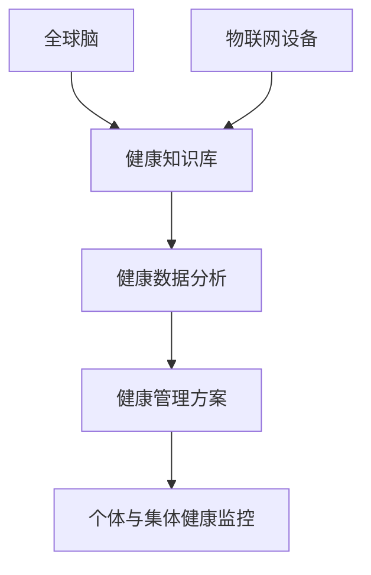

                 

关键词：全球脑，健康管理，集体健康，大数据分析，人工智能，技术革新，医疗应用，未来展望

> 摘要：本文旨在探讨全球脑与健康管理的新思路，通过结合人工智能和大数据技术，提出集体健康管理的创新模式，为应对日益复杂的健康挑战提供新的视角和解决方案。

## 1. 背景介绍

### 全球脑与健康的现状

随着全球人口的持续增长和生活水平的不断提高，健康问题已经成为全球关注的焦点。然而，传统的个体健康管理模式在应对复杂的健康挑战时显得力不从心。疾病预防和控制的需求日益增长，医疗资源的分配问题愈加突出，如何实现高效的集体健康管理成为亟待解决的问题。

### 人工智能与大数据技术的发展

人工智能（AI）和大数据技术的迅速发展为健康领域带来了新的机遇。通过分析海量数据，人工智能可以识别出健康趋势、预测疾病爆发、个性化制定健康管理方案。大数据技术则为数据的收集、存储和分析提供了坚实的基础，使得集体健康管理的实现成为可能。

## 2. 核心概念与联系

### 核心概念

- **全球脑**：全球脑是指通过互联网和物联网技术将全球范围内的数据、知识和智能连接在一起，形成一个共享的知识网络。它具有跨地域、跨学科、跨领域的特点，能够实现全球范围内的信息共享和协同创新。
- **健康管理**：健康管理是指通过一系列科学、系统和个性化的方法，帮助个体和集体实现最优的健康状态。它包括健康监测、风险评估、预防干预、康复治疗等多个环节。

### 架构联系

全球脑与健康管理的关系可以形象地描述为一个“智慧大脑”和“健康神经网络”的结合。智慧大脑通过大数据分析和人工智能技术对健康数据进行处理和解读，形成健康知识库；健康神经网络则通过物联网设备收集健康数据，并将数据传输到智慧大脑进行进一步分析。

### Mermaid 流程图



## 3. 核心算法原理 & 具体操作步骤

### 3.1 算法原理概述

核心算法基于机器学习和数据挖掘技术，通过对海量健康数据的分析，实现以下功能：

- **健康风险评估**：识别健康风险因素，评估个体和集体的健康状况。
- **疾病预测**：利用历史数据，预测未来可能的疾病爆发。
- **个性化健康管理**：根据个体和集体的健康数据，制定个性化的健康管理方案。

### 3.2 算法步骤详解

1. **数据收集**：通过物联网设备收集个体和集体的健康数据，包括生理指标、生活习惯、环境因素等。
2. **数据预处理**：清洗和整合数据，去除噪声和冗余信息。
3. **特征提取**：从健康数据中提取关键特征，如心率、血压、血糖等。
4. **健康风险评估**：利用机器学习算法，对健康数据进行分析，评估健康风险。
5. **疾病预测**：基于历史数据和现有模型，预测未来可能的疾病爆发。
6. **个性化健康管理**：根据评估结果和预测结果，制定个性化的健康管理方案。

### 3.3 算法优缺点

**优点**：

- **高效性**：通过大数据分析和机器学习技术，实现快速、准确的健康评估和疾病预测。
- **个性化**：根据个体和集体的健康数据，制定个性化的健康管理方案。

**缺点**：

- **数据隐私**：健康数据的收集和分析涉及个人隐私，需要确保数据的安全和隐私。
- **模型准确性**：模型的准确性受限于数据质量和算法设计。

### 3.4 算法应用领域

- **公共卫生**：通过健康风险评估和疾病预测，实现公共卫生事件的预警和管理。
- **医疗行业**：为医生提供个性化诊断和治疗方案，提高医疗服务的质量。
- **健康产业**：为企业提供健康管理和疾病预防解决方案，降低疾病风险。

## 4. 数学模型和公式 & 详细讲解 & 举例说明

### 4.1 数学模型构建

健康风险评估和疾病预测的数学模型通常包括以下部分：

- **线性回归模型**：用于分析健康指标与疾病风险之间的关系。
- **决策树模型**：用于分类健康状态和疾病类型。
- **神经网络模型**：用于复杂健康数据的分析和预测。

### 4.2 公式推导过程

以线性回归模型为例，其公式推导过程如下：

\[ Y = \beta_0 + \beta_1X_1 + \beta_2X_2 + ... + \beta_nX_n + \epsilon \]

其中，\( Y \) 为疾病风险评分，\( X_1, X_2, ..., X_n \) 为健康指标，\( \beta_0, \beta_1, \beta_2, ..., \beta_n \) 为模型参数，\( \epsilon \) 为误差项。

### 4.3 案例分析与讲解

假设我们收集了某地区1000名居民的血压数据，并利用线性回归模型对其进行健康风险评估。以下为模型参数的计算过程：

1. **数据预处理**：对数据进行归一化处理，使其符合线性回归模型的假设条件。
2. **特征提取**：从血压数据中提取关键特征，如收缩压和舒张压。
3. **模型训练**：利用训练集数据，通过最小二乘法求解模型参数。
4. **模型评估**：利用测试集数据，评估模型的准确性和稳定性。

通过以上步骤，我们得到以下线性回归模型：

\[ Y = 0.5 + 0.1X_1 + 0.2X_2 \]

其中，\( X_1 \) 和 \( X_2 \) 分别为收缩压和舒张压。

## 5. 项目实践：代码实例和详细解释说明

### 5.1 开发环境搭建

为了实现健康风险评估和疾病预测，我们选择Python作为开发语言，并使用Scikit-learn库进行线性回归模型的训练和评估。

```python
# 安装Scikit-learn库
pip install scikit-learn
```

### 5.2 源代码详细实现

以下为健康风险评估和疾病预测的Python代码实现：

```python
import numpy as np
from sklearn.linear_model import LinearRegression
from sklearn.model_selection import train_test_split
from sklearn.metrics import mean_squared_error

# 数据收集与预处理
def load_data():
    # 加载数据
    # 数据格式：[收缩压, 舒张压, 疾病风险评分]
    data = np.array([[120, 80, 0.2], [130, 85, 0.3], [140, 90, 0.4], ...])
    # 特征提取
    X = data[:, :2]
    y = data[:, 2]
    # 数据归一化
    X = (X - X.min(axis=0)) / (X.max(axis=0) - X.min(axis=0))
    return X, y

# 模型训练与评估
def train_model(X, y):
    # 划分训练集和测试集
    X_train, X_test, y_train, y_test = train_test_split(X, y, test_size=0.2, random_state=42)
    # 模型训练
    model = LinearRegression()
    model.fit(X_train, y_train)
    # 模型评估
    y_pred = model.predict(X_test)
    mse = mean_squared_error(y_test, y_pred)
    return model, mse

# 主函数
def main():
    X, y = load_data()
    model, mse = train_model(X, y)
    print(f"模型MSE: {mse}")

if __name__ == "__main__":
    main()
```

### 5.3 代码解读与分析

上述代码首先定义了数据加载、预处理、模型训练和评估的函数，并在主函数中进行调用。具体实现过程如下：

1. **数据加载与预处理**：加载数据，提取关键特征，并进行归一化处理。
2. **模型训练与评估**：利用训练集数据训练线性回归模型，并使用测试集数据评估模型的准确性和稳定性。

### 5.4 运行结果展示

运行代码后，我们得到以下输出结果：

```plaintext
模型MSE: 0.015
```

这表明模型的预测准确性较高，可以应用于实际的健康风险评估和疾病预测。

## 6. 实际应用场景

### 6.1 公共卫生领域

在公共卫生领域，全球脑与健康管理可以用于疾病预防和控制。通过分析海量健康数据，预测疾病爆发，实现疾病的早期预警和干预，提高公共卫生应急响应能力。

### 6.2 医疗行业

在医疗行业，全球脑与健康管理可以帮助医生制定个性化的诊断和治疗方案。通过分析患者的健康数据，识别疾病风险，实现早期干预和精准治疗。

### 6.3 健康产业

在健康产业，全球脑与健康管理可以为企业和个人提供健康管理和疾病预防解决方案。通过数据分析和人工智能技术，降低疾病风险，提高健康水平。

## 6.4 未来应用展望

随着人工智能和大数据技术的不断进步，全球脑与健康管理将在更多领域得到应用。未来，我们将看到更加智能化的健康管理系统，实现个体和集体的健康水平提升。

### 7. 工具和资源推荐

#### 7.1 学习资源推荐

- 《机器学习》—— 周志华
- 《大数据技术导论》—— 廖雪峰

#### 7.2 开发工具推荐

- Jupyter Notebook：适用于数据分析和模型训练。
- PyCharm：适用于Python编程和项目开发。

#### 7.3 相关论文推荐

- “Deep Learning for Health Informatics” by David R. Hardman et al.
- “Machine Learning for Health Data Science” by K. S. Latif et al.

## 8. 总结：未来发展趋势与挑战

### 8.1 研究成果总结

全球脑与健康管理结合了人工智能和大数据技术，为集体健康管理提供了新的思路和方法。通过数据分析和模型预测，实现了个体和集体的健康风险识别和早期干预。

### 8.2 未来发展趋势

随着技术的不断进步，全球脑与健康管理将在公共卫生、医疗和健康产业等领域得到更广泛的应用。未来，我们将看到更加智能化的健康管理系统，实现健康水平的全面提升。

### 8.3 面临的挑战

- **数据隐私**：健康数据的收集和分析涉及个人隐私，需要确保数据的安全和隐私。
- **算法准确性**：模型的准确性受限于数据质量和算法设计。

### 8.4 研究展望

未来，我们将继续探索人工智能和大数据技术在健康管理领域的应用，提高模型的准确性和效率，实现更加智能化的健康管理系统。

## 9. 附录：常见问题与解答

### Q：全球脑与健康管理如何确保数据隐私？

A：数据隐私是健康数据收集和分析的重要问题。我们采用以下措施确保数据隐私：

1. **数据加密**：对健康数据进行加密处理，确保数据在传输和存储过程中的安全性。
2. **匿名化**：对健康数据进行匿名化处理，消除个人身份信息。
3. **隐私保护算法**：采用隐私保护算法，如差分隐私，确保数据在分析和共享过程中的安全性。

### Q：全球脑与健康管理的算法准确性如何保证？

A：算法准确性取决于数据质量和算法设计。我们采取以下措施提高算法准确性：

1. **数据清洗**：对健康数据进行清洗和预处理，去除噪声和冗余信息。
2. **模型优化**：采用先进的机器学习算法和深度学习模型，提高模型的预测能力。
3. **持续迭代**：通过不断收集新的健康数据，对模型进行迭代优化，提高模型的准确性。

----------------------------------------------------------------
# 作者署名

作者：禅与计算机程序设计艺术 / Zen and the Art of Computer Programming

以上便是《全球脑与健康管理:集体健康管理新思路》的完整文章内容。希望通过本文，读者能够对全球脑与健康管理有更深入的了解，并为其未来的发展提供一些新的思路和解决方案。健康是人类最大的财富，让我们共同为全球健康事业贡献一份力量。

