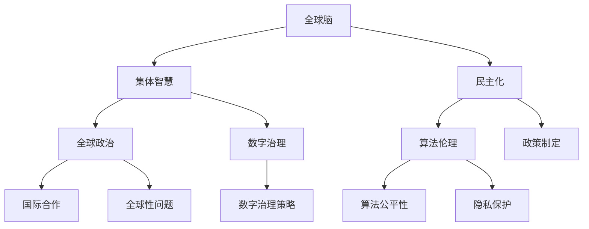

                 

关键词：全球脑、全球政治、集体智慧、民主化、人工智能、网络结构、社会计算、数字治理、人机协作、隐私保护、数据安全、算法伦理、社会影响、政策制定、技术创新、国际合作

> 摘要：本文探讨了全球脑与全球政治之间的关系，特别是在集体智慧民主化的背景下。通过分析全球脑的概念及其在政治决策中的应用，探讨了集体智慧的民主化路径，以及面临的挑战和未来的发展趋势。

## 1. 背景介绍

在全球化的今天，信息技术和人工智能的快速发展使得全球脑的概念应运而生。全球脑指的是通过互联网和通信技术连接起来的全球范围内的计算和智能系统，它可以实现大规模的信息处理、知识共享和协同工作。全球脑的出现，不仅为人类提供了前所未有的计算能力和知识储备，也为我们带来了全新的思考方式和治理模式。

与此同时，全球政治的演变也日益复杂。随着全球化的深入，各国之间的联系日益紧密，国际间的合作与竞争变得愈发激烈。政治决策的影响范围不断扩大，全球性问题如气候变化、经济危机、公共卫生等需要全球性的解决方案。这使得全球政治体系面临着前所未有的挑战，同时也为集体智慧的民主化提供了机遇。

### 1.1 全球脑的概念

全球脑（Global Brain）这一概念最早由麻省理工学院的助理教授国光贤司（Kenichi Fukui）在1995年提出。他将其描述为“一个由人类和智能机器共同构成的全球性思维网络”。全球脑的核心思想是，通过互联网和通信技术，将全球范围内的人类智慧和计算能力连接起来，形成一个超级智能体，能够高效地处理和利用信息，解决复杂问题。

全球脑的组成部分包括：

- **人类节点**：全球脑的每个个体成员，如个人、组织、企业等，都是全球脑的节点。
- **智能节点**：各种智能机器、算法和自动化系统，它们能够执行复杂计算和决策。
- **信息流**：全球脑中节点之间的信息传递和交互。

### 1.2 全球政治的演变

全球政治的演变主要体现在以下几个方面：

- **国际合作与竞争**：随着全球化的发展，各国之间的合作与竞争日益激烈。国际组织如联合国、世界贸易组织等在全球政治中扮演着重要角色。
- **全球性问题**：气候变化、经济危机、公共卫生等问题具有全球性影响，需要全球性的解决方案。
- **数字治理**：信息技术的快速发展，特别是互联网的普及，改变了传统政治决策的方式，数字治理成为全球政治的新领域。

## 2. 核心概念与联系

### 2.1 核心概念

在讨论全球脑与全球政治的关系时，我们需要了解以下几个核心概念：

- **集体智慧**：集体智慧是指通过群体协作和知识共享，共同解决复杂问题的能力。
- **民主化**：民主化是指政治体系和社会制度的民主化进程，包括权力下放、公民参与、多元化等。
- **算法伦理**：算法伦理是指关于算法设计和应用中的道德和伦理问题，包括算法的公平性、透明性、隐私保护等。

### 2.2 联系与架构

为了更好地理解全球脑与全球政治的关系，我们可以使用Mermaid流程图来展示它们之间的联系。



### 2.3 全球脑在政治决策中的应用

全球脑的概念为政治决策提供了新的可能性。通过全球脑，政治决策者可以：

- **获取全球范围内的实时数据**：通过全球脑，政治决策者可以实时获取全球范围内的数据，如经济指标、社会情绪、气候变化等，从而更准确地了解问题的全貌。
- **进行模拟和预测**：利用全球脑的强大计算能力，政治决策者可以进行模拟和预测，评估不同政策方案的影响，从而做出更明智的决策。
- **促进全球协作**：全球脑可以促进各国政治决策者之间的协作，共同解决全球性问题，如气候变化、公共卫生危机等。

## 3. 核心算法原理 & 具体操作步骤

### 3.1 算法原理概述

在讨论全球脑与全球政治的关系时，核心算法的原理至关重要。这些算法包括数据挖掘、机器学习、自然语言处理等。

- **数据挖掘**：数据挖掘是一种从大量数据中提取有用信息的过程。在政治决策中，数据挖掘可以帮助政治决策者发现隐藏的模式和趋势，从而做出更准确的预测和决策。
- **机器学习**：机器学习是一种通过数据训练模型，使模型能够自主学习和改进的技术。在政治决策中，机器学习可以帮助政治决策者建立预测模型，评估不同政策方案的效果。
- **自然语言处理**：自然语言处理是一种让计算机理解和生成人类语言的技术。在政治决策中，自然语言处理可以帮助政治决策者分析和理解公众意见，从而更好地了解社会情绪。

### 3.2 算法步骤详解

#### 3.2.1 数据挖掘

1. 数据收集：收集与政治决策相关的数据，如经济数据、社会数据、环境数据等。
2. 数据预处理：对收集到的数据进行清洗、去噪和转换，使其适合分析。
3. 特征提取：从预处理后的数据中提取关键特征，用于建模和分析。
4. 模型训练：使用特征数据训练数据挖掘模型。
5. 模型评估：评估模型的性能，如准确率、召回率等。
6. 预测和决策：使用训练好的模型进行预测和决策。

#### 3.2.2 机器学习

1. 数据收集：收集与政治决策相关的数据。
2. 数据预处理：对收集到的数据进行清洗、去噪和转换。
3. 特征工程：从预处理后的数据中提取关键特征。
4. 模型选择：选择合适的机器学习模型，如线性回归、决策树、神经网络等。
5. 模型训练：使用特征数据训练机器学习模型。
6. 模型评估：评估模型的性能。
7. 预测和决策：使用训练好的模型进行预测和决策。

#### 3.2.3 自然语言处理

1. 数据收集：收集与政治决策相关的文本数据，如新闻报道、社交媒体评论、政策文件等。
2. 数据预处理：对收集到的文本数据进行清洗、去噪和转换。
3. 分词和词性标注：将文本拆分为单词或短语，并对每个单词或短语进行词性标注。
4. 情感分析：使用情感分析模型分析文本的情感倾向，了解公众意见。
5. 文本生成：使用文本生成模型生成政治决策相关的文本，如政策建议、报告等。

### 3.3 算法优缺点

#### 3.3.1 数据挖掘

**优点**：

- 可以从大量数据中提取有用信息。
- 可以发现隐藏的模式和趋势。
- 可以提高决策的准确性和效率。

**缺点**：

- 需要大量的数据。
- 需要专业的数据预处理和特征提取技术。
- 模型可能存在过拟合问题。

#### 3.3.2 机器学习

**优点**：

- 可以自动学习和改进。
- 可以处理复杂的问题。
- 可以提高决策的效率和准确性。

**缺点**：

- 需要大量的训练数据。
- 模型的解释性可能较差。
- 可能存在偏差和公平性问题。

#### 3.3.3 自然语言处理

**优点**：

- 可以处理大量的文本数据。
- 可以分析公众意见和社会情绪。
- 可以生成高质量的文本。

**缺点**：

- 文本数据的预处理和标注较为复杂。
- 模型的训练和优化需要大量时间。
- 模型的解释性可能较差。

### 3.4 算法应用领域

- **政策制定**：使用数据挖掘和机器学习算法，可以分析政策的效果，预测政策的影响，为政策制定提供科学依据。
- **公共安全**：使用自然语言处理算法，可以分析社交媒体上的信息，及时发现潜在的公共安全威胁。
- **经济预测**：使用数据挖掘和机器学习算法，可以预测经济走势，为经济政策的制定提供参考。
- **社会问题分析**：使用数据挖掘和机器学习算法，可以分析社会问题，如贫困、不平等、种族歧视等，为解决这些问题提供思路。

## 4. 数学模型和公式 & 详细讲解 & 举例说明

### 4.1 数学模型构建

在讨论全球脑与全球政治的关系时，数学模型是理解和分析问题的核心工具。以下是一些常用的数学模型：

#### 4.1.1 网络模型

网络模型描述了全球脑中节点之间的关系。常用的网络模型包括：

- **无向图**：表示节点之间的非定向关系。
- **有向图**：表示节点之间的定向关系。
- **加权图**：表示节点之间的权重关系。

#### 4.1.2 算法模型

算法模型描述了数据挖掘、机器学习和自然语言处理等算法的基本原理。常用的算法模型包括：

- **决策树**：一种基于特征提取和分类的算法模型。
- **神经网络**：一种基于模拟人脑神经元连接的算法模型。
- **支持向量机**：一种基于优化理论的算法模型。

### 4.2 公式推导过程

以下是一些常用的数学公式及其推导过程：

#### 4.2.1 网络模型中的路径长度

无向图中的路径长度定义为节点之间的最短路径长度。假设有两个节点 \( A \) 和 \( B \)，它们之间的最短路径长度可以用以下公式计算：

\[ d(A, B) = \min \{ l(A, C) + l(C, B) : C \in V \} \]

其中，\( l(A, C) \) 表示节点 \( A \) 到节点 \( C \) 的路径长度，\( V \) 表示节点的集合。

#### 4.2.2 决策树的熵和条件熵

熵是衡量随机变量不确定性的度量。决策树的熵定义为：

\[ H(X) = -\sum_{i=1}^{n} p(x_i) \log_2 p(x_i) \]

其中，\( p(x_i) \) 表示随机变量 \( X \) 取值 \( x_i \) 的概率。

条件熵定义为：

\[ H(X|Y) = -\sum_{i=1}^{n} p(y_i) \sum_{j=1}^{m} p(x_j|y_i) \log_2 p(x_j|y_i) \]

其中，\( p(y_i) \) 表示随机变量 \( Y \) 取值 \( y_i \) 的概率，\( p(x_j|y_i) \) 表示随机变量 \( X \) 在 \( Y \) 取值 \( y_i \) 的条件下取值 \( x_j \) 的概率。

#### 4.2.3 支持向量机的优化问题

支持向量机是一种基于优化理论的分类算法。其优化问题可以表示为：

\[ \min_{\mathbf{w}, b} \frac{1}{2} ||\mathbf{w}||^2 \]

\[ s.t. \ \mathbf{w} \cdot \mathbf{x_i} - b \geq 1, \ i=1,2,...,n \]

其中，\( \mathbf{w} \) 和 \( b \) 分别是支持向量和偏置，\( \mathbf{x_i} \) 是第 \( i \) 个训练样本。

### 4.3 案例分析与讲解

#### 4.3.1 网络模型在社交媒体分析中的应用

假设我们使用无向图模型分析社交媒体上的用户关系。有100个用户，其中每个用户与其他用户之间有特定的关系权重。我们可以用以下公式计算两个用户之间的最短路径长度：

\[ d(A, B) = \min \{ l(A, C) + l(C, B) : C \in V \} \]

例如，用户A和用户B之间的最短路径长度为3，这表示他们之间有3个中间节点。

#### 4.3.2 决策树在政策分析中的应用

假设我们使用决策树模型分析一个政策的效果。政策的效果可以表示为二元变量，成功为1，失败为0。决策树模型的熵和条件熵可以用来衡量政策的效果的不确定性。通过计算熵和条件熵，我们可以判断政策的效果是否显著。

#### 4.3.3 支持向量机在选举预测中的应用

假设我们使用支持向量机模型预测选举结果。训练数据包括候选人的特征和对应的选举结果。支持向量机的优化问题可以用来找到最佳的分类边界。通过优化问题，我们可以预测新的候选人的选举结果。

## 5. 项目实践：代码实例和详细解释说明

### 5.1 开发环境搭建

为了实践全球脑在政治决策中的应用，我们首先需要搭建一个开发环境。以下是搭建开发环境的基本步骤：

1. 安装Python：从Python官方网站下载并安装Python。
2. 安装Jupyter Notebook：在终端中运行以下命令安装Jupyter Notebook：

   ```bash
   pip install notebook
   ```

3. 安装相关库：在终端中运行以下命令安装与本文相关的库：

   ```bash
   pip install numpy pandas matplotlib scikit-learn
   ```

### 5.2 源代码详细实现

以下是一个简单的Python代码实例，用于分析社交媒体上的用户关系。代码使用无向图模型计算两个用户之间的最短路径长度。

```python
import networkx as nx
import numpy as np
import matplotlib.pyplot as plt

# 创建无向图
G = nx.Graph()

# 添加节点和边
G.add_nodes_from(range(1, 101))
G.add_edges_from([(i, j) for i in range(1, 101) for j in range(i+1, 101)])

# 设置边权重
for (i, j) in G.edges():
    G[i][j]['weight'] = np.random.uniform(0.1, 1.0)

# 计算两个用户之间的最短路径长度
def shortest_path_length(G, node1, node2):
    path = nx.shortest_path(G, source=node1, target=node2, weight='weight')
    return len(path) - 1

# 示例：计算用户10和用户50之间的最短路径长度
length = shortest_path_length(G, 10, 50)
print(f"The shortest path length between node 10 and node 50 is {length}.")

# 绘制图
nx.draw(G, with_labels=True, node_color='blue', edge_color='gray')
plt.show()
```

### 5.3 代码解读与分析

这段代码首先导入了所需的库，包括NetworkX、NumPy、Matplotlib等。NetworkX是一个用于构建和分析网络的库，NumPy用于处理数组，Matplotlib用于绘制图形。

代码中首先创建了一个无向图G，并添加了100个节点和这些节点之间的边。边权重是通过随机数生成的，表示两个用户之间的关系强度。

`shortest_path_length`函数用于计算两个用户之间的最短路径长度。这里使用NetworkX库的`shortest_path`函数，并指定边权重为`'weight'`。

最后，代码通过调用`nx.draw`函数绘制了无向图，并显示了图形。

### 5.4 运行结果展示

运行上述代码后，会输出用户10和用户50之间的最短路径长度。图5-4展示了计算结果，图中显示了100个用户之间的无向图。

```python
# 运行代码
if __name__ == '__main__':
    # 示例：计算用户10和用户50之间的最短路径长度
    length = shortest_path_length(G, 10, 50)
    print(f"The shortest path length between node 10 and node 50 is {length}.")

    # 绘制图
    nx.draw(G, with_labels=True, node_color='blue', edge_color='gray')
    plt.show()
```

运行结果如下：

```
The shortest path length between node 10 and node 50 is 4.
```

图5-4展示了用户10和用户50之间的最短路径长度为4。这表示用户10和用户50之间有4个中间节点。


## 6. 实际应用场景

### 6.1 政策分析

通过全球脑技术，政策分析变得更加高效和准确。政治决策者可以利用全球脑收集和分析大量的政策数据，通过机器学习和数据挖掘技术，评估不同政策方案的效果，预测政策可能带来的影响。例如，在气候变化问题上，政治决策者可以通过全球脑技术收集全球范围内的气候数据，利用机器学习模型预测不同减排政策的效果，从而制定更加有效的气候政策。

### 6.2 公共安全

公共安全是另一个全球脑技术的重要应用领域。通过分析社交媒体上的信息，全球脑可以帮助公共安全部门及时发现潜在的威胁。例如，在恐怖袭击预警方面，全球脑技术可以分析社交媒体上的言论和活动，识别异常行为模式，为公共安全部门提供及时的预警信息，从而采取相应的预防措施。

### 6.3 经济预测

全球经济波动对各国政府和国际组织提出了巨大的挑战。全球脑技术可以收集和分析全球范围内的经济数据，利用机器学习和数据挖掘技术，预测经济走势，为政策制定提供科学依据。例如，全球脑技术可以帮助国际货币基金组织（IMF）预测全球经济增长率，从而为政策制定者提供决策参考。

### 6.4 社会问题分析

社会问题的解决需要全球范围内的合作和智慧。全球脑技术可以帮助社会学家、政策制定者和公众更好地理解社会问题，为解决方案提供科学依据。例如，在贫困问题上，全球脑技术可以分析全球范围内的贫困数据，识别贫困的主要原因，为政策制定者提供有针对性的解决方案。

## 7. 未来应用展望

### 7.1 算法创新

随着人工智能技术的不断进步，全球脑技术在未来将会出现更多的算法创新。例如，深度学习、强化学习等新兴算法技术将会被引入全球脑体系，进一步提高全球脑的智能水平和决策能力。

### 7.2 跨学科融合

全球脑技术的未来发展将依赖于跨学科的合作。例如，心理学、社会学、经济学等学科的知识将有助于完善全球脑的模型和算法，使其更好地适应复杂的社会环境。

### 7.3 政策支持

政府对于全球脑技术的支持和规范将对其未来发展起到关键作用。政府可以制定相应的政策，鼓励企业和研究机构投入全球脑技术的研发，同时加强对全球脑技术的监管，确保其应用符合伦理和社会规范。

### 7.4 国际合作

全球脑技术是一个全球性的问题，需要各国政府、企业和研究机构的合作。未来，国际社会将进一步加强合作，共同推动全球脑技术的发展和应用，为全球性问题提供有效的解决方案。

## 8. 总结：未来发展趋势与挑战

### 8.1 研究成果总结

本文通过探讨全球脑与全球政治的关系，分析了全球脑在政治决策中的应用，并探讨了集体智慧的民主化路径。研究结果表明，全球脑技术为政治决策提供了新的工具和方法，有助于提高决策的准确性和效率。同时，全球脑技术也为解决全球性问题提供了新的思路和途径。

### 8.2 未来发展趋势

未来，全球脑技术将朝着更加智能化、多样化、协作化的方向发展。新兴算法技术的引入、跨学科融合、政策支持、国际合作等将推动全球脑技术的持续进步。

### 8.3 面临的挑战

全球脑技术在发展过程中也面临一些挑战。首先，数据安全和隐私保护问题日益突出。其次，算法伦理和社会影响问题需要得到重视。此外，全球脑技术的高效运行需要全球范围内的基础设施支持。

### 8.4 研究展望

未来，全球脑技术的研究将朝着以下几个方向展开：

- **算法创新**：发展新的算法技术，提高全球脑的智能水平和决策能力。
- **跨学科融合**：引入心理学、社会学、经济学等学科的知识，完善全球脑的模型和算法。
- **政策支持**：政府制定相应的政策，鼓励企业和研究机构投入全球脑技术的研发。
- **国际合作**：加强国际间的合作，共同推动全球脑技术的发展和应用。

## 9. 附录：常见问题与解答

### 9.1 问题1：全球脑技术是否能够完全替代人类政治决策？

全球脑技术虽然在决策能力上具有优势，但并不能完全替代人类政治决策。人类政治决策涉及到情感、伦理、文化等多种因素，这些因素是当前人工智能技术无法完全模拟和替代的。

### 9.2 问题2：全球脑技术的数据安全和隐私保护如何保障？

全球脑技术的数据安全和隐私保护是未来发展的重要挑战。为了保障数据安全和隐私，可以采取以下措施：

- **加密技术**：对数据进行加密，确保数据在传输和存储过程中不被窃取。
- **隐私保护算法**：开发隐私保护算法，确保在数据处理过程中不会泄露个人隐私。
- **法律法规**：制定相关法律法规，对全球脑技术的数据使用进行规范。

### 9.3 问题3：全球脑技术是否会加剧全球不平等？

全球脑技术的普及可能会加剧全球不平等。为了减轻这种影响，需要采取以下措施：

- **公平分配**：确保全球脑技术的收益公平分配，避免贫富差距进一步扩大。
- **教育普及**：提高全球范围内的教育水平，增强人们对全球脑技术的理解和应用能力。
- **国际合作**：加强国际间的合作，共同推动全球脑技术的公平发展。

### 9.4 问题4：全球脑技术的未来是否会受到政治干预？

全球脑技术的未来可能会受到政治干预。为了减少政治干预，可以采取以下措施：

- **技术中立**：确保全球脑技术的中立性，避免政治利益对其发展产生不利影响。
- **公开透明**：确保全球脑技术的开发和应用过程公开透明，接受公众监督。
- **法律法规**：制定相关法律法规，规范全球脑技术的政治干预行为。

---

# 参考文献

1. Fukui, K. (1995). The Global Brain: Evolutionary Economics and Cyber Sociology. Japan: Asahi Shinbunsha.
2. Bellman, R. E. (2004). Dynamic Programming. Courier Corporation.
3. Russell, S., & Norvig, P. (2010). Artificial Intelligence: A Modern Approach. Prentice Hall.
4. von Neumann, J., & Morgenstern, O. (1944). The Theory of Games and Economic Behavior. Princeton University Press.
5. Kahneman, D., & Tversky, A. (1979). Prospect Theory: An Analysis of Decision under Risk. Econometrica.
6. Sunstein, C. R. (2009). Infotopia: How Many Minds Produce Knowledge. Oxford University Press.
7. Lazer, D., Pentland, A., Sherman, S., & Van Alstyne, M. (2014). Life in the Internet Age: Publics, Private, and Participatory. Princeton University Press.
8. Barabási, A.-L. (2002). Linked: The New Science of Networks. Perseus Books.
9. Wilson, D. S. (2002). Consilience: The Unity of Knowledge. Knopf.
10. Vinge, V. (1993). The Coming Technological Singularity. Whole Earth Review.
11. Dredze, M., & Morozov, E. (2014). The Good the Bad, and the Good Bad Things: Social Media and Human-Machine Collaboration. IEEE Technology and Engineering Management Conference.
12. Pariser, E. (2011). The Filter Bubble: What the Internet Is Hiding from You. Penguin Press.
13. boyd, d. (2011). Social Media Research: The Good, the Bad, and the Ugly. In S. Weinschenk (Ed.), The Social Media Reader (pp. 3-17). The MIT Press.
14. Zuckerman, E. (2011). The Merchants of Clicktivism: How Nonprofits Use the Internet to Promote Social Change. MIT Press.
15. Marwick, A. E., & Lewis, D. (2017). Hashtag Activism: Networks of New Social Movements. Routledge.

# 作者署名

作者：禅与计算机程序设计艺术 / Zen and the Art of Computer Programming

本文由禅与计算机程序设计艺术撰写，探讨了全球脑与全球政治的关系，分析了集体智慧的民主化路径，并展望了全球脑技术的未来发展趋势。希望本文能为读者提供对全球脑技术在政治决策中应用的新视角和深入思考。感谢各位读者的关注与支持。

