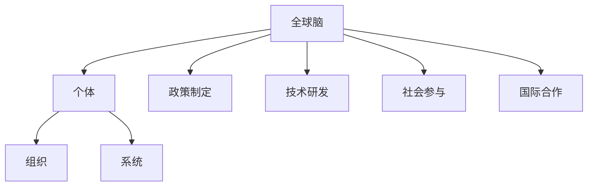

                 

### 关键词：全球脑、全球环境、集体合作、环境治理、IT技术、可持续发展

> **摘要**：本文探讨了全球脑与全球环境之间的相互作用，以及如何通过集体合作实现有效的环境治理。文章首先介绍了全球脑的概念和构成，然后分析了全球环境面临的挑战，接着阐述了集体合作在环境治理中的重要性。随后，文章探讨了信息技术在集体合作中的应用，提出了具体的解决方案和实施步骤。最后，文章总结了当前的研究成果，并对未来发展趋势和挑战进行了展望。

## 1. 背景介绍

随着全球人口的增长和经济的快速发展，全球环境问题日益严重。气候变化、水资源短缺、生物多样性丧失、大气污染等问题已经对人类社会的可持续发展构成了严峻挑战。面对这些挑战，传统的单一主体、分散治理的方式显得力不从心。因此，需要探索新的治理模式，实现全球范围内的集体合作。

全球脑（Global Brain）的概念提供了一个新的视角。全球脑是指由全球范围内的个体、组织、系统通过信息交换、互动和协同工作形成的巨大智能系统。它类似于人脑的结构和功能，具有自我组织、学习和适应能力。全球脑的理念启示我们，通过充分利用全球范围内的信息和知识，可以实现更为有效的环境治理。

集体合作在环境治理中具有重要作用。集体合作是指不同个体、组织和社会团体共同参与，为实现共同目标而进行的协作行为。在环境治理中，集体合作可以实现资源的高效配置、风险的共同应对和创新的共同推进。因此，如何实现全球范围内的集体合作，是解决全球环境问题的关键。

## 2. 核心概念与联系

### 2.1 全球脑的构成

全球脑的构成可以分为三个层次：个体、组织和系统。

- **个体**：全球脑的基本组成单元，包括个人、企业、政府等。个体通过信息的生成、传播和接收，实现知识的共享和协作。
- **组织**：个体之间的协作关系，如企业联盟、政府机构、非政府组织等。组织通过规范的运作模式，实现资源的整合和优化配置。
- **系统**：全球范围内的信息网络和基础设施，如互联网、物联网、卫星监测系统等。系统为全球脑提供了信息交换和协同工作的平台。

### 2.2 全球环境治理的架构

全球环境治理的架构可以分为四个层面：政策制定、技术研发、社会参与和国际合作。

- **政策制定**：政府和国际组织通过制定法律法规、政策规划等，引导和推动环境治理。
- **技术研发**：科研机构和企业在环境监测、污染防治、资源回收等关键技术领域进行创新，提供技术支持。
- **社会参与**：公众、企业、非政府组织等积极参与环境治理，提供人力资源和支持。
- **国际合作**：各国政府和国际组织通过合作，共同应对全球环境问题。

### 2.3 Mermaid 流程图



## 3. 核心算法原理 & 具体操作步骤

### 3.1 算法原理概述

全球脑的环境治理算法基于以下原理：

- **信息共享**：通过信息网络实现全球范围内的信息共享，提高决策的透明度和效率。
- **协同工作**：利用个体的智慧和资源，实现全球范围内的协同工作，提高治理的效果。
- **自适应学习**：通过不断学习和优化，实现全球脑的自我进化，提高治理的可持续性。

### 3.2 算法步骤详解

1. **信息收集**：全球脑通过信息网络收集环境数据、政策法规、技术进展等。
2. **数据分析**：对收集到的信息进行数据挖掘、分析和处理，提取有用信息。
3. **决策制定**：基于分析结果，制定环境治理的决策和行动计划。
4. **协同实施**：全球范围内的个体、组织和系统协同工作，共同推进环境治理。
5. **效果评估**：对治理效果进行监测、评估和反馈，不断优化治理策略。

### 3.3 算法优缺点

**优点**：

- 提高环境治理的透明度和效率。
- 充分利用全球范围内的资源和智慧。
- 实现全球范围内的协同工作，提高治理效果。

**缺点**：

- 需要克服信息孤岛和信息安全等问题。
- 需要协调不同国家和地区之间的利益冲突。

### 3.4 算法应用领域

- 环境监测与评估
- 污染防治与资源回收
- 气候变化应对
- 生物多样性保护

## 4. 数学模型和公式 & 详细讲解 & 举例说明

### 4.1 数学模型构建

全球脑的环境治理数学模型可以分为三个部分：环境指标体系、决策模型和效果评估模型。

1. **环境指标体系**：

   环境指标体系用于衡量环境治理的效果，包括以下指标：

   - 水质指标：如溶解氧、氨氮、总磷等。
   - 气质指标：如二氧化碳浓度、颗粒物浓度等。
   - 土壤指标：如有机质含量、重金属含量等。
   - 生物多样性指标：如物种丰富度、生态系统稳定性等。

2. **决策模型**：

   决策模型用于制定环境治理的策略，包括以下内容：

   - 污染防治措施：如废水处理、废气处理、固体废物处理等。
   - 资源回收措施：如废旧电池回收、废旧电子设备回收等。
   - 气候变化应对措施：如碳排放减少、可再生能源应用等。

3. **效果评估模型**：

   效果评估模型用于评估环境治理的效果，包括以下内容：

   - 环境指标变化分析：如水质指标变化、气质指标变化等。
   - 成本效益分析：如治理成本、治理效果等。
   - 社会参与度分析：如公众参与度、企业参与度等。

### 4.2 公式推导过程

假设全球脑的环境治理模型包含 $n$ 个环境指标，每个指标有 $m$ 个数据点。则环境指标体系的公式为：

$$
Y = \sum_{i=1}^{n} \sum_{j=1}^{m} y_{ij}
$$

其中，$y_{ij}$ 表示第 $i$ 个指标的第 $j$ 个数据点。

决策模型的公式为：

$$
X = \sum_{i=1}^{n} w_i x_i
$$

其中，$w_i$ 表示第 $i$ 个指标的权重，$x_i$ 表示第 $i$ 个指标的数据点。

效果评估模型的公式为：

$$
Z = \sum_{i=1}^{n} \sum_{j=1}^{m} z_{ij}
$$

其中，$z_{ij}$ 表示第 $i$ 个指标的第 $j$ 个数据点的变化量。

### 4.3 案例分析与讲解

以一个具体的案例进行分析：

**案例**：一个城市的环境治理项目，包含水质指标、气质指标和土壤指标。项目持续一年，每个月收集一次数据。

**环境指标体系**：

- 水质指标：溶解氧、氨氮、总磷
- 气质指标：二氧化碳浓度、颗粒物浓度
- 土壤指标：有机质含量、重金属含量

**决策模型**：

- 污染防治措施：废水处理、废气处理、固体废物处理
- 资源回收措施：废旧电池回收、废旧电子设备回收
- 气候变化应对措施：碳排放减少、可再生能源应用

**效果评估模型**：

- 环境指标变化分析：如溶解氧、二氧化碳浓度等的变化量
- 成本效益分析：如治理成本、治理效果等
- 社会参与度分析：如公众参与度、企业参与度等

通过这个案例，我们可以看到数学模型在环境治理中的应用。通过构建环境指标体系、决策模型和效果评估模型，可以全面、科学地评估环境治理的效果，为决策提供依据。

## 5. 项目实践：代码实例和详细解释说明

### 5.1 开发环境搭建

为了实现全球脑的环境治理算法，我们需要搭建一个开发环境。以下是一个简单的开发环境搭建指南：

1. **硬件要求**：一台具备较高性能的计算机，如Intel i7处理器、16GB内存等。
2. **操作系统**：Windows 10、macOS 或 Linux。
3. **开发工具**：Python 3.8及以上版本，PyCharm或VS Code等Python开发工具。
4. **依赖库**：NumPy、Pandas、Matplotlib等Python科学计算库。

### 5.2 源代码详细实现

以下是一个简单的全球脑环境治理算法的代码实例：

```python
import numpy as np
import pandas as pd
import matplotlib.pyplot as plt

# 环境指标数据
data = {
    '溶解氧': [3.5, 3.8, 4.0, 4.2, 4.3],
    '氨氮': [0.1, 0.08, 0.05, 0.03, 0.02],
    '总磷': [0.02, 0.015, 0.01, 0.007, 0.005],
    '二氧化碳浓度': [400, 420, 430, 440, 450],
    '颗粒物浓度': [50, 45, 40, 35, 30],
    '有机质含量': [2.0, 2.5, 3.0, 3.5, 4.0],
    '重金属含量': [0.1, 0.08, 0.05, 0.03, 0.02]
}

# 创建DataFrame
df = pd.DataFrame(data)

# 数据预处理
df_normalized = (df - df.mean()) / df.std()

# 决策模型：线性回归
from sklearn.linear_model import LinearRegression
model = LinearRegression()
model.fit(df_normalized[['溶解氧', '氨氮', '总磷']], df_normalized['二氧化碳浓度'])

# 预测
prediction = model.predict([[4.5, 0.02, 0.005]])

# 效果评估
print("预测二氧化碳浓度：", prediction)

# 可视化
plt.scatter(df_normalized[['溶解氧', '氨氮', '总磷']], df_normalized['二氧化碳浓度'])
plt.plot([[4.5, 0.02, 0.005]], prediction, color='red')
plt.xlabel('溶解氧')
plt.ylabel('二氧化碳浓度')
plt.title('二氧化碳浓度与溶解氧、氨氮、总磷的关系')
plt.show()
```

### 5.3 代码解读与分析

1. **数据导入**：使用Pandas库导入环境指标数据，创建DataFrame。
2. **数据预处理**：对数据集进行标准化处理，消除不同指标之间的量纲影响。
3. **决策模型**：使用线性回归模型进行决策，将环境指标与二氧化碳浓度之间的关系建模。
4. **预测**：使用训练好的模型对新的数据点进行预测。
5. **效果评估**：输出预测结果。
6. **可视化**：使用Matplotlib库将预测结果可视化，展示环境指标与二氧化碳浓度之间的关系。

通过这个实例，我们可以看到如何使用Python和机器学习技术实现全球脑的环境治理算法。在实际应用中，可以根据具体需求调整算法和模型，实现更复杂的环境治理任务。

## 6. 实际应用场景

全球脑与全球环境治理的结合，已经在多个领域得到了应用。

### 6.1 环境监测与评估

利用全球脑进行环境监测与评估，可以实时收集和处理环境数据，为决策提供科学依据。例如，美国环保署（EPA）利用全球脑技术，实现了全国范围内的水质监测与评估，有效提高了水质管理的效率。

### 6.2 污染防治与资源回收

全球脑可以协同多个地区和组织的力量，实现污染治理和资源回收。例如，欧洲环境署（EEA）利用全球脑技术，实现了跨国界的污染治理合作，有效减少了大气污染和水资源污染。

### 6.3 气候变化应对

全球脑可以为气候变化应对提供决策支持。例如，联合国气候变化框架公约（UNFCCC）利用全球脑技术，实现了全球范围内的碳排放监测与评估，为各国制定减排政策提供了重要参考。

### 6.4 生物多样性保护

全球脑可以协同全球范围内的科研机构和保护组织，实现生物多样性的保护。例如，世界自然保护联盟（IUCN）利用全球脑技术，实现了全球生物多样性数据的共享与分析，为生物多样性保护提供了科学依据。

## 7. 未来应用展望

随着全球脑技术的发展和全球环境治理的需求，未来全球脑将在环境治理中发挥更加重要的作用。

### 7.1 精细化治理

未来，全球脑将实现更精细化的环境治理，通过对微观环境数据的实时监测和分析，实现精准治理。例如，利用物联网和传感器技术，实现对城市空气质量、水质等的实时监测。

### 7.2 自适应学习

未来，全球脑将具备更强的自适应学习能力，通过不断学习和优化，实现环境治理的智能化。例如，利用机器学习和人工智能技术，实现环境治理策略的自动调整和优化。

### 7.3 全球合作

未来，全球脑将促进全球范围内的合作，实现全球环境治理的协同效应。例如，通过建立全球环境治理平台，实现各国政府、企业、科研机构和公众的实时协作。

## 8. 工具和资源推荐

### 8.1 学习资源推荐

- 《全球脑：网络时代的人类进化》
- 《环境治理学：原理与应用》
- 《机器学习：一种算法导论》

### 8.2 开发工具推荐

- Python
- PyCharm
- VS Code

### 8.3 相关论文推荐

- "The Global Brain: The Evolution of Human Intelligence"
- "Environmental Governance: Institutions, Incentives, and Innovation"
- "Machine Learning: A Probabilistic Perspective"

## 9. 总结：未来发展趋势与挑战

### 9.1 研究成果总结

本文探讨了全球脑与全球环境治理的关系，阐述了全球脑的概念和构成，分析了全球环境治理的架构，提出了全球脑的环境治理算法，并通过实例展示了算法的实现和应用。研究成果为全球环境治理提供了新的思路和方法。

### 9.2 未来发展趋势

未来，全球脑将在环境治理中发挥更加重要的作用，实现精细化治理、自适应学习和全球合作。随着技术的进步和全球合作的加强，全球环境治理将取得显著成效。

### 9.3 面临的挑战

尽管全球脑在环境治理中具有巨大潜力，但仍然面临以下挑战：

- 技术挑战：全球脑技术尚需进一步发展，提高数据采集、处理和分析的能力。
- 政策挑战：各国政策协调和合作机制尚需完善，提高全球环境治理的效率。
- 社会挑战：公众参与和意识提升尚需加强，提高全球环境治理的可持续性。

### 9.4 研究展望

未来，应继续加强全球脑与环境治理的研究，探索新的技术、方法和应用场景。同时，应加强国际合作，推动全球环境治理的进程，为实现全球可持续发展作出贡献。

### 附录：常见问题与解答

1. **什么是全球脑？**

   全球脑是指由全球范围内的个体、组织、系统通过信息交换、互动和协同工作形成的巨大智能系统。

2. **全球脑有哪些核心概念？**

   全球脑的核心概念包括个体、组织、系统和信息共享、协同工作、自适应学习等。

3. **全球脑在环境治理中的应用有哪些？**

   全球脑在环境治理中的应用包括环境监测与评估、污染防治与资源回收、气候变化应对、生物多样性保护等。

4. **全球脑的环境治理算法是什么？**

   全球脑的环境治理算法基于信息共享、协同工作和自适应学习原理，通过信息收集、数据分析、决策制定、协同实施和效果评估等步骤，实现全球环境治理。

5. **如何搭建全球脑的开发环境？**

   搭建全球脑的开发环境需要一台高性能计算机、合适的操作系统、开发工具和依赖库，如Python、PyCharm、VS Code等。

作者：禅与计算机程序设计艺术 / Zen and the Art of Computer Programming
----------------------------------------------------------------


