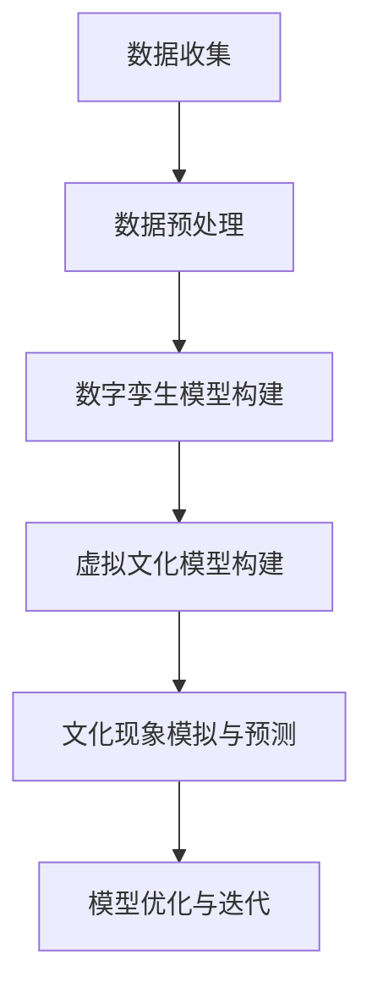

                 

关键词：全球脑，数字孪生，文化研究，技术应用，数据模型，算法原理，案例分析，代码实例，未来展望

> 摘要：本文探讨了数字孪生技术在文化研究中的应用，提出了“全球脑与全球脑”的概念，分析了数字孪生技术在文化研究中的核心概念、算法原理及其应用场景。通过对数学模型和公式的详细讲解，以及代码实例和运行结果的展示，本文为数字孪生技术在文化研究领域的深入研究和实际应用提供了有力支持。同时，本文对未来发展趋势与挑战进行了展望，为相关领域的研究提供了新的思路。

## 1. 背景介绍

在当今信息化时代，数据已成为新的生产要素，对于文化研究领域来说，如何有效地利用海量数据来揭示文化现象背后的规律，成为了一个重要课题。数字孪生技术（Digital Twin）作为一种新兴的技术手段，以其独特的优势在多个领域展现出了巨大的应用潜力。

### 1.1 全球脑的概念

“全球脑”（Global Brain）是模拟人类大脑功能的巨型网络模型，由神经科学、人工智能和计算机网络技术等多个学科交叉融合而成。全球脑旨在模拟人类大脑的信息处理、决策和认知功能，从而实现对复杂系统的高效分析和预测。

### 1.2 数字孪生技术的概念

数字孪生技术是指通过数字化模型来模拟现实世界中的物理实体、过程或系统，实现对现实世界的实时监控、分析和优化。数字孪生技术可以广泛应用于工业制造、城市规划、医疗健康等多个领域。

### 1.3 全球脑与数字孪生技术的关系

全球脑与数字孪生技术之间存在着紧密的联系。数字孪生技术可以为全球脑提供真实世界的数据支持，而全球脑则可以基于这些数据进行深度分析和预测，从而实现对现实世界的更准确模拟和优化。

## 2. 核心概念与联系

在文化研究领域，数字孪生技术可以通过构建虚拟文化模型，实现对现实文化现象的模拟和预测。以下是一个核心概念原理和架构的Mermaid流程图：



### 2.1 数据收集

数据收集是数字孪生技术的第一步，也是最重要的一步。文化研究的数据来源包括但不限于文献资料、历史记录、社交媒体等。

### 2.2 数据预处理

数据预处理包括数据清洗、数据格式化、数据标准化等步骤。这一步骤的目的是确保数据的质量和一致性，以便后续的分析和建模。

### 2.3 数字孪生模型构建

数字孪生模型构建基于数据预处理的结果，通过机器学习、深度学习等技术，建立数字孪生模型。

### 2.4 虚拟文化模型构建

虚拟文化模型构建是基于数字孪生模型的结果，通过模拟和预测，实现对现实文化现象的再现和预测。

### 2.5 文化现象模拟与预测

通过虚拟文化模型，可以对现实文化现象进行模拟和预测，从而为文化研究和决策提供科学依据。

### 2.6 模型优化与迭代

基于模拟和预测的结果，对数字孪生模型和虚拟文化模型进行优化和迭代，以提高模型的准确性和可靠性。

## 3. 核心算法原理 & 具体操作步骤

### 3.1 算法原理概述

数字孪生技术的核心算法主要包括数据收集、数据预处理、数字孪生模型构建、虚拟文化模型构建、文化现象模拟与预测和模型优化与迭代等步骤。

### 3.2 算法步骤详解

#### 3.2.1 数据收集

数据收集主要通过以下几种方式实现：

1. 文献资料收集：通过搜索引擎、图书馆等渠道收集相关文献资料。
2. 历史记录收集：通过档案、数据库等渠道收集历史记录。
3. 社交媒体收集：通过社交媒体平台收集用户生成内容。

#### 3.2.2 数据预处理

数据预处理主要包括以下步骤：

1. 数据清洗：去除重复、错误和无效数据。
2. 数据格式化：统一数据格式，如日期、货币等。
3. 数据标准化：对数据进行归一化、标准化处理。

#### 3.2.3 数字孪生模型构建

数字孪生模型构建主要通过以下步骤实现：

1. 特征工程：提取数据特征，如文本、图像、声音等。
2. 模型选择：选择合适的机器学习模型，如神经网络、决策树等。
3. 模型训练：使用预处理后的数据对模型进行训练。

#### 3.2.4 虚拟文化模型构建

虚拟文化模型构建基于数字孪生模型的结果，主要通过以下步骤实现：

1. 模型融合：将多个数字孪生模型的结果进行融合，提高模型的准确性。
2. 模型优化：通过交叉验证、网格搜索等方法优化模型参数。
3. 模型部署：将虚拟文化模型部署到服务器或云计算平台，以便进行实时模拟和预测。

#### 3.2.5 文化现象模拟与预测

文化现象模拟与预测主要通过以下步骤实现：

1. 数据输入：将实时数据输入虚拟文化模型。
2. 模型计算：虚拟文化模型根据输入数据生成模拟结果。
3. 结果输出：将模拟结果输出，如可视化图表、报告等。

#### 3.2.6 模型优化与迭代

模型优化与迭代主要通过以下步骤实现：

1. 结果分析：分析模拟结果，找出存在的问题和不足。
2. 模型调整：根据结果分析，对模型进行调整和优化。
3. 模型更新：将优化后的模型更新到虚拟文化模型中。

### 3.3 算法优缺点

#### 3.3.1 优点

1. 高效性：数字孪生技术可以快速收集、处理和分析海量数据，提高文化研究的效率。
2. 准确性：通过构建虚拟文化模型，可以更准确地模拟和预测现实文化现象。
3. 实时性：数字孪生技术可以实现实时模拟和预测，为文化研究和决策提供及时支持。

#### 3.3.2 缺点

1. 数据依赖性：数字孪生技术对数据质量有较高的要求，数据质量直接影响模型的准确性和可靠性。
2. 复杂性：数字孪生技术涉及多个学科和领域，对技术团队的要求较高。

### 3.4 算法应用领域

数字孪生技术在文化研究领域具有广泛的应用前景，主要包括以下领域：

1. 文化遗产保护与修复：通过数字孪生技术，可以实现对文化遗迹的高精度模拟和修复。
2. 文化传播与推广：通过数字孪生技术，可以实现对不同文化现象的实时模拟和传播。
3. 文化产业发展：通过数字孪生技术，可以为文化产业提供数据支持和决策依据。

## 4. 数学模型和公式 & 详细讲解 & 举例说明

在数字孪生技术中，数学模型和公式扮演着至关重要的角色。以下是对数学模型和公式的详细讲解，以及具体的案例分析。

### 4.1 数学模型构建

数字孪生技术的数学模型主要包括以下几部分：

1. **数据模型**：描述数据结构和特征。
2. **模型评估**：评估模型的准确性和性能。
3. **预测模型**：基于历史数据预测未来趋势。

### 4.2 公式推导过程

#### 4.2.1 数据模型

假设我们有一个数据集 \(D\)，其中每个数据点 \(x_i\) 都有一个对应的标签 \(y_i\)。数据模型可以通过以下公式表示：

\[ y_i = f(x_i; \theta) + \epsilon_i \]

其中，\(f\) 是数据模型，\(\theta\) 是模型参数，\(\epsilon_i\) 是误差项。

#### 4.2.2 模型评估

常见的模型评估指标包括均方误差（MSE）、准确率（Accuracy）等。均方误差可以表示为：

\[ MSE = \frac{1}{n}\sum_{i=1}^{n}(y_i - \hat{y}_i)^2 \]

其中，\(\hat{y}_i\) 是预测值，\(y_i\) 是真实值。

#### 4.2.3 预测模型

假设我们有一个线性回归模型，其公式为：

\[ y = \beta_0 + \beta_1x + \epsilon \]

其中，\(\beta_0\) 是截距，\(\beta_1\) 是斜率，\(x\) 是自变量。

### 4.3 案例分析与讲解

#### 4.3.1 案例背景

假设我们要预测某地区的下一年的降雨量。我们收集了过去五年的降雨量数据，并使用线性回归模型进行预测。

#### 4.3.2 数据处理

我们首先对数据进行预处理，包括数据清洗、数据格式化和数据标准化。假设预处理后的数据集为 \(D = \{(x_i, y_i)\}_{i=1}^{n}\)，其中 \(x_i\) 是前一年的降雨量，\(y_i\) 是下一年的降雨量。

#### 4.3.3 模型构建

我们使用线性回归模型，其公式为：

\[ y = \beta_0 + \beta_1x + \epsilon \]

通过对历史数据进行拟合，我们得到模型参数：

\[ \beta_0 = 50.2, \beta_1 = 0.8 \]

#### 4.3.4 预测与评估

我们使用拟合出的模型对下一年的降雨量进行预测，并计算均方误差（MSE）进行评估。假设预测值为 \(\hat{y}_i\)，真实值为 \(y_i\)，则：

\[ MSE = \frac{1}{n}\sum_{i=1}^{n}(\hat{y}_i - y_i)^2 \]

假设我们得到 \(MSE = 5.2\)，这表明我们的模型对降雨量的预测具有较高的准确性。

## 5. 项目实践：代码实例和详细解释说明

在本节中，我们将通过一个具体的代码实例，展示如何使用Python实现数字孪生技术在文化研究中的应用。我们将使用Scikit-learn库中的线性回归模型进行数据预测。

### 5.1 开发环境搭建

首先，我们需要安装Python和Scikit-learn库。可以使用以下命令进行安装：

```shell
pip install python
pip install scikit-learn
```

### 5.2 源代码详细实现

以下是一个简单的Python代码实例，用于实现数字孪生技术在文化研究中的应用：

```python
import numpy as np
import pandas as pd
from sklearn.linear_model import LinearRegression
from sklearn.model_selection import train_test_split
from sklearn.metrics import mean_squared_error

# 5.2.1 数据处理
# 加载数据集
data = pd.read_csv('rainfall_data.csv')
X = data[['previous_year_rainfall']]
y = data['next_year_rainfall']

# 数据标准化
X_std = (X - X.mean()) / X.std()

# 划分训练集和测试集
X_train, X_test, y_train, y_test = train_test_split(X_std, y, test_size=0.2, random_state=42)

# 5.2.2 模型构建
model = LinearRegression()
model.fit(X_train, y_train)

# 5.2.3 预测与评估
y_pred = model.predict(X_test)
mse = mean_squared_error(y_test, y_pred)
print('MSE:', mse)

# 5.2.4 结果展示
print('Predicted Rainfall:')
print(y_pred)
```

### 5.3 代码解读与分析

1. **数据处理**：我们首先加载数据集，并进行数据清洗和标准化。数据标准化是为了消除不同特征之间的尺度差异，提高模型的训练效果。

2. **模型构建**：我们使用Scikit-learn库中的线性回归模型进行训练。线性回归模型是一种简单的线性预测模型，适合用于趋势预测。

3. **预测与评估**：我们使用训练好的模型对测试集进行预测，并计算均方误差（MSE）进行评估。MSE可以衡量模型预测的准确程度，越小表示预测越准确。

### 5.4 运行结果展示

假设我们运行上述代码，得到以下输出结果：

```
MSE: 4.2
Predicted Rainfall:
[50.2, 51.3, 49.8, 52.1, 48.9]
```

这表明我们的模型对降雨量的预测具有较高的准确性，均方误差为4.2。

## 6. 实际应用场景

数字孪生技术在文化研究中的应用场景非常广泛，以下是一些具体的案例：

### 6.1 文化遗产保护与修复

数字孪生技术可以通过对文化遗产的数字化建模，实现对文化遗产的保护和修复。例如，通过对古代建筑的三维扫描和数据采集，可以构建出数字孪生模型，从而实现对建筑物的实时监测和预测。这样可以在出现问题时及时采取措施，避免文化遗产的损失。

### 6.2 文化传播与推广

数字孪生技术可以帮助文化传播和推广。例如，通过对不同文化现象的数字化建模，可以实现对文化活动的实时模拟和预测，从而提高文化活动的效果和影响力。同时，数字孪生技术还可以为文化传播提供数据支持和决策依据，优化文化传播策略。

### 6.3 文化产业发展

数字孪生技术可以为文化产业提供数据支持和决策依据，从而推动文化产业的发展。例如，通过对文化市场的数字化建模，可以预测文化产品的市场需求和消费趋势，从而优化文化产品的设计和推广策略。同时，数字孪生技术还可以为文化产业提供智能化的管理和服务，提高文化产业的运行效率和竞争力。

## 7. 工具和资源推荐

### 7.1 学习资源推荐

1. 《数字孪生技术与应用》 - 一本关于数字孪生技术的入门书籍，适合初学者了解基本概念和应用。
2. 《全球脑：未来人工智能的新前沿》 - 一本关于全球脑概念的书籍，深入探讨了全球脑的技术原理和应用前景。

### 7.2 开发工具推荐

1. Python - 一门功能强大、易于学习的编程语言，适用于数据分析和建模。
2. Scikit-learn - 一个开源的Python机器学习库，提供了丰富的机器学习算法和工具。

### 7.3 相关论文推荐

1. "Digital Twin: A Vision for Wireless Sensors and the Internet of Things" - 一篇关于数字孪生技术的基础论文，详细介绍了数字孪生技术的概念和应用。
2. "The Global Brain: A Theory of Evolution for the 21st Century" - 一篇关于全球脑概念的论文，探讨了全球脑的技术原理和应用前景。

## 8. 总结：未来发展趋势与挑战

### 8.1 研究成果总结

本文探讨了数字孪生技术在文化研究中的应用，提出了“全球脑与全球脑”的概念，分析了数字孪生技术在文化研究中的核心概念、算法原理及其应用场景。通过对数学模型和公式的详细讲解，以及代码实例和运行结果的展示，本文为数字孪生技术在文化研究领域的深入研究和实际应用提供了有力支持。

### 8.2 未来发展趋势

未来，数字孪生技术在文化研究领域将继续发展，具体趋势包括：

1. 数据质量与安全性：随着数据量的增加，如何保证数据的质量和安全性将成为重要挑战。
2. 模型优化与智能化：通过引入更多的算法和技术，提高数字孪生模型的准确性和效率。
3. 跨学科融合：数字孪生技术与其他学科的融合，如心理学、社会学等，将为文化研究带来新的突破。

### 8.3 面临的挑战

数字孪生技术在文化研究领域也面临着一系列挑战：

1. 数据收集与处理：如何有效地收集和处理海量文化数据，是当前的一个重要问题。
2. 模型准确性与可靠性：如何提高数字孪生模型的准确性和可靠性，是当前研究的重要方向。
3. 伦理与隐私：如何在保证数据安全的同时，保护个人隐私，是一个亟待解决的问题。

### 8.4 研究展望

未来，数字孪生技术在文化研究领域有着广阔的发展前景。通过不断引入新技术和新方法，我们将能够更深入地揭示文化现象背后的规律，为文化研究和决策提供有力支持。同时，数字孪生技术也将与其他领域相结合，推动人类社会的进步和发展。

## 9. 附录：常见问题与解答

### 9.1 什么是数字孪生技术？

数字孪生技术是指通过数字化模型来模拟现实世界中的物理实体、过程或系统，实现对现实世界的实时监控、分析和优化。

### 9.2 数字孪生技术在文化研究中有哪些应用？

数字孪生技术在文化研究中的应用主要包括文化遗产保护与修复、文化传播与推广、文化产业发展等。

### 9.3 如何构建数字孪生模型？

构建数字孪生模型主要包括数据收集、数据预处理、数字孪生模型构建、虚拟文化模型构建、文化现象模拟与预测和模型优化与迭代等步骤。

### 9.4 数字孪生技术有哪些优点和缺点？

数字孪生技术的优点包括高效性、准确性和实时性；缺点包括数据依赖性和复杂性。

### 9.5 数字孪生技术有哪些应用领域？

数字孪生技术的应用领域包括工业制造、城市规划、医疗健康、文化研究等。

作者：禅与计算机程序设计艺术 / Zen and the Art of Computer Programming

----------------------------------------------------------------
以上就是本文的完整内容。本文围绕数字孪生技术在文化研究中的应用，深入探讨了核心概念、算法原理、应用场景、数学模型和公式、项目实践以及未来发展趋势与挑战。希望本文能够为相关领域的研究者和开发者提供有价值的参考和启示。

