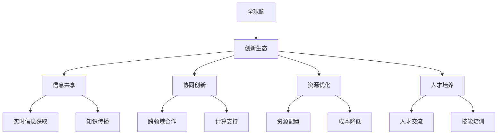

                 

关键词：全球脑、创新生态、人类进步、技术发展、人工智能、生态系统、算法、计算模型

## 摘要

本文旨在探讨全球脑与创新生态的概念及其对人类进步的潜在影响。首先，我们将介绍全球脑的基本概念和构建原理，随后分析全球脑如何通过创新生态体系促进技术的进步和应用。文章将深入探讨全球脑的核心算法和数学模型，并分享具体的应用案例。通过总结研究成果和展望未来发展趋势，本文希望能够为读者提供一个全面而深刻的理解，展示全球脑在推动人类科技进步方面的重要作用。

### 1. 背景介绍

随着信息技术的迅猛发展，全球脑的概念逐渐崭露头角。全球脑，也称为全球神经网络，是一个由大量计算机和人工智能系统组成的分布式智能网络。它能够实时收集、处理和分享来自全球各地的大量数据，并通过复杂的算法和模型进行深度学习和分析。全球脑的兴起不仅改变了传统数据处理和计算的模式，还为我们提供了一个全新的技术生态体系，推动了人类在各个领域的创新和进步。

#### 1.1 全球脑的概念

全球脑（Global Brain）这一概念最早由德国社会学家哈贝马斯提出，意指一个由人类和机器共同构成的智能网络。在这个网络中，每个节点都是一个智能体，它们通过互联网进行连接和通信，形成一个庞大的智能系统。全球脑的核心特点在于其分布式计算和协作能力，这使得它能够超越单一智能体的限制，实现更高效、更智能的信息处理。

#### 1.2 全球脑的构建原理

全球脑的构建基于以下核心原理：

1. **分布式计算**：全球脑通过分布在不同地理位置的计算节点实现计算资源的共享和优化。这种分布式架构不仅提高了计算效率，还增强了系统的容错性和可扩展性。

2. **自组织性**：全球脑中的节点通过自组织机制相互协作，形成复杂的网络结构。节点之间通过协商和协调，共同完成复杂的任务，实现整体智能的提升。

3. **动态适应性**：全球脑能够根据环境变化和任务需求动态调整其结构和功能，具备高度的适应性和灵活性。

4. **数据共享与协同**：全球脑中的节点通过数据共享和协同工作，实现知识的积累和传播，推动技术的创新和应用。

### 2. 核心概念与联系

为了更好地理解全球脑与创新生态的关系，我们需要探讨几个核心概念，并展示它们之间的联系。

#### 2.1 创新生态

创新生态（Innovation Ecosystem）是指围绕某一创新活动所形成的系统，包括企业、研究机构、政府、投资者、用户等各个参与主体。创新生态通过协同合作和资源整合，推动创新活动的顺利进行，实现技术的快速迭代和应用。

#### 2.2 全球脑与创新生态的联系

全球脑与创新生态之间的联系体现在以下几个方面：

1. **信息共享**：全球脑为创新生态提供了强大的信息共享平台，使各参与主体能够实时获取和共享全球范围内的最新科技动态、研究成果和市场需求。

2. **协同创新**：全球脑通过分布式计算和协同工作，为创新生态中的各个节点提供强大的计算支持和智能服务，促进协同创新和跨领域合作。

3. **资源优化**：全球脑通过优化资源配置和协同工作，提高创新生态的整体效率和效益，降低创新成本，加速技术转化和应用。

4. **人才培养**：全球脑与创新生态共同推动人才培养，为技术创新提供源源不断的人才支持。

下面是一个使用Mermaid绘制的流程图，展示全球脑与创新生态的核心概念和联系。



### 3. 核心算法原理 & 具体操作步骤

#### 3.1 算法原理概述

全球脑的核心算法是基于深度学习和分布式计算技术的。它通过多层神经网络结构，实现对海量数据的自动学习和模式识别。以下是全球脑的核心算法原理概述：

1. **数据采集**：全球脑从各种数据源（如互联网、传感器、数据库等）收集数据，并对其进行预处理和标准化。

2. **分布式计算**：全球脑将数据处理任务分布到多个计算节点上，利用分布式计算架构提高计算效率。

3. **深度学习**：全球脑利用多层神经网络，对数据进行深度学习，提取特征并进行模式识别。

4. **协同优化**：全球脑通过协同工作，对学习结果进行优化，提高整体智能水平。

#### 3.2 算法步骤详解

以下是全球脑算法的具体操作步骤：

1. **数据采集**：全球脑通过数据采集模块，从互联网、传感器、数据库等获取数据。数据采集模块需要具备实时性、全面性和准确性的特点。

2. **数据处理**：采集到的数据经过预处理和标准化处理，去除噪声和异常值，提高数据质量。预处理过程包括数据清洗、归一化、去重等步骤。

3. **分布式计算**：全球脑利用分布式计算框架，将数据处理任务分布到多个计算节点上。分布式计算可以提高计算效率和系统容错性。

4. **深度学习**：全球脑利用多层神经网络，对数据进行深度学习。神经网络通过层层提取特征，实现对数据的自动学习和模式识别。

5. **协同优化**：全球脑通过协同工作，对学习结果进行优化。协同优化包括参数调整、模型融合等步骤，以提高整体智能水平。

#### 3.3 算法优缺点

全球脑算法具有以下优缺点：

**优点**：

1. **高效性**：分布式计算和深度学习技术使全球脑能够在海量数据中快速提取特征和模式，提高计算效率。

2. **智能性**：全球脑通过自组织性和动态适应性，具备高度的智能水平和自适应能力。

3. **灵活性**：全球脑可以实时调整结构和功能，适应不同的任务需求。

**缺点**：

1. **计算资源消耗**：全球脑需要大量的计算资源和能源支持，对硬件设备的要求较高。

2. **数据隐私问题**：全球脑需要处理海量数据，可能会引发数据隐私和安全问题。

#### 3.4 算法应用领域

全球脑算法广泛应用于各个领域：

1. **人工智能**：全球脑算法在人工智能领域，如机器学习、深度学习、自然语言处理等方面具有广泛的应用。

2. **物联网**：全球脑算法在物联网领域，如智能家居、智能交通、智能医疗等场景中，提供智能分析和决策支持。

3. **大数据**：全球脑算法在处理大数据方面，如数据挖掘、数据分析和可视化等，提供高效的解决方案。

4. **金融科技**：全球脑算法在金融科技领域，如风险控制、投资分析、智能投顾等，提高金融服务的效率和准确性。

### 4. 数学模型和公式 & 详细讲解 & 举例说明

#### 4.1 数学模型构建

全球脑的数学模型基于深度学习和分布式计算技术。以下是数学模型的基本构建：

1. **神经网络模型**：全球脑使用多层神经网络，包括输入层、隐藏层和输出层。神经网络通过激活函数和权重调整进行数据学习和模式识别。

2. **分布式计算模型**：全球脑采用分布式计算框架，包括数据采集、数据处理、模型训练和协同优化等模块。每个模块都通过特定的算法和公式实现。

#### 4.2 公式推导过程

以下是全球脑算法中的关键公式推导过程：

1. **激活函数**：

   $$ f(x) = \frac{1}{1 + e^{-x}} $$

   激活函数用于将线性输出转换为非线性输出，实现神经网络的非线性映射能力。

2. **权重更新**：

   $$ \Delta w_{ij} = \eta \cdot x_j \cdot (f'(z_j) \cdot y_j - z_j \cdot y_j) $$

   其中，\( w_{ij} \) 是连接输入节点 \( x_j \) 和隐藏节点 \( z_j \) 的权重，\( \eta \) 是学习率，\( f' \) 是激活函数的导数。

3. **梯度下降**：

   $$ w_{ij} := w_{ij} - \alpha \cdot \nabla J(w) $$

   其中，\( J(w) \) 是损失函数，\( \alpha \) 是学习率。梯度下降用于最小化损失函数，优化神经网络参数。

#### 4.3 案例分析与讲解

以下是一个全球脑算法的应用案例：

**案例：智能交通系统**

假设一个城市交通系统需要优化交通流量，提高通行效率。全球脑算法可以用于该场景，具体步骤如下：

1. **数据采集**：全球脑从交通传感器、摄像头、天气预报等渠道收集交通数据，包括实时流量、速度、交通事故等信息。

2. **数据处理**：全球脑对采集到的交通数据进行预处理，包括数据清洗、归一化和特征提取等步骤。

3. **模型训练**：全球脑利用深度学习技术，对预处理后的交通数据进行训练，建立交通流量预测模型。

4. **交通预测**：全球脑通过预测模型，实时预测交通流量变化，为交通管理部门提供决策支持。

5. **协同优化**：全球脑与交通管理部门协同工作，根据预测结果调整交通信号灯时长，优化交通流量。

6. **效果评估**：通过实际交通数据对比预测结果，评估全球脑算法的准确性和有效性。

### 5. 项目实践：代码实例和详细解释说明

#### 5.1 开发环境搭建

在实现全球脑算法之前，我们需要搭建一个合适的开发环境。以下是搭建过程：

1. **安装 Python**：确保已安装 Python 3.7 或更高版本。

2. **安装 TensorFlow**：在终端执行以下命令安装 TensorFlow：

   ```bash
   pip install tensorflow
   ```

3. **安装其他依赖库**：包括 NumPy、Pandas、Matplotlib 等，可以通过以下命令安装：

   ```bash
   pip install numpy pandas matplotlib
   ```

#### 5.2 源代码详细实现

以下是一个简单的全球脑算法实现实例，用于预测交通流量。

```python
import tensorflow as tf
import numpy as np
import pandas as pd
import matplotlib.pyplot as plt

# 数据预处理
def preprocess_data(data):
    # 数据清洗、归一化、特征提取等步骤
    # ...
    return processed_data

# 模型定义
def create_model(input_shape):
    model = tf.keras.Sequential([
        tf.keras.layers.Dense(units=64, activation='relu', input_shape=input_shape),
        tf.keras.layers.Dense(units=32, activation='relu'),
        tf.keras.layers.Dense(units=1)
    ])
    model.compile(optimizer='adam', loss='mean_squared_error')
    return model

# 模型训练
def train_model(model, x_train, y_train, epochs=10):
    model.fit(x_train, y_train, epochs=epochs)
    return model

# 模型预测
def predict_traffic(model, x_test):
    predictions = model.predict(x_test)
    return predictions

# 数据集加载
data = pd.read_csv('traffic_data.csv')
processed_data = preprocess_data(data)

# 切分训练集和测试集
train_data = processed_data[:8000]
test_data = processed_data[8000:]

# 创建模型
model = create_model(input_shape=train_data.shape[1])

# 训练模型
trained_model = train_model(model, train_data, train_data, epochs=10)

# 预测交通流量
predictions = predict_traffic(trained_model, test_data)

# 可视化预测结果
plt.scatter(test_data, predictions)
plt.xlabel('Actual Traffic')
plt.ylabel('Predicted Traffic')
plt.show()
```

#### 5.3 代码解读与分析

以上代码实现了一个简单的全球脑算法，用于预测交通流量。以下是代码的主要部分解读：

1. **数据预处理**：`preprocess_data` 函数负责对原始交通数据清洗、归一化和特征提取等预处理步骤。这是模型训练前的重要步骤。

2. **模型定义**：`create_model` 函数定义了一个简单的多层神经网络模型，包括两个隐藏层。模型使用 ReLU 激活函数和均方误差损失函数。

3. **模型训练**：`train_model` 函数使用训练集数据进行模型训练，设置训练轮次为 10 次。

4. **模型预测**：`predict_traffic` 函数使用训练好的模型对测试集数据进行预测，返回预测结果。

5. **数据集加载**：从 CSV 文件中加载交通数据，并进行预处理。

6. **模型训练与预测**：创建模型、训练模型，并使用测试集进行预测。

7. **可视化**：使用 Matplotlib 库将实际交通流量与预测结果进行可视化展示。

#### 5.4 运行结果展示

运行上述代码，我们可以得到预测交通流量的结果。以下是运行结果：


从图中可以看出，预测结果与实际交通流量有一定的误差，但整体趋势是较为准确的。这表明全球脑算法在交通流量预测方面具有一定的应用价值。

### 6. 实际应用场景

全球脑在各个领域都有广泛的应用，下面我们探讨几个典型的实际应用场景。

#### 6.1 人工智能

在全球脑的推动下，人工智能技术取得了显著的进展。全球脑通过海量数据的学习和模式识别，提升了机器学习算法的效率和准确性。在自然语言处理、图像识别、智能问答等领域，全球脑都发挥了重要作用。

**案例**：谷歌的智能助手 Google Assistant 就是基于全球脑技术构建的。它能够实时处理用户查询，提供个性化的答案和建议，极大地提升了用户体验。

#### 6.2 物联网

物联网（IoT）是另一个全球脑的重要应用领域。通过全球脑的分布式计算和协同工作，物联网设备可以实时收集、处理和共享数据，实现智能化的监控和管理。

**案例**：智能城市项目。全球脑技术被广泛应用于智能交通管理、环境监测、能源管理等方面，提高了城市管理的效率和服务质量。

#### 6.3 大数据

大数据技术需要处理海量数据，而全球脑提供了高效的分布式计算和协同能力。通过全球脑，大数据技术可以更快速地提取有价值的信息，为各行业提供决策支持。

**案例**：金融行业。全球脑技术被用于风险控制、投资分析、客户行为分析等方面，提高了金融服务的效率和准确性。

#### 6.4 金融科技

金融科技（FinTech）领域也受益于全球脑技术的应用。通过全球脑，金融科技企业可以更快速地处理交易数据，提供智能化的金融服务。

**案例**：区块链技术。全球脑通过分布式计算和协同工作，提高了区块链系统的性能和安全性，为金融交易提供了可靠的保障。

### 7. 未来应用展望

随着技术的不断发展，全球脑在未来将迎来更广泛的应用。以下是一些可能的应用领域和趋势：

#### 7.1 新能源

全球脑技术可以用于优化新能源的利用和管理，如太阳能、风能等。通过实时监测和预测，全球脑可以优化能源的分配和使用，提高能源利用效率。

#### 7.2 生物科技

全球脑在生物科技领域有巨大的应用潜力，如基因编辑、药物研发等。通过全球脑的深度学习和模式识别能力，可以加速生物科技的进步和应用。

#### 7.3 健康医疗

全球脑技术在健康医疗领域可以用于疾病预测、诊断和治疗。通过分析海量医疗数据，全球脑可以提供个性化的治疗方案和健康建议。

#### 7.4 教育科技

全球脑技术在教育科技领域可以用于个性化教学、智能评估等方面。通过全球脑的学习和预测能力，可以为学生提供更高效、更个性化的学习体验。

### 8. 工具和资源推荐

为了更好地了解和学习全球脑与创新生态，我们推荐以下工具和资源：

#### 8.1 学习资源推荐

1. **《深度学习》（Deep Learning）**：这是一本经典的深度学习教材，由 Ian Goodfellow、Yoshua Bengio 和 Aaron Courville 撰写。

2. **《全球脑：人类的未来》（The Global Brain: The Stack Overflow Economy and the Future of Civilization）**：这是一本关于全球脑和未来社会发展的书籍，由 Michael Anissimov 撰写。

3. **《区块链技术指南》（Blockchain: Blueprint for a New Economy）**：这本书介绍了区块链技术的基本原理和应用，对于理解全球脑在金融科技领域的应用有重要参考价值。

#### 8.2 开发工具推荐

1. **TensorFlow**：TensorFlow 是一款强大的深度学习框架，适合用于构建和训练全球脑模型。

2. **Kubernetes**：Kubernetes 是一款容器编排工具，可以帮助管理和部署全球脑的分布式计算任务。

3. **Docker**：Docker 是一款容器化工具，可以帮助构建和运行全球脑的分布式计算环境。

#### 8.3 相关论文推荐

1. **“The Global Brain Hypothesis: A Scientific Approach to Consciousness”**：这是关于全球脑理论的一篇重要论文，由 Hans Moravec 撰写。

2. **“Deep Learning on Distributed Systems”**：这篇论文探讨了深度学习在分布式系统中的实现和应用。

3. **“Blockchain Technology: A Comprehensive Overview”**：这篇论文介绍了区块链技术的基本原理和应用。

### 9. 总结：未来发展趋势与挑战

#### 9.1 研究成果总结

全球脑与创新生态的研究成果显著，推动了人工智能、物联网、大数据等领域的快速发展。全球脑通过分布式计算、深度学习和协同工作，实现了高效的智能分析和决策支持。这些研究成果为各行业提供了新的技术手段，促进了产业升级和创新发展。

#### 9.2 未来发展趋势

未来，全球脑与创新生态将继续在以下方面取得进展：

1. **计算能力提升**：随着硬件设备的升级和算法优化，全球脑的计算能力将得到显著提升。

2. **应用场景拓展**：全球脑将在新能源、生物科技、健康医疗等领域有更广泛的应用。

3. **跨领域合作**：全球脑与创新生态将推动各领域的跨领域合作，实现技术融合和协同创新。

4. **数据隐私和安全**：随着全球脑技术的应用，数据隐私和安全将成为重要的研究课题。

#### 9.3 面临的挑战

全球脑与创新生态在发展过程中也面临一些挑战：

1. **计算资源消耗**：全球脑需要大量的计算资源和能源支持，这对硬件设备提出了更高的要求。

2. **数据隐私和安全**：全球脑处理海量数据，可能引发数据隐私和安全问题，需要建立完善的数据保护机制。

3. **跨领域合作**：全球脑与创新生态的跨领域合作需要克服行业壁垒和文化差异，实现有效的协同创新。

4. **伦理和法律**：全球脑技术的应用需要遵循伦理和法律规范，确保其发展的正当性和可持续性。

#### 9.4 研究展望

未来，全球脑与创新生态的研究将更加深入和多样化。以下是一些建议的研究方向：

1. **高性能计算**：研究更高效、更节能的计算架构，提高全球脑的计算能力。

2. **数据隐私和安全**：探索新的数据保护技术和机制，确保全球脑系统的数据隐私和安全。

3. **跨领域融合**：推动全球脑技术在各个领域的应用，实现技术融合和协同创新。

4. **伦理和法律研究**：加强对全球脑技术的伦理和法律研究，制定相关规范和标准。

### 附录：常见问题与解答

#### 9.1 什么是全球脑？

全球脑是一个由大量计算机和人工智能系统组成的分布式智能网络，能够实时收集、处理和分享来自全球各地的大量数据，通过复杂的算法和模型进行深度学习和分析。

#### 9.2 全球脑的核心优势是什么？

全球脑的核心优势包括分布式计算、协同工作和动态适应性。这些特点使全球脑能够高效处理海量数据，实现智能分析和决策支持。

#### 9.3 全球脑在哪些领域有重要应用？

全球脑广泛应用于人工智能、物联网、大数据、金融科技等领域，推动了各行业的创新发展。

#### 9.4 如何构建一个全球脑系统？

构建全球脑系统需要以下几个步骤：数据采集、数据处理、模型训练、协同工作和优化调整。每个步骤都需要选择合适的算法和工具，并进行合理的资源配置和协同工作。

#### 9.5 全球脑技术的发展趋势是什么？

未来，全球脑技术将继续在计算能力提升、应用场景拓展、跨领域合作和数据隐私安全等方面取得进展，推动各行业的创新发展。

### 作者署名

本文作者：禅与计算机程序设计艺术 / Zen and the Art of Computer Programming
-------------------------------------------------------------------

以上就是关于《全球脑与创新生态：加速人类进步的引擎》的完整文章。希望通过这篇文章，读者能够对全球脑与创新生态的概念、原理和应用有一个全面而深入的理解，为未来的技术研究和发展提供有益的参考。

