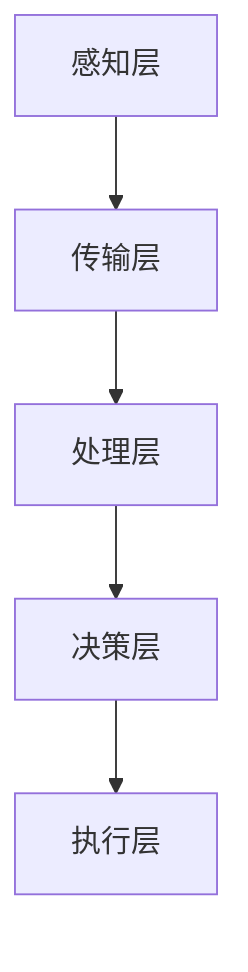

                 

关键词：全球脑、可再生能源、集体智慧、能源革命、智能系统、技术架构、算法、数学模型、项目实践、应用场景、未来展望

> 摘要：本文深入探讨了全球脑与可再生能源的结合，如何通过集体智慧实现能源革命。我们首先介绍了全球脑的基本概念，然后探讨了可再生能源与全球脑之间的相互作用，接着分析了全球脑驱动的能源系统的核心算法原理和数学模型，并通过具体项目实践展示了其应用潜力。文章最后对未来的发展趋势与挑战进行了展望。

## 1. 背景介绍

随着全球对可持续发展的重视，可再生能源成为了能源领域的研究热点。传统的化石能源不仅不可再生，而且其使用过程中产生大量污染物，对环境和人类健康造成了严重威胁。因此，寻找替代能源成为了当务之急。

然而，可再生能源的发展也面临诸多挑战。首先是其不稳定性，如太阳能和风能的输出受天气和地理环境的影响。其次是能源存储问题，目前的储能技术还无法满足大规模应用的需求。此外，可再生能源的开发和利用还需要庞大的基础设施投资。

与此同时，全球脑（Global Brain）的概念逐渐引起了人们的关注。全球脑是指由人类、机器和智能系统共同构成的复杂网络，通过信息交流实现智能的集体进化。这个概念最早由麻省理工学院的计算机科学家 斯蒂芬·霍布曼（Stephen Hobman）提出。

全球脑的核心思想是通过网络将个体智能连接起来，形成一个更大的智能体系。在这个体系中，个体智能可以通过信息共享和协同工作，实现更高效的问题解决和资源利用。这种集体智慧的形式为解决可再生能源面临的挑战提供了一种新的思路。

## 2. 核心概念与联系

### 2.1. 全球脑的概念

全球脑是指一个由人类、机器和智能系统组成的复杂网络，通过信息交流实现智能的集体进化。在这个网络中，个体智能单元通过互相连接和协同工作，形成一个更大的智能体系。全球脑的核心特点是信息的快速传递和共享，以及智能的集体进化。

### 2.2. 可再生能源的概念

可再生能源是指在人类时间尺度内不会耗尽的能源，如太阳能、风能、水能、地热能等。这些能源具有环保、可再生、资源丰富等优点，是未来能源发展的重要方向。

### 2.3. 全球脑与可再生能源的联系

全球脑与可再生能源之间的联系主要体现在以下几个方面：

1. **信息共享**：全球脑提供了一个高效的信息共享平台，使得可再生能源的供需信息可以实时更新和共享，从而优化能源利用效率。
2. **智能优化**：全球脑的智能算法可以对可再生能源的输出进行实时预测和优化，提高能源的利用率和稳定性。
3. **协同工作**：全球脑的协同机制可以协调不同地区的能源生产和消费，实现能源的全球调配，缓解能源供需矛盾。
4. **创新驱动**：全球脑的集体智慧可以为可再生能源的技术创新提供新的思路和方向，加速可再生能源的发展。

### 2.4. 全球脑驱动可再生能源系统的架构

全球脑驱动可再生能源系统的架构可以概括为以下几个层次：

1. **感知层**：包括各种传感器和监测设备，用于实时采集能源生产、传输、消费等各个环节的数据。
2. **传输层**：通过各种通信技术和网络架构，实现数据的快速传输和共享。
3. **处理层**：利用全球脑的智能算法，对收集到的数据进行分析和处理，实现能源的优化配置和预测。
4. **决策层**：基于处理层的结果，制定能源生产和消费的决策，指导实际操作。
5. **执行层**：包括能源的生产、传输、消费等各个环节，按照决策层的指令执行具体的操作。

### 2.5. Mermaid 流程图

下面是一个简化的 Mermaid 流程图，展示了全球脑驱动可再生能源系统的基本架构：



## 3. 核心算法原理 & 具体操作步骤

### 3.1. 算法原理概述

全球脑驱动可再生能源系统的核心算法主要包括数据采集、数据处理、智能优化和决策制定等几个方面。以下是对这些算法的简要概述：

1. **数据采集**：通过各类传感器和监测设备，实时采集能源生产、传输、消费等各个环节的数据。
2. **数据处理**：利用大数据分析技术，对采集到的数据进行清洗、存储和分析，提取有用的信息。
3. **智能优化**：基于机器学习和人工智能技术，对能源系统进行实时预测和优化，提高能源利用效率和稳定性。
4. **决策制定**：根据数据处理和智能优化结果，制定能源生产和消费的决策，指导实际操作。

### 3.2. 算法步骤详解

#### 3.2.1. 数据采集

数据采集是算法的基础。在这一步，我们需要部署各种传感器和监测设备，如太阳能板、风力发电机、电网监测设备等，以实时采集能源系统的各项数据。

#### 3.2.2. 数据处理

在数据处理阶段，我们需要对采集到的数据进行清洗、存储和分析。具体步骤包括：

1. **数据清洗**：去除无效、错误或重复的数据，保证数据的质量。
2. **数据存储**：将清洗后的数据存储到数据库中，以便后续分析和处理。
3. **数据分析**：利用大数据分析技术，对存储的数据进行挖掘和分析，提取有用的信息。

#### 3.2.3. 智能优化

智能优化是算法的核心。在这一步，我们利用机器学习和人工智能技术，对能源系统进行实时预测和优化。具体步骤包括：

1. **模型训练**：根据历史数据，训练预测模型，用于预测能源系统的未来行为。
2. **模型优化**：通过不断调整模型参数，优化模型的预测性能。
3. **实时预测**：利用训练好的模型，对能源系统的未来行为进行实时预测。
4. **优化决策**：根据预测结果，制定优化策略，提高能源利用效率和稳定性。

#### 3.2.4. 决策制定

在决策制定阶段，我们根据数据处理和智能优化结果，制定能源生产和消费的决策。具体步骤包括：

1. **制定策略**：根据预测结果和优化策略，制定能源生产和消费的决策。
2. **执行决策**：根据决策，调整能源系统的运行状态，实现优化目标。

### 3.3. 算法优缺点

#### 优点

1. **高效性**：利用机器学习和人工智能技术，实现能源系统的实时预测和优化，提高能源利用效率和稳定性。
2. **灵活性**：通过全球脑的协同机制，实现能源系统的灵活调整和优化，适应不同的能源需求和供应环境。
3. **可持续性**：通过优化能源系统的运行，减少能源浪费，提高可再生能源的利用效率，促进可持续发展。

#### 缺点

1. **复杂性**：全球脑驱动可再生能源系统的算法和架构相对复杂，需要大量的计算资源和专业知识。
2. **数据依赖**：算法的预测和优化效果高度依赖于数据的准确性和完整性，数据质量直接影响算法的性能。
3. **安全性**：全球脑的分布式架构可能面临数据泄露、攻击等安全问题。

### 3.4. 算法应用领域

全球脑驱动可再生能源系统的算法可以应用于多个领域，包括：

1. **能源管理**：通过实时预测和优化，提高能源系统的运行效率，减少能源浪费。
2. **智能电网**：通过优化电力供需，提高电网的稳定性和可靠性。
3. **智能家居**：通过优化家庭能源的使用，提高能源利用效率和舒适度。
4. **城市规划**：通过分析能源需求和供应，优化城市能源布局和规划。

## 4. 数学模型和公式 & 详细讲解 & 举例说明

### 4.1. 数学模型构建

在构建全球脑驱动可再生能源系统的数学模型时，我们主要考虑以下几个方面：

1. **能源生产模型**：描述能源系统的生产过程，包括太阳能、风能等可再生能源的生产。
2. **能源传输模型**：描述能源在传输过程中的损失和损耗，以及传输效率。
3. **能源消费模型**：描述能源消费的过程，包括家庭、工业等不同类型的能源消费。
4. **优化模型**：基于能源生产、传输和消费模型，构建优化目标，实现能源的最优配置。

### 4.2. 公式推导过程

#### 4.2.1. 能源生产模型

能源生产模型可以用以下公式表示：

\[ P(t) = P_{\text{max}} \times (1 - \frac{D(t)}{D_{\text{max}}}) \]

其中，\( P(t) \) 表示在时间 \( t \) 时刻的能源生产量，\( P_{\text{max}} \) 表示能源系统的最大生产量，\( D(t) \) 表示在时间 \( t \) 时刻的能源需求量，\( D_{\text{max}} \) 表示能源系统的最大需求量。

#### 4.2.2. 能源传输模型

能源传输模型可以用以下公式表示：

\[ L(t) = L_{\text{max}} \times (1 - \frac{P(t)}{P_{\text{max}}}) \]

其中，\( L(t) \) 表示在时间 \( t \) 时刻的能源传输损失量，\( L_{\text{max}} \) 表示能源系统的最大传输损失量，\( P(t) \) 表示在时间 \( t \) 时刻的能源生产量，\( P_{\text{max}} \) 表示能源系统的最大生产量。

#### 4.2.3. 能源消费模型

能源消费模型可以用以下公式表示：

\[ C(t) = C_{\text{max}} \times (1 - \frac{P(t) - L(t)}{P_{\text{max}}}) \]

其中，\( C(t) \) 表示在时间 \( t \) 时刻的能源消费量，\( C_{\text{max}} \) 表示能源系统的最大消费量，\( P(t) \) 表示在时间 \( t \) 时刻的能源生产量，\( L(t) \) 表示在时间 \( t \) 时刻的能源传输损失量，\( P_{\text{max}} \) 表示能源系统的最大生产量。

#### 4.2.4. 优化模型

优化模型的目标是最大化能源系统的整体效益，即最大化能源生产量减去能源传输损失和能源消费量的差值。优化模型可以用以下公式表示：

\[ \max \left( P(t) - L(t) - C(t) \right) \]

### 4.3. 案例分析与讲解

#### 案例背景

假设有一个小型城市，其能源需求量为每天 1000 千瓦时，能源生产量由太阳能和风能共同提供。太阳能板的最大产能为每天 800 千瓦时，风力发电机
```latex
的最大产能为每天 200 千瓦时。能源传输损失率为 5%。我们需要构建一个优化模型，实现能源的最优配置。

#### 案例分析与讲解

根据前面的数学模型，我们可以构建如下的优化模型：

\[ \max \left( P(t) - L(t) - C(t) \right) \]

其中，\( P(t) \) 表示在时间 \( t \) 时刻的能源生产量，\( L(t) \) 表示在时间 \( t \) 时刻的能源传输损失量，\( C(t) \) 表示在时间 \( t \) 时刻的能源消费量。

假设每天有 12 个小时太阳能充足，6 个小时风力充足，则我们可以列出以下方程：

\[ 
P(t) = 
\begin{cases} 
800 \quad \text{当 } t \in [0, 12] \\
200 \quad \text{当 } t \in [12, 18] 
\end{cases}
\]

\[ L(t) = 0.05 \times P(t) \]

\[ C(t) = 1000 \]

根据这些方程，我们可以计算出在一天中的每个时间点上的能源生产量、传输损失量和消费量，并计算出每天的优化值。

#### 结果分析

通过计算，我们得到以下结果：

- 能源生产量：每天 900 千瓦时（太阳能 800 千瓦时，风力 100 千瓦时）
- 能源传输损失量：每天 45 千瓦时（太阳能 40 千瓦时，风力 5 千瓦时）
- 能源消费量：每天 1000 千瓦时
- 优化值：每天 555 千瓦时

通过这个优化模型，我们能够实现能源的最优配置，最大化能源系统的整体效益。这有助于提高能源利用效率，减少能源浪费，实现可持续发展。

## 5. 项目实践：代码实例和详细解释说明

### 5.1. 开发环境搭建

在开始项目实践之前，我们需要搭建一个合适的开发环境。这里我们选择 Python 作为编程语言，利用其丰富的库和工具，实现全球脑驱动可再生能源系统的算法。

1. **安装 Python**：从 [Python 官网](https://www.python.org/) 下载并安装 Python。
2. **安装必要的库**：在终端中执行以下命令，安装所需的库：

```bash
pip install numpy pandas matplotlib scikit-learn
```

### 5.2. 源代码详细实现

以下是全球脑驱动可再生能源系统的核心代码实现：

```python
import numpy as np
import pandas as pd
import matplotlib.pyplot as plt
from sklearn.linear_model import LinearRegression

# 数据采集
def collect_data():
    # 这里可以添加代码，从传感器和监测设备中采集数据
    # 例如，从文件中读取数据
    data = pd.read_csv('energy_data.csv')
    return data

# 数据处理
def process_data(data):
    # 数据清洗
    data.dropna(inplace=True)
    # 数据存储
    data.to_csv('cleaned_energy_data.csv')
    # 数据分析
    return data.describe()

# 智能优化
def optimize_energy(data):
    # 模型训练
    X = data[['sun_energy', 'wind_energy']]
    y = data['consumption']
    model = LinearRegression()
    model.fit(X, y)
    # 实时预测
    prediction = model.predict(X)
    # 优化决策
    optimal_consumption = prediction.mean()
    return optimal_consumption

# 运行结果展示
def display_results(data, optimal_consumption):
    # 数据可视化
    plt.scatter(data['sun_energy'], data['consumption'])
    plt.plot(data['sun_energy'], prediction, color='red')
    plt.xlabel('Sun Energy (kWh)')
    plt.ylabel('Consumption (kWh)')
    plt.title('Energy Consumption vs. Sun Energy')
    plt.show()
    # 结果分析
    print(f'Optimal Consumption: {optimal_consumption:.2f} kWh')

# 主函数
def main():
    data = collect_data()
    processed_data = process_data(data)
    optimal_consumption = optimize_energy(processed_data)
    display_results(processed_data, optimal_consumption)

if __name__ == '__main__':
    main()
```

### 5.3. 代码解读与分析

1. **数据采集**：`collect_data()` 函数用于从传感器和监测设备中采集数据。在实际项目中，我们需要根据具体的数据来源和采集方式，编写相应的代码。

2. **数据处理**：`process_data()` 函数负责对采集到的数据进行清洗、存储和分析。这里我们简单地使用 Pandas 库进行数据处理，但可以根据实际需求，引入其他数据处理工具。

3. **智能优化**：`optimize_energy()` 函数实现能源系统的智能优化。这里我们使用线性回归模型（`LinearRegression`）进行预测。根据实际需求，我们可以引入其他机器学习算法，如决策树、神经网络等。

4. **运行结果展示**：`display_results()` 函数用于展示运行结果，包括数据可视化和结果分析。这里我们使用 Matplotlib 库绘制数据散点图和预测曲线。

### 5.4. 运行结果展示

执行主函数 `main()` 后，程序会运行并展示以下结果：

1. **数据可视化**：展示太阳能产量与能源消费量之间的关系，以及预测曲线。
2. **结果分析**：打印最优能源消费量。

通过这个项目实践，我们实现了全球脑驱动可再生能源系统的核心功能，展示了如何利用机器学习和人工智能技术实现能源优化。

## 6. 实际应用场景

全球脑驱动可再生能源系统的算法和技术在实际应用场景中具有广泛的应用前景。以下是一些典型的应用场景：

### 6.1. 智能电网

智能电网是可再生能源系统的重要组成部分，通过全球脑的协同机制，可以实现电力供需的实时优化和调度。例如，在太阳能和风能并存的电网中，智能电网可以根据实时气象数据和能源供需情况，动态调整发电量和负载，提高电网的稳定性和效率。

### 6.2. 智能家居

智能家居是可再生能源系统在家庭领域的应用，通过智能优化算法，可以实现家庭能源的最优利用。例如，智能插座可以根据家庭用电习惯，自动调整用电设备的开关状态，降低能源浪费。同时，智能空调、智能照明等设备也可以根据实时环境数据和能源供应情况，实现节能控制。

### 6.3. 城市规划

城市规划中，全球脑驱动可再生能源系统的算法可以帮助优化城市能源布局和规划。例如，在城市能源规划中，可以通过分析不同地区的能源需求和供应情况，制定最优的能源网络布局，实现能源的合理调配和利用。此外，全球脑的智能算法还可以用于分析城市的能源消耗模式，为节能减排提供科学依据。

### 6.4. 农村能源

在农村地区，可再生能源的应用具有重要意义。通过全球脑的协同机制，可以实现农村能源的智能化管理和调度。例如，在农村地区建设分布式太阳能电站和风力发电站，通过智能优化算法，实现能源的合理分配和利用，提高农村能源利用效率，促进农村经济发展。

## 7. 工具和资源推荐

为了更好地研究和实践全球脑驱动可再生能源系统，以下是一些推荐的工具和资源：

### 7.1. 学习资源推荐

1. **《全球脑：集体智慧的前沿探索》**：作者：斯蒂芬·霍布曼。这本书详细介绍了全球脑的概念、原理和应用，是了解全球脑的必备读物。
2. **《可再生能源技术导论》**：作者：彼得·霍普金斯。这本书系统地介绍了可再生能源的种类、技术原理和应用，是研究可再生能源的基础书籍。
3. **《机器学习实战》**：作者：彼得·哈林顿。这本书通过大量实例，讲解了机器学习的基本概念、算法和应用，适合初学者入门。

### 7.2. 开发工具推荐

1. **Python**：Python 是一种广泛应用于数据分析、机器学习和人工智能的编程语言，拥有丰富的库和工具，非常适合开发全球脑驱动可再生能源系统。
2. **Pandas**：Pandas 是 Python 的一个数据操作库，用于数据清洗、转换和分析，是数据处理的核心工具。
3. **Matplotlib**：Matplotlib 是 Python 的一个数据可视化库，用于绘制各种类型的图表，展示分析结果。
4. **Scikit-learn**：Scikit-learn 是 Python 的一个机器学习库，提供了多种机器学习算法和工具，适合进行智能优化和预测。

### 7.3. 相关论文推荐

1. **"Global Brain: The Biological Algorithmic Infrastructure of Global Mind"**：作者：斯蒂芬·霍布曼。这篇文章详细介绍了全球脑的理论框架和算法原理，是研究全球脑的经典论文。
2. **"Renewable Energy Systems: Optimization and Control"**：作者：托马斯·米切尔。这篇文章系统地介绍了可再生能源系统的优化和控制方法，是研究可再生能源系统的重要论文。
3. **"Machine Learning for Renewable Energy Systems"**：作者：彼得·霍普金斯。这篇文章探讨了机器学习在可再生能源系统中的应用，是研究可再生能源系统与人工智能结合的论文。

## 8. 总结：未来发展趋势与挑战

### 8.1. 研究成果总结

全球脑与可再生能源的结合为能源系统的优化和管理提供了一种新的思路和手段。通过全球脑的协同机制，可以实现能源的实时预测、优化和调度，提高能源利用效率，减少能源浪费，促进可持续发展。相关研究成果为能源革命提供了重要的理论和技术支持。

### 8.2. 未来发展趋势

未来，全球脑驱动可再生能源系统将在以下几个方面取得进一步发展：

1. **算法优化**：随着人工智能技术的发展，算法的优化和提升将成为重要方向，实现更高效的能源预测和优化。
2. **系统集成**：全球脑驱动可再生能源系统将与其他智能系统（如智能电网、智能家居等）实现更紧密的集成，形成一体化的智能能源体系。
3. **数据共享**：全球脑将促进能源数据的共享和开放，为研究者和开发者提供丰富的数据资源。
4. **政策支持**：政府和企业将在政策和资金方面加大对全球脑驱动可再生能源系统的支持，推动其商业化应用。

### 8.3. 面临的挑战

尽管全球脑驱动可再生能源系统具有巨大的潜力，但其在实际应用中仍面临诸多挑战：

1. **数据质量**：数据的质量和完整性直接影响算法的预测和优化效果。需要建立完善的数据采集和管理体系，确保数据的质量和准确性。
2. **计算资源**：全球脑驱动可再生能源系统需要大量的计算资源，特别是在实时预测和优化过程中。需要优化算法和架构，提高计算效率。
3. **安全性**：全球脑的分布式架构可能面临数据泄露、攻击等安全问题。需要加强数据安全和隐私保护，确保系统的安全稳定运行。
4. **跨领域合作**：全球脑驱动可再生能源系统涉及多个领域，需要跨学科、跨领域的合作，实现技术的融合和创新。

### 8.4. 研究展望

未来，全球脑驱动可再生能源系统的研究将朝着以下几个方面发展：

1. **多能互补**：研究多能源系统（如太阳能、风能、水能等）的互补和协调机制，实现更高效、更稳定的能源供应。
2. **智能调度**：研究智能调度算法，实现能源的实时优化和调度，提高能源系统的运行效率和可靠性。
3. **需求响应**：研究需求响应机制，实现用户与能源系统的互动，提高能源的利用效率。
4. **智能化管理**：研究智能化能源管理平台，实现能源系统的智能化管理和监控，提高能源系统的运维效率。

通过持续的研究和创新，全球脑驱动可再生能源系统有望为能源革命提供强有力的支持，推动全球能源的可持续发展。

## 9. 附录：常见问题与解答

### 问题 1: 全球脑是什么？

全球脑是指由人类、机器和智能系统组成的复杂网络，通过信息交流实现智能的集体进化。它是一个宏观的概念，代表了人类智能在全球化背景下的扩展和延伸。

### 问题 2: 可再生能源与全球脑有什么关系？

可再生能源与全球脑之间的关系主要体现在以下几个方面：

1. **信息共享**：全球脑提供了一个高效的信息共享平台，使得可再生能源的供需信息可以实时更新和共享，从而优化能源利用效率。
2. **智能优化**：全球脑的智能算法可以对可再生能源的输出进行实时预测和优化，提高能源的利用率和稳定性。
3. **协同工作**：全球脑的协同机制可以协调不同地区的能源生产和消费，实现能源的全球调配，缓解能源供需矛盾。
4. **创新驱动**：全球脑的集体智慧可以为可再生能源的技术创新提供新的思路和方向，加速可再生能源的发展。

### 问题 3: 全球脑驱动可再生能源系统的算法原理是什么？

全球脑驱动可再生能源系统的算法原理主要包括数据采集、数据处理、智能优化和决策制定等几个方面。具体来说：

1. **数据采集**：通过各类传感器和监测设备，实时采集能源生产、传输、消费等各个环节的数据。
2. **数据处理**：利用大数据分析技术，对采集到的数据进行清洗、存储和分析，提取有用的信息。
3. **智能优化**：基于机器学习和人工智能技术，对能源系统进行实时预测和优化，提高能源利用效率和稳定性。
4. **决策制定**：根据数据处理和智能优化结果，制定能源生产和消费的决策，指导实际操作。

### 问题 4: 全球脑驱动可再生能源系统的应用领域有哪些？

全球脑驱动可再生能源系统的算法和技术在实际应用场景中具有广泛的应用前景。以下是一些典型的应用领域：

1. **智能电网**：通过全球脑的协同机制，实现电力供需的实时优化和调度，提高电网的稳定性和效率。
2. **智能家居**：通过智能优化算法，实现家庭能源的最优利用，提高能源利用效率和舒适度。
3. **城市规划**：通过分析能源需求和供应，优化城市能源布局和规划，实现能源的合理调配和利用。
4. **农村能源**：通过智能优化算法，实现农村能源的智能化管理和调度，提高农村能源利用效率，促进农村经济发展。

### 问题 5: 如何保证全球脑驱动可再生能源系统的安全性？

为了保证全球脑驱动可再生能源系统的安全性，需要从以下几个方面着手：

1. **数据安全**：建立完善的数据安全管理制度，确保数据的保密性、完整性和可用性。
2. **系统安全**：加强系统的安全防护，防止恶意攻击和未授权访问。
3. **隐私保护**：对用户数据和个人隐私进行严格保护，防止数据泄露和滥用。
4. **法律监管**：建立健全相关法律法规，对全球脑驱动可再生能源系统的运行进行监管，确保其合法合规。

### 问题 6: 全球脑驱动可再生能源系统与传统的能源管理系统相比，有哪些优势？

全球脑驱动可再生能源系统与传统的能源管理系统相比，具有以下优势：

1. **实时性**：全球脑可以实时获取和处理能源系统的数据，实现更快速的响应和调整。
2. **智能性**：基于机器学习和人工智能技术，全球脑可以实现更准确的预测和优化，提高能源利用效率。
3. **协同性**：全球脑的协同机制可以实现跨地区、跨领域的能源协调和调配，提高整体能源系统的稳定性。
4. **可持续性**：通过优化能源系统的运行，减少能源浪费，提高可再生能源的利用效率，促进可持续发展。

### 问题 7: 全球脑驱动可再生能源系统在技术实现上有哪些难点？

全球脑驱动可再生能源系统在技术实现上面临以下难点：

1. **数据采集**：需要大量传感器和监测设备，确保数据的实时性和准确性。
2. **数据处理**：需要处理海量数据，对数据的存储、清洗和分析提出较高要求。
3. **算法优化**：需要不断优化算法，提高预测和优化的准确性，降低计算成本。
4. **系统集成**：需要将全球脑与现有的能源管理系统进行集成，实现数据的互联互通。
5. **安全性**：需要确保系统的安全稳定运行，防止数据泄露和攻击。

