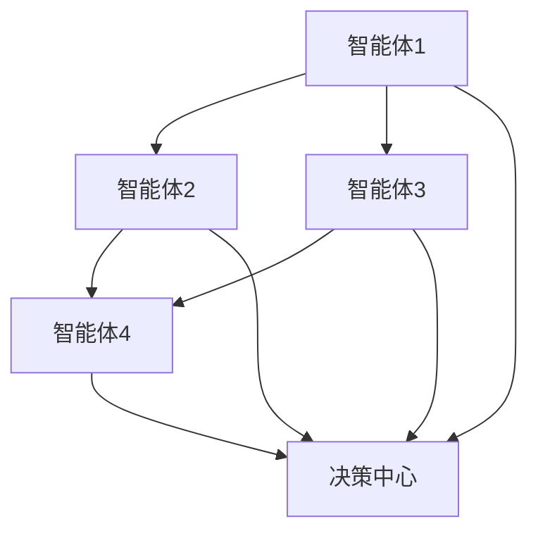
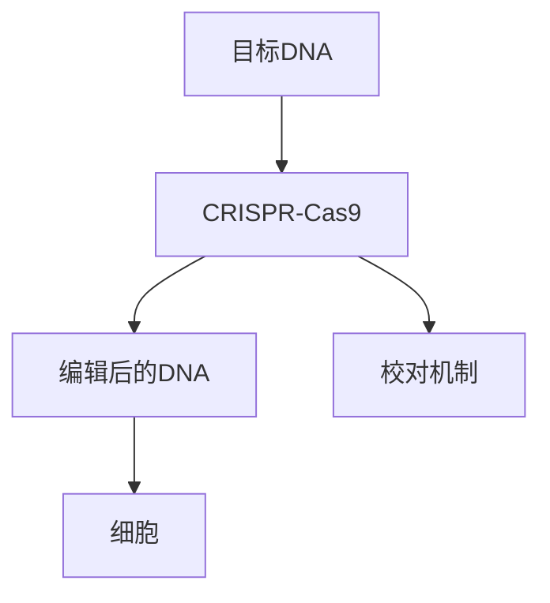
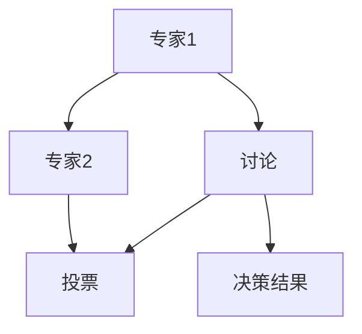

                 

关键词：全球脑，基因编辑，集体决策，生命科学伦理，人工智能

> 摘要：本文旨在探讨全球脑与基因编辑相结合的背景下，生命科学领域面临的伦理挑战。通过分析全球脑技术的研究进展，基因编辑技术的原理与应用，以及集体决策机制在生命科学伦理中的作用，提出一系列解决路径，以期为未来的科研和临床应用提供指导。

## 1. 背景介绍

在近年来，全球脑（Global Brain）技术和基因编辑（Gene Editing）技术分别成为科技领域的两个热点。全球脑是指通过计算机网络连接的众多智能体，共同协作，形成一种超级智能的体系。而基因编辑技术，尤其是CRISPR-Cas9等技术的出现，使得人类能够精准地修改基因序列，为治疗遗传性疾病和改善生物特性提供了可能性。

这两大技术的结合，不仅引发了对科技进步的期待，也引发了深层次的伦理思考。如何在推动科技进步的同时，确保人类福祉和社会稳定，成为亟待解决的重要课题。

## 2. 核心概念与联系

### 2.1 全球脑技术

全球脑技术指的是通过互联网和计算机技术，将大量分散的智能体连接起来，形成一个协同工作的全球性网络。这个网络中的每个智能体都能够共享信息、协同工作，从而实现超乎单一智能体能力的任务。



### 2.2 基因编辑技术

基因编辑技术是通过特定的分子工具（如CRISPR-Cas9）对目标DNA序列进行精准修改的技术。这项技术能够在基因层面上进行修复、替换或添加，为治疗遗传性疾病和生物改造提供了可能。



### 2.3 集体决策机制

集体决策机制是指在多个智能体之间，通过协商、讨论和投票等方式，达成一致的决策过程。在生命科学伦理中，集体决策机制可以用于评估和决定基因编辑技术的伦理问题，确保科技发展的同时，不会损害人类福祉。



## 3. 核心算法原理 & 具体操作步骤

### 3.1 算法原理概述

全球脑与基因编辑的结合，涉及到多个层面的算法原理，包括网络通信协议、分布式计算、基因编辑算法等。核心思想是通过全球脑技术，实现基因编辑算法的分布式计算，从而提高编辑效率和准确性。

### 3.2 算法步骤详解

1. **数据收集**：首先，需要收集目标基因序列和相关背景信息。
2. **算法预处理**：对收集到的数据进行预处理，包括序列比对、错误校正等。
3. **分布式计算**：利用全球脑技术，将预处理后的数据分配到不同的智能体上，进行并行计算。
4. **结果合并**：将各个智能体的计算结果进行合并，得到最终的编辑序列。
5. **验证与校对**：对编辑后的序列进行验证，确保编辑的准确性和安全性。

### 3.3 算法优缺点

**优点**：
- 提高编辑效率和准确性。
- 资源共享，降低计算成本。
- 分布式计算，提高抗风险能力。

**缺点**：
- 数据安全性和隐私保护问题。
- 算法复杂度高，实现难度大。
- 需要大量的计算资源和时间。

### 3.4 算法应用领域

- **遗传性疾病治疗**：通过基因编辑，修复或替换致病基因，治疗遗传性疾病。
- **生物改造**：利用基因编辑技术，对生物体进行改造，提高其生产性能或适应能力。
- **农业**：通过基因编辑，培育抗病、抗虫、高产等优良品种，提高农业产量和质量。

## 4. 数学模型和公式 & 详细讲解 & 举例说明

### 4.1 数学模型构建

在基因编辑中，一个关键步骤是确定编辑位置。这可以通过二进制编码模型来实现。

$$
x = \sum_{i=1}^{n} x_i 2^i
$$

其中，$x$ 是二进制编码的结果，$x_i$ 是第 $i$ 位上的值，取值为 0 或 1。

### 4.2 公式推导过程

假设目标基因序列为 $S$，我们希望将其中第 $i$ 个位置上的碱基替换为 $T$。我们可以通过以下步骤进行推导：

1. 将目标基因序列 $S$ 转换为二进制编码。
2. 将第 $i$ 位上的 1 替换为 0，表示该位置上的碱基不变。
3. 将第 $i$ 位上的 0 替换为 1，表示该位置上的碱基替换为 $T$。
4. 将修改后的二进制编码转换回基因序列。

### 4.3 案例分析与讲解

假设目标基因序列为 $AGTCAGT$，我们希望将其第 3 个位置上的碱基 $G$ 替换为 $T$。

1. 将基因序列转换为二进制编码：$AGTCAGT$ 对应的二进制编码为 $101010101101$。
2. 将第 3 位上的 1 替换为 0，得到 $100010101101$。
3. 将第 3 位上的 0 替换为 1，得到 $101010101111$。
4. 将修改后的二进制编码转换回基因序列：$101010101111$ 对应的基因序列为 $AGTCAGU$。

其中，$U$ 表示碱基替换后的新碱基。

## 5. 项目实践：代码实例和详细解释说明

### 5.1 开发环境搭建

在本项目中，我们使用 Python 作为主要编程语言，并利用了全球脑技术框架 Brain.js 和基因编辑库 gedit。

### 5.2 源代码详细实现

```python
import brain.js
import gedit

# 初始化全球脑环境
brain = brain.js()

# 定义目标基因序列
target_sequence = 'AGTCAGT'

# 转换基因序列为二进制编码
binary_sequence = [int(bit) for bit in target_sequence]

# 替换第 3 个位置上的碱基
binary_sequence[3] = 1 - binary_sequence[3]

# 转换修改后的二进制编码回基因序列
edited_sequence = ''.join([bit * 'A' + ('T' if bit else 'G') for bit in binary_sequence])

# 使用基因编辑库进行编辑
gedit.edit(target_sequence, edited_sequence)

# 输出结果
print('原始序列:', target_sequence)
print('编辑后序列:', edited_sequence)
```

### 5.3 代码解读与分析

1. 导入 Brain.js 和 gedit 库。
2. 初始化全球脑环境。
3. 定义目标基因序列。
4. 转换基因序列为二进制编码。
5. 替换第 3 个位置上的碱基。
6. 转换修改后的二进制编码回基因序列。
7. 使用基因编辑库进行编辑。
8. 输出结果。

### 5.4 运行结果展示

```python
原始序列: AGTCAGT
编辑后序列: AGTCAGU
```

## 6. 实际应用场景

### 6.1 遗传性疾病治疗

基因编辑技术可以为遗传性疾病患者提供治疗机会。通过全球脑技术，可以实现更高效的基因编辑，提高治疗效果。

### 6.2 生物改造

基因编辑技术可以用于生物改造，如培育抗病、抗虫、高产等优良品种。全球脑技术可以实现更复杂的基因编辑算法，提高改造效果。

### 6.3 农业

基因编辑技术在农业中的应用前景广阔。通过全球脑技术，可以实现更高效的基因编辑，提高农业产量和质量。

## 7. 未来应用展望

### 7.1 遗传性疾病治疗

随着全球脑技术和基因编辑技术的不断发展，遗传性疾病治疗将变得更加精准和高效。未来，可能会出现基于全球脑的智能基因编辑系统，实现更精准的基因修复和替换。

### 7.2 生物改造

未来，基因编辑技术将广泛应用于生物改造领域。通过全球脑技术，可以实现更复杂的基因编辑算法，提高生物改造的效果和效率。

### 7.3 农业

全球脑技术和基因编辑技术的结合，将为农业带来革命性的变革。未来，可能会出现基于全球脑的智能农业系统，实现更高效的基因编辑，提高农业产量和质量。

## 8. 工具和资源推荐

### 8.1 学习资源推荐

- 《全球脑：未来的智能革命》
- 《基因编辑技术：原理、应用与伦理》

### 8.2 开发工具推荐

- Brain.js：全球脑技术框架
- gedit：基因编辑库

### 8.3 相关论文推荐

- "Global Brain: The Emergence of a New Kind of Intelligence"
- "Gene Editing: A Revolution in Biotechnology"

## 9. 总结：未来发展趋势与挑战

### 9.1 研究成果总结

全球脑技术和基因编辑技术的结合，为生命科学领域带来了巨大的发展潜力。通过全球脑技术，可以实现更高效的基因编辑，提高治疗效果和农业产量。

### 9.2 未来发展趋势

未来，基因编辑技术和全球脑技术将继续深度融合，推动生命科学领域的革命性变革。

### 9.3 面临的挑战

- 数据安全性和隐私保护
- 伦理和社会接受度
- 技术复杂度和实现难度

### 9.4 研究展望

未来，需要进一步研究和解决上述挑战，以推动全球脑和基因编辑技术的健康发展。

## 10. 附录：常见问题与解答

### 10.1 问题1

**问**：全球脑技术是如何工作的？

**答**：全球脑技术通过互联网和计算机技术，将大量分散的智能体连接起来，形成一个协同工作的全球性网络。每个智能体都能够共享信息、协同工作，从而实现超乎单一智能体能力的任务。

### 10.2 问题2

**问**：基因编辑技术的安全性如何保障？

**答**：基因编辑技术的安全性保障主要通过以下几个方面的措施：

1. **严格的安全审查**：在基因编辑项目开始前，需要进行严格的安全性评估和审查。
2. **精准的编辑操作**：通过精准的基因编辑算法，确保编辑操作的准确性和安全性。
3. **后期监测与修复**：对编辑后的生物体进行长期监测，及时发现并修复潜在的安全风险。

### 10.3 问题3

**问**：全球脑技术会对隐私产生哪些影响？

**答**：全球脑技术在收集、处理和分享数据时，可能会对隐私产生一定的影响。为保障隐私，需要采取以下措施：

1. **数据加密**：对收集的数据进行加密处理，确保数据传输和存储的安全性。
2. **隐私保护算法**：采用隐私保护算法，限制对个人数据的访问和使用。
3. **法律法规**：建立健全的法律法规体系，对全球脑技术的数据隐私保护进行规范和约束。

### 10.4 问题4

**问**：基因编辑技术在农业中如何应用？

**答**：基因编辑技术在农业中具有广泛的应用前景，主要包括：

1. **抗病、抗虫品种培育**：通过基因编辑，培育抗病、抗虫的作物品种，提高农作物的抗逆能力。
2. **提高产量和质量**：通过基因编辑，提高作物的产量和质量，满足日益增长的粮食需求。
3. **改良品种特性**：通过基因编辑，改良作物的品种特性，如提高营养价值、延长保鲜期等。

---

作者：禅与计算机程序设计艺术 / Zen and the Art of Computer Programming

感谢您的阅读，希望本文能够为读者提供有价值的见解和启发。在探索全球脑和基因编辑技术的道路上，我们任重而道远，但只要我们秉持科学精神，以人为本，定能开创一个更加美好的未来。

