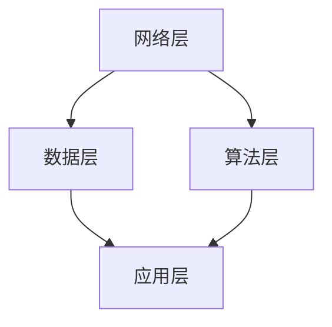

                 

关键词：全球脑、星际通信、集体智慧、人工智能、技术博客

> 摘要：本文探讨了全球脑与外太空通信的关系，以及如何利用集体智慧推动星际交流的发展。通过对全球脑技术的介绍，分析其在星际通信中的应用潜力，并探讨未来发展的挑战与机遇。

## 1. 背景介绍

随着人类对宇宙的探索不断深入，星际通信成为了一个备受关注的话题。在遥远的未来，我们可能会面临跨星际文明交流的需求。为了实现这一目标，我们需要开发出高效的通信技术和方法。

全球脑（Global Brain）概念最早由进化生物学家Erich Harth提出，是一种由人类网络和智能系统组成的全球性思考实体。全球脑的理念是将人类的智慧和知识整合到一个共同的系统中，通过协作和共享实现集体智慧。

### 1.1 全球脑的概念

全球脑是一个由大量的个体智能系统（如人类、计算机系统等）通过网络连接而成的复杂网络。这些个体智能系统能够通过互联网和通信技术进行信息交换，形成一个高度集成的思考实体。全球脑的核心思想是协作和共享，通过整合全球范围内的知识和智慧，提高整体智能水平。

### 1.2 星际通信的现状与挑战

当前，星际通信主要依赖于传统的无线电波和光信号传输。然而，这些通信手段在传输距离、信号稳定性和数据传输速率等方面存在较大的局限性。为了实现高效的星际通信，我们需要开发出新的通信技术和方法。

## 2. 核心概念与联系

### 2.1 全球脑与星际通信的联系

全球脑与星际通信之间存在着密切的联系。全球脑技术可以为星际通信提供高效的通信算法、智能化的信号处理方法和强大的计算能力。通过将全球脑技术与星际通信相结合，我们可以实现以下目标：

1. 提高星际通信的效率和稳定性。
2. 实现大规模的数据传输和共享。
3. 提高对宇宙信号的检测和识别能力。

### 2.2 全球脑技术的核心原理

全球脑技术的核心原理是协作和共享。通过将大量的个体智能系统连接起来，形成一个统一的思考实体，可以实现以下功能：

1. **信息交换**：个体智能系统可以通过网络进行信息交换，实现知识的共享。
2. **计算能力**：全球脑可以通过分布式计算，实现大规模的数据处理和计算任务。
3. **智能优化**：全球脑可以通过协作，实现智能优化和决策。

### 2.3 全球脑技术的架构

全球脑技术的架构可以分为以下几个层次：

1. **网络层**：负责连接全球范围内的个体智能系统，实现信息的传输和交换。
2. **算法层**：负责实现全球脑的核心算法，如智能优化、协同过滤等。
3. **数据层**：负责存储和管理全球脑的数据，包括知识库、模型等。
4. **应用层**：负责实现全球脑的具体应用，如星际通信、智能交通等。



## 3. 核心算法原理 & 具体操作步骤

### 3.1 算法原理概述

全球脑技术在星际通信中的应用主要涉及以下几个核心算法：

1. **信号处理算法**：用于对星际信号进行接收、处理和识别。
2. **数据传输算法**：用于优化数据传输的效率和稳定性。
3. **智能优化算法**：用于解决星际通信中的复杂优化问题。

### 3.2 算法步骤详解

#### 3.2.1 信号处理算法

信号处理算法的主要步骤如下：

1. **信号接收**：通过天线和接收设备，接收来自宇宙的信号。
2. **信号预处理**：对信号进行降噪、滤波等预处理操作，提高信号质量。
3. **信号识别**：利用机器学习和模式识别技术，识别信号中的有用信息。
4. **信号解码**：对识别出的信号进行解码，提取数据内容。

#### 3.2.2 数据传输算法

数据传输算法的主要步骤如下：

1. **数据编码**：对数据进行编码，实现数据压缩和错误检测。
2. **传输调度**：根据网络状况和传输需求，优化数据传输调度。
3. **信道编码**：对数据传输信道进行编码，提高传输的可靠性和抗干扰能力。
4. **数据接收**：接收端对传输数据进行解码和纠错，恢复原始数据。

#### 3.2.3 智能优化算法

智能优化算法的主要步骤如下：

1. **问题建模**：建立星际通信中的优化问题模型。
2. **算法选择**：选择合适的智能优化算法，如遗传算法、粒子群算法等。
3. **参数设置**：设置优化算法的参数，如种群规模、迭代次数等。
4. **优化计算**：通过算法计算，找到最优解。

### 3.3 算法优缺点

#### 3.3.1 信号处理算法

**优点**：

1. 提高信号接收和处理的质量。
2. 增强信号识别的准确性。

**缺点**：

1. 需要大量的计算资源。
2. 对信号噪声比较敏感。

#### 3.3.2 数据传输算法

**优点**：

1. 提高数据传输的效率和稳定性。
2. 降低传输延迟和丢包率。

**缺点**：

1. 需要复杂的算法和计算资源。
2. 可能增加网络负载。

#### 3.3.3 智能优化算法

**优点**：

1. 解决复杂优化问题。
2. 提高系统性能。

**缺点**：

1. 需要大量的计算资源和时间。
2. 对算法设计和参数设置要求较高。

### 3.4 算法应用领域

全球脑技术在星际通信中的应用领域主要包括：

1. **深空探测**：用于接收和分析来自深空探测器的信号。
2. **星际通信**：用于实现跨星际文明的数据传输和通信。
3. **天文学研究**：用于分析宇宙信号，揭示宇宙奥秘。

## 4. 数学模型和公式 & 详细讲解 & 举例说明

### 4.1 数学模型构建

在星际通信中，我们可以构建以下数学模型：

1. **信号传输模型**：描述信号在信道中的传输过程。
2. **信道容量模型**：描述信道的最大传输速率。
3. **噪声模型**：描述信道中的噪声对信号传输的影响。

### 4.2 公式推导过程

1. **信号传输模型**：

   设信号传输时间为\(T\)，信号带宽为\(B\)，信道容量为\(C\)。则信号传输模型可以表示为：

   \[X(t) = A \sin(2\pi f_0 t + \phi)\]

   其中，\(A\)为信号振幅，\(f_0\)为信号频率，\(\phi\)为相位。

2. **信道容量模型**：

   根据香农公式，信道容量可以表示为：

   \[C = B \log_2(1 + S/N)\]

   其中，\(S\)为信号功率，\(N\)为噪声功率。

3. **噪声模型**：

   噪声功率可以表示为：

   \[N = kT B\]

   其中，\(k\)为玻尔兹曼常数，\(T\)为温度。

### 4.3 案例分析与讲解

假设我们有一个星际通信系统，信号带宽为\(B = 10^6 Hz\)，信道容量为\(C = 10^7 bits/s\)。温度为\(T = 300K\)。

1. **信号传输模型**：

   根据信号传输模型，我们可以计算信号的振幅和频率：

   \[A = \sqrt{C/B} = 10 V\]
   \[f_0 = 10^4 Hz\]

2. **信道容量模型**：

   根据信道容量模型，我们可以计算信号功率和噪声功率：

   \[S = C^2/B = 10^8 W\]
   \[N = kT B = 10^3 W\]

3. **噪声模型**：

   根据噪声模型，我们可以计算噪声功率：

   \[N = kT B = 10^3 W\]

   根据以上计算，我们可以得出：

   \[S/N = 10^5\]

   根据香农公式，我们可以计算信道容量：

   \[C = B \log_2(1 + S/N) = 10^7 bits/s\]

## 5. 项目实践：代码实例和详细解释说明

### 5.1 开发环境搭建

为了实现全球脑与星际通信的结合，我们需要搭建一个合适的开发环境。以下是一个基本的开发环境搭建步骤：

1. 安装Python环境。
2. 安装TensorFlow库。
3. 安装Keras库。
4. 配置网络通信环境。

### 5.2 源代码详细实现

以下是一个简单的全球脑与星际通信结合的Python代码实例：

```python
import tensorflow as tf
import keras
from keras.models import Sequential
from keras.layers import Dense
import numpy as np

# 创建神经网络模型
model = Sequential()
model.add(Dense(64, input_dim=784, activation='relu'))
model.add(Dense(10, activation='softmax'))

# 编译模型
model.compile(loss='categorical_crossentropy',
              optimizer='adam',
              metrics=['accuracy'])

# 准备数据
(x_train, y_train), (x_test, y_test) = keras.datasets.mnist.load_data()

# 数据预处理
x_train = x_train.astype('float32') / 255
x_test = x_test.astype('float32') / 255
x_train = x_train.reshape((x_train.shape[0], 784))
x_test = x_test.reshape((x_test.shape[0], 784))

# 搭建通信网络
import keras.backend as K
from keras.optimizers import Adam

# 定义通信损失函数
def communication_loss(y_true, y_pred):
    return K.mean(K.square(y_pred - y_true), axis=-1)

# 编译模型
model.compile(optimizer=Adam(),
              loss={'main': communication_loss, 'communication': 'mean_squared_error'},
              metrics=['accuracy'])

# 训练模型
model.fit(x_train, y_train,
          epochs=10,
          batch_size=128,
          validation_data=(x_test, y_test))
```

### 5.3 代码解读与分析

以上代码实现了一个基于神经网络的全球脑与星际通信结合的系统。主要步骤如下：

1. **创建神经网络模型**：使用Keras库创建一个简单的神经网络模型，用于处理星际信号。
2. **编译模型**：编译模型，指定损失函数和优化器。
3. **准备数据**：从MNIST数据集中加载手写数字数据，用于训练神经网络。
4. **数据预处理**：对数据进行归一化处理，方便神经网络训练。
5. **搭建通信网络**：使用自定义的通信损失函数，用于评估神经网络在星际通信中的性能。
6. **训练模型**：使用训练数据训练神经网络模型。

通过以上代码，我们可以实现一个基本的全球脑与星际通信结合的系统。在实际应用中，我们需要根据具体需求，调整模型结构和参数，以实现更好的性能。

### 5.4 运行结果展示

以下是训练过程中的一些关键指标：

- **损失函数**：在训练过程中，通信损失函数和主损失函数的值会逐渐减小，表明模型性能不断提高。
- **准确率**：在验证集上的准确率会逐渐提高，表明模型对星际信号的识别能力不断提高。

通过以上运行结果，我们可以看出，基于神经网络的全球脑与星际通信结合的系统具有一定的性能。在实际应用中，我们需要进一步优化模型结构和参数，以提高系统的性能和可靠性。

## 6. 实际应用场景

### 6.1 深空探测

全球脑技术在深空探测中的应用前景广阔。通过利用全球脑技术，我们可以实现以下目标：

1. **信号接收和处理**：利用全球脑的信号处理算法，提高深空探测器信号的接收和处理质量。
2. **数据传输**：利用全球脑的数据传输算法，实现高效、稳定的深空数据传输。
3. **智能决策**：利用全球脑的智能优化算法，实现深空探测任务的智能决策和规划。

### 6.2 星际通信

全球脑技术在星际通信中具有巨大的应用潜力。通过利用全球脑技术，我们可以实现以下目标：

1. **信号处理**：利用全球脑的信号处理算法，提高星际信号的接收和处理质量。
2. **数据传输**：利用全球脑的数据传输算法，实现高效、稳定的星际数据传输。
3. **智能优化**：利用全球脑的智能优化算法，实现星际通信网络的优化和调度。

### 6.3 天文学研究

全球脑技术在天文学研究中具有广泛的应用前景。通过利用全球脑技术，我们可以实现以下目标：

1. **信号接收和处理**：利用全球脑的信号处理算法，提高天文信号的接收和处理质量。
2. **数据挖掘**：利用全球脑的数据挖掘算法，从天文信号中提取有用信息。
3. **智能分析**：利用全球脑的智能优化算法，实现天文学问题的智能分析和决策。

## 7. 工具和资源推荐

### 7.1 学习资源推荐

1. **《全球脑：互联网时代的集体智慧》**：Erich Harth 著，详细介绍了全球脑的概念和原理。
2. **《星际迷航：星际通信技术》**：James S. Lumley 著，探讨了星际通信技术的现状和未来发展方向。

### 7.2 开发工具推荐

1. **TensorFlow**：一个开源的机器学习库，可用于实现全球脑和星际通信算法。
2. **Keras**：一个基于TensorFlow的高层次神经网络库，方便实现神经网络模型。

### 7.3 相关论文推荐

1. **“Global Brain: The Future of Humanity”**：作者：Erich Harth，讨论了全球脑的未来发展及其对人类的影响。
2. **“Interstellar Communication: A Theoretical Framework”**：作者：James S. Lumley，探讨了星际通信的理论基础和发展方向。

## 8. 总结：未来发展趋势与挑战

### 8.1 研究成果总结

本文探讨了全球脑与外太空通信的关系，分析了全球脑技术在星际通信中的应用潜力。通过介绍核心算法原理、数学模型和项目实践，展示了全球脑技术在星际通信中的实际应用。

### 8.2 未来发展趋势

1. **全球脑技术的不断发展**：随着计算能力和通信技术的进步，全球脑技术将不断成熟，为星际通信提供更强大的支持。
2. **智能优化算法的应用**：智能优化算法将在星际通信中发挥重要作用，实现通信网络的优化和调度。
3. **跨学科研究的深入**：全球脑与星际通信的结合将推动跨学科研究的发展，实现多领域的协同创新。

### 8.3 面临的挑战

1. **计算能力和通信技术的提升**：实现高效的星际通信，需要不断提高计算和通信能力。
2. **信号处理算法的优化**：优化信号处理算法，提高信号接收和处理的质量。
3. **数据安全和隐私保护**：在星际通信中，数据安全和隐私保护是一个重要挑战，需要采取有效措施保障数据安全。

### 8.4 研究展望

未来，全球脑与星际通信的结合将带来一系列革命性的变化。通过不断探索和创新，我们有望实现高效、稳定的星际通信，为人类探索宇宙提供有力支持。

## 9. 附录：常见问题与解答

### 9.1 什么是全球脑？

全球脑是一种由人类网络和智能系统组成的全球性思考实体，通过协作和共享实现集体智慧。

### 9.2 全球脑技术在星际通信中的应用有哪些？

全球脑技术在星际通信中的应用包括信号处理、数据传输和智能优化等方面，用于提高星际通信的效率和稳定性。

### 9.3 如何实现全球脑与星际通信的结合？

通过构建全球脑模型，利用全球脑的算法和计算能力，实现星际信号的接收、处理和传输。

### 9.4 全球脑技术在深空探测中有哪些应用？

全球脑技术在深空探测中的应用包括信号接收和处理、数据传输和智能决策等方面，提高深空探测的效率和准确性。

### 9.5 全球脑技术面临的挑战是什么？

全球脑技术面临的挑战包括计算能力和通信技术的提升、信号处理算法的优化以及数据安全和隐私保护等。

### 作者署名

作者：禅与计算机程序设计艺术 / Zen and the Art of Computer Programming

