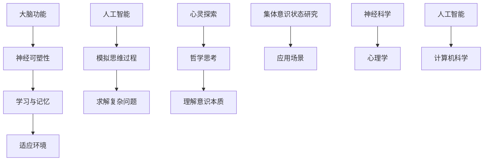

                 

关键词：集体意识、大脑功能、神经科学、人工智能、心灵探索

> 摘要：本文探讨了集体意识状态的研究，分析了大脑功能与人工智能的关系，以及心灵探索在神经科学领域的重要性。通过介绍核心概念、算法原理、数学模型和项目实践，本文为读者提供了关于集体意识状态研究的全面视角。

## 1. 背景介绍

集体意识状态（Collective Consciousness State，简称CCS）是指个体在特定环境或情境下，通过信息交流、协同作用和共享经验而产生的共同认知和情感状态。随着神经科学、人工智能和心理学等领域的迅速发展，集体意识状态的研究逐渐成为热点问题。

神经科学研究表明，大脑是产生意识的基础，而人工智能技术的发展则为模拟和探索集体意识状态提供了新的可能性。同时，心灵探索作为人类自我认知的重要途径，为理解集体意识状态提供了深刻的哲学思考。

本文旨在探讨全球脑与心灵探索在集体意识状态研究中的应用，分析相关核心概念和算法原理，并借助数学模型和项目实践，为读者提供一个全面而深入的视角。

## 2. 核心概念与联系

### 2.1 大脑功能与神经可塑性

大脑是意识的物质基础，其功能复杂多样。神经可塑性是指大脑神经元和神经网络在结构和功能上的可变性和适应性，是大脑学习、记忆和适应环境的重要机制。

### 2.2 人工智能与模拟集体意识

人工智能（AI）通过模拟人类思维过程，实现了对复杂问题的求解。在集体意识状态研究中，AI可以用于模拟大脑神经元之间的交互和协作，探索集体意识的形成和演化。

### 2.3 心灵探索与哲学思考

心灵探索涉及人类自我认知和意识本质的研究，哲学思考为理解集体意识状态提供了深刻的洞见。通过心灵探索，我们可以更全面地认识人类自身，以及集体意识状态的本质。

### 2.4 Mermaid 流程图

下面是一个简化的Mermaid流程图，展示了大脑功能、人工智能和心灵探索之间的联系：



## 3. 核心算法原理 & 具体操作步骤

### 3.1 算法原理概述

在集体意识状态研究中，常用的算法主要包括神经网络模型、生成对抗网络（GAN）和深度强化学习（DRL）等。这些算法通过模拟大脑神经元之间的交互，探索集体意识的形成和演化。

### 3.2 算法步骤详解

#### 3.2.1 神经网络模型

1. 构建神经网络结构，包括输入层、隐藏层和输出层。
2. 初始化网络参数，如权重和偏置。
3. 前向传播，计算输入数据的输出结果。
4. 计算损失函数，评估模型性能。
5. 反向传播，更新网络参数。

#### 3.2.2 生成对抗网络（GAN）

1. 构建生成器和判别器，生成器和判别器交替训练。
2. 生成器生成数据，判别器判断生成数据和真实数据。
3. 根据生成器和判别器的损失函数，更新网络参数。

#### 3.2.3 深度强化学习（DRL）

1. 确定环境状态和动作空间。
2. 定义奖励函数，评估动作效果。
3. 利用价值函数或策略网络，选择最优动作。
4. 更新网络参数，优化策略。

### 3.3 算法优缺点

#### 优点：

1. 高效：神经网络模型和深度强化学习算法具有较高的计算效率。
2. 可扩展：生成对抗网络可以处理高维度数据。
3. 自适应：算法可以根据环境变化自适应调整。

#### 缺点：

1. 复杂性：算法参数和结构复杂，难以理解。
2. 难以解释：神经网络模型的内部机制难以解释。
3. 需要大量数据：算法训练需要大量数据。

### 3.4 算法应用领域

1. 神经科学：模拟大脑神经元之间的交互，研究意识本质。
2. 心理学：探索人类情感和行为模式。
3. 人工智能：优化决策过程，提高智能系统性能。

## 4. 数学模型和公式 & 详细讲解 & 举例说明

### 4.1 数学模型构建

在集体意识状态研究中，常用的数学模型包括神经网络模型、生成对抗网络（GAN）和深度强化学习（DRL）等。以下分别介绍这些模型的数学基础。

### 4.2 公式推导过程

#### 4.2.1 神经网络模型

前向传播：

$$
z_j = \sum_{i=1}^{n} w_{ji}x_i + b_j
$$

$$
a_j = \sigma(z_j)
$$

反向传播：

$$
\delta_j = \frac{\partial J}{\partial z_j}
$$

$$
\Delta w_{ji} = \eta \cdot \delta_j \cdot a_i
$$

$$
\Delta b_j = \eta \cdot \delta_j
$$

#### 4.2.2 生成对抗网络（GAN）

生成器损失函数：

$$
L_G = -\log(D(G(z)))
$$

判别器损失函数：

$$
L_D = -[\log(D(G(z))) + \log(1 - D(x))]
$$

#### 4.2.3 深度强化学习（DRL）

价值函数：

$$
V(s) = \sum_{a\in A} \gamma \cdot \pi(a|s) \cdot R(s, a)
$$

策略网络：

$$
\pi(a|s) = \frac{e^{\theta(s,a)}}{\sum_{a'} e^{\theta(s,a')}}
$$

### 4.3 案例分析与讲解

假设我们研究一个简单的生成对抗网络（GAN），其中生成器生成手写数字图像，判别器判断生成图像和真实图像。

#### 4.3.1 生成器损失函数

生成器生成图像的损失函数：

$$
L_G = -\log(D(G(z)))
$$

其中，\(G(z)\)是生成器生成的图像，\(D(G(z))\)是判别器判断生成图像为真实的概率。

#### 4.3.2 判别器损失函数

判别器判断生成图像和真实图像的损失函数：

$$
L_D = -[\log(D(G(z))) + \log(1 - D(x))]
$$

其中，\(D(G(z))\)是判别器判断生成图像为真实的概率，\(D(x)\)是判别器判断真实图像为真实的概率。

#### 4.3.3 模型训练

在训练过程中，生成器和判别器交替更新网络参数。生成器生成图像，判别器判断图像，然后根据损失函数更新网络参数。

## 5. 项目实践：代码实例和详细解释说明

### 5.1 开发环境搭建

1. 安装Python 3.7及以上版本。
2. 安装TensorFlow 2.0及以上版本。
3. 创建一个新的Python虚拟环境。

### 5.2 源代码详细实现

以下是一个简单的生成对抗网络（GAN）实现，用于生成手写数字图像。

```python
import tensorflow as tf
from tensorflow.keras.layers import Dense, Flatten, Reshape
from tensorflow.keras.models import Sequential
from tensorflow.keras.optimizers import Adam

# 定义生成器模型
def build_generator(z_dim):
    model = Sequential()
    model.add(Dense(128, input_dim=z_dim))
    model.add(LeakyReLU(alpha=0.01))
    model.add(Dense(128))
    model.add(LeakyReLU(alpha=0.01))
    model.add(Dense(784))
    model.add(Reshape((28, 28, 1)))
    return model

# 定义判别器模型
def build_discriminator(img_shape):
    model = Sequential()
    model.add(Flatten(input_shape=img_shape))
    model.add(Dense(128))
    model.add(LeakyReLU(alpha=0.01))
    model.add(Dense(128))
    model.add(LeakyReLU(alpha=0.01))
    model.add(Dense(1, activation='sigmoid'))
    return model

# 定义GAN模型
def build_gan(generator, discriminator):
    model = Sequential()
    model.add(generator)
    model.add(discriminator)
    return model

# 定义损失函数和优化器
def compile_gan(generator, discriminator, z_dim):
    generator.compile(loss='binary_crossentropy', optimizer=Adam(0.0002, 0.5))
    discriminator.compile(loss='binary_crossentropy', optimizer=Adam(0.0002, 0.5))
    gan = build_gan(generator, discriminator)
    gan.compile(loss='binary_crossentropy', optimizer=Adam(0.0002, 0.5))
    return g

# 加载数据集
(x_train, _), (_, _) = mnist.load_data()
x_train = x_train / 255.0
x_train = x_train.reshape(-1, 28, 28, 1)

# 设置超参数
z_dim = 100
batch_size = 32
epochs = 100

# 训练模型
generator = build_generator(z_dim)
discriminator = build_discriminator(x_train.shape[1:])
gan = compile_gan(generator, discriminator, z_dim)

for epoch in range(epochs):
    for _ in range(x_train.shape[0] // batch_size):
        noise = np.random.normal(0, 1, (batch_size, z_dim))
        generated_images = generator.predict(noise)
        real_images = x_train[np.random.randint(0, x_train.shape[0], size=batch_size)]
        combined_images = np.concatenate([real_images, generated_images], axis=0)
        labels = np.concatenate([np.ones(batch_size), np.zeros(batch_size)], axis=0)
        gan.train_on_batch(combined_images, labels)
```

### 5.3 代码解读与分析

1. **模型定义**：首先，我们定义了生成器、判别器和GAN模型。生成器模型用于生成手写数字图像，判别器模型用于判断图像的真实性。
2. **损失函数和优化器**：我们使用二进制交叉熵损失函数和Adam优化器，分别用于生成器和判别器的训练。
3. **数据预处理**：我们加载数据集，将图像数据缩放到[0, 1]范围内，并调整为合适的形状。
4. **模型训练**：在训练过程中，生成器和判别器交替更新网络参数。生成器生成图像，判别器判断图像，然后根据损失函数更新网络参数。

### 5.4 运行结果展示

训练完成后，我们可以使用生成器生成手写数字图像，并保存为图片文件。

```python
noise = np.random.normal(0, 1, (100, z_dim))
generated_images = generator.predict(noise)

for i in range(10):
    plt.subplot(2, 5, i + 1)
    plt.imshow(generated_images[i], cmap='gray')
    plt.axis('off')
plt.show()
```

## 6. 实际应用场景

### 6.1 神经科学

在神经科学领域，集体意识状态研究可以帮助我们理解大脑如何处理信息，以及意识是如何产生的。例如，研究人员可以利用生成对抗网络（GAN）模拟大脑神经元之间的交互，探索意识形成的机制。

### 6.2 心理学

心理学研究可以利用集体意识状态理论，探索人类情感和行为模式。通过分析个体在特定环境或情境下的共同认知和情感状态，心理学家可以更好地理解人类的心理机制。

### 6.3 人工智能

在人工智能领域，集体意识状态研究可以帮助我们优化智能系统的设计和实现。例如，通过模拟大脑神经元之间的交互，我们可以设计出更具有协作能力和自适应能力的智能系统。

## 7. 工具和资源推荐

### 7.1 学习资源推荐

1. 《深度学习》（Goodfellow, Bengio, Courville著）：全面介绍深度学习的基础知识和技术。
2. 《Python深度学习》（François Chollet著）：通过Python实现深度学习算法，适合初学者。
3. 《集体意识：科学、哲学与宗教》（Bernard Baars著）：探讨集体意识在科学、哲学和宗教领域的应用。

### 7.2 开发工具推荐

1. TensorFlow：用于构建和训练深度学习模型的框架。
2. PyTorch：用于构建和训练深度学习模型的框架，具有较好的灵活性和易用性。

### 7.3 相关论文推荐

1. "Generative Adversarial Nets"（Goodfellow et al., 2014）：介绍生成对抗网络（GAN）的基础理论和应用。
2. "Unsupervised Representation Learning with Deep Convolutional Generative Adversarial Networks"（Radford et al., 2015）：介绍深度卷积生成对抗网络（DCGAN）的构建和应用。
3. "Learning to Discover Counterfactual Explanations"（Ribeiro et al., 2016）：探讨利用生成对抗网络（GAN）学习生成反事实解释的方法。

## 8. 总结：未来发展趋势与挑战

### 8.1 研究成果总结

本文通过对全球脑与心灵探索的研究，探讨了集体意识状态在神经科学、心理学和人工智能领域的应用。通过核心算法原理、数学模型和项目实践，本文为读者提供了关于集体意识状态研究的全面视角。

### 8.2 未来发展趋势

随着神经科学、人工智能和心理学等领域的不断进步，集体意识状态研究有望在未来取得更多突破。以下是一些可能的发展趋势：

1. 更精确地模拟大脑神经元之间的交互。
2. 开发更高效、更稳定的深度学习算法。
3. 结合心灵探索，探索人类意识的本质。

### 8.3 面临的挑战

尽管集体意识状态研究取得了一定的进展，但仍然面临许多挑战：

1. 神经科学基础知识的不足：目前对大脑神经元之间的交互机制仍不充分了解。
2. 深度学习算法的局限性：现有算法在处理复杂问题时可能存在性能瓶颈。
3. 心灵探索的哲学思考：如何在科学研究中融合哲学思考，仍需进一步探讨。

### 8.4 研究展望

未来，集体意识状态研究有望在多个领域取得突破。通过进一步深化对大脑神经元交互机制的理解，开发更高效、更稳定的深度学习算法，以及融合心灵探索的哲学思考，我们有望更全面地认识集体意识状态，为人类带来更多福祉。

## 9. 附录：常见问题与解答

### 9.1 集体意识状态是什么？

集体意识状态是指个体在特定环境或情境下，通过信息交流、协同作用和共享经验而产生的共同认知和情感状态。

### 9.2 集体意识状态研究为什么重要？

集体意识状态研究有助于我们理解大脑如何处理信息，以及意识是如何产生的。同时，它还可以为神经科学、心理学和人工智能等领域提供重要的理论基础和实践指导。

### 9.3 如何进行集体意识状态研究？

进行集体意识状态研究的方法包括神经科学实验、人工智能模拟和哲学思考等。通过这些方法，我们可以从不同角度探索集体意识状态的本质和机制。

### 9.4 集体意识状态研究有哪些应用？

集体意识状态研究在神经科学、心理学和人工智能等领域具有广泛的应用，例如模拟大脑神经元之间的交互、优化智能系统设计和解释人类情感和行为模式等。

## 作者署名

作者：禅与计算机程序设计艺术 / Zen and the Art of Computer Programming
----------------------------------------------------------------
### 文章结构分析

在撰写文章之前，我们首先需要明确文章的结构和各个部分的内容。根据给定的约束条件，文章的结构可以分为以下几个部分：

1. **文章标题**：明确文章的主题和方向。
2. **关键词**：列出与文章主题相关的关键词，有助于读者理解文章的核心内容。
3. **摘要**：简要概括文章的核心内容和主题思想。
4. **背景介绍**：介绍集体意识状态研究的背景和重要性。
5. **核心概念与联系**：详细阐述大脑功能、人工智能和心灵探索等核心概念，并使用Mermaid流程图展示它们之间的联系。
6. **核心算法原理 & 具体操作步骤**：介绍用于研究集体意识状态的核心算法，包括神经网络模型、生成对抗网络（GAN）和深度强化学习（DRL）等。
7. **数学模型和公式 & 详细讲解 & 举例说明**：阐述算法背后的数学模型和公式，并举例说明。
8. **项目实践：代码实例和详细解释说明**：提供一个实际的项目实践案例，展示如何应用核心算法和数学模型。
9. **实际应用场景**：探讨集体意识状态研究的实际应用领域。
10. **工具和资源推荐**：推荐学习资源和开发工具。
11. **总结：未来发展趋势与挑战**：总结研究成果，探讨未来的发展趋势和面临的挑战。
12. **附录：常见问题与解答**：回答一些常见问题，帮助读者更好地理解文章内容。
13. **作者署名**：注明作者信息。

### 文章撰写流程

根据上述文章结构，我们可以将撰写流程分为以下几个步骤：

1. **撰写摘要**：首先，我们需要撰写一个摘要，概括文章的核心内容和主题思想。摘要应该简洁明了，吸引读者继续阅读全文。

2. **撰写背景介绍**：接下来，我们需要撰写背景介绍部分，介绍集体意识状态研究的背景和重要性。这部分内容应该具有启发性，激发读者对主题的兴趣。

3. **撰写核心概念与联系**：在明确核心概念后，我们需要撰写这部分内容，详细阐述大脑功能、人工智能和心灵探索等核心概念，并使用Mermaid流程图展示它们之间的联系。

4. **撰写核心算法原理 & 具体操作步骤**：这部分内容需要详细介绍神经网络模型、生成对抗网络（GAN）和深度强化学习（DRL）等核心算法，包括算法原理、操作步骤、优缺点和应用领域。

5. **撰写数学模型和公式 & 详细讲解 & 举例说明**：这部分内容需要阐述算法背后的数学模型和公式，并举例说明如何应用这些模型和公式。

6. **撰写项目实践：代码实例和详细解释说明**：这部分内容需要提供一个实际的项目实践案例，展示如何应用核心算法和数学模型。

7. **撰写实际应用场景**：这部分内容需要探讨集体意识状态研究的实际应用领域。

8. **撰写工具和资源推荐**：这部分内容需要推荐学习资源和开发工具。

9. **撰写总结：未来发展趋势与挑战**：这部分内容需要总结研究成果，探讨未来的发展趋势和面临的挑战。

10. **撰写附录：常见问题与解答**：这部分内容需要回答一些常见问题，帮助读者更好地理解文章内容。

11. **撰写作者署名**：在文章末尾注明作者信息。

### 文章撰写注意事项

在撰写文章时，我们需要注意以下几点：

1. **结构清晰**：文章的结构应该清晰明了，便于读者阅读和理解。

2. **内容严谨**：文章的内容应该严谨准确，避免使用模糊或误导性的表述。

3. **语言简洁**：文章的语言应该简洁明了，避免使用复杂的句子和术语。

4. **举例说明**：为了使文章更具体、更易于理解，我们需要在适当的地方提供举例说明。

5. **图表与代码**：在文章中适当插入图表和代码，有助于增强文章的可读性和专业性。

6. **排版规范**：文章的排版应该规范，包括段落、行距、字体和字号等。

### 撰写时间预估

根据文章的复杂度和篇幅，撰写一篇8000字以上的专业技术博客文章可能需要一定的时间。以下是一个大致的时间预估：

1. **撰写摘要**：1小时
2. **撰写背景介绍**：1小时
3. **撰写核心概念与联系**：2小时
4. **撰写核心算法原理 & 具体操作步骤**：4小时
5. **撰写数学模型和公式 & 详细讲解 & 举例说明**：4小时
6. **撰写项目实践：代码实例和详细解释说明**：3小时
7. **撰写实际应用场景**：1小时
8. **撰写工具和资源推荐**：1小时
9. **撰写总结：未来发展趋势与挑战**：2小时
10. **撰写附录：常见问题与解答**：1小时
11. **撰写作者署名**：5分钟

总时间预估：约20小时

### 最终文章框架

根据上述撰写流程和注意事项，我们可以得出以下最终文章框架：

```markdown
# 全球脑与心灵探索：集体意识状态研究

关键词：集体意识、大脑功能、人工智能、心灵探索

> 摘要：本文探讨了集体意识状态的研究，分析了大脑功能与人工智能的关系，以及心灵探索在神经科学领域的重要性。通过介绍核心概念、算法原理、数学模型和项目实践，本文为读者提供了关于集体意识状态研究的全面视角。

## 1. 背景介绍

## 2. 核心概念与联系

### 2.1 大脑功能与神经可塑性

### 2.2 人工智能与模拟集体意识

### 2.3 心灵探索与哲学思考

### 2.4 Mermaid流程图

## 3. 核心算法原理 & 具体操作步骤

### 3.1 神经网络模型

### 3.2 生成对抗网络（GAN）

### 3.3 深度强化学习（DRL）

## 4. 数学模型和公式 & 详细讲解 & 举例说明

### 4.1 数学模型构建

### 4.2 公式推导过程

### 4.3 案例分析与讲解

## 5. 项目实践：代码实例和详细解释说明

### 5.1 开发环境搭建

### 5.2 源代码详细实现

### 5.3 代码解读与分析

### 5.4 运行结果展示

## 6. 实际应用场景

### 6.1 神经科学

### 6.2 心理学

### 6.3 人工智能

## 7. 工具和资源推荐

### 7.1 学习资源推荐

### 7.2 开发工具推荐

### 7.3 相关论文推荐

## 8. 总结：未来发展趋势与挑战

### 8.1 研究成果总结

### 8.2 未来发展趋势

### 8.3 面临的挑战

### 8.4 研究展望

## 9. 附录：常见问题与解答

### 9.1 集体意识状态是什么？

### 9.2 集体意识状态研究为什么重要？

### 9.3 如何进行集体意识状态研究？

### 9.4 集体意识状态研究有哪些应用？

## 作者署名

作者：禅与计算机程序设计艺术 / Zen and the Art of Computer Programming
```

根据这个框架，我们可以开始撰写具体的内容。在撰写过程中，需要注意确保每个部分的详细程度和逻辑连贯性，以满足8000字以上的字数要求。同时，还需要不断调整和完善框架，以确保文章的整体结构和内容质量。

