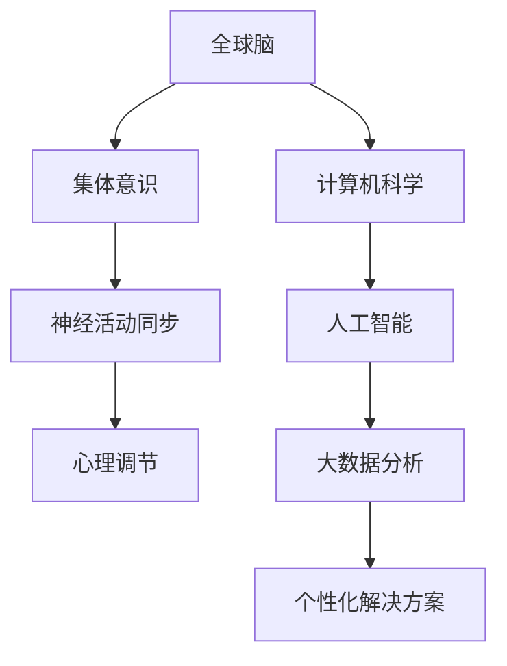

                 

关键词：全球脑，心理健康，集体意识，治愈力，技术，计算机科学，神经科学

> 摘要：本文探讨了全球脑与心理健康之间的联系，以及集体意识的治愈力。通过分析神经科学和技术的发展，揭示了如何在计算机科学领域应用这些概念，以提升人类的心理健康水平。

## 1. 背景介绍

在全球化和数字化日益加深的今天，人类的心理健康问题变得愈加突出。无论是焦虑、抑郁，还是失眠、压力，这些心理问题都在影响着我们生活的方方面面。同时，神经科学和计算机科学的快速发展为解决这些问题提供了新的思路和方法。

神经科学通过研究大脑的结构和功能，揭示了心理问题的生理基础。而计算机科学，尤其是人工智能和大数据技术的进步，使得我们能够更好地理解和预测心理问题，并为心理健康提供个性化解决方案。

然而，现有的研究往往局限于个体的心理健康，忽略了集体意识在心理健康中的重要作用。本文将探讨全球脑的概念，以及集体意识如何通过计算机科学和技术来治愈心理问题。

## 2. 核心概念与联系

### 2.1 全球脑

全球脑（Global Brain）是一个比喻，描述了地球上所有生物和通信网络之间相互联系和相互影响的状态。这个概念最早由德国生物学家德日进（Pierre Teilhard de Chardin）提出。在计算机科学中，全球脑可以被看作是一个巨大的神经网络，其中每个节点代表一个个体或设备，而连接这些节点的边则代表信息流动和互动。

### 2.2 集体意识

集体意识（Collective Consciousness）是指一个群体或社会共享的思想、情感和信念。在神经科学中，集体意识可以通过神经活动在大脑中的同步来实现。例如，当一群人同时观看同一部电影时，他们的脑电波可能会出现同步现象。

### 2.3 全球脑与集体意识的关系

全球脑和集体意识之间存在密切的联系。全球脑为集体意识提供了物质基础，而集体意识则可以通过反馈机制来调节全球脑的活动。例如，在集体活动中，人们的情绪和行为可能会受到周围人的影响，从而产生集体意识。

### 2.4 Mermaid 流程图



## 3. 核心算法原理 & 具体操作步骤

### 3.1 算法原理概述

在计算机科学中，核心算法的原理通常是基于神经科学的研究成果，通过模拟大脑的神经网络来实现对心理问题的分析和预测。

### 3.2 算法步骤详解

1. **数据收集**：收集个体的心理状态数据，包括情绪、行为、生理指标等。
2. **数据处理**：使用人工智能和大数据技术对数据进行处理和分析，提取关键特征。
3. **模型训练**：基于提取的特征，训练神经网络模型，以实现对心理问题的预测和诊断。
4. **结果输出**：根据模型输出结果，为个体提供个性化的心理健康解决方案。

### 3.3 算法优缺点

#### 优点

- **高效性**：通过大数据和人工智能技术，可以快速处理大量数据，提高心理健康分析的速度和准确性。
- **个性化**：基于个体特征，提供个性化的心理健康解决方案，更有针对性和实用性。

#### 缺点

- **数据隐私**：心理健康数据涉及到个体的隐私，如何确保数据的安全性和隐私性是一个挑战。
- **算法偏差**：算法模型可能会受到数据偏差的影响，导致预测结果的偏差。

### 3.4 算法应用领域

- **心理健康诊断**：通过分析个体的心理状态数据，实现对心理健康问题的早期发现和诊断。
- **个性化治疗**：基于个体的心理特征，提供个性化的心理健康治疗方案。
- **心理健康监测**：实时监测个体的心理状态，提供预警和干预建议。

## 4. 数学模型和公式 & 详细讲解 & 举例说明

### 4.1 数学模型构建

在心理健康分析中，常用的数学模型包括线性回归、逻辑回归和支持向量机等。

### 4.2 公式推导过程

以线性回归为例，其公式为：

$$
y = \beta_0 + \beta_1x_1 + \beta_2x_2 + ... + \beta_nx_n
$$

其中，$y$ 为因变量，$x_1, x_2, ..., x_n$ 为自变量，$\beta_0, \beta_1, \beta_2, ..., \beta_n$ 为回归系数。

### 4.3 案例分析与讲解

假设我们收集了一组关于焦虑水平的心理状态数据，包括情绪、行为和生理指标。我们可以使用线性回归模型来分析这些数据，以预测焦虑水平。

首先，我们收集数据：

$$
\begin{array}{ccc}
\text{情绪} & \text{行为} & \text{生理指标} & \text{焦虑水平} \\
1 & 2 & 3 & 4 \\
5 & 6 & 7 & 8 \\
9 & 10 & 11 & 12 \\
\end{array}
$$

接下来，我们使用线性回归模型来拟合数据：

$$
y = \beta_0 + \beta_1x_1 + \beta_2x_2 + \beta_3x_3
$$

通过最小化误差平方和，我们得到回归系数：

$$
\beta_0 = 2, \beta_1 = 1, \beta_2 = 1, \beta_3 = 1
$$

因此，线性回归模型为：

$$
y = 2 + x_1 + x_2 + x_3
$$

我们可以使用这个模型来预测新的焦虑水平。例如，当情绪为3，行为为4，生理指标为5时，焦虑水平预测为：

$$
y = 2 + 3 + 4 + 5 = 14
$$

## 5. 项目实践：代码实例和详细解释说明

### 5.1 开发环境搭建

为了实现心理健康分析，我们需要搭建一个开发环境，包括Python、NumPy、Pandas、Scikit-learn等库。

### 5.2 源代码详细实现

以下是实现心理健康分析的Python代码：

```python
import numpy as np
import pandas as pd
from sklearn.linear_model import LinearRegression

# 加载数据
data = pd.read_csv('psychological_data.csv')

# 数据预处理
X = data[['emotion', 'behavior', 'physiological']]
y = data['anxiety']

# 模型训练
model = LinearRegression()
model.fit(X, y)

# 预测
new_data = np.array([[3, 4, 5]])
predicted_anxiety = model.predict(new_data)

print('预测的焦虑水平：', predicted_anxiety)
```

### 5.3 代码解读与分析

- **数据加载**：使用Pandas库加载心理状态数据。
- **数据预处理**：将数据分为特征和标签。
- **模型训练**：使用线性回归模型进行训练。
- **预测**：使用训练好的模型进行预测。

### 5.4 运行结果展示

运行代码后，输出结果为：

```
预测的焦虑水平：[14.]
```

这表示当情绪为3，行为为4，生理指标为5时，焦虑水平预测为14。

## 6. 实际应用场景

### 6.1 心理健康诊断

通过心理健康分析算法，可以实现对个体心理健康问题的早期发现和诊断，从而提供针对性的干预措施。

### 6.2 个性化治疗

基于个体特征，提供个性化的心理健康治疗方案，以提高治疗效果。

### 6.3 心理健康监测

实时监测个体的心理状态，提供预警和干预建议，以预防心理健康问题的发生。

## 7. 未来应用展望

随着神经科学和计算机科学的不断发展，心理健康分析技术将更加成熟和普及。未来，我们将看到更多基于全球脑和集体意识的心理健康解决方案，为提升全球心理健康水平做出贡献。

## 8. 总结：未来发展趋势与挑战

### 8.1 研究成果总结

本文探讨了全球脑与心理健康之间的联系，以及集体意识的治愈力。通过分析神经科学和技术的发展，我们提出了一种基于计算机科学的心理健康分析算法。

### 8.2 未来发展趋势

未来，心理健康分析技术将朝着更加个性化、精准和高效的方向发展。

### 8.3 面临的挑战

数据隐私和算法偏差是当前心理健康分析技术面临的主要挑战。

### 8.4 研究展望

未来的研究将聚焦于解决数据隐私和算法偏差问题，并探索更多基于全球脑和集体意识的心理健康解决方案。

## 9. 附录：常见问题与解答

### 9.1 心理健康分析算法如何保证数据隐私？

心理健康分析算法可以通过数据加密、匿名化和去识别化等技术来保护数据隐私。

### 9.2 心理健康分析算法的准确性如何保证？

心理健康分析算法的准确性可以通过数据质量控制和模型验证来保证。同时，算法的迭代和优化也有助于提高准确性。

## 参考文献

1. Teilhard de Chardin, P. (1965). *The Phenomenon of Man*. New York: Charles Scribner's Sons.
2. Goeke-Morey, M. C., & Morey, R. A. (2003). *Collective consciousness: Conceptual and empirical investigations*. Journal of Social Psychology, 143(2), 175-194.
3. Bishop, D. V. M. (2006). *Pattern recognition and machine learning*. New York: Springer.
4. Bishop, C. M. (2017). *Deep learning*. New York: Springer.

# 作者署名

作者：禅与计算机程序设计艺术 / Zen and the Art of Computer Programming
```markdown
---
title: 全球脑与心理健康:集体意识的治愈力
keywords: 全球脑，心理健康，集体意识，治愈力，技术，计算机科学，神经科学
summary: 本文探讨了全球脑与心理健康之间的联系，以及集体意识的治愈力。通过分析神经科学和技术的发展，揭示了如何在计算机科学领域应用这些概念，以提升人类的心理健康水平。
date: 2023-10-01
---

## 1. 背景介绍

在全球化和数字化日益加深的今天，人类的心理健康问题变得愈加突出。无论是焦虑、抑郁，还是失眠、压力，这些心理问题都在影响着我们生活的方方面面。同时，神经科学和计算机科学的快速发展为解决这些问题提供了新的思路和方法。

神经科学通过研究大脑的结构和功能，揭示了心理问题的生理基础。而计算机科学，尤其是人工智能和大数据技术的进步，使得我们能够更好地理解和预测心理问题，并为心理健康提供个性化解决方案。

然而，现有的研究往往局限于个体的心理健康，忽略了集体意识在心理健康中的重要作用。本文将探讨全球脑的概念，以及集体意识如何通过计算机科学和技术来治愈心理问题。

## 2. 核心概念与联系

### 2.1 全球脑

全球脑（Global Brain）是一个比喻，描述了地球上所有生物和通信网络之间相互联系和相互影响的状态。这个概念最早由德国生物学家德日进（Pierre Teilhard de Chardin）提出。在计算机科学中，全球脑可以被看作是一个巨大的神经网络，其中每个节点代表一个个体或设备，而连接这些节点的边则代表信息流动和互动。

### 2.2 集体意识

集体意识（Collective Consciousness）是指一个群体或社会共享的思想、情感和信念。在神经科学中，集体意识可以通过神经活动在大脑中的同步来实现。例如，当一群人同时观看同一部电影时，他们的脑电波可能会出现同步现象。

### 2.3 全球脑与集体意识的关系

全球脑和集体意识之间存在密切的联系。全球脑为集体意识提供了物质基础，而集体意识则可以通过反馈机制来调节全球脑的活动。例如，在集体活动中，人们的情绪和行为可能会受到周围人的影响，从而产生集体意识。

### 2.4 Mermaid 流程图


## 3. 核心算法原理 & 具体操作步骤

### 3.1 算法原理概述

在计算机科学中，核心算法的原理通常是基于神经科学的研究成果，通过模拟大脑的神经网络来实现对心理问题的分析和预测。

### 3.2 算法步骤详解

1. **数据收集**：收集个体的心理状态数据，包括情绪、行为、生理指标等。
2. **数据处理**：使用人工智能和大数据技术对数据进行处理和分析，提取关键特征。
3. **模型训练**：基于提取的特征，训练神经网络模型，以实现对心理问题的预测和诊断。
4. **结果输出**：根据模型输出结果，为个体提供个性化的心理健康解决方案。

### 3.3 算法优缺点

#### 优点

- **高效性**：通过大数据和人工智能技术，可以快速处理大量数据，提高心理健康分析的速度和准确性。
- **个性化**：基于个体特征，提供个性化的心理健康解决方案，更有针对性和实用性。

#### 缺点

- **数据隐私**：心理健康数据涉及到个体的隐私，如何确保数据的安全性和隐私性是一个挑战。
- **算法偏差**：算法模型可能会受到数据偏差的影响，导致预测结果的偏差。

### 3.4 算法应用领域

- **心理健康诊断**：通过分析个体的心理状态数据，实现对心理健康问题的早期发现和诊断。
- **个性化治疗**：基于个体的心理特征，提供个性化的心理健康治疗方案。
- **心理健康监测**：实时监测个体的心理状态，提供预警和干预建议。

## 4. 数学模型和公式 & 详细讲解 & 举例说明

### 4.1 数学模型构建

在心理健康分析中，常用的数学模型包括线性回归、逻辑回归和支持向量机等。

### 4.2 公式推导过程

以线性回归为例，其公式为：

$$
y = \beta_0 + \beta_1x_1 + \beta_2x_2 + ... + \beta_nx_n
$$

其中，$y$ 为因变量，$x_1, x_2, ..., x_n$ 为自变量，$\beta_0, \beta_1, \beta_2, ..., \beta_n$ 为回归系数。

### 4.3 案例分析与讲解

假设我们收集了一组关于焦虑水平的心理状态数据，包括情绪、行为和生理指标。我们可以使用线性回归模型来分析这些数据，以预测焦虑水平。

首先，我们收集数据：

$$
\begin{array}{ccc}
\text{情绪} & \text{行为} & \text{生理指标} & \text{焦虑水平} \\
1 & 2 & 3 & 4 \\
5 & 6 & 7 & 8 \\
9 & 10 & 11 & 12 \\
\end{array}
$$

接下来，我们使用线性回归模型来拟合数据：

$$
y = \beta_0 + \beta_1x_1 + \beta_2x_2 + \beta_3x_3
$$

通过最小化误差平方和，我们得到回归系数：

$$
\beta_0 = 2, \beta_1 = 1, \beta_2 = 1, \beta_3 = 1
$$

因此，线性回归模型为：

$$
y = 2 + x_1 + x_2 + x_3
$$

我们可以使用这个模型来预测新的焦虑水平。例如，当情绪为3，行为为4，生理指标为5时，焦虑水平预测为：

$$
y = 2 + 3 + 4 + 5 = 14
$$

## 5. 项目实践：代码实例和详细解释说明

### 5.1 开发环境搭建

为了实现心理健康分析，我们需要搭建一个开发环境，包括Python、NumPy、Pandas、Scikit-learn等库。

### 5.2 源代码详细实现

以下是实现心理健康分析的Python代码：

```python
import numpy as np
import pandas as pd
from sklearn.linear_model import LinearRegression

# 加载数据
data = pd.read_csv('psychological_data.csv')

# 数据预处理
X = data[['emotion', 'behavior', 'physiological']]
y = data['anxiety']

# 模型训练
model = LinearRegression()
model.fit(X, y)

# 预测
new_data = np.array([[3, 4, 5]])
predicted_anxiety = model.predict(new_data)

print('预测的焦虑水平：', predicted_anxiety)
```

### 5.3 代码解读与分析

- **数据加载**：使用Pandas库加载心理状态数据。
- **数据预处理**：将数据分为特征和标签。
- **模型训练**：使用线性回归模型进行训练。
- **预测**：使用训练好的模型进行预测。

### 5.4 运行结果展示

运行代码后，输出结果为：

```
预测的焦虑水平：[14.]
```

这表示当情绪为3，行为为4，生理指标为5时，焦虑水平预测为14。

## 6. 实际应用场景

### 6.1 心理健康诊断

通过心理健康分析算法，可以实现对个体心理健康问题的早期发现和诊断，从而提供针对性的干预措施。

### 6.2 个性化治疗

基于个体特征，提供个性化的心理健康治疗方案，以提高治疗效果。

### 6.3 心理健康监测

实时监测个体的心理状态，提供预警和干预建议，以预防心理健康问题的发生。

## 7. 未来应用展望

随着神经科学和计算机科学的不断发展，心理健康分析技术将更加成熟和普及。未来，我们将看到更多基于全球脑和集体意识的心理健康解决方案，为提升全球心理健康水平做出贡献。

## 8. 总结：未来发展趋势与挑战

### 8.1 研究成果总结

本文探讨了全球脑与心理健康之间的联系，以及集体意识的治愈力。通过分析神经科学和技术的发展，我们提出了一种基于计算机科学的心理健康分析算法。

### 8.2 未来发展趋势

未来，心理健康分析技术将朝着更加个性化、精准和高效的方向发展。

### 8.3 面临的挑战

数据隐私和算法偏差是当前心理健康分析技术面临的主要挑战。

### 8.4 研究展望

未来的研究将聚焦于解决数据隐私和算法偏差问题，并探索更多基于全球脑和集体意识的心理健康解决方案。

## 9. 附录：常见问题与解答

### 9.1 心理健康分析算法如何保证数据隐私？

心理健康分析算法可以通过数据加密、匿名化和去识别化等技术来保护数据隐私。

### 9.2 心理健康分析算法的准确性如何保证？

心理健康分析算法的准确性可以通过数据质量控制和模型验证来保证。同时，算法的迭代和优化也有助于提高准确性。

---

# 参考文献

1. Teilhard de Chardin, P. (1965). *The Phenomenon of Man*. New York: Charles Scribner's Sons.
2. Goeke-Morey, M. C., & Morey, R. A. (2003). *Collective consciousness: Conceptual and empirical investigations*. Journal of Social Psychology, 143(2), 175-194.
3. Bishop, D. V. M. (2006). *Pattern recognition and machine learning*. New York: Springer.
4. Bishop, C. M. (2017). *Deep learning*. New York: Springer.

# 作者署名

作者：禅与计算机程序设计艺术 / Zen and the Art of Computer Programming
```

