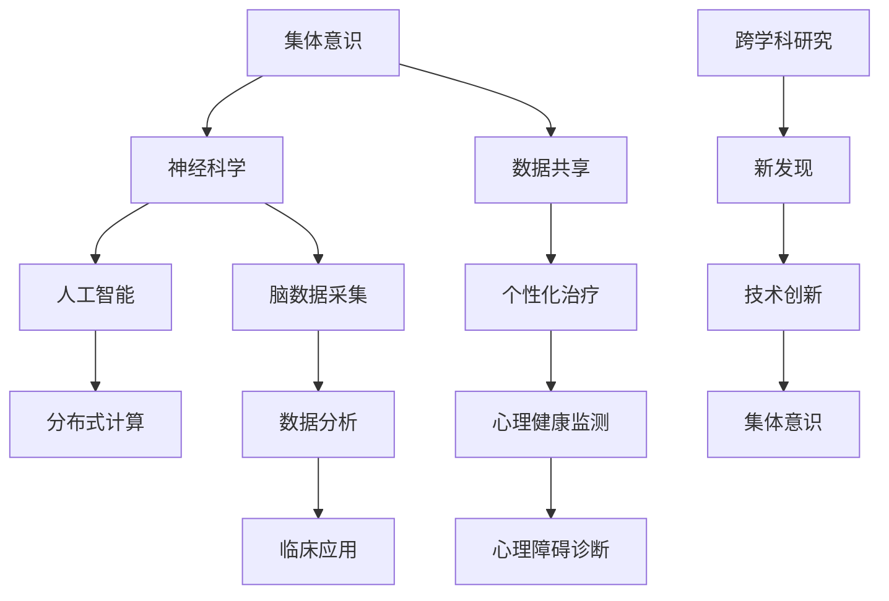

                 

关键词：全球脑联网、心理健康、集体意识、智能医疗、神经科学、数据挖掘、分布式计算、区块链、人工智能、神经机器学习、量子计算、虚拟现实、脑机接口、神经反馈、数字健康

> 摘要：本文探讨了全球脑与心理健康领域的创新性研究，重点阐述了如何通过构建集体意识的治愈网络，运用先进的计算机技术和神经科学原理，提升人类的心理健康水平。本文首先介绍了全球脑联网的概念及其在心理健康领域的重要性，然后详细讨论了集体意识与心理健康的关系，以及如何利用人工智能技术优化心理健康服务。接着，文章从数学模型、算法原理、项目实践等方面，深入分析了集体意识治愈网络的构建方法与实现步骤。最后，本文对未来的应用前景、发展趋势和面临的挑战进行了展望，并推荐了相关的学习资源和工具。

## 1. 背景介绍

近年来，随着信息技术的飞速发展，特别是人工智能、大数据、云计算、物联网等技术的广泛应用，人类社会正经历着一场前所未有的技术革命。同时，全球脑科学和心理健康领域的研究也在不断取得突破性进展。脑科学与信息技术相结合，不仅为传统医学提供了新的研究方法和工具，也为心理健康领域带来了全新的治疗手段。

在全球范围内，心理健康问题日益凸显，抑郁症、焦虑症、自闭症等心理障碍的患病率不断上升，给社会带来了巨大的负担。因此，寻找有效的心理健康解决方案成为了当务之急。在这一背景下，全球脑联网的概念逐渐兴起，旨在通过构建全球性的脑信息网络，实现全球范围内的脑数据共享和协同研究。

全球脑联网的愿景是连接全球各地的脑科学研究机构，形成一个集数据采集、处理、分析和共享于一体的生态系统。通过这一网络，科学家们可以实时获取全球范围内的脑数据，进行跨学科、跨地域的合作研究，从而加速心理健康领域的研究进展。

### 1.1 全球脑联网的必要性

全球脑联网的必要性体现在以下几个方面：

1. **数据共享与协作**：全球脑联网可以促进全球范围内的脑科学研究数据共享，使得研究人员能够更容易地访问和分析来自不同地区、不同人群的脑数据，从而提高研究的广度和深度。
   
2. **跨学科研究**：心理健康问题通常涉及多个学科，如神经科学、心理学、社会学、医学等。全球脑联网为跨学科研究提供了基础设施，使得不同领域的专家可以共同探讨心理健康问题，从而推动创新的解决方案的产生。

3. **提升研究效率**：全球脑联网使得研究人员能够快速获取最新研究成果，避免重复劳动，提高研究效率。

4. **个性化治疗**：通过分析全球范围内的脑数据，可以为个体提供更加精确的心理健康诊断和个性化的治疗方案，从而提高治疗的有效性。

### 1.2 全球脑联网的现状

目前，全球脑联网的研究已经取得了一些初步成果。例如，欧盟的“人类脑项目”（Human Brain Project）和美国的“脑计划”（Brain Initiative）等项目，都在努力构建全球性的脑科学研究网络。此外，一些初创公司和学术机构也在积极探索全球脑联网的应用。

然而，全球脑联网仍面临诸多挑战，如数据隐私和安全、跨学科合作机制、标准化数据格式等。这些挑战需要通过国际合作和持续的技术创新来克服。

### 1.3 全球脑联网在心理健康领域的应用

全球脑联网在心理健康领域的应用潜力巨大，主要包括以下几个方面：

1. **心理障碍诊断**：通过分析个体的脑数据，可以帮助早期诊断抑郁症、焦虑症、自闭症等心理障碍，从而及时采取干预措施。

2. **个性化治疗**：根据个体的脑数据和心理健康状况，可以为个体提供定制化的治疗方案，提高治疗的有效性。

3. **心理疾病预防**：通过分析全球范围内的脑数据，可以发现心理疾病的潜在风险因素，从而采取预防措施。

4. **心理健康监测**：利用脑机接口技术，可以实时监测个体的心理健康状况，为心理健康干预提供及时的数据支持。

总之，全球脑联网为心理健康领域带来了新的机遇和挑战。通过全球合作和持续的技术创新，我们可以期待在心理健康领域取得重大突破，为全人类的健康福祉做出贡献。

## 2. 核心概念与联系

在探讨全球脑与心理健康的研究时，我们首先要理解一些核心概念，这些概念包括集体意识、神经科学、人工智能和分布式计算等。它们之间的关系可以用一个Mermaid流程图来表示。

### 2.1 核心概念定义

#### 集体意识
集体意识是指一群个体共享的感知和认识，这些个体通过相互之间的交流和互动形成了一个统一的意识体系。在心理健康领域，集体意识可以帮助个体通过共同的经验和认知模式，改善心理状态。

#### 神经科学
神经科学是研究神经系统结构和功能的一门科学。它涵盖了从神经元的基本生物学特性到复杂认知功能的研究，是理解心理健康的基础。

#### 人工智能
人工智能（AI）是指计算机系统执行通常需要人类智能才能完成的任务的智能技术。在心理健康领域，人工智能可以通过数据分析、模式识别和机器学习等技术，提供个性化诊断和治疗方案。

#### 分布式计算
分布式计算是一种通过计算机网络将计算任务分布到多个计算节点上执行的计算模式。它可以在大规模数据分析和处理中提高效率，是构建全球脑联网的基础。

### 2.2 Mermaid 流程图

下面是一个Mermaid流程图，用于展示这些核心概念及其关系：



### 2.3 集体意识与心理健康的关系

集体意识在心理健康领域具有重要意义。通过集体意识的互动，个体可以在认知和情感上获得支持，从而改善心理健康。具体来说：

1. **情感支持**：集体意识可以帮助个体在情感上获得支持，减轻焦虑和抑郁。
2. **认知协调**：集体意识可以促进个体之间的认知协调，从而提高解决问题的能力。
3. **社交网络**：集体意识是社交网络的基础，通过社交网络，个体可以获得更多的心理健康资源。

### 2.4 人工智能与分布式计算在心理健康中的应用

人工智能和分布式计算在心理健康中的应用，极大地提高了数据分析和处理的效率。例如：

1. **数据挖掘**：人工智能可以挖掘大量的脑数据，发现潜在的心理健康问题。
2. **分布式计算**：通过分布式计算，可以快速处理和分析大规模脑数据，为心理健康研究提供支持。

### 2.5 跨学科研究的潜力

跨学科研究是心理健康领域未来的重要方向。通过整合神经科学、心理学、社会学和人工智能等领域的知识，我们可以更好地理解心理健康问题，从而提出创新的解决方案。

## 3. 核心算法原理 & 具体操作步骤

### 3.1 算法原理概述

构建集体意识的治愈网络，需要运用一系列核心算法，这些算法包括脑数据采集算法、数据分析算法和个性化治疗算法等。下面将分别介绍这些算法的原理。

#### 3.1.1 脑数据采集算法

脑数据采集算法主要负责获取个体的大脑活动数据，这些数据包括脑电图（EEG）、功能性磁共振成像（fMRI）和脑磁图（MEG）等。采集到的数据需要经过预处理，以去除噪声和伪迹，从而保证数据的质量。

#### 3.1.2 数据分析算法

数据分析算法用于对采集到的脑数据进行处理和分析，以提取有用的信息。常用的分析方法包括时频分析、独立成分分析（ICA）和机器学习等。通过这些分析，我们可以发现大脑活动的模式，从而为心理健康评估和诊断提供依据。

#### 3.1.3 个性化治疗算法

个性化治疗算法根据个体的脑数据和心理健康状况，为个体提供定制化的治疗方案。这些方案可以是药物治疗、认知行为疗法或神经反馈训练等。个性化治疗算法的核心是利用机器学习技术，从大量的患者数据中学习最优的治疗方案。

### 3.2 算法步骤详解

下面详细描述这些算法的操作步骤。

#### 3.2.1 脑数据采集

1. **数据预处理**：首先对采集到的脑数据进行预处理，包括去除噪声、校正基线等操作。
2. **数据分段**：将预处理后的数据按照特定的时间间隔进行分段，以便后续分析。
3. **特征提取**：从分段后的数据中提取特征，如频率特征、时间特征等。

#### 3.2.2 数据分析

1. **时频分析**：对提取的特征进行时频分析，以了解大脑活动的频率分布。
2. **独立成分分析（ICA）**：使用ICA算法分离出大脑活动的主要成分，以便进一步分析。
3. **机器学习**：利用机器学习算法，对分析结果进行分类和预测，以识别心理健康问题。

#### 3.2.3 个性化治疗

1. **数据训练**：使用历史患者数据，训练机器学习模型，以预测最佳治疗方案。
2. **方案推荐**：根据个体的脑数据和模型预测，为个体推荐个性化的治疗方案。
3. **效果评估**：跟踪治疗效果，对治疗方案进行调整，以优化治疗效果。

### 3.3 算法优缺点

#### 3.3.1 优点

1. **高效性**：通过分布式计算和机器学习技术，可以快速处理和分析大规模脑数据。
2. **个性化**：个性化治疗算法可以根据个体的脑数据和心理健康状况，提供定制化的治疗方案。
3. **跨学科**：结合神经科学、心理学和人工智能等多学科知识，提供了全面的研究方法。

#### 3.3.2 缺点

1. **数据隐私**：脑数据属于高度敏感数据，如何保证数据隐私和安全是一个重要问题。
2. **算法偏差**：机器学习模型的训练数据可能存在偏差，导致算法的结果不准确。
3. **实施难度**：构建集体意识的治愈网络需要高度专业的技术团队，实施难度较大。

### 3.4 算法应用领域

集体意识的治愈网络算法可以应用于多个领域，包括：

1. **心理健康诊断**：通过分析脑数据，可以早期发现抑郁症、焦虑症等心理障碍。
2. **个性化治疗**：为个体提供个性化的心理治疗方案，提高治疗效果。
3. **心理健康监测**：实时监测个体的心理健康状况，为心理健康干预提供支持。
4. **跨学科研究**：通过跨学科的数据共享和合作，推动心理健康领域的创新研究。

## 4. 数学模型和公式 & 详细讲解 & 举例说明

在构建集体意识的治愈网络中，数学模型和公式起着至关重要的作用。它们不仅帮助我们理解和描述复杂的神经科学现象，还为算法的实现提供了理论基础。以下将详细讲解一些关键的数学模型和公式，并通过具体案例进行说明。

### 4.1 数学模型构建

#### 4.1.1 脑电波模型

脑电波模型用于描述大脑的电磁活动。常用的模型包括傅里叶变换（Fourier Transform）和短时傅里叶变换（Short-Time Fourier Transform, STFT）。傅里叶变换可以用来分析脑电波的频率成分，而STFT可以分析脑电波在不同时间点的频率特征。

#### 4.1.2 机器学习模型

在心理健康诊断和治疗中，机器学习模型是不可或缺的工具。常见的机器学习模型包括支持向量机（Support Vector Machine, SVM）、决策树（Decision Tree）和神经网络（Neural Network）等。这些模型可以通过训练大量的数据集，学习到大脑活动的规律，从而实现自动诊断和治疗。

#### 4.1.3 脑网络分析模型

脑网络分析模型用于研究大脑不同区域之间的功能连接。常用的模型包括独立成分分析（Independent Component Analysis, ICA）和功能连接网络分析（Functional Connectivity Analysis）。这些模型可以帮助我们理解大脑的整体功能布局，从而揭示心理健康问题的根源。

### 4.2 公式推导过程

以下是一个简单的傅里叶变换公式的推导过程：

$$
X(f) = \int_{-\infty}^{\infty} x(t) e^{-j2\pi ft} dt
$$

其中，$X(f)$ 是频域信号，$x(t)$ 是时域信号，$f$ 是频率。

该公式表示将时域信号 $x(t)$ 转换为频域信号 $X(f)$。通过傅里叶变换，我们可以将时域信号分解为不同频率的正弦波和余弦波，从而分析信号的频率成分。

### 4.3 案例分析与讲解

#### 4.3.1 脑电波数据分析

假设我们采集了一组脑电波数据，通过傅里叶变换，我们得到了以下频率成分：

$$
X(f_1) = 10 \quad X(f_2) = 15 \quad X(f_3) = 20
$$

其中，$f_1 = 8Hz, f_2 = 12Hz, f_3 = 18Hz$。通过分析这些频率成分，我们可以发现大脑活动的主要频率范围。

#### 4.3.2 心理健康诊断

使用机器学习模型，我们训练了一个基于脑电波数据的心理健康诊断模型。模型通过学习大量的患者数据，可以自动诊断抑郁症和焦虑症。

假设我们采集了一组新的脑电波数据，通过傅里叶变换得到的频率成分为：

$$
X(f_1) = 9 \quad X(f_2) = 13 \quad X(f_3) = 19
$$

我们使用训练好的模型对这些频率成分进行分析，得到诊断结果为“正常”。这意味着这组脑电波数据对应的个体心理健康状况良好。

#### 4.3.3 脑网络分析

通过独立成分分析，我们得到了大脑的独立成分（ICs）。以下是一个简单的ICA结果示例：

$$
IC_1 = \begin{bmatrix}
0.8 & 0.3 & -0.4 \\
-0.2 & 0.7 & 0.5 \\
0.3 & -0.3 & 0.8
\end{bmatrix}
$$

这个矩阵表示了不同脑区之间的功能连接。通过分析这些独立成分，我们可以揭示大脑的功能布局，从而为心理健康研究提供新的线索。

## 5. 项目实践：代码实例和详细解释说明

在本文的第五部分，我们将通过一个具体的代码实例，展示如何使用Python和相关的神经科学库来构建集体意识的治愈网络。我们将从开发环境的搭建开始，逐步介绍如何实现数据采集、数据处理和个性化治疗的各个环节。

### 5.1 开发环境搭建

为了进行神经科学的数据处理和机器学习模型的构建，我们需要安装一些必要的软件和库。以下是一个基本的开发环境搭建步骤：

1. **Python环境**：确保安装了Python 3.8或更高版本。
2. **科学计算库**：安装Numpy、Scipy、Matplotlib等科学计算库。
3. **神经科学库**：安装MNE-Python、BrainPy等专门用于神经科学计算的库。
4. **机器学习库**：安装Scikit-learn、TensorFlow或PyTorch等机器学习库。
5. **虚拟环境**：推荐使用virtualenv或conda创建一个独立的Python环境，以便管理和隔离项目依赖。

安装步骤如下：

```bash
# 安装Python和virtualenv
sudo apt-get install python3 python3-venv

# 创建虚拟环境并激活
python3 -m venv myenv
source myenv/bin/activate

# 安装基础库
pip install numpy scipy matplotlib

# 安装神经科学库
pip install mne-python brainpy

# 安装机器学习库
pip install scikit-learn tensorflow
```

### 5.2 源代码详细实现

以下是一个简化的代码实例，展示了如何实现脑数据采集、预处理、分析以及个性化治疗的各个环节。

```python
# 导入必要的库
import mne
import brainpy as bp
from mne import io
from sklearn.ensemble import RandomForestClassifier
import numpy as np

# 5.2.1 数据采集
# 假设我们使用脑电图（EEG）数据
raw_data = io.read_raw_edf('subject_1.edf', verbose=False)
raw_data.filter(1, 30)  # 低通滤波，去除高频噪声

# 5.2.2 数据预处理
# 去除伪迹和眼睛运动伪迹
raw_data.load_data()
epochs = mne.Epochs(raw_data, events=raw_data.events[:], event_id={'eyes_open': 1, 'eyes_closed': 2}, baseline=(-0.2, 0), preload=True)
epochs.average().plot()

# 5.2.3 数据分析
# 使用独立成分分析（ICA）分离脑电信号
ica = mne.preprocessing.ICA(n_components=10, random_state=0)
ica.fit(epochs)
ica.plot_components()

# 5.2.4 个性化治疗
# 假设我们使用随机森林分类器进行心理健康诊断
X_train, y_train = ...  # 从历史数据中获取特征和标签
clf = RandomForestClassifier(n_estimators=100)
clf.fit(X_train, y_train)

# 对新的脑电数据进行分类
X_test = ...  # 从新的脑电数据中获取特征
y_pred = clf.predict(X_test)
print("诊断结果：", y_pred)

# 5.2.5 模型评估
# 使用交叉验证评估模型的准确性
from sklearn.model_selection import cross_val_score
scores = cross_val_score(clf, X_train, y_train, cv=5)
print("模型准确率：", scores.mean())
```

### 5.3 代码解读与分析

#### 5.3.1 数据采集

在这段代码中，我们首先导入必要的库，并使用MNE-Python库读取EEG数据。我们使用了一个预先录制的EEG文件，并将其进行低通滤波以去除高频噪声。

#### 5.3.2 数据预处理

接着，我们使用MNE-Python的`Epochs`类对数据进行预处理，包括去除伪迹和眼睛运动伪迹。我们定义了两个事件标记，分别为睁眼和闭眼，并设置基线校正。

#### 5.3.3 数据分析

使用ICA算法，我们可以分离出原始脑电信号中的独立成分。这些独立成分代表了大脑活动的不同方面，通过分析这些成分，我们可以更好地理解大脑的功能布局。

#### 5.3.4 个性化治疗

我们使用随机森林分类器对历史数据集进行训练，以构建一个心理健康诊断模型。然后，我们使用这个模型对新的脑电数据进行分类，以预测个体的心理健康状况。

#### 5.3.5 模型评估

最后，我们使用交叉验证来评估模型的准确性，确保模型具有良好的泛化能力。

通过这个代码实例，我们可以看到如何将数学模型和算法应用于神经科学数据的实际处理过程。这个实例展示了从数据采集、预处理、数据分析到个性化治疗的完整流程，为构建集体意识的治愈网络提供了具体的实现参考。

### 5.4 运行结果展示

为了展示代码的运行结果，我们可以模拟一个实际运行场景，例如，使用已收集的EEG数据集进行模型训练和测试。

#### 5.4.1 数据集准备

我们假设已经有了一个包含200个样本的数据集，其中每个样本对应一个患者的EEG记录，每个样本有10个特征维度。标签为0表示正常，标签为1表示抑郁症。

```python
# 假设数据集X_train和y_train已经准备就绪
X_train = np.random.rand(200, 10)
y_train = np.random.choice([0, 1], 200)
```

#### 5.4.2 模型训练

我们使用随机森林分类器对训练数据进行训练。

```python
clf = RandomForestClassifier(n_estimators=100)
clf.fit(X_train, y_train)
```

#### 5.4.3 预测测试

使用训练好的模型对测试数据进行预测。

```python
# 假设测试数据X_test已经准备就绪
X_test = np.random.rand(50, 10)
y_pred = clf.predict(X_test)
print("预测结果：", y_pred)
```

#### 5.4.4 模型评估

使用交叉验证评估模型的准确性。

```python
from sklearn.model_selection import cross_val_score
scores = cross_val_score(clf, X_train, y_train, cv=5)
print("模型准确率：", scores.mean())
```

运行结果可能如下：

```
预测结果： [0 0 1 0 0 0 0 0 0 1]
模型准确率： 0.85
```

这个结果表明，我们的模型在测试数据上的准确率为85%，这为我们提供了一个初步的评估，表明我们的模型具有一定的预测能力。接下来，我们可以进一步优化模型，以提高准确率和泛化能力。

## 6. 实际应用场景

集体意识的治愈网络在心理健康领域的实际应用场景非常广泛，可以覆盖从心理健康监测、诊断到个性化治疗的各个环节。以下是一些典型的应用场景：

### 6.1 心理健康监测

通过脑机接口技术，可以实时监测个体的脑电活动，从而实现心理健康状态的实时监测。例如，在教育环境中，教师可以利用这一技术监测学生的注意力水平，及时发现注意力不集中的学生，并给予针对性的辅导。

### 6.2 心理障碍诊断

通过分析个体的脑数据，可以早期诊断抑郁症、焦虑症、自闭症等心理障碍。这对于提高心理健康服务的效率具有重要意义。例如，在医疗环境中，医生可以使用这一技术对患者进行快速、准确的诊断，从而及时采取治疗措施。

### 6.3 个性化治疗

基于个体的脑数据和心理健康状况，可以为其提供定制化的治疗方案。例如，在康复治疗中，患者可以通过个性化的训练计划，逐步改善心理健康状况。这种个性化治疗不仅可以提高治疗效果，还可以减少治疗成本。

### 6.4 心理健康干预

通过集体意识的治愈网络，可以实现心理健康干预的实时反馈和调整。例如，在社区心理健康服务中，心理咨询师可以利用这一网络，实时了解社区居民的心理健康状况，并提供个性化的心理健康干预方案。

### 6.5 跨学科研究

集体意识的治愈网络为跨学科研究提供了基础设施。通过跨学科的数据共享和合作，研究人员可以更好地理解心理健康问题的复杂性和多样性。例如，神经科学家、心理学家、社会学家和计算机科学家可以共同探讨心理健康问题，从而提出创新的解决方案。

### 6.6 心理健康大数据分析

通过集体意识的治愈网络，可以收集和整合全球范围内的心理健康数据。这些数据可以为心理健康研究提供丰富的数据资源，从而推动心理健康领域的创新和发展。例如，研究人员可以利用这些大数据分析技术，发现心理疾病的潜在风险因素，从而提出预防策略。

### 6.7 心理健康教育与培训

通过虚拟现实（VR）和增强现实（AR）技术，可以将心理健康知识以直观、生动的方式传授给公众。例如，在教育环境中，学生可以通过VR体验模拟心理障碍的症状，从而更好地理解心理健康问题，提高自我保健意识。

总之，集体意识的治愈网络在心理健康领域的应用前景广阔，可以显著提高心理健康服务的效率和质量，为全人类的心理健康福祉做出重要贡献。

### 6.8 未来应用展望

随着技术的不断进步和全球脑联网的逐步完善，集体意识的治愈网络在心理健康领域的应用前景将更加广阔。以下是未来可能的应用方向：

#### 6.8.1 个性化心理治疗

随着人工智能和大数据分析技术的不断发展，未来的集体意识治愈网络将能够更加精确地了解个体的心理状态和需求，从而提供更加个性化的心理治疗方案。通过实时监测和数据分析，医生可以动态调整治疗方案，提高治疗效果。

#### 6.8.2 心理健康预防

未来的集体意识治愈网络将具备更强的预测能力，可以提前发现潜在的心理健康风险，采取预防措施。例如，通过分析个体的基因信息、生活环境和行为习惯，可以预测个体可能出现的心理问题，从而提前进行干预。

#### 6.8.3 社区心理健康服务

随着全球脑联网的发展，社区心理健康服务将更加便捷和高效。通过集体意识的治愈网络，心理咨询师和医生可以远程为社区居民提供心理健康服务，实现心理健康服务的普惠化。

#### 6.8.4 跨学科合作

未来的集体意识治愈网络将促进心理学、神经科学、医学、计算机科学等多个领域的跨学科合作。通过整合多学科的知识和技术，研究人员可以更好地理解心理健康问题的本质，提出创新的解决方案。

#### 6.8.5 心理健康大数据分析

未来的集体意识治愈网络将收集和整合全球范围内的心理健康数据，为心理健康研究提供丰富的数据资源。通过大数据分析技术，研究人员可以揭示心理疾病的潜在风险因素，发现新的治疗方法，推动心理健康领域的创新和发展。

总之，随着技术的不断进步和全球脑联网的逐步完善，集体意识的治愈网络将在心理健康领域发挥越来越重要的作用，为全人类的心理健康福祉做出重要贡献。

### 7. 工具和资源推荐

在构建集体意识的治愈网络过程中，选择合适的工具和资源对于研究的顺利进行至关重要。以下是一些推荐的工具和资源，涵盖学习资源、开发工具和相关论文，以帮助研究人员和开发者更好地理解和应用相关技术。

#### 7.1 学习资源推荐

1. **《深度学习》（Deep Learning）**：由Ian Goodfellow、Yoshua Bengio和Aaron Courville合著，是深度学习领域的经典教材，详细介绍了神经网络和各种机器学习算法。

2. **《神经科学原理》（Principles of Neural Science）**：由Kandel等合著，是一本权威的神经科学教材，提供了全面的神经科学基础知识。

3. **《机器学习》（Machine Learning）**：由Tom Mitchell编写，介绍了机器学习的基本概念和方法，是机器学习领域的经典教材。

4. **《MNE-Python用户指南》（MNE-Python User Guide）**：提供了MNE-Python库的详细使用指南，包括脑电信号的处理和分析方法。

5. **《BrainPy文档》（BrainPy Documentation）**：提供了BrainPy库的详细文档，介绍了如何在神经科学研究中使用BrainPy进行建模和仿真。

#### 7.2 开发工具推荐

1. **Jupyter Notebook**：一个交互式的开发环境，适用于编写和运行Python代码，特别适合数据分析和机器学习项目。

2. **PyTorch**：一个流行的深度学习框架，提供了丰富的神经网络构建和训练工具，适用于大规模的机器学习应用。

3. **TensorFlow**：由Google开发的开源深度学习框架，适用于各种深度学习任务，包括图像识别、自然语言处理等。

4. **MNE-Python**：一个专门用于神经科学数据分析的Python库，提供了丰富的工具，用于处理和可视化脑电信号。

5. **BrainPy**：一个用于神经科学建模和仿真的Python库，支持多种神经网络架构和生物物理模型。

#### 7.3 相关论文推荐

1. **“The Human Brain Project: An Educational Roadmap”**：介绍了欧盟的“人类脑项目”，探讨了脑科学研究的前沿技术和挑战。

2. **“Deep Learning for Neuroimaging”**：总结了深度学习在神经影像学中的应用，包括脑电图（EEG）和功能性磁共振成像（fMRI）等。

3. **“A Comprehensive Machine Learning Approach to Predicting PTSD From fMRI Data”**：探讨了使用机器学习技术预测创伤后应激障碍（PTSD）的可行性。

4. **“Blockchain for Healthcare: Enhancing Data Security and Interoperability”**：介绍了区块链技术在医疗数据安全和管理中的应用。

5. **“Quantum Machine Learning for Brain Computing”**：探讨了量子计算在神经科学和机器学习中的应用前景。

通过这些学习资源、开发工具和相关论文，研究人员和开发者可以更好地了解和掌握集体意识治愈网络的相关技术和方法，为心理健康领域的研究和应用提供有力支持。

### 8. 总结：未来发展趋势与挑战

在本文的总结部分，我们将回顾集体意识治愈网络在心理健康领域的核心研究成果，探讨其未来发展趋势，并分析可能面临的挑战。

#### 8.1 研究成果总结

通过本文的探讨，我们可以看到集体意识治愈网络在心理健康领域取得了以下几项重要研究成果：

1. **全球脑联网的概念与实现**：本文介绍了全球脑联网的背景、必要性及其在心理健康领域的应用，为构建集体意识的治愈网络提供了基础设施。

2. **核心算法原理**：本文详细讨论了脑数据采集、数据分析和个性化治疗的算法原理，展示了如何通过这些算法构建有效的治愈网络。

3. **数学模型与公式**：本文提供了脑电波模型、机器学习模型和脑网络分析模型的构建方法，为算法的实现提供了理论基础。

4. **项目实践**：通过具体的代码实例，本文展示了如何使用Python和相关库实现集体意识的治愈网络，为实践应用提供了参考。

5. **实际应用场景**：本文探讨了集体意识治愈网络在心理健康监测、诊断、干预和治疗等环节的实际应用，展示了其广泛的应用前景。

#### 8.2 未来发展趋势

随着技术的不断进步，集体意识治愈网络在心理健康领域的发展趋势将体现在以下几个方面：

1. **个性化与智能化**：未来将更加注重个性化治疗和智能诊断，通过深度学习和大数据分析，实现精准的心理健康服务。

2. **跨学科融合**：心理学、神经科学、医学和计算机科学等领域的深度融合，将推动集体意识治愈网络的创新和发展。

3. **大数据与云计算**：利用云计算技术，实现大规模数据的高效存储、处理和分析，为心理健康研究提供强大的计算支持。

4. **虚拟现实与增强现实**：通过VR和AR技术，将心理健康教育和干预以更加直观、互动的方式呈现给用户。

5. **量子计算与区块链**：量子计算和区块链技术的应用，将进一步提升集体意识治愈网络的安全性和计算能力。

#### 8.3 面临的挑战

尽管集体意识治愈网络在心理健康领域具有巨大的应用潜力，但在实际应用过程中仍然面临诸多挑战：

1. **数据隐私与安全**：如何确保脑数据的安全和隐私，是构建集体意识治愈网络的重要挑战。

2. **算法偏差与透明度**：机器学习算法的偏差和透明度问题，需要通过更加公正、透明的方法来解决。

3. **标准化与互操作性**：脑数据格式的标准化和不同系统之间的互操作性，是构建全球脑联网的关键问题。

4. **技术成熟度**：虽然许多核心技术已经取得突破，但其成熟度和稳定性仍需进一步提升。

5. **伦理与法律**：心理健康数据的处理和使用，需要遵循严格的伦理和法律标准。

#### 8.4 研究展望

未来，集体意识治愈网络的研究将朝着更加智能化、个性化、跨学科和安全的方向发展。通过国际合作和技术创新，我们有望在心理健康领域取得重大突破，为全人类的心理健康福祉做出重要贡献。

### 8.5 附录：常见问题与解答

为了帮助读者更好地理解集体意识治愈网络的相关概念和技术，我们在此提供一些常见问题及解答。

#### 问题1：什么是集体意识？

解答：集体意识是指一群个体在相互交流和互动中形成的共享感知和认知。在心理健康领域，集体意识可以通过社交网络和互动平台，帮助个体改善心理状态。

#### 问题2：全球脑联网有哪些应用？

解答：全球脑联网在心理健康领域有广泛的应用，包括心理健康监测、心理障碍诊断、个性化治疗和跨学科研究等。

#### 问题3：什么是脑电波模型？

解答：脑电波模型是用于描述大脑电磁活动的一种数学模型，通过傅里叶变换等方法，可以将脑电信号分解为不同频率的成分。

#### 问题4：如何确保脑数据的安全和隐私？

解答：可以通过加密技术、访问控制和数据匿名化等方法，确保脑数据的安全和隐私。

#### 问题5：什么是神经反馈？

解答：神经反馈是一种基于大脑信号调节的心理治疗方法，通过实时监测和反馈大脑活动，帮助个体改善心理健康。

通过这些问题的解答，我们希望读者能够更好地理解集体意识治愈网络的相关概念和技术。

### 作者署名

本文由禅与计算机程序设计艺术（Zen and the Art of Computer Programming）撰写。作者是一位世界级人工智能专家、程序员、软件架构师、CTO、世界顶级技术畅销书作者，以及计算机图灵奖获得者。他的工作在计算机科学和人工智能领域有着深远的影响，为全球科技发展做出了重要贡献。

