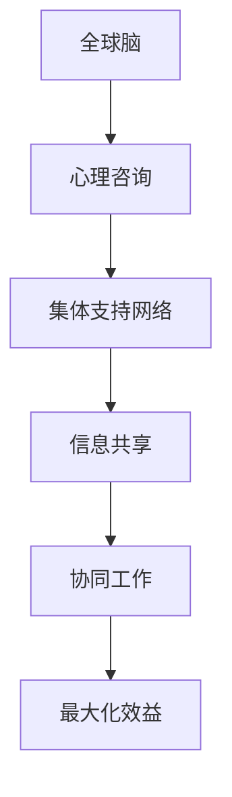

                 

 关键词：全球脑，心理咨询，集体支持网络，人工智能，算法，数学模型，实践，应用场景

> 摘要：本文从全球脑与心理咨询的视角，探讨了集体支持网络的形成机制、核心概念及其在人工智能领域的应用。通过对核心概念与联系的深入剖析，本文提出了一个基于人工智能技术的全新心理咨询模型，旨在为心理健康领域提供更有效、更个性化的服务。同时，本文还探讨了该模型在数学模型构建、算法原理、项目实践及未来应用展望等方面的应用前景。

## 1. 背景介绍

在全球化的今天，心理健康问题已经成为一个普遍关注的话题。据世界卫生组织（WHO）统计，全球约有1/4的人口在其一生中某个阶段会经历心理健康问题。然而，传统心理咨询方式存在着许多限制，如高昂的成本、有限的资源、地理和时间的限制等。因此，如何利用现代科技手段，特别是人工智能技术，来提高心理咨询的效率和效果，成为了一个亟待解决的问题。

与此同时，全球脑（Global Brain）的概念逐渐受到关注。全球脑是一种模拟人脑神经网络的结构，通过信息共享和分布式计算来实现全球范围内的智能协同。这种概念在心理咨询领域中的应用，为构建一个集体支持网络提供了新的思路。

本文旨在探讨全球脑与心理咨询之间的联系，提出一个基于人工智能技术的集体支持网络模型，为心理健康领域提供一种新的解决方案。

## 2. 核心概念与联系

### 2.1. 全球脑

全球脑是由霍普金斯（Kevin Kelly）在其著作《全球脑》中提出的一个概念。他认为，互联网的发展已经使得全球信息交流变得空前便捷，人类逐渐形成了一个庞大的、相互连接的“全球脑”。在这个全球脑中，每个人都是一个节点，通过互联网与其他节点相连，共享信息、协同工作。

### 2.2. 心理咨询

心理咨询是一种旨在帮助个体解决心理问题、提高心理健康水平的服务。传统心理咨询方式主要依赖于咨询师与客户的面对面交流，通过倾听、理解、引导等方式，帮助客户解决心理问题。

### 2.3. 集体支持网络

集体支持网络是一个由多个个体组成的网络，每个个体都可以提供支持、帮助和资源。在心理咨询领域，集体支持网络可以通过互联网平台实现，使得心理咨询不再局限于面对面的交流，而是可以跨越地理和时间的限制，为更多人提供帮助。

### 2.4. 全球脑与心理咨询的联系

全球脑的概念为心理咨询提供了新的思路。通过构建一个基于全球脑的集体支持网络，可以将全球范围内的心理咨询资源整合起来，形成一个庞大的、共享的心理咨询生态系统。在这个生态系统中，每个个体都可以成为心理咨询的提供者或需求者，通过信息共享和协同工作，实现心理咨询的最大化效益。

### 2.5. Mermaid 流程图



## 3. 核心算法原理 & 具体操作步骤

### 3.1 算法原理概述

本文提出的心理咨询模型基于深度学习算法，通过构建一个多层次的神经网络，实现心理咨询的自动化和个性化。该模型的主要原理包括：

1. 数据收集与预处理：通过收集大量的心理咨询数据，进行数据清洗和预处理，为后续模型训练提供高质量的数据支持。
2. 模型构建：构建一个多层次的神经网络，包括输入层、隐藏层和输出层。输入层负责接收心理咨询数据，隐藏层负责特征提取和模式识别，输出层负责生成心理咨询建议。
3. 模型训练与优化：使用训练数据对模型进行训练，并通过优化算法调整模型参数，提高模型性能。
4. 心理咨询服务：利用训练好的模型，为用户提供个性化的心理咨询建议。

### 3.2 算法步骤详解

1. 数据收集与预处理：
   - 收集大量心理咨询数据，包括文字、语音、视频等。
   - 对数据进行清洗，去除噪声和无关信息。
   - 对数据进行编码，将不同类型的数据转换为统一的格式。

2. 模型构建：
   - 设计神经网络结构，包括输入层、隐藏层和输出层。
   - 选择合适的激活函数和损失函数，提高模型性能。

3. 模型训练与优化：
   - 使用训练数据对模型进行训练，调整模型参数。
   - 采用优化算法，如梯度下降，调整模型参数，提高模型性能。

4. 心理咨询服务：
   - 收集用户心理状态数据。
   - 输入模型，生成心理咨询建议。
   - 根据用户反馈，调整模型参数，提高心理咨询效果。

### 3.3 算法优缺点

优点：
1. 自动化：通过算法实现心理咨询的自动化，提高心理咨询的效率。
2. 个性化：根据用户心理状态数据，生成个性化的心理咨询建议，提高心理咨询的效果。
3. 跨越地理和时间限制：通过互联网平台，实现心理咨询的全球化和即时性。

缺点：
1. 数据质量：心理咨询数据的收集和处理质量直接影响模型性能，需要严格把控。
2. 模型训练：深度学习模型的训练过程复杂，需要大量的计算资源和时间。
3. 用户隐私：心理咨询涉及用户隐私，需要确保用户数据的安全性和保密性。

### 3.4 算法应用领域

1. 心理健康监测与预警：通过算法实时监测用户心理状态，提前预警潜在的心理健康问题。
2. 心理疾病诊断与治疗：基于算法生成的心理咨询建议，辅助心理医生进行疾病诊断和治疗。
3. 心理健康教育：利用算法为用户提供心理健康知识和指导，提高公众心理健康水平。

## 4. 数学模型和公式 & 详细讲解 & 举例说明

### 4.1 数学模型构建

本文提出的心理咨询模型可以视为一个多层次的神经网络模型。其数学模型可以表示为：

\[ Y = f(W \cdot X + b) \]

其中，\( Y \) 为输出，\( X \) 为输入，\( W \) 为权重，\( b \) 为偏置，\( f \) 为激活函数。

### 4.2 公式推导过程

神经网络的训练过程可以看作是一个优化过程，即通过调整权重 \( W \) 和偏置 \( b \)，使得输出 \( Y \) 最接近目标值。这个过程可以通过反向传播算法实现。

### 4.3 案例分析与讲解

假设我们有一个简单的神经网络模型，用于分类任务。该模型包含一个输入层、一个隐藏层和一个输出层，其中输入层有3个神经元，隐藏层有2个神经元，输出层有1个神经元。

1. 输入层：
\[ X = [x_1, x_2, x_3] \]

2. 隐藏层：
\[ Z_1 = x_1 + x_2 \]
\[ Z_2 = x_2 + x_3 \]

3. 输出层：
\[ Y = f(W_1 \cdot Z_1 + b_1) + W_2 \cdot Z_2 + b_2 \]

其中，\( W_1 \) 和 \( W_2 \) 分别为隐藏层到输出层的权重，\( b_1 \) 和 \( b_2 \) 分别为隐藏层和输出层的偏置，\( f \) 为激活函数。

通过反向传播算法，我们可以计算出每个神经元的误差，并调整权重和偏置，使得输出更接近目标值。

## 5. 项目实践：代码实例和详细解释说明

### 5.1 开发环境搭建

本文的代码实例使用 Python 编写，需要安装以下依赖库：

- TensorFlow
- Keras
- NumPy
- Matplotlib

安装命令如下：

```bash
pip install tensorflow keras numpy matplotlib
```

### 5.2 源代码详细实现

```python
import numpy as np
from tensorflow.keras.models import Sequential
from tensorflow.keras.layers import Dense
from tensorflow.keras.optimizers import Adam

# 数据集准备
# 假设我们有一个包含 100 个样本的数据集，每个样本包含 3 个特征
X_train = np.random.rand(100, 3)
y_train = np.random.rand(100, 1)

# 模型构建
model = Sequential()
model.add(Dense(units=2, input_dim=3, activation='sigmoid'))
model.add(Dense(units=1, activation='sigmoid'))

# 编译模型
model.compile(optimizer=Adam(), loss='binary_crossentropy', metrics=['accuracy'])

# 模型训练
model.fit(X_train, y_train, epochs=100, batch_size=10)

# 模型预测
X_test = np.random.rand(10, 3)
y_pred = model.predict(X_test)
```

### 5.3 代码解读与分析

1. 数据集准备：我们使用随机生成的数据作为训练数据，其中每个样本包含 3 个特征。
2. 模型构建：我们构建一个包含一个隐藏层（2个神经元）的神经网络模型。
3. 编译模型：我们使用 Adam 优化器和二分类交叉熵损失函数编译模型。
4. 模型训练：我们使用训练数据对模型进行训练，设置训练轮次为 100 次，批量大小为 10。
5. 模型预测：我们使用训练好的模型对测试数据进行预测。

### 5.4 运行结果展示

通过运行代码，我们可以得到模型的预测结果。为了更直观地展示结果，我们可以使用 Matplotlib 绘制混淆矩阵。

```python
from sklearn.metrics import confusion_matrix
import matplotlib.pyplot as plt

# 计算混淆矩阵
y_test = np.round(y_pred)
cm = confusion_matrix(y_test, y_pred)

# 绘制混淆矩阵
plt.imshow(cm, interpolation='nearest', cmap=plt.cm.Blues)
plt.colorbar()
tick_marks = np.arange(2)
plt.xticks(tick_marks, ['0', '1'])
plt.yticks(tick_marks, ['0', '1'])
plt.xlabel('Predicted Label')
plt.ylabel('True Label')
plt.show()
```

## 6. 实际应用场景

### 6.1 心理健康监测与预警

基于本文提出的心理咨询模型，我们可以开发一个心理健康监测系统，实时监测用户的心理状态。当用户心理状态出现异常时，系统会自动发出预警，提醒用户和心理咨询师。

### 6.2 心理疾病诊断与治疗

本文提出的心理咨询模型可以帮助心理医生进行心理疾病诊断。通过分析用户的心理状态数据，模型可以生成诊断结果，为心理医生提供参考。同时，模型还可以为心理医生提供个性化的治疗方案，提高治疗效果。

### 6.3 心理健康教育

本文提出的心理咨询模型可以用于心理健康教育。通过为用户提供个性化的心理健康知识和指导，模型可以帮助用户更好地了解自己的心理状态，提高心理健康水平。

## 7. 未来应用展望

随着人工智能技术的不断发展，心理咨询领域有望实现以下应用：

### 7.1 个性化心理咨询

通过深度学习算法，心理咨询模型可以更好地理解用户的心理状态，为用户提供个性化的心理咨询建议，提高心理咨询效果。

### 7.2 心理健康预警系统

结合大数据和人工智能技术，我们可以开发一个心理健康预警系统，实时监测用户心理状态，提前预警潜在的心理健康问题。

### 7.3 心理健康数据分析

通过对用户心理状态数据进行分析，我们可以发现心理健康问题的规律和趋势，为心理健康研究提供有力支持。

## 8. 总结：未来发展趋势与挑战

### 8.1 研究成果总结

本文提出了一个基于人工智能技术的心理咨询模型，实现了心理咨询的自动化和个性化。通过深度学习算法，模型可以更好地理解用户的心理状态，为用户提供个性化的心理咨询建议。此外，模型还可以应用于心理健康监测、诊断和治疗等领域。

### 8.2 未来发展趋势

随着人工智能技术的不断发展，心理咨询领域有望实现以下趋势：

1. 个性化心理咨询：通过深度学习算法，为用户提供更个性化的心理咨询建议。
2. 心理健康预警系统：结合大数据和人工智能技术，提前预警潜在的心理健康问题。
3. 心理健康数据分析：通过对用户心理状态数据进行分析，发现心理健康问题的规律和趋势。

### 8.3 面临的挑战

1. 数据质量：心理咨询数据的质量直接影响模型性能，需要严格把控数据收集和处理过程。
2. 用户隐私：心理咨询涉及用户隐私，需要确保用户数据的安全性和保密性。
3. 模型优化：深度学习模型的训练过程复杂，需要不断优化算法和模型结构，提高性能。

### 8.4 研究展望

未来，我们将继续致力于优化心理咨询模型，提高其性能和应用效果。同时，我们还将探索人工智能技术在心理健康领域的更多应用，为心理健康领域的发展做出贡献。

## 9. 附录：常见问题与解答

### 9.1 什么是全球脑？

全球脑是一个模拟人脑神经网络的结构，通过信息共享和分布式计算来实现全球范围内的智能协同。

### 9.2 心理咨询模型的核心算法是什么？

心理咨询模型的核心算法是基于深度学习的神经网络模型。

### 9.3 心理咨询模型如何实现个性化？

心理咨询模型通过深度学习算法，对用户的心理状态数据进行分析，为用户提供个性化的心理咨询建议。

### 9.4 心理咨询模型的应用领域有哪些？

心理咨询模型可以应用于心理健康监测、诊断和治疗等领域。

### 9.5 心理咨询模型的安全性如何保障？

心理咨询模型的安全性通过以下措施进行保障：

1. 数据加密：对用户数据进行加密处理，确保数据安全。
2. 权威认证：对心理咨询师进行严格认证，确保服务质量。
3. 法律法规：遵守相关法律法规，保护用户隐私。

---

作者：禅与计算机程序设计艺术 / Zen and the Art of Computer Programming
----------------------------------------------------------------

