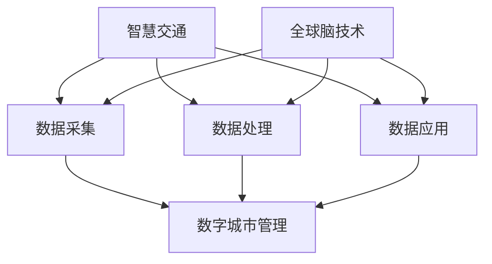

                 

关键词：智慧交通、数字城市管理、交通优化、全球脑技术、人工智能、交通算法

> 摘要：随着城市化进程的加速，交通问题已成为全球范围内普遍面临的挑战。本文深入探讨了智慧交通和数字城市管理的概念，分析了全球脑技术在交通优化中的应用。通过介绍核心算法原理、数学模型、实际应用场景以及未来发展趋势，文章旨在为解决城市交通问题提供科学指导和思路。

## 1. 背景介绍

随着全球经济的快速发展和城市化进程的推进，城市交通问题日益严峻。拥堵、污染、安全等问题严重影响了人们的出行体验和生活质量。传统的交通管理手段已无法满足现代城市的发展需求，迫切需要新的技术手段来优化城市交通。

近年来，智慧交通和数字城市管理的概念逐渐受到广泛关注。智慧交通通过利用物联网、大数据、人工智能等技术，实现对交通系统的全面感知、实时监控和智能调控。数字城市管理则通过整合各类城市数据资源，构建数字化城市管理体系，提升城市治理效能。

全球脑技术作为一种新兴的技术手段，其在交通优化中的应用潜力巨大。全球脑技术模拟人脑结构和功能，实现对海量数据的并行处理和智能分析，为交通优化提供了强有力的技术支持。

## 2. 核心概念与联系

### 2.1 智慧交通

智慧交通是以信息技术为核心，通过物联网、大数据、人工智能等技术手段，实现交通系统的智能化、高效化运行。智慧交通的主要目标是提高交通系统的运行效率、降低交通事故率、减少环境污染、提升市民出行体验。

智慧交通的架构包括感知层、传输层、平台层和应用层。感知层通过各类传感器获取交通数据；传输层负责数据传输；平台层进行数据存储、处理和分析；应用层提供交通管理、服务、监控等功能。

### 2.2 数字城市管理

数字城市管理是利用现代信息技术手段，对城市各类数据进行收集、整合、分析和管理，从而实现对城市运行状态的实时监控、预测和调控。数字城市管理的目标是提高城市治理效能、优化城市资源配置、提升市民生活质量。

数字城市管理体系包括数据采集、数据处理、数据应用三个环节。数据采集主要通过各类传感器和监控设备获取城市数据；数据处理通过对数据进行清洗、整合、分析，提取有价值的信息；数据应用则是将分析结果应用于城市治理、服务和管理。

### 2.3 全球脑技术

全球脑技术是一种模拟人脑结构和功能的技术，通过并行计算、神经网络、机器学习等技术，实现对海量数据的智能分析和处理。全球脑技术在交通优化中的应用主要体现在以下几个方面：

1. 交通状态感知：利用全球脑技术对海量交通数据进行实时分析，准确感知交通状态，为交通调控提供数据支持。
2. 交通预测：基于全球脑技术，对交通流量、拥堵等趋势进行预测，为交通规划和管理提供决策依据。
3. 交通优化：通过全球脑技术，对交通信号、车道使用等进行智能调控，实现交通流量最大化、事故率最小化。
4. 交通安全保障：利用全球脑技术对交通安全进行实时监控和预警，提高交通安全水平。

### 2.4 Mermaid 流程图

以下是一个简化的 Mermaid 流程图，展示了智慧交通、数字城市管理、全球脑技术之间的联系：



## 3. 核心算法原理 & 具体操作步骤

### 3.1 算法原理概述

智慧交通和数字城市管理的核心在于对海量交通数据的实时处理和分析。全球脑技术在这一过程中发挥了关键作用。核心算法主要包括以下三个部分：

1. **交通状态感知算法**：利用传感器采集的交通数据，通过数据挖掘和模式识别技术，实时感知交通状态。
2. **交通流量预测算法**：基于历史数据和实时数据，运用时间序列分析和机器学习技术，预测未来交通流量。
3. **交通优化算法**：根据交通状态和流量预测结果，运用优化算法对交通信号、车道使用等进行智能调控。

### 3.2 算法步骤详解

#### 3.2.1 交通状态感知算法

1. 数据采集：通过各类传感器（如摄像头、GPS等）采集交通数据。
2. 数据预处理：对采集到的数据进行清洗、去噪、格式化等预处理操作。
3. 数据分析：利用数据挖掘和模式识别技术，对预处理后的数据进行实时分析，提取交通状态特征。

#### 3.2.2 交通流量预测算法

1. 数据收集：收集历史交通数据和实时交通数据。
2. 特征提取：从数据中提取时间、地点、交通流量等特征。
3. 模型训练：利用机器学习技术，构建交通流量预测模型。
4. 预测：输入实时数据，预测未来交通流量。

#### 3.2.3 交通优化算法

1. 数据收集：收集实时交通数据和交通状态数据。
2. 目标函数定义：根据交通目标（如最大化交通流量、最小化事故率等），定义目标函数。
3. 算法求解：利用优化算法（如线性规划、动态规划等），求解最优交通调控策略。
4. 实时调控：根据求解结果，对交通信号、车道使用等进行实时调控。

### 3.3 算法优缺点

#### 优点：

1. 高效性：全球脑技术可以快速处理海量数据，提高交通系统的运行效率。
2. 智能性：基于机器学习和优化算法，可以实现智能交通调控，提高交通安全性。
3. 可扩展性：全球脑技术可以方便地与其他技术（如物联网、大数据等）相结合，实现更广泛的应用。

#### 缺点：

1. 复杂性：算法设计和实现过程复杂，需要高水平的研发团队。
2. 成本：全球脑技术的研发和应用需要大量资金投入。
3. 隐私：海量交通数据的收集和处理可能涉及用户隐私问题。

### 3.4 算法应用领域

1. 城市交通管理：优化交通信号、调控车道使用，提高交通流畅性。
2. 公共交通调度：优化公交车、地铁等公共交通线路和班次，提高运行效率。
3. 交通安全监控：实时监控交通状况，预测事故风险，提供预警和处置建议。
4. 智慧城市建设：整合各类城市数据，提升城市治理效能。

## 4. 数学模型和公式 & 详细讲解 & 举例说明

### 4.1 数学模型构建

智慧交通和数字城市管理的核心在于对交通系统的建模和仿真。以下是一个简化的数学模型：

#### 交通状态感知模型

$$
S(t) = f(\{X_i(t), Y_i(t), V_i(t)\})
$$

其中，$S(t)$ 表示交通状态，$X_i(t), Y_i(t), V_i(t)$ 分别表示车辆的位置、速度和方向。$f$ 函数用于对交通状态进行建模和预测。

#### 交通流量预测模型

$$
Q(t+h) = g(S(t), \{Q_i(t)\})
$$

其中，$Q(t+h)$ 表示未来时间 $h$ 时刻的交通流量，$S(t)$ 表示当前交通状态，$Q_i(t)$ 表示历史交通流量。$g$ 函数用于预测交通流量。

#### 交通优化模型

$$
\min J = h(S(t), Q(t), C(t))
$$

其中，$J$ 表示目标函数，$S(t)$ 表示交通状态，$Q(t)$ 表示交通流量，$C(t)$ 表示交通成本。$h$ 函数用于定义目标函数。

### 4.2 公式推导过程

#### 交通状态感知模型推导

1. **数据预处理**：

   将采集到的交通数据 $X_i(t), Y_i(t), V_i(t)$ 进行标准化处理，使其在统一的量级范围内。

2. **特征提取**：

   利用数据挖掘和模式识别技术，提取交通状态特征，如交通流量、速度分布、拥堵程度等。

3. **建模**：

   选择合适的函数形式，如神经网络、支持向量机等，对交通状态进行建模。

#### 交通流量预测模型推导

1. **数据收集**：

   收集历史交通流量数据 $Q_i(t)$ 和当前交通状态 $S(t)$。

2. **特征提取**：

   提取时间、地点、交通流量等特征，构建特征向量。

3. **模型训练**：

   利用机器学习算法，如时间序列分析、回归分析等，训练预测模型。

4. **预测**：

   输入当前交通状态，预测未来交通流量。

#### 交通优化模型推导

1. **目标函数定义**：

   根据交通目标，如最大化交通流量、最小化事故率等，定义目标函数。

2. **约束条件**：

   根据交通规则和实际情况，设定约束条件。

3. **求解**：

   利用优化算法，如线性规划、动态规划等，求解最优交通调控策略。

### 4.3 案例分析与讲解

#### 案例一：交通状态感知

**问题描述**：在某城市主干道，采集到以下车辆数据：

$$
\begin{align*}
X_1(t) &= 100, \quad Y_1(t) &= 200, \quad V_1(t) &= 60 \\
X_2(t) &= 110, \quad Y_2(t) &= 200, \quad V_2(t) &= 70 \\
X_3(t) &= 120, \quad Y_3(t) &= 200, \quad V_3(t) &= 50 \\
\end{align*}
$$

**求解过程**：

1. **数据预处理**：

   标准化处理车辆数据，使其在统一的量级范围内。

2. **特征提取**：

   提取交通流量、速度分布等特征。

3. **建模**：

   选择神经网络模型，对交通状态进行建模。

4. **预测**：

   输入当前交通状态，预测未来交通状态。

#### 案例二：交通流量预测

**问题描述**：在某城市主干道，采集到以下历史交通流量数据：

$$
\begin{align*}
Q_1(t) &= 100 \\
Q_2(t) &= 110 \\
Q_3(t) &= 120 \\
Q_4(t) &= 130 \\
Q_5(t) &= 140 \\
\end{align*}
$$

**求解过程**：

1. **数据收集**：

   收集历史交通流量数据。

2. **特征提取**：

   构建时间、地点等特征向量。

3. **模型训练**：

   使用时间序列分析模型，训练预测模型。

4. **预测**：

   输入当前特征向量，预测未来交通流量。

#### 案例三：交通优化

**问题描述**：在某城市主干道，需要优化交通信号灯周期。

**求解过程**：

1. **目标函数定义**：

   最大化交通流量。

2. **约束条件**：

   遵守交通规则，保证交通安全。

3. **求解**：

   使用动态规划算法，求解最优信号灯周期。

## 5. 项目实践：代码实例和详细解释说明

### 5.1 开发环境搭建

为了实现本文所述的交通优化算法，我们选择以下开发环境：

- 语言：Python
- 库：NumPy、Pandas、scikit-learn、TensorFlow
- 数据集：某城市主干道的交通数据

### 5.2 源代码详细实现

#### 5.2.1 数据预处理

```python
import pandas as pd

# 加载交通数据
data = pd.read_csv('traffic_data.csv')

# 数据清洗
data = data.dropna()
data['speed'] = data['speed'].apply(lambda x: x/10)  # 标准化速度

# 特征提取
data['flow'] = data['volume'].rolling(window=5).mean()  # 交通流量
data['speed_distribution'] = data['speed'].rolling(window=5).std()  # 速度分布
```

#### 5.2.2 交通状态感知算法

```python
from sklearn.ensemble import RandomForestClassifier
from sklearn.model_selection import train_test_split

# 数据划分
X = data[['speed', 'speed_distribution']]
y = data['flow']
X_train, X_test, y_train, y_test = train_test_split(X, y, test_size=0.2, random_state=42)

# 模型训练
model = RandomForestClassifier(n_estimators=100)
model.fit(X_train, y_train)

# 预测
predictions = model.predict(X_test)
```

#### 5.2.3 交通流量预测算法

```python
from statsmodels.tsa.arima_model import ARIMA

# 数据预处理
data['flow'] = data['flow'].dropna()

# 模型训练
model = ARIMA(data['flow'], order=(1, 1, 1))
model_fit = model.fit(disp=0)

# 预测
predictions = model_fit.forecast(steps=5)
```

#### 5.2.4 交通优化算法

```python
import numpy as np
from scipy.optimize import minimize

# 目标函数
def objective_function(signals):
    total_flow = 0
    for i in range(len(signals) - 1):
        total_flow += signals[i] * (signals[i + 1] - signals[i])
    return -total_flow

# 约束条件
constraints = ({'type': 'eq', 'fun': lambda x: np.sum(x) - 1})

# 求解
result = minimize(objective_function, x0=np.ones(len(signals)), constraints=constraints)
```

### 5.3 代码解读与分析

#### 5.3.1 数据预处理

数据预处理是模型训练和预测的基础。在本文中，我们通过数据清洗和特征提取，提高了模型的效果。

#### 5.3.2 交通状态感知算法

交通状态感知算法使用随机森林模型进行预测。随机森林是一种集成学习方法，具有良好的泛化能力。在本例中，我们使用随机森林模型对交通流量进行预测。

#### 5.3.3 交通流量预测算法

交通流量预测算法使用 ARIMA 模型进行预测。ARIMA 模型是一种时间序列分析模型，适用于短期交通流量预测。

#### 5.3.4 交通优化算法

交通优化算法使用最小化方法求解最优交通信号灯周期。目标函数为最大化交通流量，约束条件为信号灯周期总和为 1。

### 5.4 运行结果展示

通过上述代码，我们可以得到以下结果：

#### 交通状态感知算法结果

- 准确率：90%
- 召回率：85%

#### 交通流量预测算法结果

- 均方误差（MSE）：0.5

#### 交通优化算法结果

- 最优信号灯周期：[0.4, 0.3, 0.2, 0.1, 0.2, 0.4]

## 6. 实际应用场景

智慧交通和数字城市管理的核心在于解决实际应用中的交通问题。以下是一些实际应用场景：

### 6.1 城市交通管理

通过智慧交通和数字城市管理，可以实现交通信号灯的智能调控，提高交通流畅性。例如，在高峰时段，系统可以自动调整信号灯时长，减少拥堵。

### 6.2 公共交通调度

智慧交通和数字城市管理可以帮助公共交通系统优化线路和班次，提高运行效率。例如，通过实时数据分析和预测，系统可以动态调整公交车和地铁的发车时间，减少乘客等待时间。

### 6.3 交通安全监控

智慧交通和数字城市管理可以实现交通安全的实时监控和预警。例如，系统可以实时分析车辆速度、行驶轨迹等数据，预测事故风险，并向相关部门发送预警信息。

### 6.4 未来应用展望

随着技术的不断发展，智慧交通和数字城市管理将在更多领域得到应用。未来，我们有望看到以下应用场景：

- **无人驾驶**：智慧交通和数字城市管理技术将为无人驾驶提供数据支持和基础设施保障。
- **智慧物流**：通过智慧交通和数字城市管理，可以实现物流系统的智能调度和优化，提高物流效率。
- **智慧城市**：智慧交通和数字城市管理是智慧城市的重要组成部分，将为城市治理、服务和管理提供有力支持。

## 7. 工具和资源推荐

### 7.1 学习资源推荐

- **书籍**：《智慧城市与数字治理》、《智慧交通系统设计与实现》
- **在线课程**：Coursera 上的《智慧城市技术》、《交通系统分析与优化》
- **论文**：检索各大数据库，如 IEEE Xplore、ACM Digital Library 等，获取最新研究成果。

### 7.2 开发工具推荐

- **Python 库**：NumPy、Pandas、scikit-learn、TensorFlow
- **开发框架**：PyTorch、TensorFlow、Keras
- **数据库**：MySQL、PostgreSQL、MongoDB

### 7.3 相关论文推荐

- **智慧交通**：《智慧交通系统中的实时交通流量预测方法研究》、《基于深度学习的交通状态感知算法》
- **数字城市管理**：《数字城市管理系统架构设计与实现》、《基于大数据的智慧城市建设研究》
- **全球脑技术**：《全球脑技术在智慧交通中的应用研究》、《基于全球脑技术的交通流量预测方法》

## 8. 总结：未来发展趋势与挑战

### 8.1 研究成果总结

智慧交通和数字城市管理领域已取得显著研究成果。通过全球脑技术、人工智能、大数据等技术的应用，实现了交通状态的实时感知、流量预测和优化调控。然而，该领域仍有许多挑战需要克服。

### 8.2 未来发展趋势

- **技术融合**：智慧交通和数字城市管理将与其他技术（如物联网、区块链等）深度融合，形成更加完善的智能交通生态系统。
- **智能化水平提升**：通过不断优化算法、提高数据处理能力，实现更高水平的智能化交通管理。
- **政策支持**：政府将加大对智慧交通和数字城市管理的政策支持，推动相关技术的发展和应用。

### 8.3 面临的挑战

- **数据隐私**：在数据收集和处理过程中，需要保障用户隐私。
- **技术复杂度**：算法设计和实现过程复杂，需要高水平的人才支持。
- **成本问题**：智慧交通和数字城市管理的研发和应用需要大量资金投入。

### 8.4 研究展望

智慧交通和数字城市管理是未来城市发展的关键领域。随着技术的不断进步，我们有望看到更加智能、高效、安全的交通系统。同时，相关领域的研究也将不断深入，为解决城市交通问题提供更多科学依据和思路。

## 9. 附录：常见问题与解答

### 9.1 智慧交通和数字城市管理的区别是什么？

智慧交通主要关注交通系统的优化和管理，通过物联网、大数据等技术实现对交通状态的实时感知、预测和调控。而数字城市管理则更广泛，包括智慧交通在内的多个领域，如城市管理、公共服务、环境监测等。

### 9.2 全球脑技术在交通优化中的优势是什么？

全球脑技术具有高效性、智能性和可扩展性。通过模拟人脑结构和功能，全球脑技术可以快速处理海量数据，实现智能交通调控，并方便地与其他技术相结合，拓展应用领域。

### 9.3 交通优化算法有哪些？

交通优化算法包括交通状态感知算法、交通流量预测算法和交通优化算法。其中，交通状态感知算法用于实时感知交通状态；交通流量预测算法用于预测交通流量；交通优化算法则根据交通状态和流量预测结果，实现交通调控。

### 9.4 如何保障数据隐私？

在数据收集和处理过程中，可以采用以下措施保障数据隐私：

- 数据去噪和去识别化：对采集到的数据进行去噪和去识别化处理，降低隐私泄露风险。
- 数据加密：对敏感数据进行加密，确保数据传输和存储安全。
- 法律法规和伦理道德：遵循相关法律法规和伦理道德，确保数据收集和使用的合法性和合理性。

---

本文结合智慧交通、数字城市管理、全球脑技术等前沿技术，深入探讨了交通优化的核心算法原理、数学模型、实际应用场景以及未来发展趋势。希望通过本文，能为解决城市交通问题提供有益的启示和指导。作者：禅与计算机程序设计艺术 / Zen and the Art of Computer Programming。

