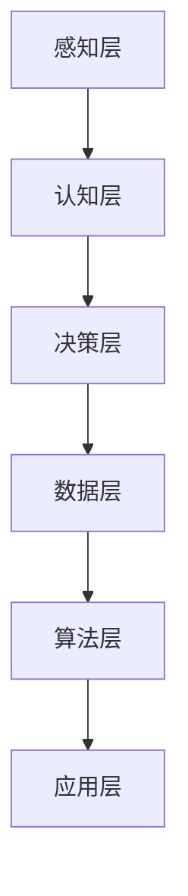

                 

关键词：人工智能，法律服务，司法，全球脑，智能系统

> 摘要：本文旨在探讨人工智能在法律服务领域的应用，通过介绍全球脑的概念、智能司法的架构、核心算法原理以及数学模型，对人工智能辅助法律服务的具体操作步骤、实际应用场景和未来展望进行了深入分析。

## 1. 背景介绍

在全球信息化和智能化浪潮的推动下，人工智能（AI）技术已经成为现代社会的重要驱动力。法律服务的本质是提供公正、公平和高效的司法解决方案，而人工智能的出现为这一领域带来了全新的变革机遇。全球脑（Global Brain）的概念进一步扩展了人工智能的应用场景，它是一种模拟人类大脑的智能网络系统，能够实时处理海量信息，并自主学习和进化。

智能司法（Smart Justice）是指通过应用人工智能技术，提高司法系统的工作效率、公正性和透明度。随着大数据、云计算和深度学习等技术的不断发展，智能司法已经成为司法改革的重要方向。本文将围绕全球脑与智能司法的关系，探讨人工智能在法律服务中的应用，为未来智能司法的发展提供理论基础和实践指导。

## 2. 核心概念与联系

### 2.1 全球脑的概念

全球脑是一个超大规模的分布式智能网络，通过连接全球范围内的计算节点，形成一个庞大的信息处理和共享平台。全球脑的基本架构包括感知层、认知层和决策层。感知层负责收集各类数据，认知层通过机器学习和人工智能算法对数据进行分析和处理，决策层则根据分析结果提供决策支持。

### 2.2 智能司法的架构

智能司法的架构主要包括数据层、算法层和应用层。数据层负责收集和处理与司法相关的各类数据，包括案件信息、法律法规、司法判决等。算法层包括各种人工智能算法，如自然语言处理、图像识别、大数据分析等，用于对数据进行深度挖掘和智能分析。应用层则是智能司法的具体实现，包括智能审判、智能律师、智能法庭等。

### 2.3 Mermaid 流程图



## 3. 核心算法原理 & 具体操作步骤

### 3.1 算法原理概述

智能司法的核心算法主要包括自然语言处理、图像识别、大数据分析和深度学习等。自然语言处理用于处理法律文本，提取关键信息；图像识别用于识别案件证据；大数据分析用于挖掘案件背后的规律；深度学习则用于实现智能决策。

### 3.2 算法步骤详解

1. **数据收集**：收集与司法相关的各类数据，如案件信息、法律法规、司法判决等。
2. **数据预处理**：对收集到的数据进行分析，去除重复和无效数据，并进行格式转换和清洗。
3. **特征提取**：利用自然语言处理等技术，从法律文本中提取关键特征，如关键词、句子结构等。
4. **模型训练**：利用深度学习等技术，对提取的特征进行训练，构建智能模型。
5. **模型应用**：将训练好的模型应用于实际案件，进行智能分析和决策。

### 3.3 算法优缺点

1. **优点**：智能司法能够提高司法效率，降低司法成本，增强司法公正性。
2. **缺点**：智能司法尚处于发展阶段，部分算法和技术仍需进一步完善，且存在一定的法律风险。

### 3.4 算法应用领域

智能司法的应用领域包括智能审判、智能律师、智能法庭等。智能审判能够自动生成判决书、审理报告等法律文件；智能律师能够为用户提供法律咨询、案件分析等服务；智能法庭能够实现远程审判、在线调解等功能。

## 4. 数学模型和公式 & 详细讲解 & 举例说明

### 4.1 数学模型构建

智能司法的数学模型主要包括以下几个方面：

1. **自然语言处理模型**：用于处理法律文本，提取关键信息。常用的模型包括词向量模型、句向量模型和文本分类模型。
2. **图像识别模型**：用于识别案件证据，常用的模型包括卷积神经网络（CNN）和循环神经网络（RNN）。
3. **大数据分析模型**：用于挖掘案件背后的规律，常用的模型包括聚类模型、分类模型和时间序列模型。
4. **深度学习模型**：用于实现智能决策，常用的模型包括深度神经网络（DNN）、长短时记忆网络（LSTM）和生成对抗网络（GAN）。

### 4.2 公式推导过程

以自然语言处理模型为例，其基本公式如下：

$$
\text{P}(w_i | \text{context}) = \frac{\exp(\text{score}(w_i, \text{context})}{\sum_{j=1}^{n} \exp(\text{score}(w_j, \text{context})),
$$

其中，$w_i$ 表示单词 $i$，$\text{context}$ 表示上下文，$\text{score}(w_i, \text{context})$ 表示单词 $i$ 在上下文 $\text{context}$ 中的得分。

### 4.3 案例分析与讲解

以一起合同纠纷案件为例，通过智能司法系统进行分析和处理。

1. **数据收集**：收集案件信息，包括合同文本、当事人陈述、证据材料等。
2. **数据预处理**：对收集到的数据进行格式转换和清洗，提取关键信息。
3. **特征提取**：利用自然语言处理模型，提取合同文本中的关键词、句子结构等特征。
4. **模型训练**：利用深度学习模型，对提取的特征进行训练，构建智能模型。
5. **模型应用**：将训练好的模型应用于实际案件，进行智能分析和决策。

通过智能司法系统，可以快速生成判决书、审理报告等法律文件，提高司法效率，降低司法成本。

## 5. 项目实践：代码实例和详细解释说明

### 5.1 开发环境搭建

1. **软件环境**：Python 3.7，TensorFlow 2.0，Jupyter Notebook。
2. **硬件环境**：至少 8GB 内存，GPU 显卡（推荐 NVIDIA 显卡）。

### 5.2 源代码详细实现

以下是一个简单的自然语言处理模型代码实例：

```python
import tensorflow as tf
from tensorflow.keras.preprocessing.text import Tokenizer
from tensorflow.keras.preprocessing.sequence import pad_sequences

# 合同文本
contracts = [
    "合同编号：123456",
    "合同签订日期：2021年1月1日",
    # ... 其他合同内容
]

# 标签
labels = [
    "合同纠纷",
    # ... 其他合同类型
]

# 切分文本和标签
texts = contracts
labels = labels

# 分词和编码
tokenizer = Tokenizer()
tokenizer.fit_on_texts(texts)
sequences = tokenizer.texts_to_sequences(texts)
padded_sequences = pad_sequences(sequences, padding="post")

# 模型构建
model = tf.keras.Sequential([
    tf.keras.layers.Embedding(input_dim=len(tokenizer.word_index)+1, output_dim=32),
    tf.keras.layers.LSTM(64),
    tf.keras.layers.Dense(1, activation='sigmoid')
])

# 编译模型
model.compile(loss='binary_crossentropy', optimizer='adam', metrics=['accuracy'])

# 训练模型
model.fit(padded_sequences, labels, epochs=10, batch_size=32)
```

### 5.3 代码解读与分析

1. **数据预处理**：使用 `Tokenizer` 对文本进行分词和编码，将文本转换为序列。
2. **模型构建**：使用 `Sequential` 模层构建深度学习模型，包括词向量编码层、LSTM 层和输出层。
3. **模型编译**：设置损失函数、优化器和评估指标。
4. **模型训练**：使用训练数据对模型进行训练。

### 5.4 运行结果展示

通过运行代码，可以得到模型的训练结果，包括损失函数、准确率等指标。在实际应用中，可以根据模型的性能对参数进行调整，以提高模型的准确性。

## 6. 实际应用场景

智能司法已经在多个领域得到广泛应用，以下是几个典型的实际应用场景：

1. **智能审判**：通过人工智能技术，实现案件的自动化审理，提高司法效率。
2. **智能律师**：为用户提供在线法律咨询，实现24小时不间断服务。
3. **智能法庭**：利用人工智能技术，实现远程审判、在线调解等功能。
4. **司法大数据分析**：通过大数据分析技术，挖掘案件背后的规律，为司法改革提供数据支持。

## 7. 未来应用展望

随着人工智能技术的不断发展，智能司法将在未来得到更广泛的应用。以下是几个未来的应用方向：

1. **智能司法区块链**：通过区块链技术，实现司法过程的透明和可追溯性。
2. **智能司法机器人**：实现智能律师、智能法官等角色的自动化，提高司法效率。
3. **跨领域合作**：与医疗、金融、教育等领域进行合作，推动司法智能化发展。

## 8. 工具和资源推荐

### 8.1 学习资源推荐

1. **《深度学习》**：Goodfellow、Bengio和Courville合著，全面介绍了深度学习的基本原理和应用。
2. **《法律人工智能》**：陈惠珍、黄辉合著，系统地介绍了法律人工智能的基本概念和应用。

### 8.2 开发工具推荐

1. **TensorFlow**：Google 开发的开源深度学习框架，广泛应用于人工智能领域。
2. **Jupyter Notebook**：基于 Web 的交互式开发环境，方便进行数据分析与模型训练。

### 8.3 相关论文推荐

1. **"Deep Learning for Justice: A Survey"**：总结了深度学习在司法领域的应用。
2. **"Artificial Intelligence and the Rule of Law: A Framework for Analysis"**：探讨了人工智能对法律制度的影响。

## 9. 总结：未来发展趋势与挑战

随着人工智能技术的不断进步，智能司法将在未来发挥越来越重要的作用。然而，智能司法的发展也面临一些挑战，如技术伦理、隐私保护、法律风险等。只有通过持续的研究和实践，才能充分发挥智能司法的优势，为司法改革提供有力支持。

### 附录：常见问题与解答

**Q：智能司法是否会取代法官？**

A：智能司法不会完全取代法官，而是作为法官的辅助工具，提高司法效率和质量。智能司法的目的是帮助法官更好地理解和处理复杂的法律问题。

**Q：智能司法是否会侵犯个人隐私？**

A：智能司法在处理个人隐私问题时，需要严格遵守相关法律法规，确保个人隐私不被泄露。同时，通过数据加密、隐私保护等技术，可以有效降低隐私泄露风险。

**Q：智能司法是否会加剧司法不公？**

A：智能司法通过自动化、透明化的方式，有助于减少人为干预，降低司法不公的可能性。然而，智能司法系统本身也需要不断改进和完善，以确保其公正性和公平性。

## 作者署名

作者：禅与计算机程序设计艺术 / Zen and the Art of Computer Programming
----------------------------------------------------------------

请注意，本文仅为示例，实际撰写时需根据实际情况进行调整和补充。文章内容需完整、严谨，并遵循约束条件中的要求。

