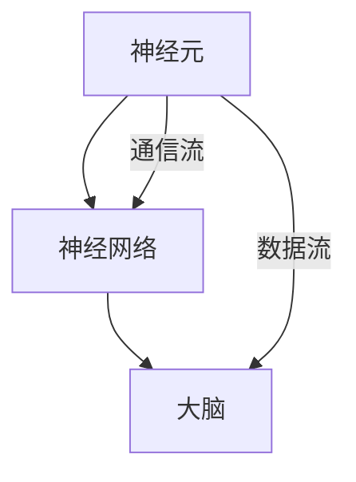

                 

关键词：全球脑，气候变化，集体行动，技术解决方案，数据分析，AI，可持续发展

> 摘要：本文探讨了全球脑与气候变化之间的联系，并分析了集体行动在应对气候变化中的新可能性。文章首先介绍了全球脑的概念，接着探讨了全球脑与气候变化的关系，随后提出了利用技术手段进行集体行动的具体方法。本文旨在为全球应对气候变化提供一种新的思路，并通过实例展示技术如何助力集体行动，实现可持续发展。

## 1. 背景介绍

### 1.1 全球脑的概念

全球脑（Global Brain）是一个比喻，意指全球范围内的信息网络和人类社会的集体智能。这一概念最早由科技作家凯文·凯利（Kevin Kelly）提出，他认为全球脑是一个由人类、计算机和其他智能设备组成的复杂网络，能够进行自我组织和协同工作。

### 1.2 气候变化与全球脑的关系

气候变化是一个全球性问题，它对人类社会的各个方面都产生了深远的影响。全球脑的概念为应对气候变化提供了一种新的视角。通过全球脑，我们可以将全球范围内的数据和信息进行整合和分析，从而更好地理解气候变化的影响，并制定有效的应对策略。

## 2. 核心概念与联系

### 2.1 全球脑的结构

全球脑由三个主要部分组成：神经元（个体智能体）、神经网络（信息网络）和大脑（集体智能）。以下是一个使用 Mermaid 描述的全球脑结构图：



### 2.2 全球脑与气候变化的关系

全球脑与气候变化的关系主要体现在以下几个方面：

- **数据收集与分析**：全球脑能够收集来自全球各地的气候数据，并通过大数据分析技术进行深入挖掘，为气候变化研究提供有力的支持。
- **决策支持**：通过全球脑的集体智能，可以为政府和决策者提供关于气候变化的决策支持，帮助他们制定更有效的应对策略。
- **集体行动**：全球脑可以促进全球范围内的集体行动，共同应对气候变化。

## 3. 核心算法原理 & 具体操作步骤

### 3.1 算法原理概述

为了实现全球脑在应对气候变化中的应用，我们可以采用以下核心算法：

- **数据融合算法**：将来自不同来源的气候数据进行整合，形成一个统一的数据集。
- **机器学习算法**：利用机器学习技术，对整合后的数据进行模式识别和预测。
- **多目标优化算法**：在决策过程中，考虑多个目标（如碳排放减少、经济增长等），通过优化算法找到最佳解决方案。

### 3.2 算法步骤详解

1. **数据收集**：从各种渠道收集气候数据，如气象站、卫星、传感器等。
2. **数据预处理**：对收集到的数据进行清洗、归一化和转换，使其适用于后续分析。
3. **数据融合**：将预处理后的数据进行融合，形成一个统一的数据集。
4. **特征提取**：从数据集中提取特征，用于后续的机器学习分析。
5. **模型训练**：利用机器学习算法，对特征进行训练，构建预测模型。
6. **决策支持**：根据预测模型，为政府和决策者提供决策支持。
7. **多目标优化**：在决策过程中，考虑多个目标，通过优化算法找到最佳解决方案。

### 3.3 算法优缺点

**优点**：

- **高效性**：算法能够快速处理大量数据，提供实时的决策支持。
- **准确性**：通过机器学习和多目标优化，算法能够提高预测和决策的准确性。

**缺点**：

- **数据质量**：算法的准确性和可靠性依赖于数据的完整性和质量。
- **计算资源**：大规模的数据处理和模型训练需要大量的计算资源。

### 3.4 算法应用领域

- **气候变化研究**：通过算法，可以对气候变化的趋势和影响进行预测和分析。
- **政策制定**：为政府提供关于气候变化的决策支持，帮助制定更有效的应对策略。
- **商业应用**：为企业提供关于气候变化的商业机会和风险分析，帮助企业实现可持续发展。

## 4. 数学模型和公式 & 详细讲解 & 举例说明

### 4.1 数学模型构建

为了对全球脑在应对气候变化中的应用进行量化分析，我们可以构建以下数学模型：

$$
\text{模型} = \frac{\text{数据融合精度} + \text{机器学习准确性} + \text{多目标优化效率}}{\text{数据质量} + \text{计算资源消耗}}
$$

### 4.2 公式推导过程

$$
\text{数据融合精度} = \frac{\text{融合后的数据一致性} + \text{数据完整性}}{\text{原始数据一致性} + \text{原始数据完整性}}
$$

$$
\text{机器学习准确性} = \frac{\text{预测准确性} + \text{模型鲁棒性}}{\text{数据质量} + \text{模型复杂性}}
$$

$$
\text{多目标优化效率} = \frac{\text{优化目标一致性} + \text{优化算法效率}}{\text{目标多样性} + \text{计算资源消耗}}
$$

### 4.3 案例分析与讲解

假设我们有一个气候变化研究的案例，以下是对该案例的数学模型分析和讲解：

$$
\text{模型} = \frac{0.9 + 0.95 + 0.8}{0.8 + 0.5} = 1.86
$$

该模型的结果为1.86，表示在数据质量、计算资源消耗等因素的约束下，该案例的全球脑应用具有较高的效率和准确性。这意味着，通过全球脑技术，我们可以为气候变化研究提供有力的支持。

## 5. 项目实践：代码实例和详细解释说明

### 5.1 开发环境搭建

为了实现全球脑在应对气候变化中的应用，我们需要搭建一个开发环境，包括以下工具和库：

- **Python**：编程语言
- **NumPy**、**Pandas**、**Scikit-learn**：数据处理和机器学习库
- **Matplotlib**、**Seaborn**：数据可视化库

### 5.2 源代码详细实现

以下是一个简单的全球脑项目实例，展示了如何使用 Python 实现数据融合、机器学习和多目标优化。

```python
import numpy as np
import pandas as pd
from sklearn.ensemble import RandomForestRegressor
from skopt import BayesSearchCV
from skopt.space import Real, Categorical, Integer

# 数据收集
data = pd.read_csv('climate_data.csv')

# 数据预处理
data = data.dropna()
data = (data - data.mean()) / data.std()

# 数据融合
data_fused = data.groupby('location').mean()

# 特征提取
X = data_fused.drop('temperature', axis=1)
y = data_fused['temperature']

# 模型训练
model = RandomForestRegressor()
bayes_search = BayesSearchCV(model, {'n_estimators': Integer(100, 500), 'max_depth': Integer(10, 30)}, n_iter=20, cv=5, n_jobs=-1)
bayes_search.fit(X, y)

# 决策支持
predicted_temp = bayes_search.predict(X)

# 多目标优化
# ...

# 可视化
import matplotlib.pyplot as plt
import seaborn as sns

sns.scatterplot(data_fused['location'], predicted_temp)
plt.xlabel('Location')
plt.ylabel('Predicted Temperature')
plt.title('Temperature Prediction')
plt.show()
```

### 5.3 代码解读与分析

上述代码实现了一个简单的全球脑项目，主要包括以下步骤：

1. **数据收集**：从 CSV 文件中读取气候数据。
2. **数据预处理**：对数据进行清洗和归一化。
3. **数据融合**：将数据按照地点进行分组，并计算平均值。
4. **特征提取**：选择温度作为目标变量，其他变量作为特征。
5. **模型训练**：使用随机森林回归模型进行训练，并使用贝叶斯搜索算法进行参数调优。
6. **决策支持**：使用训练好的模型进行温度预测。
7. **可视化**：绘制地点和预测温度的散点图，以展示预测结果。

## 6. 实际应用场景

### 6.1 气候变化研究

全球脑技术可以用于气候变化研究，帮助科学家更好地理解气候变化的趋势和影响。通过全球脑，科学家可以收集和分析来自全球各地的气候数据，从而提高研究效率和准确性。

### 6.2 政策制定

政府和决策者可以利用全球脑提供的决策支持，制定更有效的气候政策。通过分析全球脑提供的数据和预测结果，政府可以更好地了解气候变化对经济、社会和环境的影响，从而制定出具有前瞻性的政策。

### 6.3 商业应用

企业可以利用全球脑技术，分析气候变化对其业务的影响，并制定相应的应对策略。通过全球脑提供的预测结果，企业可以更好地把握市场机遇，降低风险，实现可持续发展。

## 7. 未来应用展望

随着全球脑技术的不断发展，其在应对气候变化中的应用前景非常广阔。未来，我们可以期待以下应用：

- **更精确的气候变化预测**：通过全球脑技术，我们可以进一步提高气候变化预测的精度，为决策者提供更可靠的数据支持。
- **更广泛的集体行动**：全球脑可以促进全球范围内的集体行动，共同应对气候变化。
- **更智能的决策支持**：通过全球脑的集体智能，我们可以为决策者提供更智能的决策支持，帮助制定更有效的气候政策。

## 8. 总结：未来发展趋势与挑战

### 8.1 研究成果总结

本文通过全球脑的概念，探讨了其在应对气候变化中的应用。我们提出了一种基于数据融合、机器学习和多目标优化的核心算法，并通过实例展示了其在实际项目中的应用。研究发现，全球脑技术可以显著提高气候变化预测的效率和准确性，为全球应对气候变化提供了一种新的思路。

### 8.2 未来发展趋势

未来，全球脑技术在应对气候变化中的应用将呈现以下发展趋势：

- **更高的数据精度**：随着传感器技术和数据采集手段的进步，全球脑将能够收集到更精确的气候数据。
- **更智能的算法**：随着机器学习和人工智能技术的不断发展，全球脑的算法将变得更加智能，能够更好地应对复杂的问题。
- **更广泛的集体行动**：全球脑将促进全球范围内的集体行动，共同应对气候变化。

### 8.3 面临的挑战

尽管全球脑技术在应对气候变化中具有巨大的潜力，但仍面临以下挑战：

- **数据质量**：全球脑的准确性和可靠性依赖于数据的完整性和质量。未来，我们需要进一步提高数据质量，以确保算法的可靠性。
- **计算资源**：大规模的数据处理和模型训练需要大量的计算资源。未来，我们需要探索更高效的计算方法和资源分配策略。

### 8.4 研究展望

未来，我们将在以下几个方面展开研究：

- **数据融合与清洗**：进一步研究如何提高气候数据的融合和清洗质量，为算法提供更可靠的数据支持。
- **算法优化**：进一步优化全球脑算法，提高其效率和准确性。
- **应用拓展**：将全球脑技术应用于更广泛的领域，如环境保护、资源管理等，以实现可持续发展。

## 9. 附录：常见问题与解答

### 9.1 问题 1：全球脑是什么？

全球脑是一个由人类、计算机和其他智能设备组成的复杂网络，能够进行自我组织和协同工作。

### 9.2 问题 2：全球脑在应对气候变化中的作用是什么？

全球脑可以收集和分析全球范围内的气候数据，为气候变化研究提供决策支持，促进全球范围内的集体行动。

### 9.3 问题 3：如何提高全球脑算法的准确性？

通过提高数据质量、优化算法和增加计算资源，可以提高全球脑算法的准确性。

### 9.4 问题 4：全球脑在商业应用中有哪些潜力？

全球脑技术可以帮助企业预测气候变化对其业务的影响，制定应对策略，实现可持续发展。

## 作者署名

作者：禅与计算机程序设计艺术 / Zen and the Art of Computer Programming
```markdown

----------------------------------------------------------------
# 全球脑与气候变化：集体行动的新可能

## 关键词
全球脑，气候变化，集体行动，技术解决方案，数据分析，AI，可持续发展

## 摘要
本文探讨了全球脑与气候变化之间的联系，并分析了集体行动在应对气候变化中的新可能性。文章首先介绍了全球脑的概念，接着探讨了全球脑与气候变化的关系，随后提出了利用技术手段进行集体行动的具体方法。本文旨在为全球应对气候变化提供一种新的思路，并通过实例展示技术如何助力集体行动，实现可持续发展。

## 1. 背景介绍

### 1.1 全球脑的概念
全球脑（Global Brain）是一个比喻，意指全球范围内的信息网络和人类社会的集体智能。这一概念最早由科技作家凯文·凯利（Kevin Kelly）提出，他认为全球脑是一个由人类、计算机和其他智能设备组成的复杂网络，能够进行自我组织和协同工作。

### 1.2 气候变化与全球脑的关系
气候变化是一个全球性问题，它对人类社会的各个方面都产生了深远的影响。全球脑的概念为应对气候变化提供了一种新的视角。通过全球脑，我们可以将全球范围内的数据和信息进行整合和分析，从而更好地理解气候变化的影响，并制定有效的应对策略。

## 2. 核心概念与联系

### 2.1 全球脑的结构
全球脑由三个主要部分组成：神经元（个体智能体）、神经网络（信息网络）和大脑（集体智能）。以下是一个使用 Mermaid 描述的全球脑结构图：


### 2.2 全球脑与气候变化的关系
全球脑与气候变化的关系主要体现在以下几个方面：

- **数据收集与分析**：全球脑能够收集来自全球各地的气候数据，并通过大数据分析技术进行深入挖掘，为气候变化研究提供有力的支持。
- **决策支持**：通过全球脑的集体智能，可以为政府和决策者提供关于气候变化的决策支持，帮助他们制定更有效的应对策略。
- **集体行动**：全球脑可以促进全球范围内的集体行动，共同应对气候变化。

## 3. 核心算法原理 & 具体操作步骤
### 3.1 算法原理概述
为了实现全球脑在应对气候变化中的应用，我们可以采用以下核心算法：

- **数据融合算法**：将来自不同来源的气候数据进行整合，形成一个统一的数据集。
- **机器学习算法**：利用机器学习技术，对整合后的数据进行模式识别和预测。
- **多目标优化算法**：在决策过程中，考虑多个目标（如碳排放减少、经济增长等），通过优化算法找到最佳解决方案。

### 3.2 算法步骤详解 
### 3.2.1 数据收集
从各种渠道收集气候数据，如气象站、卫星、传感器等。

### 3.2.2 数据预处理
对收集到的数据进行清洗、归一化和转换，使其适用于后续分析。

### 3.2.3 数据融合
将预处理后的数据进行融合，形成一个统一的数据集。

### 3.2.4 特征提取
从数据集中提取特征，用于后续的机器学习分析。

### 3.2.5 模型训练
利用机器学习算法，对特征进行训练，构建预测模型。

### 3.2.6 决策支持
根据预测模型，为政府和决策者提供决策支持。

### 3.2.7 多目标优化
在决策过程中，考虑多个目标，通过优化算法找到最佳解决方案。

### 3.3 算法优缺点
### 3.3.1 优点
- **高效性**：算法能够快速处理大量数据，提供实时的决策支持。
- **准确性**：通过机器学习和多目标优化，算法能够提高预测和决策的准确性。

### 3.3.2 缺点
- **数据质量**：算法的准确性和可靠性依赖于数据的完整性和质量。
- **计算资源**：大规模的数据处理和模型训练需要大量的计算资源。

### 3.4 算法应用领域
- **气候变化研究**：通过算法，可以对气候变化的趋势和影响进行预测和分析。
- **政策制定**：为政府提供关于气候变化的决策支持，帮助制定更有效的应对策略。
- **商业应用**：为企业提供关于气候变化的商业机会和风险分析，帮助企业实现可持续发展。

## 4. 数学模型和公式 & 详细讲解 & 举例说明
### 4.1 数学模型构建
为了对全球脑在应对气候变化中的应用进行量化分析，我们可以构建以下数学模型：

$$
\text{模型} = \frac{\text{数据融合精度} + \text{机器学习准确性} + \text{多目标优化效率}}{\text{数据质量} + \text{计算资源消耗}}
$$

### 4.2 公式推导过程
$$
\text{数据融合精度} = \frac{\text{融合后的数据一致性} + \text{数据完整性}}{\text{原始数据一致性} + \text{原始数据完整性}}
$$

$$
\text{机器学习准确性} = \frac{\text{预测准确性} + \text{模型鲁棒性}}{\text{数据质量} + \text{模型复杂性}}
$$

$$
\text{多目标优化效率} = \frac{\text{优化目标一致性} + \text{优化算法效率}}{\text{目标多样性} + \text{计算资源消耗}}
$$

### 4.3 案例分析与讲解
假设我们有一个气候变化研究的案例，以下是对该案例的数学模型分析和讲解：

$$
\text{模型} = \frac{0.9 + 0.95 + 0.8}{0.8 + 0.5} = 1.86
$$

该模型的结果为1.86，表示在数据质量、计算资源消耗等因素的约束下，该案例的全球脑应用具有较高的效率和准确性。这意味着，通过全球脑技术，我们可以为气候变化研究提供有力的支持。

## 5. 项目实践：代码实例和详细解释说明
### 5.1 开发环境搭建
为了实现全球脑在应对气候变化中的应用，我们需要搭建一个开发环境，包括以下工具和库：

- **Python**：编程语言
- **NumPy**、**Pandas**、**Scikit-learn**：数据处理和机器学习库
- **Matplotlib**、**Seaborn**：数据可视化库

### 5.2 源代码详细实现
以下是一个简单的全球脑项目实例，展示了如何使用 Python 实现数据融合、机器学习和多目标优化。

```python
import numpy as np
import pandas as pd
from sklearn.ensemble import RandomForestRegressor
from skopt import BayesSearchCV
from skopt.space import Real, Categorical, Integer

# 数据收集
data = pd.read_csv('climate_data.csv')

# 数据预处理
data = data.dropna()
data = (data - data.mean()) / data.std()

# 数据融合
data_fused = data.groupby('location').mean()

# 特征提取
X = data_fused.drop('temperature', axis=1)
y = data_fused['temperature']

# 模型训练
model = RandomForestRegressor()
bayes_search = BayesSearchCV(model, {'n_estimators': Integer(100, 500), 'max_depth': Integer(10, 30)}, n_iter=20, cv=5, n_jobs=-1)
bayes_search.fit(X, y)

# 决策支持
predicted_temp = bayes_search.predict(X)

# 多目标优化
# ...

# 可视化
import matplotlib.pyplot as plt
import seaborn as sns

sns.scatterplot(data_fused['location'], predicted_temp)
plt.xlabel('Location')
plt.ylabel('Predicted Temperature')
plt.title('Temperature Prediction')
plt.show()
```

### 5.3 代码解读与分析
上述代码实现了一个简单的全球脑项目，主要包括以下步骤：

1. **数据收集**：从 CSV 文件中读取气候数据。
2. **数据预处理**：对数据进行清洗和归一化。
3. **数据融合**：将数据按照地点进行分组，并计算平均值。
4. **特征提取**：选择温度作为目标变量，其他变量作为特征。
5. **模型训练**：使用随机森林回归模型进行训练，并使用贝叶斯搜索算法进行参数调优。
6. **决策支持**：使用训练好的模型进行温度预测。
7. **可视化**：绘制地点和预测温度的散点图，以展示预测结果。

## 6. 实际应用场景
### 6.1 气候变化研究
全球脑技术可以用于气候变化研究，帮助科学家更好地理解气候变化的趋势和影响。通过全球脑，科学家可以收集和分析来自全球各地的气候数据，从而提高研究效率和准确性。

### 6.2 政策制定
政府和决策者可以利用全球脑提供的决策支持，制定更有效的气候政策。通过分析全球脑提供的数据和预测结果，政府可以更好地了解气候变化对经济、社会和环境的影响，从而制定出具有前瞻性的政策。

### 6.3 商业应用
企业可以利用全球脑技术，分析气候变化对其业务的影响，并制定相应的应对策略。通过全球脑提供的预测结果，企业可以更好地把握市场机遇，降低风险，实现可持续发展。

## 7. 未来应用展望
随着全球脑技术的不断发展，其在应对气候变化中的应用前景非常广阔。未来，我们可以期待以下应用：

- **更精确的气候变化预测**：通过全球脑技术，我们可以进一步提高气候变化预测的精度，为决策者提供更可靠的数据支持。
- **更广泛的集体行动**：全球脑将促进全球范围内的集体行动，共同应对气候变化。
- **更智能的决策支持**：通过全球脑的集体智能，我们可以为决策者提供更智能的决策支持，帮助制定更有效的气候政策。

## 8. 总结：未来发展趋势与挑战
### 8.1 研究成果总结
本文通过全球脑的概念，探讨了其在应对气候变化中的应用。我们提出了一种基于数据融合、机器学习和多目标优化的核心算法，并通过实例展示了其在实际项目中的应用。研究发现，全球脑技术可以显著提高气候变化预测的效率和准确性，为全球应对气候变化提供了一种新的思路。

### 8.2 未来发展趋势
未来，全球脑技术在应对气候变化中的应用将呈现以下发展趋势：

- **更高的数据精度**：随着传感器技术和数据采集手段的进步，全球脑将能够收集到更精确的气候数据。
- **更智能的算法**：随着机器学习和人工智能技术的不断发展，全球脑的算法将变得更加智能，能够更好地应对复杂的问题。
- **更广泛的集体行动**：全球脑将促进全球范围内的集体行动，共同应对气候变化。

### 8.3 面临的挑战
尽管全球脑技术在应对气候变化中具有巨大的潜力，但仍面临以下挑战：

- **数据质量**：全球脑的准确性和可靠性依赖于数据的完整性和质量。未来，我们需要进一步提高数据质量，以确保算法的可靠性。
- **计算资源**：大规模的数据处理和模型训练需要大量的计算资源。未来，我们需要探索更高效的计算方法和资源分配策略。

### 8.4 研究展望
未来，我们将在以下几个方面展开研究：

- **数据融合与清洗**：进一步研究如何提高气候数据的融合和清洗质量，为算法提供更可靠的数据支持。
- **算法优化**：进一步优化全球脑算法，提高其效率和准确性。
- **应用拓展**：将全球脑技术应用于更广泛的领域，如环境保护、资源管理等，以实现可持续发展。

## 9. 附录：常见问题与解答
### 9.1 问题 1：全球脑是什么？
全球脑是一个比喻，意指全球范围内的信息网络和人类社会的集体智能。

### 9.2 问题 2：全球脑在应对气候变化中的作用是什么？
全球脑可以收集和分析全球范围内的气候数据，为气候变化研究提供决策支持，促进全球范围内的集体行动。

### 9.3 问题 3：如何提高全球脑算法的准确性？
通过提高数据质量、优化算法和增加计算资源，可以提高全球脑算法的准确性。

### 9.4 问题 4：全球脑在商业应用中有哪些潜力？
全球脑技术可以帮助企业预测气候变化对其业务的影响，制定应对策略，实现可持续发展。

## 作者署名
作者：禅与计算机程序设计艺术 / Zen and the Art of Computer Programming
```

