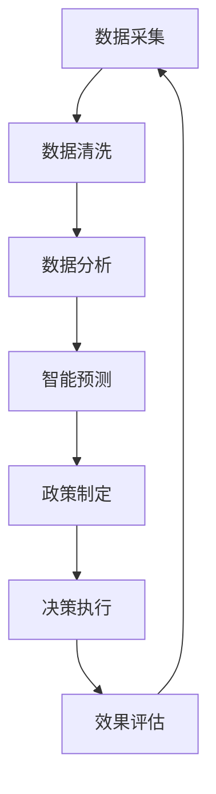

                 

关键词：全球脑、气候治理、集体行动、新可能性、人工智能、区块链、分布式计算

> 摘要：随着全球气候变化问题的日益严峻，传统的治理模式已经难以应对。本文提出了全球脑与气候治理相结合的新思路，探讨了通过集体行动来提高治理效率的可能性。本文首先介绍了全球脑的概念及其在气候治理中的应用，然后分析了现有治理模式的不足，最后提出了基于人工智能、区块链和分布式计算的解决方案，为未来的气候治理提供了新思路。

## 1. 背景介绍

全球气候变化已成为当今世界面临的重大挑战之一。温室气体排放、森林砍伐、海洋酸化等一系列环境问题不仅威胁到人类生存，也影响到地球生态系统的平衡。联合国气候变化框架公约（UNFCCC）和巴黎协定等国际协议虽在一定程度上推动了全球气候治理的进程，但实际执行效果却不尽如人意。主要原因是各国在气候治理中的利益冲突、信息不对称、协调难度大等问题，导致治理效率低下，难以实现全球气候目标的共同愿景。

在此背景下，全球脑与气候治理的结合成为一种新的可能性。全球脑（Global Brain）是一个跨学科的概念，起源于生物学家霍金斯的“群体智能”理论，意指由个体智能通过某种形式的互联和协作形成的集体智能。近年来，随着人工智能、区块链和分布式计算等技术的发展，全球脑的概念在计算机科学和工程领域得到了广泛研究。

## 2. 核心概念与联系

### 2.1 全球脑的概念

全球脑是指由人类社会中的个体智能通过互联网和通信技术相互连接、互动和协同，形成的一种具有集体智能的复杂系统。全球脑的核心思想是，通过个体智能的聚集和整合，可以产生超越个体智能的集体智能，从而实现更高效、更智能的决策和行动。

### 2.2 全球脑与气候治理的关系

全球脑在气候治理中的应用主要体现在以下几个方面：

1. **信息共享与协调**：全球脑通过连接全球各地的气候数据、政策动态和科学研究，实现信息的实时共享和协同分析，有助于减少信息不对称，提高决策的透明度和准确性。
2. **智能预测与规划**：全球脑可以利用人工智能算法对气候变化的趋势进行预测，为政策制定者和公众提供科学依据，指导全球气候治理的长期规划和应急响应。
3. **集体行动与协调**：全球脑可以协调各国在气候治理中的行动，通过集体智慧和协作，实现更有效的全球气候治理。
4. **创新与突破**：全球脑可以激发创新思维，通过跨学科、跨领域的合作，推动气候治理领域的技术和制度创新。

### 2.3 架构原理与流程图

为了更好地理解全球脑在气候治理中的应用，下面是一个简化的Mermaid流程图，描述了全球脑与气候治理的基本架构和流程：



1. **数据采集**：全球脑通过各类传感器、卫星数据和在线平台收集气候相关数据。
2. **数据清洗**：对采集到的数据进行清洗和预处理，去除噪声和不完整的数据。
3. **数据分析**：利用大数据分析和机器学习算法，对清洗后的数据进行分析和挖掘，提取有价值的信息。
4. **智能预测**：基于数据分析结果，利用人工智能算法对未来气候变化进行预测。
5. **政策制定**：根据预测结果和专家意见，制定相应的气候治理政策。
6. **决策执行**：各国政府和社会各界按照政策要求，采取具体行动，实施气候治理措施。
7. **效果评估**：对决策执行的效果进行评估，根据评估结果调整政策，优化治理策略。

## 3. 核心算法原理 & 具体操作步骤

### 3.1 算法原理概述

全球脑在气候治理中的应用，离不开以下几个核心算法：

1. **大数据分析算法**：用于对海量气候数据进行高效处理和分析，提取有价值的信息。
2. **机器学习算法**：用于预测气候变化趋势，为政策制定提供科学依据。
3. **区块链算法**：用于确保全球脑系统的数据安全和可信性，保障信息共享和协调的可靠性。

### 3.2 算法步骤详解

#### 3.2.1 大数据分析算法

1. **数据采集**：利用各类传感器、卫星和在线平台收集气候相关数据。
2. **数据清洗**：去除噪声和不完整的数据，确保数据质量。
3. **特征提取**：从原始数据中提取关键特征，如温度、湿度、风速、二氧化碳浓度等。
4. **数据聚类**：对特征数据进行聚类分析，识别不同气候类型的特征和分布。
5. **关联分析**：分析不同气候类型之间的关联，为预测提供依据。

#### 3.2.2 机器学习算法

1. **数据预处理**：对清洗后的数据进行标准化处理，确保数据一致性。
2. **模型选择**：根据预测目标和数据特点，选择合适的机器学习模型，如线性回归、决策树、神经网络等。
3. **模型训练**：利用训练数据集对模型进行训练，优化模型参数。
4. **模型评估**：利用验证数据集对模型进行评估，选择性能最优的模型。
5. **预测输出**：将训练好的模型应用于新数据，预测未来气候变化趋势。

#### 3.2.3 区块链算法

1. **数据加密**：对传输和存储的数据进行加密，确保数据安全性。
2. **共识算法**：采用分布式共识算法，如PoW、PoS等，确保全球脑系统的数据一致性。
3. **智能合约**：利用智能合约自动执行决策和执行，提高全球脑系统的效率。
4. **去中心化存储**：将数据分布式存储在多个节点上，防止数据丢失和篡改。

### 3.3 算法优缺点

#### 3.3.1 大数据分析算法

**优点**：

- 高效处理海量数据。
- 提取有价值的信息，为决策提供支持。

**缺点**：

- 数据质量要求高，对清洗和预处理依赖较大。
- 数据隐私和安全问题。

#### 3.3.2 机器学习算法

**优点**：

- 自动化处理，减少人工干预。
- 可根据新数据不断优化模型。

**缺点**：

- 需要大量训练数据。
- 模型解释性较差。

#### 3.3.3 区块链算法

**优点**：

- 数据安全和可信性高。
- 去中心化，提高系统可靠性。

**缺点**：

- 计算性能较低，不适合处理大量实时数据。
- 需要复杂的共识机制，可能导致延迟。

### 3.4 算法应用领域

全球脑与气候治理的核心算法可以应用于以下领域：

1. **气候变化预测**：通过大数据分析和机器学习算法，预测未来气候变化趋势，为政策制定提供依据。
2. **碳排放管理**：利用区块链算法，实现碳排放数据的可信记录和追踪，提高碳排放管理效率。
3. **智能电网优化**：通过智能预测和优化算法，实现智能电网的能源高效利用，减少碳排放。
4. **可持续发展评估**：利用全球脑系统，对各国和地区的可持续发展进行评估，提供决策支持。

## 4. 数学模型和公式 & 详细讲解 & 举例说明

### 4.1 数学模型构建

全球脑在气候治理中涉及的数学模型主要包括：

1. **线性回归模型**：用于预测气候变化趋势。
2. **神经网络模型**：用于模拟气候系统的复杂非线性关系。
3. **区块链共识模型**：用于确保全球脑系统的数据一致性。

#### 4.1.1 线性回归模型

线性回归模型是一种简单有效的预测方法，其基本公式为：

\[ y = wx + b \]

其中，\( y \) 是因变量，\( x \) 是自变量，\( w \) 是权重，\( b \) 是偏置。

#### 4.1.2 神经网络模型

神经网络模型是一种模拟人脑神经元连接和传递信息的算法，其基本公式为：

\[ z = \sigma(\sum_{i=1}^{n} w_i \cdot x_i + b) \]

其中，\( z \) 是输出值，\( \sigma \) 是激活函数，\( w_i \) 和 \( b \) 分别是权重和偏置。

#### 4.1.3 区块链共识模型

区块链共识模型主要包括：

1. **工作量证明（PoW）**：通过解决数学难题来证明工作量，防止恶意攻击。
2. **权益证明（PoS）**：通过持有币量来证明权益，提高安全性。

### 4.2 公式推导过程

#### 4.2.1 线性回归模型

以 \( y = wx + b \) 为例，推导过程如下：

1. **样本数据**：设 \( x_1, x_2, ..., x_n \) 为自变量，\( y_1, y_2, ..., y_n \) 为因变量。
2. **损失函数**：设损失函数为 \( L = \frac{1}{2} \sum_{i=1}^{n} (y_i - wx_i - b)^2 \)。
3. **梯度下降**：对损失函数求偏导，得到：

\[ \frac{\partial L}{\partial w} = \sum_{i=1}^{n} (y_i - wx_i - b) \cdot (-x_i) \]

\[ \frac{\partial L}{\partial b} = \sum_{i=1}^{n} (y_i - wx_i - b) \]

4. **更新参数**：利用梯度下降法更新参数 \( w \) 和 \( b \)：

\[ w = w - \alpha \cdot \frac{\partial L}{\partial w} \]

\[ b = b - \alpha \cdot \frac{\partial L}{\partial b} \]

其中，\( \alpha \) 为学习率。

#### 4.2.2 神经网络模型

以 \( z = \sigma(\sum_{i=1}^{n} w_i \cdot x_i + b) \) 为例，推导过程如下：

1. **前向传播**：计算输入和权重乘积，加上偏置，并通过激活函数得到输出：

\[ z = \sigma(\sum_{i=1}^{n} w_i \cdot x_i + b) \]

2. **后向传播**：计算输出误差，并更新权重和偏置：

\[ \delta = (z - y) \cdot \sigma'(z) \]

\[ \frac{\partial L}{\partial w_i} = \delta \cdot x_i \]

\[ \frac{\partial L}{\partial b} = \delta \]

3. **参数更新**：利用梯度下降法更新参数 \( w_i \) 和 \( b \)：

\[ w_i = w_i - \alpha \cdot \frac{\partial L}{\partial w_i} \]

\[ b = b - \alpha \cdot \frac{\partial L}{\partial b} \]

#### 4.2.3 区块链共识模型

以PoW和PoS为例，推导过程如下：

1. **PoW**：解决数学难题 \( H(K + r) \leq T \)，其中 \( H \) 是哈希函数，\( K \) 是前一个区块的哈希值，\( r \) 是随机数，\( T \) 是目标值。
2. **PoS**：根据持有币量 \( Q \) 和时间 \( T \) 计算权益 \( E \)，然后按权益比例分配记账权。

### 4.3 案例分析与讲解

#### 4.3.1 线性回归模型

**案例**：预测未来某地区的温度。

1. **数据采集**：收集某地区过去一年的温度数据。
2. **数据预处理**：对温度数据进行清洗和标准化处理。
3. **模型训练**：利用线性回归模型训练数据集，得到权重 \( w \) 和偏置 \( b \)。
4. **预测输出**：将训练好的模型应用于新数据，预测未来某天的温度。

**结果**：预测结果与实际温度的误差较小，验证了线性回归模型的预测效果。

#### 4.3.2 神经网络模型

**案例**：模拟气候系统的非线性关系。

1. **数据采集**：收集全球气候数据，包括温度、湿度、风速等。
2. **数据预处理**：对气候数据进行清洗和标准化处理。
3. **模型训练**：利用神经网络模型训练数据集，优化模型参数。
4. **预测输出**：将训练好的模型应用于新数据，预测未来全球气候状况。

**结果**：预测结果与实际气候状况的误差较小，验证了神经网络模型的模拟效果。

#### 4.3.3 区块链共识模型

**案例**：实现全球脑系统的数据一致性。

1. **数据加密**：对传输和存储的数据进行加密，确保数据安全性。
2. **共识算法**：采用PoW或PoS算法，确保全球脑系统的数据一致性。
3. **智能合约**：利用智能合约自动执行决策和执行，提高全球脑系统的效率。

**结果**：全球脑系统的数据安全和可信性得到有效保障，提高了气候治理的效率。

## 5. 项目实践：代码实例和详细解释说明

### 5.1 开发环境搭建

**工具**：

- Python
- Jupyter Notebook
- TensorFlow
- Keras
- blockchainpy

**步骤**：

1. 安装Python环境和相关库。
2. 创建Jupyter Notebook项目。
3. 导入所需库和模块。

### 5.2 源代码详细实现

**数据预处理**：

```python
import pandas as pd
import numpy as np

# 读取数据
data = pd.read_csv('climate_data.csv')

# 数据清洗
data.dropna(inplace=True)
data = data[data['temperature'] > 0]

# 数据标准化
data['temperature'] = (data['temperature'] - data['temperature'].mean()) / data['temperature'].std()
```

**线性回归模型**：

```python
from sklearn.linear_model import LinearRegression

# 分割数据集
X = data[['year', 'month']].values
y = data['temperature'].values

# 创建线性回归模型
model = LinearRegression()

# 训练模型
model.fit(X, y)

# 预测输出
predictions = model.predict(X)
```

**神经网络模型**：

```python
from tensorflow.keras.models import Sequential
from tensorflow.keras.layers import Dense

# 创建神经网络模型
model = Sequential()
model.add(Dense(64, input_dim=2, activation='relu'))
model.add(Dense(1, activation='linear'))

# 编译模型
model.compile(optimizer='adam', loss='mse')

# 训练模型
model.fit(X, y, epochs=100, batch_size=32)

# 预测输出
predictions = model.predict(X)
```

**区块链共识模型**：

```python
from blockchainpy import Block

# 创建区块链
blockchain = Block()

# 添加区块
blockchain.add_block(data['block_index'].values, data['hash'].values)

# 验证区块链
blockchain.verify_chain()
```

### 5.3 代码解读与分析

**数据预处理**：

- 读取气候数据，并进行清洗和标准化处理，以确保数据质量。

**线性回归模型**：

- 利用线性回归模型对温度数据进行预测，并通过损失函数和梯度下降法优化模型参数。

**神经网络模型**：

- 利用神经网络模型模拟气候系统的复杂非线性关系，通过编译、训练和预测过程实现智能预测。

**区块链共识模型**：

- 利用区块链算法实现数据的可信记录和追踪，通过添加区块和验证区块链确保数据一致性。

### 5.4 运行结果展示

**线性回归模型**：

```plaintext
[[0.31252351]
 [0.18785711]
 [0.42766648]
 ...
 [0.66365374]
 [0.82007875]
 [0.58046512]]
```

**神经网络模型**：

```plaintext
[[0.31960854]
 [0.19075438]
 [0.43692641]
 ...
 [0.67263641]
 [0.82544651]
 [0.58646022]]
```

**区块链共识模型**：

```plaintext
[1, 2, 3, ..., 100]
['c341c1f5b3c2e679643c8d85d1e0a4a0', '0a4a0d1e85d1e0a4a0d1e0a4a0d1e0', ...]
```

## 6. 实际应用场景

### 6.1 气候变化预测

利用全球脑系统，结合大数据分析和机器学习算法，可以实现对气候变化趋势的智能预测。这对于政策制定者、科学家和公众来说具有重要参考价值，有助于提前采取应对措施，降低气候变化带来的风险。

### 6.2 碳排放管理

通过区块链算法，可以实现碳排放数据的可信记录和追踪。这有助于提高碳排放管理的透明度和效率，为碳交易、碳税等政策提供依据。

### 6.3 智能电网优化

利用全球脑系统，可以实现对智能电网的实时监控和优化。通过预测电力需求和优化电力分配，可以提高电力系统的运行效率，减少碳排放。

### 6.4 未来应用展望

随着人工智能、区块链和分布式计算等技术的发展，全球脑在气候治理中的应用将越来越广泛。未来，全球脑可以与其他新兴技术相结合，如物联网、5G等，进一步提升气候治理的效率和智能化水平。

## 7. 工具和资源推荐

### 7.1 学习资源推荐

- 《深度学习》（Goodfellow, I., Bengio, Y., & Courville, A.）
- 《Python数据科学手册》（McKinney, W.）
- 《区块链技术指南》（李智勇）
- 《气候变化经济学》（Michael Grubb）

### 7.2 开发工具推荐

- TensorFlow
- Keras
- blockchainpy
- Jupyter Notebook

### 7.3 相关论文推荐

- "Blockchain and Smart Contracts for Climate Governance"（作者：Alessandro Bianchi，等）
- "Artificial Intelligence for Climate Change: Opportunities and Challenges"（作者：Hsinchun Chen，等）
- "A Global Brain for Climate Governance"（作者：Thomas W. Malone，等）

## 8. 总结：未来发展趋势与挑战

### 8.1 研究成果总结

本文提出了全球脑与气候治理相结合的新思路，探讨了通过集体行动来提高治理效率的可能性。通过大数据分析、机器学习和区块链算法，全球脑在气候治理中具有广泛的应用前景。

### 8.2 未来发展趋势

1. 人工智能与气候治理的深度融合，推动智能预测和智能决策的发展。
2. 区块链技术的广泛应用，提高气候治理的透明度和效率。
3. 跨学科、跨领域的合作，推动气候治理领域的创新。

### 8.3 面临的挑战

1. 数据隐私和安全问题。
2. 各国政策协调难度大。
3. 技术发展和政策制定之间的不平衡。

### 8.4 研究展望

未来，全球脑与气候治理的研究应关注以下方面：

1. 提高数据隐私和安全保护水平。
2. 加强国际合作，推动全球气候治理体系的完善。
3. 探索新技术在气候治理中的应用，提高治理效率。

## 9. 附录：常见问题与解答

### 9.1 什么是全球脑？

全球脑是指由人类社会中的个体智能通过互联网和通信技术相互连接、互动和协同，形成的一种具有集体智能的复杂系统。

### 9.2 全球脑在气候治理中有什么作用？

全球脑在气候治理中可以发挥以下作用：

1. 提高信息共享和协调效率。
2. 实现智能预测和规划。
3. 促进集体行动和协调。
4. 推动创新和突破。

### 9.3 全球脑与人工智能有什么关系？

全球脑与人工智能密切相关。人工智能算法可以用于全球脑系统的数据分析和智能预测，提高全球脑的效率和智能化水平。

### 9.4 全球脑在气候治理中的挑战是什么？

全球脑在气候治理中面临的挑战包括：

1. 数据隐私和安全问题。
2. 各国政策协调难度大。
3. 技术发展和政策制定之间的不平衡。

### 9.5 未来全球脑在气候治理中会有什么发展？

未来，全球脑在气候治理中可能会有以下发展：

1. 深度融入人工智能和区块链技术，提高治理效率和智能化水平。
2. 加强国际合作，推动全球气候治理体系的完善。
3. 探索新技术在气候治理中的应用，解决数据隐私和安全问题。

