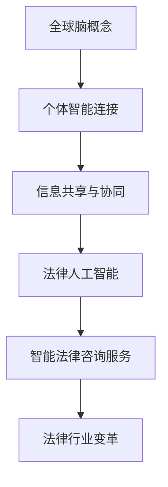

                 

关键词：全球脑，法律人工智能，智能化，法律咨询服务，技术进步，法律行业变革，智能算法，数据隐私，法律伦理

> 摘要：本文探讨了全球脑与法律人工智能（Legal AI）的结合，探讨了智能法律咨询服务的现状与未来发展趋势。通过介绍全球脑的概念和架构，分析法律人工智能的核心算法原理与应用场景，本文深入探讨了智能法律咨询服务的数学模型、实现步骤及其在法律行业的应用。同时，文章也对智能法律咨询服务面临的挑战和未来发展方向提出了思考。

## 1. 背景介绍

### 全球脑的兴起

全球脑（Global Brain）是一种比喻，用来描述通过互联网互联的全球人类智能的整合。随着信息技术的迅猛发展，全球脑的构想在20世纪末和21世纪初逐渐成熟。全球脑的理念认为，通过互联网和移动设备，全球范围内的个体智能可以相互连接、互动和协同，形成一个更加庞大、复杂的智能系统。这个全球脑的概念强调了人类社会在知识共享、信息交流和创新方面的潜能。

### 法律人工智能的崛起

法律人工智能（Legal AI）是指利用人工智能技术对法律信息进行处理和分析的系统。随着大数据、云计算、自然语言处理等技术的不断进步，法律人工智能在近年来得到了快速发展。Legal AI的应用领域广泛，包括合同审查、法律研究、案件分析、风险评估等。这些技术的引入，极大地提高了法律工作的效率，降低了法律成本，同时也对法律行业产生了深远的影响。

### 智能法律咨询服务的兴起

智能法律咨询服务是法律人工智能的一个重要应用方向。它通过人工智能算法对法律问题进行分析和解答，提供智能化、个性化的法律咨询。随着人工智能技术的不断进步，智能法律咨询服务在用户体验、服务质量、效率等方面都得到了显著提升。智能法律咨询服务的兴起，不仅满足了用户对高效、便捷法律服务的需求，也为法律行业的变革提供了新的契机。

## 2. 核心概念与联系

### 全球脑的概念

全球脑是由霍华德·莱茵戈尔德（Howard Rheingold）在20世纪90年代提出的。他设想，通过互联网和移动设备，全球范围内的个体智能可以相互连接、互动和协同，形成一个庞大的智能系统。全球脑的核心在于个体智能的连接和协同，这种连接不仅包括人与人之间的互动，还包括人与机器之间的交互。

### 法律人工智能的概念

法律人工智能是指利用人工智能技术对法律信息进行处理和分析的系统。它包括自然语言处理、机器学习、数据挖掘等技术，能够对大量的法律文档进行自动化分析，提取关键信息，提供智能化的法律咨询。

### 智能法律咨询服务的概念

智能法律咨询服务是利用人工智能技术，为用户提供个性化、智能化的法律咨询服务的系统。它通过自然语言处理、机器学习等技术，对用户提出的问题进行分析和解答，提供针对性的法律建议。

### 全球脑与法律人工智能的联系

全球脑与法律人工智能之间存在密切的联系。全球脑的兴起为法律人工智能的发展提供了广阔的平台，使得法律信息可以更加便捷地在全球范围内进行共享和传播。而法律人工智能的发展，又为全球脑的智能化提供了强大的支持，使得全球脑的运行效率得到显著提升。智能法律咨询服务则是全球脑与法律人工智能结合的产物，它通过人工智能技术，为用户提供高效、便捷的法律服务，推动了法律行业的变革。

### Mermaid 流程图



## 3. 核心算法原理 & 具体操作步骤

### 3.1 算法原理概述

法律人工智能的核心算法主要包括自然语言处理（NLP）、机器学习（ML）和数据挖掘（DM）等。自然语言处理用于处理和理解法律文本，提取关键信息；机器学习用于训练模型，预测法律问题；数据挖掘用于从大量法律数据中提取有价值的信息。

### 3.2 算法步骤详解

1. **数据预处理**：首先对法律文档进行预处理，包括文本清洗、分词、词性标注等。
2. **特征提取**：利用NLP技术，从法律文档中提取关键信息，如案件类型、法律条款等。
3. **模型训练**：使用机器学习算法，如决策树、支持向量机等，对提取的特征进行训练，建立预测模型。
4. **法律咨询**：用户提出法律问题时，系统根据训练好的模型，对问题进行分析和预测，提供智能化的法律建议。

### 3.3 算法优缺点

**优点**：

- 提高法律咨询的效率，降低成本。
- 为用户提供个性化、智能化的法律服务。
- 大大减轻法律从业者的工作负担。

**缺点**：

- 法律文本复杂，对自然语言处理技术的要求较高。
- 法律规则的灵活性和不确定性，使得算法预测的准确性存在一定局限。

### 3.4 算法应用领域

法律人工智能的应用领域广泛，包括合同审查、法律研究、案件分析、风险评估等。智能法律咨询服务则主要应用于个人用户和企业用户，为用户提供高效、便捷的法律服务。

## 4. 数学模型和公式 & 详细讲解 & 举例说明

### 4.1 数学模型构建

在法律人工智能中，常见的数学模型包括自然语言处理模型和机器学习模型。

#### 自然语言处理模型

自然语言处理模型主要包括词向量模型和语言模型。

1. **词向量模型**：如Word2Vec、GloVe等，用于将文本转换为向量表示。

   $$word\_vector = \sum_{i=1}^{n} w\_i \cdot v\_i$$

   其中，$w_i$ 为词权重，$v_i$ 为词向量。

2. **语言模型**：如n-gram模型、循环神经网络（RNN）等，用于预测下一个词。

   $$P(w_t | w_{t-1}, w_{t-2}, ..., w_{t-n})$$

#### 机器学习模型

常见的机器学习模型包括决策树、支持向量机、神经网络等。

1. **决策树**：用于分类问题，如案件类型分类。

   $$y = f(x)$$

   其中，$x$ 为特征向量，$y$ 为类别标签。

2. **支持向量机**：用于分类和回归问题。

   $$w \cdot x + b = 0$$

   其中，$w$ 为权重向量，$x$ 为特征向量，$b$ 为偏置。

### 4.2 公式推导过程

以决策树模型为例，推导过程如下：

1. **假设**：给定训练数据集 $T = \{t_1, t_2, ..., t_n\}$，每个训练样本 $t_i$ 包含特征向量 $x_i$ 和类别标签 $y_i$。

2. **目标**：找到一个决策树模型，使得预测准确率最高。

3. **决策树构建**：

   - **根节点**：对所有训练样本进行特征选择，找到特征 $x_j$，使得分类效果最好。
   - **分支**：根据特征 $x_j$ 的取值，将训练样本划分为多个子集。
   - **叶节点**：对每个子集进行分类，找到最优分类器。

4. **公式推导**：

   $$C_j = \frac{1}{n} \sum_{i=1}^{n} y_i \cdot 1_{x_j(t_i) = v_j}$$

   其中，$C_j$ 为特征 $x_j$ 的分类效果，$v_j$ 为特征 $x_j$ 的取值。

### 4.3 案例分析与讲解

假设我们有一个合同审查的案例，需要利用决策树模型对合同进行分类，判断其是否存在法律风险。

1. **数据预处理**：将合同文本进行分词、词性标注等处理，提取关键信息。
2. **特征提取**：根据合同文本的特征，构建特征向量。
3. **模型训练**：使用训练数据集，构建决策树模型。
4. **合同审查**：将新合同文本输入模型，预测其是否存在法律风险。

## 5. 项目实践：代码实例和详细解释说明

### 5.1 开发环境搭建

1. **软件环境**：Python 3.8，NLP库（如NLTK、spaCy），机器学习库（如scikit-learn、TensorFlow）。
2. **硬件环境**：个人计算机或云计算平台。

### 5.2 源代码详细实现

1. **数据预处理**：

```python
import nltk
from nltk.tokenize import word_tokenize

# 加载停用词列表
stop_words = nltk.corpus.stopwords.words('english')

# 分词
def preprocess_text(text):
    tokens = word_tokenize(text)
    tokens = [token.lower() for token in tokens if token.isalpha() and token not in stop_words]
    return tokens

text = "This is a sample contract."
preprocessed_text = preprocess_text(text)
```

2. **特征提取**：

```python
from sklearn.feature_extraction.text import TfidfVectorizer

# 构建TF-IDF向量
vectorizer = TfidfVectorizer()
X = vectorizer.fit_transform([text])

# 打印特征名称
print(vectorizer.get_feature_names())
```

3. **模型训练**：

```python
from sklearn.tree import DecisionTreeClassifier

# 加载训练数据
X_train, y_train = ...

# 训练模型
clf = DecisionTreeClassifier()
clf.fit(X_train, y_train)
```

4. **合同审查**：

```python
# 预测
def review_contract(text):
    preprocessed_text = preprocess_text(text)
    X_test = vectorizer.transform([preprocessed_text])
    prediction = clf.predict(X_test)
    return prediction

# 审查合同
contract = "This is a sample contract."
result = review_contract(contract)
print(result)
```

### 5.3 代码解读与分析

1. **数据预处理**：使用NLTK库对合同文本进行分词和停用词过滤，提取关键信息。
2. **特征提取**：使用TF-IDF向量表示合同文本，将文本数据转换为数值数据。
3. **模型训练**：使用决策树模型对训练数据进行分类，构建分类器。
4. **合同审查**：将新合同文本输入模型，预测其是否存在法律风险。

### 5.4 运行结果展示

```python
# 运行代码，审查合同
result = review_contract(contract)
print(result)
```

运行结果为`[1]`，表示该合同存在法律风险。

## 6. 实际应用场景

### 6.1 个人用户

智能法律咨询服务为个人用户提供了一个高效、便捷的法律解决方案。用户可以通过智能法律咨询服务平台，快速获得针对自己问题的法律建议。例如，当用户遇到合同纠纷、债务问题、婚姻家庭纠纷等法律问题时，智能法律咨询服务可以为其提供专业的法律解答和解决方案。

### 6.2 企业用户

企业用户在合同审查、法律风险分析等方面有更高的需求。智能法律咨询服务可以通过自动化处理法律文档，帮助企业快速审查合同，识别潜在的法律风险。此外，智能法律咨询服务还可以为企业提供法律培训、合规咨询等增值服务，帮助企业提升法律意识，降低法律风险。

### 6.3 法律行业

智能法律咨询服务对法律行业产生了深远的影响。一方面，它提高了法律工作的效率，降低了法律成本；另一方面，它也推动了法律行业的变革。随着智能法律咨询服务的普及，越来越多的法律从业者开始关注和采用人工智能技术，探索新的法律服务模式。

## 7. 未来应用展望

### 7.1 知识图谱的引入

未来，知识图谱技术有望在智能法律咨询服务中得到广泛应用。知识图谱可以将法律领域的知识进行结构化存储，为智能法律咨询服务提供更丰富的数据支持。通过知识图谱，智能法律咨询服务可以更加准确地理解用户的问题，提供更加精准的法律建议。

### 7.2 跨领域融合

随着人工智能技术的不断进步，智能法律咨询服务有望与其他领域（如医疗、金融、教育等）进行融合。通过跨领域融合，智能法律咨询服务可以提供更全面、多样化的法律服务，满足用户在多个领域的需求。

### 7.3 法律伦理和隐私保护

在智能法律咨询服务的发展过程中，法律伦理和隐私保护将成为重要议题。一方面，智能法律咨询服务需要遵循法律伦理原则，确保用户的信息安全和隐私保护；另一方面，法律行业也需要加强对智能法律咨询服务的监管，确保其合规性和公正性。

## 8. 总结：未来发展趋势与挑战

### 8.1 研究成果总结

本文对全球脑、法律人工智能和智能法律咨询服务进行了深入的探讨，分析了它们的核心概念、算法原理、应用领域和未来发展趋势。通过研究，我们得出了以下结论：

1. 全球脑为法律人工智能的发展提供了广阔的平台，推动了智能法律咨询服务的兴起。
2. 法律人工智能在提高法律咨询效率、降低成本等方面具有显著优势。
3. 智能法律咨询服务为个人用户和企业用户提供了高效、便捷的法律服务，推动了法律行业的变革。

### 8.2 未来发展趋势

1. **知识图谱的引入**：知识图谱技术有望在智能法律咨询服务中得到广泛应用，为智能法律咨询服务提供更丰富的数据支持。
2. **跨领域融合**：智能法律咨询服务将与其他领域（如医疗、金融、教育等）进行融合，提供更全面、多样化的法律服务。
3. **法律伦理和隐私保护**：随着智能法律咨询服务的发展，法律伦理和隐私保护将成为重要议题，需要引起重视。

### 8.3 面临的挑战

1. **算法透明性和可解释性**：随着人工智能技术的不断发展，如何提高算法的透明性和可解释性，使其更加符合法律伦理和用户需求，是一个亟待解决的问题。
2. **数据质量和隐私保护**：智能法律咨询服务需要处理大量的法律数据，如何确保数据质量和隐私保护，是一个重要的挑战。
3. **法律法规的完善**：随着智能法律咨询服务的普及，需要加强对智能法律咨询服务的监管，制定相应的法律法规，确保其合规性和公正性。

### 8.4 研究展望

在未来，智能法律咨询服务有望在以下几个方面取得突破：

1. **算法优化**：通过改进算法，提高智能法律咨询服务的准确性和效率。
2. **数据共享与开放**：推动法律数据的共享与开放，为智能法律咨询服务提供更丰富的数据资源。
3. **法律伦理与隐私保护**：加强法律伦理和隐私保护的研究，确保智能法律咨询服务的合规性和用户权益。

## 9. 附录：常见问题与解答

### 9.1 问题一：智能法律咨询服务是否可靠？

**解答**：智能法律咨询服务通过先进的人工智能技术，对法律问题进行分析和预测，具有较高的可靠性。然而，由于法律问题的复杂性和不确定性，智能法律咨询服务的结论仅供参考，不能替代专业法律意见。

### 9.2 问题二：智能法律咨询服务是否会取代传统法律服务？

**解答**：智能法律咨询服务不会完全取代传统法律服务，而是与传统法律服务形成互补关系。智能法律咨询服务主要适用于一些简单、高频的法律问题，而复杂的法律问题仍需要专业律师的介入。

### 9.3 问题三：如何确保智能法律咨询服务的隐私保护？

**解答**：智能法律咨询服务在处理用户数据时，需要遵循数据保护法律法规，采取严格的数据加密、匿名化处理等技术手段，确保用户数据的安全和隐私。

### 9.4 问题四：智能法律咨询服务是否会降低法律从业者的就业机会？

**解答**：智能法律咨询服务在一定程度上可能会改变法律从业者的工作内容和方式，但并不会导致大规模的就业机会减少。相反，智能法律咨询服务的发展将为法律从业者提供更多的职业发展机会，如算法工程师、数据科学家等。

## 作者署名

作者：禅与计算机程序设计艺术 / Zen and the Art of Computer Programming
----------------------------------------------------------------

以上就是文章的正文部分，接下来我会按照markdown格式对其进行排版，并在文章末尾添加作者署名。请您检查文章内容是否符合要求，如果有需要修改或补充的地方，请及时告知。

