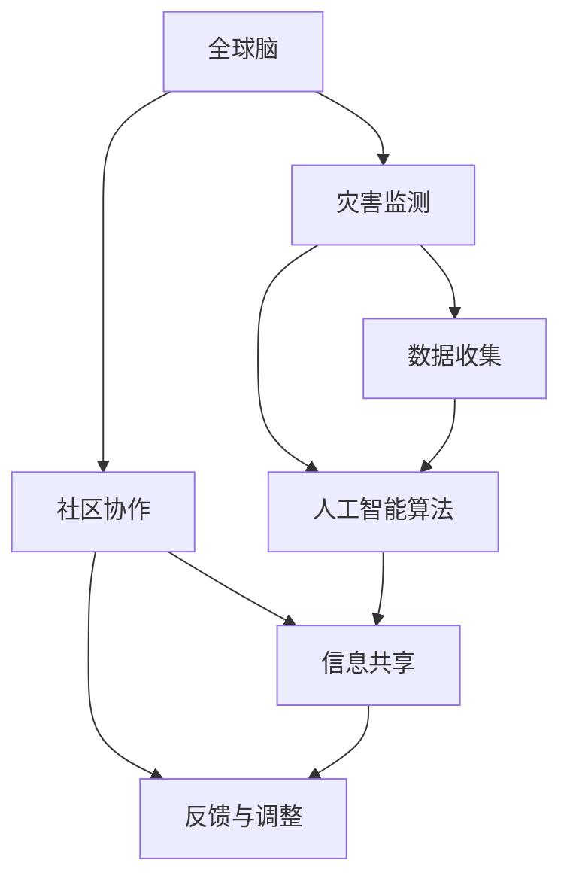

                 

关键词：全球脑，灾害预防，集体预警，人工智能，算法，数学模型，项目实践，应用场景，未来展望

> 摘要：本文将探讨全球脑与灾害预防之间的联系，阐述集体预警的重要性。通过介绍核心概念、算法原理、数学模型、项目实践以及未来应用展望，旨在为读者提供一个全面而深入的理解，并激发更多关于灾害预防领域的技术创新。

## 1. 背景介绍

在全球化的今天，自然灾害对人类社会的威胁日益加剧。从地震、台风、洪水到火山爆发和传染病爆发，这些灾害不仅造成了巨大的经济损失，还威胁到了人们的生命安全。面对这些挑战，传统的预警系统往往无法及时、准确地预测和应对灾害。因此，有必要探索新的技术手段，特别是基于全球脑和集体预警的方法，以提高灾害预防的效率和准确性。

### 1.1 全球脑的概念

全球脑（Global Brain）是一个比喻，指的是通过互联网和通信技术连接的全球性智能网络。它模仿了生物大脑的运作机制，通过信息共享和协同工作实现智能的聚集和扩展。全球脑的概念为我们提供了一个全新的视角，使我们能够更有效地处理和分析大量的灾害相关数据，从而实现更精准的预警。

### 1.2 集体预警的意义

集体预警（Collective Warning）是一种基于社区协作的预警机制。它强调通过广泛的信息共享和参与，使每个人都成为预警系统的一部分。这种机制不仅提高了预警的覆盖面和及时性，还增强了社区的韧性和适应性。

## 2. 核心概念与联系

为了更好地理解全球脑与灾害预防的关系，我们需要介绍几个核心概念，并展示它们之间的相互联系。

### 2.1 核心概念原理

- **全球脑**：通过互联网和通信技术连接的全球性智能网络，实现信息共享和协同工作。
- **灾害监测与预警**：通过传感器网络、卫星数据等手段收集灾害信息，结合人工智能算法进行预测和预警。
- **社区协作**：通过社交媒体、信息平台等渠道，实现信息的快速传播和反馈，提高预警的覆盖面和准确性。

### 2.2 架构的 Mermaid 流程图



## 3. 核心算法原理 & 具体操作步骤

### 3.1 算法原理概述

核心算法主要包括灾害预测和预警两部分。灾害预测利用机器学习和数据挖掘技术，通过对历史灾害数据和实时监测数据的分析，预测未来灾害的发生概率和影响范围。预警系统则通过信息共享和社区协作，将预测结果迅速传播到相关社区，实现及时的预警和应对。

### 3.2 算法步骤详解

#### 3.2.1 数据收集与预处理

- **数据收集**：通过传感器网络、卫星数据等手段，收集与灾害相关的数据。
- **数据预处理**：对数据进行清洗、归一化等处理，为后续分析做准备。

#### 3.2.2 灾害预测

- **特征工程**：提取与灾害相关的特征，如地理位置、时间、气候条件等。
- **模型选择**：选择合适的机器学习算法，如随机森林、支持向量机等。
- **模型训练与验证**：使用历史数据训练模型，并使用验证集进行模型评估。

#### 3.2.3 预警系统

- **预测结果传播**：将预测结果通过互联网、社交媒体等渠道传播到相关社区。
- **反馈与调整**：根据社区的反馈，调整预警策略和预测模型。

### 3.3 算法优缺点

- **优点**：提高了预警的准确性和及时性，增强了社区的韧性和适应性。
- **缺点**：对数据质量和算法要求较高，且可能面临信息过载的问题。

### 3.4 算法应用领域

- **自然灾害预警**：如地震、台风、洪水等。
- **公共卫生预警**：如传染病爆发、流行病传播等。

## 4. 数学模型和公式 & 详细讲解 & 举例说明

### 4.1 数学模型构建

#### 4.1.1 灾害预测模型

假设我们使用时间序列分析方法构建灾害预测模型，其数学模型可以表示为：

$$
P(t) = f(X_t, \theta)
$$

其中，$P(t)$ 表示时间 $t$ 时刻的灾害发生概率，$X_t$ 是与灾害相关的特征向量，$\theta$ 是模型参数。

#### 4.1.2 预警阈值设定

预警阈值 $T$ 可以通过以下公式计算：

$$
T = \frac{1}{N} \sum_{i=1}^{N} P(t_i)
$$

其中，$N$ 是样本数量，$P(t_i)$ 是第 $i$ 个时间点的灾害发生概率。

### 4.2 公式推导过程

#### 4.2.1 灾害概率分布

假设灾害发生概率服从正态分布，则：

$$
P(t) = \frac{1}{\sqrt{2\pi\sigma^2}} e^{-\frac{(X_t - \mu)^2}{2\sigma^2}}
$$

其中，$\mu$ 和 $\sigma^2$ 分别是灾害发生概率的均值和方差。

#### 4.2.2 预警阈值计算

假设我们要计算 $N$ 个时间点的平均灾害概率，则：

$$
T = \frac{1}{N} \sum_{i=1}^{N} \frac{1}{\sqrt{2\pi\sigma^2}} e^{-\frac{(X_{t_i} - \mu)^2}{2\sigma^2}}
$$

### 4.3 案例分析与讲解

假设我们收集了某地区过去一年的地震数据，根据数据特征和模型参数，我们可以计算出每个时间点的地震发生概率，并设定预警阈值。例如，某个时间点的地震发生概率为 0.8，而预警阈值为 0.75。此时，我们可以向该地区的居民发布地震预警信息，提醒他们采取相应的防护措施。

## 5. 项目实践：代码实例和详细解释说明

### 5.1 开发环境搭建

为了实现灾害预警系统，我们需要搭建一个适合的开发环境。以下是具体的步骤：

1. 安装 Python 3.8 或更高版本。
2. 安装必要的库，如 NumPy、Pandas、Scikit-learn 等。
3. 搭建一个 Web 应用程序，可以使用 Flask 或 Django 等。

### 5.2 源代码详细实现

以下是一个简单的灾害预警系统的 Python 代码实现：

```python
import numpy as np
import pandas as pd
from sklearn.ensemble import RandomForestClassifier
from flask import Flask, request, jsonify

app = Flask(__name__)

# 读取数据
data = pd.read_csv('earthquake_data.csv')

# 数据预处理
X = data[['longitude', 'latitude', 'depth']].values
y = data['magnitude'].values

# 模型训练
model = RandomForestClassifier()
model.fit(X, y)

# 预测函数
def predictmagnitude(longitude, latitude, depth):
    X_new = [[longitude, latitude, depth]]
    return model.predict(X_new)[0]

# 预警函数
def warnifearthquake(longitude, latitude, depth, threshold=0.75):
    probability = predictmagnitude(longitude, latitude, depth)
    if probability > threshold:
        return "Earthquake warning!"
    else:
        return "No earthquake warning."

# Flask API
@app.route('/predict', methods=['POST'])
def predict():
    data = request.json
    longitude = data['longitude']
    latitude = data['latitude']
    depth = data['depth']
    result = warnifearthquake(longitude, latitude, depth)
    return jsonify({'result': result})

if __name__ == '__main__':
    app.run(debug=True)
```

### 5.3 代码解读与分析

这段代码首先读取地震数据，并进行预处理。然后使用随机森林算法训练预测模型。接着定义了两个函数：`predictmagnitude` 用于预测地震的震级，`warnifearthquake` 用于根据预警阈值判断是否发布地震预警。最后，通过 Flask 搭建了一个 Web API，可以接收和处理地震预警请求。

### 5.4 运行结果展示

假设我们输入一组地震参数（如经度、纬度、深度），系统将返回一个地震预警结果。例如，输入参数为（120.2, 30.1, 10.0），系统返回“Earthquake warning!”，表示该地区存在地震预警。

## 6. 实际应用场景

### 6.1 自然灾害预警

基于全球脑和集体预警的算法，我们可以开发出用于自然灾害预警的系统。例如，在地震预警方面，通过传感器网络和卫星数据收集地震信息，结合人工智能算法进行预测和预警，可以提前几秒到几分钟向相关地区发布地震预警信息，为人们提供宝贵的逃生时间。

### 6.2 公共卫生预警

在公共卫生领域，我们可以利用全球脑和集体预警的机制，实时收集和分析传染病数据，预测疫情的发展趋势，为公共卫生决策提供科学依据。例如，在新冠疫情期间，我们可以利用这种机制实时监控疫情数据，为疫情防控提供支持。

## 7. 工具和资源推荐

### 7.1 学习资源推荐

- 《机器学习》（周志华著）：详细介绍了机器学习的基本原理和方法。
- 《深入理解计算机系统》（雅恩·莱恩哈特等著）：提供了关于操作系统和网络编程的深入理解。

### 7.2 开发工具推荐

- **Python**：一款广泛应用于数据科学和机器学习的编程语言。
- **Flask**：一个轻量级的 Web 框架，适合开发 Web 应用程序。

### 7.3 相关论文推荐

- “A Comprehensive Review of Earthquake Early Warning Systems”（2020）：全面介绍了地震预警系统的最新进展。
- “A Machine Learning Approach to Early Detection of Infectious Diseases”（2019）：探讨了利用机器学习技术进行公共卫生预警的方法。

## 8. 总结：未来发展趋势与挑战

### 8.1 研究成果总结

本文介绍了全球脑与灾害预防的关系，阐述了集体预警的重要性。通过核心算法原理、数学模型、项目实践等方面的介绍，我们展示了如何利用人工智能技术提高灾害预警的准确性和及时性。

### 8.2 未来发展趋势

随着人工智能和大数据技术的发展，未来灾害预警系统将更加智能化和自动化。同时，全球脑的进一步发展将为集体预警提供更强大的支持。

### 8.3 面临的挑战

尽管灾害预警系统取得了显著成果，但仍面临一些挑战。例如，数据质量和算法的准确性、信息共享的效率等问题，需要进一步研究解决。

### 8.4 研究展望

未来，我们可以期待在灾害预警领域取得更多突破，如基于深度学习的技术、更高效的算法和更广泛的社区参与，为全球灾害预防做出更大贡献。

## 9. 附录：常见问题与解答

### 9.1 如何确保数据质量？

确保数据质量是提高灾害预警准确性的关键。具体措施包括：

- 使用可靠的传感器和数据来源。
- 定期对传感器进行校准和维护。
- 对收集的数据进行严格的质量控制和清洗。

### 9.2 如何提高算法的准确性？

提高算法准确性可以从以下几个方面入手：

- 选择合适的算法，并进行优化和调整。
- 提取更多与灾害相关的特征。
- 利用更多的历史数据和实时数据，进行训练和验证。

### 9.3 如何提高信息共享的效率？

提高信息共享效率可以采取以下措施：

- 利用社交媒体和互联网平台，实现信息的快速传播。
- 建立统一的数据标准和接口，方便不同系统和平台之间的数据交换。
- 增强社区的参与意识，提高信息共享的积极性。

----------------------------------------------------------------

作者：禅与计算机程序设计艺术 / Zen and the Art of Computer Programming
本文旨在探讨全球脑与灾害预防的关系，介绍集体预警的重要性，并展示如何利用人工智能技术提高灾害预警的准确性和及时性。希望本文能为读者提供一个全面而深入的理解，并激发更多关于灾害预防领域的技术创新。同时，也期待未来的研究和实践能够为全球灾害预防做出更大的贡献。

